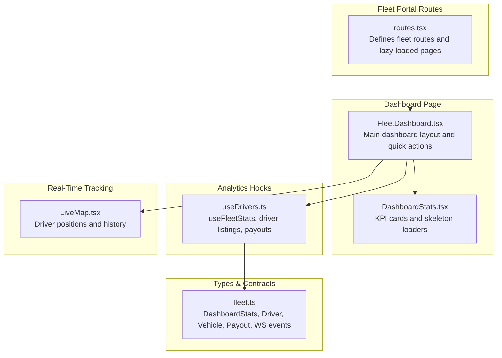
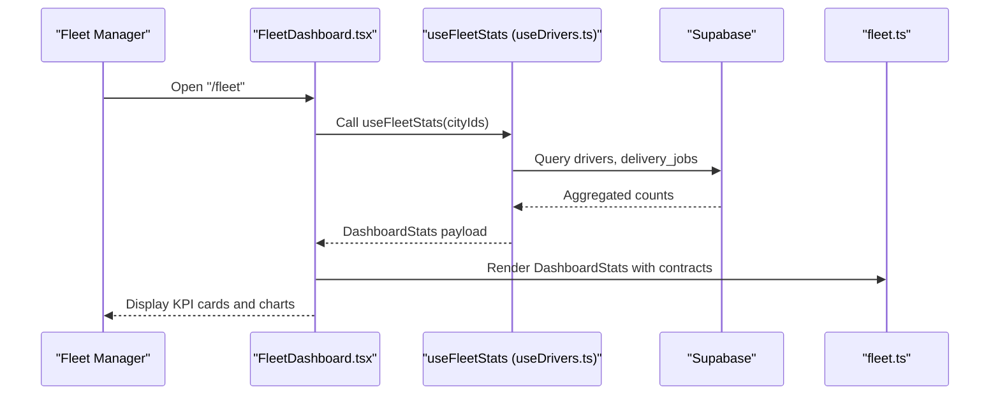
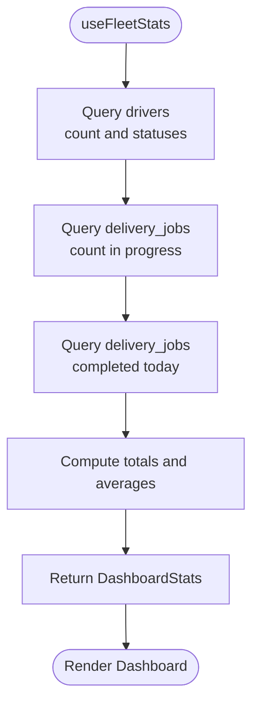
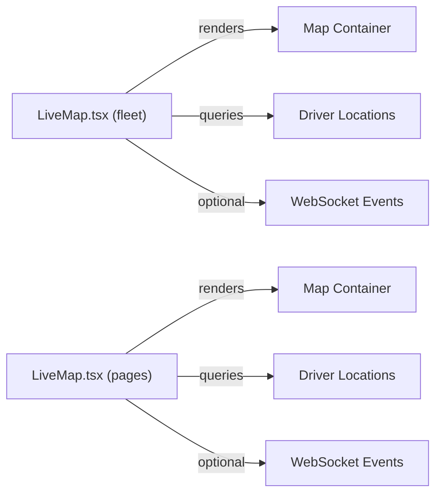
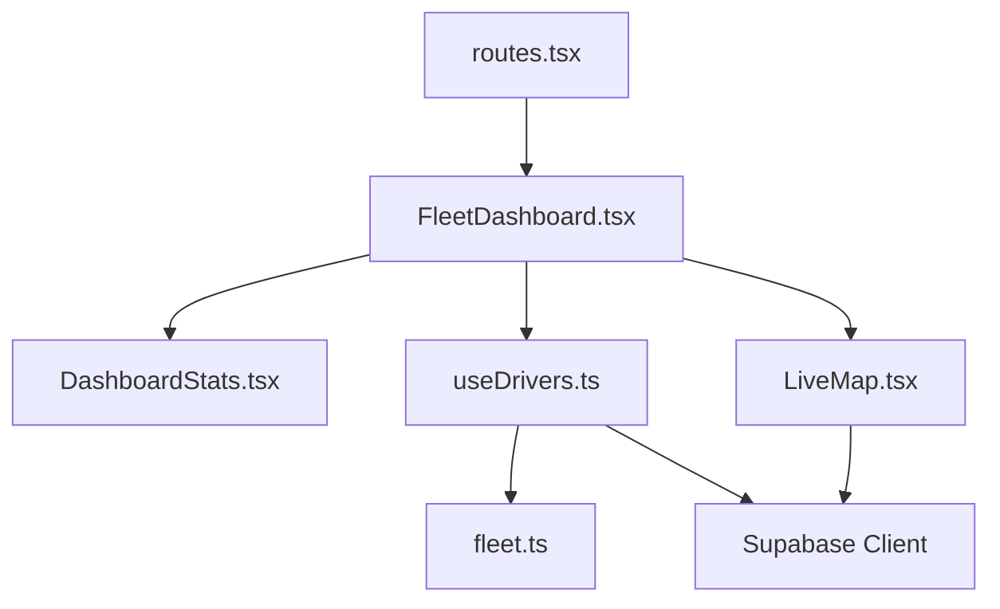

# Dashboard & Analytics

<cite>
**Referenced Files in This Document**
- [routes.tsx](file://src/fleet/routes.tsx)
- [FleetDashboard.tsx](file://src/fleet/pages/FleetDashboard.tsx)
- [DashboardStats.tsx](file://src/fleet/components/dashboard/DashboardStats.tsx)
- [useDrivers.ts](file://src/fleet/hooks/useDrivers.ts)
- [fleet.ts](file://src/fleet/types/fleet.ts)
- [LiveMap.tsx](file://src/fleet/components/map/LiveMap.tsx)
- [LiveMap.tsx](file://src/pages/LiveMap.tsx)
- [fleet-management-portal-design.md](file://docs/fleet-management-portal-design.md)
</cite>

## Table of Contents
1. [Introduction](#introduction)
2. [Project Structure](#project-structure)
3. [Core Components](#core-components)
4. [Architecture Overview](#architecture-overview)
5. [Detailed Component Analysis](#detailed-component-analysis)
6. [Dependency Analysis](#dependency-analysis)
7. [Performance Considerations](#performance-considerations)
8. [Troubleshooting Guide](#troubleshooting-guide)
9. [Conclusion](#conclusion)
10. [Appendices](#appendices)

## Introduction
This document describes the fleet management dashboard and analytics system, focusing on the real-time overview, operational KPIs, driver productivity metrics, vehicle utilization, delivery efficiency, live tracking, and actionable insights for fleet managers. It explains how the frontend dashboard aggregates data, how metrics are computed, and how the system supports decision-making through visualizations and quick actions.

## Project Structure
The fleet dashboard is part of a React-based frontend with route-based lazy loading and a dedicated fleet portal. The dashboard page composes reusable analytics components and integrates with Supabase for data retrieval. Supporting types define the analytics contracts, while live map components enable real-time visibility.

**Diagram sources**
- [routes.tsx:20-41](file://src/fleet/routes.tsx#L20-L41)
- [FleetDashboard.tsx:1-295](file://src/fleet/pages/FleetDashboard.tsx#L1-L295)
- [DashboardStats.tsx:18-112](file://src/fleet/components/dashboard/DashboardStats.tsx#L18-L112)
- [useDrivers.ts:106-178](file://src/fleet/hooks/useDrivers.ts#L106-L178)
- [fleet.ts:322-344](file://src/fleet/types/fleet.ts#L322-L344)
- [LiveMap.tsx](file://src/fleet/components/map/LiveMap.tsx)

**Section sources**
- [routes.tsx:1-42](file://src/fleet/routes.tsx#L1-L42)
- [FleetDashboard.tsx:1-295](file://src/fleet/pages/FleetDashboard.tsx#L1-L295)
- [DashboardStats.tsx:18-112](file://src/fleet/components/dashboard/DashboardStats.tsx#L18-L112)
- [useDrivers.ts:106-178](file://src/fleet/hooks/useDrivers.ts#L106-L178)
- [fleet.ts:322-344](file://src/fleet/types/fleet.ts#L322-L344)

## Core Components
- Dashboard page: Presents KPI cards, driver status visualization, recent activity, branch orders, and quick navigation to drivers, vehicles, live tracking, and payouts.
- Dashboard statistics component: Renders skeleton loaders during data fetch and displays six KPI cards (total drivers, active drivers, online drivers, orders in progress, today’s deliveries, average delivery time).
- Analytics hook: Provides fleet statistics via Supabase queries and exposes loading states and refetch capability.
- Types: Define the DashboardStats contract and related entities for drivers, vehicles, payouts, and WebSocket events.

Key performance indicators and metrics:
- Total Drivers: Count of registered drivers.
- Active Drivers: Approved and active drivers.
- Online Drivers: Currently logged-in drivers.
- Orders In Progress: Active delivery jobs (assigned, accepted, picked up, in transit).
- Today’s Deliveries: Completed deliveries on the current day.
- Average Delivery Time: Minutes per delivery (placeholder value in current implementation).

Driver productivity metrics:
- Total Deliveries: Lifetime deliveries per driver.
- Average Rating: Driver rating score.
- On-Time Rate: Percentage of on-time deliveries (computed in backend performance endpoint).
- Average Delivery Time: Minutes per delivery (driver-level metric exposed in backend).

Vehicle utilization:
- Vehicle status counts and assignments are modeled in types; utilization depends on active vs. available vehicles and driver-to-vehicle ratios.

Delivery efficiency:
- Orders in progress and today’s deliveries provide throughput; average delivery time indicates efficiency.

Real-time status and live tracking:
- LiveMap components visualize driver locations and histories.
- WebSocket events (driver location, status, and stats updates) are defined in types for real-time updates.

Customizable reporting and export:
- Not implemented in the current codebase; future enhancements could leverage backend analytics endpoints and CSV/PDF exports.

Alert systems and thresholds:
- Not implemented in the current codebase; future enhancements could include threshold-based alerts for low driver availability or delayed deliveries.

Decision support:
- Quick actions to navigate to drivers, vehicles, live tracking, and payouts.
- Driver status visualization (online/offline percentage) for immediate operational insights.

**Section sources**
- [FleetDashboard.tsx:78-291](file://src/fleet/pages/FleetDashboard.tsx#L78-L291)
- [DashboardStats.tsx:38-87](file://src/fleet/components/dashboard/DashboardStats.tsx#L38-L87)
- [useDrivers.ts:106-178](file://src/fleet/hooks/useDrivers.ts#L106-L178)
- [fleet.ts:322-344](file://src/fleet/types/fleet.ts#L322-L344)

## Architecture Overview
The dashboard architecture follows a clean separation of concerns:
- Routing layer defines protected fleet routes and lazy loads pages.
- Dashboard page composes analytics components and quick-action cards.
- Analytics hook encapsulates data fetching from Supabase and exposes normalized stats.
- Types define contracts for frontend and backend interoperability.
- Live map components integrate with driver location data and optional WebSocket streams.

**Diagram sources**
- [routes.tsx:20-41](file://src/fleet/routes.tsx#L20-L41)
- [FleetDashboard.tsx:21-26](file://src/fleet/pages/FleetDashboard.tsx#L21-L26)
- [useDrivers.ts:106-178](file://src/fleet/hooks/useDrivers.ts#L106-L178)
- [fleet.ts:322-344](file://src/fleet/types/fleet.ts#L322-L344)

## Detailed Component Analysis

### Dashboard Page
Responsibilities:
- Manage city selection and pass city IDs to analytics.
- Render skeleton loaders while data is loading.
- Display KPI cards, driver status visualization, recent activity, branch orders, and quick actions.
- Provide navigation links to drivers, vehicles, live tracking, and payouts.

Operational insights:
- Driver status visualization shows online/offline distribution.
- Recent activity cards surface recent driver actions and order events.
- Quick actions streamline common tasks.

**Section sources**
- [FleetDashboard.tsx:21-291](file://src/fleet/pages/FleetDashboard.tsx#L21-L291)

### Dashboard Statistics Component
Responsibilities:
- Accept DashboardStats payload and render six KPI cards.
- Show skeleton loaders when data is unavailable.
- Provide consistent styling and icons for each metric.

Metrics rendered:
- Total Drivers, Active Drivers, Online Drivers, Orders In Progress, Today’s Deliveries, Average Delivery Time.

**Section sources**
- [DashboardStats.tsx:18-112](file://src/fleet/components/dashboard/DashboardStats.tsx#L18-L112)
- [fleet.ts:322-329](file://src/fleet/types/fleet.ts#L322-L329)

### Analytics Hook (useFleetStats)
Responsibilities:
- Fetch driver counts (total, active, online).
- Count orders in progress and today’s completed deliveries.
- Compute placeholder average delivery time.
- Expose loading state and refetch function.

Data sources:
- Drivers table for driver counts and statuses.
- Delivery jobs table for order statuses and completion dates.

**Diagram sources**
- [useDrivers.ts:121-171](file://src/fleet/hooks/useDrivers.ts#L121-L171)

**Section sources**
- [useDrivers.ts:106-178](file://src/fleet/hooks/useDrivers.ts#L106-L178)

### Live Map Components
Responsibilities:
- Visualize driver locations and histories.
- Integrate with driver location APIs and optional WebSocket streams.

**Diagram sources**
- [LiveMap.tsx](file://src/fleet/components/map/LiveMap.tsx)
- [LiveMap.tsx](file://src/pages/LiveMap.tsx)

**Section sources**
- [LiveMap.tsx](file://src/fleet/components/map/LiveMap.tsx)
- [LiveMap.tsx](file://src/pages/LiveMap.tsx)

### Backend API and Performance Metrics
The backend API specification defines driver performance endpoints and dashboard metrics. These inform how advanced analytics, predictive insights, and export features can be integrated.

Key endpoints:
- GET /dashboard: Returns totalDrivers, activeDrivers, onlineDrivers, ordersInProgress, todayDeliveries, averageDeliveryTime, and city filter data.
- GET /drivers/{id}/performance: Returns driver-level metrics including totalDeliveries, completedDeliveries, cancelledDeliveries, averageRating, averageDeliveryTime, onTimeRate, earnings.

Performance targets and infrastructure recommendations:
- API response time, WebSocket latency, location update rate, map rendering, concurrent drivers, database writes, and dashboard load time.
- Infrastructure recommendations include Kubernetes deployments, WebSocket servers, read replicas, CDN, and monitoring stack.

**Section sources**
- [fleet-management-portal-design.md:692-720](file://docs/fleet-management-portal-design.md#L692-L720)
- [fleet-management-portal-design.md:890-910](file://docs/fleet-management-portal-design.md#L890-L910)
- [fleet-management-portal-design.md:2587-2599](file://docs/fleet-management-portal-design.md#L2587-L2599)
- [fleet-management-portal-design.md:2601-2675](file://docs/fleet-management-portal-design.md#L2601-L2675)

## Dependency Analysis
The dashboard components depend on routing, analytics hooks, and shared types. The analytics hook depends on Supabase for data retrieval. Live map components depend on driver location data and optional WebSocket events.

**Diagram sources**
- [routes.tsx:20-41](file://src/fleet/routes.tsx#L20-L41)
- [FleetDashboard.tsx:1-295](file://src/fleet/pages/FleetDashboard.tsx#L1-L295)
- [DashboardStats.tsx:11](file://src/fleet/components/dashboard/DashboardStats.tsx#L11)
- [useDrivers.ts:4](file://src/fleet/hooks/useDrivers.ts#L4)
- [fleet.ts:322-344](file://src/fleet/types/fleet.ts#L322-L344)
- [LiveMap.tsx](file://src/fleet/components/map/LiveMap.tsx)

**Section sources**
- [routes.tsx:20-41](file://src/fleet/routes.tsx#L20-L41)
- [FleetDashboard.tsx:1-295](file://src/fleet/pages/FleetDashboard.tsx#L1-L295)
- [DashboardStats.tsx:11](file://src/fleet/components/dashboard/DashboardStats.tsx#L11)
- [useDrivers.ts:4](file://src/fleet/hooks/useDrivers.ts#L4)
- [fleet.ts:322-344](file://src/fleet/types/fleet.ts#L322-L344)
- [LiveMap.tsx](file://src/fleet/components/map/LiveMap.tsx)

## Performance Considerations
- Use memoization for city IDs to avoid unnecessary re-fetches.
- Implement skeleton loaders to improve perceived performance.
- Consider pagination and filtering for large datasets.
- Optimize database queries and consider read replicas for dashboard-heavy workloads.
- Monitor API response times and WebSocket latency targets.

[No sources needed since this section provides general guidance]

## Troubleshooting Guide
Common issues and resolutions:
- Empty or stale dashboard data: Verify city filters and refetch stats.
- Loading spinners persist: Check network connectivity and Supabase service health.
- Driver status discrepancies: Confirm driver approval and online flags in the drivers table.
- Live map not updating: Ensure WebSocket connections and driver location updates are enabled.

**Section sources**
- [useDrivers.ts:106-178](file://src/fleet/hooks/useDrivers.ts#L106-L178)
- [FleetDashboard.tsx:31-44](file://src/fleet/pages/FleetDashboard.tsx#L31-L44)

## Conclusion
The fleet dashboard provides a real-time overview of key operational metrics, quick navigation to critical areas, and a foundation for deeper analytics. By leveraging the existing hooks, types, and components, fleet managers can monitor driver availability, delivery throughput, and efficiency. Future enhancements can include predictive analytics, customizable reporting, alerting, and export capabilities aligned with the backend API specification.

[No sources needed since this section summarizes without analyzing specific files]

## Appendices

### Dashboard Configuration Examples
- City filter: Use the city selector dropdown to scope metrics to specific cities.
- Quick actions: Navigate directly to drivers, vehicles, live tracking, and payouts.
- Driver status visualization: Review online/offline distribution to assess availability.

**Section sources**
- [FleetDashboard.tsx:66-76](file://src/fleet/pages/FleetDashboard.tsx#L66-L76)
- [FleetDashboard.tsx:138-171](file://src/fleet/pages/FleetDashboard.tsx#L138-L171)

### Metric Interpretation Guidelines
- Total Drivers: Indicates fleet size; track growth trends monthly.
- Active Drivers: Reflects approved and active drivers; monitor churn.
- Online Drivers: Measures immediate capacity; target high availability during peak hours.
- Orders In Progress: Signals current workload; balance with driver availability.
- Today’s Deliveries: Tracks daily throughput; compare to targets.
- Average Delivery Time: Efficiency indicator; investigate outliers.

**Section sources**
- [DashboardStats.tsx:38-87](file://src/fleet/components/dashboard/DashboardStats.tsx#L38-L87)
- [useDrivers.ts:155-163](file://src/fleet/hooks/useDrivers.ts#L155-L163)

### Decision Support Features
- Quick actions streamline common tasks.
- Driver status visualization highlights availability.
- Recent activity cards provide situational awareness.
- Live tracking enables proactive dispatching and monitoring.

**Section sources**
- [FleetDashboard.tsx:138-171](file://src/fleet/pages/FleetDashboard.tsx#L138-L171)
- [FleetDashboard.tsx:174-218](file://src/fleet/pages/FleetDashboard.tsx#L174-L218)
- [FleetDashboard.tsx:220-268](file://src/fleet/pages/FleetDashboard.tsx#L220-L268)