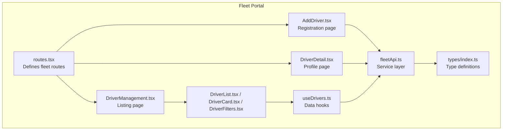
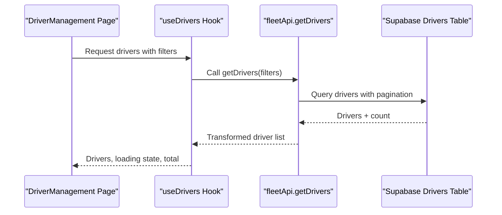
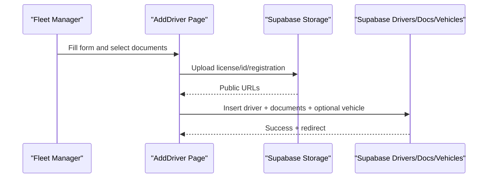
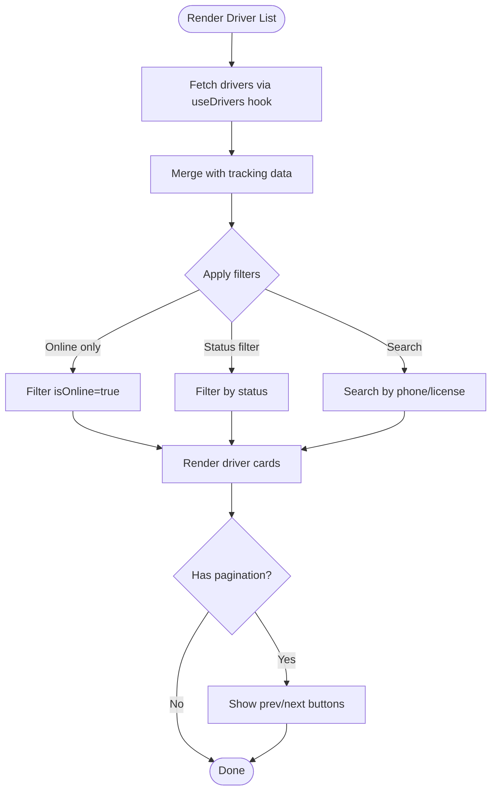
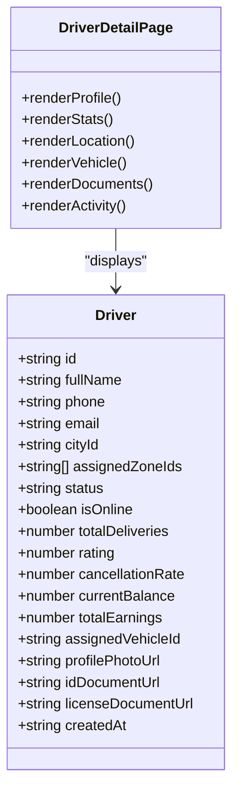
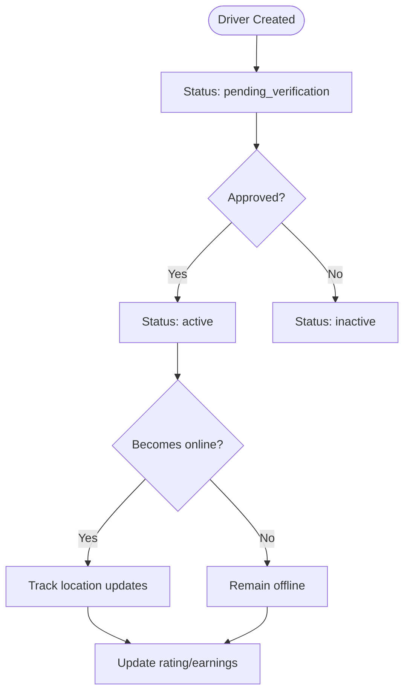
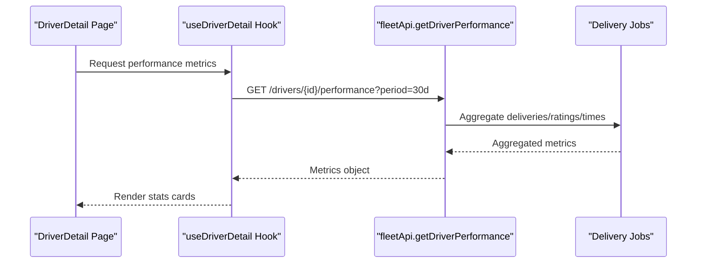
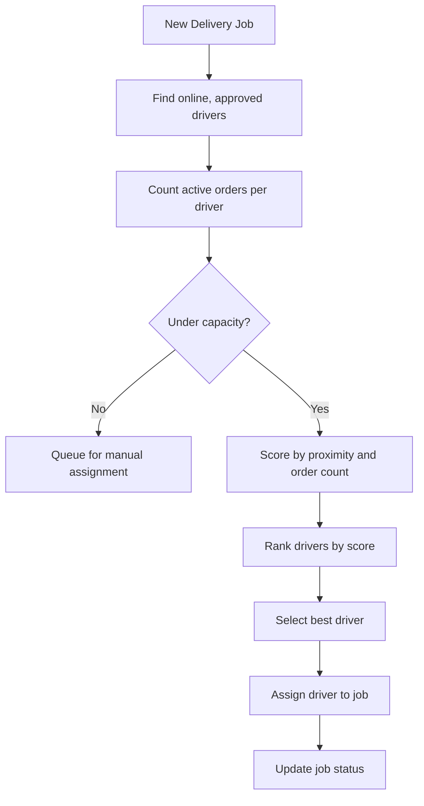
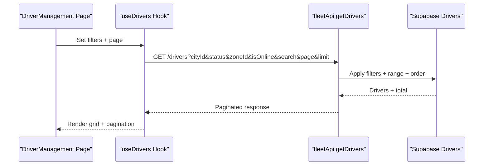
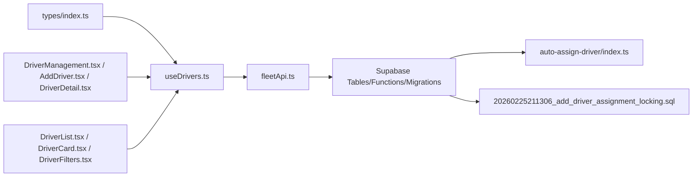

# Driver Management

<cite>
**Referenced Files in This Document**
- [routes.tsx](file://src/fleet/routes.tsx)
- [index.ts](file://src/fleet/index.ts)
- [types/index.ts](file://src/fleet/types/index.ts)
- [fleetApi.ts](file://src/fleet/services/fleetApi.ts)
- [useDrivers.ts](file://src/fleet/hooks/useDrivers.ts)
- [DriverManagement.tsx](file://src/fleet/pages/DriverManagement.tsx)
- [AddDriver.tsx](file://src/fleet/pages/AddDriver.tsx)
- [DriverDetail.tsx](file://src/fleet/pages/DriverDetail.tsx)
- [DriverList.tsx](file://src/fleet/components/drivers/DriverList.tsx)
- [DriverFilters.tsx](file://src/fleet/components/drivers/DriverFilters.tsx)
- [DriverCard.tsx](file://src/fleet/components/drivers/DriverCard.tsx)
- [fleet-management-portal-design.md](file://docs/fleet-management-portal-design.md)
- [auto-assign-driver/index.ts](file://supabase/functions/auto-assign-driver/index.ts)
- [20260225211306_add_driver_assignment_locking.sql](file://supabase/migrations/20260225211306_add_driver_assignment_locking.sql)
- [delivery_system_design.md](file://delivery_system_design.md)
</cite>

## Table of Contents
1. [Introduction](#introduction)
2. [Project Structure](#project-structure)
3. [Core Components](#core-components)
4. [Architecture Overview](#architecture-overview)
5. [Detailed Component Analysis](#detailed-component-analysis)
6. [Dependency Analysis](#dependency-analysis)
7. [Performance Considerations](#performance-considerations)
8. [Troubleshooting Guide](#troubleshooting-guide)
9. [Conclusion](#conclusion)
10. [Appendices](#appendices)

## Introduction
This document describes the driver management functionality within the fleet portal. It covers driver registration and onboarding, profile management, status tracking, qualification/document management, performance monitoring, driver assignment algorithms, availability management, capacity planning, filtering/search capabilities, bulk operations, communications features, and integration with the route optimization system. The goal is to provide a comprehensive understanding of how drivers are managed end-to-end, from initial registration to ongoing performance oversight and operational integration.

## Project Structure
The fleet portal organizes driver management under a dedicated module with clear separation of concerns:
- Routing and navigation for fleet pages
- Type definitions for drivers, vehicles, documents, and related entities
- Services for fleet API interactions
- Hooks for data fetching and caching
- Page components for listing, adding, editing, and viewing driver details
- Shared UI components for driver cards, filters, and lists
- Backend Supabase functions and migrations supporting driver assignment and real-time tracking

**Diagram sources**
- [routes.tsx:20-41](file://src/fleet/routes.tsx#L20-L41)
- [DriverManagement.tsx:20-204](file://src/fleet/pages/DriverManagement.tsx#L20-L204)
- [AddDriver.tsx:25-572](file://src/fleet/pages/AddDriver.tsx#L25-L572)
- [DriverDetail.tsx:19-260](file://src/fleet/pages/DriverDetail.tsx#L19-L260)
- [DriverList.tsx:13-134](file://src/fleet/components/drivers/DriverList.tsx#L13-L134)
- [DriverFilters.tsx:26-98](file://src/fleet/components/drivers/DriverFilters.tsx#L26-L98)
- [DriverCard.tsx:28-141](file://src/fleet/components/drivers/DriverCard.tsx#L28-L141)
- [useDrivers.ts:16-104](file://src/fleet/hooks/useDrivers.ts#L16-L104)
- [types/index.ts:29-102](file://src/fleet/types/index.ts#L29-L102)
- [fleetApi.ts:178-206](file://src/fleet/services/fleetApi.ts#L178-L206)

**Section sources**
- [routes.tsx:1-42](file://src/fleet/routes.tsx#L1-L42)
- [index.ts:1-14](file://src/fleet/index.ts#L1-L14)

## Core Components
- Driver entity and related types define status, location, ratings, balances, and document metadata.
- Driver listing page supports search, status filter, online-only toggle, pagination, and live tracking overlays.
- Add driver page handles personal info, city/zone assignment, optional vehicle assignment, and document uploads.
- Driver detail page displays profile, stats, current location, assigned vehicle, documents, and recent activity.
- Hooks encapsulate driver data fetching, pagination, and statistics aggregation.
- Fleet API service abstracts backend interactions for drivers, vehicles, payouts, and tracking.
- Backend Supabase function auto-assigns drivers to deliveries using proximity and capacity checks.

**Section sources**
- [types/index.ts:29-102](file://src/fleet/types/index.ts#L29-L102)
- [DriverList.tsx:13-134](file://src/fleet/components/drivers/DriverList.tsx#L13-L134)
- [DriverFilters.tsx:26-98](file://src/fleet/components/drivers/DriverFilters.tsx#L26-L98)
- [DriverCard.tsx:28-141](file://src/fleet/components/drivers/DriverCard.tsx#L28-L141)
- [DriverManagement.tsx:20-204](file://src/fleet/pages/DriverManagement.tsx#L20-L204)
- [AddDriver.tsx:25-572](file://src/fleet/pages/AddDriver.tsx#L25-L572)
- [DriverDetail.tsx:19-260](file://src/fleet/pages/DriverDetail.tsx#L19-L260)
- [useDrivers.ts:16-104](file://src/fleet/hooks/useDrivers.ts#L16-L104)
- [fleetApi.ts:178-206](file://src/fleet/services/fleetApi.ts#L178-L206)
- [auto-assign-driver/index.ts:189-268](file://supabase/functions/auto-assign-driver/index.ts#L189-L268)

## Architecture Overview
The driver management architecture follows a layered pattern:
- UI Layer: Pages and components render driver data and collect user actions.
- Hook Layer: Centralized data fetching and caching logic for drivers, stats, and payouts.
- Service Layer: Abstractions over fleet API endpoints for CRUD operations and reporting.
- Backend Layer: Supabase tables, functions, and migrations implementing assignment logic and data integrity.

**Diagram sources**
- [DriverManagement.tsx:29-35](file://src/fleet/pages/DriverManagement.tsx#L29-L35)
- [useDrivers.ts:16-104](file://src/fleet/hooks/useDrivers.ts#L16-L104)
- [fleetApi.ts:178-206](file://src/fleet/services/fleetApi.ts#L178-L206)

## Detailed Component Analysis

### Driver Registration and Onboarding
- Registration form collects personal info, contact details, city/zone assignment, optional vehicle assignment, and emergency contact/address.
- Document uploads are stored in Supabase storage with generated public URLs.
- Driver creation inserts a record with initial status and counters, and creates document records linked to the driver.
- Optional vehicle assignment updates vehicle status to assigned.

**Diagram sources**
- [AddDriver.tsx:160-275](file://src/fleet/pages/AddDriver.tsx#L160-L275)
- [fleetApi.ts:178-206](file://src/fleet/services/fleetApi.ts#L178-L206)

**Section sources**
- [AddDriver.tsx:25-572](file://src/fleet/pages/AddDriver.tsx#L25-L572)

### Driver Listing, Filtering, and Search
- The listing page supports:
  - Search by phone/license
  - Status filter (active/pending/suspended/inactive)
  - Online-only toggle
  - Pagination with previous/next controls
- Real-time tracking data is merged with REST API data to reflect live status and location.

**Diagram sources**
- [DriverList.tsx:21-47](file://src/fleet/components/drivers/DriverList.tsx#L21-L47)
- [DriverFilters.tsx:26-98](file://src/fleet/components/drivers/DriverFilters.tsx#L26-L98)
- [useDrivers.ts:16-104](file://src/fleet/hooks/useDrivers.ts#L16-L104)

**Section sources**
- [DriverList.tsx:13-134](file://src/fleet/components/drivers/DriverList.tsx#L13-L134)
- [DriverFilters.tsx:26-98](file://src/fleet/components/drivers/DriverFilters.tsx#L26-L98)
- [DriverManagement.tsx:20-204](file://src/fleet/pages/DriverManagement.tsx#L20-L204)
- [useDrivers.ts:16-104](file://src/fleet/hooks/useDrivers.ts#L16-L104)

### Driver Profile Management
- Detail page shows profile, stats (deliveries, rating, wallet balance, total earnings), current location, assigned vehicle, documents, and recent activity.
- Edit and message actions are exposed for quick management and communication.

**Diagram sources**
- [types/index.ts:29-53](file://src/fleet/types/index.ts#L29-L53)
- [DriverDetail.tsx:19-260](file://src/fleet/pages/DriverDetail.tsx#L19-L260)

**Section sources**
- [DriverDetail.tsx:19-260](file://src/fleet/pages/DriverDetail.tsx#L19-L260)
- [types/index.ts:29-53](file://src/fleet/types/index.ts#L29-L53)

### Driver Status Tracking and Qualification Management
- Status values include pending verification, active, suspended, inactive.
- Documents include ID card, driving license, vehicle registration, insurance, background check, contract with verification status tracking.
- Location tracking integrates REST data with real-time tracking data for accurate online/offline indicators and timestamps.

**Diagram sources**
- [types/index.ts:38-53](file://src/fleet/types/index.ts#L38-L53)
- [DriverList.tsx:32-42](file://src/fleet/components/drivers/DriverList.tsx#L32-L42)

**Section sources**
- [types/index.ts:38-102](file://src/fleet/types/index.ts#L38-L102)
- [DriverList.tsx:32-42](file://src/fleet/components/drivers/DriverList.tsx#L32-L42)

### Performance Monitoring
- Performance metrics include total/completed/cancelled deliveries, average rating, average delivery time, on-time rate, and earnings.
- The API specification defines performance endpoints with configurable periods.

**Diagram sources**
- [fleet-management-portal-design.md:890-911](file://docs/fleet-management-portal-design.md#L890-L911)
- [DriverDetail.tsx:121-146](file://src/fleet/pages/DriverDetail.tsx#L121-L146)

**Section sources**
- [fleet-management-portal-design.md:890-911](file://docs/fleet-management-portal-design.md#L890-L911)
- [DriverDetail.tsx:121-146](file://src/fleet/pages/DriverDetail.tsx#L121-L146)

### Driver Assignment Algorithms and Capacity Planning
- Auto-assignment function selects online, approved drivers, excludes those at capacity, scores by proximity and active orders, and assigns the best match.
- Migrations enforce concurrency-safe assignment via locking and indexing for availability and job queues.
- Delivery system design outlines a nearest-available-with-capacity scoring approach using distance/time heuristics.

**Diagram sources**
- [auto-assign-driver/index.ts:189-268](file://supabase/functions/auto-assign-driver/index.ts#L189-L268)
- [20260225211306_add_driver_assignment_locking.sql:335-375](file://supabase/migrations/20260225211306_add_driver_assignment_locking.sql#L335-L375)
- [delivery_system_design.md:76-125](file://delivery_system_design.md#L76-L125)

**Section sources**
- [auto-assign-driver/index.ts:189-268](file://supabase/functions/auto-assign-driver/index.ts#L189-L268)
- [20260225211306_add_driver_assignment_locking.sql:335-375](file://supabase/migrations/20260225211306_add_driver_assignment_locking.sql#L335-L375)
- [delivery_system_design.md:76-125](file://delivery_system_design.md#L76-L125)

### Availability Management and Capacity Planning
- Availability is tracked via online/offline status and active order counts.
- Capacity thresholds prevent over-allocation; drivers above threshold are excluded from auto-assignment until capacity frees up.
- Indexes optimize queries for availability and job assignment readiness.

**Section sources**
- [auto-assign-driver/index.ts:224-251](file://supabase/functions/auto-assign-driver/index.ts#L224-L251)
- [20260225211306_add_driver_assignment_locking.sql:367-375](file://supabase/migrations/20260225211306_add_driver_assignment_locking.sql#L367-L375)

### Filtering, Search, and Bulk Operations
- Filtering supports city, status, zone, online-only, and text search across names/emails/phones/license numbers.
- Pagination is supported in listing and payouts APIs.
- Bulk payouts endpoint enables processing payouts for multiple drivers within a period.

**Diagram sources**
- [fleet-management-portal-design.md:724-786](file://docs/fleet-management-portal-design.md#L724-L786)
- [DriverManagement.tsx:29-35](file://src/fleet/pages/DriverManagement.tsx#L29-L35)
- [useDrivers.ts:16-104](file://src/fleet/hooks/useDrivers.ts#L16-L104)

**Section sources**
- [fleet-management-portal-design.md:724-786](file://docs/fleet-management-portal-design.md#L724-L786)
- [DriverManagement.tsx:29-35](file://src/fleet/pages/DriverManagement.tsx#L29-L35)
- [useDrivers.ts:16-104](file://src/fleet/hooks/useDrivers.ts#L16-L104)

### Communication Features and Document Management
- Messaging actions are exposed from the driver detail page for fleet-manager-to-driver communication.
- Document management includes upload of licenses, IDs, registrations, and insurance with verification status tracking and expiry dates.
- Document records are created alongside driver profiles and can be viewed in the detail page.

**Section sources**
- [DriverDetail.tsx:71-80](file://src/fleet/pages/DriverDetail.tsx#L71-L80)
- [AddDriver.tsx:143-246](file://src/fleet/pages/AddDriver.tsx#L143-L246)
- [types/index.ts:91-102](file://src/fleet/types/index.ts#L91-L102)

### Compliance Tracking
- Document verification statuses (pending/approved/rejected/expired) enable compliance monitoring.
- Expiry dates and verification metadata are stored with documents.
- Fleet activity logs capture administrative actions for auditability.

**Section sources**
- [types/index.ts:91-102](file://src/fleet/types/index.ts#L91-L102)
- [fleetApi.ts:842-878](file://src/fleet/services/fleetApi.ts#L842-L878)

### Driver Lifecycle Management Examples
- Registration: Complete onboarding form, upload documents, optionally assign vehicle.
- Activation: Approval moves driver from pending to active; online status reflects real-time availability.
- Performance: Monitor ratings, delivery counts, and earnings; adjust incentives or training as needed.
- Suspension/Deactivation: Administrative actions move drivers to suspended or inactive states.
- Re-activation: Re-verification and re-approval restore active status.

**Section sources**
- [AddDriver.tsx:160-275](file://src/fleet/pages/AddDriver.tsx#L160-L275)
- [types/index.ts:38-53](file://src/fleet/types/index.ts#L38-L53)
- [DriverDetail.tsx:24-35](file://src/fleet/pages/DriverDetail.tsx#L24-L35)

### Integration with Route Optimization System
- Auto-assignment function integrates with delivery jobs to select the best driver based on proximity and capacity.
- Delivery system design specifies scoring and ranking logic using distance/time heuristics.
- Backend migrations ensure thread-safe assignment and efficient query performance.

**Section sources**
- [auto-assign-driver/index.ts:224-268](file://supabase/functions/auto-assign-driver/index.ts#L224-L268)
- [delivery_system_design.md:76-125](file://delivery_system_design.md#L76-L125)
- [20260225211306_add_driver_assignment_locking.sql:335-375](file://supabase/migrations/20260225211306_add_driver_assignment_locking.sql#L335-L375)

## Dependency Analysis
Driver management components depend on:
- Types for consistent data modeling across UI and services
- Hooks for centralized data fetching and caching
- Services for backend abstraction
- Supabase functions and migrations for assignment logic and data integrity

**Diagram sources**
- [types/index.ts:29-102](file://src/fleet/types/index.ts#L29-L102)
- [useDrivers.ts:16-104](file://src/fleet/hooks/useDrivers.ts#L16-L104)
- [fleetApi.ts:178-206](file://src/fleet/services/fleetApi.ts#L178-L206)
- [DriverManagement.tsx:20-204](file://src/fleet/pages/DriverManagement.tsx#L20-L204)
- [AddDriver.tsx:25-572](file://src/fleet/pages/AddDriver.tsx#L25-L572)
- [DriverDetail.tsx:19-260](file://src/fleet/pages/DriverDetail.tsx#L19-L260)
- [DriverList.tsx:13-134](file://src/fleet/components/drivers/DriverList.tsx#L13-L134)
- [DriverCard.tsx:28-141](file://src/fleet/components/drivers/DriverCard.tsx#L28-L141)
- [DriverFilters.tsx:26-98](file://src/fleet/components/drivers/DriverFilters.tsx#L26-L98)
- [auto-assign-driver/index.ts:189-268](file://supabase/functions/auto-assign-driver/index.ts#L189-L268)
- [20260225211306_add_driver_assignment_locking.sql:335-375](file://supabase/migrations/20260225211306_add_driver_assignment_locking.sql#L335-L375)

**Section sources**
- [index.ts:1-14](file://src/fleet/index.ts#L1-L14)
- [routes.tsx:1-42](file://src/fleet/routes.tsx#L1-L42)

## Performance Considerations
- Pagination reduces payload sizes for driver listings and payouts.
- Memoization of filters prevents unnecessary re-fetches.
- Real-time tracking overlays merge lightweight tracking data with REST responses to avoid redundant network calls.
- Backend indexes improve availability and assignment query performance.
- Auto-assignment function filters and ranks efficiently to minimize latency.

[No sources needed since this section provides general guidance]

## Troubleshooting Guide
Common issues and resolutions:
- Driver not found: Verify the driver ID and ensure the record exists in the database.
- Document upload failures: Confirm storage bucket permissions and file types.
- Auto-assignment failures: Check availability, capacity thresholds, and backend function logs.
- Performance metrics missing: Ensure delivery jobs exist and time ranges are valid.

**Section sources**
- [DriverDetail.tsx:46-58](file://src/fleet/pages/DriverDetail.tsx#L46-L58)
- [AddDriver.tsx:143-158](file://src/fleet/pages/AddDriver.tsx#L143-L158)
- [auto-assign-driver/index.ts:197-208](file://supabase/functions/auto-assign-driver/index.ts#L197-L208)

## Conclusion
The fleet portal’s driver management system combines robust UI components, centralized data hooks, and backend automation to streamline onboarding, profile maintenance, status tracking, performance monitoring, and assignment. The modular architecture ensures scalability, while backend functions and migrations enforce data integrity and efficient operations. Integrations with route optimization further enhance operational effectiveness.

[No sources needed since this section summarizes without analyzing specific files]

## Appendices
- API Specification: Driver endpoints include listing, creation, retrieval, updates, status changes, document management, location retrieval, and performance metrics.
- Assignment Design: Nearest-available-with-capacity algorithm and backend locking mechanisms.

**Section sources**
- [fleet-management-portal-design.md:724-911](file://docs/fleet-management-portal-design.md#L724-L911)
- [delivery_system_design.md:76-125](file://delivery_system_design.md#L76-L125)