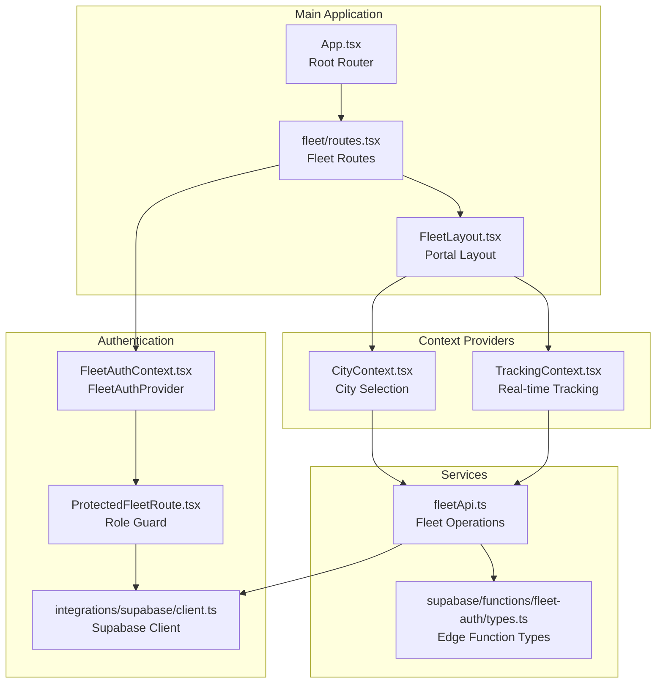
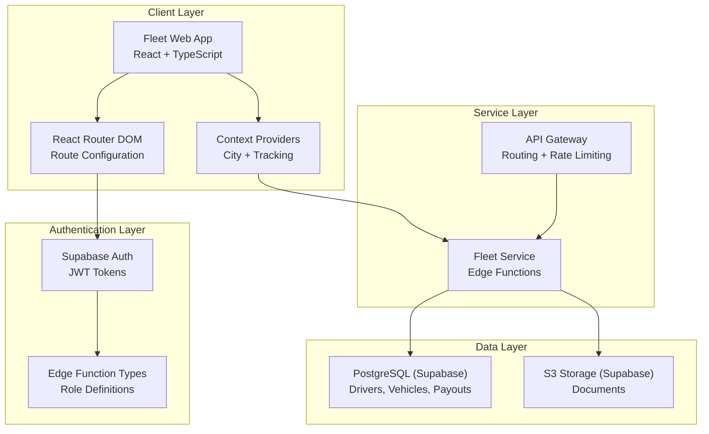
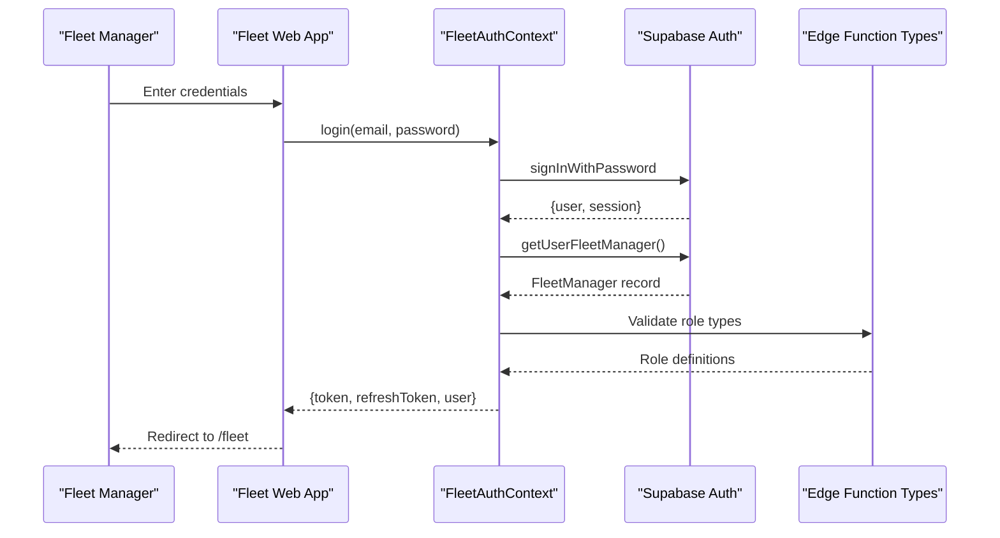
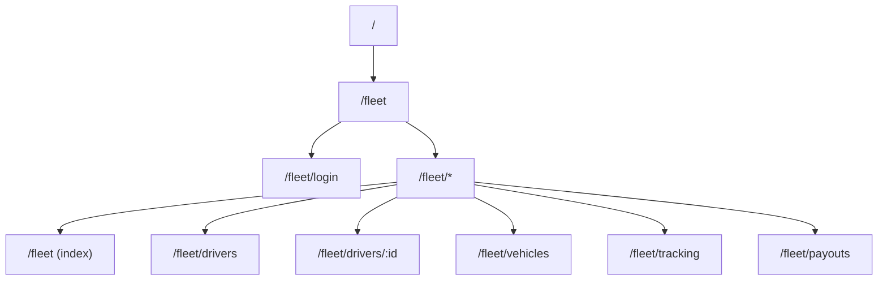
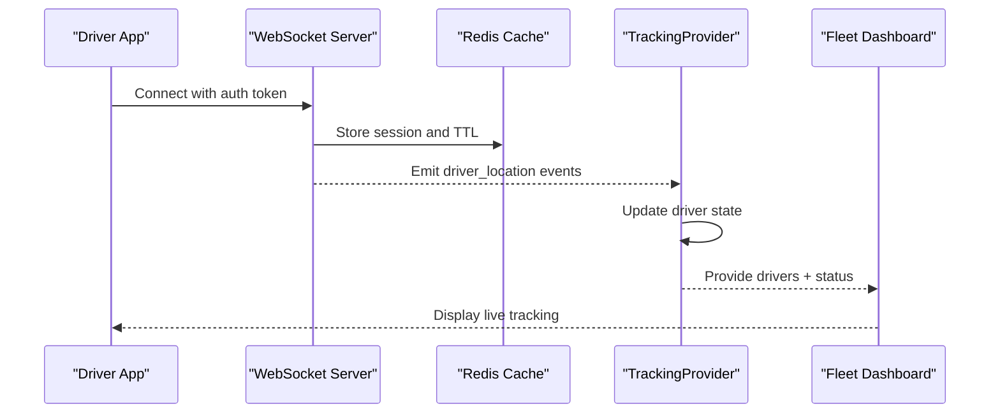
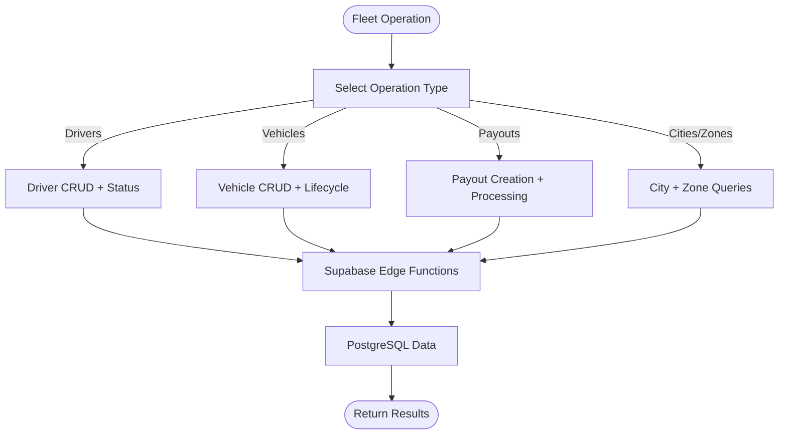
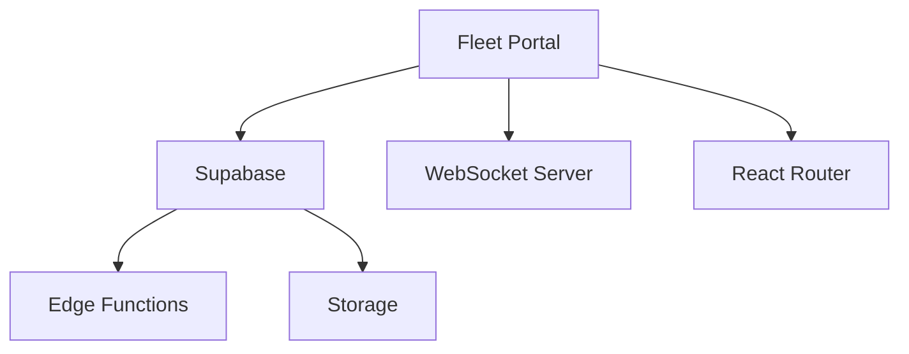

# Fleet Management Overview

<cite>
**Referenced Files in This Document**
- [index.ts](file://src/fleet/index.ts)
- [routes.tsx](file://src/fleet/routes.tsx)
- [App.tsx](file://src/App.tsx)
- [FleetLayout.tsx](file://src/fleet/components/FleetLayout.tsx)
- [ProtectedFleetRoute.tsx](file://src/fleet/components/ProtectedFleetRoute.tsx)
- [FleetAuthContext.tsx](file://src/fleet/context/FleetAuthContext.tsx)
- [CityContext.tsx](file://src/fleet/context/CityContext.tsx)
- [TrackingContext.tsx](file://src/fleet/context/TrackingContext.tsx)
- [fleetApi.ts](file://src/fleet/services/fleetApi.ts)
- [fleet-management-portal-design.md](file://docs/fleet-management-portal-design.md)
- [client.ts](file://src/integrations/supabase/client.ts)
- [types.ts](file://supabase/functions/fleet-auth/types.ts)
</cite>

## Table of Contents
1. [Introduction](#introduction)
2. [Project Structure](#project-structure)
3. [Core Components](#core-components)
4. [Architecture Overview](#architecture-overview)
5. [Detailed Component Analysis](#detailed-component-analysis)
6. [Dependency Analysis](#dependency-analysis)
7. [Performance Considerations](#performance-considerations)
8. [Troubleshooting Guide](#troubleshooting-guide)
9. [Conclusion](#conclusion)

## Introduction
This document provides a comprehensive overview of the Nutrio Fleet Management System, focusing on the fleet management portal that enables fleet managers to oversee drivers, vehicles, and live operations across multiple cities. It explains the overall architecture, key components, authentication and role-based access control, routing structure, data flows, and integration points with the broader Nutrio ecosystem. The portal integrates tightly with Supabase for authentication, data persistence, and edge functions, while supporting real-time tracking via WebSocket connections.

## Project Structure
The fleet management portal is organized as a modular React application integrated into the main Nutrio application. Key elements include:
- Public exports for fleet components and types
- Route configuration for fleet-specific pages
- Authentication and authorization providers
- Context providers for city selection and real-time tracking
- Service layer for fleet API operations
- Integration with Supabase for authentication and data access

**Diagram sources**
- [App.tsx:725-727](file://src/App.tsx#L725-L727)
- [routes.tsx:20-41](file://src/fleet/routes.tsx#L20-L41)
- [FleetLayout.tsx:94-155](file://src/fleet/components/FleetLayout.tsx#L94-L155)
- [FleetAuthContext.tsx:24-144](file://src/fleet/context/FleetAuthContext.tsx#L24-L144)
- [ProtectedFleetRoute.tsx:61-134](file://src/fleet/components/ProtectedFleetRoute.tsx#L61-L134)
- [CityContext.tsx:13-39](file://src/fleet/context/CityContext.tsx#L13-L39)
- [TrackingContext.tsx:24-129](file://src/fleet/context/TrackingContext.tsx#L24-L129)
- [fleetApi.ts:29-93](file://src/fleet/services/fleetApi.ts#L29-L93)
- [client.ts](file://src/integrations/supabase/client.ts)
- [types.ts](file://supabase/functions/fleet-auth/types.ts)

**Section sources**
- [index.ts:1-14](file://src/fleet/index.ts#L1-L14)
- [routes.tsx:1-42](file://src/fleet/routes.tsx#L1-L42)
- [App.tsx:13](file://src/App.tsx#L13)

## Core Components
This section outlines the primary building blocks of the fleet management portal and their responsibilities.

- Public Exports: The fleet module exposes layout components, protected route guards, and type definitions for fleet-related entities.
- Route Configuration: Defines the fleet portal routes, including login, dashboard, driver management, vehicle management, live tracking, and payout management.
- Authentication Provider: Manages fleet user sessions, token lifecycle, and city access checks.
- Protected Route Guard: Validates fleet manager roles and ensures access control based on user roles and assigned cities.
- Context Providers: Supply city selection and real-time tracking data to components.
- Service Layer: Encapsulates fleet operations such as driver, vehicle, and payout management, integrating with Supabase.

**Section sources**
- [index.ts:5-13](file://src/fleet/index.ts#L5-L13)
- [routes.tsx:20-41](file://src/fleet/routes.tsx#L20-L41)
- [FleetAuthContext.tsx:24-144](file://src/fleet/context/FleetAuthContext.tsx#L24-L144)
- [ProtectedFleetRoute.tsx:61-134](file://src/fleet/components/ProtectedFleetRoute.tsx#L61-L134)
- [CityContext.tsx:13-39](file://src/fleet/context/CityContext.tsx#L13-L39)
- [TrackingContext.tsx:24-129](file://src/fleet/context/TrackingContext.tsx#L24-L129)
- [fleetApi.ts:35-93](file://src/fleet/services/fleetApi.ts#L35-L93)

## Architecture Overview
The fleet management portal follows a layered architecture with clear separation of concerns:
- Client Layer: React-based web application with routing and UI components.
- Authentication and Authorization: Supabase-based authentication with role-based access control for fleet managers.
- Service Layer: Fleet operations orchestrated through Supabase Edge Functions and REST endpoints.
- Data Layer: PostgreSQL-backed data storage with Supabase for authentication, edge functions, and storage.

**Diagram sources**
- [fleet-management-portal-design.md:13-82](file://docs/fleet-management-portal-design.md#L13-L82)
- [client.ts](file://src/integrations/supabase/client.ts)
- [types.ts](file://supabase/functions/fleet-auth/types.ts)
- [fleetApi.ts:29-93](file://src/fleet/services/fleetApi.ts#L29-L93)

## Detailed Component Analysis

### Authentication and Role-Based Access Control
The fleet portal enforces strict access control:
- Authentication: Fleet users sign in using Supabase authentication. Upon successful login, the system validates whether the user is a fleet manager and retrieves associated city assignments.
- Authorization: The protected route guard checks user roles and city access permissions. Super admins have global access; fleet managers are restricted to assigned cities.
- Token Management: The authentication provider manages access and refresh tokens, persists user data locally, and refreshes tokens automatically.

**Diagram sources**
- [FleetAuthContext.tsx:75-105](file://src/fleet/context/FleetAuthContext.tsx#L75-L105)
- [fleetApi.ts:35-75](file://src/fleet/services/fleetApi.ts#L35-L75)
- [types.ts](file://supabase/functions/fleet-auth/types.ts)

**Section sources**
- [ProtectedFleetRoute.tsx:26-59](file://src/fleet/components/ProtectedFleetRoute.tsx#L26-L59)
- [ProtectedFleetRoute.tsx:61-134](file://src/fleet/components/ProtectedFleetRoute.tsx#L61-L134)
- [FleetAuthContext.tsx:24-144](file://src/fleet/context/FleetAuthContext.tsx#L24-L144)
- [fleetApi.ts:35-93](file://src/fleet/services/fleetApi.ts#L35-L93)

### Routing Structure
The fleet portal defines nested routes under the "/fleet" path:
- Login route for authentication
- Protected routes guarded by the fleet authentication provider
- Nested routes for dashboard, drivers, vehicles, live tracking, and payouts

**Diagram sources**
- [routes.tsx:20-41](file://src/fleet/routes.tsx#L20-L41)
- [App.tsx:725-727](file://src/App.tsx#L725-L727)

**Section sources**
- [routes.tsx:20-41](file://src/fleet/routes.tsx#L20-L41)
- [App.tsx:725-727](file://src/App.tsx#L725-L727)

### Real-Time Tracking and City Context
Real-time tracking is handled through a dedicated WebSocket connection:
- Tracking Provider: Establishes and manages the WebSocket connection, handles driver location updates, and maintains driver presence state.
- City Context: Allows fleet managers to filter data by selected cities, with super admins able to select multiple cities.
- Integration: The tracking provider subscribes to city-specific channels and merges real-time updates with REST API data.

**Diagram sources**
- [TrackingContext.tsx:62-83](file://src/fleet/context/TrackingContext.tsx#L62-L83)
- [TrackingContext.tsx:114-122](file://src/fleet/context/TrackingContext.tsx#L114-L122)
- [fleet-management-portal-design.md:106-122](file://docs/fleet-management-portal-design.md#L106-L122)

**Section sources**
- [CityContext.tsx:13-39](file://src/fleet/context/CityContext.tsx#L13-L39)
- [TrackingContext.tsx:24-129](file://src/fleet/context/TrackingContext.tsx#L24-L129)

### Fleet Operations and Data Access
The service layer encapsulates fleet operations:
- Driver Management: CRUD operations, status updates, and performance metrics retrieval
- Vehicle Management: CRUD operations and vehicle lifecycle tracking
- Payout Management: Payout creation, processing, and reporting
- City and Zone Queries: City and zone data retrieval for filtering and selection

**Diagram sources**
- [fleetApi.ts:178-256](file://src/fleet/services/fleetApi.ts#L178-L256)
- [fleetApi.ts:534-594](file://src/fleet/services/fleetApi.ts#L534-L594)
- [fleetApi.ts:641-714](file://src/fleet/services/fleetApi.ts#L641-L714)
- [fleetApi.ts:129-150](file://src/fleet/services/fleetApi.ts#L129-L150)

**Section sources**
- [fleetApi.ts:178-256](file://src/fleet/services/fleetApi.ts#L178-L256)
- [fleetApi.ts:534-594](file://src/fleet/services/fleetApi.ts#L534-L594)
- [fleetApi.ts:641-714](file://src/fleet/services/fleetApi.ts#L641-L714)
- [fleetApi.ts:129-150](file://src/fleet/services/fleetApi.ts#L129-L150)

## Dependency Analysis
The fleet portal integrates with several external systems and internal modules:
- Supabase: Authentication, edge functions, storage, and database
- Edge Function Types: Role and permission definitions for fleet managers
- WebSocket Infrastructure: Real-time tracking via WebSocket connections
- React Router: Route management and navigation
- Context Providers: Shared state for city selection and tracking

**Diagram sources**
- [client.ts](file://src/integrations/supabase/client.ts)
- [types.ts](file://supabase/functions/fleet-auth/types.ts)
- [fleet-management-portal-design.md:13-82](file://docs/fleet-management-portal-design.md#L13-L82)

**Section sources**
- [client.ts](file://src/integrations/supabase/client.ts)
- [types.ts](file://supabase/functions/fleet-auth/types.ts)
- [fleet-management-portal-design.md:13-82](file://docs/fleet-management-portal-design.md#L13-L82)

## Performance Considerations
- Token Refresh Strategy: Automatic token refresh reduces authentication overhead and improves user experience.
- Real-Time Updates: Efficient WebSocket handling with periodic cleanup prevents memory leaks and stale data accumulation.
- Pagination and Filtering: REST endpoints implement pagination and filtering to manage large datasets effectively.
- Caching: Role and manager data caching minimizes repeated network requests during session lifetimes.

## Troubleshooting Guide
Common issues and resolutions:
- Authentication Failures: Verify credentials and ensure the user has an active fleet manager role. Check token validity and refresh cycles.
- Authorization Errors: Confirm city assignments for fleet managers and role hierarchy (super admin vs fleet manager).
- Real-Time Tracking Issues: Validate WebSocket connectivity, token authentication, and city subscription filters.
- Data Access Problems: Review Supabase edge function permissions and database row-level security policies.

**Section sources**
- [FleetAuthContext.tsx:107-121](file://src/fleet/context/FleetAuthContext.tsx#L107-L121)
- [ProtectedFleetRoute.tsx:76-104](file://src/fleet/components/ProtectedFleetRoute.tsx#L76-L104)
- [TrackingContext.tsx:62-83](file://src/fleet/context/TrackingContext.tsx#L62-L83)

## Conclusion
The Nutrio Fleet Management Portal provides a robust, scalable solution for fleet oversight with strong authentication, role-based access control, and real-time tracking capabilities. Its integration with Supabase ensures secure data management and efficient edge function orchestration. The modular architecture supports future enhancements and aligns with the broader Nutrio ecosystem, enabling seamless operations across multiple cities and stakeholders.