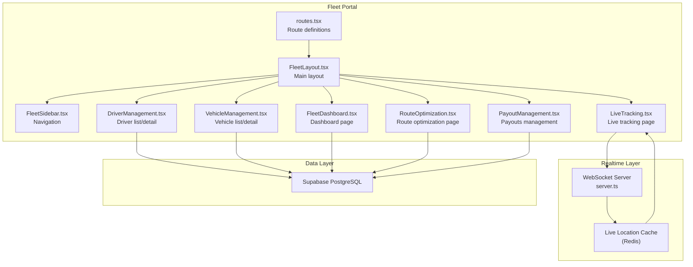
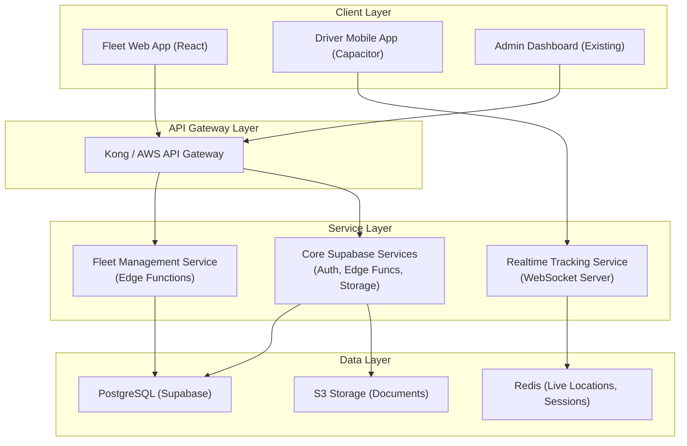
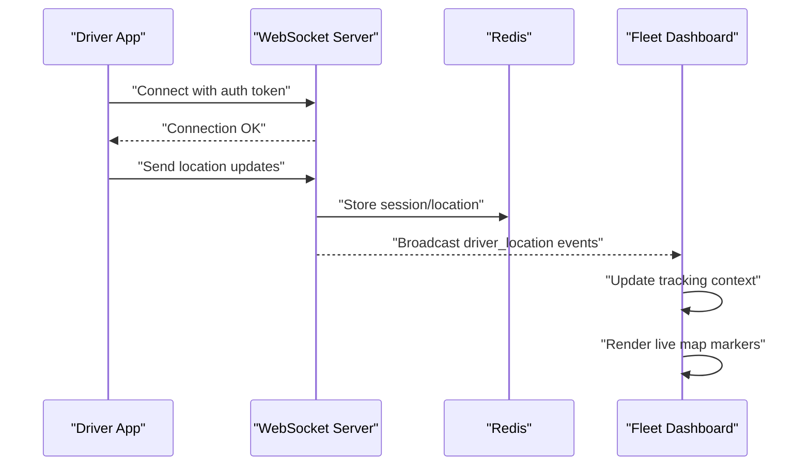
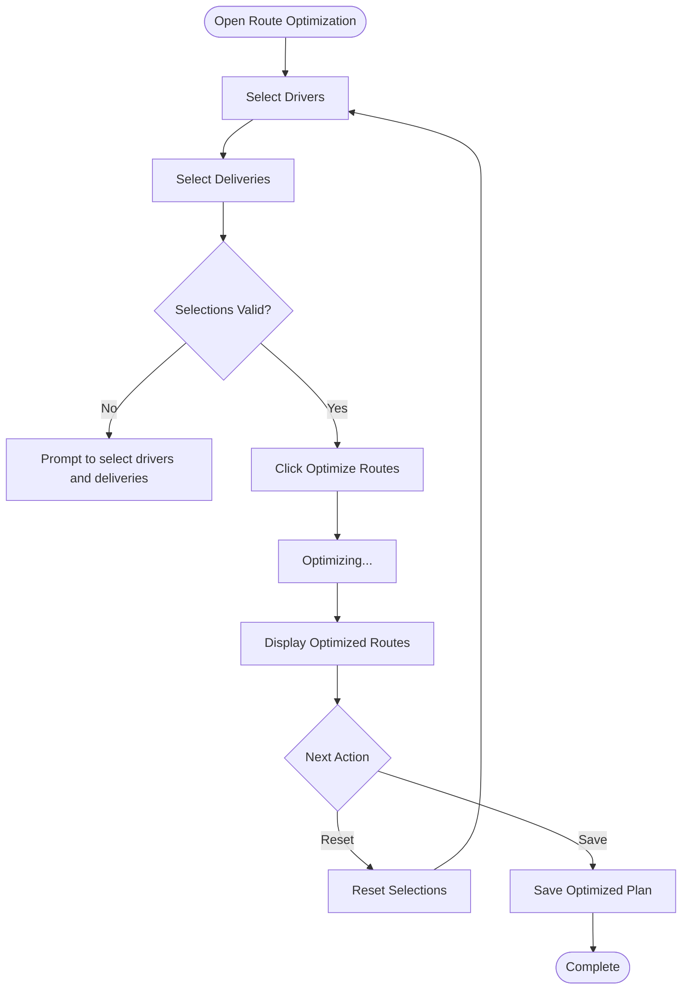
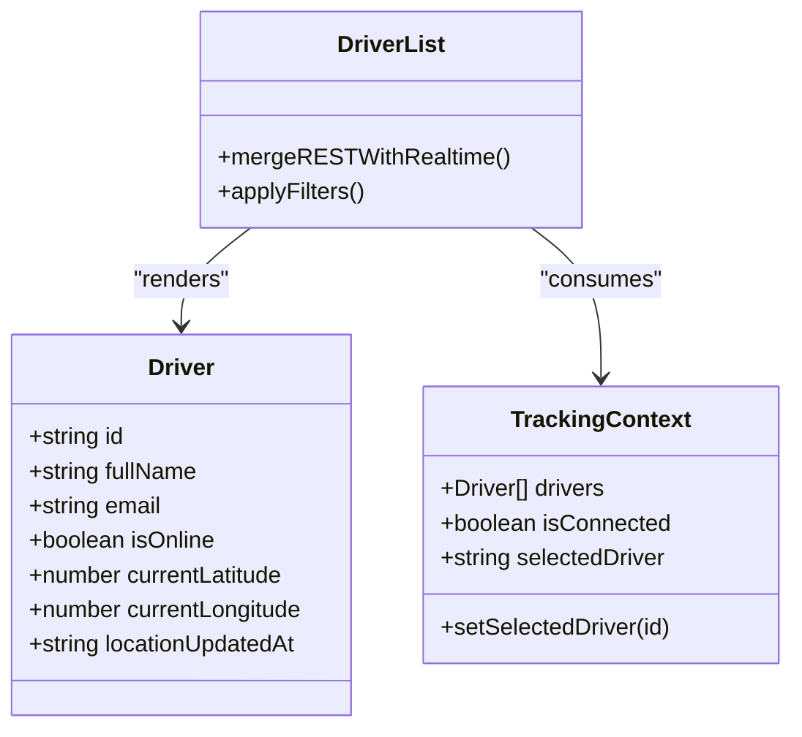
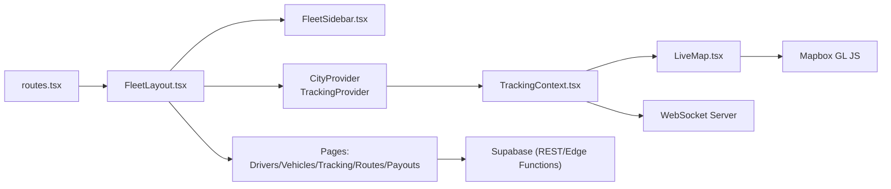

# Fleet Management

<cite>
**Referenced Files in This Document**
- [index.ts](file://src/fleet/index.ts)
- [routes.tsx](file://src/fleet/routes.tsx)
- [FleetLayout.tsx](file://src/fleet/components/layout/FleetLayout.tsx)
- [FleetSidebar.tsx](file://src/fleet/components/layout/FleetSidebar.tsx)
- [LiveMap.tsx](file://docs/fleet-management-portal-design.md)
- [TrackingContext.tsx](file://docs/fleet-management-portal-design.md)
- [CitySelector.tsx](file://docs/fleet-management-portal-design.md)
- [DriverList.tsx](file://docs/fleet-management-portal-design.md)
- [RouteOptimization.tsx](file://src/fleet/pages/RouteOptimization.tsx)
- [server.ts](file://websocket-server/src/server.ts)
- [realtime.spec.ts](file://e2e/system/realtime.spec.ts)
- [fleet-task-plan.md](file://fleet_task_plan.md)
- [fleet-management-portal-design.md](file://docs/fleet-management-portal-design.md)
</cite>

## Table of Contents
1. [Introduction](#introduction)
2. [Project Structure](#project-structure)
3. [Core Components](#core-components)
4. [Architecture Overview](#architecture-overview)
5. [Detailed Component Analysis](#detailed-component-analysis)
6. [Dependency Analysis](#dependency-analysis)
7. [Performance Considerations](#performance-considerations)
8. [Troubleshooting Guide](#troubleshooting-guide)
9. [Conclusion](#conclusion)
10. [Appendices](#appendices)

## Introduction
This document describes the Nutrio logistics and operations fleet management system. It covers driver management, vehicle tracking, and route optimization capabilities, along with the real-time fleet dashboard, driver assignment algorithms, delivery analytics, and operational reporting. It also documents the integration with the WebSocket server for real-time updates, the mobile app features for driver communication, and fleet performance metrics, capacity management, and operational efficiency tools.

## Project Structure
The fleet management system is organized as a dedicated React-based portal integrated into the broader application. Key areas include:
- Routing and layout for the fleet portal
- Real-time tracking via WebSocket and Mapbox
- Route optimization interface
- Authentication and protected routes
- City-based multi-tenancy isolation

**Diagram sources**
- [routes.tsx:20-41](file://src/fleet/routes.tsx#L20-L41)
- [FleetLayout.tsx:16-60](file://src/fleet/components/layout/FleetLayout.tsx#L16-L60)
- [FleetSidebar.tsx:38-85](file://src/fleet/components/layout/FleetSidebar.tsx#L38-L85)
- [LiveMap.tsx:1929-2043](file://docs/fleet-management-portal-design.md#L1929-L2043)
- [TrackingContext.tsx:2049-2179](file://docs/fleet-management-portal-design.md#L2049-L2179)
- [server.ts:242-252](file://websocket-server/src/server.ts#L242-L252)

**Section sources**
- [routes.tsx:1-42](file://src/fleet/routes.tsx#L1-L42)
- [FleetLayout.tsx:1-62](file://src/fleet/components/layout/FleetLayout.tsx#L1-L62)
- [FleetSidebar.tsx:1-85](file://src/fleet/components/layout/FleetSidebar.tsx#L1-L85)

## Core Components
- Fleet portal entry points and routing are defined centrally and lazily loaded for performance.
- The layout composes sidebar, header, and main content area with providers for city and tracking contexts.
- Real-time tracking integrates WebSocket connections and Mapbox for live driver positions.
- Route optimization page provides selection of drivers and deliveries and initiates optimization workflows.
- Protected routes enforce fleet manager authentication and role-based access.

Key exports and types expose driver, vehicle, and dashboard statistics types for consistent usage across the fleet module.

**Section sources**
- [index.ts:1-14](file://src/fleet/index.ts#L1-L14)
- [routes.tsx:1-42](file://src/fleet/routes.tsx#L1-L42)
- [FleetLayout.tsx:16-60](file://src/fleet/components/layout/FleetLayout.tsx#L16-L60)
- [FleetSidebar.tsx:38-85](file://src/fleet/components/layout/FleetSidebar.tsx#L38-L85)
- [RouteOptimization.tsx:30-140](file://src/fleet/pages/RouteOptimization.tsx#L30-L140)

## Architecture Overview
The fleet management system follows a layered architecture:
- Client layer: React-based fleet web app with routing, layout, and UI components.
- API gateway layer: Kong/AWS API Gateway for rate limiting, auth, and routing.
- Service layer: Fleet service (Supabase Edge Functions) and Realtime tracking service (WebSocket server).
- Data layer: PostgreSQL (Supabase) for persistent data and Redis for live location caching.

**Diagram sources**
- [fleet-management-portal-design.md:9-166](file://docs/fleet-management-portal-design.md#L9-L166)

**Section sources**
- [fleet-management-portal-design.md:9-166](file://docs/fleet-management-portal-design.md#L9-L166)

## Detailed Component Analysis

### Real-Time Fleet Dashboard and Live Tracking
The live tracking capability combines REST API polling for initial state and WebSocket streaming for real-time updates. The tracking provider manages socket lifecycle, city-based subscriptions, and driver location updates. The Mapbox-based live map renders driver markers with online/offline status and order associations.

**Diagram sources**
- [TrackingContext.tsx:2086-2141](file://docs/fleet-management-portal-design.md#L2086-L2141)
- [LiveMap.tsx:1945-2043](file://docs/fleet-management-portal-design.md#L1945-L2043)
- [server.ts:242-252](file://websocket-server/src/server.ts#L242-L252)

Implementation highlights:
- WebSocket initialization with auth token and transport preferences.
- City-based subscription for super admin vs. selected cities for regional managers.
- Real-time driver location updates and status change handling.
- Initial REST fetch of driver locations for baseline state.
- Mapbox integration for rendering and updating driver markers.

**Section sources**
- [TrackingContext.tsx:2049-2179](file://docs/fleet-management-portal-design.md#L2049-L2179)
- [LiveMap.tsx:1929-2043](file://docs/fleet-management-portal-design.md#L1929-L2043)
- [CitySelector.tsx:2185-2256](file://docs/fleet-management-portal-design.md#L2185-L2256)
- [DriverList.tsx:2262-2320](file://docs/fleet-management-portal-design.md#L2262-L2320)
- [server.ts:242-252](file://websocket-server/src/server.ts#L242-L252)

### Route Optimization Engine
The route optimization page enables selecting drivers and deliveries, then triggers an optimization process. It supports toggling selections, resetting configurations, and visualizing optimized routes. The page integrates with Supabase for data access and provides UI controls for interactive route planning.

**Diagram sources**
- [RouteOptimization.tsx:141-395](file://src/fleet/pages/RouteOptimization.tsx#L141-L395)

**Section sources**
- [RouteOptimization.tsx:30-395](file://src/fleet/pages/RouteOptimization.tsx#L30-L395)

### Driver Management
Driver management includes listing, adding, and viewing driver details. The driver list merges REST-provided driver records with real-time tracking data to show accurate online/offline status and recent location updates. Filters and search enable efficient management.

**Diagram sources**
- [DriverList.tsx:2262-2320](file://docs/fleet-management-portal-design.md#L2262-L2320)
- [TrackingContext.tsx:2068-2179](file://docs/fleet-management-portal-design.md#L2068-L2179)

**Section sources**
- [DriverList.tsx:2262-2320](file://docs/fleet-management-portal-design.md#L2262-L2320)
- [CitySelector.tsx:2185-2256](file://docs/fleet-management-portal-design.md#L2185-L2256)

### Vehicle Tracking and Capacity Management
Vehicle management provides oversight of the fleet's vehicles, supporting capacity planning and operational efficiency. The system integrates with the city-based filtering and real-time dashboards to ensure accurate, up-to-date information for dispatch decisions.

**Section sources**
- [routes.tsx:14-18](file://src/fleet/routes.tsx#L14-L18)
- [FleetSidebar.tsx:28-36](file://src/fleet/components/layout/FleetSidebar.tsx#L28-L36)

### Payout Management and Operational Reporting
Payout management and processing pages support fleet financial operations. These components integrate with the backend services to manage driver compensation and generate operational reports for performance monitoring.

**Section sources**
- [routes.tsx:16-18](file://src/fleet/routes.tsx#L16-L18)
- [FleetSidebar.tsx:28-36](file://src/fleet/components/layout/FleetSidebar.tsx#L28-L36)

### Mobile App Features for Driver Communication
The driver mobile app communicates with the WebSocket server to stream real-time location updates and receive operational messages. The fleet portal’s city selector and driver list provide supervisors with visibility into driver availability and status.

**Section sources**
- [TrackingContext.tsx:2086-2141](file://docs/fleet-management-portal-design.md#L2086-L2141)
- [CitySelector.tsx:2185-2256](file://docs/fleet-management-portal-design.md#L2185-L2256)
- [DriverList.tsx:2262-2320](file://docs/fleet-management-portal-design.md#L2262-L2320)

## Dependency Analysis
The fleet portal depends on:
- Routing and layout components for navigation and structure.
- Tracking context for real-time data and WebSocket connectivity.
- City context for multi-city filtering and access control.
- Supabase for driver, vehicle, and operational data.
- Mapbox for live map rendering.

**Diagram sources**
- [routes.tsx:1-42](file://src/fleet/routes.tsx#L1-L42)
- [FleetLayout.tsx:16-60](file://src/fleet/components/layout/FleetLayout.tsx#L16-L60)
- [FleetSidebar.tsx:38-85](file://src/fleet/components/layout/FleetSidebar.tsx#L38-L85)
- [TrackingContext.tsx:2049-2179](file://docs/fleet-management-portal-design.md#L2049-L2179)
- [LiveMap.tsx:1929-2043](file://docs/fleet-management-portal-design.md#L1929-L2043)

**Section sources**
- [routes.tsx:1-42](file://src/fleet/routes.tsx#L1-L42)
- [FleetLayout.tsx:16-60](file://src/fleet/components/layout/FleetLayout.tsx#L16-L60)
- [FleetSidebar.tsx:38-85](file://src/fleet/components/layout/FleetSidebar.tsx#L38-L85)
- [TrackingContext.tsx:2049-2179](file://docs/fleet-management-portal-design.md#L2049-L2179)

## Performance Considerations
- Lazy loading of fleet routes reduces initial bundle size.
- WebSocket transport configuration balances reliability and latency.
- Mapbox markers are efficiently updated and removed when drivers go offline.
- City-based filtering limits data volume and improves responsiveness.
- Initial REST fetch ensures immediate state while WebSocket streams updates.

[No sources needed since this section provides general guidance]

## Troubleshooting Guide
Common issues and resolutions:
- WebSocket connection failures: Verify server logs and environment variables for the WebSocket URL and tokens.
- Live map not updating: Confirm city filters and driver online status; check tracking context state.
- Driver list discrepancies: Ensure REST initial fetch completes and real-time updates are applied.
- Route optimization not working: Validate driver and delivery selections; check for network errors during optimization requests.

**Section sources**
- [server.ts:231-239](file://websocket-server/src/server.ts#L231-L239)
- [realtime.spec.ts:8-36](file://e2e/system/realtime.spec.ts#L8-L36)
- [TrackingContext.tsx:2114-2134](file://docs/fleet-management-portal-design.md#L2114-L2134)

## Conclusion
The Nutrio fleet management system provides a comprehensive solution for managing drivers, vehicles, and deliveries with real-time tracking, route optimization, and operational reporting. Its modular architecture, city-based multi-tenancy, and robust real-time capabilities enable efficient fleet operations and informed decision-making.

[No sources needed since this section summarizes without analyzing specific files]

## Appendices

### Fleet Task Plan Highlights
- Vehicle management and live tracking pages were rewritten with Mapbox integration.
- New route optimization page was added to the fleet portal.
- Navigation and routing were extended to support the new features.

**Section sources**
- [fleet-task-plan.md:140-158](file://fleet_task_plan.md#L140-L158)