# Live Tracking & Communication

<cite>
**Referenced Files in This Document**
- [server.ts](file://websocket-server/src/server.ts)
- [events.ts](file://websocket-server/src/types/events.ts)
- [driverHandler.ts](file://websocket-server/src/handlers/driverHandler.ts)
- [fleetHandler.ts](file://websocket-server/src/handlers/fleetHandler.ts)
- [redisService.ts](file://websocket-server/src/services/redisService.ts)
- [trackingSocket.ts](file://src/fleet/services/trackingSocket.ts)
- [TrackingContext.tsx](file://src/fleet/context/TrackingContext.tsx)
- [push.ts](file://src/lib/notifications/push.ts)
- [index.ts](file://supabase/functions/send-push-notification/index.ts)
- [CustomerDeliveryTracker.tsx](file://src/components/customer/CustomerDeliveryTracker.tsx)
- [LiveMap.tsx](file://src/pages/LiveMap.tsx)
- [DriverLayout.tsx](file://src/components/driver/DriverLayout.tsx)
- [20240101000000_add_notification_preferences.sql](file://supabase/migrations/20240101000000_add_notification_preferences.sql)
- [implementation-plan-customer-portal.md](file://docs/implementation-plan-customer-portal.md)
- [fleet-management-portal-design.md](file://docs/fleet-management-portal-design.md)
</cite>

## Table of Contents
1. [Introduction](#introduction)
2. [System Architecture](#system-architecture)
3. [WebSocket Implementation](#websocket-implementation)
4. [Real-Time Data Synchronization](#real-time-data-synchronization)
5. [Push Notification System](#push-notification-system)
6. [Driver Location Tracking](#driver-location-tracking)
7. [Delivery Status Tracking](#delivery-status-tracking)
8. [Live Map Visualization](#live-map-visualization)
9. [Communication Channels](#communication-channels)
10. [Performance & Scalability](#performance-scalability)
11. [Offline Handling Strategies](#offline-handling-strategies)
12. [Emergency Communication Features](#emergency-communication-features)
13. [Troubleshooting Guide](#troubleshooting-guide)
14. [Conclusion](#conclusion)

## Introduction

This document provides comprehensive documentation for the live tracking and real-time communication system. The system enables real-time location sharing, delivery status updates, and instant notifications across three primary user roles: drivers, fleet managers, and customers. It leverages WebSocket technology for bidirectional real-time communication, Redis for caching and pub/sub messaging, and Supabase for database operations and push notifications.

The system supports:
- Real-time driver location updates with configurable update intervals
- Delivery status tracking from preparation to completion
- Live map visualization with driver markers and route history
- Push notifications for order and delivery updates
- Emergency communication features for driver assistance
- Multi-city fleet management with role-based access control
- Offline handling and reconnection strategies

## System Architecture

The live tracking system follows a distributed architecture with clear separation of concerns:

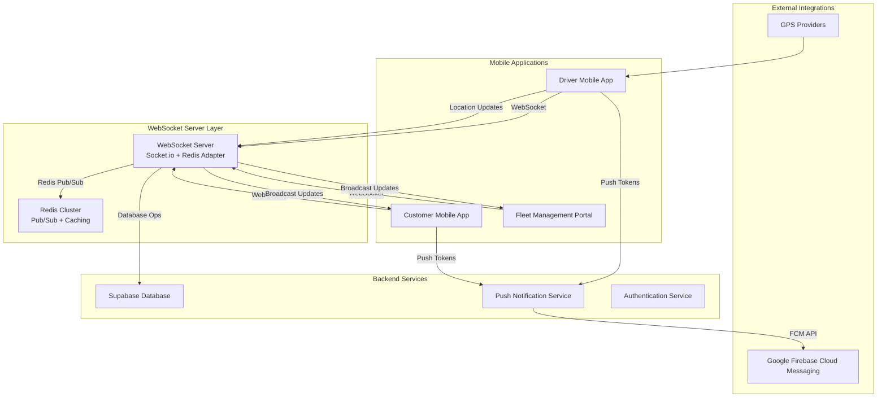

**Diagram sources**
- [server.ts:1-256](file://websocket-server/src/server.ts#L1-L256)
- [events.ts:1-210](file://websocket-server/src/types/events.ts#L1-L210)
- [redisService.ts:1-264](file://websocket-server/src/services/redisService.ts#L1-L264)

**Section sources**
- [server.ts:1-256](file://websocket-server/src/server.ts#L1-L256)
- [fleet-management-portal-design.md:1300-1354](file://docs/fleet-management-portal-design.md#L1300-L1354)

## WebSocket Implementation

The WebSocket server provides real-time bidirectional communication using Socket.io with Redis adapter for horizontal scaling:

### Server Configuration & Security

The WebSocket server implements robust security and scalability features:

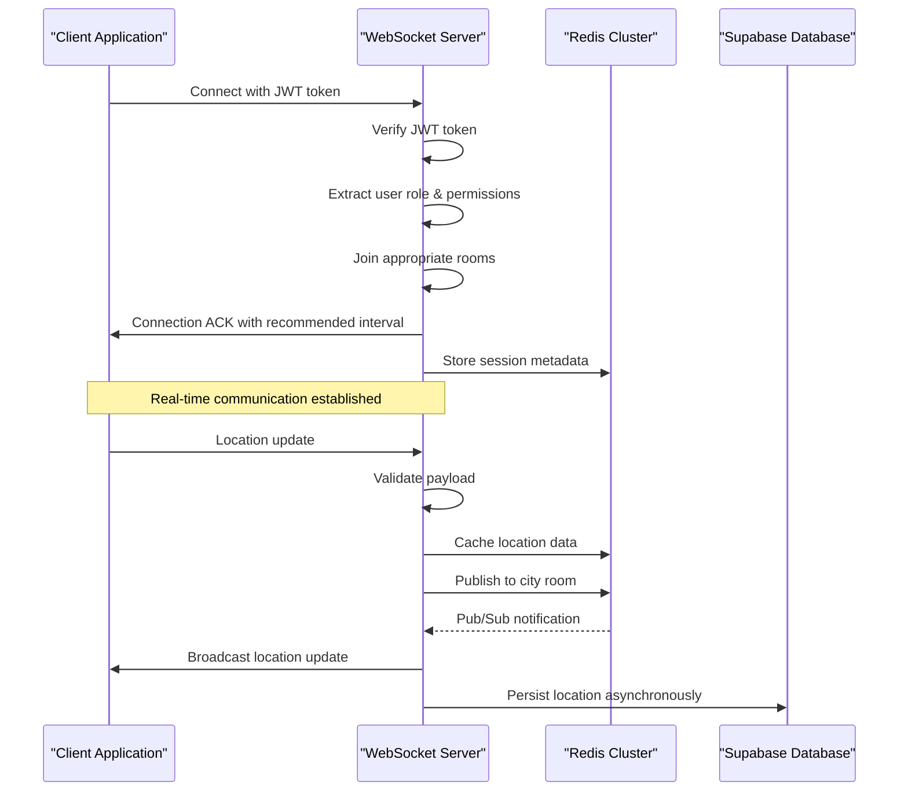

**Diagram sources**
- [server.ts:65-103](file://websocket-server/src/server.ts#L65-L103)
- [driverHandler.ts:48-80](file://websocket-server/src/handlers/driverHandler.ts#L48-L80)

### Event Types & Message Flow

The system defines standardized event types for different communication patterns:

| Event Category | Event Names | Purpose |
|---|---|---|
| Driver → Server | `location:update` | Send location updates |
| Driver → Server | `driver:status` | Update driver availability |
| Fleet → Server | `fleet:subscribe_city` | Subscribe to city broadcasts |
| Fleet → Server | `fleet:request_history` | Request historical locations |
| Server → Driver | `connection:ack` | Connection acknowledgment |
| Server → Fleet | `fleet:driver_location` | Broadcast driver locations |
| Server → Fleet | `fleet:driver_status` | Broadcast status changes |
| Server → Fleet | `fleet:stats_update` | Send city statistics |
| Server → Client | `error` | Error notifications |

**Section sources**
- [events.ts:157-178](file://websocket-server/src/types/events.ts#L157-L178)
- [server.ts:38-51](file://websocket-server/src/server.ts#L38-L51)

## Real-Time Data Synchronization

### Driver Location Updates

The driver location update system implements rate limiting, validation, and caching:

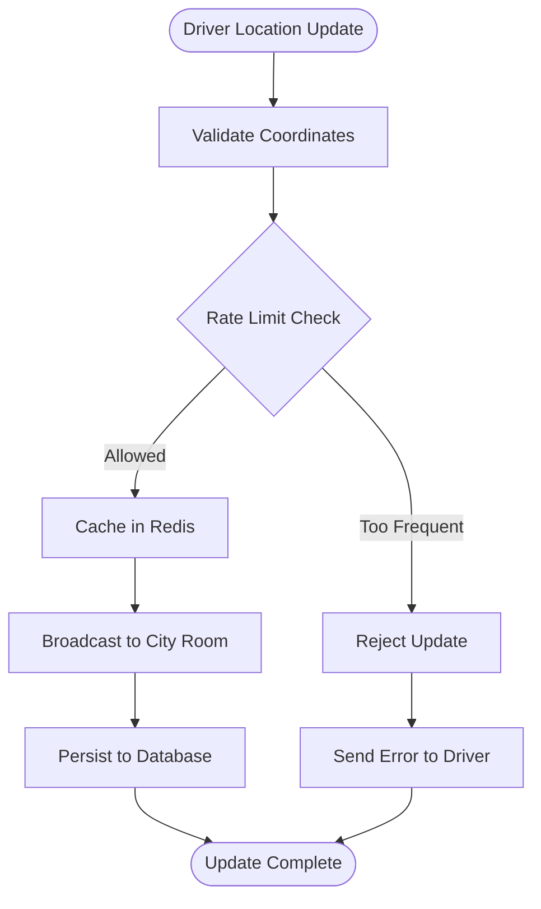

**Diagram sources**
- [driverHandler.ts:105-207](file://websocket-server/src/handlers/driverHandler.ts#L105-L207)

### Fleet Manager Subscriptions

Fleet managers can subscribe to multiple cities with role-based access control:

| User Role | Access Level | City Access |
|---|---|---|
| Super Admin | Full Access | All cities |
| Fleet Manager | Limited Access | Assigned cities only |

**Section sources**
- [driverHandler.ts:105-207](file://websocket-server/src/handlers/driverHandler.ts#L105-L207)
- [fleetHandler.ts:36-62](file://websocket-server/src/handlers/fleetHandler.ts#L36-L62)

## Push Notification System

### Native Mobile Push Notifications

The system provides native push notification support for iOS and Android devices:

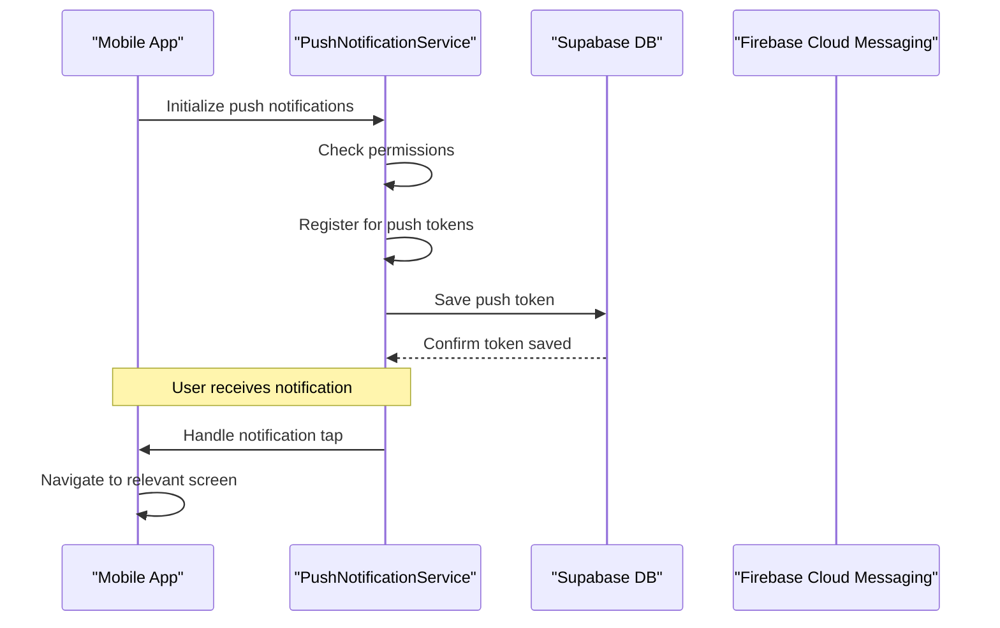

**Diagram sources**
- [push.ts:25-75](file://src/lib/notifications/push.ts#L25-L75)
- [index.ts:178-300](file://supabase/functions/send-push-notification/index.ts#L178-L300)

### Notification Delivery Pipeline

The push notification system handles token management, delivery, and error recovery:

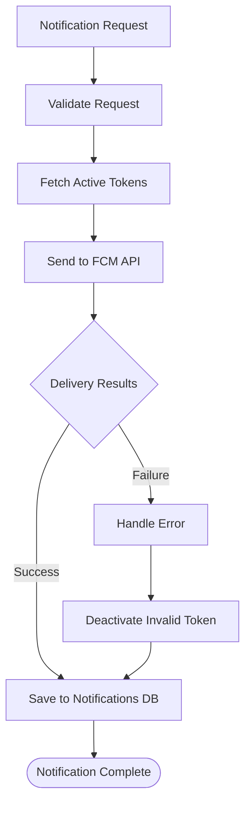

**Diagram sources**
- [index.ts:213-282](file://supabase/functions/send-push-notification/index.ts#L213-L282)

**Section sources**
- [push.ts:1-137](file://src/lib/notifications/push.ts#L1-L137)
- [index.ts:1-300](file://supabase/functions/send-push-notification/index.ts#L1-L300)

## Driver Location Tracking

### Location Update Frequency & Accuracy

The system implements configurable location update intervals with accuracy validation:

| Parameter | Value | Description |
|---|---|---|
| Minimum Update Interval | 5 seconds | Prevents excessive updates |
| Location Cache TTL | 300 seconds | Redis cache expiration |
| Status Cache TTL | 60 seconds | Driver status cache |
| Maximum History Points | 1000 | Location history limit |

### Geolocation Implementation

Driver applications use HTML5 geolocation with fallback strategies:

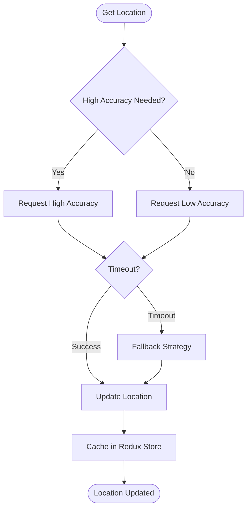

**Diagram sources**
- [DriverLayout.tsx:184-197](file://src/components/driver/DriverLayout.tsx#L184-L197)

**Section sources**
- [driverHandler.ts:24-37](file://websocket-server/src/handlers/driverHandler.ts#L24-L37)
- [redisService.ts:15-17](file://websocket-server/src/services/redisService.ts#L15-L17)
- [DriverLayout.tsx:164-208](file://src/components/driver/DriverLayout.tsx#L164-L208)

## Delivery Status Tracking

### Status Workflow

The delivery lifecycle follows a structured progression:

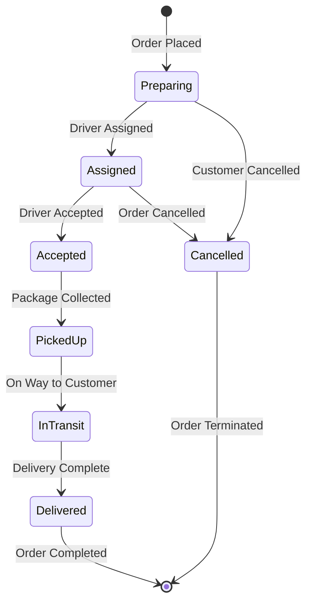

### Real-Time Status Updates

Customer applications receive real-time status updates through Supabase Postgres changes:

| Status | Customer Notification | Driver Notification |
|---|---|---|
| Order Confirmed | Toast notification | None |
| Meal Prepared | Toast notification | None |
| Ready for Pickup | Toast notification | None |
| Out for Delivery | Live tracking enabled | None |
| Delivered | Celebration message | None |

**Section sources**
- [CustomerDeliveryTracker.tsx:258-275](file://src/components/customer/CustomerDeliveryTracker.tsx#L258-L275)

## Live Map Visualization

### Map Integration

The system provides interactive map visualization with real-time driver tracking:

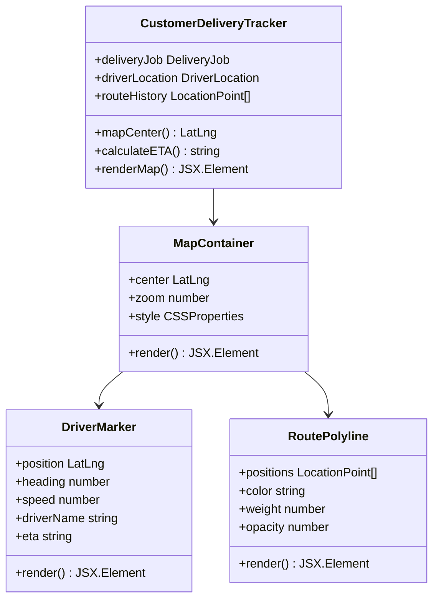

**Diagram sources**
- [CustomerDeliveryTracker.tsx:110-726](file://src/components/customer/CustomerDeliveryTracker.tsx#L110-L726)

### Map Features

| Feature | Implementation | Purpose |
|---|---|---|
| Live Driver Tracking | WebSocket + Supabase | Real-time position updates |
| Route History | Polyline rendering | Show driver path |
| ETA Calculation | Haversine formula | Predict delivery time |
| Driver Information | Popup cards | Contact and vehicle details |
| Responsive Design | Mobile-first layout | Optimal viewing on phones |

**Section sources**
- [CustomerDeliveryTracker.tsx:568-635](file://src/components/customer/CustomerDeliveryTracker.tsx#L568-L635)
- [LiveMap.tsx:1-20](file://src/pages/LiveMap.tsx#L1-L20)

## Communication Channels

### Multi-Room Architecture

The system uses a multi-room architecture for efficient message routing:

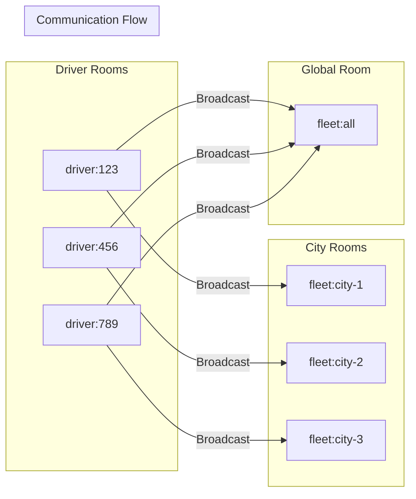

**Diagram sources**
- [events.ts:182-186](file://websocket-server/src/types/events.ts#L182-L186)
- [driverHandler.ts:172-182](file://websocket-server/src/handlers/driverHandler.ts#L172-L182)

### Role-Based Access Control

Different user roles have distinct communication privileges:

| Role | Can View All Drivers | Can View Specific City | Can Send Messages |
|---|---|---|---|
| Super Admin | ✓ | ✓ | ✓ |
| Fleet Manager | ✗ | ✓ | ✗ |
| Driver | ✗ | ✗ | ✓ |
| Customer | ✗ | ✗ | ✗ |

**Section sources**
- [fleetHandler.ts:36-62](file://websocket-server/src/handlers/fleetHandler.ts#L36-L62)

## Performance & Scalability

### Horizontal Scaling

The WebSocket server supports horizontal scaling through Redis adapter:

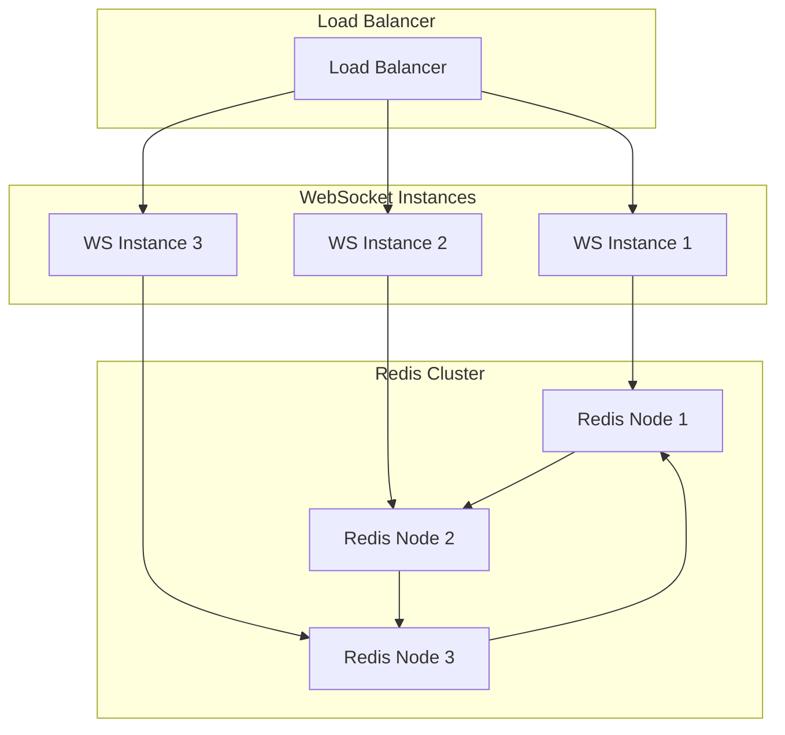

**Diagram sources**
- [server.ts:54-55](file://websocket-server/src/server.ts#L54-L55)
- [redisService.ts:26-42](file://websocket-server/src/services/redisService.ts#L26-L42)

### Connection Management

The server implements connection limits and health monitoring:

| Metric | Threshold | Action |
|---|---|---|
| Total Connections | 10,000 | Reject new connections |
| Driver Connections | Unlimited | Monitor usage |
| Ping Interval | 25 seconds | Keep connections alive |
| Ping Timeout | 60 seconds | Close stale connections |
| Upgrade Timeout | 10 seconds | Handle slow connections |

**Section sources**
- [server.ts:19-26](file://websocket-server/src/server.ts#L19-L26)
- [server.ts:108-150](file://websocket-server/src/server.ts#L108-L150)

## Offline Handling Strategies

### Reconnection Logic

The client implements exponential backoff for automatic reconnection:

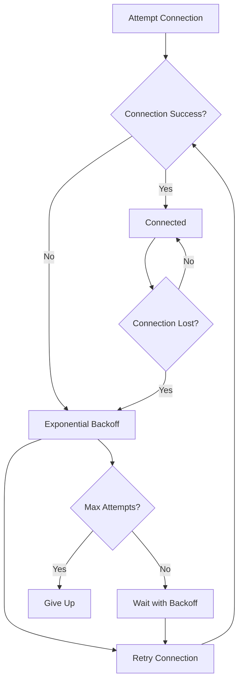

**Diagram sources**
- [trackingSocket.ts:162-178](file://src/fleet/services/trackingSocket.ts#L162-L178)

### Data Persistence

The system maintains local state during offline periods:

| Data Type | Local Storage | Sync Strategy |
|---|---|---|
| Driver Locations | In-memory cache | Sync on reconnect |
| Delivery Status | Redux store | Real-time updates |
| User Preferences | Local storage | Sync on login |
| Map State | Component state | Restore on reconnect |

**Section sources**
- [trackingSocket.ts:25-33](file://src/fleet/services/trackingSocket.ts#L25-L33)
- [TrackingContext.tsx:22-28](file://src/fleet/context/TrackingContext.tsx#L22-L28)

## Emergency Communication Features

### Emergency Button Implementation

Driver applications include emergency communication capabilities:

| Feature | Implementation | Trigger |
|---|---|---|
| Emergency Button | Dedicated UI element | Long press gesture |
| Location Sharing | Real-time GPS | Automatic updates |
| Contact Support | Predefined contacts | Manual selection |
| Auto-alert | Emergency template | System triggers |
| Location History | 24-hour trail | Persistent storage |

### Support Integration

The system integrates with external support systems:

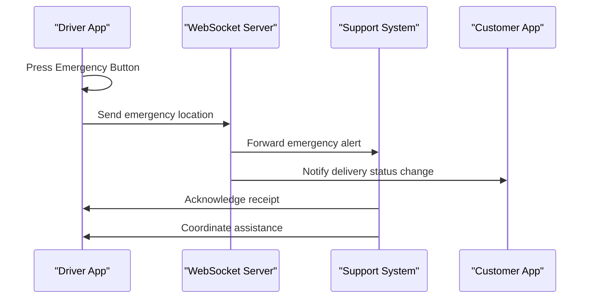

**Section sources**
- [DriverLayout.tsx:199-208](file://src/components/driver/DriverLayout.tsx#L199-L208)

## Troubleshooting Guide

### Common Connection Issues

| Issue | Symptoms | Solution |
|---|---|---|
| Connection Refused | Server unreachable | Check network connectivity |
| Authentication Failed | Invalid token error | Verify JWT token validity |
| Rate Limited | Update rejected | Wait for minimum interval |
| Redis Unavailable | Cache operations fail | Check Redis cluster status |
| Memory Leaks | Gradual performance degradation | Monitor connection cleanup |

### Performance Optimization

Recommended optimizations for large-scale deployments:

1. **Connection Pooling**: Use connection pooling for database operations
2. **Message Compression**: Enable compression for large payloads
3. **Batch Updates**: Batch multiple updates to reduce network overhead
4. **Lazy Loading**: Load map components only when needed
5. **Memory Management**: Implement proper cleanup for event listeners

### Monitoring & Metrics

Key metrics to monitor:

- **Connection Metrics**: Active connections, connection failures
- **Message Metrics**: Messages per second, message delivery rates
- **Performance Metrics**: Response times, memory usage, CPU utilization
- **Error Metrics**: Error rates, retry counts, failure reasons

**Section sources**
- [server.ts:155-157](file://websocket-server/src/server.ts#L155-L157)
- [server.ts:162-192](file://websocket-server/src/server.ts#L162-L192)

## Conclusion

The live tracking and real-time communication system provides a robust foundation for fleet management and customer experience. Its architecture balances real-time responsiveness with scalability, supporting thousands of concurrent connections through Redis clustering and Socket.io scaling.

Key strengths include:
- **Real-time Communication**: Bidirectional WebSocket messaging with reliable delivery
- **Multi-platform Support**: Native mobile push notifications with cross-platform compatibility
- **Scalable Architecture**: Horizontal scaling through Redis pub/sub and load balancing
- **Comprehensive Features**: From basic location tracking to advanced emergency communication
- **Performance Optimization**: Configurable update intervals and efficient caching strategies

The system successfully addresses the core requirements of live tracking, real-time communication, and push notifications while maintaining reliability and performance at scale. Future enhancements could include advanced analytics, predictive routing, and enhanced emergency response capabilities.