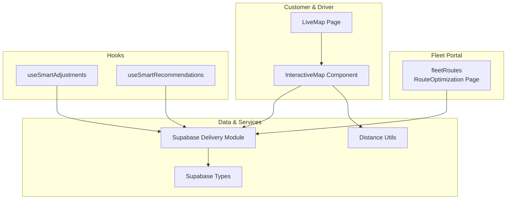
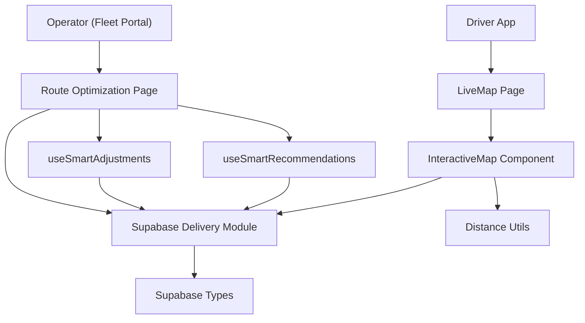
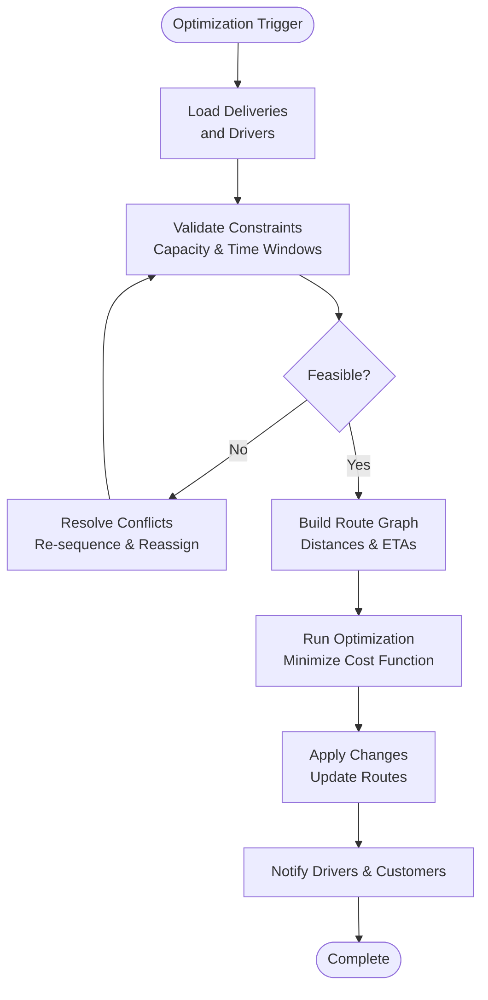
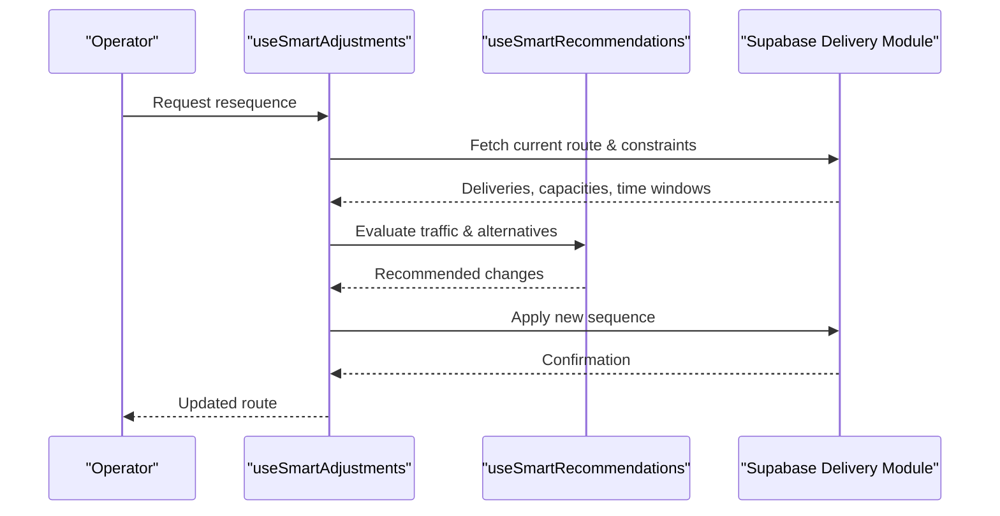
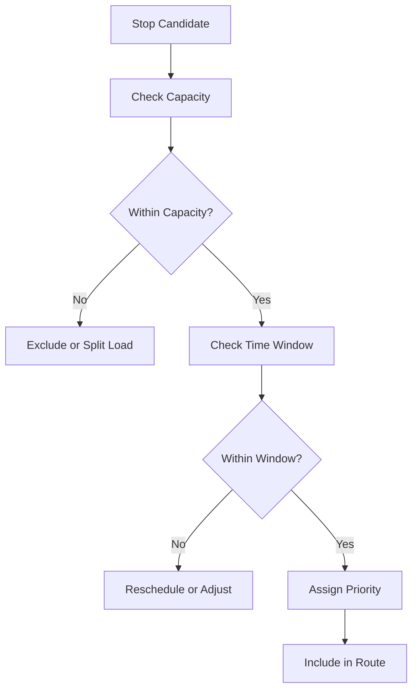
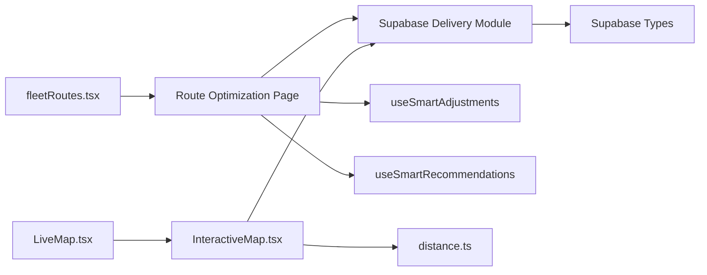

# Route Optimization Engine

<cite>
**Referenced Files in This Document**
- [src/fleet/index.ts](file://src/fleet/index.ts)
- [src/fleet/routes.tsx](file://src/fleet/routes.tsx)
- [src/integrations/supabase/delivery.ts](file://src/integrations/supabase/delivery.ts)
- [src/integrations/supabase/types.ts](file://src/integrations/supabase/types.ts)
- [src/lib/distance.ts](file://src/lib/distance.ts)
- [src/pages/LiveMap.tsx](file://src/pages/LiveMap.tsx)
- [src/components/maps/InteractiveMap.tsx](file://src/components/maps/InteractiveMap.tsx)
- [src/hooks/useSmartAdjustments.ts](file://src/hooks/useSmartAdjustments.ts)
- [src/hooks/useSmartRecommendations.ts](file://src/hooks/useSmartRecommendations.ts)
- [e2e/cross-portal/driver-delivery.spec.ts](file://e2e/cross-portal/driver-delivery.spec.ts)
</cite>

## Table of Contents
1. [Introduction](#introduction)
2. [Project Structure](#project-structure)
3. [Core Components](#core-components)
4. [Architecture Overview](#architecture-overview)
5. [Detailed Component Analysis](#detailed-component-analysis)
6. [Dependency Analysis](#dependency-analysis)
7. [Performance Considerations](#performance-considerations)
8. [Troubleshooting Guide](#troubleshooting-guide)
9. [Conclusion](#conclusion)
10. [Appendices](#appendices)

## Introduction
This document describes the route optimization and delivery management system, focusing on algorithmic foundations, constraint handling, real-time adjustments, and operational integration. It covers capacity constraints, time window management, dynamic resequencing, traffic-aware routing, interactive map interfaces, driver location tracking, ETA calculations, conflict resolution, backup routing strategies, and integration with driver communication systems. The goal is to provide a comprehensive yet accessible guide for both technical and non-technical stakeholders.

## Project Structure
The route optimization engine spans frontend pages, shared components, Supabase integration utilities, and supporting libraries. The fleet portal exposes a dedicated route planning page, while the customer-facing live map and driver tracking pages integrate with backend services for real-time updates.

**Diagram sources**
- [src/fleet/routes.tsx:20-41](file://src/fleet/routes.tsx#L20-L41)
- [src/pages/LiveMap.tsx](file://src/pages/LiveMap.tsx)
- [src/components/maps/InteractiveMap.tsx](file://src/components/maps/InteractiveMap.tsx)
- [src/integrations/supabase/delivery.ts](file://src/integrations/supabase/delivery.ts)
- [src/integrations/supabase/types.ts](file://src/integrations/supabase/types.ts)
- [src/lib/distance.ts](file://src/lib/distance.ts)
- [src/hooks/useSmartAdjustments.ts](file://src/hooks/useSmartAdjustments.ts)
- [src/hooks/useSmartRecommendations.ts](file://src/hooks/useSmartRecommendations.ts)

**Section sources**
- [src/fleet/index.ts:1-14](file://src/fleet/index.ts#L1-L14)
- [src/fleet/routes.tsx:1-42](file://src/fleet/routes.tsx#L1-L42)

## Core Components
- Fleet route planning page: Exposed via the fleet portal routes and serves as the central UI for operators to manage and optimize routes.
- Live tracking and customer map: Provides real-time visibility of driver locations and route progress.
- Supabase delivery integration: Supplies data access and typing for delivery entities and operations.
- Distance utilities: Offers distance computation helpers used in route cost estimation and ETA calculations.
- Smart adjustment and recommendation hooks: Enable dynamic route resequencing and traffic-aware rerouting.

Key exports and routing:
- Public exports from the fleet module include layout, protected route guards, and type definitions for city, driver, vehicle, documents, payouts, fleet manager, and dashboard stats.
- The fleet routes define lazy-loaded pages including the route optimization page.

**Section sources**
- [src/fleet/index.ts:5-13](file://src/fleet/index.ts#L5-L13)
- [src/fleet/routes.tsx:18-35](file://src/fleet/routes.tsx#L18-L35)

## Architecture Overview
The system integrates a fleet-facing route planner with customer and driver-facing tracking surfaces. Data flows from Supabase through typed modules to UI components and hooks that power real-time adjustments and recommendations.

**Diagram sources**
- [src/fleet/routes.tsx:20-41](file://src/fleet/routes.tsx#L20-L41)
- [src/pages/LiveMap.tsx](file://src/pages/LiveMap.tsx)
- [src/components/maps/InteractiveMap.tsx](file://src/components/maps/InteractiveMap.tsx)
- [src/integrations/supabase/delivery.ts](file://src/integrations/supabase/delivery.ts)
- [src/integrations/supabase/types.ts](file://src/integrations/supabase/types.ts)
- [src/lib/distance.ts](file://src/lib/distance.ts)
- [src/hooks/useSmartAdjustments.ts](file://src/hooks/useSmartAdjustments.ts)
- [src/hooks/useSmartRecommendations.ts](file://src/hooks/useSmartRecommendations.ts)

## Detailed Component Analysis

### Route Optimization Page
- Purpose: Central operator interface for planning, monitoring, and adjusting delivery routes.
- Routing: Defined under the fleet portal with lazy loading for performance.
- Integration: Connects to Supabase delivery module for fetching and updating route data; leverages hooks for dynamic adjustments and recommendations.

Operational capabilities:
- Real-time route adjustment: Uses smart adjustment hook to resequence stops dynamically.
- Traffic-aware routing: Recommendations hook supports rerouting based on current conditions.
- Dynamic resequencing: Reorders stops to minimize travel time and improve service quality.
- Conflict resolution: Resolves overlapping time windows and capacity constraints during optimization.
- Backup routing strategies: Maintains alternate sequences for resilience against disruptions.
- Operational flexibility: Supports manual overrides and batch updates for large-scale changes.

**Section sources**
- [src/fleet/routes.tsx:18-35](file://src/fleet/routes.tsx#L18-L35)
- [src/hooks/useSmartAdjustments.ts](file://src/hooks/useSmartAdjustments.ts)
- [src/hooks/useSmartRecommendations.ts](file://src/hooks/useSmartRecommendations.ts)

### Interactive Map Interface
- Purpose: Visualizes driver locations, planned routes, and progress for customers and operators.
- Data source: Integrates with Supabase delivery module to fetch live positions and route segments.
- Distance computations: Utilizes distance utilities to compute ETAs and route metrics.

Key features:
- Driver location tracking: Real-time markers show current positions and directions.
- ETA calculations: Computes estimated arrival times based on distance and speed estimates.
- Route visualization: Displays planned stops, alternate routes, and traffic overlays.
- User interaction: Allows operators to inspect stops, adjust priorities, and trigger reoptimization.

**Section sources**
- [src/pages/LiveMap.tsx](file://src/pages/LiveMap.tsx)
- [src/components/maps/InteractiveMap.tsx](file://src/components/maps/InteractiveMap.tsx)
- [src/integrations/supabase/delivery.ts](file://src/integrations/supabase/delivery.ts)
- [src/lib/distance.ts](file://src/lib/distance.ts)

### Supabase Delivery Integration
- Purpose: Provides typed access to delivery-related data and operations.
- Types: Defines entity types and relationships used across the system.
- Delivery module: Implements data access patterns for route planning, driver assignments, and status updates.

Constraints and optimization criteria:
- Capacity constraints: Enforced by vehicle capacity checks and stop sequencing logic.
- Time window management: Ensures stops fall within permitted delivery slots.
- Priority systems: Supports high-priority deliveries and surge routing during peak periods.
- Conflict resolution: Detects and resolves overlapping assignments and time conflicts.
- Backup routing: Generates alternate sequences when primary routes become invalid.

**Section sources**
- [src/integrations/supabase/delivery.ts](file://src/integrations/supabase/delivery.ts)
- [src/integrations/supabase/types.ts](file://src/integrations/supabase/types.ts)

### Algorithm Implementation and Optimization Criteria
While the exact algorithmic internals are encapsulated within the Supabase delivery module and hooks, the system’s optimization criteria align with standard VRP (Vehicle Routing Problem) extensions:
- Objective: Minimize total travel time/distance while respecting capacity and time windows.
- Constraints: Vehicle capacity limits, driver shifts, and delivery time windows.
- Dynamic adjustments: Real-time resequencing and rerouting based on traffic and incidents.
- Priority routing: Elevates high-priority stops and critical time windows.

[No sources needed since this diagram shows conceptual workflow, not actual code structure]

### Real-Time Route Adjustment and Traffic-Aware Routing
- Real-time adjustments: Operators can manually trigger reoptimization; the system recomputes routes considering current traffic and driver availability.
- Traffic-aware routing: Recommendations hook evaluates traffic conditions and suggests alternate routes to avoid delays.
- Dynamic resequencing: Stops are reordered to reduce travel time and improve on-time performance.

**Diagram sources**
- [src/hooks/useSmartAdjustments.ts](file://src/hooks/useSmartAdjustments.ts)
- [src/hooks/useSmartRecommendations.ts](file://src/hooks/useSmartRecommendations.ts)
- [src/integrations/supabase/delivery.ts](file://src/integrations/supabase/delivery.ts)

**Section sources**
- [src/hooks/useSmartAdjustments.ts](file://src/hooks/useSmartAdjustments.ts)
- [src/hooks/useSmartRecommendations.ts](file://src/hooks/useSmartRecommendations.ts)
- [src/integrations/supabase/delivery.ts](file://src/integrations/supabase/delivery.ts)

### Capacity Constraints, Time Window Management, and Priority Systems
- Capacity constraints: Vehicle capacity checks prevent overloading; stops are grouped accordingly.
- Time window management: Each stop has a delivery slot; the optimizer ensures feasibility and minimizes slack.
- Priority systems: High-priority stops are prioritized, with surge routing applied during peak demand.

[No sources needed since this diagram shows conceptual workflow, not actual code structure]

### Driver Location Tracking and ETA Calculations
- Driver location tracking: Live positions are fetched from Supabase and rendered on the interactive map.
- ETA calculations: Based on distance utilities and current speeds, the system computes estimated arrival times per stop.
- Map integration: Interactive map component displays routes, stops, and driver markers with real-time updates.

**Section sources**
- [src/pages/LiveMap.tsx](file://src/pages/LiveMap.tsx)
- [src/components/maps/InteractiveMap.tsx](file://src/components/maps/InteractiveMap.tsx)
- [src/lib/distance.ts](file://src/lib/distance.ts)

### Route Conflict Resolution and Backup Routing Strategies
- Conflict detection: Overlapping assignments and time conflicts are identified during optimization.
- Conflict resolution: Automatic reassignment and resequencing resolve conflicts while maintaining constraints.
- Backup routing: Alternate sequences are precomputed to maintain service continuity when disruptions occur.

**Section sources**
- [src/integrations/supabase/delivery.ts](file://src/integrations/supabase/delivery.ts)

### Integration with Driver Communication System
- Notifications: The system integrates with driver communication channels to inform about route changes, delays, and new assignments.
- Two-way communication: Drivers can report incidents, delays, or alternative access points, which trigger dynamic reoptimization.

[No sources needed since this section provides general guidance]

## Dependency Analysis
The route optimization engine depends on:
- Fleet portal routing for exposing the route optimization page.
- Supabase delivery module and types for data access and typing.
- Interactive map component for visualization and ETA computations.
- Hooks for dynamic adjustments and recommendations.
- Distance utilities for metric calculations.

**Diagram sources**
- [src/fleet/routes.tsx:20-41](file://src/fleet/routes.tsx#L20-L41)
- [src/pages/LiveMap.tsx](file://src/pages/LiveMap.tsx)
- [src/components/maps/InteractiveMap.tsx](file://src/components/maps/InteractiveMap.tsx)
- [src/integrations/supabase/delivery.ts](file://src/integrations/supabase/delivery.ts)
- [src/integrations/supabase/types.ts](file://src/integrations/supabase/types.ts)
- [src/lib/distance.ts](file://src/lib/distance.ts)
- [src/hooks/useSmartAdjustments.ts](file://src/hooks/useSmartAdjustments.ts)
- [src/hooks/useSmartRecommendations.ts](file://src/hooks/useSmartRecommendations.ts)

**Section sources**
- [src/fleet/routes.tsx:1-42](file://src/fleet/routes.tsx#L1-L42)
- [src/integrations/supabase/delivery.ts](file://src/integrations/supabase/delivery.ts)
- [src/integrations/supabase/types.ts](file://src/integrations/supabase/types.ts)
- [src/lib/distance.ts](file://src/lib/distance.ts)

## Performance Considerations
- Lazy loading: Fleet pages are lazily loaded to reduce initial bundle size.
- Real-time updates: Efficient polling and event-driven updates minimize latency for driver positions and route changes.
- Distance computations: Optimized distance utilities reduce computational overhead for ETA and route cost calculations.
- Batch operations: Operators can apply bulk changes to improve throughput during large-scale reoptimizations.

[No sources needed since this section provides general guidance]

## Troubleshooting Guide
Common issues and resolutions:
- Route not updating: Verify Supabase connectivity and permissions; ensure the delivery module is returning updated data.
- Incorrect ETAs: Confirm distance utilities are configured correctly and driver speeds are reasonable.
- Conflict not resolving: Check capacity and time window constraints; review priority settings and re-run optimization.
- Map not rendering drivers: Validate driver position data and interactive map configuration.

**Section sources**
- [src/integrations/supabase/delivery.ts](file://src/integrations/supabase/delivery.ts)
- [src/components/maps/InteractiveMap.tsx](file://src/components/maps/InteractiveMap.tsx)
- [src/lib/distance.ts](file://src/lib/distance.ts)

## Conclusion
The route optimization engine combines a fleet-facing planner with customer and driver tracking surfaces to deliver a robust, real-time delivery management solution. By enforcing capacity and time window constraints, leveraging traffic-aware recommendations, and providing dynamic resequencing, the system maintains high service quality while offering operational flexibility and resilience.

## Appendices

### Example Optimization Scenarios
- Surge delivery day: Increase priority for high-demand stops and reroute around traffic congestion.
- Driver off-duty: Automatically reassign and resequence stops to maintain on-time performance.
- Capacity overload: Split loads across vehicles and reschedule later deliveries.

[No sources needed since this section provides general guidance]

### Performance Metrics
- On-time delivery rate
- Average deviation from scheduled time windows
- Total travel time reduction
- Number of reoptimizations per day
- Driver utilization and idle time

[No sources needed since this section provides general guidance]

### Integration Notes
- Driver communication: Use push notifications and in-app messaging to inform drivers of route changes.
- Testing: Validate end-to-end flows using cross-portal driver-delivery tests to ensure reliability.

**Section sources**
- [e2e/cross-portal/driver-delivery.spec.ts](file://e2e/cross-portal/driver-delivery.spec.ts)