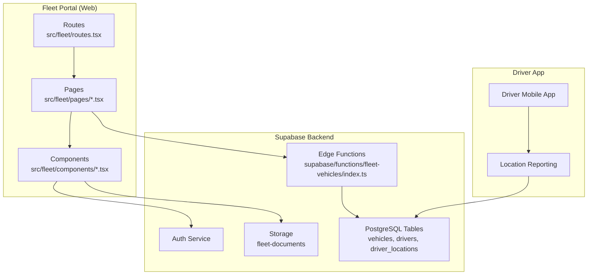
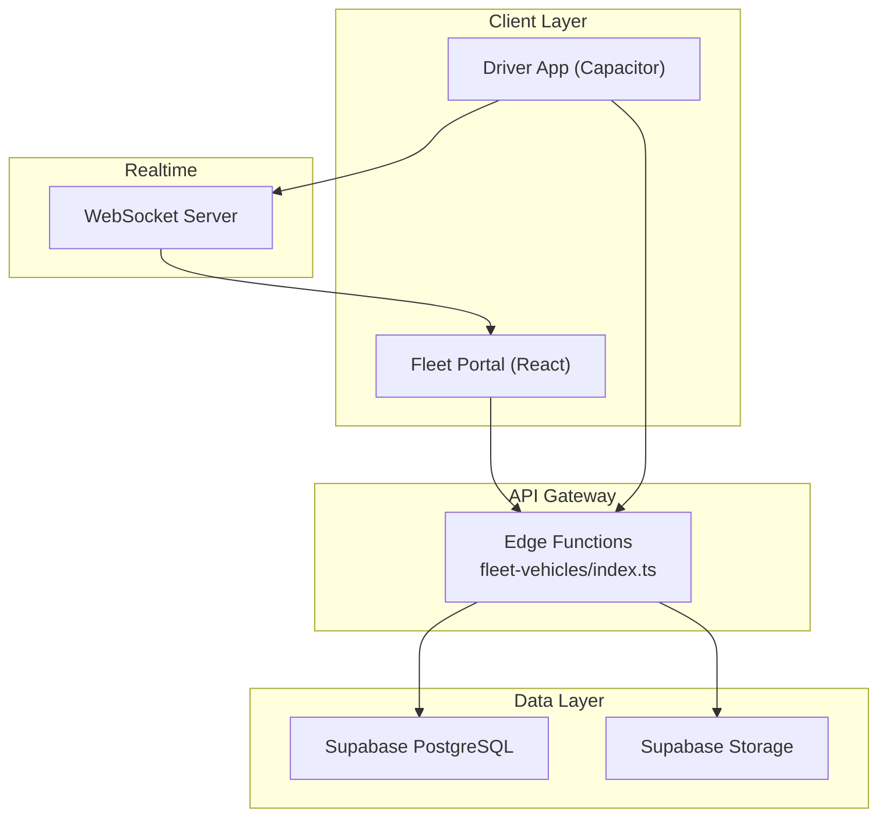
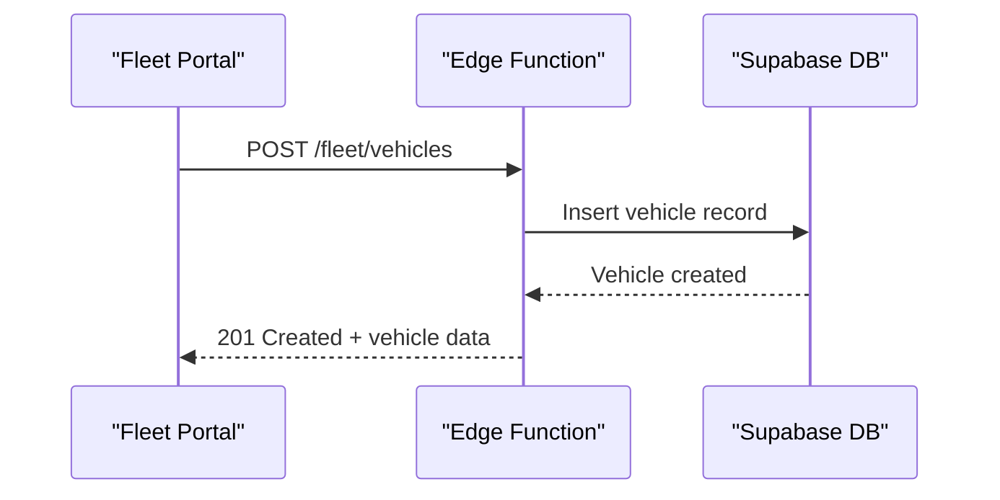
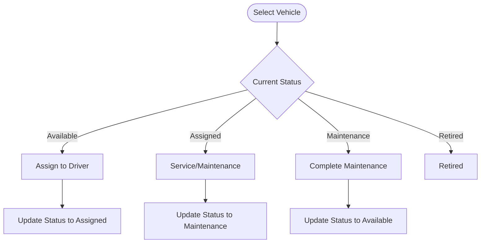
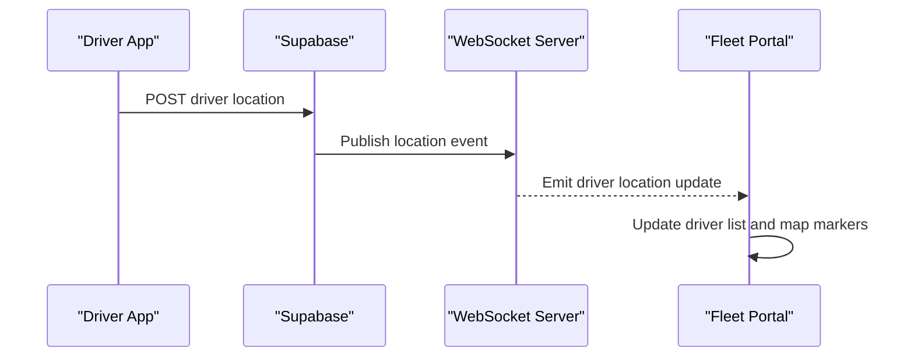
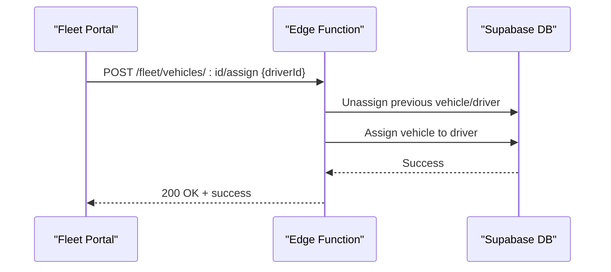
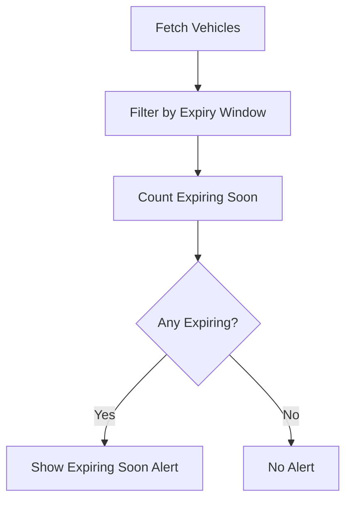
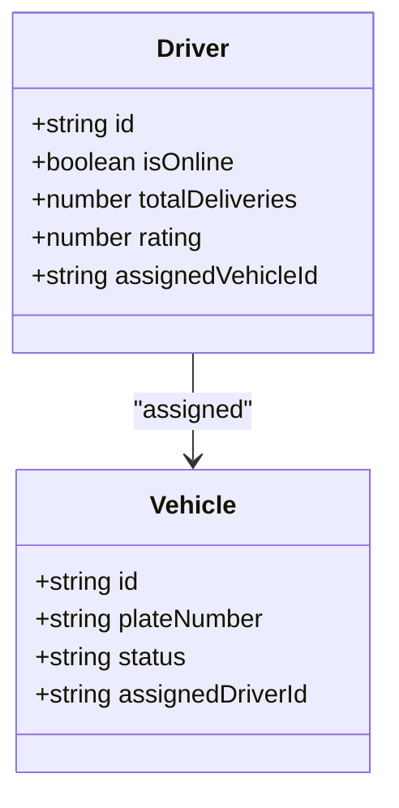
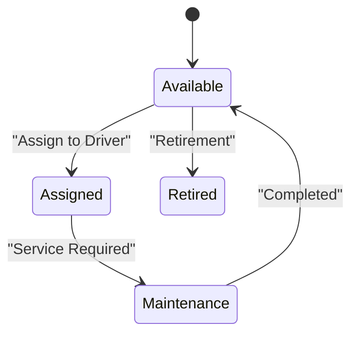
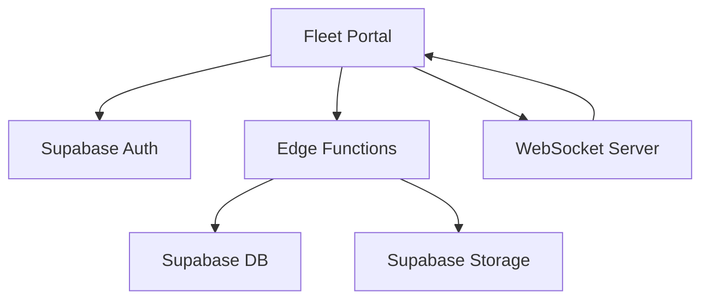

# Vehicle Tracking & Management

<cite>
**Referenced Files in This Document**
- [fleet-management-portal-design.md](file://docs/fleet-management-portal-design.md)
- [RouteOptimization.tsx](file://src/fleet/pages/RouteOptimization.tsx)
- [VehicleManagement.tsx](file://src/fleet/pages/VehicleManagement.tsx)
- [LiveTracking.tsx](file://src/fleet/pages/LiveTracking.tsx)
- [AddVehicleModal.tsx](file://src/fleet/components/vehicles/AddVehicleModal.tsx)
- [EditVehicleModal.tsx](file://src/fleet/components/vehicles/EditVehicleModal.tsx)
- [DriverMarker.tsx](file://src/fleet/components/map/DriverMarker.tsx)
- [index.ts](file://src/fleet/index.ts)
- [routes.tsx](file://src/fleet/routes.tsx)
- [index.ts (fleet-vehicles)](file://supabase/functions/fleet-vehicles/index.ts)
- [delivery.ts](file://src/integrations/supabase/delivery.ts)
- [20260225211306_add_driver_assignment_locking.sql](file://supabase/migrations/20260225211306_add_driver_assignment_locking.sql)
</cite>

## Table of Contents
1. [Introduction](#introduction)
2. [Project Structure](#project-structure)
3. [Core Components](#core-components)
4. [Architecture Overview](#architecture-overview)
5. [Detailed Component Analysis](#detailed-component-analysis)
6. [Dependency Analysis](#dependency-analysis)
7. [Performance Considerations](#performance-considerations)
8. [Troubleshooting Guide](#troubleshooting-guide)
9. [Conclusion](#conclusion)

## Introduction
This document describes the vehicle tracking and management system within the fleet operations. It covers vehicle registration, maintenance scheduling, asset tracking, GPS tracking integration, live location monitoring, real-time status updates, driver-vehicle assignment, route planning coordination, maintenance alerts, and operational efficiency metrics. The system integrates a web-based fleet management portal with Supabase-backed data, real-time tracking via WebSocket, and a driver mobile app for location reporting.

## Project Structure
The fleet management system is organized around a dedicated React module (`src/fleet`) with pages for drivers, vehicles, live tracking, route optimization, and payouts. Supabase provides backend services including authentication, edge functions for vehicle management, and real-time location streaming.

**Diagram sources**
- [routes.tsx:20-41](file://src/fleet/routes.tsx#L20-L41)
- [index.ts:1-14](file://src/fleet/index.ts#L1-L14)
- [index.ts (fleet-vehicles):616-670](file://supabase/functions/fleet-vehicles/index.ts#L616-L670)

**Section sources**
- [routes.tsx:1-42](file://src/fleet/routes.tsx#L1-L42)
- [index.ts:1-14](file://src/fleet/index.ts#L1-L14)

## Core Components
- Vehicle Management: CRUD operations for vehicles, status updates, driver assignment, and document storage.
- Live Tracking: Real-time driver location visualization on a map with WebSocket connectivity.
- Route Optimization: Manual distribution-based route planning for drivers and deliveries.
- Driver Operations Integration: Driver profile retrieval, location updates, and job assignment logic.
- Asset Tracking: Insurance expiry monitoring and maintenance lifecycle.

**Section sources**
- [VehicleManagement.tsx:1-434](file://src/fleet/pages/VehicleManagement.tsx#L1-L434)
- [LiveTracking.tsx:1-429](file://src/fleet/pages/LiveTracking.tsx#L1-L429)
- [RouteOptimization.tsx:1-412](file://src/fleet/pages/RouteOptimization.tsx#L1-L412)
- [AddVehicleModal.tsx:1-282](file://src/fleet/components/vehicles/AddVehicleModal.tsx#L1-L282)
- [EditVehicleModal.tsx:1-398](file://src/fleet/components/vehicles/EditVehicleModal.tsx#L1-L398)

## Architecture Overview
The system architecture combines a React-based fleet portal with Supabase edge functions and real-time capabilities. The driver mobile app streams location updates to the backend, which broadcasts them to the fleet portal via WebSocket. Edge functions enforce authorization and city-level access controls for vehicle operations.

**Diagram sources**
- [index.ts (fleet-vehicles):1-671](file://supabase/functions/fleet-vehicles/index.ts#L1-L671)
- [LiveTracking.tsx:224-255](file://src/fleet/pages/LiveTracking.tsx#L224-L255)
- [fleet-management-portal-design.md:1-1805](file://docs/fleet-management-portal-design.md#L1-L1805)

## Detailed Component Analysis

### Vehicle Registration and Asset Tracking
- Vehicle Registration: Captures make, model, year, color, license plate, and optional photos/documents. Plate number uniqueness is enforced.
- Asset Tracking: Tracks status (available, assigned, maintenance, retired), assigned driver, and insurance expiry with alerts for expiring documents.

**Diagram sources**
- [AddVehicleModal.tsx:33-113](file://src/fleet/components/vehicles/AddVehicleModal.tsx#L33-L113)
- [index.ts (fleet-vehicles):143-258](file://supabase/functions/fleet-vehicles/index.ts#L143-L258)

**Section sources**
- [AddVehicleModal.tsx:1-282](file://src/fleet/components/vehicles/AddVehicleModal.tsx#L1-L282)
- [VehicleManagement.tsx:1-434](file://src/fleet/pages/VehicleManagement.tsx#L1-L434)
- [index.ts (fleet-vehicles):56-141](file://supabase/functions/fleet-vehicles/index.ts#L56-L141)

### Vehicle Maintenance Scheduling and Lifecycle
- Maintenance Lifecycle: Vehicles can be marked for maintenance and returned to available upon completion. Maintenance actions are surfaced via UI buttons.
- Insurance Monitoring: Expiring/expired insurance triggers alerts and counts for proactive reminders.

**Diagram sources**
- [VehicleManagement.tsx:185-208](file://src/fleet/pages/VehicleManagement.tsx#L185-L208)
- [EditVehicleModal.tsx:149-174](file://src/fleet/components/vehicles/EditVehicleModal.tsx#L149-L174)

**Section sources**
- [VehicleManagement.tsx:171-208](file://src/fleet/pages/VehicleManagement.tsx#L171-L208)
- [EditVehicleModal.tsx:149-174](file://src/fleet/components/vehicles/EditVehicleModal.tsx#L149-L174)

### GPS Tracking Integration and Live Location Monitoring
- Real-time Tracking: The Live Tracking page initializes a Leaflet map, displays driver markers with online/offline status, and connects to a WebSocket for live updates.
- Location Updates: Driver locations are stored in the `drivers` table and historical positions in `driver_locations`. The driver app posts location updates to Supabase.

**Diagram sources**
- [LiveTracking.tsx:224-255](file://src/fleet/pages/LiveTracking.tsx#L224-L255)
- [delivery.ts:54-82](file://src/integrations/supabase/delivery.ts#L54-L82)
- [fleet-management-portal-design.md:1715-1805](file://docs/fleet-management-portal-design.md#L1715-L1805)

**Section sources**
- [LiveTracking.tsx:1-429](file://src/fleet/pages/LiveTracking.tsx#L1-L429)
- [delivery.ts:54-82](file://src/integrations/supabase/delivery.ts#L54-L82)

### Driver-vehicle Assignment and Route Planning Coordination
- Driver-vehicle Assignment: Vehicles can be assigned to drivers with cross-city validation and automatic driver-vehicle linkage.
- Route Planning: Manual distribution-based route assignment for selected drivers and deliveries, with a placeholder for future map-based zone visualization.

**Diagram sources**
- [index.ts (fleet-vehicles):492-614](file://supabase/functions/fleet-vehicles/index.ts#L492-L614)
- [RouteOptimization.tsx:175-195](file://src/fleet/pages/RouteOptimization.tsx#L175-L195)

**Section sources**
- [index.ts (fleet-vehicles):492-614](file://supabase/functions/fleet-vehicles/index.ts#L492-L614)
- [RouteOptimization.tsx:1-412](file://src/fleet/pages/RouteOptimization.tsx#L1-L412)

### Maintenance Alerts and Operational Efficiency Metrics
- Maintenance Alerts: Expiring insurance detection and UI alerts to prevent service gaps.
- Operational Metrics: Driver ratings, total deliveries, and online presence are displayed for fleet visibility.

**Diagram sources**
- [VehicleManagement.tsx:73-83](file://src/fleet/pages/VehicleManagement.tsx#L73-L83)

**Section sources**
- [VehicleManagement.tsx:73-83](file://src/fleet/pages/VehicleManagement.tsx#L73-L83)

### Real-time Vehicle Status Updates and Capacity Management
- Status Updates: WebSocket events update driver availability and locations in real-time.
- Capacity Management: Vehicle types and statuses inform dispatch decisions; driver profiles include performance metrics to balance workload.

**Diagram sources**
- [LiveTracking.tsx:240-246](file://src/fleet/pages/LiveTracking.tsx#L240-L246)
- [VehicleManagement.tsx:185-208](file://src/fleet/pages/VehicleManagement.tsx#L185-L208)

**Section sources**
- [LiveTracking.tsx:240-246](file://src/fleet/pages/LiveTracking.tsx#L240-L246)
- [VehicleManagement.tsx:185-208](file://src/fleet/pages/VehicleManagement.tsx#L185-L208)

### Fuel Tracking and Cost Optimization Features
- Current Implementation: Fuel tracking and cost optimization are not implemented in the referenced code.
- Recommended Approach: Integrate fuel consumption logs with vehicle records and derive cost metrics from delivery earnings and vehicle usage.

[No sources needed since this section provides general guidance]

### Vehicle Lifecycle Management and Integration with Driver Operations
- Lifecycle: From registration to retirement, vehicles maintain status transitions and document tracking.
- Driver Integration: Driver profiles include assigned vehicle, ratings, and delivery statistics to coordinate operations.

**Diagram sources**
- [EditVehicleModal.tsx:149-174](file://src/fleet/components/vehicles/EditVehicleModal.tsx#L149-L174)
- [VehicleManagement.tsx:185-208](file://src/fleet/pages/VehicleManagement.tsx#L185-L208)

**Section sources**
- [EditVehicleModal.tsx:149-174](file://src/fleet/components/vehicles/EditVehicleModal.tsx#L149-L174)
- [VehicleManagement.tsx:185-208](file://src/fleet/pages/VehicleManagement.tsx#L185-L208)

## Dependency Analysis
The fleet portal depends on Supabase for authentication, edge functions, storage, and database operations. Real-time updates rely on WebSocket connections and edge functions for authorization and access control.

**Diagram sources**
- [index.ts (fleet-vehicles):19-54](file://supabase/functions/fleet-vehicles/index.ts#L19-L54)
- [LiveTracking.tsx:224-255](file://src/fleet/pages/LiveTracking.tsx#L224-L255)

**Section sources**
- [index.ts (fleet-vehicles):19-54](file://supabase/functions/fleet-vehicles/index.ts#L19-L54)
- [LiveTracking.tsx:224-255](file://src/fleet/pages/LiveTracking.tsx#L224-L255)

## Performance Considerations
- Real-time latency: WebSocket connections minimize latency for live tracking updates.
- Map rendering: Leaflet clustering and viewport culling improve performance with large numbers of markers.
- Database writes: Batch location updates and indexing on driver locations enhance throughput.
- Scalability: Horizontal scaling and sharding enable handling thousands of concurrent drivers.

[No sources needed since this section provides general guidance]

## Troubleshooting Guide
- WebSocket Disconnection: The tracking service falls back to HTTP polling when WebSocket fails, ensuring continued location updates.
- Authorization Errors: Edge functions validate tokens and enforce city-level access; unauthorized requests return 403.
- Location Initialization Failures: The map initialization handles errors gracefully and provides a reload option.

**Section sources**
- [fleet-management-portal-design.md:1715-1805](file://docs/fleet-management-portal-design.md#L1715-L1805)
- [index.ts (fleet-vehicles):19-54](file://supabase/functions/fleet-vehicles/index.ts#L19-L54)
- [LiveTracking.tsx:54-83](file://src/fleet/pages/LiveTracking.tsx#L54-L83)

## Conclusion
The fleet management system provides a robust foundation for vehicle registration, asset tracking, driver-vehicle assignment, and live location monitoring. While route optimization remains manual, the architecture supports future enhancements such as automated route planning and advanced analytics. Real-time updates, document management, and maintenance lifecycle tracking enable efficient fleet operations and proactive maintenance scheduling.