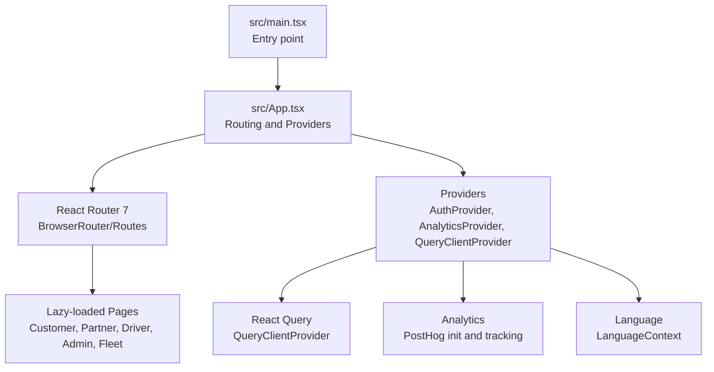
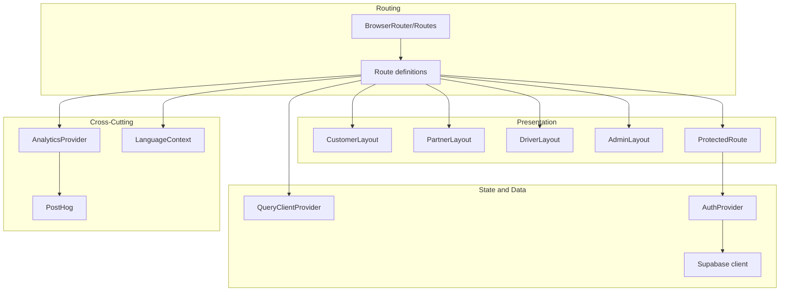
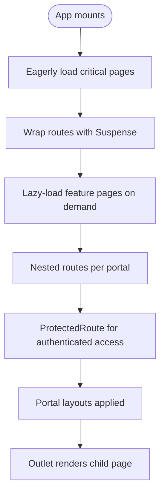
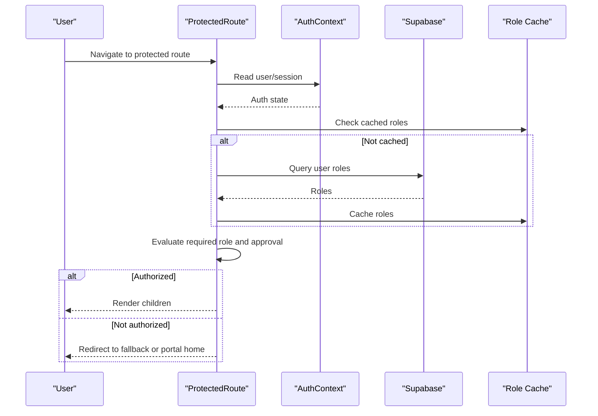
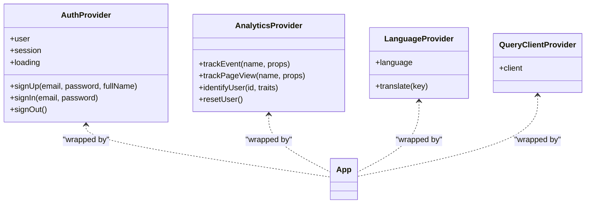
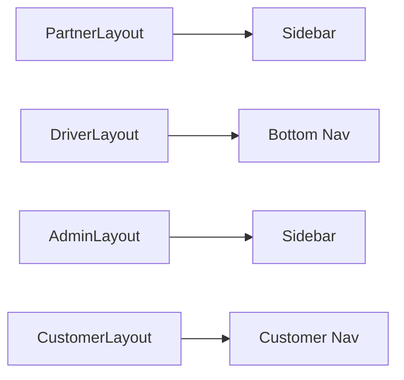
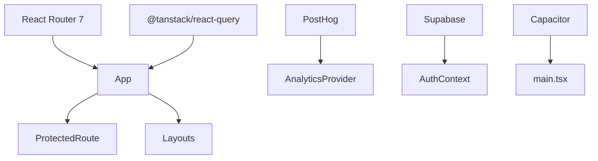

# Application Architecture

<cite>
**Referenced Files in This Document**
- [src/main.tsx](file://src/main.tsx)
- [src/App.tsx](file://src/App.tsx)
- [vite.config.ts](file://vite.config.ts)
- [package.json](file://package.json)
- [src/contexts/AuthContext.tsx](file://src/contexts/AuthContext.tsx)
- [src/contexts/AnalyticsContext.tsx](file://src/contexts/AnalyticsContext.tsx)
- [src/contexts/LanguageContext.tsx](file://src/contexts/LanguageContext.tsx)
- [src/components/ProtectedRoute.tsx](file://src/components/ProtectedRoute.tsx)
- [src/components/CustomerLayout.tsx](file://src/components/CustomerLayout.tsx)
- [src/components/PartnerLayout.tsx](file://src/components/PartnerLayout.tsx)
- [src/components/DriverLayout.tsx](file://src/components/DriverLayout.tsx)
- [src/components/AdminLayout.tsx](file://src/components/AdminLayout.tsx)
- [src/lib/analytics.ts](file://src/lib/analytics.ts)
- [src/fleet/routes.tsx](file://src/fleet/routes.tsx)
</cite>

## Table of Contents
1. [Introduction](#introduction)
2. [Project Structure](#project-structure)
3. [Core Components](#core-components)
4. [Architecture Overview](#architecture-overview)
5. [Detailed Component Analysis](#detailed-component-analysis)
6. [Dependency Analysis](#dependency-analysis)
7. [Performance Considerations](#performance-considerations)
8. [Troubleshooting Guide](#troubleshooting-guide)
9. [Conclusion](#conclusion)

## Introduction
This document describes the application architecture of the Nutrio React frontend. It explains the overall structure, component hierarchy, routing system with React Router 7, lazy loading strategy, route protection mechanisms, provider pattern implementation, build configuration with Vite, development workflow, deployment pipeline, and architectural decisions for performance optimization, code splitting, and bundle management. It also covers the integration between portals (customer, partner, driver, admin) and their shared architecture patterns.

## Project Structure
The application is a single-page React application bootstrapped with Vite and TypeScript. The entry point initializes providers for analytics, error boundaries, language, and native app integration. Routing is centralized in the main App component with lazy-loaded pages grouped by feature and portal. Providers wrap the routing tree to supply authentication, analytics, and UI state.

**Diagram sources**
- [src/main.tsx:1-50](file://src/main.tsx#L1-L50)
- [src/App.tsx:1-739](file://src/App.tsx#L1-L739)

**Section sources**
- [src/main.tsx:1-50](file://src/main.tsx#L1-L50)
- [src/App.tsx:1-739](file://src/App.tsx#L1-L739)

## Core Components
- Entry and initialization: The root creates the React root, sets up error boundaries, language provider, and native app initialization before rendering the App shell.
- App shell and routing: Centralizes routing with React Router 7, lazy-loads feature areas, and wraps portal routes with dedicated layouts and protection.
- Provider pattern:
  - AuthProvider: Manages Supabase authentication state, session lifecycle, and sign-in/sign-out flows.
  - AnalyticsProvider: Initializes PostHog and exposes tracking APIs.
  - LanguageProvider: Supplies internationalization dictionary and language state.
  - QueryClientProvider: Enables React Query caching and background synchronization.
- Route protection: ProtectedRoute enforces authentication and role-based access with optional approval gating for partner routes.
- Layouts: CustomerLayout, PartnerLayout, DriverLayout, AdminLayout provide consistent navigation and breadcrumbs per portal.
- Fleet integration: Fleet routes are composed separately and injected into the main routing tree.

**Section sources**
- [src/main.tsx:1-50](file://src/main.tsx#L1-L50)
- [src/App.tsx:1-739](file://src/App.tsx#L1-L739)
- [src/contexts/AuthContext.tsx:1-131](file://src/contexts/AuthContext.tsx#L1-L131)
- [src/contexts/AnalyticsContext.tsx:1-61](file://src/contexts/AnalyticsContext.tsx#L1-L61)
- [src/contexts/LanguageContext.tsx:1-800](file://src/contexts/LanguageContext.tsx#L1-L800)
- [src/components/ProtectedRoute.tsx:1-264](file://src/components/ProtectedRoute.tsx#L1-L264)
- [src/components/CustomerLayout.tsx:1-24](file://src/components/CustomerLayout.tsx#L1-L24)
- [src/components/PartnerLayout.tsx:1-141](file://src/components/PartnerLayout.tsx#L1-L141)
- [src/components/DriverLayout.tsx:1-183](file://src/components/DriverLayout.tsx#L1-L183)
- [src/components/AdminLayout.tsx:1-130](file://src/components/AdminLayout.tsx#L1-L130)
- [src/fleet/routes.tsx:1-42](file://src/fleet/routes.tsx#L1-L42)

## Architecture Overview
The application follows a layered architecture:
- Presentation layer: React components and layouts.
- Routing and navigation: React Router 7 with nested routes and lazy loading.
- State and data: React Query for caching and background refetching; Supabase for auth and backend data.
- Cross-cutting concerns: Analytics, error boundaries, language, and native app integration.

**Diagram sources**
- [src/App.tsx:140-735](file://src/App.tsx#L140-L735)
- [src/contexts/AuthContext.tsx:31-130](file://src/contexts/AuthContext.tsx#L31-L130)
- [src/contexts/AnalyticsContext.tsx:22-39](file://src/contexts/AnalyticsContext.tsx#L22-L39)
- [src/contexts/LanguageContext.tsx:1-800](file://src/contexts/LanguageContext.tsx#L1-L800)

## Detailed Component Analysis

### Routing and Lazy Loading Strategy
- Critical routes (home, auth, onboarding) are eagerly imported to minimize initial load time.
- Feature routes are lazy-loaded using React.lazy with Suspense fallbacks.
- Routes are grouped by portal and feature area, enabling scalable code splitting.
- Scroll-to-top behavior ensures consistent UX across route transitions.
- Native route redirection is supported for deep links and native app integration.

**Diagram sources**
- [src/App.tsx:16-135](file://src/App.tsx#L16-L135)
- [src/App.tsx:144-735](file://src/App.tsx#L144-L735)

**Section sources**
- [src/App.tsx:16-135](file://src/App.tsx#L16-L135)
- [src/App.tsx:144-735](file://src/App.tsx#L144-L735)

### Route Protection Mechanisms
- ProtectedRoute enforces authentication and role-based access:
  - Uses AuthContext to detect user/session state.
  - Fetches user roles from Supabase with caching to reduce repeated queries.
  - Supports hierarchical roles and optional approval checks for partner routes.
  - Redirects unauthorized users to appropriate portal home or auth page.
  - Provides loading states during role resolution.

**Diagram sources**
- [src/components/ProtectedRoute.tsx:139-230](file://src/components/ProtectedRoute.tsx#L139-L230)
- [src/contexts/AuthContext.tsx:31-130](file://src/contexts/AuthContext.tsx#L31-L130)

**Section sources**
- [src/components/ProtectedRoute.tsx:1-264](file://src/components/ProtectedRoute.tsx#L1-L264)
- [src/contexts/AuthContext.tsx:1-131](file://src/contexts/AuthContext.tsx#L1-L131)

### Provider Pattern Implementation
- AuthProvider: Initializes Supabase auth listeners, manages session state, and exposes sign-up, sign-in, and sign-out functions. Integrates with native push notifications on mobile platforms.
- AnalyticsProvider: Initializes PostHog and exposes tracking functions for events, page views, and user identification. Includes sanitization to avoid sending sensitive data.
- LanguageProvider: Provides translation dictionary and language switching capabilities.
- QueryClientProvider: Wraps the app with React Query to enable caching, background updates, and optimistic UI patterns.

**Diagram sources**
- [src/contexts/AuthContext.tsx:31-130](file://src/contexts/AuthContext.tsx#L31-L130)
- [src/contexts/AnalyticsContext.tsx:22-39](file://src/contexts/AnalyticsContext.tsx#L22-L39)
- [src/contexts/LanguageContext.tsx:1-800](file://src/contexts/LanguageContext.tsx#L1-L800)
- [src/App.tsx:137-140](file://src/App.tsx#L137-L140)

**Section sources**
- [src/contexts/AuthContext.tsx:1-131](file://src/contexts/AuthContext.tsx#L1-L131)
- [src/contexts/AnalyticsContext.tsx:1-61](file://src/contexts/AnalyticsContext.tsx#L1-L61)
- [src/contexts/LanguageContext.tsx:1-800](file://src/contexts/LanguageContext.tsx#L1-L800)
- [src/App.tsx:137-140](file://src/App.tsx#L137-L140)

### Portal Layouts and Shared Patterns
- CustomerLayout: Provides a consistent background and bottom navigation for customer-facing pages.
- PartnerLayout: Implements sidebar navigation, breadcrumb, and role validation to ensure only eligible users access partner features.
- DriverLayout: Adds online/offline toggle, bottom navigation, and approval checks for driver accounts.
- AdminLayout: Enforces admin-only access with sidebar and breadcrumb navigation.
- Shared pattern: Each layout validates user eligibility and redirects unauthorized users to appropriate destinations.

**Diagram sources**
- [src/components/PartnerLayout.tsx:27-140](file://src/components/PartnerLayout.tsx#L27-L140)
- [src/components/DriverLayout.tsx:16-182](file://src/components/DriverLayout.tsx#L16-L182)
- [src/components/AdminLayout.tsx:25-129](file://src/components/AdminLayout.tsx#L25-L129)
- [src/components/CustomerLayout.tsx:8-21](file://src/components/CustomerLayout.tsx#L8-L21)

**Section sources**
- [src/components/CustomerLayout.tsx:1-24](file://src/components/CustomerLayout.tsx#L1-L24)
- [src/components/PartnerLayout.tsx:1-141](file://src/components/PartnerLayout.tsx#L1-L141)
- [src/components/DriverLayout.tsx:1-183](file://src/components/DriverLayout.tsx#L1-L183)
- [src/components/AdminLayout.tsx:1-130](file://src/components/AdminLayout.tsx#L1-L130)

### Fleet Management Portal Integration
- Fleet routes are lazily loaded and wrapped with a dedicated provider and protection mechanism.
- The fleet module is injected into the main routing tree, enabling seamless integration alongside other portals.

**Section sources**
- [src/fleet/routes.tsx:1-42](file://src/fleet/routes.tsx#L1-L42)
- [src/App.tsx:725-727](file://src/App.tsx#L725-L727)

## Dependency Analysis
- External libraries:
  - React Router 7 for routing and navigation.
  - @tanstack/react-query for caching and data synchronization.
  - PostHog for analytics.
  - Supabase for authentication and database access.
  - Capacitor for native app features.
- Internal dependencies:
  - Providers depend on Supabase client and PostHog initialization.
  - ProtectedRoute depends on AuthContext and Supabase role queries.
  - Layouts depend on AuthContext and Supabase for role validation.

**Diagram sources**
- [package.json:44-126](file://package.json#L44-L126)
- [src/App.tsx:144-735](file://src/App.tsx#L144-L735)
- [src/contexts/AuthContext.tsx:31-130](file://src/contexts/AuthContext.tsx#L31-L130)
- [src/contexts/AnalyticsContext.tsx:22-39](file://src/contexts/AnalyticsContext.tsx#L22-L39)
- [src/main.tsx:14-18](file://src/main.tsx#L14-L18)

**Section sources**
- [package.json:44-126](file://package.json#L44-L126)
- [src/App.tsx:144-735](file://src/App.tsx#L144-L735)
- [src/contexts/AuthContext.tsx:31-130](file://src/contexts/AuthContext.tsx#L31-L130)
- [src/contexts/AnalyticsContext.tsx:22-39](file://src/contexts/AnalyticsContext.tsx#L22-L39)
- [src/main.tsx:14-18](file://src/main.tsx#L14-L18)

## Performance Considerations
- Code splitting and lazy loading:
  - Critical pages are eager-loaded; others are lazy-imported to reduce initial bundle size.
  - Manual chunking groups vendor libraries and UI components for better caching.
- Build optimizations:
  - Modern target (esnext) improves runtime performance.
  - Terser minification with conditional console removal in production.
  - Source maps enabled for error tracking and debugging.
- Runtime performance:
  - Suspense fallbacks provide smooth transitions during lazy loads.
  - Role caching reduces repeated Supabase queries in ProtectedRoute.
  - Scroll-to-top effect prevents WebView scroll persistence artifacts.

**Section sources**
- [vite.config.ts:52-76](file://vite.config.ts#L52-L76)
- [src/App.tsx:16-135](file://src/App.tsx#L16-L135)
- [src/components/ProtectedRoute.tsx:34-35](file://src/components/ProtectedRoute.tsx#L34-L35)

## Troubleshooting Guide
- Authentication issues:
  - Verify Supabase credentials and redirect URLs in AuthProvider.
  - Check IP location blocking logic and error handling in sign-in.
- Analytics tracking:
  - Confirm PostHog API key and host environment variables.
  - Review event sanitization and development mode behavior.
- Route protection failures:
  - Ensure ProtectedRoute receives user/session from AuthContext.
  - Validate role hierarchy and approval checks for partner routes.
- Native app integration:
  - Confirm Capacitor initialization and platform detection.
  - Verify push notification service initialization on sign-in.

**Section sources**
- [src/contexts/AuthContext.tsx:63-118](file://src/contexts/AuthContext.tsx#L63-L118)
- [src/lib/analytics.ts:3-35](file://src/lib/analytics.ts#L3-L35)
- [src/components/ProtectedRoute.tsx:139-230](file://src/components/ProtectedRoute.tsx#L139-L230)
- [src/main.tsx:14-18](file://src/main.tsx#L14-L18)

## Conclusion
The Nutrio React frontend employs a modular, provider-driven architecture with robust routing, lazy loading, and portal-specific layouts. Authentication and analytics are centralized via providers, while route protection ensures secure access across portals. The Vite configuration emphasizes performance and developer experience, with careful code splitting and build optimizations. Together, these patterns deliver a scalable, maintainable, and high-performance application across customer, partner, driver, admin, and fleet management experiences.