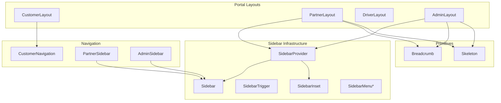
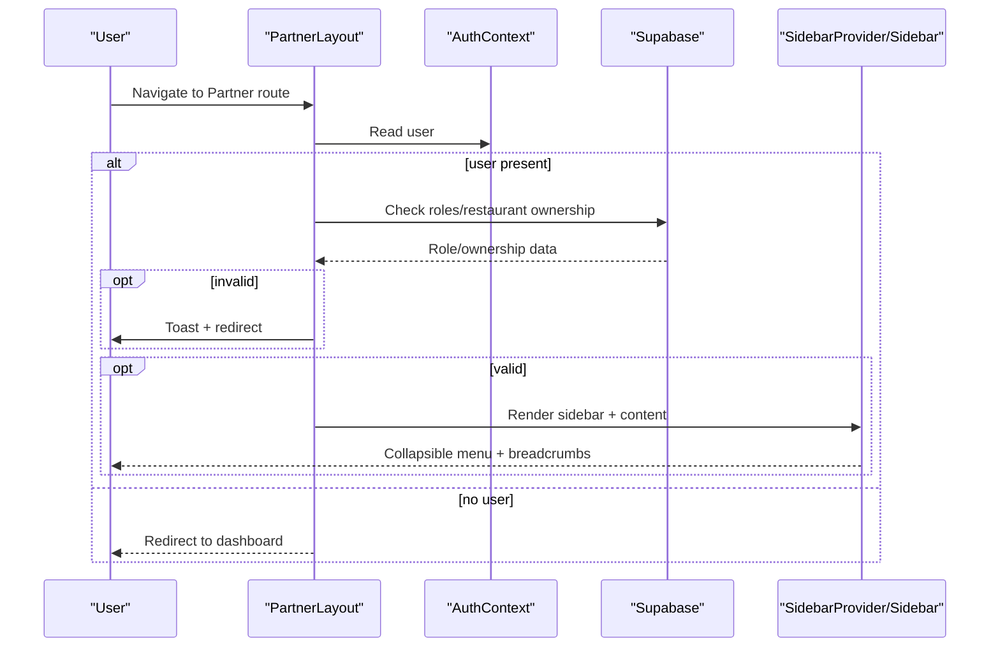
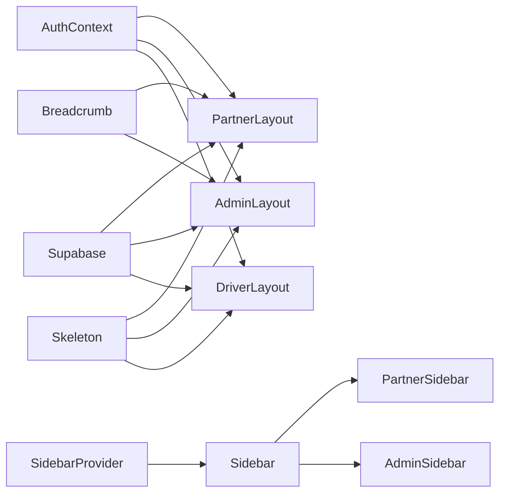

# Component Library

<cite>
**Referenced Files in This Document**
- [AdminLayout.tsx](file://src/components/AdminLayout.tsx)
- [CustomerLayout.tsx](file://src/components/CustomerLayout.tsx)
- [DriverLayout.tsx](file://src/components/DriverLayout.tsx)
- [PartnerLayout.tsx](file://src/components/PartnerLayout.tsx)
- [AdminSidebar.tsx](file://src/components/AdminSidebar.tsx)
- [PartnerSidebar.tsx](file://src/components/PartnerSidebar.tsx)
- [CustomerNavigation.tsx](file://src/components/CustomerNavigation.tsx)
- [sidebar.tsx](file://src/components/ui/sidebar.tsx)
- [breadcrumb.tsx](file://src/components/ui/breadcrumb.tsx)
- [skeleton.tsx](file://src/components/ui/skeleton.tsx)
</cite>

## Table of Contents
1. [Introduction](#introduction)
2. [Project Structure](#project-structure)
3. [Core Components](#core-components)
4. [Architecture Overview](#architecture-overview)
5. [Detailed Component Analysis](#detailed-component-analysis)
6. [Dependency Analysis](#dependency-analysis)
7. [Performance Considerations](#performance-considerations)
8. [Troubleshooting Guide](#troubleshooting-guide)
9. [Conclusion](#conclusion)
10. [Appendices](#appendices)

## Introduction
This document describes the reusable UI component library powering the Nutrio frontend. It focuses on:
- Layout components for portals (CustomerLayout, PartnerLayout, DriverLayout, AdminLayout)
- UI primitives and composite components (Sidebar, Breadcrumb, Skeleton)
- Navigation components and patterns
- Accessibility and responsive design characteristics
- Composition patterns, props, and usage guidelines

The components are built with Radix UI primitives and styled with Tailwind CSS, emphasizing composability, accessibility, and consistent behavior across portals.

## Project Structure
The component library is organized by domain and shared primitives:
- Portal layouts: CustomerLayout, PartnerLayout, DriverLayout, AdminLayout
- Sidebar infrastructure: SidebarProvider, Sidebar, SidebarTrigger, and related primitives
- Navigation: CustomerNavigation and sidebar-based navigations for Partner/Admin
- UI primitives: Breadcrumb and Skeleton
- Supporting utilities: cn, useMobile, and Supabase auth checks

**Diagram sources**
- [CustomerLayout.tsx:1-24](file://src/components/CustomerLayout.tsx#L1-L24)
- [PartnerLayout.tsx:1-141](file://src/components/PartnerLayout.tsx#L1-L141)
- [DriverLayout.tsx:1-183](file://src/components/DriverLayout.tsx#L1-L183)
- [AdminLayout.tsx:1-130](file://src/components/AdminLayout.tsx#L1-L130)
- [PartnerSidebar.tsx:1-132](file://src/components/PartnerSidebar.tsx#L1-L132)
- [AdminSidebar.tsx:1-151](file://src/components/AdminSidebar.tsx#L1-L151)
- [sidebar.tsx:1-638](file://src/components/ui/sidebar.tsx#L1-L638)
- [breadcrumb.tsx:1-91](file://src/components/ui/breadcrumb.tsx#L1-L91)
- [skeleton.tsx:1-18](file://src/components/ui/skeleton.tsx#L1-L18)

**Section sources**
- [CustomerLayout.tsx:1-24](file://src/components/CustomerLayout.tsx#L1-L24)
- [PartnerLayout.tsx:1-141](file://src/components/PartnerLayout.tsx#L1-L141)
- [DriverLayout.tsx:1-183](file://src/components/DriverLayout.tsx#L1-L183)
- [AdminLayout.tsx:1-130](file://src/components/AdminLayout.tsx#L1-L130)
- [PartnerSidebar.tsx:1-132](file://src/components/PartnerSidebar.tsx#L1-L132)
- [AdminSidebar.tsx:1-151](file://src/components/AdminSidebar.tsx#L1-L151)
- [sidebar.tsx:1-638](file://src/components/ui/sidebar.tsx#L1-L638)
- [breadcrumb.tsx:1-91](file://src/components/ui/breadcrumb.tsx#L1-L91)
- [skeleton.tsx:1-18](file://src/components/ui/skeleton.tsx#L1-L18)

## Core Components
This section documents the primary reusable components and their roles.

- Layouts
  - CustomerLayout: Provides a consistent background and bottom navigation for customer-facing pages.
  - PartnerLayout: Wraps content with a collapsible sidebar, breadcrumbs, and optional action slot; gates access to partner roles.
  - DriverLayout: Manages driver-specific access checks, online/offline toggle, and a bottom navigation bar.
  - AdminLayout: Enforces admin role checks, renders a header with breadcrumbs, and provides a sidebar container.

- Sidebar Infrastructure
  - SidebarProvider/Sidebar/SidebarTrigger/SidebarInset: A composable sidebar system with mobile off-canvas behavior, keyboard shortcuts, and cookie-backed persistence.
  - SidebarMenu*, SidebarGroup*, SidebarHeader/Footer: Building blocks for sidebar menus and actions.

- Navigation
  - CustomerNavigation: Bottom tab bar for customer app with haptic feedback and conditional tabs.
  - PartnerSidebar/AdminSidebar: Collapsible sidebar menus with active state detection and sign-out actions.

- Primitives
  - Breadcrumb: Accessible breadcrumb navigation with separators and ellipsis support.
  - Skeleton: Animated shimmer placeholder for loading states.

**Section sources**
- [CustomerLayout.tsx:1-24](file://src/components/CustomerLayout.tsx#L1-L24)
- [PartnerLayout.tsx:1-141](file://src/components/PartnerLayout.tsx#L1-L141)
- [DriverLayout.tsx:1-183](file://src/components/DriverLayout.tsx#L1-L183)
- [AdminLayout.tsx:1-130](file://src/components/AdminLayout.tsx#L1-L130)
- [PartnerSidebar.tsx:1-132](file://src/components/PartnerSidebar.tsx#L1-L132)
- [AdminSidebar.tsx:1-151](file://src/components/AdminSidebar.tsx#L1-L151)
- [sidebar.tsx:1-638](file://src/components/ui/sidebar.tsx#L1-L638)
- [breadcrumb.tsx:1-91](file://src/components/ui/breadcrumb.tsx#L1-L91)
- [skeleton.tsx:1-18](file://src/components/ui/skeleton.tsx#L1-L18)

## Architecture Overview
The layout components coordinate access control, navigation, and content areas. They rely on:
- Supabase for role and profile checks
- Radix UI for accessible primitives
- Tailwind for responsive styling and animations

**Diagram sources**
- [PartnerLayout.tsx:27-76](file://src/components/PartnerLayout.tsx#L27-L76)
- [sidebar.tsx:43-128](file://src/components/ui/sidebar.tsx#L43-L128)

**Section sources**
- [PartnerLayout.tsx:1-141](file://src/components/PartnerLayout.tsx#L1-L141)
- [sidebar.tsx:1-638](file://src/components/ui/sidebar.tsx#L1-L638)

## Detailed Component Analysis

### Layout Components

#### CustomerLayout
- Purpose: Provide a consistent customer app shell with a bottom navigation bar and background styling.
- Props: None (uses Outlet for content).
- Composition: Renders Outlet inside a container with CustomerNavigation fixed at the bottom.
- Accessibility: Uses semantic navigation structure; relies on browser focus management for links.

Usage pattern:
- Wrap page routes with CustomerLayout to ensure consistent navigation and background.

**Section sources**
- [CustomerLayout.tsx:1-24](file://src/components/CustomerLayout.tsx#L1-L24)
- [CustomerNavigation.tsx:1-61](file://src/components/CustomerNavigation.tsx#L1-L61)

#### PartnerLayout
- Purpose: Partner portal shell with sidebar, breadcrumbs, and optional action area.
- Props:
  - children: ReactNode
  - title?: string
  - subtitle?: string
  - action?: ReactNode
- Access control: Checks user roles and restaurant ownership; redirects if unauthorized.
- Rendering: Uses SidebarProvider and SidebarTrigger; displays NewOrderNotificationBanner.

Usage pattern:
- Wrap partner routes with PartnerLayout and pass title/subtitle/action as needed.

**Section sources**
- [PartnerLayout.tsx:1-141](file://src/components/PartnerLayout.tsx#L1-L141)

#### DriverLayout
- Purpose: Driver portal shell with online/offline toggle, bottom navigation, and access checks.
- Props:
  - children: ReactNode
  - title?: string
  - subtitle?: string
- Access control: Validates driver existence, approval status, and toggles online state via Supabase.
- Rendering: Fixed header with title/subtitle and a bottom tab bar; skeleton loading while resolving.

Usage pattern:
- Wrap driver routes with DriverLayout; ensure proper routing to auth/onboarding when not approved.

**Section sources**
- [DriverLayout.tsx:1-183](file://src/components/DriverLayout.tsx#L1-L183)

#### AdminLayout
- Purpose: Admin portal shell enforcing admin role and rendering breadcrumbs.
- Props:
  - children: ReactNode
  - title?: string
  - subtitle?: string
- Access control: Queries user_roles for admin role; redirects otherwise.
- Rendering: Uses SidebarProvider and SidebarTrigger; displays skeleton during checks.

Usage pattern:
- Wrap admin routes with AdminLayout and pass contextual title/subtitle.

**Section sources**
- [AdminLayout.tsx:1-130](file://src/components/AdminLayout.tsx#L1-L130)

### Sidebar Infrastructure

#### SidebarProvider, Sidebar, SidebarTrigger, SidebarInset
- Purpose: Provide a responsive sidebar system with mobile off-canvas, keyboard shortcuts, and cookie-persisted state.
- Key behaviors:
  - Mobile detection and off-canvas Sheet on small screens.
  - Desktop collapsible sidebar with icon-only mode.
  - Keyboard shortcut to toggle (Ctrl/Cmd + B).
  - Tooltip provider for collapsed tooltips.
- Variants and sizes: Configurable via props; supports left/right placement and inset/floating variants.

Usage pattern:
- Wrap page content with SidebarProvider; render Sidebar with SidebarHeader/Footer/Content groups; trigger with SidebarTrigger.

**Section sources**
- [sidebar.tsx:1-638](file://src/components/ui/sidebar.tsx#L1-L638)

#### SidebarMenu* Building Blocks
- SidebarMenu, SidebarMenuItem, SidebarMenuButton, SidebarMenuAction, SidebarMenuBadge, SidebarMenuSub*, SidebarHeader/Footer/Content/Group*
- Purpose: Compose navigation menus with active states, tooltips, and nested submenus.
- Accessibility: Uses Radix UI slots and proper ARIA attributes; supports keyboard navigation.

Usage pattern:
- Build navigation lists using SidebarMenu and SidebarMenuItem; use SidebarMenuButton for links; add badges/actions as needed.

**Section sources**
- [sidebar.tsx:404-637](file://src/components/ui/sidebar.tsx#L404-L637)

### Navigation Components

#### CustomerNavigation
- Purpose: Bottom tab bar for the customer app with haptic feedback and conditional visibility of affiliate tab.
- Behavior:
  - Active state detection based on pathname prefixes.
  - Optional affiliate tab gated by approval and platform settings.
  - Haptic feedback on tab switch.

Usage pattern:
- Place CustomerNavigation at the bottom of customer app layouts.

**Section sources**
- [CustomerNavigation.tsx:1-61](file://src/components/CustomerNavigation.tsx#L1-L61)

#### PartnerSidebar
- Purpose: Collapsible sidebar for partner portal with navigation items and sign-out.
- Behavior:
  - Active state detection for current route.
  - Tooltip support for collapsed state.
  - Sign-out handler navigates to home.

Usage pattern:
- Render PartnerSidebar alongside PartnerLayout content.

**Section sources**
- [PartnerSidebar.tsx:1-132](file://src/components/PartnerSidebar.tsx#L1-L132)

#### AdminSidebar
- Purpose: Collapsible sidebar for admin portal with extensive navigation and sign-out.
- Behavior:
  - Active state detection and tooltip support.
  - Additional “View as Customer” option in footer.

Usage pattern:
- Render AdminSidebar alongside AdminLayout content.

**Section sources**
- [AdminSidebar.tsx:1-151](file://src/components/AdminSidebar.tsx#L1-L151)

### Primitive Components

#### Breadcrumb
- Purpose: Accessible breadcrumb navigation with customizable separators and ellipsis.
- Components:
  - Breadcrumb, BreadcrumbList, BreadcrumbItem, BreadcrumbLink, BreadcrumbPage, BreadcrumbSeparator, BreadcrumbEllipsis.
- Accessibility: Proper ARIA roles and labels for screen readers.

Usage pattern:
- Wrap page content with Breadcrumb; add BreadcrumbList and items; use BreadcrumbPage for current page.

**Section sources**
- [breadcrumb.tsx:1-91](file://src/components/ui/breadcrumb.tsx#L1-L91)

#### Skeleton
- Purpose: Animated shimmer placeholder for loading states.
- Styling: Gradient animation with muted background color.

Usage pattern:
- Render Skeleton around content while data is loading; customize height/width via Tailwind classes.

**Section sources**
- [skeleton.tsx:1-18](file://src/components/ui/skeleton.tsx#L1-L18)

### Component Composition Patterns
- Layout-first composition: Each portal layout controls access, breadcrumbs, and sidebar; child pages render content.
- Sidebar composition: Use SidebarProvider → Sidebar → SidebarHeader/Footer/Content → SidebarMenu* to build navigation.
- Navigation composition: Use CustomerNavigation or Partner/Admin sidebar menus with active state detection and tooltips.
- Primitive reuse: Combine Breadcrumb and Skeleton across layouts for consistent UX.

**Section sources**
- [PartnerLayout.tsx:93-139](file://src/components/PartnerLayout.tsx#L93-L139)
- [AdminLayout.tsx:84-128](file://src/components/AdminLayout.tsx#L84-L128)
- [sidebar.tsx:129-216](file://src/components/ui/sidebar.tsx#L129-L216)
- [breadcrumb.tsx:15-66](file://src/components/ui/breadcrumb.tsx#L15-L66)
- [skeleton.tsx:3-15](file://src/components/ui/skeleton.tsx#L3-L15)

## Dependency Analysis
- Access control dependencies:
  - PartnerLayout/AdminLayout/DriverLayout depend on AuthContext and Supabase to gate access.
- UI primitive dependencies:
  - Layouts depend on SidebarProvider/Sidebar and Breadcrumb primitives.
  - Sidebar components depend on Radix UI slots and Tooltip provider.
- Navigation dependencies:
  - CustomerNavigation depends on react-router-dom Link and location state.
  - Partner/Admin sidebars depend on SidebarMenu* primitives and useSidebar hook.

**Diagram sources**
- [PartnerLayout.tsx:13-17](file://src/components/PartnerLayout.tsx#L13-L17)
- [AdminLayout.tsx:14-17](file://src/components/AdminLayout.tsx#L14-L17)
- [DriverLayout.tsx:5-8](file://src/components/DriverLayout.tsx#L5-L8)
- [sidebar.tsx:43-128](file://src/components/ui/sidebar.tsx#L43-L128)
- [breadcrumb.tsx:1-13](file://src/components/ui/breadcrumb.tsx#L1-L13)
- [skeleton.tsx:1-18](file://src/components/ui/skeleton.tsx#L1-L18)

**Section sources**
- [PartnerLayout.tsx:1-141](file://src/components/PartnerLayout.tsx#L1-L141)
- [AdminLayout.tsx:1-130](file://src/components/AdminLayout.tsx#L1-L130)
- [DriverLayout.tsx:1-183](file://src/components/DriverLayout.tsx#L1-L183)
- [sidebar.tsx:1-638](file://src/components/ui/sidebar.tsx#L1-L638)
- [breadcrumb.tsx:1-91](file://src/components/ui/breadcrumb.tsx#L1-L91)
- [skeleton.tsx:1-18](file://src/components/ui/skeleton.tsx#L1-L18)

## Performance Considerations
- Lazy loading: Use Skeleton placeholders during Supabase queries to avoid layout shifts.
- Cookie-persisted sidebar state: Reduces reflow by remembering expanded/collapsed state.
- Off-canvas mobile sidebar: Prevents heavy desktop-only DOM on small screens.
- Tooltip provider: Disables delays for instant feedback in collapsed menus.

[No sources needed since this section provides general guidance]

## Troubleshooting Guide
- Access denied messages:
  - PartnerLayout/AdminLayout/DriverLayout show toasts and redirect when access is denied. Verify user roles and onboarding status.
- Online/offline toggle failures:
  - DriverLayout toggles driver.is_online via Supabase; confirm network connectivity and error handling.
- Sidebar keyboard shortcut:
  - Ctrl/Cmd + B should toggle sidebar; ensure no conflicting global handlers.

**Section sources**
- [PartnerLayout.tsx:59-76](file://src/components/PartnerLayout.tsx#L59-L76)
- [AdminLayout.tsx:50-67](file://src/components/AdminLayout.tsx#L50-L67)
- [DriverLayout.tsx:75-100](file://src/components/DriverLayout.tsx#L75-L100)
- [sidebar.tsx:79-89](file://src/components/ui/sidebar.tsx#L79-L89)

## Conclusion
The Nutrio component library leverages Radix UI and Tailwind CSS to deliver accessible, responsive, and composable UI across portals. Layouts encapsulate access control and navigation, while Sidebar and Breadcrumb primitives enable consistent, themeable experiences. Following the documented composition patterns ensures maintainability and scalability.

[No sources needed since this section summarizes without analyzing specific files]

## Appendices

### Prop Reference Summary
- PartnerLayout
  - children: ReactNode
  - title?: string
  - subtitle?: string
  - action?: ReactNode
- DriverLayout
  - children: ReactNode
  - title?: string
  - subtitle?: string
- AdminLayout
  - children: ReactNode
  - title?: string
  - subtitle?: string

**Section sources**
- [PartnerLayout.tsx:20-25](file://src/components/PartnerLayout.tsx#L20-L25)
- [DriverLayout.tsx:10-14](file://src/components/DriverLayout.tsx#L10-L14)
- [AdminLayout.tsx:19-23](file://src/components/AdminLayout.tsx#L19-L23)