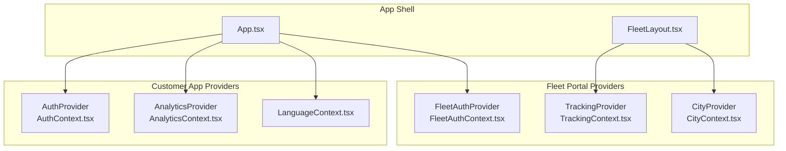
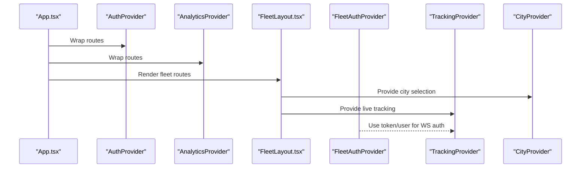
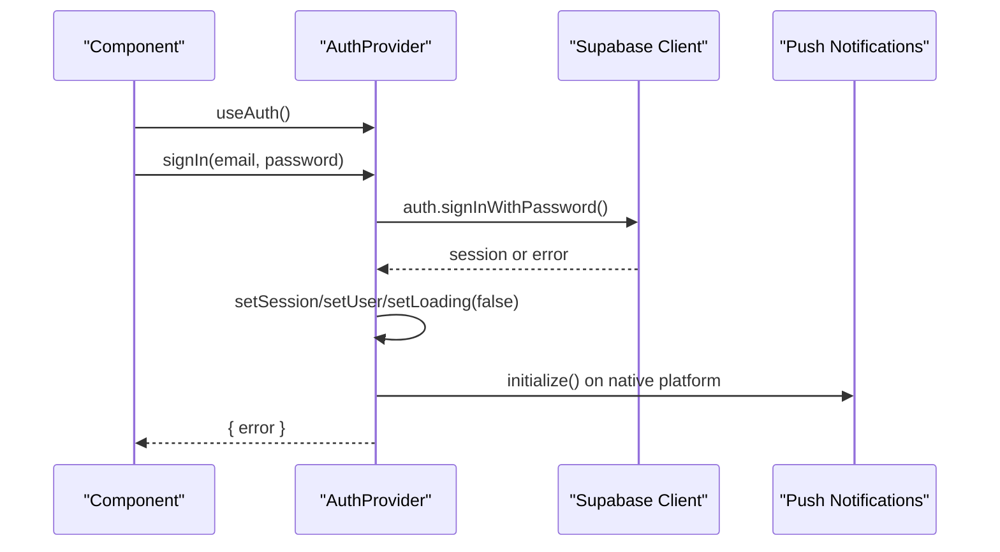
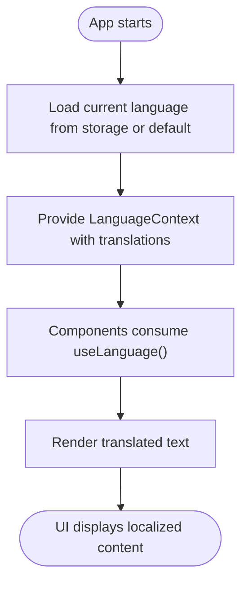
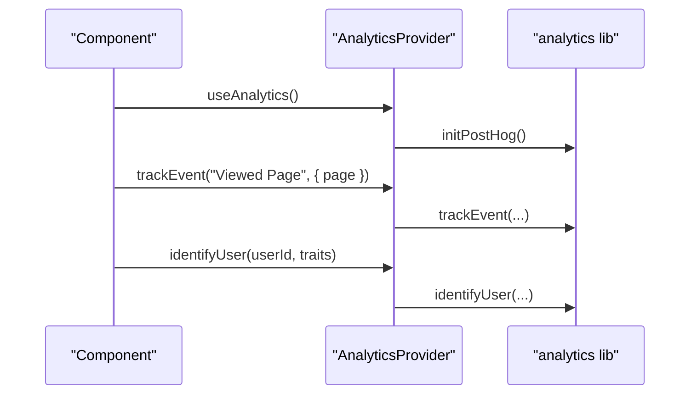
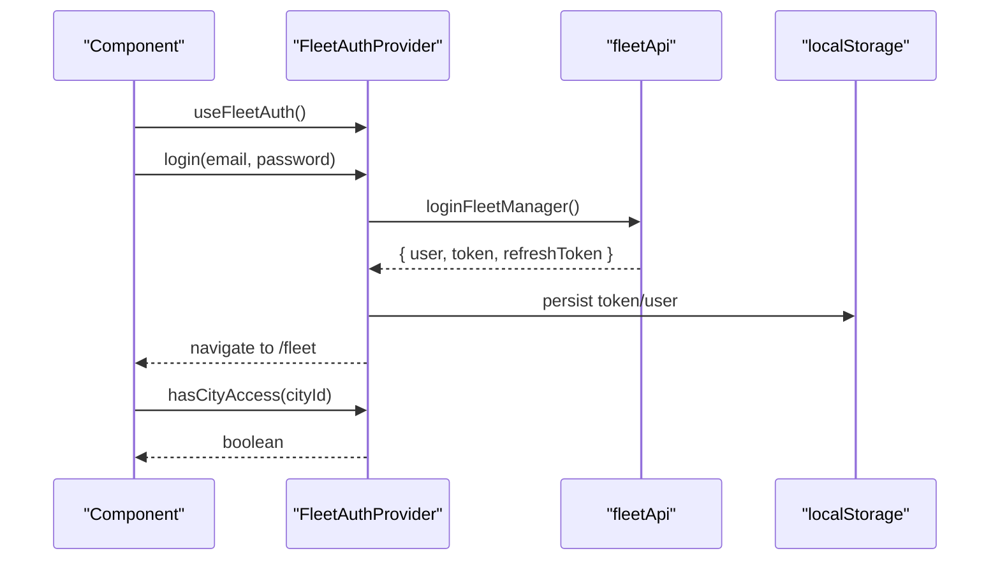
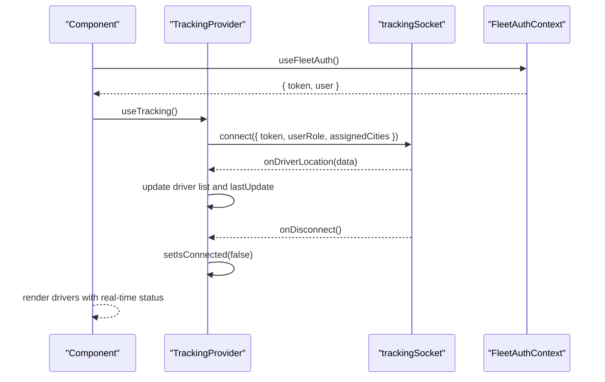
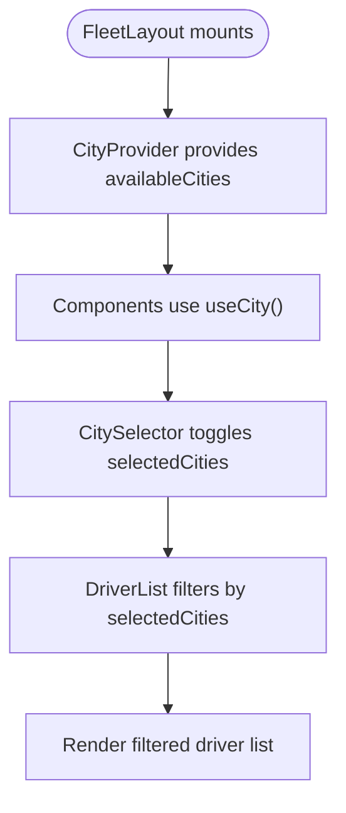
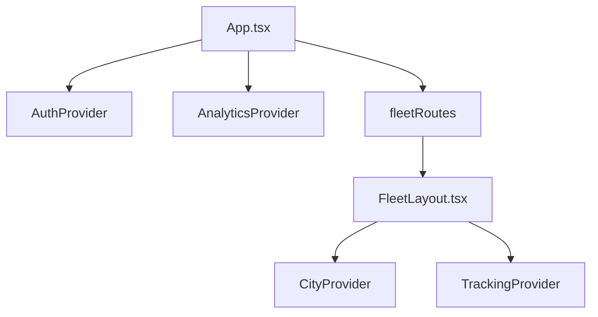
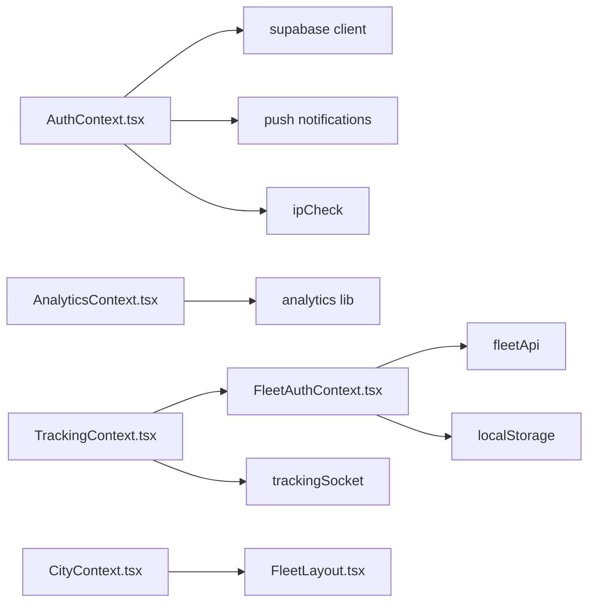

# Context Providers

<cite>
**Referenced Files in This Document**
- [AuthContext.tsx](file://src/contexts/AuthContext.tsx)
- [LanguageContext.tsx](file://src/contexts/LanguageContext.tsx)
- [AnalyticsContext.tsx](file://src/contexts/AnalyticsContext.tsx)
- [FleetAuthContext.tsx](file://src/fleet/context/FleetAuthContext.tsx)
- [TrackingContext.tsx](file://src/fleet/context/TrackingContext.tsx)
- [CityContext.tsx](file://src/fleet/context/CityContext.tsx)
- [App.tsx](file://src/App.tsx)
- [FleetLayout.tsx](file://src/fleet/components/layout/FleetLayout.tsx)
- [LiveMap.tsx](file://src/fleet/components/map/LiveMap.tsx)
- [DriverList.tsx](file://src/fleet/components/drivers/DriverList.tsx)
- [CitySelector.tsx](file://src/fleet/components/common/CitySelector.tsx)
- [fleetRoutes.tsx](file://src/fleet/routes.tsx)
- [supabase client](file://src/integrations/supabase/client.ts)
- [analytics lib](file://src/lib/analytics.ts)
- [push notifications](file://src/lib/notifications/push.ts)
- [ipCheck](file://src/lib/ipCheck.ts)
- [trackingSocket](file://src/fleet/services/trackingSocket.ts)
- [fleetApi](file://src/fleet/services/fleetApi.ts)
</cite>

## Table of Contents
1. [Introduction](#introduction)
2. [Project Structure](#project-structure)
3. [Core Components](#core-components)
4. [Architecture Overview](#architecture-overview)
5. [Detailed Component Analysis](#detailed-component-analysis)
6. [Dependency Analysis](#dependency-analysis)
7. [Performance Considerations](#performance-considerations)
8. [Troubleshooting Guide](#troubleshooting-guide)
9. [Conclusion](#conclusion)
10. [Appendices](#appendices)

## Introduction
This document explains the context provider components that manage global state and shared functionality across the application. It covers:
- Authentication state for the customer application (AuthContext)
- Internationalization (LanguageContext)
- Analytics (AnalyticsContext)
- Fleet-specific context providers (FleetAuthContext, TrackingContext, CityContext)
It describes the context architecture, state management patterns, provider composition, and how to integrate with React hooks. It also includes usage examples and best practices for consuming context providers.

## Project Structure
The context providers are organized by domain:
- Global contexts for customer app: AuthContext, LanguageContext, AnalyticsContext
- Fleet portal contexts: FleetAuthContext, TrackingContext, CityContext
- Provider composition is centralized in the application shell (App.tsx), which wraps routes with appropriate providers

**Diagram sources**
- [App.tsx:139-149](file://src/App.tsx#L139-L149)
- [FleetLayout.tsx:1907-1923](file://src/fleet/components/layout/FleetLayout.tsx#L1907-L1923)

**Section sources**
- [App.tsx:139-149](file://src/App.tsx#L139-L149)
- [FleetLayout.tsx:1907-1923](file://src/fleet/components/layout/FleetLayout.tsx#L1907-L1923)

## Core Components
- AuthContext: Manages authentication state, session lifecycle, sign-up/sign-in/sign-out, and integrates with Supabase and push notifications on native platforms.
- LanguageContext: Provides a bilingual dictionary and language switching mechanism for the customer app.
- AnalyticsContext: Initializes analytics and exposes tracking APIs for events, page views, user identification, and resets.
- FleetAuthContext: Manages fleet portal authentication, token refresh, and role-based access control.
- TrackingContext: Handles real-time driver location updates via WebSocket and maintains driver state.
- CityContext: Manages selected cities for filtering and multi-city access in the fleet portal.

**Section sources**
- [AuthContext.tsx:8-25](file://src/contexts/AuthContext.tsx#L8-L25)
- [LanguageContext.tsx:1-10](file://src/contexts/LanguageContext.tsx#L1-L10)
- [AnalyticsContext.tsx:13-47](file://src/contexts/AnalyticsContext.tsx#L13-L47)
- [FleetAuthContext.tsx:7-16](file://src/fleet/context/FleetAuthContext.tsx#L7-L16)
- [TrackingContext.tsx:10-18](file://src/fleet/context/TrackingContext.tsx#L10-L18)
- [CityContext.tsx:4-9](file://src/fleet/context/CityContext.tsx#L4-L9)

## Architecture Overview
The application composes providers at the root level and exposes hooks for consumption. The customer app initializes Auth and Analytics providers, while the fleet portal composes FleetAuth, Tracking, and City providers within a dedicated layout.

**Diagram sources**
- [App.tsx:139-149](file://src/App.tsx#L139-L149)
- [FleetLayout.tsx:1907-1923](file://src/fleet/components/layout/FleetLayout.tsx#L1907-L1923)

## Detailed Component Analysis

### AuthContext (Customer App Authentication)
AuthContext centralizes authentication state and actions:
- State: user, session, loading
- Actions: signUp, signIn, signOut
- Effects: listens to Supabase auth state changes, initializes push notifications on native platforms, performs IP location checks during sign-in

**Diagram sources**
- [AuthContext.tsx:36-61](file://src/contexts/AuthContext.tsx#L36-L61)
- [AuthContext.tsx:87-112](file://src/contexts/AuthContext.tsx#L87-L112)
- [supabase client](file://src/integrations/supabase/client.ts)
- [push notifications](file://src/lib/notifications/push.ts)
- [ipCheck](file://src/lib/ipCheck.ts)

Key implementation patterns:
- Context creation with explicit error handling when hook is used outside provider
- Supabase auth state listener and session retrieval on mount
- IP location check before login with graceful failure handling
- Native push notification initialization on sign-in

Best practices:
- Always wrap the app with AuthProvider
- Use useAuth() inside components that require authentication state
- Handle sign-in errors and display user-friendly messages
- Clear local storage on sign-out for security

**Section sources**
- [AuthContext.tsx:8-25](file://src/contexts/AuthContext.tsx#L8-L25)
- [AuthContext.tsx:31-61](file://src/contexts/AuthContext.tsx#L31-L61)
- [AuthContext.tsx:63-118](file://src/contexts/AuthContext.tsx#L63-L118)
- [AuthContext.tsx:120-130](file://src/contexts/AuthContext.tsx#L120-L130)

### LanguageContext (Internationalization)
LanguageContext provides:
- Language type definition ("en" | "ar")
- A large translation dictionary keyed by English terms
- Hooks to consume and switch languages

**Diagram sources**
- [LanguageContext.tsx:1-10](file://src/contexts/LanguageContext.tsx#L1-L10)

Best practices:
- Keep translation keys consistent and descriptive
- Avoid embedding raw strings in components; always use translation keys
- Consider lazy-loading language dictionaries for performance

**Section sources**
- [LanguageContext.tsx:1-10](file://src/contexts/LanguageContext.tsx#L1-L10)

### AnalyticsContext (User Analytics)
AnalyticsContext initializes analytics and exposes:
- trackEvent(eventName, properties?)
- trackPageView(pageName, properties?)
- identifyUser(userId, traits?)
- resetUser()

**Diagram sources**
- [AnalyticsContext.tsx:22-39](file://src/contexts/AnalyticsContext.tsx#L22-L39)
- [analytics lib](file://src/lib/analytics.ts)

Best practices:
- Initialize analytics provider at the root
- Track meaningful events with structured properties
- Identify users after authentication
- Reset user data on sign-out

**Section sources**
- [AnalyticsContext.tsx:13-47](file://src/contexts/AnalyticsContext.tsx#L13-L47)
- [AnalyticsContext.tsx:50-54](file://src/contexts/AnalyticsContext.tsx#L50-L54)

### FleetAuthContext (Fleet Portal Authentication)
FleetAuthContext manages:
- User, token, refresh token, authentication state, and loading
- Login, logout, and city access checks
- Local storage persistence and periodic token refresh

**Diagram sources**
- [FleetAuthContext.tsx:24-52](file://src/fleet/context/FleetAuthContext.tsx#L24-L52)
- [FleetAuthContext.tsx:75-105](file://src/fleet/context/FleetAuthContext.tsx#L75-L105)
- [FleetAuthContext.tsx:123-127](file://src/fleet/context/FleetAuthContext.tsx#L123-L127)
- [fleetApi](file://src/fleet/services/fleetApi.ts)

Best practices:
- Persist tokens securely and refresh periodically
- Use hasCityAccess to gate city-specific features
- Provide user-friendly feedback on login/logout failures

**Section sources**
- [FleetAuthContext.tsx:7-16](file://src/fleet/context/FleetAuthContext.tsx#L7-L16)
- [FleetAuthContext.tsx:24-73](file://src/fleet/context/FleetAuthContext.tsx#L24-L73)
- [FleetAuthContext.tsx:129-144](file://src/fleet/context/FleetAuthContext.tsx#L129-L144)

### TrackingContext (Real-Time Driver Locations)
TrackingContext connects to a WebSocket service to receive live driver locations and maintains:
- drivers array with lastUpdate timestamps
- connection status
- selected driver and online count
- automatic cleanup of stale drivers

**Diagram sources**
- [TrackingContext.tsx:24-83](file://src/fleet/context/TrackingContext.tsx#L24-L83)
- [TrackingContext.tsx:131-137](file://src/fleet/context/TrackingContext.tsx#L131-L137)
- [trackingSocket](file://src/fleet/services/trackingSocket.ts)
- [FleetAuthContext.tsx:29](file://src/fleet/context/FleetAuthContext.tsx#L29)

Best practices:
- Reconnect gracefully on disconnect
- Filter drivers by city or status for efficient rendering
- Clean up stale drivers to prevent memory leaks

**Section sources**
- [TrackingContext.tsx:10-18](file://src/fleet/context/TrackingContext.tsx#L10-L18)
- [TrackingContext.tsx:24-95](file://src/fleet/context/TrackingContext.tsx#L24-L95)
- [TrackingContext.tsx:114-129](file://src/fleet/context/TrackingContext.tsx#L114-L129)

### CityContext (Fleet City Selection)
CityContext manages:
- Available cities for selection
- Selected cities (single or multiple depending on role)
- Loading state

**Diagram sources**
- [CityContext.tsx:13-39](file://src/fleet/context/CityContext.tsx#L13-L39)
- [CitySelector.tsx:2191-2256](file://src/fleet/components/common/CitySelector.tsx#L2191-L2256)
- [DriverList.tsx:2271-2320](file://src/fleet/components/drivers/DriverList.tsx#L2271-L2320)

Best practices:
- Super admins can select multiple cities; regular fleet managers select one
- Use selectedCities to drive filtering and API calls
- Keep availableCities in sync with backend data

**Section sources**
- [CityContext.tsx:4-9](file://src/fleet/context/CityContext.tsx#L4-L9)
- [CityContext.tsx:13-39](file://src/fleet/context/CityContext.tsx#L13-L39)

### Provider Composition and Integration
Provider composition is centralized in App.tsx for the customer app and in FleetLayout.tsx for the fleet portal.

**Diagram sources**
- [App.tsx:139-149](file://src/App.tsx#L139-L149)
- [FleetLayout.tsx:1907-1923](file://src/fleet/components/layout/FleetLayout.tsx#L1907-L1923)

Best practices:
- Place global providers near the root for broad availability
- Nest fleet-specific providers within the fleet layout
- Ensure providers are ordered correctly (dependencies first)

**Section sources**
- [App.tsx:139-149](file://src/App.tsx#L139-L149)
- [FleetLayout.tsx:1907-1923](file://src/fleet/components/layout/FleetLayout.tsx#L1907-L1923)

### Usage Examples and Best Practices
- Consume AuthContext:
  - Use useAuth() to access user, session, loading, and auth actions
  - Wrap protected routes with ProtectedRoute and guard sensitive features
- Consume LanguageContext:
  - Use the translation dictionary to render localized text
  - Switch languages by updating the context state
- Consume AnalyticsContext:
  - Use usePageTracking to record page views
  - Use useAnalytics to track custom events with properties
- Consume FleetAuthContext:
  - Use useFleetAuth() to access token, user, and login/logout
  - Use hasCityAccess to enforce city-level permissions
- Consume TrackingContext:
  - Use useTracking() to access drivers, connection status, and selected driver
  - Use useDriverLocation and useDriversByCity for derived data
- Consume CityContext:
  - Use useCity() to manage selected cities and available cities
  - Use CitySelector for UI city selection

Best practices:
- Always check loading states before rendering sensitive UI
- Handle errors from auth and analytics actions gracefully
- Persist and refresh tokens for fleet auth
- Reconnect WebSocket connections and clean stale data
- Keep translation keys consistent and scoped to modules

**Section sources**
- [AuthContext.tsx:19-25](file://src/contexts/AuthContext.tsx#L19-L25)
- [AnalyticsContext.tsx:41-47](file://src/contexts/AnalyticsContext.tsx#L41-L47)
- [FleetAuthContext.tsx:147-153](file://src/fleet/context/FleetAuthContext.tsx#L147-L153)
- [TrackingContext.tsx:131-137](file://src/fleet/context/TrackingContext.tsx#L131-L137)
- [CityContext.tsx:41-47](file://src/fleet/context/CityContext.tsx#L41-L47)

## Dependency Analysis
Context providers depend on external libraries and services:
- AuthContext depends on Supabase client, push notifications, and IP check utilities
- AnalyticsContext depends on analytics library
- FleetAuthContext depends on fleet API and local storage
- TrackingContext depends on WebSocket service and fleet auth context

**Diagram sources**
- [AuthContext.tsx:2-6](file://src/contexts/AuthContext.tsx#L2-L6)
- [AnalyticsContext.tsx:2-11](file://src/contexts/AnalyticsContext.tsx#L2-L11)
- [FleetAuthContext.tsx:4](file://src/fleet/context/FleetAuthContext.tsx#L4)
- [TrackingContext.tsx:2-4](file://src/fleet/context/TrackingContext.tsx#L2-L4)
- [CityContext.tsx:1-2](file://src/fleet/context/CityContext.tsx#L1-L2)

**Section sources**
- [AuthContext.tsx:2-6](file://src/contexts/AuthContext.tsx#L2-L6)
- [AnalyticsContext.tsx:2-11](file://src/contexts/AnalyticsContext.tsx#L2-L11)
- [FleetAuthContext.tsx:4](file://src/fleet/context/FleetAuthContext.tsx#L4)
- [TrackingContext.tsx:2-4](file://src/fleet/context/TrackingContext.tsx#L2-L4)
- [CityContext.tsx:1-2](file://src/fleet/context/CityContext.tsx#L1-L2)

## Performance Considerations
- Minimize re-renders by structuring context values efficiently (group related state)
- Use callbacks and memoization for expensive computations in context providers
- Debounce or throttle analytics events and driver location updates
- Clean up intervals and subscriptions in useEffect return functions
- Persist and reuse tokens to reduce network requests
- Lazy-load translation dictionaries if language packs grow large

## Troubleshooting Guide
Common issues and resolutions:
- Hook used outside provider:
  - Ensure the component is rendered within the correct provider
  - Verify provider composition order in App.tsx or FleetLayout.tsx
- Auth state not updating:
  - Confirm Supabase auth state listener is registered and session retrieval completes
  - Check for errors returned by sign-in/sign-up actions
- Analytics not recording:
  - Verify initPostHog is called during provider mount
  - Ensure identifyUser is called after authentication
- Fleet token refresh failures:
  - Check refresh token endpoint and error handling
  - Clear stored tokens on refresh failure and trigger logout
- WebSocket disconnections:
  - Implement reconnect logic and notify users
  - Validate token and user role before connecting
- City selection not applied:
  - Ensure selectedCities is updated and passed to components
  - Verify CitySelector toggles work for super admins and fleet managers differently

**Section sources**
- [AuthContext.tsx:19-25](file://src/contexts/AuthContext.tsx#L19-L25)
- [AnalyticsContext.tsx:22-39](file://src/contexts/AnalyticsContext.tsx#L22-L39)
- [FleetAuthContext.tsx:54-73](file://src/fleet/context/FleetAuthContext.tsx#L54-L73)
- [TrackingContext.tsx:61-83](file://src/fleet/context/TrackingContext.tsx#L61-L83)
- [CitySelector.tsx:2196-2214](file://src/fleet/components/common/CitySelector.tsx#L2196-L2214)

## Conclusion
The context providers establish a robust foundation for global state and shared functionality:
- AuthContext and AnalyticsContext provide essential customer app capabilities
- LanguageContext enables internationalization
- FleetAuthContext, TrackingContext, and CityContext power the fleet portal’s real-time and multi-city features
By following the composition patterns and best practices outlined here, teams can reliably extend and maintain these providers across the application.

## Appendices
- Provider composition reference:
  - Customer app: App.tsx composes AuthProvider and AnalyticsProvider
  - Fleet portal: FleetLayout.tsx composes CityProvider and TrackingProvider around fleet routes
- Fleet routes and layout:
  - fleetRoutes define fleet portal navigation
  - FleetLayout sets up provider nesting for fleet features

**Section sources**
- [App.tsx:139-149](file://src/App.tsx#L139-L149)
- [FleetLayout.tsx:1907-1923](file://src/fleet/components/layout/FleetLayout.tsx#L1907-L1923)
- [fleetRoutes.tsx:2326-2352](file://src/fleet/routes.tsx#L2326-L2352)