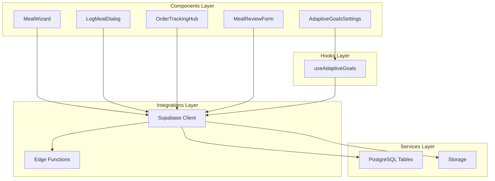
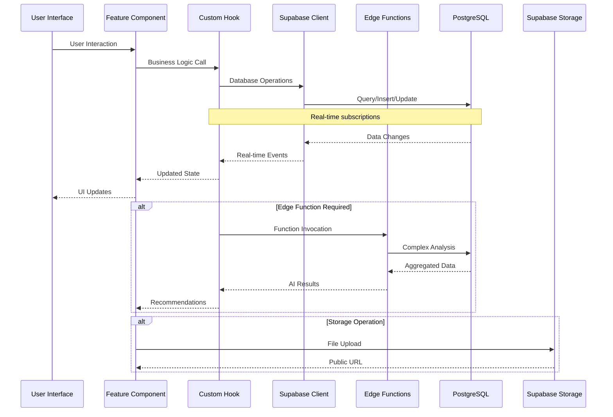
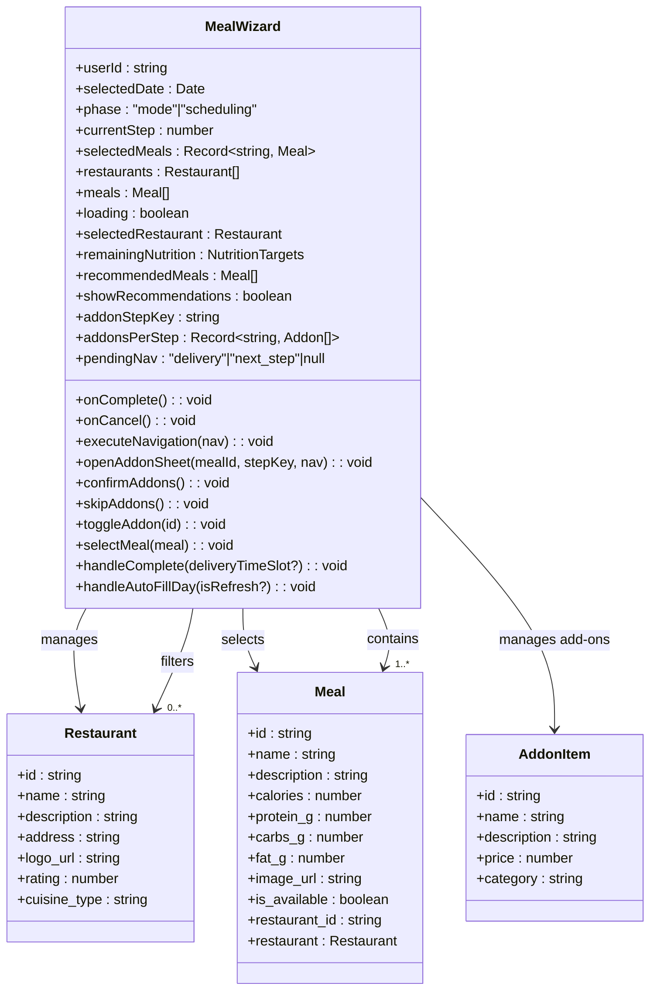
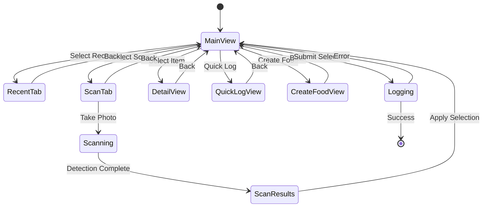
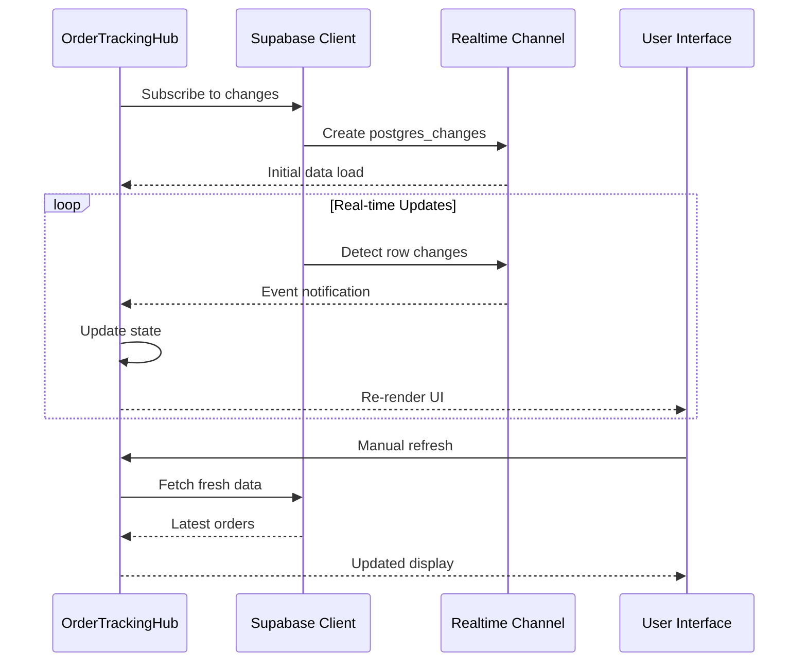
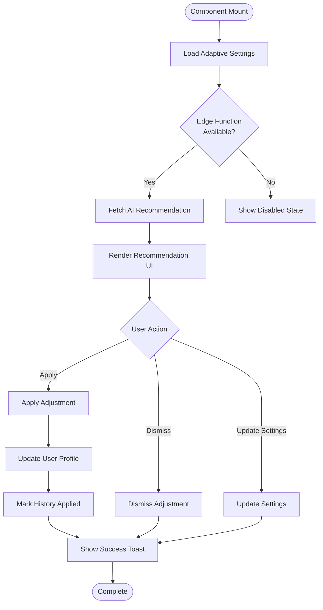
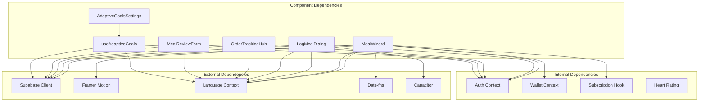

# Feature Components

<cite>
**Referenced Files in This Document**
- [MealWizard.tsx](file://src/components/MealWizard.tsx)
- [LogMealDialog.tsx](file://src/components/LogMealDialog.tsx)
- [OrderTrackingHub.tsx](file://src/components/OrderTrackingHub.tsx)
- [MealReviewForm.tsx](file://src/components/MealReviewForm.tsx)
- [AdaptiveGoalsSettings.tsx](file://src/components/AdaptiveGoalsSettings.tsx)
- [useAdaptiveGoals.ts](file://src/hooks/useAdaptiveGoals.ts)
- [client.ts](file://src/integrations/supabase/client.ts)
- [order-status.ts](file://src/lib/constants/order-status.ts)
- [LogMealDialog.tsx](file://src/components/LogMealDialog.tsx)
</cite>

## Table of Contents
1. [Introduction](#introduction)
2. [Project Structure](#project-structure)
3. [Core Components](#core-components)
4. [Architecture Overview](#architecture-overview)
5. [Detailed Component Analysis](#detailed-component-analysis)
6. [Dependency Analysis](#dependency-analysis)
7. [Performance Considerations](#performance-considerations)
8. [Troubleshooting Guide](#troubleshooting-guide)
9. [Conclusion](#conclusion)

## Introduction
This document provides comprehensive technical documentation for five feature-rich components that implement complex business functionality:
- MealWizard: Interactive meal selection and scheduling with AI-powered recommendations and add-ons
- LogMealDialog: Food logging with scanning, manual entry, and nutrition tracking
- OrderTrackingHub: Real-time delivery order tracking with status updates
- MealReviewForm: Comprehensive meal rating and review system with photo uploads
- AdaptiveGoalsSettings: Smart nutrition goal adjustment powered by AI analysis

Each component integrates deeply with Supabase for data persistence, real-time updates, and edge function orchestration, while maintaining responsive user experiences across web and native platforms.

## Project Structure
The components follow a modular architecture with clear separation of concerns:
- UI Components: Located in `src/components/` with feature-specific implementations
- Hooks: Business logic encapsulation in `src/hooks/`
- Integrations: Supabase client configuration in `src/integrations/supabase/`
- Utilities: Shared constants and helpers in `src/lib/`

**Diagram sources**
- [MealWizard.tsx:1-2222](file://src/components/MealWizard.tsx#L1-L2222)
- [LogMealDialog.tsx:1-1039](file://src/components/LogMealDialog.tsx#L1-L1039)
- [OrderTrackingHub.tsx:1-235](file://src/components/OrderTrackingHub.tsx#L1-L235)
- [MealReviewForm.tsx:1-360](file://src/components/MealReviewForm.tsx#L1-L360)
- [AdaptiveGoalsSettings.tsx:1-180](file://src/components/AdaptiveGoalsSettings.tsx#L1-L180)

**Section sources**
- [client.ts:1-57](file://src/integrations/supabase/client.ts#L1-L57)

## Core Components

### MealWizard: Intelligent Meal Selection and Scheduling
The MealWizard component provides a sophisticated meal selection experience with:
- Multi-step wizard interface supporting breakfast, lunch, dinner, and snacks
- AI-powered meal recommendations based on remaining nutrition targets
- Restaurant browsing with filtering and sorting capabilities
- Add-ons management with wallet integration
- Auto-fill day planning with Nutrio AI suggestions
- Real-time nutrition calculation and progress tracking

Key features include:
- Dynamic step navigation with animated transitions
- Restaurant and meal selection with visual feedback
- Integration with Supabase edge functions for AI meal allocation
- Wallet-based add-on purchases with real-time balance checks
- Delivery address management with default selection

**Section sources**
- [MealWizard.tsx:1-2222](file://src/components/MealWizard.tsx#L1-L2222)

### LogMealDialog: Comprehensive Food Logging System
The LogMealDialog offers multiple pathways for food logging:
- Recent meals history with quick selection
- AI-powered food scanning with camera integration
- Manual entry with macro nutrition tracking
- Scheduled meal completion marking
- Food detail visualization with macro breakdown charts

Implementation highlights:
- Dual-tab interface (Recent/Scan) for flexible input methods
- Optimistic UI updates with immediate feedback
- Camera permission handling for native platforms
- AI-powered food detection with confidence scoring
- Macro nutrition visualization using SVG pie charts

**Section sources**
- [LogMealDialog.tsx:1-1039](file://src/components/LogMealDialog.tsx#L1-L1039)

### OrderTrackingHub: Real-Time Delivery Tracking
Real-time order monitoring with:
- Live status updates via Supabase real-time subscriptions
- Unified order status management with visual indicators
- Driver information display and contact capabilities
- Automated refresh mechanisms with loading states
- Responsive card-based layout with status progression

The component leverages Supabase's real-time capabilities to provide seamless order tracking without manual polling.

**Section sources**
- [OrderTrackingHub.tsx:1-235](file://src/components/OrderTrackingHub.tsx#L1-L235)
- [order-status.ts:1-116](file://src/lib/constants/order-status.ts#L1-L116)

### MealReviewForm: Advanced Rating and Review System
Comprehensive review collection with:
- Star-based rating system with dynamic labels
- Photo upload capability with cloud storage integration
- Tag-based review categorization
- Would recommend functionality
- Form validation and error handling
- Real-time preview of uploaded images

The form integrates with Supabase Storage for secure photo handling and uses RPC functions for review submission.

**Section sources**
- [MealReviewForm.tsx:1-360](file://src/components/MealReviewForm.tsx#L1-L360)

### AdaptiveGoalsSettings: Smart Nutrition Management
AI-powered goal adjustment with:
- Configurable auto-adjustment frequency (weekly/biweekly/monthly)
- Real-time recommendation display with confidence scoring
- Adjustment history tracking with applied/pending status
- Weight prediction visualization
- Safe calorie range enforcement (1200-4000 calories)

The component coordinates with edge functions for intelligent analysis and provides user-friendly controls for goal management.

**Section sources**
- [AdaptiveGoalsSettings.tsx:1-180](file://src/components/AdaptiveGoalsSettings.tsx#L1-L180)
- [useAdaptiveGoals.ts:1-407](file://src/hooks/useAdaptiveGoals.ts#L1-L407)

## Architecture Overview

**Diagram sources**
- [client.ts:1-57](file://src/integrations/supabase/client.ts#L1-L57)
- [useAdaptiveGoals.ts:137-178](file://src/hooks/useAdaptiveGoals.ts#L137-L178)
- [MealWizard.tsx:700-720](file://src/components/MealWizard.tsx#L700-L720)

The architecture demonstrates a clean separation between presentation, business logic, and data access layers, with Supabase serving as the central integration point for all persistence and real-time needs.

## Detailed Component Analysis

### MealWizard Component Architecture

**Diagram sources**
- [MealWizard.tsx:43-79](file://src/components/MealWizard.tsx#L43-L79)
- [MealWizard.tsx:147-159](file://src/components/MealWizard.tsx#L147-L159)

The component implements a sophisticated state management system with:
- Multi-phase operation (mode selection and scheduling)
- Nested state for complex workflows (restaurants → meals → add-ons)
- Real-time nutrition calculation and recommendation engine
- Edge function integration for AI-powered meal allocation
- Comprehensive error handling and user feedback

**Section sources**
- [MealWizard.tsx:87-178](file://src/components/MealWizard.tsx#L87-L178)
- [MealWizard.tsx:261-335](file://src/components/MealWizard.tsx#L261-L335)

### LogMealDialog State Management Flow

**Diagram sources**
- [LogMealDialog.tsx:64-108](file://src/components/LogMealDialog.tsx#L64-L108)
- [LogMealDialog.tsx:444-457](file://src/components/LogMealDialog.tsx#L444-L457)

The dialog implements a comprehensive state machine with tab-based navigation and modal workflows, providing seamless transitions between different input modes while maintaining data consistency.

**Section sources**
- [LogMealDialog.tsx:64-108](file://src/components/LogMealDialog.tsx#L64-L108)
- [LogMealDialog.tsx:110-164](file://src/components/LogMealDialog.tsx#L110-L164)

### OrderTrackingHub Real-Time Updates

**Diagram sources**
- [OrderTrackingHub.tsx:94-114](file://src/components/OrderTrackingHub.tsx#L94-L114)
- [order-status.ts:14-73](file://src/lib/constants/order-status.ts#L14-L73)

The tracking hub demonstrates efficient real-time architecture using Supabase's postgres_changes feature, eliminating polling overhead while ensuring data freshness.

**Section sources**
- [OrderTrackingHub.tsx:44-87](file://src/components/OrderTrackingHub.tsx#L44-L87)
- [OrderTrackingHub.tsx:94-114](file://src/components/OrderTrackingHub.tsx#L94-L114)

### AdaptiveGoalsSettings Integration Pattern

**Diagram sources**
- [AdaptiveGoalsSettings.tsx:16-35](file://src/components/AdaptiveGoalsSettings.tsx#L16-L35)
- [useAdaptiveGoals.ts:327-377](file://src/hooks/useAdaptiveGoals.ts#L327-L377)

The adaptive goals system showcases sophisticated error handling and graceful degradation when edge functions are unavailable, ensuring core functionality remains accessible.

**Section sources**
- [useAdaptiveGoals.ts:76-134](file://src/hooks/useAdaptiveGoals.ts#L76-L134)
- [useAdaptiveGoals.ts:136-178](file://src/hooks/useAdaptiveGoals.ts#L136-L178)

## Dependency Analysis

**Diagram sources**
- [client.ts:1-57](file://src/integrations/supabase/client.ts#L1-L57)
- [useAdaptiveGoals.ts:1-6](file://src/hooks/useAdaptiveGoals.ts#L1-L6)

The dependency graph reveals a well-structured architecture where components depend primarily on Supabase for data operations and shared contexts for authentication and localization, while minimizing coupling between individual components.

**Section sources**
- [client.ts:1-57](file://src/integrations/supabase/client.ts#L1-L57)
- [useAdaptiveGoals.ts:1-6](file://src/hooks/useAdaptiveGoals.ts#L1-L6)

## Performance Considerations

### State Management Optimization
- **Selective Re-renders**: Components utilize granular state management to minimize unnecessary re-renders
- **Memoization Patterns**: Critical calculations are memoized to prevent redundant computations
- **Lazy Loading**: Large datasets are loaded on-demand rather than during initial render

### Network Efficiency
- **Batch Operations**: Multiple related operations are batched to reduce network round trips
- **Caching Strategies**: Frequently accessed data is cached locally with appropriate invalidation
- **Debounced Searches**: Input fields use debouncing to limit API calls during typing

### Real-time Performance
- **Connection Pooling**: Supabase connections are managed efficiently to handle multiple simultaneous subscriptions
- **Event Filtering**: Real-time events are filtered on the client-side to avoid processing irrelevant updates
- **Background Sync**: Non-critical updates are synchronized in the background to maintain UI responsiveness

## Troubleshooting Guide

### Common Integration Issues
**Supabase Connection Problems**
- Verify environment variables are properly configured
- Check network connectivity and firewall settings
- Monitor connection retry logic and error boundaries

**Edge Function Deployment**
- Ensure edge functions are deployed to Supabase
- Verify function permissions and CORS settings
- Monitor function availability with graceful fallbacks

**Real-time Subscription Failures**
- Implement automatic reconnection logic
- Handle network interruptions gracefully
- Monitor subscription health and re-establish when needed

### Component-Specific Debugging
**MealWizard Issues**
- Verify restaurant and meal data availability
- Check add-on pricing and wallet balance synchronization
- Monitor AI recommendation function availability

**LogMealDialog Problems**
- Validate camera permissions for native platforms
- Check image upload size limits and formats
- Monitor AI detection accuracy and confidence thresholds

**OrderTrackingHub Challenges**
- Verify real-time subscription setup
- Check order status mapping and display logic
- Monitor driver information availability

**Section sources**
- [client.ts:10-16](file://src/integrations/supabase/client.ts#L10-L16)
- [useAdaptiveGoals.ts:140-160](file://src/hooks/useAdaptiveGoals.ts#L140-L160)

## Conclusion

These feature-rich components demonstrate enterprise-grade implementation patterns with sophisticated state management, real-time capabilities, and seamless integration with Supabase services. The modular architecture ensures maintainability while the comprehensive error handling and performance optimizations provide robust user experiences across diverse deployment scenarios.

The components collectively represent a mature, production-ready solution for meal management, nutrition tracking, and delivery coordination, with clear extension points for future enhancements and customization requirements.