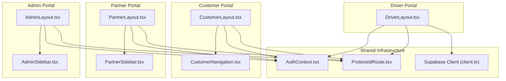
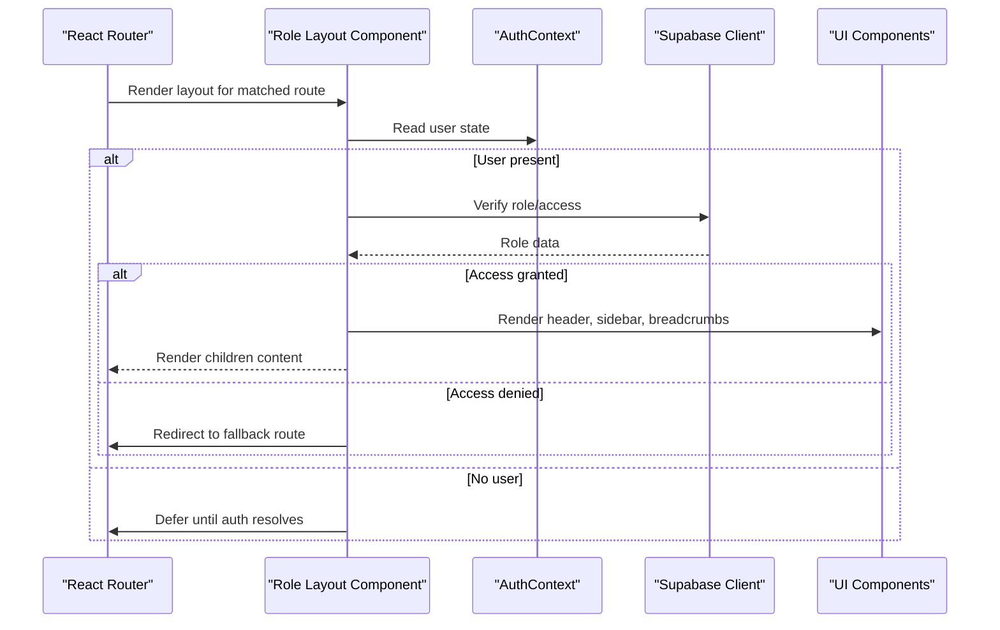
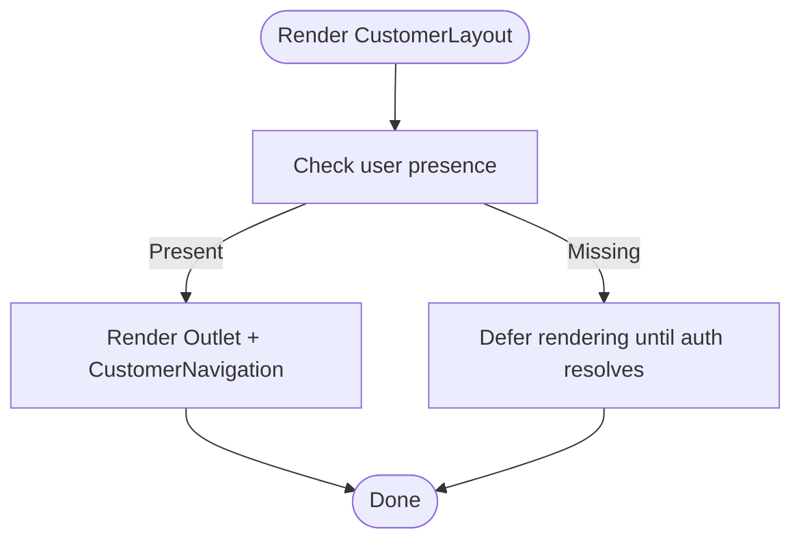
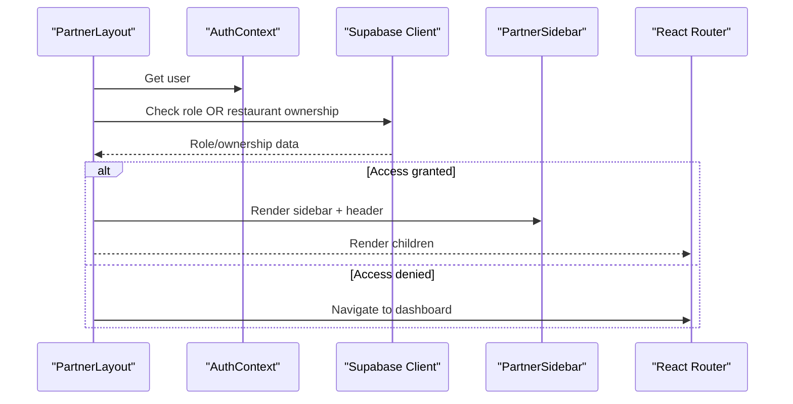
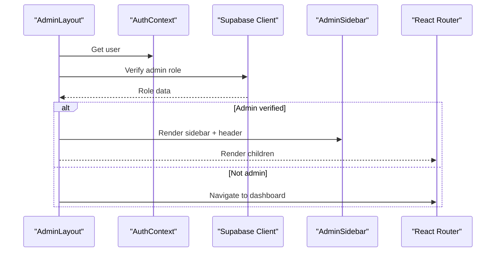
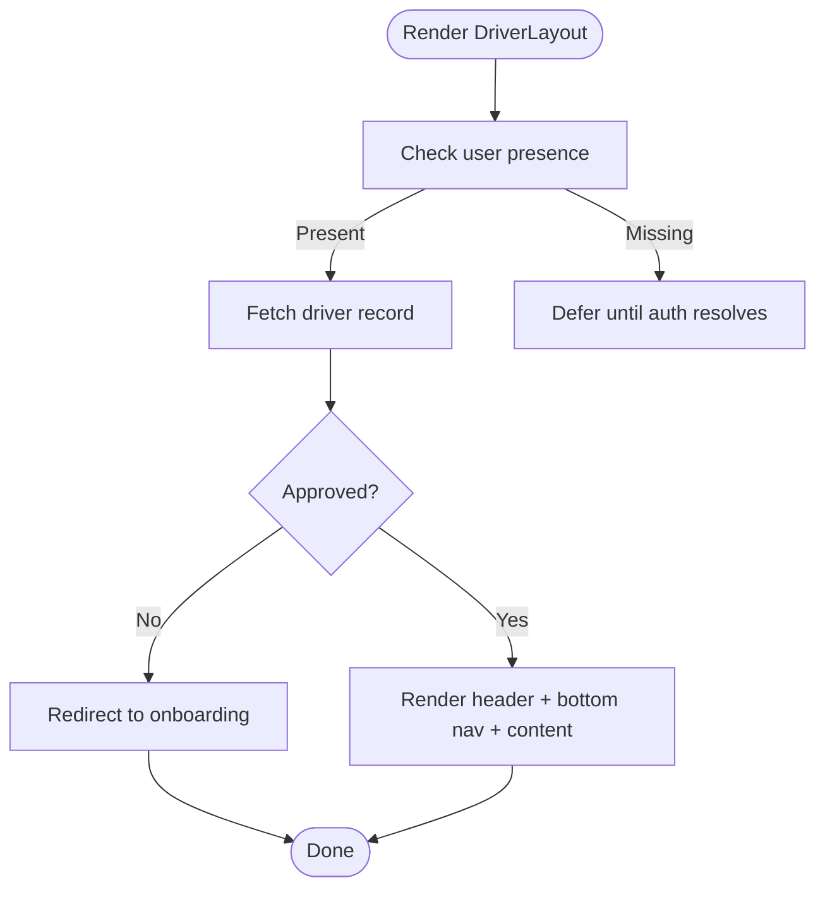
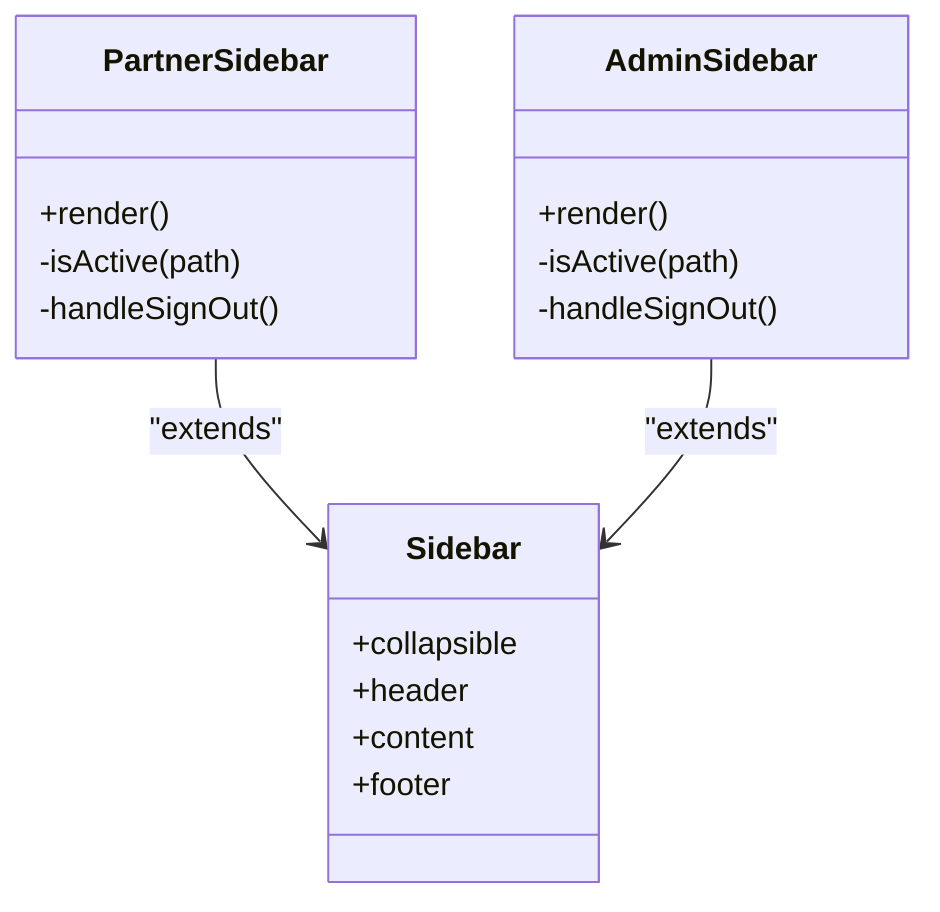
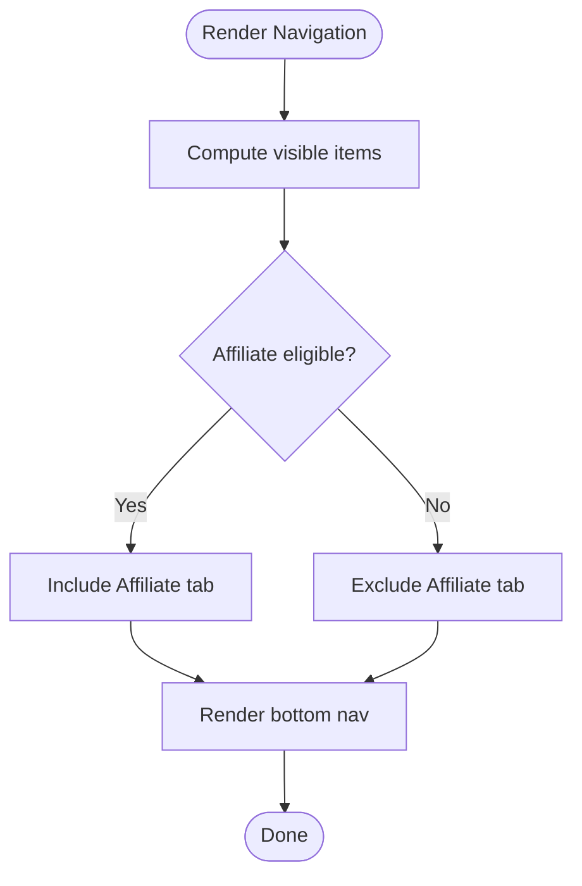
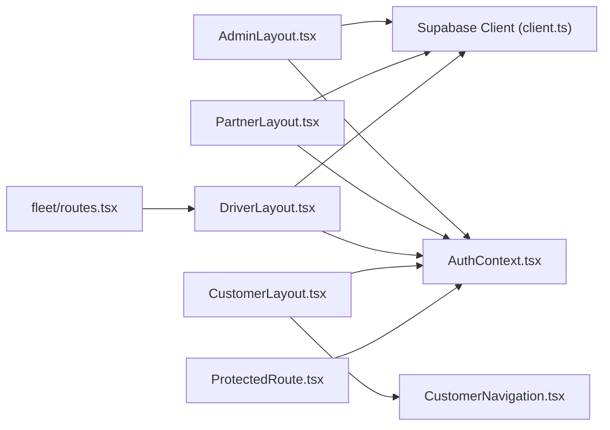

# Portal Layouts

<cite>
**Referenced Files in This Document**
- [AdminLayout.tsx](file://src/components/AdminLayout.tsx)
- [AdminSidebar.tsx](file://src/components/AdminSidebar.tsx)
- [PartnerLayout.tsx](file://src/components/PartnerLayout.tsx)
- [PartnerSidebar.tsx](file://src/components/PartnerSidebar.tsx)
- [CustomerLayout.tsx](file://src/components/CustomerLayout.tsx)
- [CustomerNavigation.tsx](file://src/components/CustomerNavigation.tsx)
- [DriverLayout.tsx](file://src/components/DriverLayout.tsx)
- [ProtectedRoute.tsx](file://src/components/ProtectedRoute.tsx)
- [AuthContext.tsx](file://src/contexts/AuthContext.tsx)
- [client.ts](file://src/integrations/supabase/client.ts)
- [routes.tsx](file://src/fleet/routes.tsx)
</cite>

## Table of Contents
1. [Introduction](#introduction)
2. [Project Structure](#project-structure)
3. [Core Components](#core-components)
4. [Architecture Overview](#architecture-overview)
5. [Detailed Component Analysis](#detailed-component-analysis)
6. [Dependency Analysis](#dependency-analysis)
7. [Performance Considerations](#performance-considerations)
8. [Troubleshooting Guide](#troubleshooting-guide)
9. [Conclusion](#conclusion)

## Introduction
This document provides comprehensive documentation for the role-specific layout components that define portal-specific navigation and structure across the customer, partner, driver, and admin portals. It explains the layout composition, navigation patterns, sidebar implementations, header configurations, responsive behavior, routing integration, and role-based access control. It also covers customization options, layout variants, and integration patterns for each portal type.

## Project Structure
The portal layouts are implemented as standalone React components that wrap page content and provide consistent navigation and structure per role. They integrate with Supabase for role verification, use shared UI primitives for sidebars and breadcrumbs, and coordinate with routing to enforce access control and present contextual navigation.

**Diagram sources**
- [CustomerLayout.tsx:1-24](file://src/components/CustomerLayout.tsx#L1-L24)
- [CustomerNavigation.tsx:1-61](file://src/components/CustomerNavigation.tsx#L1-L61)
- [PartnerLayout.tsx:1-141](file://src/components/PartnerLayout.tsx#L1-L141)
- [PartnerSidebar.tsx:1-132](file://src/components/PartnerSidebar.tsx#L1-L132)
- [AdminLayout.tsx:1-130](file://src/components/AdminLayout.tsx#L1-L130)
- [AdminSidebar.tsx:1-151](file://src/components/AdminSidebar.tsx#L1-L151)
- [DriverLayout.tsx:1-183](file://src/components/DriverLayout.tsx#L1-L183)
- [AuthContext.tsx](file://src/contexts/AuthContext.tsx)
- [ProtectedRoute.tsx](file://src/components/ProtectedRoute.tsx)
- [client.ts](file://src/integrations/supabase/client.ts)

**Section sources**
- [CustomerLayout.tsx:1-24](file://src/components/CustomerLayout.tsx#L1-L24)
- [CustomerNavigation.tsx:1-61](file://src/components/CustomerNavigation.tsx#L1-L61)
- [PartnerLayout.tsx:1-141](file://src/components/PartnerLayout.tsx#L1-L141)
- [PartnerSidebar.tsx:1-132](file://src/components/PartnerSidebar.tsx#L1-L132)
- [AdminLayout.tsx:1-130](file://src/components/AdminLayout.tsx#L1-L130)
- [AdminSidebar.tsx:1-151](file://src/components/AdminSidebar.tsx#L1-L151)
- [DriverLayout.tsx:1-183](file://src/components/DriverLayout.tsx#L1-L183)

## Core Components
This section summarizes the primary layout components and their responsibilities:

- CustomerLayout: Provides a shared container with a persistent bottom navigation bar for customer-facing pages.
- PartnerLayout: Wraps content with a collapsible sidebar, breadcrumb header, and optional action area for partner dashboards.
- AdminLayout: Enforces admin-only access via role checks and renders a comprehensive admin sidebar and breadcrumb header.
- DriverLayout: Manages driver-specific access checks, online/offline status toggling, and a bottom navigation bar tailored for delivery operations.

Key integration points:
- Role-based access control is enforced by verifying user roles against Supabase tables.
- Navigation is driven by React Router with active-state highlighting and responsive behavior.
- UI primitives from the shared component library are used for sidebars, breadcrumbs, and skeleton loaders during initialization.

**Section sources**
- [CustomerLayout.tsx:1-24](file://src/components/CustomerLayout.tsx#L1-L24)
- [PartnerLayout.tsx:1-141](file://src/components/PartnerLayout.tsx#L1-L141)
- [AdminLayout.tsx:1-130](file://src/components/AdminLayout.tsx#L1-L130)
- [DriverLayout.tsx:1-183](file://src/components/DriverLayout.tsx#L1-L183)

## Architecture Overview
The portal layouts form the backbone of role-specific experiences. They rely on:
- Authentication context for current user state.
- Supabase client for role and profile queries.
- ProtectedRoute for declarative access control.
- Shared UI components for consistent sidebar and breadcrumb behavior.

**Diagram sources**
- [AdminLayout.tsx:33-67](file://src/components/AdminLayout.tsx#L33-L67)
- [PartnerLayout.tsx:41-76](file://src/components/PartnerLayout.tsx#L41-L76)
- [DriverLayout.tsx:32-73](file://src/components/DriverLayout.tsx#L32-L73)
- [AuthContext.tsx](file://src/contexts/AuthContext.tsx)
- [client.ts](file://src/integrations/supabase/client.ts)

## Detailed Component Analysis

### CustomerLayout
- Purpose: Provide a consistent background and bottom navigation for customer pages.
- Composition: Uses Outlet for child content and renders CustomerNavigation at the bottom.
- Responsive behavior: Navigation is fixed at the bottom and adapts to safe areas.
- Customization: Background color is applied via inline styles; can be externalized to theme tokens.

**Diagram sources**
- [CustomerLayout.tsx:8-21](file://src/components/CustomerLayout.tsx#L8-L21)
- [CustomerNavigation.tsx:1-61](file://src/components/CustomerNavigation.tsx#L1-L61)

**Section sources**
- [CustomerLayout.tsx:1-24](file://src/components/CustomerLayout.tsx#L1-L24)
- [CustomerNavigation.tsx:1-61](file://src/components/CustomerNavigation.tsx#L1-L61)

### PartnerLayout
- Purpose: Deliver a partner dashboard with role-based access, sidebar navigation, breadcrumbs, and optional action buttons.
- Access control: Verifies either a "restaurant/partner" role or ownership of a restaurant.
- Header: Includes breadcrumb navigation and optional action area for page-specific actions.
- Sidebar: PartnerSidebar provides grouped navigation items and a sign-out option.
- Responsive behavior: Uses a collapsible sidebar with tooltips and active-state highlighting.

**Diagram sources**
- [PartnerLayout.tsx:27-76](file://src/components/PartnerLayout.tsx#L27-L76)
- [PartnerSidebar.tsx:46-63](file://src/components/PartnerSidebar.tsx#L46-L63)

**Section sources**
- [PartnerLayout.tsx:1-141](file://src/components/PartnerLayout.tsx#L1-L141)
- [PartnerSidebar.tsx:1-132](file://src/components/PartnerSidebar.tsx#L1-L132)

### AdminLayout
- Purpose: Enforce admin-only access and provide comprehensive administrative navigation.
- Access control: Confirms admin role via user_roles table.
- Header: Breadcrumb navigation anchored to the admin root with optional title/subtitle.
- Sidebar: AdminSidebar offers extensive administrative sections and quick navigation to customer view.
- Responsive behavior: Collapsible sidebar with active-state detection and tooltips.

**Diagram sources**
- [AdminLayout.tsx:25-67](file://src/components/AdminLayout.tsx#L25-L67)
- [AdminSidebar.tsx:68-85](file://src/components/AdminSidebar.tsx#L68-L85)

**Section sources**
- [AdminLayout.tsx:1-130](file://src/components/AdminLayout.tsx#L1-L130)
- [AdminSidebar.tsx:1-151](file://src/components/AdminSidebar.tsx#L1-L151)

### DriverLayout
- Purpose: Manage driver-specific access checks, online/offline status, and a bottom navigation bar optimized for delivery operations.
- Access control: Requires a driver record with approved status; redirects unauthorized users to appropriate routes.
- Header: Displays title/subtitle and an online/offline toggle button with real-time status updates.
- Navigation: Bottom navigation bar with five primary destinations: Home, Orders, History, Earnings, Profile.
- Responsive behavior: Fixed bottom navigation with active-state highlighting and haptic feedback on tab switches.

**Diagram sources**
- [DriverLayout.tsx:16-73](file://src/components/DriverLayout.tsx#L16-L73)

**Section sources**
- [DriverLayout.tsx:1-183](file://src/components/DriverLayout.tsx#L1-L183)

### Sidebar Components
Both PartnerSidebar and AdminSidebar share a consistent structure:
- Collapsible header with portal branding.
- Grouped navigation items with icons and labels.
- Active-state detection based on current route.
- Footer with sign-out and portal-specific shortcuts.

**Diagram sources**
- [PartnerSidebar.tsx:46-131](file://src/components/PartnerSidebar.tsx#L46-L131)
- [AdminSidebar.tsx:68-149](file://src/components/AdminSidebar.tsx#L68-L149)

**Section sources**
- [PartnerSidebar.tsx:1-132](file://src/components/PartnerSidebar.tsx#L1-L132)
- [AdminSidebar.tsx:1-151](file://src/components/AdminSidebar.tsx#L1-L151)

### Navigation Components
- CustomerNavigation: Bottom navigation with five tabs (Home, Restaurants, Schedule, Affiliate, Profile). Affiliate tab visibility depends on approval and platform settings.
- DriverLayout: Bottom navigation with five primary destinations and an online/offline toggle integrated into the header.

**Diagram sources**
- [CustomerNavigation.tsx:26-35](file://src/components/CustomerNavigation.tsx#L26-L35)

**Section sources**
- [CustomerNavigation.tsx:1-61](file://src/components/CustomerNavigation.tsx#L1-L61)
- [DriverLayout.tsx:117-179](file://src/components/DriverLayout.tsx#L117-L179)

## Dependency Analysis
The layouts depend on several shared modules and services:

- AuthContext: Provides current user state used by all layouts for access control.
- Supabase client: Used by AdminLayout, PartnerLayout, and DriverLayout to verify roles and fetch user-related data.
- ProtectedRoute: Declaratively enforces role-based access at the routing level.
- Fleet routes: Driver portal routes are centralized for fleet management.

**Diagram sources**
- [AdminLayout.tsx:1-130](file://src/components/AdminLayout.tsx#L1-L130)
- [PartnerLayout.tsx:1-141](file://src/components/PartnerLayout.tsx#L1-L141)
- [DriverLayout.tsx:1-183](file://src/components/DriverLayout.tsx#L1-L183)
- [CustomerLayout.tsx:1-24](file://src/components/CustomerLayout.tsx#L1-L24)
- [CustomerNavigation.tsx:1-61](file://src/components/CustomerNavigation.tsx#L1-L61)
- [ProtectedRoute.tsx](file://src/components/ProtectedRoute.tsx)
- [client.ts](file://src/integrations/supabase/client.ts)
- [routes.tsx](file://src/fleet/routes.tsx)

**Section sources**
- [AdminLayout.tsx:1-130](file://src/components/AdminLayout.tsx#L1-L130)
- [PartnerLayout.tsx:1-141](file://src/components/PartnerLayout.tsx#L1-L141)
- [DriverLayout.tsx:1-183](file://src/components/DriverLayout.tsx#L1-L183)
- [CustomerLayout.tsx:1-24](file://src/components/CustomerLayout.tsx#L1-L24)
- [ProtectedRoute.tsx](file://src/components/ProtectedRoute.tsx)
- [client.ts](file://src/integrations/supabase/client.ts)
- [routes.tsx](file://src/fleet/routes.tsx)

## Performance Considerations
- Lazy loading: Consider lazy-loading heavy layout children to reduce initial bundle size.
- Conditional rendering: All layouts defer rendering until user state is resolved to avoid unnecessary re-renders.
- Icon usage: Icons are imported directly; ensure tree-shaking removes unused icons.
- Toast usage: Toast notifications are triggered on access denials; batch or debounce if needed to prevent notification floods.
- Supabase queries: Queries are minimal and scoped; avoid redundant reads by caching user roles when appropriate.

## Troubleshooting Guide
Common issues and resolutions:
- Access denied messages: Verify user roles in the user_roles table and ensure the layout's access checks align with expected roles.
- Driver status toggle failures: Confirm driver record exists and the update operation succeeds; check network connectivity and Supabase permissions.
- Missing affiliate tab: Ensure the user is approved and the platform settings enable the referral program.
- Sidebar collapse/expand: Confirm the sidebar state is managed by the shared sidebar provider and that tooltips are configured correctly.
- Protected route mismatches: Ensure routes are wrapped with ProtectedRoute and that role props match the layout access checks.

**Section sources**
- [AdminLayout.tsx:50-66](file://src/components/AdminLayout.tsx#L50-L66)
- [PartnerLayout.tsx:59-75](file://src/components/PartnerLayout.tsx#L59-L75)
- [DriverLayout.tsx:75-100](file://src/components/DriverLayout.tsx#L75-L100)
- [CustomerNavigation.tsx:26-27](file://src/components/CustomerNavigation.tsx#L26-L27)

## Conclusion
The role-specific layout components deliver a cohesive, secure, and responsive foundation for each portal. They enforce access control, provide consistent navigation, and integrate seamlessly with routing and authentication systems. By leveraging shared UI primitives and centralized access checks, the layouts remain maintainable and extensible across evolving business requirements.