# Specialized Components

<cite>
**Referenced Files in This Document**
- [MapContainer.tsx](file://src/components/maps/MapContainer.tsx)
- [DriverMarker.tsx](file://src/components/maps/DriverMarker.tsx)
- [RoutePolyline.tsx](file://src/components/maps/RoutePolyline.tsx)
- [PaymentMethodSelector.tsx](file://src/components/payment/PaymentMethodSelector.tsx)
- [SimulatedCardForm.tsx](file://src/components/payment/SimulatedCardForm.tsx)
- [WeeklyMetricsForm.tsx](file://src/components/progress/WeeklyMetricsForm.tsx)
- [ProgressRings.tsx](file://src/components/progress/ProgressRings.tsx)
- [WalletBalance.tsx](file://src/components/wallet/WalletBalance.tsx)
- [TransactionHistory.tsx](file://src/components/wallet/TransactionHistory.tsx)
- [SubscriptionManagement.tsx](file://src/components/subscription/SubscriptionManagement.tsx)
</cite>

## Table of Contents
1. [Introduction](#introduction)
2. [Project Structure](#project-structure)
3. [Core Components](#core-components)
4. [Architecture Overview](#architecture-overview)
5. [Detailed Component Analysis](#detailed-component-analysis)
6. [Dependency Analysis](#dependency-analysis)
7. [Performance Considerations](#performance-considerations)
8. [Troubleshooting Guide](#troubleshooting-guide)
9. [Conclusion](#conclusion)

## Introduction
This document provides comprehensive technical documentation for specialized feature-specific components across five categories: maps, payments, progress tracking, wallet, and subscription management. It explains implementation patterns, data binding, real-time update strategies, and integration touchpoints with backend services. The goal is to enable developers to understand how each component works, how to extend or customize them, and how they fit into the broader system architecture.

## Project Structure
The specialized components are organized by feature domain under the components directory. Each category encapsulates related UI elements and utilities that share common data flows and integration patterns.

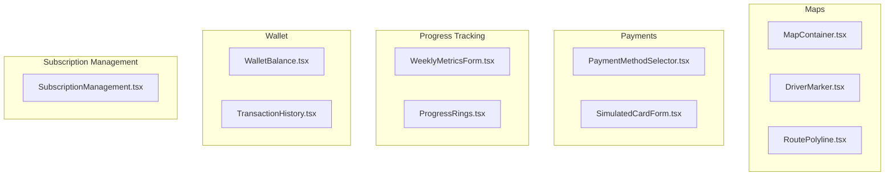

**Diagram sources**
- [MapContainer.tsx](file://src/components/maps/MapContainer.tsx)
- [DriverMarker.tsx](file://src/components/maps/DriverMarker.tsx)
- [RoutePolyline.tsx](file://src/components/maps/RoutePolyline.tsx)
- [PaymentMethodSelector.tsx](file://src/components/payment/PaymentMethodSelector.tsx)
- [SimulatedCardForm.tsx](file://src/components/payment/SimulatedCardForm.tsx)
- [WeeklyMetricsForm.tsx](file://src/components/progress/WeeklyMetricsForm.tsx)
- [ProgressRings.tsx](file://src/components/progress/ProgressRings.tsx)
- [WalletBalance.tsx](file://src/components/wallet/WalletBalance.tsx)
- [TransactionHistory.tsx](file://src/components/wallet/TransactionHistory.tsx)
- [SubscriptionManagement.tsx](file://src/components/subscription/SubscriptionManagement.tsx)

**Section sources**
- [MapContainer.tsx](file://src/components/maps/MapContainer.tsx)
- [DriverMarker.tsx](file://src/components/maps/DriverMarker.tsx)
- [RoutePolyline.tsx](file://src/components/maps/RoutePolyline.tsx)
- [PaymentMethodSelector.tsx](file://src/components/payment/PaymentMethodSelector.tsx)
- [SimulatedCardForm.tsx](file://src/components/payment/SimulatedCardForm.tsx)
- [WeeklyMetricsForm.tsx](file://src/components/progress/WeeklyMetricsForm.tsx)
- [ProgressRings.tsx](file://src/components/progress/ProgressRings.tsx)
- [WalletBalance.tsx](file://src/components/wallet/WalletBalance.tsx)
- [TransactionHistory.tsx](file://src/components/wallet/TransactionHistory.tsx)
- [SubscriptionManagement.tsx](file://src/components/subscription/SubscriptionManagement.tsx)

## Core Components
This section summarizes the primary responsibilities and integration patterns for each component category.

- Maps
  - MapContainer: A robust wrapper around a leaflet-based map with strict-mode compatibility, controlled initialization, and programmatic centering updates.
  - DriverMarker: Renders a dynamic, rotation-aware marker representing a driver’s location, speed, and ETA with animated visuals.
  - RoutePolyline: Draws route lines with optional speed-coded coloring and dashed styling.

- Payments
  - PaymentMethodSelector: Presents selectable payment methods with icons, descriptions, and selection state.
  - SimulatedCardForm: Provides a formatted, simulated credit card form with validation and submission callbacks.

- Progress Tracking
  - WeeklyMetricsForm: Collects weekly metrics inputs with structured data binding and submission handling.
  - ProgressRings: Visualizes progress indicators using ring-based components.

- Wallet
  - WalletBalance: Displays current wallet balance and related actions.
  - TransactionHistory: Lists recent transactions with filtering and pagination capabilities.

- Subscription Management
  - SubscriptionManagement: Manages subscription lifecycle actions such as renewal, cancellation, and plan upgrades.

**Section sources**
- [MapContainer.tsx](file://src/components/maps/MapContainer.tsx)
- [DriverMarker.tsx](file://src/components/maps/DriverMarker.tsx)
- [RoutePolyline.tsx](file://src/components/maps/RoutePolyline.tsx)
- [PaymentMethodSelector.tsx](file://src/components/payment/PaymentMethodSelector.tsx)
- [SimulatedCardForm.tsx](file://src/components/payment/SimulatedCardForm.tsx)
- [WeeklyMetricsForm.tsx](file://src/components/progress/WeeklyMetricsForm.tsx)
- [ProgressRings.tsx](file://src/components/progress/ProgressRings.tsx)
- [WalletBalance.tsx](file://src/components/wallet/WalletBalance.tsx)
- [TransactionHistory.tsx](file://src/components/wallet/TransactionHistory.tsx)
- [SubscriptionManagement.tsx](file://src/components/subscription/SubscriptionManagement.tsx)

## Architecture Overview
The specialized components integrate with backend services primarily through service hooks and page-level orchestrators. Data flows typically follow a pattern:
- Page components subscribe to reactive data sources (hooks).
- Components render UI and collect user input.
- Actions trigger service calls (e.g., payment simulation, progress updates, wallet operations).
- Real-time updates are handled via polling, websockets, or backend events.

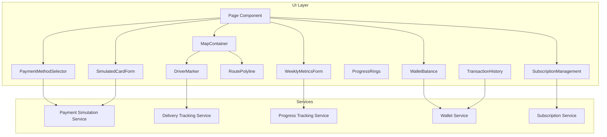

[No sources needed since this diagram shows conceptual workflow, not actual code structure]

## Detailed Component Analysis

### Maps Components

#### MapContainer
- Purpose: Provides a stable, React 18 StrictMode-compatible leaflet map container with controlled initialization and center updates.
- Implementation highlights:
  - Fixes leaflet icon defaults and patches map lifecycle to avoid “already initialized” errors.
  - Uses a key-based remount strategy to prevent stale DOM node IDs.
  - Exposes a child updater component to programmatically adjust the map center without full remounts.
- Data binding and props:
  - Accepts center coordinates, zoom level, scroll wheel zoom toggle, and children.
  - Children typically include markers and polylines.
- Real-time updates:
  - Center updates are applied via a dedicated updater hook; no full component remount is triggered.
- Backend integration:
  - Coordinates and route data are supplied by page-level hooks; map renders received geometry.

```mermaid
sequenceDiagram
participant Page as "Page Component"
participant Container as "MapContainer"
participant Updater as "MapUpdater"
participant Map as "Leaflet Map"
Page->>Container : Render with center, zoom
Container->>Map : Initialize map (keyed mount)
Container->>Updater : Pass center prop
Updater->>Map : setView(center, zoom)
Note over Container,Map : Map remains mounted; only center updates
```

**Diagram sources**
- [MapContainer.tsx](file://src/components/maps/MapContainer.tsx)

**Section sources**
- [MapContainer.tsx](file://src/components/maps/MapContainer.tsx)

#### DriverMarker
- Purpose: Visualizes a driver’s position on the map with dynamic rotation and optional speed/ETA display.
- Implementation highlights:
  - Creates custom SVG-based icons using Leaflet divIcon with embedded HTML and CSS animations.
  - Switches between still and pulsing icons based on movement state.
  - Supports rotation based on heading and displays contextual popup info.
- Data binding and props:
  - Receives position, heading, speed, driver name, and ETA.
- Real-time updates:
  - Re-renders when any prop changes; rotation and pulse animation are handled internally.
- Backend integration:
  - Position and metadata are provided by delivery tracking services; component is presentation-only.

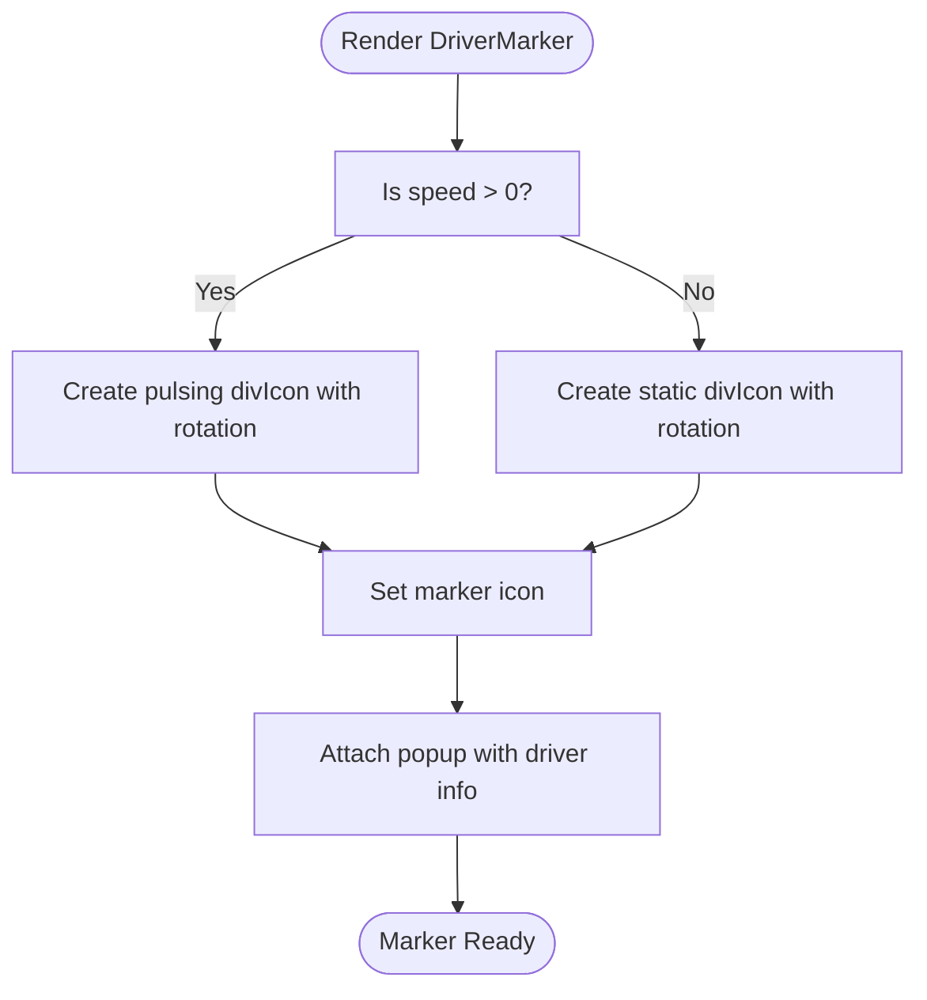

**Diagram sources**
- [DriverMarker.tsx](file://src/components/maps/DriverMarker.tsx)

**Section sources**
- [DriverMarker.tsx](file://src/components/maps/DriverMarker.tsx)

#### RoutePolyline
- Purpose: Draws navigation routes on the map with optional speed-based coloring and dashed styling.
- Implementation highlights:
  - Converts array of coordinate objects into leaflet LatLng arrays.
  - Supports two modes:
    - Basic polyline with configurable color, weight, opacity.
    - Speed-coded polyline that segments the route by speed thresholds and assigns colors accordingly.
- Data binding and props:
  - Accepts positions array and optional styling parameters.
- Real-time updates:
  - Re-renders when positions change; supports incremental updates by passing new coordinate arrays.
- Backend integration:
  - Route coordinates are provided by routing/delivery services; component renders the geometry.

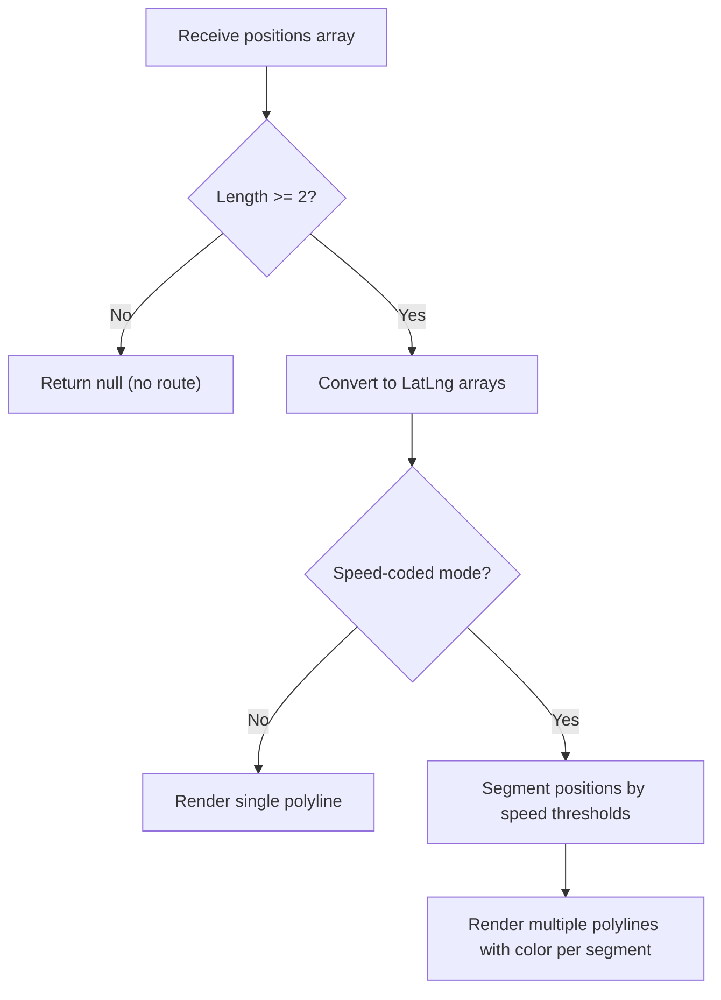

**Diagram sources**
- [RoutePolyline.tsx](file://src/components/maps/RoutePolyline.tsx)

**Section sources**
- [RoutePolyline.tsx](file://src/components/maps/RoutePolyline.tsx)

### Payment Components

#### PaymentMethodSelector
- Purpose: Allows users to select a payment method with visual feedback and selection state.
- Implementation highlights:
  - Defines a static list of payment methods with icons, descriptions, and popularity indicator.
  - Uses a card-based layout with hover and selection states.
- Data binding and props:
  - Accepts selected method ID, selection handler, and amount for display.
- Real-time updates:
  - Selection state updates immediately upon click; parent component handles validation and submission.
- Backend integration:
  - Integrates with payment simulation services for method-specific flows.

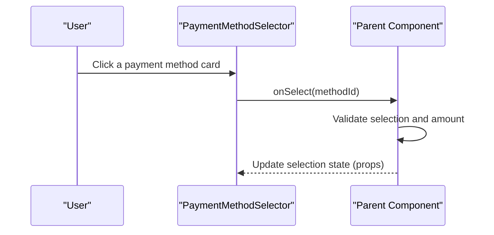

**Diagram sources**
- [PaymentMethodSelector.tsx](file://src/components/payment/PaymentMethodSelector.tsx)

**Section sources**
- [PaymentMethodSelector.tsx](file://src/components/payment/PaymentMethodSelector.tsx)

#### SimulatedCardForm
- Purpose: Provides a formatted, simulated credit card input form with validation and submission.
- Implementation highlights:
  - Formats card number, expiry date, and CVV inputs in real time.
  - Enforces input constraints (length, numeric) and uppercases cardholder name.
  - Includes a prominent simulation notice for testing.
- Data binding and props:
  - Accepts onSubmit callback, amount, and loading state.
- Real-time updates:
  - Controlled inputs update state locally; submission triggers external handler.
- Backend integration:
  - Submits card data to payment simulation services for processing.

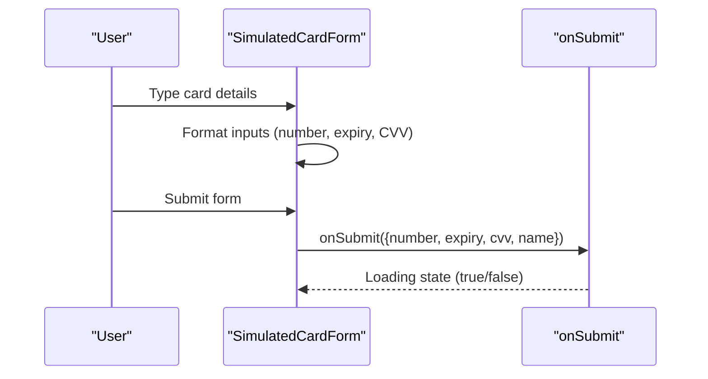

**Diagram sources**
- [SimulatedCardForm.tsx](file://src/components/payment/SimulatedCardForm.tsx)

**Section sources**
- [SimulatedCardForm.tsx](file://src/components/payment/SimulatedCardForm.tsx)

### Progress Tracking Components

#### WeeklyMetricsForm
- Purpose: Collects weekly metrics inputs with structured data binding and submission handling.
- Implementation highlights:
  - Uses controlled inputs to capture metric values.
  - Validates and formats inputs before submission.
- Data binding and props:
  - Accepts submit handler and initial metric values.
- Real-time updates:
  - Updates local state on input changes; parent decides when to persist.
- Backend integration:
  - Submits metrics to progress tracking services for storage and analytics.

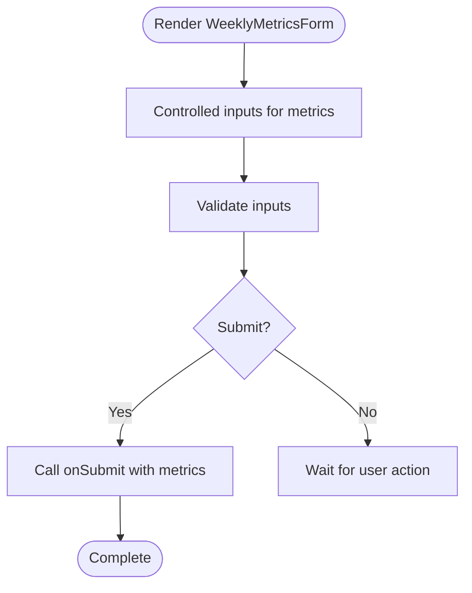

**Diagram sources**
- [WeeklyMetricsForm.tsx](file://src/components/progress/WeeklyMetricsForm.tsx)

**Section sources**
- [WeeklyMetricsForm.tsx](file://src/components/progress/WeeklyMetricsForm.tsx)

#### ProgressRings
- Purpose: Visualizes progress using ring-based components for goals and milestones.
- Implementation highlights:
  - Renders circular progress indicators with configurable colors and thresholds.
- Data binding and props:
  - Accepts progress percentage and labels.
- Real-time updates:
  - Re-renders when progress values change; animations reflect transitions.
- Backend integration:
  - Progress values are derived from aggregated metrics stored in progress tracking services.

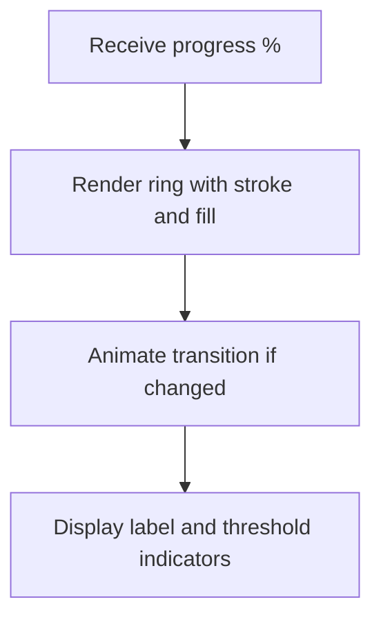

**Diagram sources**
- [ProgressRings.tsx](file://src/components/progress/ProgressRings.tsx)

**Section sources**
- [ProgressRings.tsx](file://src/components/progress/ProgressRings.tsx)

### Wallet Components

#### WalletBalance
- Purpose: Displays current wallet balance and related actions (e.g., top-up, transfer).
- Implementation highlights:
  - Shows balance prominently with currency formatting.
  - Integrates with wallet service hooks for real-time updates.
- Data binding and props:
  - Accepts balance value and action handlers.
- Real-time updates:
  - Subscribes to wallet service updates; reflects balance changes instantly.
- Backend integration:
  - Fetches and updates balance via wallet service APIs.

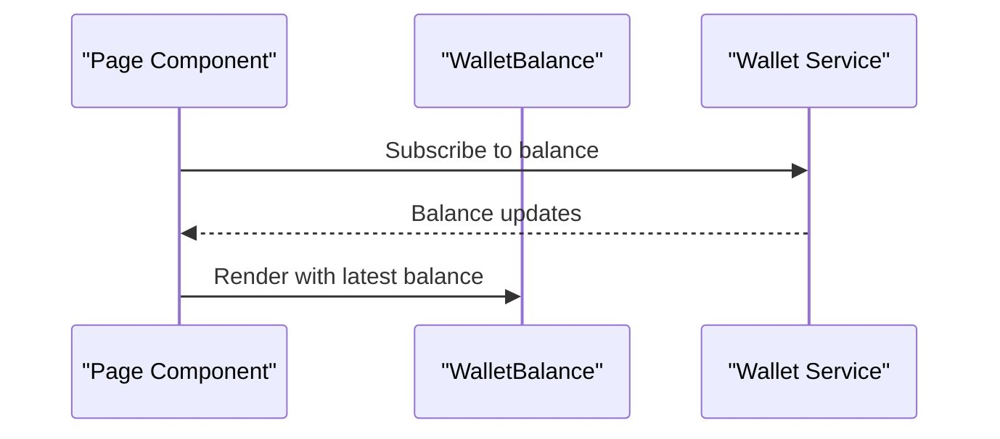

**Diagram sources**
- [WalletBalance.tsx](file://src/components/wallet/WalletBalance.tsx)

**Section sources**
- [WalletBalance.tsx](file://src/components/wallet/WalletBalance.tsx)

#### TransactionHistory
- Purpose: Lists recent wallet transactions with filtering and pagination.
- Implementation highlights:
  - Displays transaction rows with status, amount, and timestamps.
  - Supports filtering by type and pagination for large histories.
- Data binding and props:
  - Accepts transactions array, filters, and pagination controls.
- Real-time updates:
  - Refreshes when new transactions arrive; maintains scroll position.
- Backend integration:
  - Pulls transaction records from wallet service APIs.

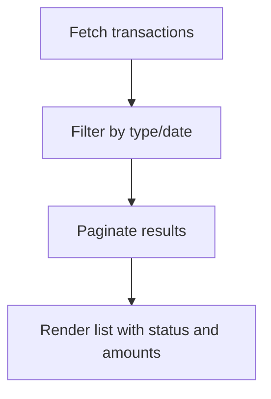

**Diagram sources**
- [TransactionHistory.tsx](file://src/components/wallet/TransactionHistory.tsx)

**Section sources**
- [TransactionHistory.tsx](file://src/components/wallet/TransactionHistory.tsx)

### Subscription Management Components

#### SubscriptionManagement
- Purpose: Manages subscription lifecycle actions such as renewal, cancellation, and plan upgrades.
- Implementation highlights:
  - Provides action buttons and confirmation dialogs for sensitive operations.
  - Integrates with subscription service hooks for state synchronization.
- Data binding and props:
  - Accepts subscription state and action handlers.
- Real-time updates:
  - Subscribes to subscription service updates; reflects changes in status and renewal dates.
- Backend integration:
  - Calls subscription service APIs for renewals, cancellations, and plan changes.

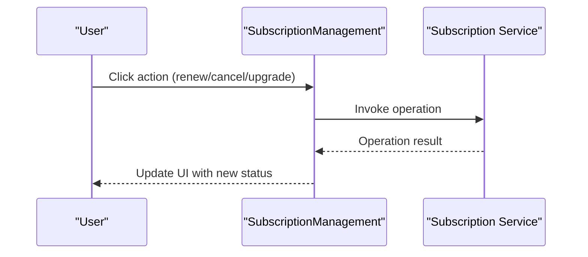

**Diagram sources**
- [SubscriptionManagement.tsx](file://src/components/subscription/SubscriptionManagement.tsx)

**Section sources**
- [SubscriptionManagement.tsx](file://src/components/subscription/SubscriptionManagement.tsx)

## Dependency Analysis
The specialized components rely on shared UI primitives and service hooks. The following diagram outlines typical dependencies among components and services.

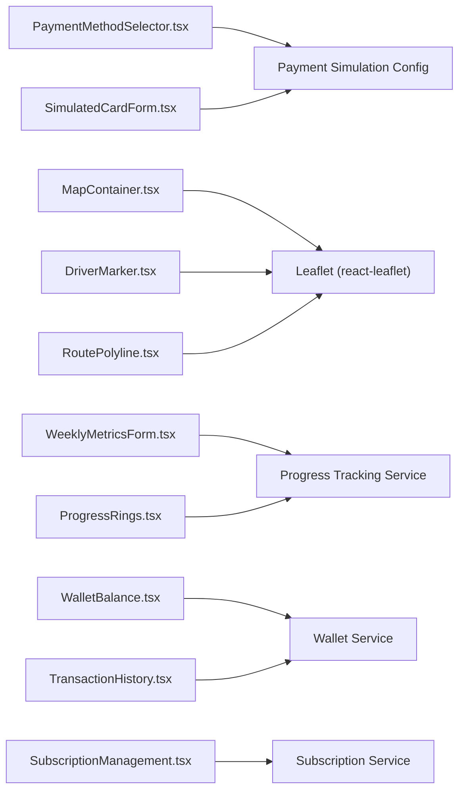

**Diagram sources**
- [PaymentMethodSelector.tsx](file://src/components/payment/PaymentMethodSelector.tsx)
- [SimulatedCardForm.tsx](file://src/components/payment/SimulatedCardForm.tsx)
- [MapContainer.tsx](file://src/components/maps/MapContainer.tsx)
- [DriverMarker.tsx](file://src/components/maps/DriverMarker.tsx)
- [RoutePolyline.tsx](file://src/components/maps/RoutePolyline.tsx)
- [WeeklyMetricsForm.tsx](file://src/components/progress/WeeklyMetricsForm.tsx)
- [ProgressRings.tsx](file://src/components/progress/ProgressRings.tsx)
- [WalletBalance.tsx](file://src/components/wallet/WalletBalance.tsx)
- [TransactionHistory.tsx](file://src/components/wallet/TransactionHistory.tsx)
- [SubscriptionManagement.tsx](file://src/components/subscription/SubscriptionManagement.tsx)

**Section sources**
- [PaymentMethodSelector.tsx](file://src/components/payment/PaymentMethodSelector.tsx)
- [SimulatedCardForm.tsx](file://src/components/payment/SimulatedCardForm.tsx)
- [MapContainer.tsx](file://src/components/maps/MapContainer.tsx)
- [DriverMarker.tsx](file://src/components/maps/DriverMarker.tsx)
- [RoutePolyline.tsx](file://src/components/maps/RoutePolyline.tsx)
- [WeeklyMetricsForm.tsx](file://src/components/progress/WeeklyMetricsForm.tsx)
- [ProgressRings.tsx](file://src/components/progress/ProgressRings.tsx)
- [WalletBalance.tsx](file://src/components/wallet/WalletBalance.tsx)
- [TransactionHistory.tsx](file://src/components/wallet/TransactionHistory.tsx)
- [SubscriptionManagement.tsx](file://src/components/subscription/SubscriptionManagement.tsx)

## Performance Considerations
- Maps
  - Minimize re-renders by passing stable coordinate arrays and avoiding unnecessary prop churn.
  - Use the updater component for center changes instead of remounting the entire map.
- Payments
  - Debounce input formatting to reduce re-renders during rapid typing.
  - Disable submit button while loading to prevent duplicate submissions.
- Progress Tracking
  - Batch updates when collecting multiple metrics to reduce service calls.
  - Use virtualized lists for long transaction histories.
- Wallet
  - Paginate transaction history and cache recent balances to reduce network requests.
- Subscription Management
  - Debounce frequent actions (e.g., multiple clicks) and show loading states.

[No sources needed since this section provides general guidance]

## Troubleshooting Guide
- Maps
  - If the map fails to initialize or throws “already initialized,” ensure the container uses a keyed mount and the updater component is present.
  - Verify that coordinate values are valid and in the expected order.
- Payments
  - If formatting behaves unexpectedly, confirm input masks and length limits are applied consistently.
  - Ensure the submit handler receives a complete and validated payload.
- Progress Tracking
  - If metrics do not update, verify the submit handler is invoked and the service response is processed.
- Wallet
  - If balance does not refresh, confirm the subscription to wallet updates is active and network requests succeed.
- Subscription Management
  - If actions fail, check for proper error handling and user confirmation flows.

**Section sources**
- [MapContainer.tsx](file://src/components/maps/MapContainer.tsx)
- [SimulatedCardForm.tsx](file://src/components/payment/SimulatedCardForm.tsx)
- [WalletBalance.tsx](file://src/components/wallet/WalletBalance.tsx)
- [SubscriptionManagement.tsx](file://src/components/subscription/SubscriptionManagement.tsx)

## Conclusion
These specialized components provide cohesive, reusable building blocks for maps, payments, progress tracking, wallet, and subscription management. They emphasize controlled data binding, efficient rendering, and clear integration points with backend services. By following the documented patterns and troubleshooting tips, teams can extend functionality, maintain performance, and deliver reliable user experiences across features.