# UI Primitives

<cite>
**Referenced Files in This Document**
- [tailwind.config.ts](file://tailwind.config.ts)
- [components.json](file://components.json)
- [accordion.tsx](file://src/components/ui/accordion.tsx)
- [alert-dialog.tsx](file://src/components/ui/alert-dialog.tsx)
- [avatar.tsx](file://src/components/ui/avatar.tsx)
- [badge.tsx](file://src/components/ui/badge.tsx)
- [button.tsx](file://src/components/ui/button.tsx)
- [card.tsx](file://src/components/ui/card.tsx)
- [checkbox.tsx](file://src/components/ui/checkbox.tsx)
- [collapsible.tsx](file://src/components/ui/collapsible.tsx)
- [dialog.tsx](file://src/components/ui/dialog.tsx)
- [form.tsx](file://src/components/ui/form.tsx)
- [input.tsx](file://src/components/ui/input.tsx)
- [label.tsx](file://src/components/ui/label.tsx)
- [navigation-menu.tsx](file://src/components/ui/navigation-menu.tsx)
- [popover.tsx](file://src/components/ui/popover.tsx)
- [radio-group.tsx](file://src/components/ui/radio-group.tsx)
- [select.tsx](file://src/components/ui/select.tsx)
- [separator.tsx](file://src/components/ui/separator.tsx)
- [sheet.tsx](file://src/components/ui/sheet.tsx)
- [skeleton.tsx](file://src/components/ui/skeleton.tsx)
- [slider.tsx](file://src/components/ui/slider.tsx)
- [switch.tsx](file://src/components/ui/switch.tsx)
- [table.tsx](file://src/components/ui/table.tsx)
- [tabs.tsx](file://src/components/ui/tabs.tsx)
- [textarea.tsx](file://src/components/ui/textarea.tsx)
- [toast.tsx](file://src/components/ui/toast.tsx)
- [tooltip.tsx](file://src/components/ui/tooltip.tsx)
- [utils.ts](file://src/lib/utils.ts)
</cite>

## Table of Contents
1. [Introduction](#introduction)
2. [Project Structure](#project-structure)
3. [Core Components](#core-components)
4. [Architecture Overview](#architecture-overview)
5. [Detailed Component Analysis](#detailed-component-analysis)
6. [Dependency Analysis](#dependency-analysis)
7. [Performance Considerations](#performance-considerations)
8. [Troubleshooting Guide](#troubleshooting-guide)
9. [Conclusion](#conclusion)

## Introduction
This document describes the foundational UI primitive components built with Radix UI and Tailwind CSS across the Nutrio codebase. It covers base components including buttons, inputs, forms, dialogs, modals, navigation elements, and layout components. The guide details component props, styling variants, accessibility features, and composition patterns, along with usage examples, customization options, and integration guidelines. It also explains the design system implementation and how these primitives support consistent UI development across all portals.

## Project Structure
The UI primitives are organized under a dedicated UI directory and integrated via a shared design system configuration. The Tailwind configuration defines color tokens, shadows, radii, and animations, while the components configuration maps aliases for consistent imports and styling.

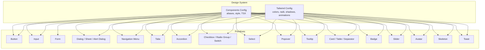

**Diagram sources**
- [tailwind.config.ts](file://tailwind.config.ts)
- [components.json](file://components.json)

**Section sources**
- [tailwind.config.ts](file://tailwind.config.ts)
- [components.json](file://components.json)

## Core Components
This section summarizes the base primitives and their roles in the design system.

- Buttons: Variants, sizes, and states for actions and navigation.
- Inputs: Text inputs, textareas, selects, and form controls with consistent styling and validation feedback.
- Forms: Field groups, labels, and validation helpers.
- Dialogs/Sheets/Alerts: Modal overlays with accessible focus management and keyboard interactions.
- Navigation: Menu systems and tabs for hierarchical navigation.
- Layout: Cards, tables, separators, badges, skeletons for structured content.
- Controls: Checkboxes, radio groups, switches, sliders with indeterminate and controlled states.
- Popovers/Tooltips: Contextual overlays with positioning and triggers.
- Media: Avatars with fallbacks and loading states.
- Feedback: Toasts for notifications and status updates.

**Section sources**
- [button.tsx](file://src/components/ui/button.tsx)
- [input.tsx](file://src/components/ui/input.tsx)
- [textarea.tsx](file://src/components/ui/textarea.tsx)
- [select.tsx](file://src/components/ui/select.tsx)
- [form.tsx](file://src/components/ui/form.tsx)
- [dialog.tsx](file://src/components/ui/dialog.tsx)
- [sheet.tsx](file://src/components/ui/sheet.tsx)
- [alert-dialog.tsx](file://src/components/ui/alert-dialog.tsx)
- [navigation-menu.tsx](file://src/components/ui/navigation-menu.tsx)
- [tabs.tsx](file://src/components/ui/tabs.tsx)
- [accordion.tsx](file://src/components/ui/accordion.tsx)
- [checkbox.tsx](file://src/components/ui/checkbox.tsx)
- [radio-group.tsx](file://src/components/ui/radio-group.tsx)
- [switch.tsx](file://src/components/ui/switch.tsx)
- [slider.tsx](file://src/components/ui/slider.tsx)
- [popover.tsx](file://src/components/ui/popover.tsx)
- [tooltip.tsx](file://src/components/ui/tooltip.tsx)
- [card.tsx](file://src/components/ui/card.tsx)
- [table.tsx](file://src/components/ui/table.tsx)
- [separator.tsx](file://src/components/ui/separator.tsx)
- [badge.tsx](file://src/components/ui/badge.tsx)
- [avatar.tsx](file://src/components/ui/avatar.tsx)
- [skeleton.tsx](file://src/components/ui/skeleton.tsx)
- [toast.tsx](file://src/components/ui/toast.tsx)

## Architecture Overview
The primitives are thin wrappers around Radix UI primitives, styled with Tailwind utility classes and composed with a shared utility library. They expose consistent props, variants, and accessibility attributes while delegating behavior to Radix UI.

```mermaid
graph TB
subgraph "Radix UI"
RACC["Accordion"]
RCHECK["Checkbox"]
RDLG["Dialog"]
RSHEET["Sheet"]
RALERT["Alert Dialog"]
RNVM["NavigationMenu"]
RTABS["Tabs"]
RPOPOVER["Popover"]
RTOOLTIP["Tooltip"]
RFORM["Form"]
RSELECT["Select"]
RINPUT["Input"]
RTEXTAREA["Textarea"]
end
subgraph "Tailwind CSS"
TW["Theme Tokens<br/>colors, radii, shadows, animations"]
CN["Utility Classes"]
end
subgraph "Utils"
UTIL["cn() / merge classes"]
end
subgraph "Primitives"
PBTN["Button"]
PACC["Accordion"]
PCHK["Checkbox"]
PDLG["Dialog / Sheet / Alert Dialog"]
PNVM["Navigation Menu"]
PTABS["Tabs"]
PPOPOVER["Popover"]
PTOOLTIP["Tooltip"]
PFORM["Form"]
PSEL["Select"]
PIN["Input"]
PTA["Textarea"]
end
RACC --> PACC
RCHECK --> PCHK
RDLG --> PDLG
RSHEET --> PDLG
RALERT --> PDLG
RNVM --> PNVM
RTABS --> PTABS
RPOPOVER --> PPOPOVER
RTOOLTIP --> PTOOLTIP
RFORM --> PFORM
RSELECT --> PSEL
RINPUT --> PIN
RTEXTAREA --> PTA
TW --> PBTN
TW --> PACC
TW --> PCHK
TW --> PDLG
TW --> PNVM
TW --> PTABS
TW --> PPOPOVER
TW --> PTOOLTIP
TW --> PFORM
TW --> PSEL
TW --> PIN
TW --> PTA
CN --> PBTN
CN --> PACC
CN --> PCHK
CN --> PDLG
CN --> PNVM
CN --> PTABS
CN --> PPOPOVER
CN --> PTOOLTIP
CN --> PFORM
CN --> PSEL
CN --> PIN
CN --> PTA
UTIL --> PBTN
UTIL --> PACC
UTIL --> PCHK
UTIL --> PDLG
UTIL --> PNVM
UTIL --> PTABS
UTIL --> PPOPOVER
UTIL --> PTOOLTIP
UTIL --> PFORM
UTIL --> PSEL
UTIL --> PIN
UTIL --> PTA
```

**Diagram sources**
- [button.tsx](file://src/components/ui/button.tsx)
- [accordion.tsx](file://src/components/ui/accordion.tsx)
- [checkbox.tsx](file://src/components/ui/checkbox.tsx)
- [dialog.tsx](file://src/components/ui/dialog.tsx)
- [sheet.tsx](file://src/components/ui/sheet.tsx)
- [alert-dialog.tsx](file://src/components/ui/alert-dialog.tsx)
- [navigation-menu.tsx](file://src/components/ui/navigation-menu.tsx)
- [tabs.tsx](file://src/components/ui/tabs.tsx)
- [popover.tsx](file://src/components/ui/popover.tsx)
- [tooltip.tsx](file://src/components/ui/tooltip.tsx)
- [form.tsx](file://src/components/ui/form.tsx)
- [select.tsx](file://src/components/ui/select.tsx)
- [input.tsx](file://src/components/ui/input.tsx)
- [textarea.tsx](file://src/components/ui/textarea.tsx)
- [utils.ts](file://src/lib/utils.ts)

## Detailed Component Analysis

### Button
- Purpose: Primary action surfaces with consistent spacing, typography, and focus states.
- Props: variant, size, asChild, className, disabled, loading, and standard button attributes.
- Variants: default, destructive, outline, secondary, ghost, link; plus soft and subtle derived from theme.
- Sizes: sm, md, lg, icon.
- Accessibility: Inherits native button semantics; supports loading state and disabled state.
- Composition: Uses cn() for merging classes and integrates with icons.

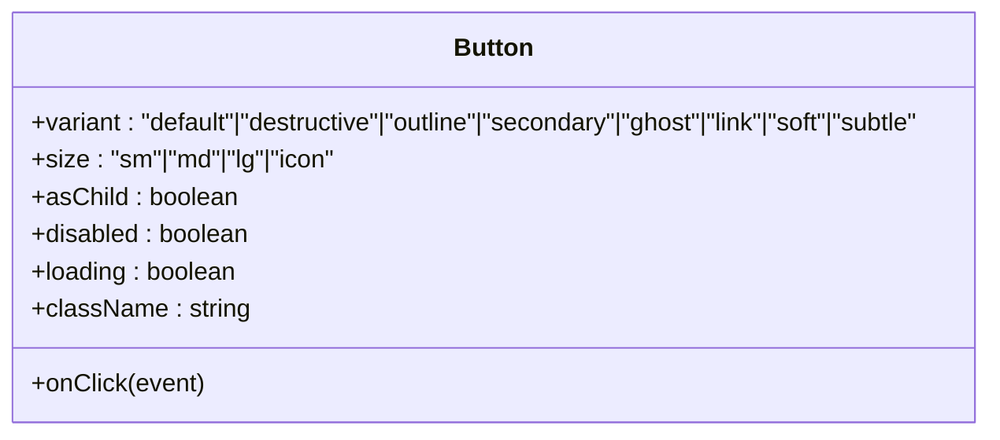

**Diagram sources**
- [button.tsx](file://src/components/ui/button.tsx)

**Section sources**
- [button.tsx](file://src/components/ui/button.tsx)

### Input and Textarea
- Purpose: Text entry fields with consistent borders, focus states, and validation feedback.
- Props: className, disabled, error, required, size, and standard input/textarea attributes.
- Variants: default with theme-aware borders and backgrounds.
- Accessibility: Proper labeling via associated label components; aria-invalid for validation.

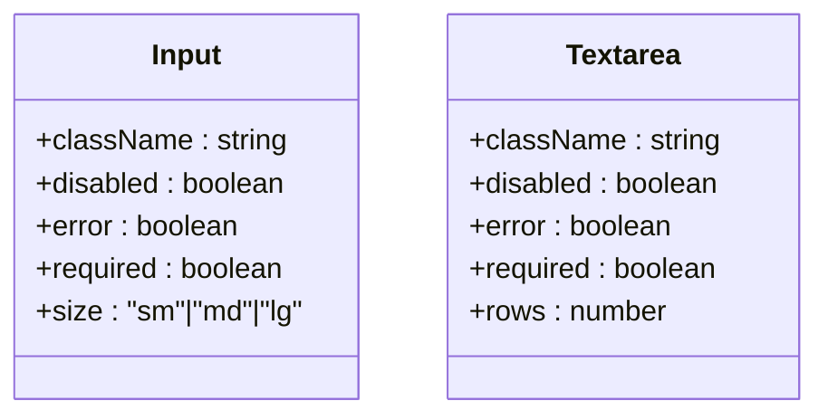

**Diagram sources**
- [input.tsx](file://src/components/ui/input.tsx)
- [textarea.tsx](file://src/components/ui/textarea.tsx)

**Section sources**
- [input.tsx](file://src/components/ui/input.tsx)
- [textarea.tsx](file://src/components/ui/textarea.tsx)

### Form and Validation
- Purpose: Structured form layouts with field groups, labels, and validation helpers.
- Components: Form, FormControl, FormField, FormItem, FormLabel, FormMessage, FormDescription.
- Behavior: Integrates with validation libraries; exposes error states and messages.

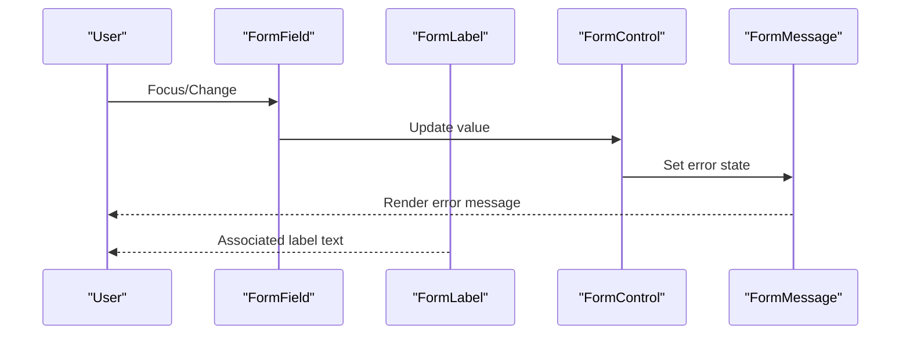

**Diagram sources**
- [form.tsx](file://src/components/ui/form.tsx)

**Section sources**
- [form.tsx](file://src/components/ui/form.tsx)

### Dialogs, Sheets, and Alert Dialogs
- Dialog: Generic overlay with portal, overlay, and content; supports focus traps and escape key.
- Sheet: Slide-in panel from side with overlay; useful for mobile-friendly modals.
- Alert Dialog: Accessible alert with auto-focus on cancel and prevention of outside interactions.
- Props: open, onOpenChange, defaultOpen, modal, and content-specific attributes.
- Accessibility: Proper roles, aria-describedby, focus management, and keyboard handling.

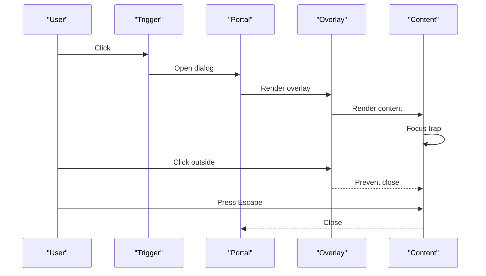

**Diagram sources**
- [dialog.tsx](file://src/components/ui/dialog.tsx)
- [sheet.tsx](file://src/components/ui/sheet.tsx)
- [alert-dialog.tsx](file://src/components/ui/alert-dialog.tsx)

**Section sources**
- [dialog.tsx](file://src/components/ui/dialog.tsx)
- [sheet.tsx](file://src/components/ui/sheet.tsx)
- [alert-dialog.tsx](file://src/components/ui/alert-dialog.tsx)

### Navigation Menu
- Purpose: Hierarchical navigation with nested lists and keyboard navigation.
- Props: value, onValueChange, orientation, dir, modal, and menu-specific attributes.
- Accessibility: Keyboard navigation, ARIA roles, and focus management.

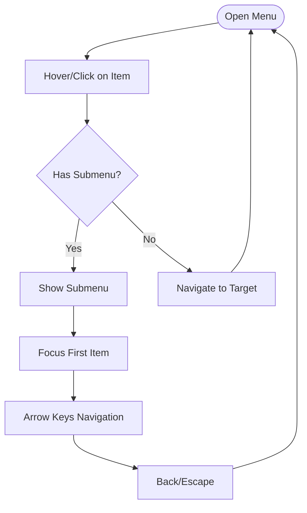

**Diagram sources**
- [navigation-menu.tsx](file://src/components/ui/navigation-menu.tsx)

**Section sources**
- [navigation-menu.tsx](file://src/components/ui/navigation-menu.tsx)

### Tabs
- Purpose: Switch between panels of related content.
- Props: value, onValueChange, orientation, dir, and tab-specific attributes.
- Accessibility: Proper ARIA attributes and keyboard navigation.

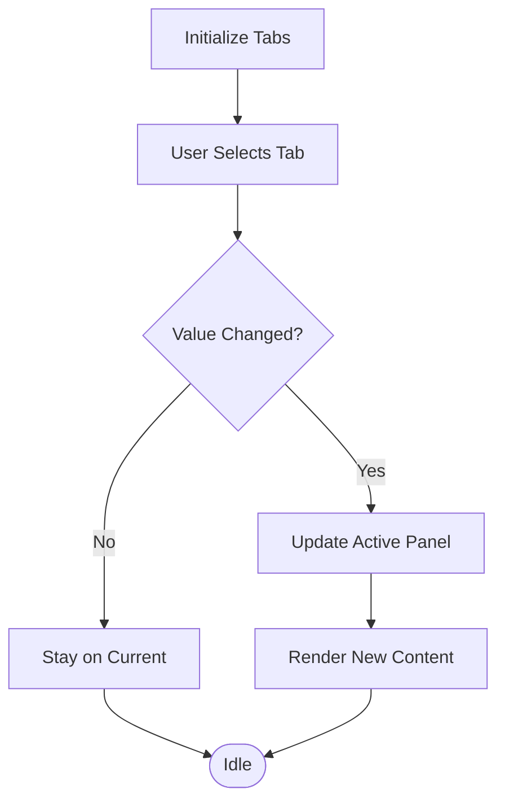

**Diagram sources**
- [tabs.tsx](file://src/components/ui/tabs.tsx)

**Section sources**
- [tabs.tsx](file://src/components/ui/tabs.tsx)

### Accordion
- Purpose: Stackable sections with expand/collapse behavior.
- Props: type ("single" | "multiple"), value, onValueChange, collapsible, and item-specific attributes.
- Accessibility: Keyboard navigation, ARIA roles, and focus management.

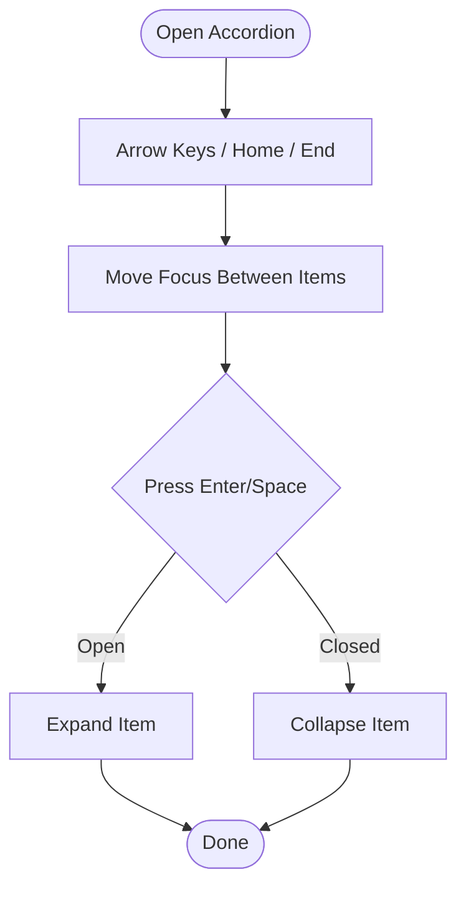

**Diagram sources**
- [accordion.tsx](file://src/components/ui/accordion.tsx)

**Section sources**
- [accordion.tsx](file://src/components/ui/accordion.tsx)

### Checkbox, Radio Group, Switch, Slider
- Checkbox: Controlled/indeterminate states with bubble input for form compatibility.
- Radio Group: Exclusive selection with controlled state.
- Switch: Toggle control with accessible state.
- Slider: Range input with value display and keyboard support.
- Accessibility: Proper ARIA attributes and keyboard handling.

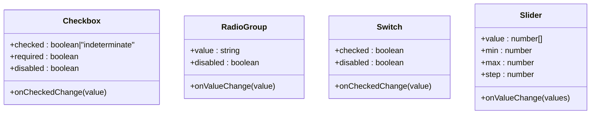

**Diagram sources**
- [checkbox.tsx](file://src/components/ui/checkbox.tsx)
- [radio-group.tsx](file://src/components/ui/radio-group.tsx)
- [switch.tsx](file://src/components/ui/switch.tsx)
- [slider.tsx](file://src/components/ui/slider.tsx)

**Section sources**
- [checkbox.tsx](file://src/components/ui/checkbox.tsx)
- [radio-group.tsx](file://src/components/ui/radio-group.tsx)
- [switch.tsx](file://src/components/ui/switch.tsx)
- [slider.tsx](file://src/components/ui/slider.tsx)

### Select
- Purpose: Dropdown selection with searchable options and custom triggers.
- Props: value, onValueChange, disabled, required, and option-specific attributes.
- Accessibility: Keyboard navigation, ARIA attributes, and focus management.

```mermaid
sequenceDiagram
participant User as "User"
participant Trigger as "SelectTrigger"
participant Content as "SelectContent"
participant Option as "SelectItem"
User->>Trigger : Click/Open
Trigger->>Content : Render dropdown
User->>Option : Select item
Option->>Trigger : Update value
Trigger-->>User : Show selected value
```

**Diagram sources**
- [select.tsx](file://src/components/ui/select.tsx)

**Section sources**
- [select.tsx](file://src/components/ui/select.tsx)

### Popover and Tooltip
- Popover: Contextual overlay triggered by click or hover; supports focus trapping.
- Tooltip: Lightweight text overlay with placement and delay options.
- Props: open, onOpenChange, align, side, sideOffset, avoidCollisions, and trigger attributes.
- Accessibility: Proper ARIA attributes and focus management.

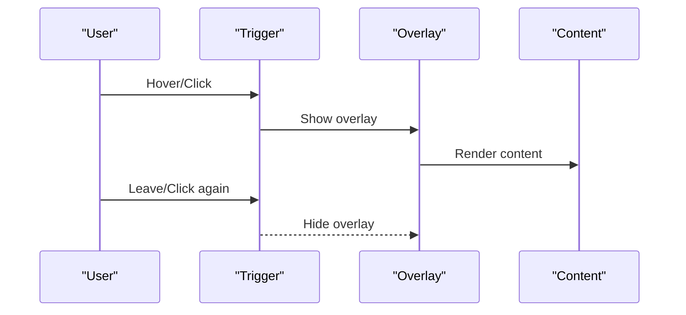

**Diagram sources**
- [popover.tsx](file://src/components/ui/popover.tsx)
- [tooltip.tsx](file://src/components/ui/tooltip.tsx)

**Section sources**
- [popover.tsx](file://src/components/ui/popover.tsx)
- [tooltip.tsx](file://src/components/ui/tooltip.tsx)

### Layout Components
- Card: Container with background, border, and shadow; includes header, title, description, and content.
- Table: Structured data with head, body, row, cell, and caption components.
- Separator: Horizontal or vertical divider with optional decorative role.
- Badge: Small label with semantic variants (default, secondary, destructive, outline, soft).
- Skeleton: Loading placeholders with animated shimmer effect.
- Toast: Notification component with actions and auto-dismiss.

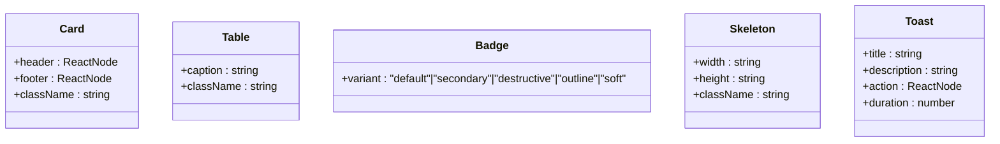

**Diagram sources**
- [card.tsx](file://src/components/ui/card.tsx)
- [table.tsx](file://src/components/ui/table.tsx)
- [separator.tsx](file://src/components/ui/separator.tsx)
- [badge.tsx](file://src/components/ui/badge.tsx)
- [skeleton.tsx](file://src/components/ui/skeleton.tsx)
- [toast.tsx](file://src/components/ui/toast.tsx)

**Section sources**
- [card.tsx](file://src/components/ui/card.tsx)
- [table.tsx](file://src/components/ui/table.tsx)
- [separator.tsx](file://src/components/ui/separator.tsx)
- [badge.tsx](file://src/components/ui/badge.tsx)
- [skeleton.tsx](file://src/components/ui/skeleton.tsx)
- [toast.tsx](file://src/components/ui/toast.tsx)

### Media: Avatar
- Purpose: User avatars with fallbacks and loading states.
- Props: src, onLoadingStatusChange, delayMs, and standard image attributes.
- Behavior: Tracks loading state and renders fallback when image is not loaded.

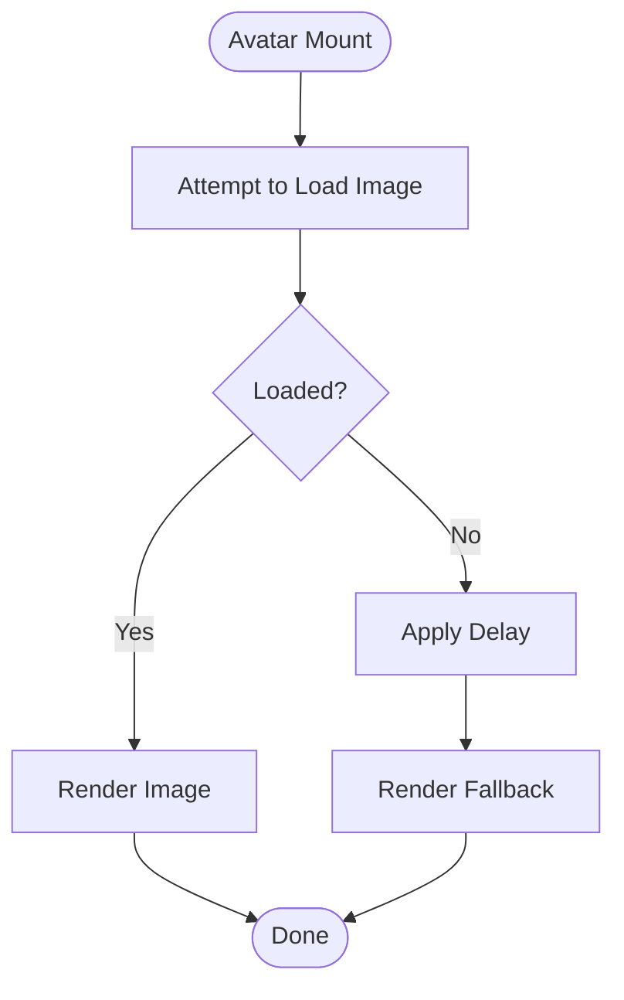

**Diagram sources**
- [avatar.tsx](file://src/components/ui/avatar.tsx)

**Section sources**
- [avatar.tsx](file://src/components/ui/avatar.tsx)

## Dependency Analysis
The primitives depend on Radix UI for behavior and accessibility, Tailwind for styling, and a shared utility library for class merging. The design system configuration centralizes aliases and theme tokens.

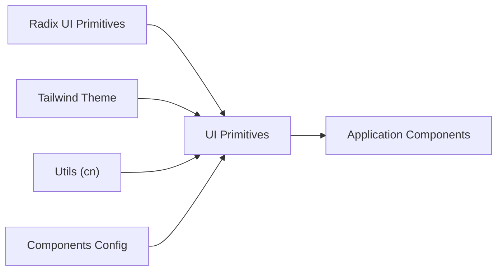

**Diagram sources**
- [utils.ts](file://src/lib/utils.ts)
- [components.json](file://components.json)
- [tailwind.config.ts](file://tailwind.config.ts)

**Section sources**
- [utils.ts](file://src/lib/utils.ts)
- [components.json](file://components.json)
- [tailwind.config.ts](file://tailwind.config.ts)

## Performance Considerations
- Prefer shallow props and minimal re-renders in composite components.
- Use controlled components for predictable state updates.
- Avoid heavy computations in render; memoize derived values.
- Leverage CSS transitions and animations sparingly; use Tailwind’s prebuilt animations where possible.
- Keep overlay content lightweight to minimize paint and layout thrashing.

## Troubleshooting Guide
- Missing aria-describedby in Alert Dialog: Ensure a description element is present or pass aria-describedby to the content.
- Checkbox form submission: Verify bubble input is rendered when inside a form; otherwise, events may not propagate.
- Dialog focus trap: Confirm portal rendering and overlay presence; ensure focus is managed after opening.
- Select options not updating: Check controlled value and onValueChange handler; ensure option keys match expected values.
- Navigation menu keyboard navigation: Verify orientation and direction props; ensure items are focusable.

**Section sources**
- [alert-dialog.tsx](file://src/components/ui/alert-dialog.tsx)
- [checkbox.tsx](file://src/components/ui/checkbox.tsx)
- [dialog.tsx](file://src/components/ui/dialog.tsx)
- [select.tsx](file://src/components/ui/select.tsx)
- [navigation-menu.tsx](file://src/components/ui/navigation-menu.tsx)

## Conclusion
The UI primitives provide a cohesive, accessible, and customizable foundation for building consistent interfaces across portals. By composing Radix UI behaviors with Tailwind styling and a shared utility layer, teams can maintain design system alignment while enabling rapid iteration and robust user experiences.