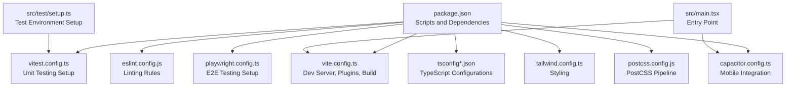
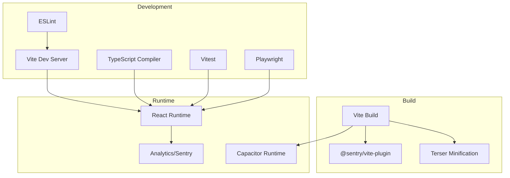
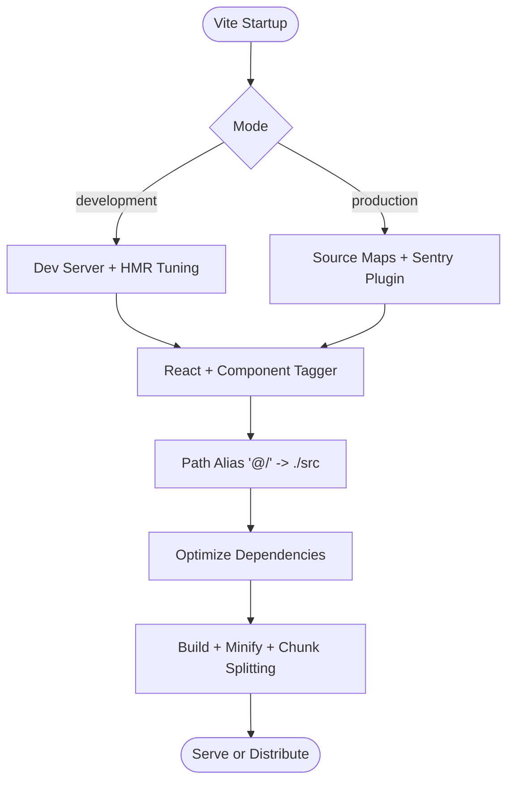
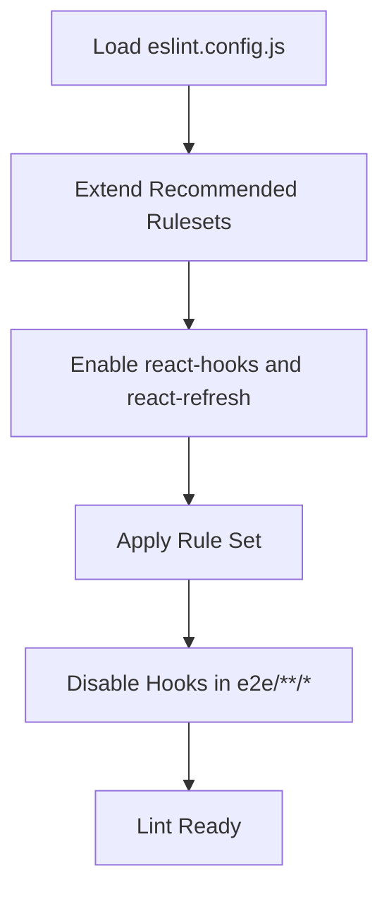
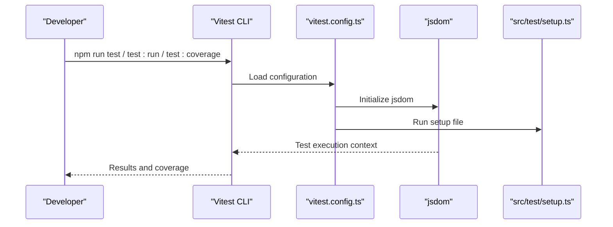
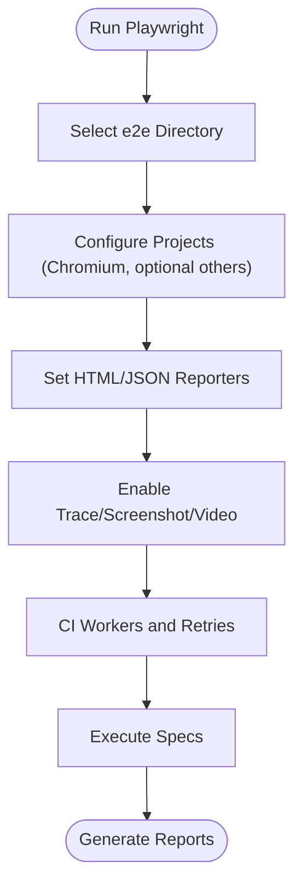
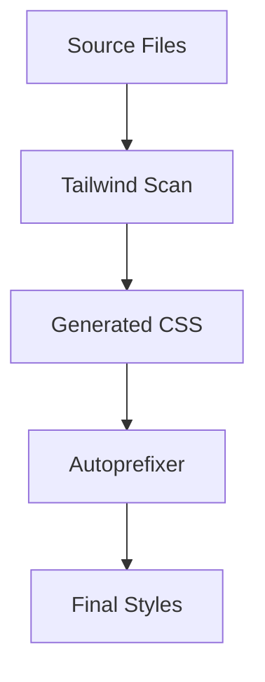
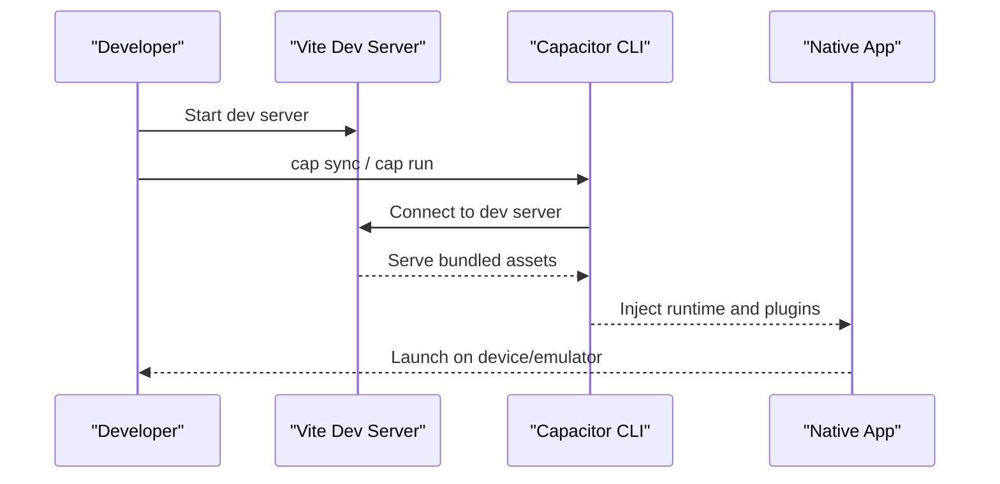
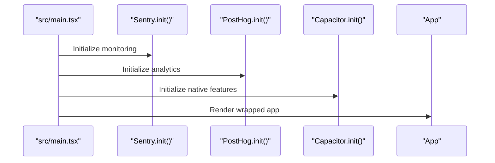
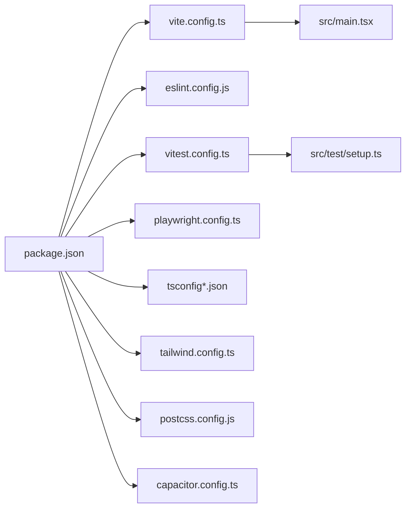

# Development Workflow

<cite>
**Referenced Files in This Document**
- [package.json](file://package.json)
- [vite.config.ts](file://vite.config.ts)
- [eslint.config.js](file://eslint.config.js)
- [vitest.config.ts](file://vitest.config.ts)
- [tsconfig.json](file://tsconfig.json)
- [tsconfig.app.json](file://tsconfig.app.json)
- [tsconfig.node.json](file://tsconfig.node.json)
- [capacitor.config.ts](file://capacitor.config.ts)
- [playwright.config.ts](file://playwright.config.ts)
- [src/main.tsx](file://src/main.tsx)
- [src/test/setup.ts](file://src/test/setup.ts)
- [postcss.config.js](file://postcss.config.js)
- [tailwind.config.ts](file://tailwind.config.ts)
- [vercel.json](file://vercel.json)
</cite>

## Table of Contents
1. [Introduction](#introduction)
2. [Project Structure](#project-structure)
3. [Core Components](#core-components)
4. [Architecture Overview](#architecture-overview)
5. [Detailed Component Analysis](#detailed-component-analysis)
6. [Dependency Analysis](#dependency-analysis)
7. [Performance Considerations](#performance-considerations)
8. [Troubleshooting Guide](#troubleshooting-guide)
9. [Conclusion](#conclusion)
10. [Appendices](#appendices)

## Introduction
This document describes the complete development workflow for the Nutrio frontend, focusing on build configuration with Vite, TypeScript setup, and ESLint configuration. It explains the development environment, hot reload capabilities, and debugging strategies. It also documents testing integration with Vitest and Playwright, component testing patterns, and development scripts. Code quality standards, linting rules, and formatting guidelines are covered alongside deployment preparation, environment variable management, and production optimization. Finally, it addresses integration with the mobile development workflow via Capacitor and cross-platform considerations.

## Project Structure
The frontend is organized around a modern React + TypeScript stack with Vite as the bundler and dev server. Key configuration files define build behavior, linting, testing, styling, and platform targets. The repository includes dedicated directories for source code, tests, e2e specs, assets, and platform-specific mobile configuration.



**Diagram sources**
- [package.json:1-159](file://package.json#L1-L159)
- [vite.config.ts:1-77](file://vite.config.ts#L1-L77)
- [eslint.config.js:1-34](file://eslint.config.js#L1-L34)
- [vitest.config.ts:1-28](file://vitest.config.ts#L1-L28)
- [playwright.config.ts:1-92](file://playwright.config.ts#L1-L92)
- [tsconfig.json:1-21](file://tsconfig.json#L1-L21)
- [tsconfig.app.json:1-34](file://tsconfig.app.json#L1-L34)
- [tsconfig.node.json:1-23](file://tsconfig.node.json#L1-L23)
- [tailwind.config.ts:1-128](file://tailwind.config.ts#L1-L128)
- [postcss.config.js:1-7](file://postcss.config.js#L1-L7)
- [capacitor.config.ts:1-45](file://capacitor.config.ts#L1-L45)
- [src/main.tsx:1-50](file://src/main.tsx#L1-L50)
- [src/test/setup.ts:1-70](file://src/test/setup.ts#L1-L70)

**Section sources**
- [package.json:1-159](file://package.json#L1-L159)
- [vite.config.ts:1-77](file://vite.config.ts#L1-L77)
- [tsconfig.json:1-21](file://tsconfig.json#L1-L21)
- [tsconfig.app.json:1-34](file://tsconfig.app.json#L1-L34)
- [tsconfig.node.json:1-23](file://tsconfig.node.json#L1-L23)
- [tailwind.config.ts:1-128](file://tailwind.config.ts#L1-L128)
- [postcss.config.js:1-7](file://postcss.config.js#L1-L7)
- [capacitor.config.ts:1-45](file://capacitor.config.ts#L1-L45)
- [src/main.tsx:1-50](file://src/main.tsx#L1-L50)
- [src/test/setup.ts:1-70](file://src/test/setup.ts#L1-L70)

## Core Components
- Build and Dev Server: Vite configuration defines dev server behavior, HMR tuning, plugin pipeline, path aliases, dependency optimization, and production build settings including chunk splitting and minification.
- TypeScript: Three configuration files manage strictness, module resolution, JSX, and path mapping for the app and node environments.
- Linting: ESLint configuration enforces TypeScript and React Hooks best practices, with environment-specific rule adjustments.
- Testing: Vitest config sets up jsdom environment, global flags, coverage, and aliases; Playwright config manages E2E tests, reporters, and device projects.
- Styling: Tailwind and PostCSS provide a utility-first design system with animations and theme extensions.
- Mobile: Capacitor configuration integrates native features, splash screen, push/local notifications, and allows navigation to external domains.

**Section sources**
- [vite.config.ts:1-77](file://vite.config.ts#L1-L77)
- [tsconfig.app.json:1-34](file://tsconfig.app.json#L1-L34)
- [tsconfig.node.json:1-23](file://tsconfig.node.json#L1-L23)
- [eslint.config.js:1-34](file://eslint.config.js#L1-L34)
- [vitest.config.ts:1-28](file://vitest.config.ts#L1-L28)
- [playwright.config.ts:1-92](file://playwright.config.ts#L1-L92)
- [tailwind.config.ts:1-128](file://tailwind.config.ts#L1-L128)
- [postcss.config.js:1-7](file://postcss.config.js#L1-L7)
- [capacitor.config.ts:1-45](file://capacitor.config.ts#L1-L45)

## Architecture Overview
The development workflow centers on Vite for fast iteration, with optional Sentry integration for source maps in production. TypeScript ensures strong typing across the app and node contexts. Testing spans unit tests (Vitest) and E2E tests (Playwright). Capacitor bridges the web app to native platforms with configurable plugins and splash screen behavior.



**Diagram sources**
- [vite.config.ts:1-77](file://vite.config.ts#L1-L77)
- [eslint.config.js:1-34](file://eslint.config.js#L1-L34)
- [vitest.config.ts:1-28](file://vitest.config.ts#L1-L28)
- [playwright.config.ts:1-92](file://playwright.config.ts#L1-L92)
- [capacitor.config.ts:1-45](file://capacitor.config.ts#L1-L45)
- [src/main.tsx:1-50](file://src/main.tsx#L1-L50)

## Detailed Component Analysis

### Vite Build and Development Environment
- Dev server configuration enables HMR with reduced overlay and extended timeout, watches relevant directories, and binds to IPv6 localhost for broader access.
- Plugins include React SWC for fast JSX transforms, a component tagger in development, and Sentry source map upload in production.
- Path aliasing simplifies imports using @/, and dependency optimization pre-bundles frequently used libraries.
- Production build targets modern browsers, emits source maps, minifies with Terser, drops console logs in production, and splits vendor bundles for caching.



**Diagram sources**
- [vite.config.ts:8-77](file://vite.config.ts#L8-L77)

**Section sources**
- [vite.config.ts:8-77](file://vite.config.ts#L8-L77)

### TypeScript Configuration
- Root tsconfig orchestrates app and node configurations and enforces strict compiler options including unused locals/parameters checks and consistent casing.
- App tsconfig targets ES2020, uses bundler module resolution, JSX transform, and strict mode for type safety.
- Node tsconfig targets ES2023, focuses on tooling and configuration files, and maintains strictness for maintainability.

```mermaid
classDiagram
class TsConfigRoot {
+files : []
+references : [{path}]
+compilerOptions.strict
+compilerOptions.noImplicitAny
+compilerOptions.strictNullChecks
+compilerOptions.noUnusedLocals
+compilerOptions.noUnusedParameters
+compilerOptions.forceConsistentCasingInFileNames
+compilerOptions.noImplicitReturns
+compilerOptions.noFallthroughCasesInSwitch
}
class TsConfigApp {
+compilerOptions.target : "ES2020"
+compilerOptions.module : "ESNext"
+compilerOptions.moduleResolution : "bundler"
+compilerOptions.jsx : "react-jsx"
+compilerOptions.strict : true
+paths["@/*"]
}
class TsConfigNode {
+compilerOptions.target : "ES2023"
+compilerOptions.module : "ESNext"
+compilerOptions.moduleResolution : "bundler"
+compilerOptions.strict : true
}
TsConfigRoot --> TsConfigApp : "references"
TsConfigRoot --> TsConfigNode : "references"
```

**Diagram sources**
- [tsconfig.json:1-21](file://tsconfig.json#L1-L21)
- [tsconfig.app.json:1-34](file://tsconfig.app.json#L1-L34)
- [tsconfig.node.json:1-23](file://tsconfig.node.json#L1-L23)

**Section sources**
- [tsconfig.json:1-21](file://tsconfig.json#L1-L21)
- [tsconfig.app.json:1-34](file://tsconfig.app.json#L1-L34)
- [tsconfig.node.json:1-23](file://tsconfig.node.json#L1-L23)

### ESLint Configuration
- Extends recommended TypeScript and ESLint configs, applies React Hooks and React Refresh plugins.
- Enforces React Hooks rules and restricts exporting non-components from pages.
- Disables React Hooks rules for E2E fixtures to accommodate non-React usage patterns.



**Diagram sources**
- [eslint.config.js:7-33](file://eslint.config.js#L7-L33)

**Section sources**
- [eslint.config.js:1-34](file://eslint.config.js#L1-L34)

### Vitest Unit Testing
- Global flags enable DOM APIs in tests; jsdom environment simulates browser behavior.
- Coverage configured with v8 provider and multiple reporters; excludes test infrastructure and type declaration files.
- Aliases align with application paths for imports inside tests.



**Diagram sources**
- [vitest.config.ts:4-27](file://vitest.config.ts#L4-L27)
- [src/test/setup.ts:1-70](file://src/test/setup.ts#L1-L70)

**Section sources**
- [vitest.config.ts:1-28](file://vitest.config.ts#L1-L28)
- [src/test/setup.ts:1-70](file://src/test/setup.ts#L1-L70)

### Playwright E2E Testing
- Centralized configuration for E2E tests under the e2e directory with HTML and JSON reporters.
- Uses trace, screenshot, and video collection for debugging; configurable retries and worker counts for CI.
- Projects include Chromium; mobile device presets are available for cross-browser and responsive testing.



**Diagram sources**
- [playwright.config.ts:13-92](file://playwright.config.ts#L13-L92)

**Section sources**
- [playwright.config.ts:1-92](file://playwright.config.ts#L1-L92)

### Styling with Tailwind and PostCSS
- Tailwind scans components and app directories for class usage and supports dark mode, animations, and theme extensions.
- PostCSS pipeline applies Tailwind directives and autoprefixing for vendor compatibility.



**Diagram sources**
- [tailwind.config.ts:4-127](file://tailwind.config.ts#L4-L127)
- [postcss.config.js:1-7](file://postcss.config.js#L1-L7)

**Section sources**
- [tailwind.config.ts:1-128](file://tailwind.config.ts#L1-L128)
- [postcss.config.js:1-7](file://postcss.config.js#L1-L7)

### Capacitor Mobile Integration
- Capacitor configuration defines app identifiers, web directory, and server behavior for development and production.
- Enables navigation to Supabase domains, configures splash screen, push/local notifications, and native biometric prompts.
- Development server scheme set to HTTPS; allows navigation and clears text for secure testing.



**Diagram sources**
- [capacitor.config.ts:3-42](file://capacitor.config.ts#L3-L42)
- [vite.config.ts:12-27](file://vite.config.ts#L12-L27)

**Section sources**
- [capacitor.config.ts:1-45](file://capacitor.config.ts#L1-L45)
- [vite.config.ts:1-77](file://vite.config.ts#L1-L77)

### Entry Point and Monitoring Initialization
- The application initializes Sentry, PostHog, and Capacitor features at startup.
- On native platforms, a splash video is shown before rendering the app; in development, an additional error boundary wraps the app for better feedback.



**Diagram sources**
- [src/main.tsx:13-18](file://src/main.tsx#L13-L18)
- [src/main.tsx:20-47](file://src/main.tsx#L20-L47)

**Section sources**
- [src/main.tsx:1-50](file://src/main.tsx#L1-L50)

## Dependency Analysis
The development workflow relies on a cohesive set of tools:
- Vite orchestrates dev/build; React SWC accelerates JSX transforms; Sentry plugin generates source maps in production.
- TypeScript configurations enforce strictness across app and tooling code.
- ESLint enforces React Hooks and refresh best practices.
- Vitest and jsdom provide unit testing; Playwright provides E2E coverage.
- Tailwind and PostCSS deliver styling; Capacitor bridges to native platforms.



**Diagram sources**
- [package.json:1-159](file://package.json#L1-L159)
- [vite.config.ts:1-77](file://vite.config.ts#L1-L77)
- [eslint.config.js:1-34](file://eslint.config.js#L1-L34)
- [vitest.config.ts:1-28](file://vitest.config.ts#L1-L28)
- [playwright.config.ts:1-92](file://playwright.config.ts#L1-L92)
- [tsconfig.json:1-21](file://tsconfig.json#L1-L21)
- [tailwind.config.ts:1-128](file://tailwind.config.ts#L1-L128)
- [postcss.config.js:1-7](file://postcss.config.js#L1-L7)
- [capacitor.config.ts:1-45](file://capacitor.config.ts#L1-L45)
- [src/main.tsx:1-50](file://src/main.tsx#L1-L50)
- [src/test/setup.ts:1-70](file://src/test/setup.ts#L1-L70)

**Section sources**
- [package.json:1-159](file://package.json#L1-L159)
- [vite.config.ts:1-77](file://vite.config.ts#L1-L77)
- [eslint.config.js:1-34](file://eslint.config.js#L1-L34)
- [vitest.config.ts:1-28](file://vitest.config.ts#L1-L28)
- [playwright.config.ts:1-92](file://playwright.config.ts#L1-L92)
- [tsconfig.json:1-21](file://tsconfig.json#L1-L21)
- [tailwind.config.ts:1-128](file://tailwind.config.ts#L1-L128)
- [postcss.config.js:1-7](file://postcss.config.js#L1-L7)
- [capacitor.config.ts:1-45](file://capacitor.config.ts#L1-L45)
- [src/main.tsx:1-50](file://src/main.tsx#L1-L50)
- [src/test/setup.ts:1-70](file://src/test/setup.ts#L1-L70)

## Performance Considerations
- Modern target and chunk splitting improve caching and load performance.
- Minification and console removal reduce payload size in production.
- Dependency optimization pre-bundles core libraries to speed up dev startup.
- HMR tuning reduces overlay noise and increases stability during development.

[No sources needed since this section provides general guidance]

## Troubleshooting Guide
Common issues and remedies:
- HMR failures or overlay errors: Adjust HMR timeout and disable overlay in development for stability.
- Missing environment variables in tests: Use Vitest setup to mock import.meta.env values.
- IntersectionObserver/ResizeObserver not available: Mock them in test setup.
- Console noise during tests: Suppress expected React warnings in test environment.
- E2E flakiness: Increase timeouts and enable trace/screenshot/video collection for debugging.

**Section sources**
- [vite.config.ts:19-22](file://vite.config.ts#L19-L22)
- [src/test/setup.ts:5-70](file://src/test/setup.ts#L5-L70)
- [playwright.config.ts:36-54](file://playwright.config.ts#L36-L54)

## Conclusion
The Nutrio frontend leverages a robust, modern toolchain centered on Vite, TypeScript, and React. The configuration emphasizes developer productivity (fast HMR, strict type checking), code quality (ESLint, Vitest coverage), and scalability (chunk splitting, source maps). Capacitor integration enables seamless cross-platform deployment, while Playwright ensures reliable end-to-end validation. Following the scripts and configurations outlined here will streamline development, testing, and deployment across web and native targets.

[No sources needed since this section summarizes without analyzing specific files]

## Appendices

### Development Scripts
Key scripts defined in the project:
- Development: start dev server, preview production build locally
- Build: production build with modern target and minification
- Lint: run ESLint across the codebase
- Test: run unit tests with Vitest, including coverage and UI mode
- Typecheck: run TypeScript without emitting
- Check: enforce patterns via opencode scripts
- Capacitor: synchronize and launch Android/iOS builds
- E2E: run Playwright tests with multiple modes and targeted suites

**Section sources**
- [package.json:7-42](file://package.json#L7-L42)

### Environment Variables Management
- Import-time environment variables are exposed via Vite’s import.meta.env in the browser.
- Tests mock environment variables to isolate behavior and avoid network calls.
- Capacitor server configuration allows navigation to external domains (e.g., Supabase) during development.

**Section sources**
- [src/test/setup.ts:4-12](file://src/test/setup.ts#L4-L12)
- [capacitor.config.ts:13-16](file://capacitor.config.ts#L13-L16)

### Deployment Preparation
- Vercel configuration rewrites all routes to index.html for SPA routing and adds security headers.
- Vite base path adapts to Vercel hosting versus Capacitor relative paths.
- Sentry source maps are uploaded in production builds for error tracking.

**Section sources**
- [vercel.json:1-38](file://vercel.json#L1-L38)
- [vite.config.ts:11](file://vite.config.ts#L11)
- [vite.config.ts:35-39](file://vite.config.ts#L35-L39)