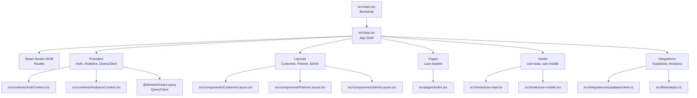
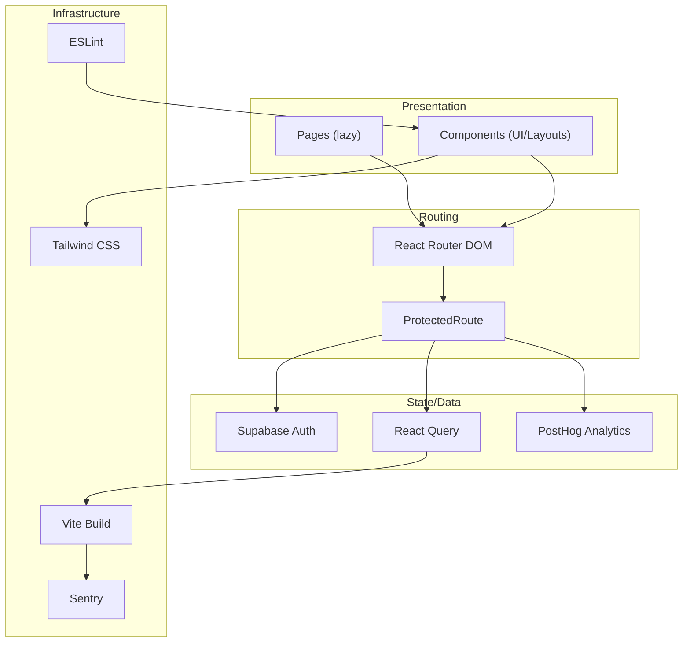
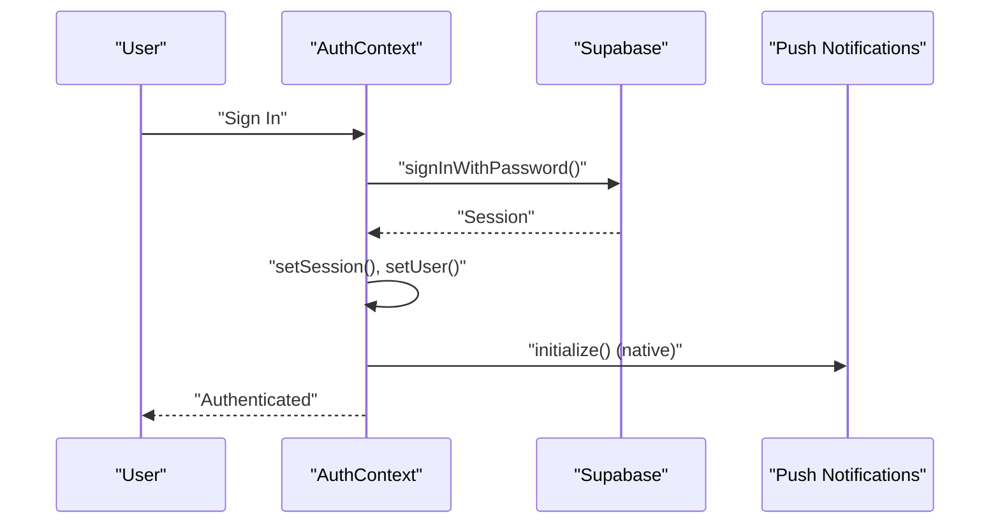
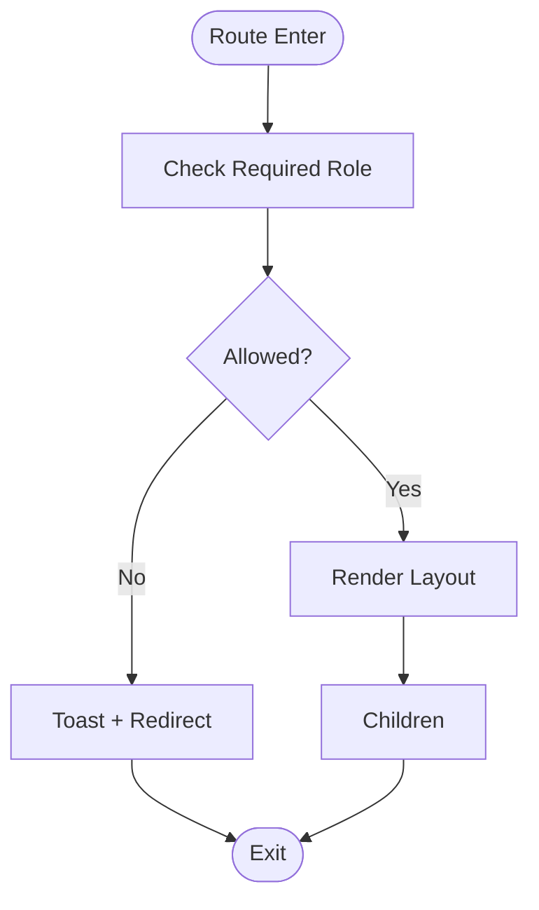
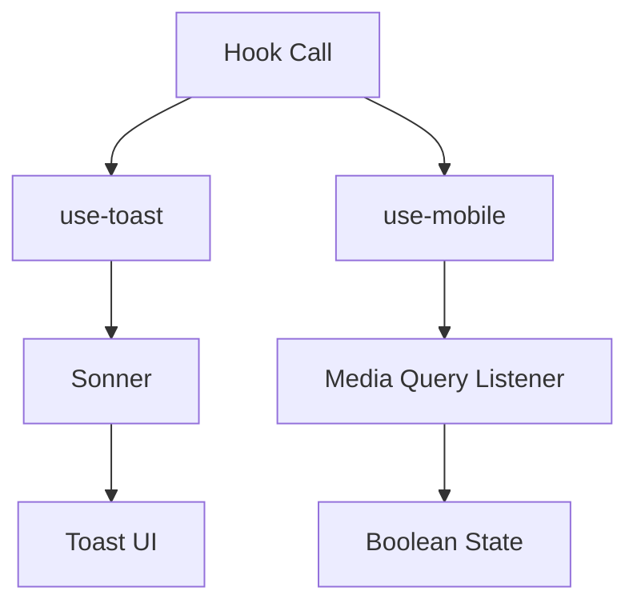
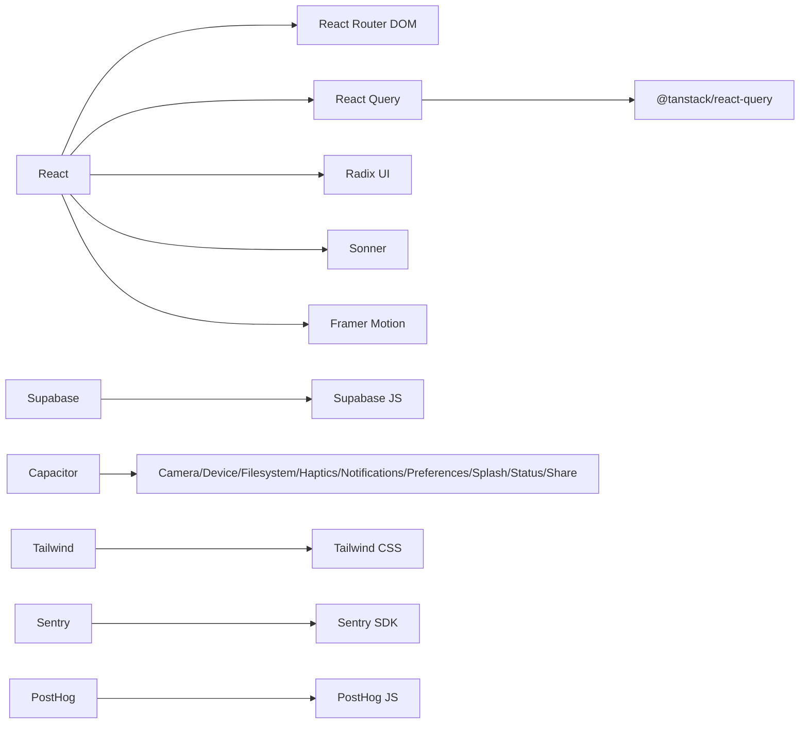

# Frontend Application

<cite>
**Referenced Files in This Document**
- [package.json](file://package.json)
- [vite.config.ts](file://vite.config.ts)
- [src/main.tsx](file://src/main.tsx)
- [src/App.tsx](file://src/App.tsx)
- [tailwind.config.ts](file://tailwind.config.ts)
- [eslint.config.js](file://eslint.config.js)
- [src/contexts/AuthContext.tsx](file://src/contexts/AuthContext.tsx)
- [src/contexts/AnalyticsContext.tsx](file://src/contexts/AnalyticsContext.tsx)
- [src/contexts/LanguageContext.tsx](file://src/contexts/LanguageContext.tsx)
- [src/components/AdminLayout.tsx](file://src/components/AdminLayout.tsx)
- [src/components/CustomerLayout.tsx](file://src/components/CustomerLayout.tsx)
- [src/components/PartnerLayout.tsx](file://src/components/PartnerLayout.tsx)
- [src/components/ProtectedRoute.tsx](file://src/components/ProtectedRoute.tsx)
- [src/hooks/use-toast.ts](file://src/hooks/use-toast.ts)
- [src/hooks/use-mobile.tsx](file://src/hooks/use-mobile.tsx)
- [src/lib/analytics.ts](file://src/lib/analytics.ts)
- [src/integrations/supabase/client.ts](file://src/integrations/supabase/client.ts)
- [src/pages/Index.tsx](file://src/pages/Index.tsx)
</cite>

## Table of Contents
1. [Introduction](#introduction)
2. [Project Structure](#project-structure)
3. [Core Components](#core-components)
4. [Architecture Overview](#architecture-overview)
5. [Detailed Component Analysis](#detailed-component-analysis)
6. [Dependency Analysis](#dependency-analysis)
7. [Performance Considerations](#performance-considerations)
8. [Troubleshooting Guide](#troubleshooting-guide)
9. [Conclusion](#conclusion)
10. [Appendices](#appendices)

## Introduction
This document describes the React-based frontend application for the Nutrio platform. It covers the component architecture, routing system, state management patterns, role-based layout system, reusable component library, styling approach using Tailwind CSS, hook-based data fetching patterns, context providers, authentication integration, build configuration, development workflow, and deployment pipeline. It also addresses responsive design principles, accessibility compliance, and cross-browser compatibility considerations.

## Project Structure
The frontend is organized around a feature-driven component architecture with dedicated directories for pages, components, hooks, contexts, integrations, and services. The application bootstraps via Vite, initializes monitoring and analytics, sets up Supabase authentication, and mounts the main App shell with React Router.

**Diagram sources**
- [src/main.tsx:1-50](file://src/main.tsx#L1-L50)
- [src/App.tsx:1-739](file://src/App.tsx#L1-L739)
- [src/contexts/AuthContext.tsx:1-131](file://src/contexts/AuthContext.tsx#L1-L131)
- [src/contexts/AnalyticsContext.tsx:1-61](file://src/contexts/AnalyticsContext.tsx#L1-L61)
- [src/components/CustomerLayout.tsx:1-24](file://src/components/CustomerLayout.tsx#L1-L24)
- [src/components/PartnerLayout.tsx:1-141](file://src/components/PartnerLayout.tsx#L1-L141)
- [src/components/AdminLayout.tsx:1-130](file://src/components/AdminLayout.tsx#L1-L130)
- [src/hooks/use-toast.ts:1-83](file://src/hooks/use-toast.ts#L1-L83)
- [src/hooks/use-mobile.tsx:1-20](file://src/hooks/use-mobile.tsx#L1-L20)
- [src/integrations/supabase/client.ts:1-57](file://src/integrations/supabase/client.ts#L1-L57)
- [src/lib/analytics.ts:1-170](file://src/lib/analytics.ts#L1-L170)
- [src/pages/Index.tsx:1-670](file://src/pages/Index.tsx#L1-L670)

**Section sources**
- [package.json:1-159](file://package.json#L1-L159)
- [vite.config.ts:1-72](file://vite.config.ts#L1-L72)
- [src/main.tsx:1-50](file://src/main.tsx#L1-L50)
- [src/App.tsx:1-739](file://src/App.tsx#L1-L739)

## Core Components
- Providers and initialization:
  - Monitoring and analytics are initialized early in the bootstrap process.
  - Native app initialization and splash handling are coordinated in the root component.
- Routing:
  - The App component defines a comprehensive route tree with lazy-loaded pages grouped by portal (customer, partner, admin, driver).
  - ProtectedRoute enforces role-based access and optional approval gating for partner routes.
- Layouts:
  - CustomerLayout wraps customer-facing pages with a shared background and navigation.
  - PartnerLayout and AdminLayout provide role-specific sidebars, breadcrumbs, and approval checks.
- State management:
  - Supabase manages authentication state with onAuthStateChange listeners and session persistence.
  - React Query provides caching and invalidation for data fetching across the app.
  - AnalyticsContext and LanguageContext encapsulate analytics and internationalization concerns.

**Section sources**
- [src/main.tsx:1-50](file://src/main.tsx#L1-L50)
- [src/App.tsx:1-739](file://src/App.tsx#L1-L739)
- [src/contexts/AuthContext.tsx:1-131](file://src/contexts/AuthContext.tsx#L1-L131)
- [src/contexts/AnalyticsContext.tsx:1-61](file://src/contexts/AnalyticsContext.tsx#L1-L61)
- [src/components/CustomerLayout.tsx:1-24](file://src/components/CustomerLayout.tsx#L1-L24)
- [src/components/PartnerLayout.tsx:1-141](file://src/components/PartnerLayout.tsx#L1-L141)
- [src/components/AdminLayout.tsx:1-130](file://src/components/AdminLayout.tsx#L1-L130)

## Architecture Overview
The application follows a layered architecture:
- Presentation layer: Pages and components organized by feature and portal.
- Routing and navigation: Centralized in App with protected routes and role checks.
- State and data: Authentication via Supabase, analytics via PostHog, and caching via React Query.
- Infrastructure: Vite build, Tailwind CSS styling, ESLint configuration, and Sentry integration for error tracking.

**Diagram sources**
- [src/App.tsx:1-739](file://src/App.tsx#L1-L739)
- [src/components/ProtectedRoute.tsx:1-264](file://src/components/ProtectedRoute.tsx#L1-L264)
- [src/contexts/AuthContext.tsx:1-131](file://src/contexts/AuthContext.tsx#L1-L131)
- [src/contexts/AnalyticsContext.tsx:1-61](file://src/contexts/AnalyticsContext.tsx#L1-L61)
- [vite.config.ts:1-72](file://vite.config.ts#L1-L72)
- [tailwind.config.ts:1-128](file://tailwind.config.ts#L1-L128)
- [eslint.config.js:1-34](file://eslint.config.js#L1-L34)

## Detailed Component Analysis

### Authentication and Authorization
- AuthContext:
  - Manages user session state, sign-up/sign-in, and sign-out.
  - Initializes push notifications on native platforms upon sign-in.
  - Integrates IP location checks during sign-in.
- ProtectedRoute:
  - Role hierarchy enforcement and caching of user roles to minimize DB queries.
  - Optional approval gating for partner routes.
- Supabase client:
  - Uses Capacitor Preferences for native sessions and localStorage for web.
  - Guards against missing environment variables.

**Diagram sources**
- [src/contexts/AuthContext.tsx:36-61](file://src/contexts/AuthContext.tsx#L36-L61)
- [src/contexts/AuthContext.tsx:87-112](file://src/contexts/AuthContext.tsx#L87-L112)
- [src/integrations/supabase/client.ts:18-45](file://src/integrations/supabase/client.ts#L18-L45)

**Section sources**
- [src/contexts/AuthContext.tsx:1-131](file://src/contexts/AuthContext.tsx#L1-L131)
- [src/components/ProtectedRoute.tsx:1-264](file://src/components/ProtectedRoute.tsx#L1-L264)
- [src/integrations/supabase/client.ts:1-57](file://src/integrations/supabase/client.ts#L1-L57)

### Role-Based Layout System
- CustomerLayout:
  - Wraps customer pages with a consistent background and navigation.
- PartnerLayout:
  - Validates partner roles and restaurant ownership; displays breadcrumbs and action area.
- AdminLayout:
  - Verifies admin role and renders sidebar with breadcrumb navigation.

**Diagram sources**
- [src/components/CustomerLayout.tsx:1-24](file://src/components/CustomerLayout.tsx#L1-L24)
- [src/components/PartnerLayout.tsx:27-141](file://src/components/PartnerLayout.tsx#L27-L141)
- [src/components/AdminLayout.tsx:25-130](file://src/components/AdminLayout.tsx#L25-L130)

**Section sources**
- [src/components/CustomerLayout.tsx:1-24](file://src/components/CustomerLayout.tsx#L1-L24)
- [src/components/PartnerLayout.tsx:1-141](file://src/components/PartnerLayout.tsx#L1-L141)
- [src/components/AdminLayout.tsx:1-130](file://src/components/AdminLayout.tsx#L1-L130)

### Hook-Based Data Fetching Patterns
- use-toast:
  - Unified toast notifications using Sonner with backward-compatible API.
- use-mobile:
  - Responsive breakpoint detection for mobile-first UI decisions.

**Diagram sources**
- [src/hooks/use-toast.ts:1-83](file://src/hooks/use-toast.ts#L1-L83)
- [src/hooks/use-mobile.tsx:1-20](file://src/hooks/use-mobile.tsx#L1-L20)

**Section sources**
- [src/hooks/use-toast.ts:1-83](file://src/hooks/use-toast.ts#L1-L83)
- [src/hooks/use-mobile.tsx:1-20](file://src/hooks/use-mobile.tsx#L1-L20)

### Styling Approach with Tailwind CSS
- Tailwind configuration:
  - Dark mode support via class strategy.
  - Extends theme with custom colors, shadows, border radii, and animations.
  - Content paths scoped to components, pages, app, and src.
- Global styles:
  - Accessibility-focused CSS is included via a dedicated stylesheet.

**Section sources**
- [tailwind.config.ts:1-128](file://tailwind.config.ts#L1-L128)

### Internationalization and Language Context
- LanguageContext:
  - Provides a translation dictionary with keys for English and Arabic.
  - Exposes a translation function and language state management.
- Usage:
  - Pages like Index.tsx consume the translation context to render localized content.

**Section sources**
- [src/contexts/LanguageContext.tsx:1-4540](file://src/contexts/LanguageContext.tsx#L1-L4540)
- [src/pages/Index.tsx:116-124](file://src/pages/Index.tsx#L116-L124)

### Analytics Integration
- AnalyticsContext:
  - Initializes PostHog and exposes tracking APIs.
- Analytics library:
  - Tracks page views, events, and user identification with PII sanitization.
  - Provides helper functions for common events (authentication, orders, subscriptions, wallet).

**Section sources**
- [src/contexts/AnalyticsContext.tsx:1-61](file://src/contexts/AnalyticsContext.tsx#L1-L61)
- [src/lib/analytics.ts:1-170](file://src/lib/analytics.ts#L1-L170)

### Build Configuration and Development Workflow
- Vite configuration:
  - Base path handling for Vercel versus Capacitor builds.
  - React plugin with devTarget optimization.
  - Sentry plugin enabled in production for source maps.
  - Aliased module resolution (@ -> src).
  - Rollup chunk splitting for vendor bundles.
- Scripts:
  - Dev, build, preview, test, typecheck, and Capacitor commands.
- ESLint configuration:
  - TypeScript and React Hooks recommended rules with overrides for e2e fixtures.

**Section sources**
- [vite.config.ts:1-72](file://vite.config.ts#L1-L72)
- [package.json:7-42](file://package.json#L7-L42)
- [eslint.config.js:1-34](file://eslint.config.js#L1-L34)

## Dependency Analysis
The frontend relies on a cohesive set of libraries:
- React ecosystem: React, React Router DOM, React Hook Form, Radix UI primitives.
- State and data: @tanstack/react-query, Supabase JS client.
- UI and styling: Tailwind CSS, Tailwind plugins, Sonner, Framer Motion.
- Observability: Sentry, PostHog.
- Native capabilities: Capacitor modules for camera, device, filesystem, haptics, notifications, preferences, splash screen, status bar, and share.

**Diagram sources**
- [package.json:44-126](file://package.json#L44-L126)

**Section sources**
- [package.json:44-126](file://package.json#L44-L126)

## Performance Considerations
- Code splitting:
  - Routes are lazy-loaded to reduce initial bundle size.
  - Manual chunks separate React vendor libraries, UI primitives, and charting libraries.
- Target modern browsers:
  - ESNext target improves runtime performance.
- Minification and sourcemaps:
  - Terser minification and production sourcemaps for error tracking.
- Caching:
  - React Query caches data and invalidates on navigation and auth state changes.
  - Role cache in ProtectedRoute reduces repeated backend calls.

[No sources needed since this section provides general guidance]

## Troubleshooting Guide
- Authentication issues:
  - Verify Supabase environment variables are present in the build environment.
  - Check session persistence on native vs web platforms.
- Analytics:
  - Confirm PostHog API key and host are configured; analytics are disabled in development.
- Routing and permissions:
  - ProtectedRoute caches roles; if access seems stale, clear cache or refresh.
- Native app:
  - Capacitor preferences are used for session storage; ensure Capacitor is properly synced.

**Section sources**
- [src/integrations/supabase/client.ts:10-16](file://src/integrations/supabase/client.ts#L10-L16)
- [src/lib/analytics.ts:3-35](file://src/lib/analytics.ts#L3-L35)
- [src/components/ProtectedRoute.tsx:33-98](file://src/components/ProtectedRoute.tsx#L33-L98)

## Conclusion
The Nutrio frontend leverages a modular, provider-driven architecture with robust routing, role-based layouts, and integrated analytics and authentication. The build system is optimized for modern browsers and supports native app packaging. The styling system using Tailwind enables rapid iteration and consistent design. Together, these patterns deliver a scalable, maintainable, and user-friendly application across portals.

## Appendices

### Responsive Design Principles
- Mobile-first approach:
  - use-mobile hook detects breakpoints for responsive UI decisions.
  - Horizontal scrolling components and safe-area insets improve mobile UX.
- Adaptive layouts:
  - Tailwind’s responsive prefixes and spacing utilities ensure consistent layouts across devices.

**Section sources**
- [src/hooks/use-mobile.tsx:1-20](file://src/hooks/use-mobile.tsx#L1-L20)
- [src/pages/Index.tsx:148-160](file://src/pages/Index.tsx#L148-L160)

### Accessibility Compliance
- Semantic markup and focus management:
  - Components use semantic HTML and proper ARIA attributes where applicable.
- Color contrast and readable typography:
  - Tailwind’s color palette and spacing utilities support WCAG guidelines.
- Screen reader support:
  - Hidden text and labels are used for assistive technologies.

**Section sources**
- [tailwind.config.ts:19-88](file://tailwind.config.ts#L19-L88)

### Cross-Browser Compatibility
- Modern browser targets:
  - ESNext target and polyfills managed by Vite and underlying toolchain.
- CSS and JavaScript features:
  - Tailwind utilities and modern JS features are transpiled appropriately.

**Section sources**
- [vite.config.ts:49-59](file://vite.config.ts#L49-L59)