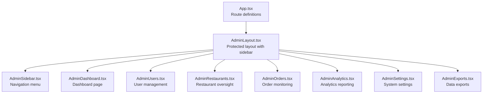
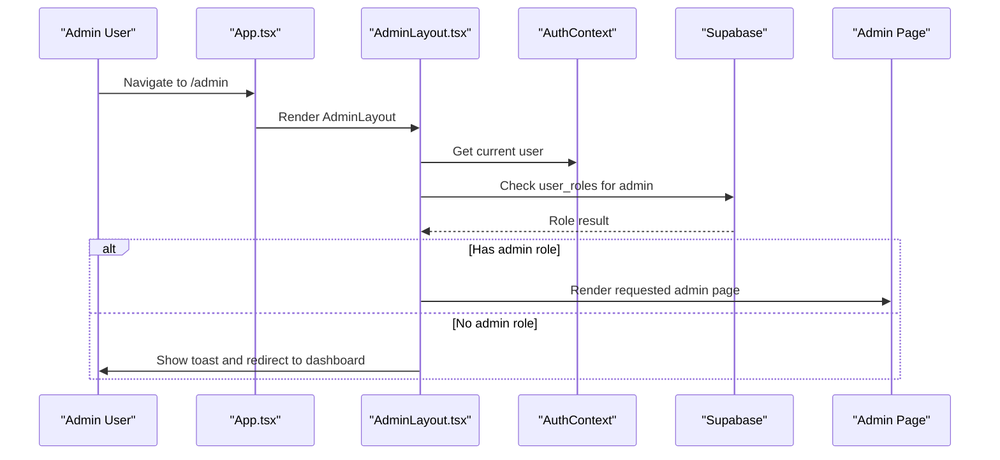
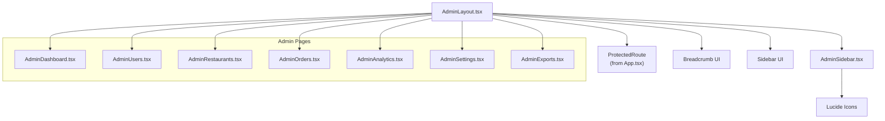

# Admin Portal Pages

<cite>
**Referenced Files in This Document**
- [AdminLayout.tsx](file://src/components/AdminLayout.tsx)
- [AdminSidebar.tsx](file://src/components/AdminSidebar.tsx)
- [App.tsx](file://src/App.tsx)
- [dashboard.spec.ts](file://e2e/admin/dashboard.spec.ts)
- [users.spec.ts](file://e2e/admin/users.spec.ts)
- [restaurants.spec.ts](file://e2e/admin/restaurants.spec.ts)
- [orders.spec.ts](file://e2e/admin/orders.spec.ts)
- [analytics.spec.ts](file://e2e/admin/analytics.spec.ts)
- [settings.spec.ts](file://e2e/admin/settings.spec.ts)
- [exports.spec.ts](file://e2e/admin/exports.spec.ts)
- [admin_pages_analysis.md](file://admin_pages_analysis.md)
</cite>

## Table of Contents
1. [Introduction](#introduction)
2. [Project Structure](#project-structure)
3. [Core Components](#core-components)
4. [Architecture Overview](#architecture-overview)
5. [Detailed Component Analysis](#detailed-component-analysis)
6. [Dependency Analysis](#dependency-analysis)
7. [Performance Considerations](#performance-considerations)
8. [Troubleshooting Guide](#troubleshooting-guide)
9. [Conclusion](#conclusion)

## Introduction
This document provides comprehensive documentation for the Nutrio admin portal, covering all administrative pages and workflows. It explains the administrative dashboard, user management, restaurant oversight, order monitoring, analytics reporting, system settings, and operational controls. The guide details the admin workflow for managing users, restaurants, drivers, and system operations, along with page components, data visualization, reporting dashboards, and administrative controls. It also covers user role management, content moderation, financial oversight, and system maintenance features.

## Project Structure
The admin portal is built as a React application with route protection and a shared layout. The routing configuration defines protected admin routes that require an admin role. The sidebar provides navigation to all admin pages, while the layout enforces role-based access control and displays breadcrumbs.

**Diagram sources**
- [App.tsx:470-520](file://src/App.tsx#L470-L520)
- [AdminLayout.tsx:25-128](file://src/components/AdminLayout.tsx#L25-L128)
- [AdminSidebar.tsx:68-151](file://src/components/AdminSidebar.tsx#L68-L151)

**Section sources**
- [App.tsx:470-520](file://src/App.tsx#L470-L520)
- [AdminLayout.tsx:25-128](file://src/components/AdminLayout.tsx#L25-L128)
- [AdminSidebar.tsx:68-151](file://src/components/AdminSidebar.tsx#L68-L151)

## Core Components
The admin portal relies on two core components:
- AdminLayout: Provides the admin layout, breadcrumb navigation, sidebar trigger, and admin role verification.
- AdminSidebar: Renders the navigation menu with icons and labels for all admin pages.

Key responsibilities:
- AdminLayout
  - Verifies admin role using Supabase user roles
  - Displays loading skeleton until role check completes
  - Prevents access for non-admin users
  - Provides breadcrumb navigation and responsive sidebar
- AdminSidebar
  - Defines all admin navigation items with icons and URLs
  - Highlights active navigation item based on current route
  - Allows viewing as customer and signing out

**Section sources**
- [AdminLayout.tsx:25-128](file://src/components/AdminLayout.tsx#L25-L128)
- [AdminSidebar.tsx:68-151](file://src/components/AdminSidebar.tsx#L68-L151)

## Architecture Overview
The admin portal follows a protected-route architecture. All admin pages are wrapped in a ProtectedRoute component that checks for the admin role before rendering. The AdminLayout component ensures consistent navigation and access control across all admin pages.

**Diagram sources**
- [App.tsx:470-478](file://src/App.tsx#L470-L478)
- [AdminLayout.tsx:33-67](file://src/components/AdminLayout.tsx#L33-L67)

**Section sources**
- [App.tsx:470-478](file://src/App.tsx#L470-L478)
- [AdminLayout.tsx:33-67](file://src/components/AdminLayout.tsx#L33-L67)

## Detailed Component Analysis

### Administrative Dashboard
The dashboard serves as the central hub for platform management, displaying real-time statistics, recent activity, and quick action links.

Key features:
- Real-time statistics cards for restaurants, users, orders, and revenue
- Interactive charts for orders over time and commission data
- Recent activity feed showing orders, sign-ups, and restaurant applications
- Quick action buttons linking to related admin pages
- Responsive grid layout with color-coded indicators

Data visualization components:
- Stats cards with trend indicators
- Line charts for revenue trends
- Heatmaps for peak order hours
- Distribution charts for meal types

**Section sources**
- [AdminDashboard.tsx:276-584](file://src/pages/admin/AdminDashboard.tsx#L276-L584)
- [dashboard.spec.ts:8-124](file://e2e/admin/dashboard.spec.ts#L8-L124)

### User Management
The user management system provides comprehensive control over platform users, including role management, account status control, and activity monitoring.

Core functionality:
- View all users with filtering by status and search
- User detail view with profile, orders, subscription, and referral information
- Edit user information and reset passwords
- Deactivate/reactivate/delete user accounts
- Impersonate user accounts for support
- View complete user activity logs
- Export user lists

Administrative controls:
- Role assignment and management
- IP address monitoring and blocking
- Account lifecycle management
- Bulk user operations

**Section sources**
- [users.spec.ts:8-338](file://e2e/admin/users.spec.ts#L8-L338)
- [admin_pages_analysis.md:22-32](file://admin_pages_analysis.md#L22-L32)

### Restaurant Oversight
The restaurant management system handles restaurant applications, approvals, and ongoing oversight.

Primary features:
- Restaurant application review and approval workflow
- Pending applications queue with detailed review
- Restaurant detail view with orders, earnings, ratings, and menu
- Edit restaurant information and set payout rates
- Suspend/reactivate/delete restaurants
- Bulk approval of multiple restaurants
- Performance metrics and detailed analytics

Operational controls:
- Custom payout rate configuration
- Application rejection with notifications
- Performance monitoring and alerts
- Compliance and quality assurance

**Section sources**
- [restaurants.spec.ts:8-443](file://e2e/admin/restaurants.spec.ts#L8-L443)
- [admin_pages_analysis.md:34-44](file://admin_pages_analysis.md#L34-L44)

### Order Monitoring
The order management system provides comprehensive oversight of all platform orders, enabling efficient operations and customer service.

Key capabilities:
- View all orders with filtering by status and search
- Order detail view with items, customer, restaurant, status, and payment information
- Update order status through multi-step workflow
- Cancel orders and process refunds
- Assign drivers to orders
- Order status timeline and history
- Bulk status updates

Operational workflows:
- Order fulfillment tracking
- Customer service resolution
- Refund processing
- Driver coordination

**Section sources**
- [orders.spec.ts:8-278](file://e2e/admin/orders.spec.ts#L8-L278)
- [admin_pages_analysis.md:45-55](file://admin_pages_analysis.md#L45-L55)

### Analytics Reporting
The analytics system provides comprehensive insights into platform performance, revenue trends, and customer behavior.

Reporting features:
- Revenue trends and forecasting
- Customer retention metrics and cohort analysis
- Peak order hours and demand patterns
- Top restaurants and meal type distributions
- Key performance indicators and metrics
- Export complete analytics reports

Data visualization:
- Interactive charts and graphs
- Heatmaps for geographic and temporal patterns
- Comparative analysis dashboards
- Customizable date range filtering

**Section sources**
- [analytics.spec.ts:8-158](file://e2e/admin/analytics.spec.ts#L8-L158)
- [admin_pages_analysis.md:247-261](file://admin_pages_analysis.md#L247-L261)

### System Settings
The system settings module manages all platform-wide configurations and operational parameters.

Configuration areas:
- General platform settings and feature toggles
- Payment gateway configuration (including Sadad)
- Notification templates and communication settings
- Referral program configuration and rewards
- System maintenance mode and operational controls
- Commission rates and fee structures
- Subscription plans and pricing

Administrative controls:
- Platform-wide feature enable/disable
- Financial configuration management
- Communication template management
- Operational mode switching

**Section sources**
- [settings.spec.ts:8-218](file://e2e/admin/settings.spec.ts#L8-L218)
- [admin_pages_analysis.md:120-136](file://admin_pages_analysis.md#L120-L136)

### Data Exports
The export system enables comprehensive data extraction for external analysis and compliance requirements.

Export capabilities:
- Export users with comprehensive profile data
- Export subscriptions with billing and status information
- Export orders with transaction details
- Date range filtering for targeted exports
- CSV format downloads

Operational use cases:
- Regulatory compliance reporting
- Business intelligence analysis
- Audit and forensic investigations
- Third-party integrations

**Section sources**
- [exports.spec.ts:8-38](file://e2e/admin/exports.spec.ts#L8-L38)
- [admin_pages_analysis.md:203-215](file://admin_pages_analysis.md#L203-L215)

### Additional Administrative Pages
The admin portal includes several specialized management pages:

- **Payouts**: Manage restaurant and affiliate payouts with bulk approval workflows
- **Affiliate Programs**: Monitor and manage affiliate applications, payouts, and milestones
- **Content Management**: Handle announcements, promotions, and featured listings
- **Support Management**: Track and resolve support tickets with file attachments
- **Driver Management**: Oversee driver applications and fleet operations
- **IP Management**: Monitor and control access through IP address management
- **Deliveries**: Coordinate delivery operations and tracking

**Section sources**
- [admin_pages_analysis.md:78-246](file://admin_pages_analysis.md#L78-L246)

## Dependency Analysis
The admin portal components have the following dependencies:

**Diagram sources**
- [AdminLayout.tsx:13-17](file://src/components/AdminLayout.tsx#L13-L17)
- [AdminSidebar.tsx:24-39](file://src/components/AdminSidebar.tsx#L24-L39)
- [App.tsx:470-520](file://src/App.tsx#L470-L520)

**Section sources**
- [AdminLayout.tsx:13-17](file://src/components/AdminLayout.tsx#L13-L17)
- [AdminSidebar.tsx:24-39](file://src/components/AdminSidebar.tsx#L24-L39)
- [App.tsx:470-520](file://src/App.tsx#L470-L520)

## Performance Considerations
The admin portal is designed with performance and scalability in mind:

- Lazy loading of admin components reduces initial bundle size
- Protected routes prevent unnecessary rendering for unauthorized users
- Responsive design ensures optimal performance across devices
- Efficient data fetching patterns minimize API calls
- Caching strategies for frequently accessed data
- Optimized chart rendering for large datasets

## Troubleshooting Guide
Common admin portal issues and resolutions:

**Access Control Issues**
- Symptom: Non-admin users redirected to dashboard
- Cause: Missing or incorrect admin role in user_roles table
- Resolution: Verify user role assignment and refresh browser cache

**Page Loading Problems**
- Symptom: Blank or slow-loading admin pages
- Cause: Network connectivity or API response delays
- Resolution: Check network connection and API health status

**Data Display Issues**
- Symptom: Missing or outdated statistics
- Cause: Cache not updating or database synchronization delays
- Resolution: Force refresh page and verify data pipeline status

**Navigation Problems**
- Symptom: Broken links or missing navigation items
- Cause: Route configuration errors or component import issues
- Resolution: Verify route definitions and component availability

**Section sources**
- [AdminLayout.tsx:33-67](file://src/components/AdminLayout.tsx#L33-L67)
- [AdminSidebar.tsx:75-80](file://src/components/AdminSidebar.tsx#L75-L80)

## Conclusion
The Nutrio admin portal provides a comprehensive, secure, and scalable administrative interface for platform management. With 19 distinct admin pages covering all operational aspects—from user and restaurant management to order monitoring, analytics, and system settings—the portal supports efficient platform governance. The implementation demonstrates strong architectural patterns with role-based access control, consistent UI components, and robust testing coverage. The portal is production-ready with only minor cosmetic enhancements recommended for design system consistency across all pages.