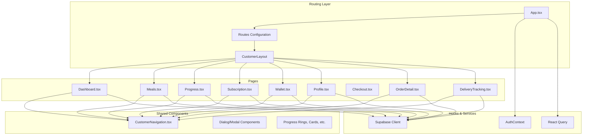
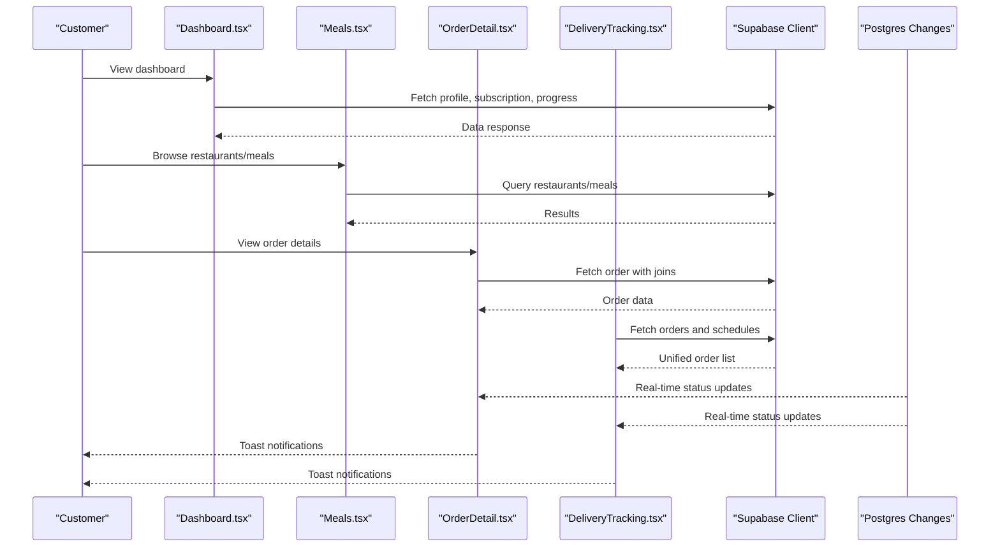
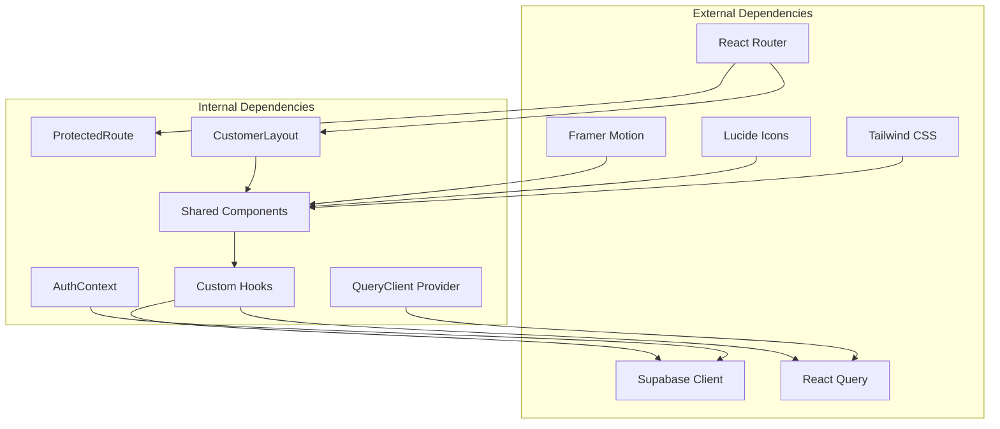

# Customer Portal Pages

<cite>
**Referenced Files in This Document**
- [App.tsx](file://src/App.tsx)
- [Dashboard.tsx](file://src/pages/Dashboard.tsx)
- [Meals.tsx](file://src/pages/Meals.tsx)
- [Progress.tsx](file://src/pages/Progress.tsx)
- [Subscription.tsx](file://src/pages/Subscription.tsx)
- [Wallet.tsx](file://src/pages/Wallet.tsx)
- [Profile.tsx](file://src/pages/Profile.tsx)
- [Checkout.tsx](file://src/pages/Checkout.tsx)
- [OrderDetail.tsx](file://src/pages/OrderDetail.tsx)
- [DeliveryTracking.tsx](file://src/pages/DeliveryTracking.tsx)
</cite>

## Table of Contents
1. [Introduction](#introduction)
2. [Project Structure](#project-structure)
3. [Core Components](#core-components)
4. [Architecture Overview](#architecture-overview)
5. [Detailed Component Analysis](#detailed-component-analysis)
6. [Dependency Analysis](#dependency-analysis)
7. [Performance Considerations](#performance-considerations)
8. [Troubleshooting Guide](#troubleshooting-guide)
9. [Conclusion](#conclusion)

## Introduction
This document provides comprehensive documentation for the Nutrio customer portal, covering all customer-facing pages and their interactions. It explains the customer journey from onboarding through meal delivery, including order placement, tracking, and nutrition monitoring. The documentation details page components, data flows, user interactions, and integrations with backend services, along with navigation patterns, form handling, and real-time updates.

## Project Structure
The customer portal is built as a React application with TypeScript, using React Router for navigation and Supabase for backend integration. Pages are organized under `src/pages`, with shared components in `src/components` and reusable hooks in `src/hooks`. The main routing configuration defines protected routes and layout wrappers for customer pages.

**Diagram sources**
- [App.tsx:150-363](file://src/App.tsx#L150-L363)
- [Dashboard.tsx:1-566](file://src/pages/Dashboard.tsx#L1-L566)
- [Meals.tsx:1-800](file://src/pages/Meals.tsx#L1-L800)
- [Progress.tsx:1-687](file://src/pages/Progress.tsx#L1-L687)
- [Subscription.tsx:1-800](file://src/pages/Subscription.tsx#L1-L800)
- [Wallet.tsx:1-221](file://src/pages/Wallet.tsx#L1-L221)
- [Profile.tsx:1-800](file://src/pages/Profile.tsx#L1-L800)
- [Checkout.tsx:1-288](file://src/pages/Checkout.tsx#L1-L288)
- [OrderDetail.tsx:1-777](file://src/pages/OrderDetail.tsx#L1-L777)
- [DeliveryTracking.tsx:1-592](file://src/pages/DeliveryTracking.tsx#L1-L592)

**Section sources**
- [App.tsx:1-739](file://src/App.tsx#L1-L739)

## Core Components
This section outlines the key customer portal pages and their primary responsibilities:

- **Dashboard**: Central hub displaying subscription status, daily nutrition progress, quick actions, featured restaurants, and notifications.
- **Meals**: Browse restaurants and meals with filtering, favorites, and search capabilities.
- **Progress**: Track nutrition, water intake, weight, and weekly reports with goals management.
- **Subscription**: Manage subscription plans, billing intervals, auto-renewal, rollover credits, and cancellation.
- **Wallet**: Top-up wallet, view transaction history, and manage payment methods.
- **Profile**: User profile management, dietary preferences, account settings, and rewards.
- **Checkout**: Simulated payment processing for wallet top-ups and subscription upgrades.
- **OrderDetail**: Real-time order tracking, status updates, and delivery information.
- **DeliveryTracking**: Unified order history with active, completed, and cancelled orders.

**Section sources**
- [Dashboard.tsx:1-566](file://src/pages/Dashboard.tsx#L1-L566)
- [Meals.tsx:1-800](file://src/pages/Meals.tsx#L1-L800)
- [Progress.tsx:1-687](file://src/pages/Progress.tsx#L1-L687)
- [Subscription.tsx:1-800](file://src/pages/Subscription.tsx#L1-L800)
- [Wallet.tsx:1-221](file://src/pages/Wallet.tsx#L1-L221)
- [Profile.tsx:1-800](file://src/pages/Profile.tsx#L1-L800)
- [Checkout.tsx:1-288](file://src/pages/Checkout.tsx#L1-L288)
- [OrderDetail.tsx:1-777](file://src/pages/OrderDetail.tsx#L1-L777)
- [DeliveryTracking.tsx:1-592](file://src/pages/DeliveryTracking.tsx#L1-L592)

## Architecture Overview
The customer portal follows a layered architecture:
- **Presentation Layer**: React functional components with TypeScript and Tailwind CSS.
- **Routing Layer**: React Router with protected routes and layout wrappers.
- **State Management**: React Query for caching and synchronization, alongside local component state.
- **Authentication**: Supabase Auth context for user sessions.
- **Data Access**: Supabase client for database operations and real-time subscriptions.
- **Real-time Updates**: Postgres changes channels for live order status updates and notifications.

**Diagram sources**
- [Dashboard.tsx:79-147](file://src/pages/Dashboard.tsx#L79-L147)
- [Meals.tsx:721-800](file://src/pages/Meals.tsx#L721-L800)
- [OrderDetail.tsx:168-220](file://src/pages/OrderDetail.tsx#L168-L220)
- [DeliveryTracking.tsx:257-275](file://src/pages/DeliveryTracking.tsx#L257-L275)

**Section sources**
- [App.tsx:149-363](file://src/App.tsx#L149-L363)

## Detailed Component Analysis

### Dashboard
The dashboard serves as the customer's central hub, integrating subscription status, daily nutrition progress, quick actions, featured restaurants, and notifications. It orchestrates multiple hooks for profile, subscription, adaptive goals, and platform settings, and performs real-time queries for notifications and progress logs.

Key features:
- Subscription plan card with usage indicators and renewal dates.
- Adaptive goals widget for nutrition adjustments.
- Daily nutrition card showing calories, protein, carbs, and fat consumption.
- Quick action buttons for tracker, subscription, favorites, and progress.
- Active order banner integration.
- Streak progress strip with visual indicators.
- Featured restaurants carousel with favorites toggle.
- Unread notifications counter with bell icon.

Data flows:
- Fetches user profile and subscription details.
- Queries progress logs for today's nutrition totals.
- Counts unread notifications from the notifications table.
- Integrates with Supabase for real-time updates and favorites toggles.

Navigation patterns:
- Links to subscription, tracker, favorites, and progress pages.
- Profile avatar with VIP indicators.
- Notifications bell with badge.

Real-time updates:
- Subscribes to notifications count changes.
- Tracks user's restaurant ownership for role switching.

**Section sources**
- [Dashboard.tsx:1-566](file://src/pages/Dashboard.tsx#L1-L566)

### Meals
The meals page enables customers to browse restaurants and meals with advanced filtering, sorting, and favorites management. It supports guest browsing with login prompts and integrates with Supabase for restaurant and meal data retrieval.

Key features:
- Cuisine filter chips with emoji and images.
- Sorting options: rating, fastest, popular.
- Calorie range filters.
- Favorites toggle with haptic feedback.
- Restaurant and meal cards with ratings, delivery info, and availability.
- Bottom sheet filter modal with animated transitions.
- Skeleton loaders for native mobile feel.

Data flows:
- Fetches restaurants and associated meals.
- Calculates meal counts per restaurant.
- Applies filters and sorts based on user selections.
- Handles favorites toggling with Supabase mutations.

Form handling:
- Search input for restaurant names.
- Chip-based cuisine selection.
- Toggle for favorites-only view.

Real-time updates:
- No real-time subscriptions in this page.

**Section sources**
- [Meals.tsx:1-800](file://src/pages/Meals.tsx#L1-L800)

### Progress
The progress page provides comprehensive nutrition and health tracking, including daily stats, weekly reports, goals management, water intake, and weight tracking. It generates downloadable weekly reports and integrates smart recommendations.

Key features:
- Tabbed interface: Today, Week, Goals.
- Today tab: Current weight, nutrition rings, water intake, meal quality, quick actions.
- Week tab: Professional weekly report with charts and downloadable PDF.
- Goals tab: Goals management component.
- Weight tracking: Add, view, and delete weight entries.
- Smart recommendations and consistency scoring.

Data flows:
- Fetches daily and weekly progress logs.
- Computes nutrition targets and progress percentages.
- Generates weekly report data and embedded meal plan images.
- Manages water intake and streak statistics.

Form handling:
- Weight entry form with date picker.
- Quick water logging buttons.
- Recommendations refresh mechanism.

Real-time updates:
- No real-time subscriptions in this page.

**Section sources**
- [Progress.tsx:1-687](file://src/pages/Progress.tsx#L1-L687)

### Subscription
The subscription page manages customer plans, billing intervals, auto-renewal, rollover credits, and cancellation. It integrates with Supabase RPCs for plan upgrades and subscription management.

Key features:
- Plan comparison with tier metadata and pricing.
- Billing interval toggle (monthly/annual) with savings display.
- Auto-renewal toggle with immediate DB sync.
- Rollover credits widget and freeze days display.
- Upgrade dialog with payment method selection.
- Promo code validation and application.
- Reactivation flow for cancelled subscriptions.

Data flows:
- Fetches active subscription and plan details.
- Loads rollover credits and freeze days.
- Validates promo codes against Supabase promotions.
- Processes upgrades via RPC with wallet or card payment.

Form handling:
- Payment method selection (card or wallet).
- Promo code input with validation feedback.
- Auto-renewal toggle with loading states.

Real-time updates:
- No real-time subscriptions in this page.

**Section sources**
- [Subscription.tsx:1-800](file://src/pages/Subscription.tsx#L1-L800)

### Wallet
The wallet page allows customers to top up their wallet balance, view transaction history, and manage payment methods. It integrates with the checkout flow for simulated payments.

Key features:
- Wallet balance display with credits/debits breakdown.
- Top-up packages with bonus amounts.
- Transaction history with loading states.
- Confirmation dialog for top-up purchases.
- Payment status handling via URL parameters.

Data flows:
- Fetches wallet balance and transaction history.
- Navigates to checkout with pre-filled amount and type.
- Processes wallet top-ups via RPC after successful payment.
- Updates UI based on payment success/failure parameters.

Form handling:
- Package selection with confirmation modal.
- Redirect notice and payment method display.

Real-time updates:
- No real-time subscriptions in this page.

**Section sources**
- [Wallet.tsx:1-221](file://src/pages/Wallet.tsx#L1-L221)

### Profile
The profile page manages user information, dietary preferences, account settings, and rewards. It integrates with Supabase for data persistence and provides segmented tabs for different sections.

Key features:
- Tabbed interface: Profile, Wallet, Rewards, Settings.
- Personal info accordion with gender selection.
- Delivery addresses management.
- Dietary and allergies preferences with tag toggles.
- Account settings: password change, notifications, privacy.
- Rewards and affiliate widgets.
- Wallet integration for quick top-ups.

Data flows:
- Fetches and updates profile information.
- Manages dietary preference tags via Supabase.
- Handles password updates through Supabase Auth.
- Integrates wallet data for quick top-ups.

Form handling:
- Editable personal information fields.
- Password change with strength validation.
- Dietary preference toggles with toast feedback.

Real-time updates:
- No real-time subscriptions in this page.

**Section sources**
- [Profile.tsx:1-800](file://src/pages/Profile.tsx#L1-L800)

### Checkout
The checkout page simulates payment processing for wallet top-ups and subscription upgrades. It manages payment steps, method selection, and success/failure states.

Key features:
- Payment method selector (card, Sadad, Apple/Google Pay).
- Simulated card form with validation.
- 3D Secure verification simulation.
- Payment processing modal with progress.
- Success and failure screens with navigation.

Data flows:
- Parses query parameters for amount and type.
- Uses simulated payment hook for step management.
- Processes wallet top-ups via RPC with atomic operations.
- Navigates to appropriate success/failure pages.

Form handling:
- Method selection with step transitions.
- Card details submission with loading states.
- Retry and cancel functionality.

Real-time updates:
- No real-time subscriptions in this page.

**Section sources**
- [Checkout.tsx:1-288](file://src/pages/Checkout.tsx#L1-L288)

### OrderDetail
The order detail page provides real-time tracking of individual orders, including status updates, estimated arrival times, and contact information. It integrates with Supabase for live updates and order modifications.

Key features:
- Status timeline with icons and labels.
- Estimated arrival countdown with real-time status steps.
- Food image and nutrition information.
- Contact restaurant or driver with phone links.
- Action buttons: cancel order, mark received, mark completed.
- Real-time notifications for status changes.

Data flows:
- Fetches order details with joins to meals and restaurants.
- Subscribes to real-time updates via Postgres changes.
- Handles order cancellations via RPC.
- Updates status locally and displays toast notifications.

Form handling:
- Status update buttons with loading states.
- Cancel confirmation dialog.
- Driver phone link handling.

Real-time updates:
- Live status updates via Supabase channel.
- Toast notifications for status changes.

**Section sources**
- [OrderDetail.tsx:1-777](file://src/pages/OrderDetail.tsx#L1-L777)

### DeliveryTracking
The delivery tracking page presents a unified view of orders and scheduled meals, supporting filtering by status and pagination for order history.

Key features:
- Tabbed interface: All, Active, Completed, Cancelled.
- Unified order cards combining orders and scheduled meals.
- Pull-to-refresh with visual indicator.
- Action buttons: modify, cancel, reorder.
- Pagination for order history.

Data flows:
- Fetches orders with related restaurants and meals.
- Fetches scheduled meals with associated meals and restaurants.
- Builds unified list with tab categorization.
- Subscribes to real-time updates for live status changes.

Form handling:
- Tab switching with filtered views.
- Action buttons with loading states.
- Modify order modal integration.

Real-time updates:
- Live updates via Supabase channel for meal schedules.
- Toast notifications for status changes.

**Section sources**
- [DeliveryTracking.tsx:1-592](file://src/pages/DeliveryTracking.tsx#L1-L592)

## Dependency Analysis
The customer portal relies on several key dependencies and integration points:

- **React Router**: Defines protected routes and layout wrappers for customer pages.
- **Supabase**: Provides authentication, database queries, and real-time subscriptions.
- **React Query**: Manages caching and synchronization for data fetching.
- **TanStack Table/Hooks**: Used for advanced filtering and pagination in meals.
- **Framer Motion**: Adds smooth animations and transitions across pages.
- **Lucide Icons**: Consistent iconography across components.
- **Tailwind CSS**: Utility-first styling framework.

**Diagram sources**
- [App.tsx:1-739](file://src/App.tsx#L1-L739)
- [Dashboard.tsx:1-566](file://src/pages/Dashboard.tsx#L1-L566)
- [Meals.tsx:1-800](file://src/pages/Meals.tsx#L1-L800)
- [Progress.tsx:1-687](file://src/pages/Progress.tsx#L1-L687)
- [Subscription.tsx:1-800](file://src/pages/Subscription.tsx#L1-L800)
- [Wallet.tsx:1-221](file://src/pages/Wallet.tsx#L1-L221)
- [Profile.tsx:1-800](file://src/pages/Profile.tsx#L1-L800)
- [Checkout.tsx:1-288](file://src/pages/Checkout.tsx#L1-L288)
- [OrderDetail.tsx:1-777](file://src/pages/OrderDetail.tsx#L1-L777)
- [DeliveryTracking.tsx:1-592](file://src/pages/DeliveryTracking.tsx#L1-L592)

**Section sources**
- [App.tsx:1-739](file://src/App.tsx#L1-L739)

## Performance Considerations
- **Lazy Loading**: Routes are lazily loaded to reduce initial bundle size.
- **Suspense**: Loading fallbacks prevent blank screens during route transitions.
- **React Query**: Efficient caching and background refetching minimize redundant network requests.
- **Virtualization**: Large lists (e.g., order history) should consider virtualization for better performance.
- **Optimized Images**: Placeholder images and skeleton loaders improve perceived performance.
- **Real-time Channels**: Limit the number of subscribed channels to essential ones to reduce bandwidth.

## Troubleshooting Guide
Common issues and resolutions:
- **Authentication Errors**: Ensure AuthContext is properly initialized and user session is valid.
- **Network Failures**: Implement retry logic and error boundaries around data fetching.
- **Real-time Updates**: Verify Supabase channel subscriptions and handle disconnections gracefully.
- **Payment Failures**: Check simulated payment flow and handle RPC errors appropriately.
- **Navigation Issues**: Confirm ProtectedRoute wrapping and layout providers are correctly configured.

**Section sources**
- [Checkout.tsx:78-86](file://src/pages/Checkout.tsx#L78-L86)
- [OrderDetail.tsx:190-213](file://src/pages/OrderDetail.tsx#L190-L213)
- [DeliveryTracking.tsx:260-275](file://src/pages/DeliveryTracking.tsx#L260-L275)

## Conclusion
The Nutrio customer portal provides a comprehensive, real-time experience for customers managing their nutrition journey. Through integrated dashboards, seamless order tracking, and robust subscription and wallet management, the portal ensures a smooth customer lifecycle from onboarding to delivery and ongoing health monitoring. The modular architecture, strong data integration with Supabase, and thoughtful UX patterns enable scalability and maintainability across future enhancements.