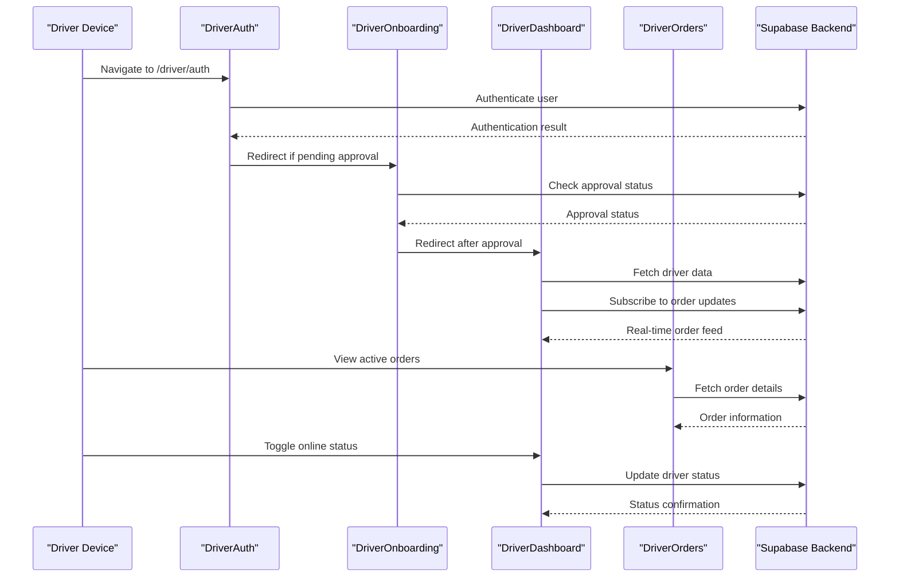
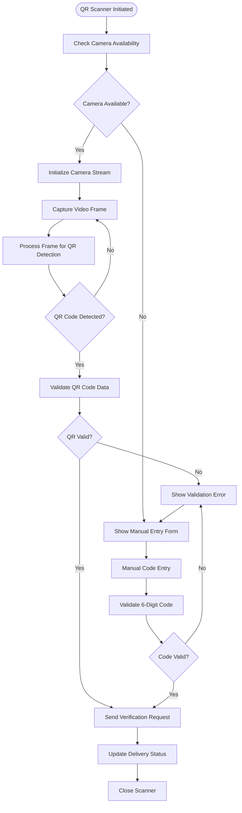
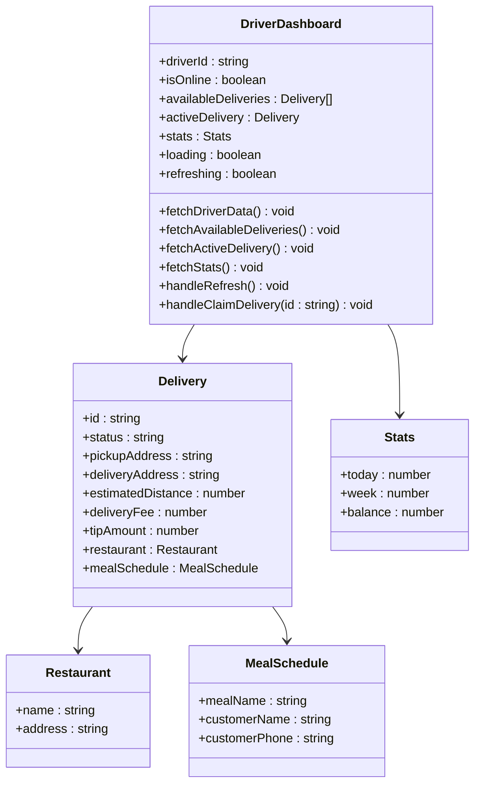
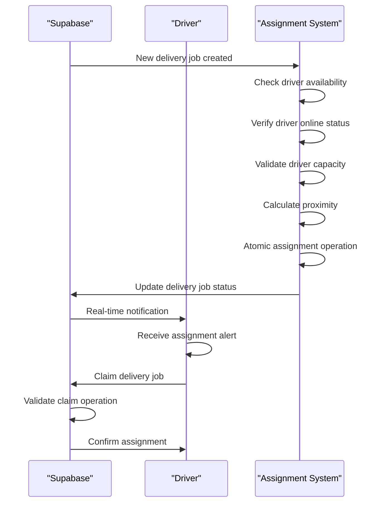
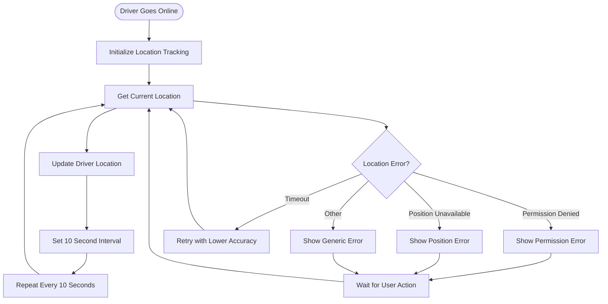
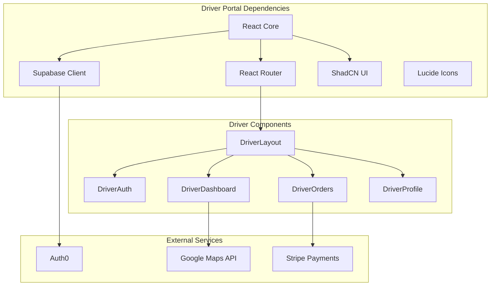

# Driver Portal Pages

<cite>
**Referenced Files in This Document**
- [DriverLayout.tsx](file://src/components/driver/DriverLayout.tsx)
- [DriverQRScanner.tsx](file://src/components/driver/DriverQRScanner.tsx)
- [DriverAuth.tsx](file://android/app/src/main/assets/public/assets/DriverAuth-BI8zL2Da.js)
- [DriverDashboard.tsx](file://android/app/src/main/assets/public/assets/DriverDashboard-BxTHpSMC.js)
- [DriverOnboarding.tsx](file://android/app/src/main/assets/public/assets/DriverOnboarding-6ukwmGqi.js)
- [DriverOrders.tsx](file://android/app/src/main/assets/public/assets/DriverOrders-CaQhfFM4.js)
- [DriverOrderDetail.tsx](file://android/app/src/main/assets/public/assets/DriverOrderDetail-PGStGlnQ.js)
- [DriverHistory.tsx](file://android/app/src/main/assets/public/assets/DriverHistory-CUpynm4k.js)
- [DriverEarnings.tsx](file://android/app/src/main/assets/public/assets/DriverEarnings-CTeCu5JQ.js)
- [DriverPayouts.tsx](file://android/app/src/main/assets/public/assets/DriverPayouts-vUW-4VvH.js)
- [DriverProfile.tsx](file://android/app/src/main/assets/public/assets/DriverProfile-BVilSzcW.js)
- [DriverSettings.tsx](file://android/app/src/main/assets/public/assets/DriverSettings-BubF6UQc.js)
- [DriverNotifications.tsx](file://src/pages/driver/DriverNotifications.tsx)
- [App.tsx](file://src/App.tsx)
- [nutrio-system-documentation.html](file://docs/plans/nutrio-system-documentation.html)
- [dashboard.spec.ts](file://e2e/driver/dashboard.spec.ts)
</cite>

## Table of Contents
1. [Introduction](#introduction)
2. [Project Structure](#project-structure)
3. [Core Components](#core-components)
4. [Architecture Overview](#architecture-overview)
5. [Detailed Component Analysis](#detailed-component-analysis)
6. [Dependency Analysis](#dependency-analysis)
7. [Performance Considerations](#performance-considerations)
8. [Troubleshooting Guide](#troubleshooting-guide)
9. [Conclusion](#conclusion)

## Introduction
This document provides comprehensive documentation for the Nutrio driver portal system. The driver portal enables delivery drivers to manage their work efficiently through five core areas: dashboard overview, order assignment and management, real-time delivery tracking, earnings calculation and payout management, profile maintenance, and support functionality. The system integrates with Supabase for authentication, real-time data synchronization, and backend services, while providing a mobile-first interface optimized for driver workflows.

## Project Structure
The driver portal follows a modular architecture with dedicated components for authentication, onboarding, dashboard, orders, history, earnings, payouts, profile, settings, and notifications. The system leverages React Router for navigation and implements a responsive layout optimized for mobile devices.

```mermaid
graph TB
subgraph "Driver Portal Structure"
Auth[Driver Authentication]
Onboarding[Driver Onboarding]
Layout[Driver Layout]
subgraph "Core Pages"
Dashboard[Dashboard]
Orders[Orders Management]
History[Delivery History]
Earnings[Earnings & Payouts]
Profile[Profile Management]
end
subgraph "Support"
Settings[Settings]
Notifications[Notifications]
Support[Support]
end
subgraph "Components"
QRScanner[QR Code Scanner]
LocationTracking[Location Tracking]
end
end
Auth --> Onboarding
Onboarding --> Layout
Layout --> Dashboard
Layout --> Orders
Layout --> History
Layout --> Earnings
Layout --> Profile
Layout --> Settings
Layout --> Notifications
Layout --> Support
Orders --> QRScanner
Layout --> LocationTracking
```

**Diagram sources**
- [App.tsx:699-724](file://src/App.tsx#L699-L724)
- [DriverLayout.tsx:24-294](file://src/components/driver/DriverLayout.tsx#L24-L294)

**Section sources**
- [App.tsx:104-117](file://src/App.tsx#L104-L117)
- [App.tsx:699-724](file://src/App.tsx#L699-L724)
- [nutrio-system-documentation.html:1600-1604](file://docs/plans/nutrio-system-documentation.html#L1600-L1604)

## Core Components

### Driver Authentication System
The authentication system provides secure access to the driver portal with role-based protection and session management. It supports both login and registration flows with comprehensive form validation and error handling.

**Key Features:**
- Email/password authentication
- Driver role validation
- Session persistence and restoration
- Form validation with Zod schema
- Real-time approval status monitoring

**Section sources**
- [DriverAuth.tsx](file://android/app/src/main/assets/public/assets/DriverAuth-BI8zL2Da.js)

### Driver Onboarding Workflow
The onboarding process guides drivers through vehicle registration and approval workflow, ensuring compliance with platform requirements and safety standards.

**Key Features:**
- Vehicle type selection (bike, scooter, motorcycle, car)
- License plate and driver's license requirements
- Approval status tracking
- Real-time application status updates
- Conditional form fields based on vehicle type

**Section sources**
- [DriverOnboarding.tsx](file://android/app/src/main/assets/public/assets/DriverOnboarding-6ukwmGqi.js)

### Dashboard Interface
The dashboard serves as the central hub for driver activity, displaying available orders, current earnings, and operational status.

**Key Features:**
- Real-time order availability feed
- Driver status indicators (online/offline)
- Earnings summary cards
- Active delivery tracking
- Automatic order refresh
- Location sharing status

**Section sources**
- [DriverDashboard.tsx](file://android/app/src/main/assets/public/assets/DriverDashboard-BxTHpSMC.js)

### Order Management System
The order management system handles the complete delivery lifecycle from assignment to completion, with real-time status updates and QR code verification.

**Key Features:**
- Order assignment and claiming
- Real-time status tracking
- QR code verification for pickups
- Delivery notes and photos
- Multi-stop delivery support
- Status transition automation

**Section sources**
- [DriverOrders.tsx](file://android/app/src/main/assets/public/assets/DriverOrders-CaQhfFM4.js)
- [DriverOrderDetail.tsx](file://android/app/src/main/assets/public/assets/DriverOrderDetail-PGStGlnQ.js)

### Delivery Tracking and Location Services
The location tracking system provides real-time positioning for drivers with automatic updates and error handling for various geolocation scenarios.

**Key Features:**
- Automatic location updates every 10 seconds
- High accuracy vs fallback accuracy modes
- Comprehensive error handling
- Permission management
- Offline capability simulation

**Section sources**
- [DriverLayout.tsx:87-197](file://src/components/driver/DriverLayout.tsx#L87-L197)

### Earnings and Payout Management
The earnings system calculates driver compensation and manages payout requests with configurable thresholds and bank transfer integration.

**Key Features:**
- Real-time earnings calculation
- Tip tracking and inclusion
- Payout threshold enforcement
- Bank account integration
- Payout history tracking
- Automatic balance updates

**Section sources**
- [DriverEarnings.tsx](file://android/app/src/main/assets/public/assets/DriverEarnings-CTeCu5JQ.js)
- [DriverPayouts.tsx](file://android/app/src/main/assets/public/assets/DriverPayouts-vUW-4VvH.js)

### Profile and Settings Management
The profile system allows drivers to manage personal information, contact details, and application preferences.

**Key Features:**
- Contact information management
- Vehicle information updates
- Notification preferences
- Application settings
- Security controls
- Profile statistics display

**Section sources**
- [DriverProfile.tsx](file://android/app/src/main/assets/public/assets/DriverProfile-BVilSzcW.js)
- [DriverSettings.tsx](file://android/app/src/main/assets/public/assets/DriverSettings-BubF6UQc.js)

## Architecture Overview



**Diagram sources**
- [DriverAuth.tsx](file://android/app/src/main/assets/public/assets/DriverAuth-BI8zL2Da.js)
- [DriverDashboard.tsx](file://android/app/src/main/assets/public/assets/DriverDashboard-BxTHpSMC.js)
- [DriverOrders.tsx](file://android/app/src/main/assets/public/assets/DriverOrders-CaQhfFM4.js)

The driver portal architecture implements a client-server model with real-time communication channels. The system uses Supabase for authentication, database operations, and real-time subscriptions. The frontend components communicate with the backend through REST API calls and WebSocket connections for real-time updates.

**Section sources**
- [App.tsx:699-724](file://src/App.tsx#L699-L724)
- [DriverLayout.tsx:33-85](file://src/components/driver/DriverLayout.tsx#L33-L85)

## Detailed Component Analysis

### Driver QR Code Scanner Component



**Diagram sources**
- [DriverQRScanner.tsx:26-93](file://src/components/driver/DriverQRScanner.tsx#L26-L93)
- [DriverOrderDetail.tsx](file://android/app/src/main/assets/public/assets/DriverOrderDetail-PGStGlnQ.js)

The QR scanner component provides dual-mode verification for delivery pickups, supporting both QR code scanning and manual 6-digit code entry. The system implements comprehensive error handling for camera access issues, permission denials, and invalid codes.

**Section sources**
- [DriverQRScanner.tsx:1-255](file://src/components/driver/DriverQRScanner.tsx#L1-L255)

### Driver Dashboard Component



**Diagram sources**
- [DriverDashboard.tsx](file://android/app/src/main/assets/public/assets/DriverDashboard-BxTHpSMC.js)

The dashboard component orchestrates multiple data sources and real-time updates, presenting drivers with actionable information about available deliveries, their current active delivery, and performance metrics.

**Section sources**
- [DriverDashboard.tsx](file://android/app/src/main/assets/public/assets/DriverDashboard-BxTHpSMC.js)

### Order Assignment Logic



**Diagram sources**
- [DriverDashboard.tsx](file://android/app/src/main/assets/public/assets/DriverDashboard-BxTHpSMC.js)

The order assignment system implements atomic operations to prevent race conditions during delivery claims, ensuring fair distribution among available drivers while maintaining system integrity.

**Section sources**
- [DriverDashboard.tsx](file://android/app/src/main/assets/public/assets/DriverDashboard-BxTHpSMC.js)

### Real-Time Location Tracking



**Diagram sources**
- [DriverLayout.tsx:104-153](file://src/components/driver/DriverLayout.tsx#L104-L153)

The location tracking system implements robust error handling for various geolocation scenarios, including permission denials, position unavailability, and timeout conditions, with intelligent retry mechanisms and user feedback.

**Section sources**
- [DriverLayout.tsx:87-197](file://src/components/driver/DriverLayout.tsx#L87-L197)

## Dependency Analysis



**Diagram sources**
- [App.tsx:104-117](file://src/App.tsx#L104-L117)

The driver portal maintains clean separation of concerns through dependency injection and modular architecture. Each component has well-defined dependencies and minimal coupling to external systems.

**Section sources**
- [App.tsx:104-117](file://src/App.tsx#L104-L117)

## Performance Considerations
- **Real-time Updates**: WebSocket connections for live order feeds and status updates
- **Lazy Loading**: Dynamic imports for page components to reduce initial bundle size
- **Caching Strategy**: Local caching for frequently accessed driver data
- **Image Optimization**: Efficient loading of restaurant and delivery images
- **Network Resilience**: Graceful degradation when connectivity is poor
- **Memory Management**: Proper cleanup of event listeners and intervals

## Troubleshooting Guide

### Common Authentication Issues
- **Login Failures**: Verify email/password credentials and network connectivity
- **Session Expiration**: Implement automatic re-authentication flow
- **Approval Status**: Check driver approval status in onboarding workflow

### Location Tracking Problems
- **Permission Denied**: Guide users to enable location permissions in device settings
- **GPS Unavailable**: Inform users about GPS service requirements
- **Accuracy Issues**: Implement fallback to lower accuracy mode

### Order Management Issues
- **Claim Conflicts**: Monitor for race conditions in order claiming
- **Status Updates**: Verify real-time subscription connectivity
- **QR Scanning**: Test camera permissions and lighting conditions

**Section sources**
- [DriverLayout.tsx:104-153](file://src/components/driver/DriverLayout.tsx#L104-L153)
- [dashboard.spec.ts:1-36](file://e2e/driver/dashboard.spec.ts#L1-L36)

## Conclusion
The Nutrio driver portal provides a comprehensive solution for delivery driver management, combining intuitive user interface design with robust backend integration. The system's modular architecture, real-time capabilities, and comprehensive feature set position it as a scalable foundation for driver operations. Future enhancements could include advanced analytics, multi-language support, and expanded integration capabilities with third-party logistics providers.