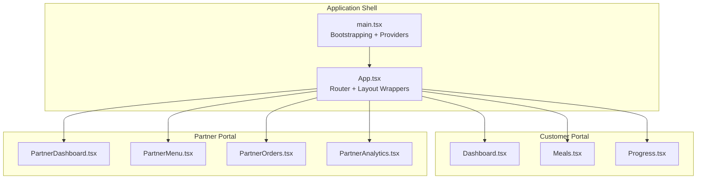
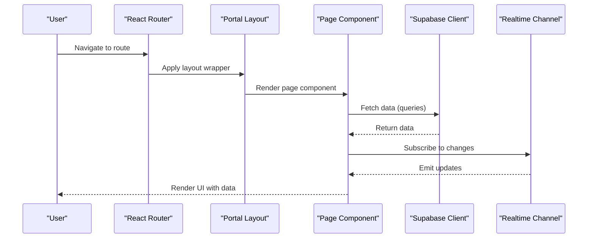
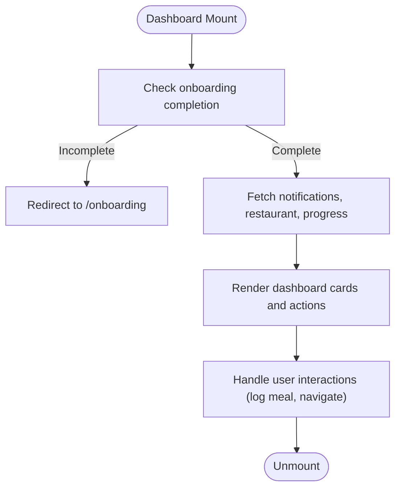
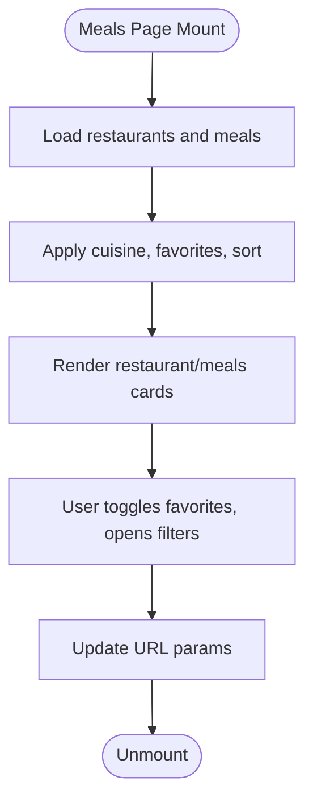
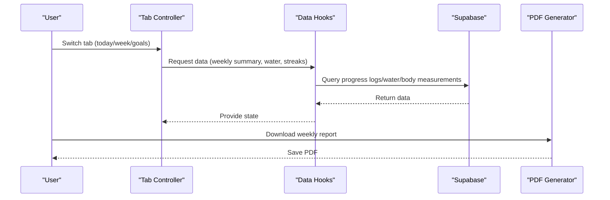
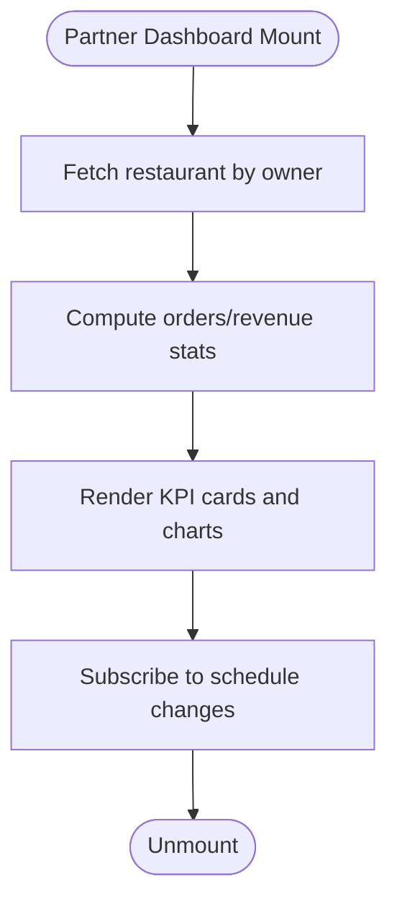
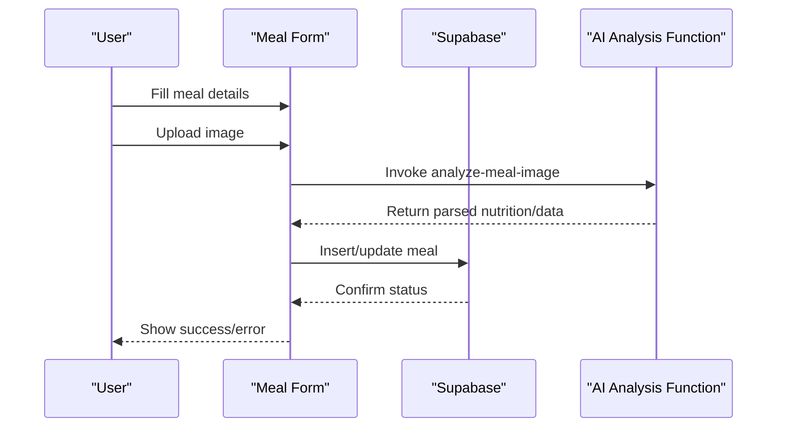
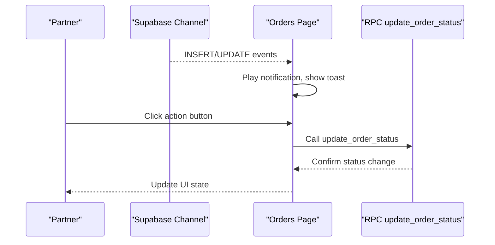
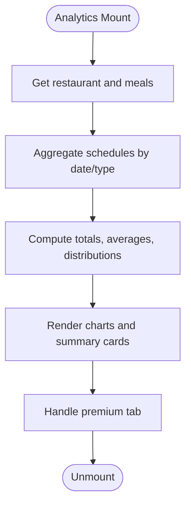
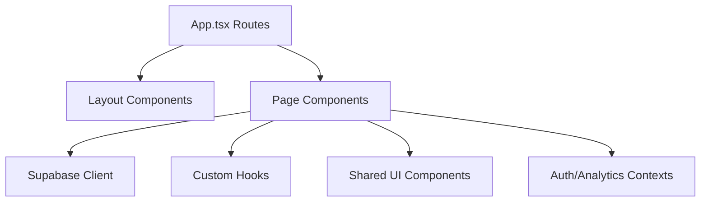

# Pages Structure

<cite>
**Referenced Files in This Document**
- [App.tsx](file://src/App.tsx)
- [main.tsx](file://src/main.tsx)
- [Dashboard.tsx](file://src/pages/Dashboard.tsx)
- [Meals.tsx](file://src/pages/Meals.tsx)
- [Progress.tsx](file://src/pages/Progress.tsx)
- [PartnerDashboard.tsx](file://src/pages/partner/PartnerDashboard.tsx)
- [PartnerMenu.tsx](file://src/pages/partner/PartnerMenu.tsx)
- [PartnerOrders.tsx](file://src/pages/partner/PartnerOrders.tsx)
- [PartnerAnalytics.tsx](file://src/pages/partner/PartnerAnalytics.tsx)
</cite>

## Table of Contents
1. [Introduction](#introduction)
2. [Project Structure](#project-structure)
3. [Core Components](#core-components)
4. [Architecture Overview](#architecture-overview)
5. [Detailed Component Analysis](#detailed-component-analysis)
6. [Dependency Analysis](#dependency-analysis)
7. [Performance Considerations](#performance-considerations)
8. [Troubleshooting Guide](#troubleshooting-guide)
9. [Conclusion](#conclusion)

## Introduction
This document describes the pages structure across all portals in Nutrio: customer, partner, driver, and admin. It explains how pages are organized, their common patterns, shared components, lifecycle, data fetching strategies, and integration with backend services. It also documents portal-specific features, forms, and interactive elements, and clarifies the relationships between pages and their corresponding components.

## Project Structure
The application uses React Router for routing and lazy-loads most pages to optimize initial bundle size. Pages are grouped by portal under dedicated directories:
- Customer portal pages: Dashboard, Meals, Progress, Subscription, Wallet, and related informational pages
- Partner portal pages: Dashboard, Menu, Orders, Analytics, and supporting pages
- Driver portal pages: Dashboard, Orders, Earnings, and related pages
- Admin portal pages: Dashboard, Users, Analytics, and administrative management pages

Routing is centralized in the main application shell with protected routes enforcing roles and approvals where appropriate. Layout wrappers provide consistent navigation and branding per portal.

**Diagram sources**
- [App.tsx:139-739](file://src/App.tsx#L139-L739)
- [main.tsx:1-50](file://src/main.tsx#L1-L50)

**Section sources**
- [App.tsx:139-739](file://src/App.tsx#L139-L739)
- [main.tsx:1-50](file://src/main.tsx#L1-L50)

## Core Components
Common patterns and shared components across portals include:
- ProtectedRoute: Enforces authentication and role-based access
- Layout wrappers: CustomerLayout, PartnerLayout, DriverLayout, AdminLayout
- Navigation: CustomerNavigation, PartnerSidebar, DriverNavigation
- Shared UI: Buttons, Cards, Inputs, Skeleton loaders, Toast notifications
- Data fetching: Supabase client integration and TanStack Query for caching
- Real-time updates: Supabase real-time channels for live data synchronization

These patterns ensure consistent UX and maintainability across portals.

**Section sources**
- [App.tsx:1-15](file://src/App.tsx#L1-L15)
- [App.tsx:364-724](file://src/App.tsx#L364-L724)

## Architecture Overview
The routing architecture separates concerns by portal and wraps customer pages with a layout for consistent navigation. Protected routes enforce roles and approval states for partner and admin areas. Real-time updates are achieved via Supabase channels subscribed to in portal pages.

**Diagram sources**
- [App.tsx:174-363](file://src/App.tsx#L174-L363)
- [App.tsx:364-469](file://src/App.tsx#L364-L469)
- [App.tsx:470-698](file://src/App.tsx#L470-L698)

## Detailed Component Analysis

### Customer Portal Pages

#### Dashboard
- Purpose: Central hub displaying active plan, daily nutrition summary, quick actions, recent orders, and announcements.
- Lifecycle: Redirects to onboarding if profile is incomplete; fetches unread notifications, restaurant ownership, and today's nutrition progress.
- Data fetching: Uses Supabase queries for notifications, restaurants, progress logs; integrates with hooks for subscription and platform settings.
- Interactive elements: Log meal dialog, quick actions, navigation to tracker, subscription, favorites, and progress.
- Integration: Links to notifications, profile, and other customer-centric pages.

**Diagram sources**
- [Dashboard.tsx:107-147](file://src/pages/Dashboard.tsx#L107-L147)
- [Dashboard.tsx:167-174](file://src/pages/Dashboard.tsx#L167-L174)

**Section sources**
- [Dashboard.tsx:47-566](file://src/pages/Dashboard.tsx#L47-L566)

#### Meals
- Purpose: Browse restaurants and meals with filtering, sorting, and favorites.
- Lifecycle: Applies filters (cuisine, favorites, sort), loads skeleton cards, and renders lists or grids.
- Data fetching: Queries restaurants and meals, computes counts, and transforms data for display.
- Forms and interactions: Toggle favorites, open filters sheet, and navigate to restaurant/meals detail.
- Integration: Uses Supabase for data and haptics for native feel.

**Diagram sources**
- [Meals.tsx:721-800](file://src/pages/Meals.tsx#L721-L800)
- [Meals.tsx:675-700](file://src/pages/Meals.tsx#L675-L700)

**Section sources**
- [Meals.tsx:1-1195](file://src/pages/Meals.tsx#L1-L1195)

#### Progress
- Purpose: Track daily nutrition, water intake, weight, streaks, and weekly insights.
- Lifecycle: Manages tabbed views (today, week, goals), fetches daily and weekly data, and supports report generation.
- Data fetching: Queries progress logs, water intake, body measurements, and weekly summaries.
- Forms and interactions: Quick water logging, weight entry form, history management, and report download.
- Integration: Generates PDF reports and uses smart recommendations.

**Diagram sources**
- [Progress.tsx:43-687](file://src/pages/Progress.tsx#L43-L687)

**Section sources**
- [Progress.tsx:1-687](file://src/pages/Progress.tsx#L1-L687)

### Partner Portal Pages

#### Dashboard
- Purpose: Overview of restaurant status, KPIs, recent schedules, and quick actions.
- Lifecycle: Loads restaurant data, calculates stats (orders, revenue), and subscribes to real-time schedule changes.
- Data fetching: Queries restaurant, meals, and schedules; computes totals and weekly performance.
- Interactions: Toggle restaurant open/closed, navigate to menu, orders, analytics, payouts, settings.
- Integration: Uses Supabase channels for live updates.

**Diagram sources**
- [PartnerDashboard.tsx:119-266](file://src/pages/partner/PartnerDashboard.tsx#L119-L266)

**Section sources**
- [PartnerDashboard.tsx:70-687](file://src/pages/partner/PartnerDashboard.tsx#L70-L687)

#### Menu
- Purpose: Manage menu items, categories, availability, pricing, and diet tags; integrate AI analysis.
- Lifecycle: Loads meals, diet tags, and add-ons; validates forms; handles AI image analysis.
- Data fetching: Queries meals, diet tags, add-ons; batch-fetches add-ons per meal.
- Forms and interactions: Add/edit/delete meals, manage availability, select diet tags, attach add-ons, AI analysis.
- Integration: Supabase RPC for AI analysis and real-time approval status updates.

**Diagram sources**
- [PartnerMenu.tsx:398-452](file://src/pages/partner/PartnerMenu.tsx#L398-L452)

**Section sources**
- [PartnerMenu.tsx:166-1031](file://src/pages/partner/PartnerMenu.tsx#L166-L1031)

#### Orders
- Purpose: Manage order lifecycle from pending to completed, with real-time updates and handoff to delivery.
- Lifecycle: Subscribes to schedule changes, plays notifications, and updates order status via RPC.
- Data fetching: Joins schedules with meals, addresses, and addons; resolves customer info.
- Interactions: Accept/prepare/mark ready/out-for-delivery/cancel orders; view delivery handoff.
- Integration: Supabase RPC for status transitions and real-time channels.

**Diagram sources**
- [PartnerOrders.tsx:250-308](file://src/pages/partner/PartnerOrders.tsx#L250-L308)

**Section sources**
- [PartnerOrders.tsx:185-801](file://src/pages/partner/PartnerOrders.tsx#L185-L801)

#### Analytics
- Purpose: Basic analytics and premium insights for performance tracking.
- Lifecycle: Computes daily revenue/orders, top meals, and distributions; handles premium gating.
- Data fetching: Aggregates schedules by date, meal, and type; calculates totals and averages.
- Interactions: Switch between basic and premium tabs; view charts and paywall.
- Integration: Premium analytics dashboard and paywall components.

**Diagram sources**
- [PartnerAnalytics.tsx:76-191](file://src/pages/partner/PartnerAnalytics.tsx#L76-L191)

**Section sources**
- [PartnerAnalytics.tsx:51-436](file://src/pages/partner/PartnerAnalytics.tsx#L51-L436)

### Driver Portal Pages
Driver portal pages are defined in the routing configuration and wrapped with a driver layout. Typical pages include:
- Dashboard: Overview of active deliveries and upcoming shifts
- Orders: View assigned orders and update status during delivery
- Earnings: Track earnings and payout information
- Profile/Settings/Support/Notifications: Account and support-related pages

These pages follow similar patterns: protected routes, Supabase data fetching, and real-time updates where applicable.

**Section sources**
- [App.tsx:709-724](file://src/App.tsx#L709-L724)

### Admin Portal Pages
Admin portal pages are defined in the routing configuration with role enforcement. Typical pages include:
- Dashboard: Administrative overview and announcements
- Users: Manage users and roles
- Analytics: Platform-wide analytics and insights
- Settings/Exports/Payments/Support: Operational and administrative controls

These pages enforce admin role and often integrate with premium analytics and reporting features.

**Section sources**
- [App.tsx:470-698](file://src/App.tsx#L470-L698)

## Dependency Analysis
The routing system centralizes navigation and protection logic. Pages depend on:
- Supabase client for data and real-time
- TanStack Query for caching and background queries
- Auth and Analytics contexts for global state
- Portal-specific layouts and navigation components

**Diagram sources**
- [App.tsx:1-15](file://src/App.tsx#L1-L15)
- [App.tsx:139-739](file://src/App.tsx#L139-L739)

**Section sources**
- [App.tsx:1-15](file://src/App.tsx#L1-L15)
- [App.tsx:139-739](file://src/App.tsx#L139-L739)

## Performance Considerations
- Lazy loading: Pages are lazy-loaded to reduce initial bundle size.
- Skeleton loaders: Used in partner menu and orders to improve perceived performance.
- Real-time updates: Channels minimize polling and keep data fresh.
- Query caching: TanStack Query caches data to avoid redundant requests.
- Conditional rendering: Some pages conditionally render content based on user state to avoid unnecessary work.

## Troubleshooting Guide
- Authentication issues: Protected routes redirect unauthenticated users; ensure AuthContext is initialized.
- Real-time updates not firing: Verify Supabase connection and channel subscriptions; check network connectivity.
- Data not loading: Confirm Supabase service is reachable and tables are properly structured.
- Role-based access: Ensure user roles and approval states are correctly set for partner/admin routes.
- Toast notifications: Use to surface errors and successes from data mutations.

**Section sources**
- [App.tsx:1-15](file://src/App.tsx#L1-L15)
- [PartnerOrders.tsx:250-308](file://src/pages/partner/PartnerOrders.tsx#L250-L308)

## Conclusion
Nutrio’s pages structure is organized around distinct portals with consistent patterns for routing, protection, data fetching, and real-time updates. Customer, partner, driver, and admin pages share common components and providers, ensuring a cohesive user experience across roles. The architecture supports scalability and maintainability through modular components, lazy loading, and robust data integration.