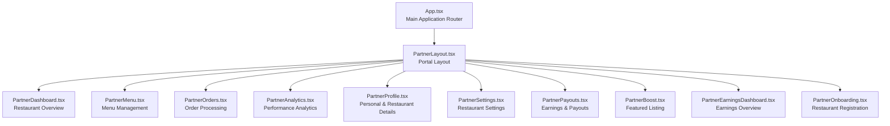
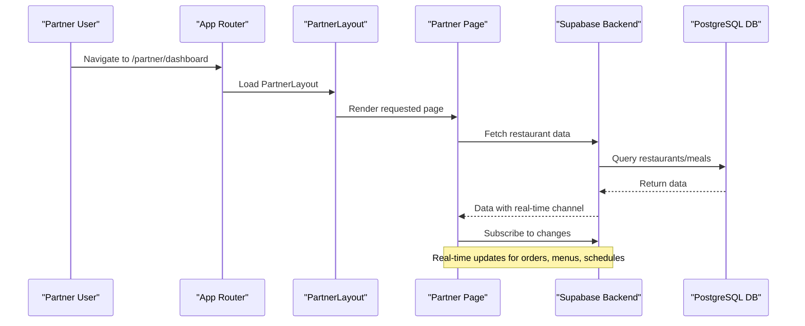
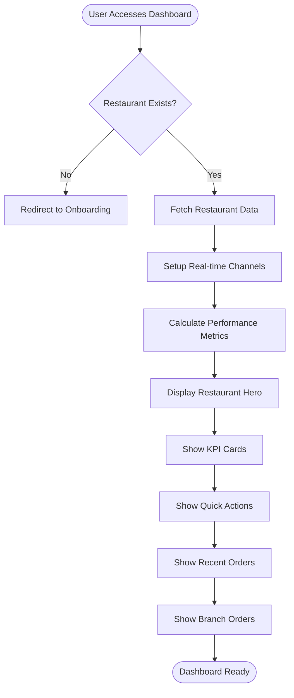
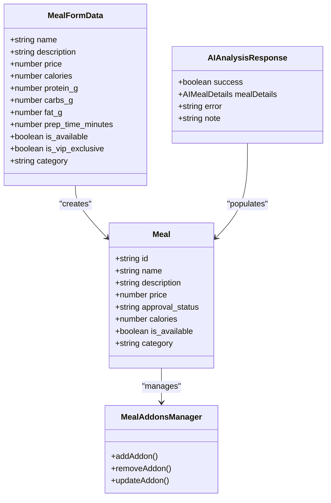
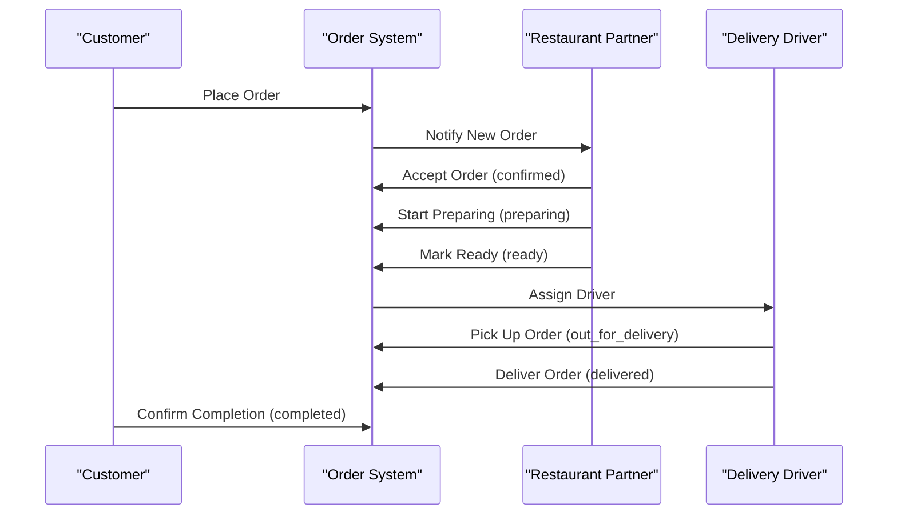
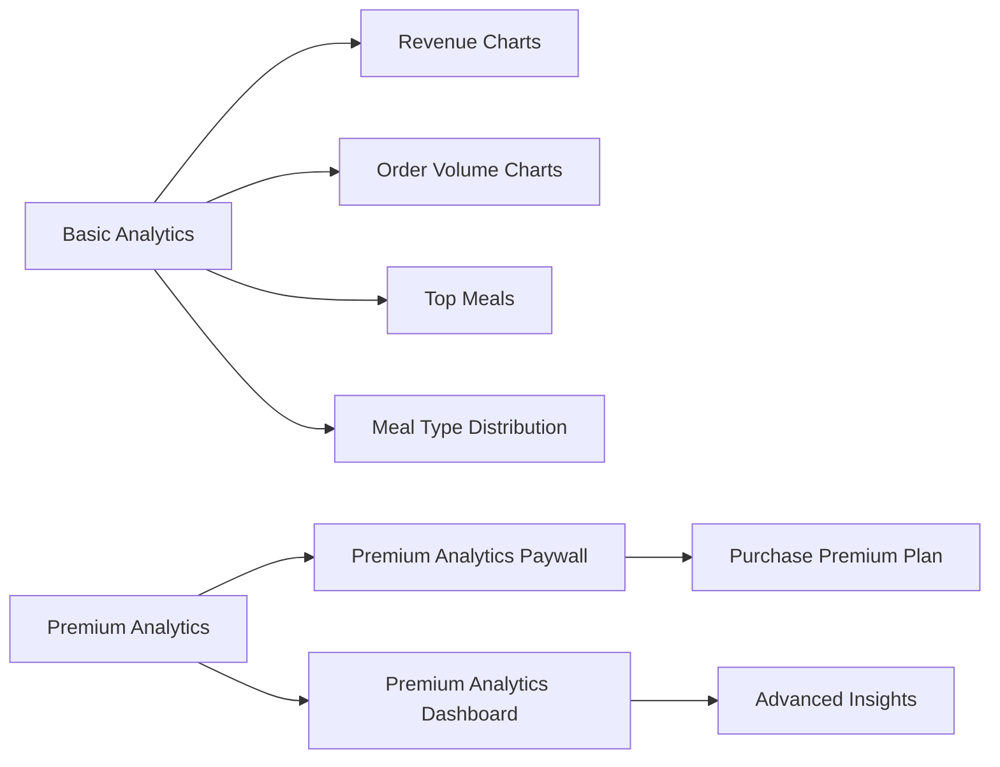
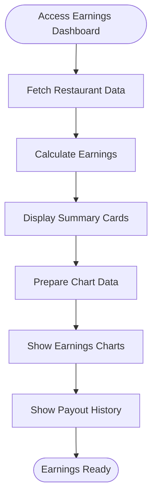
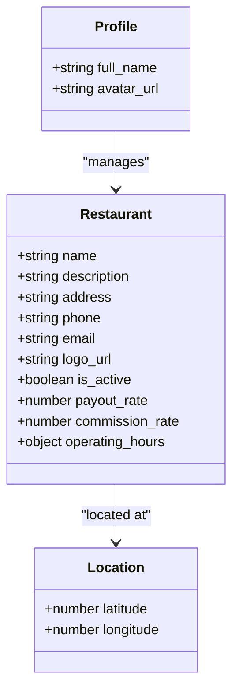
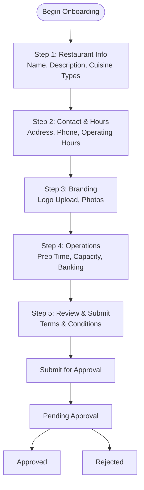
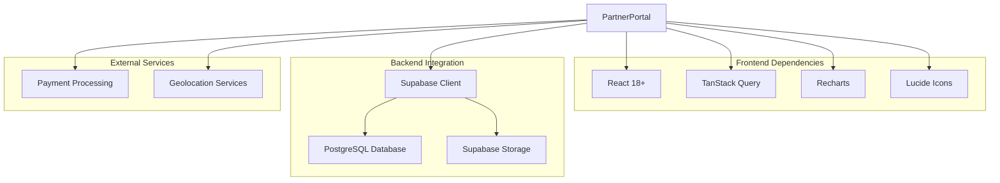

# Partner Portal Pages

<cite>
**Referenced Files in This Document**
- [App.tsx](file://src/App.tsx)
- [PartnerDashboard.tsx](file://src/pages/partner/PartnerDashboard.tsx)
- [PartnerMenu.tsx](file://src/pages/partner/PartnerMenu.tsx)
- [PartnerOrders.tsx](file://src/pages/partner/PartnerOrders.tsx)
- [PartnerAnalytics.tsx](file://src/pages/partner/PartnerAnalytics.tsx)
- [PartnerProfile.tsx](file://src/pages/partner/PartnerProfile.tsx)
- [PartnerSettings.tsx](file://src/pages/partner/PartnerSettings.tsx)
- [PartnerPayouts.tsx](file://src/pages/partner/PartnerPayouts.tsx)
- [PartnerBoost.tsx](file://src/pages/partner/PartnerBoost.tsx)
- [PartnerEarningsDashboard.tsx](file://src/pages/partner/PartnerEarningsDashboard.tsx)
- [PartnerOnboarding.tsx](file://src/pages/partner/PartnerOnboarding.tsx)
- [PartnerLayout.tsx](file://src/components/PartnerLayout.tsx)
- [PartnerBranchOrders.tsx](file://src/components/partner/PartnerBranchOrders.tsx)
- [PartnerDeliveryHandoff.tsx](file://src/components/partner/PartnerDeliveryHandoff.tsx)
- [PremiumAnalyticsDashboard.tsx](file://src/components/PremiumAnalyticsDashboard.tsx)
- [PremiumAnalyticsPaywall.tsx](file://src/components/PremiumAnalyticsPaywall.tsx)
- [usePremiumAnalytics.ts](file://src/hooks/usePremiumAnalytics.ts)
</cite>

## Table of Contents
1. [Introduction](#introduction)
2. [Project Structure](#project-structure)
3. [Core Components](#core-components)
4. [Architecture Overview](#architecture-overview)
5. [Detailed Component Analysis](#detailed-component-analysis)
6. [Dependency Analysis](#dependency-analysis)
7. [Performance Considerations](#performance-considerations)
8. [Troubleshooting Guide](#troubleshooting-guide)
9. [Conclusion](#conclusion)

## Introduction
This document provides comprehensive documentation for the Nutrio Partner Portal, covering all partner-facing pages and workflows. The portal enables restaurant partners to manage their restaurant, menu, orders, analytics, earnings, and profile settings. It includes onboarding flows, menu configuration, order fulfillment workflows, performance analytics, and integration points with the broader platform ecosystem.

## Project Structure
The Partner Portal is integrated into the main application routing and uses a dedicated layout component for consistent navigation and branding. The portal pages are organized under `/src/pages/partner` and leverage Supabase for data persistence and real-time updates.

**Diagram sources**
- [App.tsx:364-469](file://src/App.tsx#L364-L469)
- [PartnerLayout.tsx:1-200](file://src/components/PartnerLayout.tsx#L1-L200)

**Section sources**
- [App.tsx:364-469](file://src/App.tsx#L364-L469)

## Core Components
The Partner Portal relies on several core components that provide shared functionality across pages:

- **PartnerLayout**: Provides consistent navigation, sidebar, and responsive layout for partner pages
- **Real-time Data Integration**: Uses Supabase channels for live updates on orders, menu approvals, and schedules
- **Protected Routing**: Implements role-based access control with approval requirements for partner routes
- **Analytics Components**: Includes premium analytics dashboard and paywall components

Key features across components:
- Real-time order notifications with audio feedback
- Approval workflow integration for menu items
- Subscription-based pricing model with platform commission
- Multi-step onboarding process for restaurant registration

**Section sources**
- [PartnerLayout.tsx:1-200](file://src/components/PartnerLayout.tsx#L1-L200)
- [PartnerDashboard.tsx:94-117](file://src/pages/partner/PartnerDashboard.tsx#L94-L117)
- [PartnerMenu.tsx:203-242](file://src/pages/partner/PartnerMenu.tsx#L203-L242)

## Architecture Overview
The Partner Portal follows a modular architecture with clear separation of concerns:

**Diagram sources**
- [App.tsx:364-469](file://src/App.tsx#L364-L469)
- [PartnerDashboard.tsx:94-117](file://src/pages/partner/PartnerDashboard.tsx#L94-L117)

## Detailed Component Analysis

### Restaurant Partner Dashboard
The dashboard serves as the central hub for restaurant partners, providing an overview of key metrics and quick access to essential functions.

**Diagram sources**
- [PartnerDashboard.tsx:70-317](file://src/pages/partner/PartnerDashboard.tsx#L70-L317)

Key features:
- Real-time order notifications with audio feedback
- Restaurant status toggle (open/closed)
- Performance metrics including revenue, orders, and weekly trends
- Quick access to menu, orders, analytics, and payouts
- Branch orders integration for multi-location setups

**Section sources**
- [PartnerDashboard.tsx:70-687](file://src/pages/partner/PartnerDashboard.tsx#L70-L687)

### Menu Management System
The menu management system provides comprehensive tools for managing restaurant offerings with approval workflows and AI-powered assistance.

**Diagram sources**
- [PartnerMenu.tsx:76-164](file://src/pages/partner/PartnerMenu.tsx#L76-L164)

Menu management capabilities:
- Multi-view support (grid/list)
- Category filtering and sorting
- Approval workflow for high-value items (>50 QAR)
- AI-powered meal analysis for automatic nutrition data extraction
- Add-on management system
- Dietary tags integration
- Real-time approval status updates

**Section sources**
- [PartnerMenu.tsx:166-1031](file://src/pages/partner/PartnerMenu.tsx#L166-L1031)

### Order Processing Interface
The order processing interface manages the complete order lifecycle from placement to completion, with automated status transitions and delivery handoff.

**Diagram sources**
- [PartnerOrders.tsx:35-142](file://src/pages/partner/PartnerOrders.tsx#L35-L142)

Order processing features:
- Real-time order status updates with visual progress indicators
- Automated status transitions (no manual driver handoff)
- Delivery address and customer information display
- Add-on tracking and nutritional information
- Cancellation handling with reason capture
- Audio notifications for new orders
- Manual refresh capability

**Section sources**
- [PartnerOrders.tsx:185-800](file://src/pages/partner/PartnerOrders.tsx#L185-L800)

### Analytics Dashboard
The analytics dashboard provides comprehensive performance insights with both basic and premium analytics capabilities.

**Diagram sources**
- [PartnerAnalytics.tsx:51-436](file://src/pages/partner/PartnerAnalytics.tsx#L51-L436)
- [PremiumAnalyticsDashboard.tsx:1-200](file://src/components/PremiumAnalyticsDashboard.tsx#L1-L200)
- [PremiumAnalyticsPaywall.tsx:1-200](file://src/components/PremiumAnalyticsPaywall.tsx#L1-L200)

Analytics capabilities:
- 7-day revenue and order volume trends
- Top-performing meals analysis
- Meal type distribution visualization
- Premium analytics with advanced insights
- Export functionality for CSV reporting
- Real-time data updates

**Section sources**
- [PartnerAnalytics.tsx:51-436](file://src/pages/partner/PartnerAnalytics.tsx#L51-L436)

### Earnings Tracking
The earnings tracking system provides detailed financial insights with subscription-based pricing and platform commission calculations.

**Diagram sources**
- [PartnerEarningsDashboard.tsx:59-527](file://src/pages/partner/PartnerEarningsDashboard.tsx#L59-L527)

Earnings features:
- Subscription-based pricing model with platform commission
- Real-time earnings calculation (net after 18% commission)
- 7/30/90-day time range filtering
- Monthly growth rate tracking
- Payout history with status tracking
- Statement download functionality

**Section sources**
- [PartnerEarningsDashboard.tsx:59-527](file://src/pages/partner/PartnerEarningsDashboard.tsx#L59-L527)

### Profile Management
The profile management system handles both personal and restaurant information with location services and branding capabilities.

**Diagram sources**
- [PartnerProfile.tsx:16-238](file://src/pages/partner/PartnerProfile.tsx#L16-L238)
- [PartnerSettings.tsx:17-357](file://src/pages/partner/PartnerSettings.tsx#L17-L357)

Profile management features:
- Personal information management
- Restaurant branding (logo upload)
- Contact and location details
- Operating hours configuration
- Geolocation services for pickup locations
- Bank account integration for payouts

**Section sources**
- [PartnerProfile.tsx:16-238](file://src/pages/partner/PartnerProfile.tsx#L16-L238)
- [PartnerSettings.tsx:43-357](file://src/pages/partner/PartnerSettings.tsx#L43-L357)

### Partner Onboarding Process
The onboarding process guides restaurant partners through multi-step registration with validation and approval workflows.

**Diagram sources**
- [PartnerOnboarding.tsx:107-927](file://src/pages/partner/PartnerOnboarding.tsx#L107-L927)

Onboarding features:
- Multi-step wizard with progress tracking
- Real-time validation for required fields
- File upload with size restrictions
- Operating hours configuration
- Banking information collection
- Terms and conditions acceptance
- Approval status tracking

**Section sources**
- [PartnerOnboarding.tsx:125-927](file://src/pages/partner/PartnerOnboarding.tsx#L125-L927)

### Additional Partner Pages
The portal includes several specialized pages for enhanced functionality:

- **PartnerBoost**: Featured restaurant listings with pricing packages
- **PartnerPayouts**: Comprehensive earnings tracking and payout management
- **PartnerNotifications**: Notification preferences and alerts management

**Section sources**
- [PartnerBoost.tsx:38-384](file://src/pages/partner/PartnerBoost.tsx#L38-L384)
- [PartnerPayouts.tsx:227-985](file://src/pages/partner/PartnerPayouts.tsx#L227-L985)

## Dependency Analysis
The Partner Portal has well-defined dependencies and integration points:

**Diagram sources**
- [App.tsx:1-12](file://src/App.tsx#L1-L12)
- [PartnerMenu.tsx:54-56](file://src/pages/partner/PartnerMenu.tsx#L54-L56)

Key dependencies:
- **State Management**: TanStack Query for data fetching and caching
- **Data Visualization**: Recharts for interactive charts and graphs
- **Real-time Updates**: Supabase Postgres changes for live data synchronization
- **Storage**: Supabase Storage for media uploads (logos, photos)
- **Authentication**: Supabase Auth for secure user sessions

**Section sources**
- [App.tsx:1-12](file://src/App.tsx#L1-L12)
- [PartnerDashboard.tsx:32-36](file://src/pages/partner/PartnerDashboard.tsx#L32-L36)

## Performance Considerations
The Partner Portal implements several performance optimization strategies:

- **Code Splitting**: Lazy loading of partner portal pages to reduce initial bundle size
- **Data Caching**: TanStack Query for efficient data caching and background refetching
- **Real-time Updates**: Optimized Supabase channels with proper cleanup
- **Image Optimization**: Lazy loading and responsive image handling
- **Memory Management**: Proper cleanup of event listeners and timers
- **Network Efficiency**: Batch queries for related data (meals, addons, schedules)

Best practices implemented:
- Debounced search and filter operations
- Virtualized lists for large datasets
- Efficient re-rendering with React.memo and useMemo
- Background data synchronization with optimistic updates

## Troubleshooting Guide
Common issues and solutions:

**Authentication Issues**
- Verify user role is set to "restaurant" after onboarding
- Check session validity and re-authenticate if needed
- Ensure proper redirect from auth pages

**Data Loading Problems**
- Check network connectivity and API response status
- Verify Supabase service configuration
- Monitor query execution time and optimize queries

**Real-time Updates Not Working**
- Confirm Supabase channel subscription is active
- Check for proper cleanup in useEffect return functions
- Verify database triggers are enabled

**Performance Issues**
- Monitor query cache effectiveness
- Check for memory leaks in long-running components
- Optimize chart rendering for large datasets

**Section sources**
- [PartnerDashboard.tsx:256-266](file://src/pages/partner/PartnerDashboard.tsx#L256-L266)
- [PartnerMenu.tsx:294-297](file://src/pages/partner/PartnerMenu.tsx#L294-L297)

## Conclusion
The Nutrio Partner Portal provides a comprehensive, real-time platform for restaurant partners to manage all aspects of their business operations. The system integrates seamlessly with Supabase for data management and real-time updates, while offering robust analytics, approval workflows, and performance tracking. The modular architecture ensures maintainability and scalability, supporting both current needs and future enhancements.

The portal's design emphasizes user experience through intuitive navigation, real-time feedback, and comprehensive reporting capabilities, making it an essential tool for restaurant partners operating within the Nutrio ecosystem.