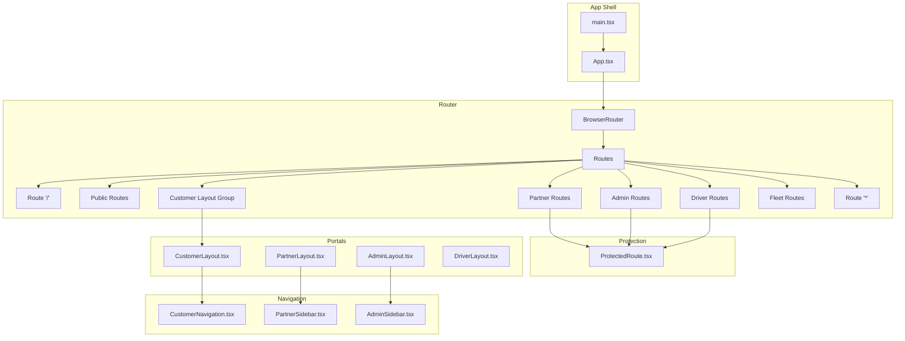
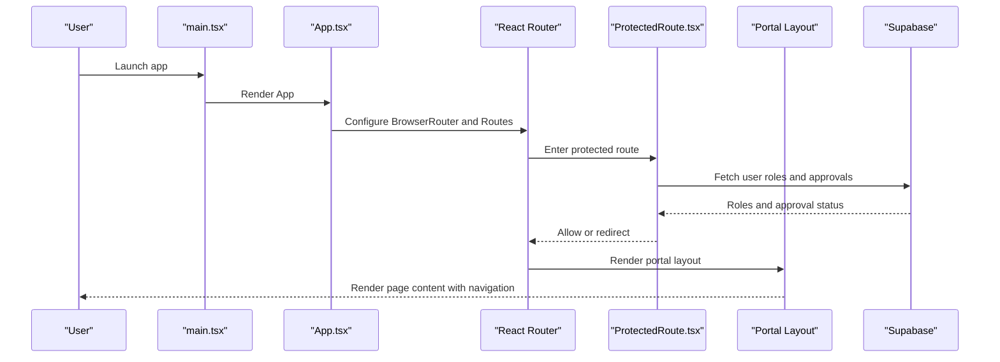
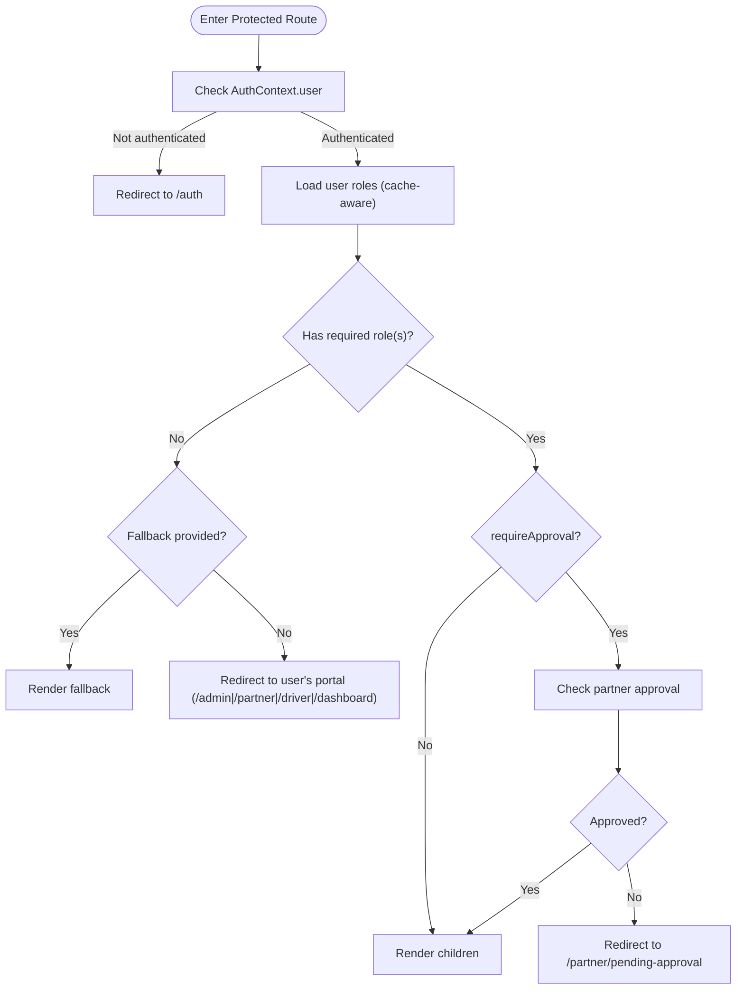
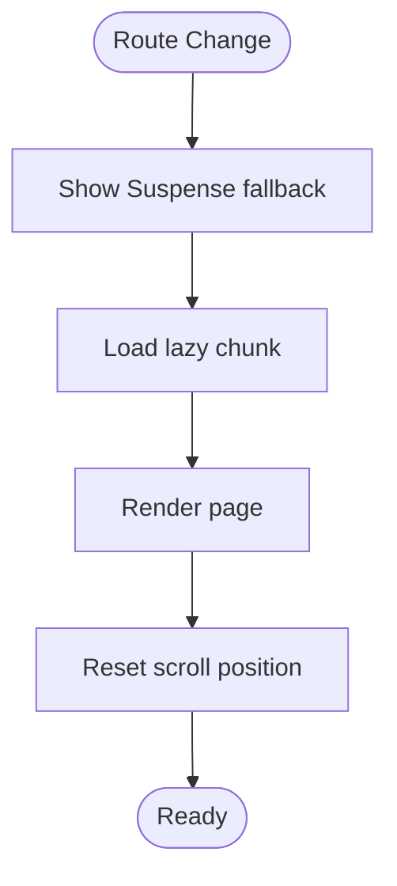
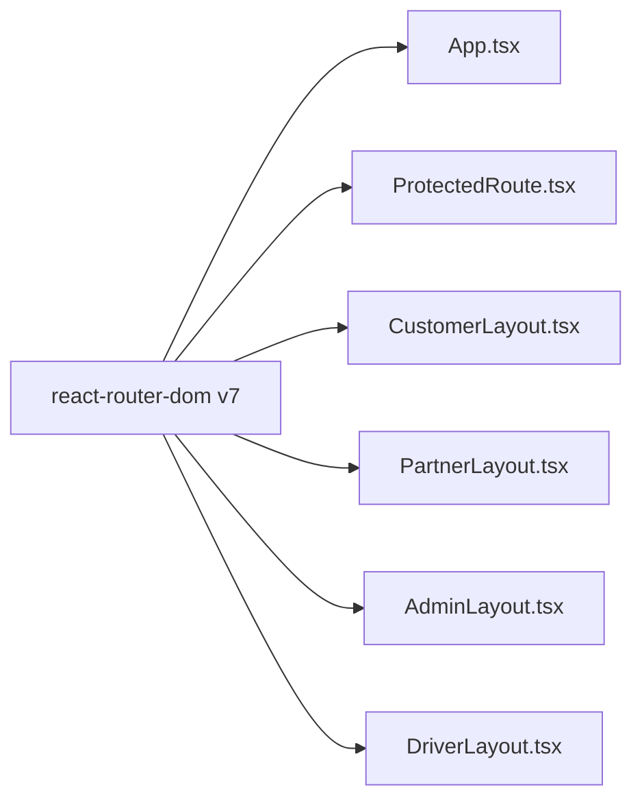

# Routing & Navigation

<cite>
**Referenced Files in This Document**
- [App.tsx](file://src/App.tsx)
- [ProtectedRoute.tsx](file://src/components/ProtectedRoute.tsx)
- [CustomerLayout.tsx](file://src/components/CustomerLayout.tsx)
- [PartnerLayout.tsx](file://src/components/PartnerLayout.tsx)
- [AdminLayout.tsx](file://src/components/AdminLayout.tsx)
- [DriverLayout.tsx](file://src/components/DriverLayout.tsx)
- [CustomerNavigation.tsx](file://src/components/CustomerNavigation.tsx)
- [PartnerSidebar.tsx](file://src/components/PartnerSidebar.tsx)
- [AdminSidebar.tsx](file://src/components/AdminSidebar.tsx)
- [main.tsx](file://src/main.tsx)
- [package-lock.json](file://package-lock.json)
</cite>

## Table of Contents
1. [Introduction](#introduction)
2. [Project Structure](#project-structure)
3. [Core Components](#core-components)
4. [Architecture Overview](#architecture-overview)
5. [Detailed Component Analysis](#detailed-component-analysis)
6. [Dependency Analysis](#dependency-analysis)
7. [Performance Considerations](#performance-considerations)
8. [Troubleshooting Guide](#troubleshooting-guide)
9. [Conclusion](#conclusion)

## Introduction
This document explains the routing and navigation system of the multi-portal Nutrio application. It covers React Router configuration, route protection with role-based access control, portal-specific layouts and navigation patterns, lazy loading strategies, route grouping by feature areas, and performance optimizations. It also documents navigation components, breadcrumbs, sidebars, and mobile navigation patterns, along with best practices for URL patterns and navigation state management across customer, partner, driver, and admin roles.

## Project Structure
The routing system is centralized in the application shell and composed of:
- A single-router configuration using React Router v7 with a BrowserRouter provider
- ProtectedRoute component for authentication and role checks
- Portal-specific layouts (CustomerLayout, PartnerLayout, AdminLayout, DriverLayout)
- Navigation components (CustomerNavigation, PartnerSidebar, AdminSidebar)
- Lazy-loaded page modules grouped by feature area
- Fleet routes composition via a dedicated routes module

**Diagram sources**
- [App.tsx:139-739](file://src/App.tsx#L139-L739)
- [ProtectedRoute.tsx:139-230](file://src/components/ProtectedRoute.tsx#L139-L230)
- [CustomerLayout.tsx:8-21](file://src/components/CustomerLayout.tsx#L8-L21)
- [PartnerLayout.tsx:27-140](file://src/components/PartnerLayout.tsx#L27-L140)
- [AdminLayout.tsx:25-130](file://src/components/AdminLayout.tsx#L25-L130)
- [DriverLayout.tsx:16-182](file://src/components/DriverLayout.tsx#L16-L182)
- [CustomerNavigation.tsx:8-60](file://src/components/CustomerNavigation.tsx#L8-L60)
- [PartnerSidebar.tsx:46-132](file://src/components/PartnerSidebar.tsx#L46-L132)
- [AdminSidebar.tsx:68-151](file://src/components/AdminSidebar.tsx#L68-L151)
- [main.tsx:20-47](file://src/main.tsx#L20-L47)

**Section sources**
- [App.tsx:139-739](file://src/App.tsx#L139-L739)
- [main.tsx:20-47](file://src/main.tsx#L20-L47)

## Core Components
- Router and Routes: Single-router configuration with nested routes per portal and lazy-loaded pages.
- ProtectedRoute: Centralized authentication and role-based access control with caching and approval checks.
- Portal Layouts: CustomerLayout, PartnerLayout, AdminLayout, and DriverLayout provide consistent UI shells, breadcrumbs, sidebars, and mobile navigation.
- Navigation Components: CustomerNavigation for bottom tab bar; PartnerSidebar and AdminSidebar for desktop-like side navigation; DriverLayout includes a bottom navigation and online toggle.

Key responsibilities:
- App.tsx defines all routes, lazy loads feature groups, and wraps portal routes with layouts and protection.
- ProtectedRoute enforces authentication, role hierarchy, and optional approval gating.
- Layouts encapsulate portal UX patterns, breadcrumbs, and sidebar navigation.
- Navigation components manage active states and user actions.

**Section sources**
- [App.tsx:16-118](file://src/App.tsx#L16-L118)
- [ProtectedRoute.tsx:7-36](file://src/components/ProtectedRoute.tsx#L7-L36)
- [CustomerLayout.tsx:8-21](file://src/components/CustomerLayout.tsx#L8-L21)
- [PartnerLayout.tsx:27-140](file://src/components/PartnerLayout.tsx#L27-L140)
- [AdminLayout.tsx:25-130](file://src/components/AdminLayout.tsx#L25-L130)
- [DriverLayout.tsx:16-182](file://src/components/DriverLayout.tsx#L16-L182)
- [CustomerNavigation.tsx:8-60](file://src/components/CustomerNavigation.tsx#L8-L60)
- [PartnerSidebar.tsx:46-132](file://src/components/PartnerSidebar.tsx#L46-L132)
- [AdminSidebar.tsx:68-151](file://src/components/AdminSidebar.tsx#L68-L151)

## Architecture Overview
The routing architecture follows a layered pattern:
- Application bootstrap initializes monitoring and native features, then renders App.
- App sets up BrowserRouter and defines all routes.
- ProtectedRoute performs authentication and role checks against Supabase-backed user roles.
- Portal layouts provide shared UI and navigation patterns.
- Lazy loading splits bundles by feature area to optimize initial load.

**Diagram sources**
- [main.tsx:20-47](file://src/main.tsx#L20-L47)
- [App.tsx:139-739](file://src/App.tsx#L139-L739)
- [ProtectedRoute.tsx:139-230](file://src/components/ProtectedRoute.tsx#L139-L230)

## Detailed Component Analysis

### React Router Configuration and Route Groups
- Router setup: BrowserRouter wraps the entire app; Suspense provides a global loader while lazy chunks load.
- Route groups:
  - Public pages (eager): Index, Auth, ResetPassword, About, Contact, Privacy, Terms, FAQ.
  - Customer pages (lazy): Dashboard, Meals, RestaurantDetail, MealDetail, Schedule, Progress, Tracker, WaterTracker, StepCounter, WeightTracking, Profile, Dietary, Policies, PersonalInfo, LiveMap, Subscription, Notifications, Favorites, Settings, Affiliate, ReferralTracking, Addresses, Support, Wallet, InvoiceHistory, Checkout.
  - Partner pages (lazy): PartnerAuth, PartnerDashboard, PartnerMenu, PartnerOrders, PartnerSettings, PartnerAnalytics, PartnerNotifications, PartnerProfile, PartnerPayouts, PartnerOnboarding, PartnerBoost, PartnerAddons, PendingApproval, PartnerEarningsDashboard.
  - Admin pages (lazy): AdminDashboard, AdminRestaurants, AdminRestaurantDetail, AdminFeatured, AdminUsers, AdminOrders, AdminSubscriptions, AdminAnalytics, AdminSettings, AdminExports, AdminPayouts, AdminAffiliatePayouts, AdminAffiliateApplications, AdminMilestones, AdminDietTags, AdminPromotions, AdminSupport, AdminNotifications, AdminDrivers, AdminDeliveries, AdminIPManagement, AdminFreezeManagement, AdminRetentionAnalytics, AdminStreakRewards, AdminProfitDashboard, AdminMealApprovals, AdminPremiumAnalytics.
  - Driver pages (lazy): DriverAuth, DriverOnboarding, DriverDashboard, DriverOrders, DriverOrderDetail, DriverHistory, DriverEarnings, DriverPayouts, DriverProfile, DriverSettings, DriverSupport, DriverNotifications.
  - Fleet routes: Imported from a dedicated module and included inline.
  - Fallback: "*" navigates to NotFound.

Lazy loading strategy:
- Split by feature area to reduce initial bundle size.
- Suspense fallback ensures smooth transitions during chunk fetch.
- ScrollToTop resets scroll position on route changes to address Capacitor WebView quirks.

URL patterns:
- Customer: /dashboard, /meals, /restaurant/:id, /meals/:id, /schedule, /progress, /tracker, /water-tracker, /step-counter, /weight-tracking, /dietary, /policies, /personal-info, /profile, /subscription, /wallet, /checkout, /invoices, /notifications, /favorites, /settings, /affiliate, /affiliate/tracking, /addresses, /support.
- Partner: /partner/auth, /partner/onboarding, /partner, /partner/menu, /partner/addons, /partner/orders, /partner/settings, /partner/analytics, /partner/notifications, /partner/profile, /partner/payouts, /partner/boost, /partner/pending-approval, /partner/earnings.
- Admin: /admin, /admin/restaurants, /admin/restaurants/:id, /admin/featured, /admin/meal-approvals, /admin/users, /admin/orders, /admin/subscriptions, /admin/analytics, /admin/income, /admin/profit, /admin/settings, /admin/exports, /admin/payouts, /admin/affiliate-payouts, /admin/premium-analytics, /admin/affiliate-applications, /admin/affiliate-milestones, /admin/streak-rewards, /admin/diet-tags, /admin/promotions, /admin/announcements, /admin/support, /admin/notifications, /admin/drivers, /admin/deliveries, /admin/ip-management, /admin/freeze-management, /admin/retention-analytics.
- Driver: /driver/auth, /driver/onboarding, /driver (with nested routes under DriverLayout), including index, orders, orders/:id, history, earnings, payouts, profile, settings, support, notifications.

**Section sources**
- [App.tsx:16-118](file://src/App.tsx#L16-L118)
- [App.tsx:149-729](file://src/App.tsx#L149-L729)
- [App.tsx:127-135](file://src/App.tsx#L127-L135)

### Route Protection and Role-Based Access Control
ProtectedRoute implements:
- Authentication check via AuthContext; redirects unauthenticated users to /auth with location state.
- Role hierarchy enforcement with cached role retrieval from Supabase:
  - Roles include customer, restaurant, partner, driver, staff, admin.
  - Higher roles can access lower-role routes (e.g., admin can access partner routes).
- Optional approval gating for partner routes; redirects to pending-approval when not approved.
- Fallback redirection to user’s primary portal (/admin, /partner, /driver, /dashboard) when role mismatch occurs.
- Helpers: useUserRoles and useHasRole for component-level role checks.

**Diagram sources**
- [ProtectedRoute.tsx:139-230](file://src/components/ProtectedRoute.tsx#L139-L230)

**Section sources**
- [ProtectedRoute.tsx:7-36](file://src/components/ProtectedRoute.tsx#L7-L36)
- [ProtectedRoute.tsx:103-119](file://src/components/ProtectedRoute.tsx#L103-L119)
- [ProtectedRoute.tsx:124-137](file://src/components/ProtectedRoute.tsx#L124-L137)
- [ProtectedRoute.tsx:139-230](file://src/components/ProtectedRoute.tsx#L139-L230)

### Layout System and Navigation Patterns
- CustomerLayout: Wraps customer routes with a light gray background and a persistent bottom navigation bar.
- PartnerLayout: Desktop-style sidebar navigation with breadcrumbs and an action slot; includes a banner for new orders.
- AdminLayout: Desktop-style sidebar navigation with extensive administrative sections and a “View as Customer” shortcut.
- DriverLayout: Mobile-first bottom navigation with an online/offline toggle; fixed bottom navigation bar.

Navigation components:
- CustomerNavigation: Bottom tab bar with icons and labels; active state detection; optional affiliate tab based on approval and platform settings.
- PartnerSidebar: Collapsible sidebar with grouped navigation items; logout action; collapsed state awareness.
- AdminSidebar: Collapsible sidebar with comprehensive administrative sections; logout and “View as Customer” actions.

Breadcrumbs:
- PartnerLayout and AdminLayout render breadcrumbs reflecting the current section and title.

Mobile navigation patterns:
- CustomerNavigation uses a bottom tab bar optimized for thumb-friendly interaction.
- DriverLayout uses a bottom tab bar with an online status toggle.
- PartnerLayout and AdminLayout use a collapsible sidebar for desktop-like navigation.

**Section sources**
- [CustomerLayout.tsx:8-21](file://src/components/CustomerLayout.tsx#L8-L21)
- [CustomerNavigation.tsx:8-60](file://src/components/CustomerNavigation.tsx#L8-L60)
- [PartnerLayout.tsx:27-140](file://src/components/PartnerLayout.tsx#L27-L140)
- [PartnerSidebar.tsx:46-132](file://src/components/PartnerSidebar.tsx#L46-L132)
- [AdminLayout.tsx:25-130](file://src/components/AdminLayout.tsx#L25-L130)
- [AdminSidebar.tsx:68-151](file://src/components/AdminSidebar.tsx#L68-L151)
- [DriverLayout.tsx:16-182](file://src/components/DriverLayout.tsx#L16-L182)

### Lazy Loading Strategy and Performance Optimizations
- Split by feature area: Public pages, customer, partner, admin, driver, and fleet routes are lazy-loaded.
- Suspense fallback: A spinner-based loader is shown while chunks are downloading.
- Initial bundle minimization: Critical pages (Index, Auth, ResetPassword, About, Contact, Privacy, Terms, FAQ) are eagerly loaded to improve perceived performance.
- Scroll restoration: ScrollToTop resets scroll on route changes to avoid WebView scroll persistence artifacts.
- Role caching: ProtectedRoute caches role checks for 5 minutes to reduce repeated Supabase queries.

**Diagram sources**
- [App.tsx:120-135](file://src/App.tsx#L120-L135)
- [App.tsx:149-729](file://src/App.tsx#L149-L729)
- [ProtectedRoute.tsx:33-36](file://src/components/ProtectedRoute.tsx#L33-L36)

**Section sources**
- [App.tsx:16-118](file://src/App.tsx#L16-L118)
- [App.tsx:120-135](file://src/App.tsx#L120-L135)
- [ProtectedRoute.tsx:33-36](file://src/components/ProtectedRoute.tsx#L33-L36)

### URL Patterns and Navigation State Management
- URL patterns are organized by portal and feature area, with nested routes for driver portal.
- Navigation state management:
  - Active states computed via location.pathname comparisons in navigation components.
  - Breadcrumbs reflect current section and title.
  - Online/offline state maintained in DriverLayout and persisted via Supabase updates.
  - Role-based redirection ensures users land on appropriate portal dashboards after login or role changes.

Best practices:
- Keep URLs semantic and hierarchical (e.g., /partner/menu, /admin/users).
- Use Navigate for internal redirects (e.g., /orders -> /dashboard).
- Leverage ProtectedRoute props (requiredRole, requireApproval) to enforce access policies consistently.

**Section sources**
- [App.tsx:174-724](file://src/App.tsx#L174-L724)
- [DriverLayout.tsx:75-100](file://src/components/DriverLayout.tsx#L75-L100)
- [PartnerLayout.tsx:104-122](file://src/components/PartnerLayout.tsx#L104-L122)
- [AdminLayout.tsx:95-114](file://src/components/AdminLayout.tsx#L95-L114)

## Dependency Analysis
External routing library:
- React Router v7 is used for routing and navigation primitives.

**Diagram sources**
- [package-lock.json:12030-12055](file://package-lock.json#L12030-L12055)
- [App.tsx:6](file://src/App.tsx#L6)
- [ProtectedRoute.tsx:2](file://src/components/ProtectedRoute.tsx#L2)

**Section sources**
- [package-lock.json:12030-12055](file://package-lock.json#L12030-L12055)
- [App.tsx:6](file://src/App.tsx#L6)
- [ProtectedRoute.tsx:2](file://src/components/ProtectedRoute.tsx#L2)

## Performance Considerations
- Bundle splitting by feature area reduces initial payload.
- Suspense fallback prevents blank screens during navigation.
- Role caching reduces repeated backend calls for role checks.
- Avoid unnecessary re-renders by using memoized selectors and context providers.
- Prefer lazy loading for infrequently accessed routes (admin, driver, partner) to keep customer-facing routes snappy.

## Troubleshooting Guide
Common issues and resolutions:
- Redirect loops on login: Verify ProtectedRoute requiredRole and requireApproval props align with user roles and approval status.
- Incorrect active states: Ensure isActive logic matches route prefixes and special cases (e.g., /dashboard).
- Missing breadcrumbs: Confirm title and subtitle props are passed to PartnerLayout/AdminLayout.
- Offline toggle not updating: Check Supabase connection and driver record presence; verify toast feedback on success/error.
- WebView scroll artifacts: Confirm ScrollToTop effect runs on pathname changes.

**Section sources**
- [ProtectedRoute.tsx:139-230](file://src/components/ProtectedRoute.tsx#L139-L230)
- [DriverLayout.tsx:75-100](file://src/components/DriverLayout.tsx#L75-L100)
- [PartnerLayout.tsx:104-122](file://src/components/PartnerLayout.tsx#L104-L122)
- [AdminLayout.tsx:95-114](file://src/components/AdminLayout.tsx#L95-L114)
- [App.tsx:127-135](file://src/App.tsx#L127-L135)

## Conclusion
The Nutrio routing and navigation system leverages React Router v7 with a centralized ProtectedRoute for robust authentication and role-based access control. Portal-specific layouts and navigation components deliver consistent UX across customer, partner, driver, and admin roles. The lazy-loading strategy and Suspense fallback optimize performance, while role caching and careful URL design ensure a responsive and secure multi-portal experience.