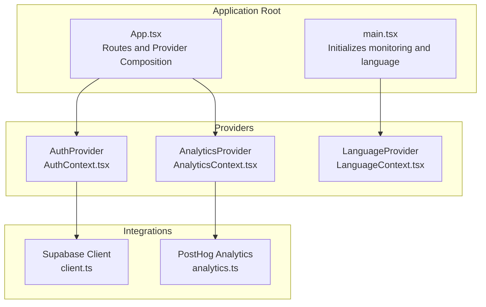
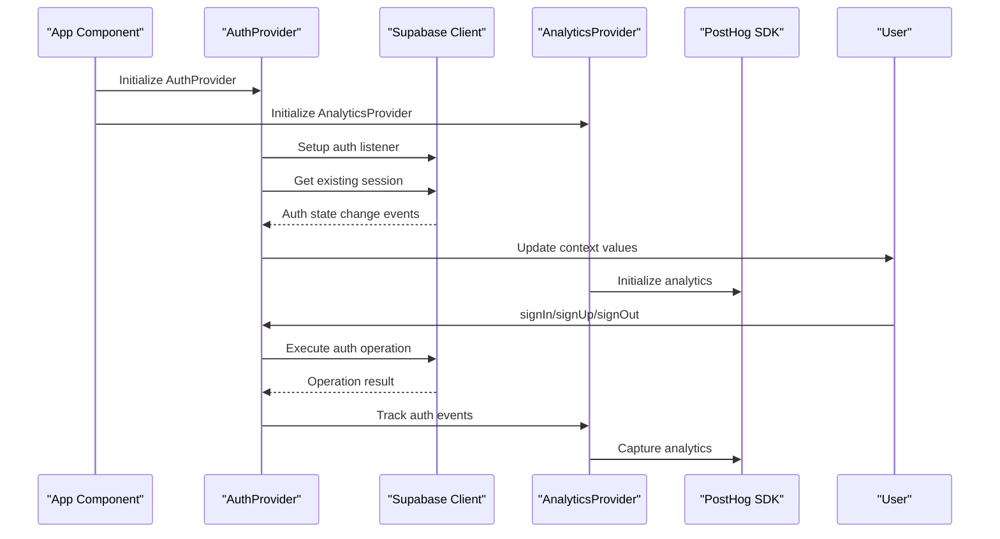
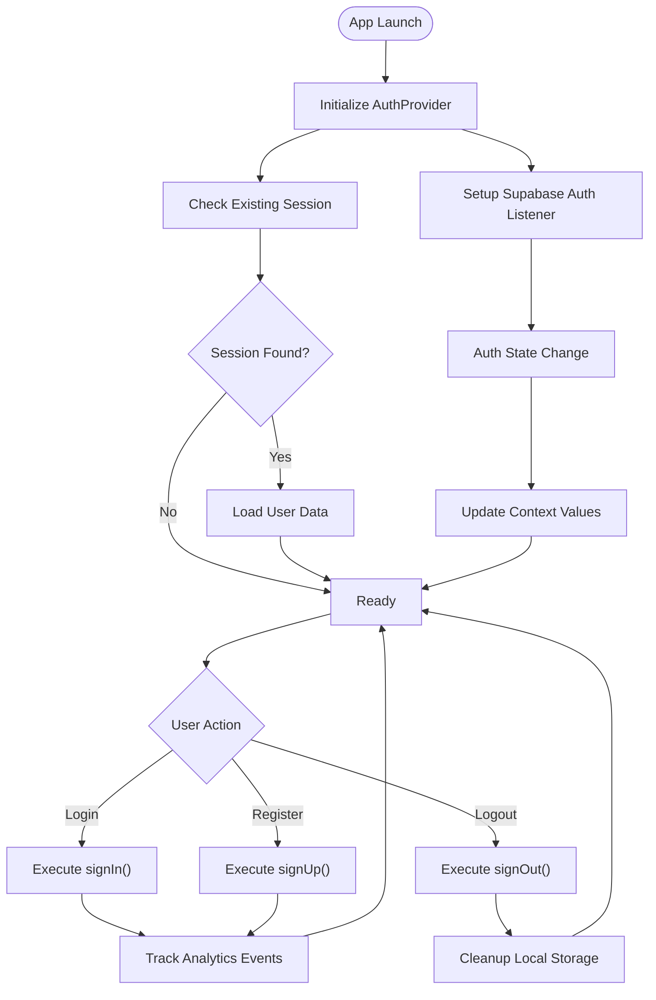
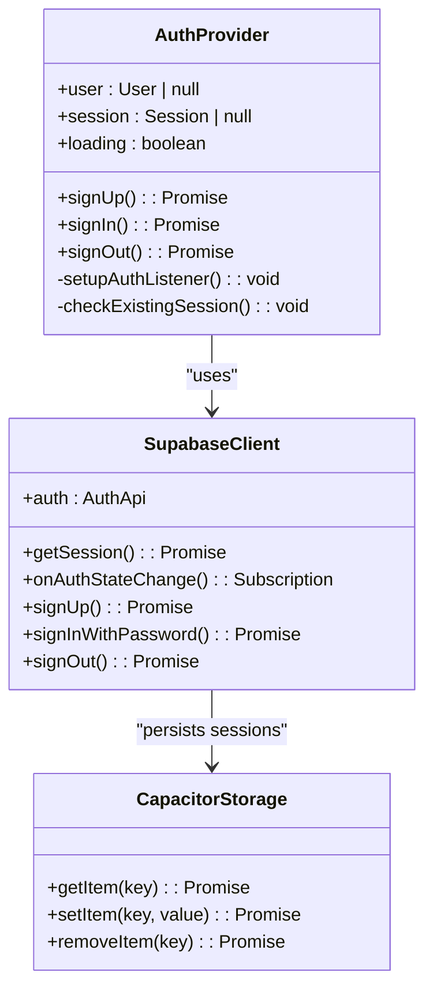
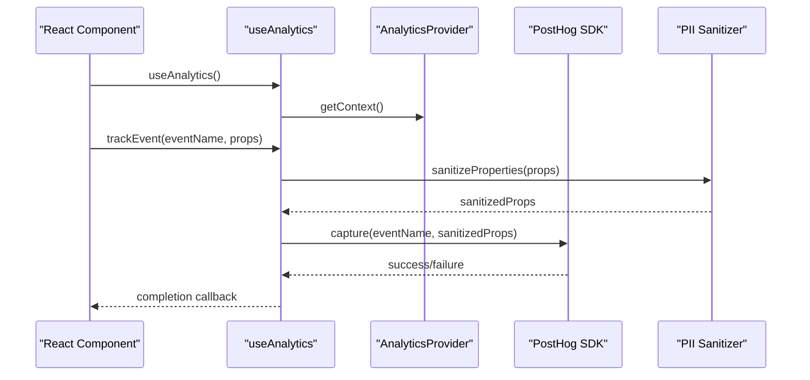
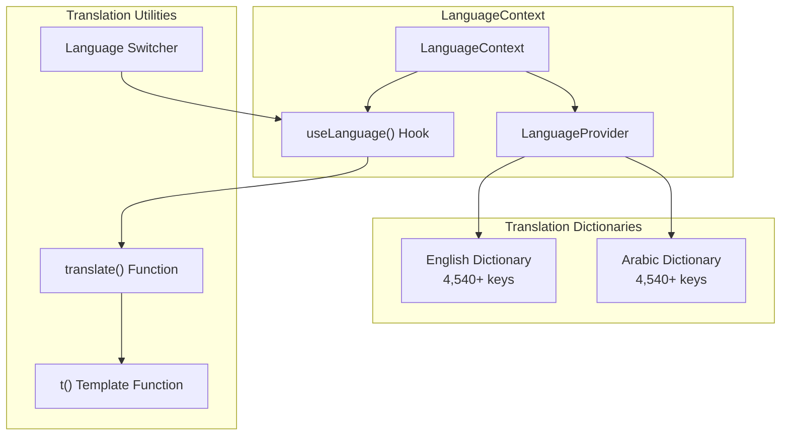
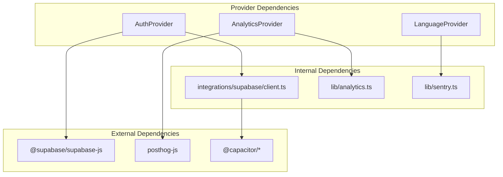

# Context Providers

<cite>
**Referenced Files in This Document**
- [AuthContext.tsx](file://src/contexts/AuthContext.tsx)
- [AnalyticsContext.tsx](file://src/contexts/AnalyticsContext.tsx)
- [LanguageContext.tsx](file://src/contexts/LanguageContext.tsx)
- [client.ts](file://src/integrations/supabase/client.ts)
- [analytics.ts](file://src/lib/analytics.ts)
- [App.tsx](file://src/App.tsx)
- [main.tsx](file://src/main.tsx)
</cite>

## Table of Contents
1. [Introduction](#introduction)
2. [Project Structure](#project-structure)
3. [Core Components](#core-components)
4. [Architecture Overview](#architecture-overview)
5. [Detailed Component Analysis](#detailed-component-analysis)
6. [Dependency Analysis](#dependency-analysis)
7. [Performance Considerations](#performance-considerations)
8. [Troubleshooting Guide](#troubleshooting-guide)
9. [Conclusion](#conclusion)

## Introduction
This document provides comprehensive coverage of Nutrio's context providers that power state management across the application. It focuses on three primary providers:
- AuthProvider: Authentication state management with login/logout flows, session persistence, and role-based access control
- AnalyticsProvider: Analytics event tracking and user identification
- LanguageContext: Internationalization support with bilingual translation dictionaries

The documentation covers provider initialization, context value structure, consumer patterns, error handling, loading states, and provider composition patterns. It also includes practical examples of how these contexts are used across different portals (customer, partner, admin, driver, fleet).

## Project Structure
The context providers are organized under the contexts directory and integrated at the application root level. The main application file wraps the entire app with providers, while the main entry point initializes language support.

**Diagram sources**
- [main.tsx:11-36](file://src/main.tsx#L11-L36)
- [App.tsx:7-146](file://src/App.tsx#L7-L146)
- [AuthContext.tsx:31-61](file://src/contexts/AuthContext.tsx#L31-L61)
- [AnalyticsContext.tsx:22-38](file://src/contexts/AnalyticsContext.tsx#L22-L38)
- [client.ts:47-57](file://src/integrations/supabase/client.ts#L47-L57)
- [analytics.ts:3-35](file://src/lib/analytics.ts#L3-L35)

**Section sources**
- [main.tsx:11-36](file://src/main.tsx#L11-L36)
- [App.tsx:7-146](file://src/App.tsx#L7-L146)

## Core Components

### AuthProvider Implementation
The AuthProvider manages authentication state using Supabase Auth with comprehensive session handling and native platform integration.

**Context Value Structure:**
- user: Current authenticated user or null
- session: Active session data or null
- loading: Authentication state loading indicator
- signUp(): Registration function with full name support
- signIn(): Login function with IP location verification
- signOut(): Logout function with local storage cleanup

**Key Features:**
- Automatic session restoration on app startup
- Real-time auth state synchronization via Supabase listeners
- Native platform push notification initialization
- IP-based access control with graceful degradation
- Secure session persistence using Capacitor Preferences

**Section sources**
- [AuthContext.tsx:8-25](file://src/contexts/AuthContext.tsx#L8-L25)
- [AuthContext.tsx:31-61](file://src/contexts/AuthContext.tsx#L31-L61)
- [AuthContext.tsx:63-127](file://src/contexts/AuthContext.tsx#L63-L127)

### AnalyticsProvider Implementation
The AnalyticsProvider handles comprehensive analytics tracking using PostHog with privacy-focused data collection.

**Context Value Structure:**
- trackEvent(): Generic event tracking
- trackPageView(): Page view tracking
- identifyUser(): User identification with trait sanitization
- resetUser(): Analytics session reset

**Key Features:**
- Environment-aware initialization (disabled in development)
- Automatic page view tracking
- PII sanitization for privacy compliance
- Predefined event categories (authentication, orders, subscriptions)
- Feature flag support for A/B testing

**Section sources**
- [AnalyticsContext.tsx:13-38](file://src/contexts/AnalyticsContext.tsx#L13-L38)
- [AnalyticsContext.tsx:22-38](file://src/contexts/AnalyticsContext.tsx#L22-L38)
- [AnalyticsContext.tsx:79-114](file://src/contexts/AnalyticsContext.tsx#L79-L114)

### LanguageContext Implementation
The LanguageContext provides comprehensive internationalization support with bilingual translation dictionaries spanning 4,540+ translation keys.

**Supported Languages:**
- English (en): 4,540+ translation keys
- Arabic (ar): 4,540+ translation keys with complete RTL support

**Dictionary Organization:**
- Navigation and UI elements
- Authentication flows
- Nutrition tracking interfaces
- Order management systems
- Profile and settings
- Business-specific terminology
- Error messages and notifications

**Section sources**
- [LanguageContext.tsx:3-2291](file://src/contexts/LanguageContext.tsx#L3-L2291)
- [LanguageContext.tsx:2295-3999](file://src/contexts/LanguageContext.tsx#L2295-L3999)

## Architecture Overview

**Diagram sources**
- [App.tsx:145-146](file://src/App.tsx#L145-L146)
- [AuthContext.tsx:36-61](file://src/contexts/AuthContext.tsx#L36-L61)
- [AnalyticsContext.tsx:22-25](file://src/contexts/AnalyticsContext.tsx#L22-L25)

**Section sources**
- [App.tsx:145-146](file://src/App.tsx#L145-L146)
- [AuthContext.tsx:36-61](file://src/contexts/AuthContext.tsx#L36-L61)
- [AnalyticsContext.tsx:22-25](file://src/contexts/AnalyticsContext.tsx#L22-L25)

## Detailed Component Analysis

### AuthProvider Detailed Analysis

#### Authentication Flow Architecture
The AuthProvider implements a robust authentication system with multiple layers of security and user experience optimization.

**Diagram sources**
- [AuthContext.tsx:36-61](file://src/contexts/AuthContext.tsx#L36-L61)
- [AuthContext.tsx:87-118](file://src/contexts/AuthContext.tsx#L87-L118)

#### Session Persistence Strategy
The authentication system employs intelligent session persistence with platform-specific storage mechanisms.

**Diagram sources**
- [AuthContext.tsx:31-61](file://src/contexts/AuthContext.tsx#L31-L61)
- [client.ts:18-42](file://src/integrations/supabase/client.ts#L18-L42)

**Section sources**
- [AuthContext.tsx:31-61](file://src/contexts/AuthContext.tsx#L31-L61)
- [client.ts:18-42](file://src/integrations/supabase/client.ts#L18-L42)

### AnalyticsProvider Detailed Analysis

#### Analytics Event Tracking Pipeline
The AnalyticsProvider implements a comprehensive event tracking system with privacy-first data handling.

**Diagram sources**
- [AnalyticsContext.tsx:41-47](file://src/contexts/AnalyticsContext.tsx#L41-L47)
- [AnalyticsContext.tsx:56-68](file://src/contexts/AnalyticsContext.tsx#L56-L68)
- [analytics.ts:147-160](file://src/lib/analytics.ts#L147-L160)

#### Privacy-First Data Collection
The analytics system implements strict privacy controls with automatic PII sanitization and environment-based configuration.

**Section sources**
- [AnalyticsContext.tsx:37-53](file://src/contexts/AnalyticsContext.tsx#L37-L53)
- [analytics.ts:147-160](file://src/lib/analytics.ts#L147-L160)

### LanguageContext Detailed Analysis

#### Translation Dictionary Architecture
The LanguageContext implements a sophisticated translation system with comprehensive coverage across all application domains.

**Diagram sources**
- [LanguageContext.tsx:1-2291](file://src/contexts/LanguageContext.tsx#L1-L2291)
- [LanguageContext.tsx:2295-3999](file://src/contexts/LanguageContext.tsx#L2295-L3999)

**Section sources**
- [LanguageContext.tsx:1-2291](file://src/contexts/LanguageContext.tsx#L1-L2291)
- [LanguageContext.tsx:2295-3999](file://src/contexts/LanguageContext.tsx#L2295-L3999)

## Dependency Analysis

**Diagram sources**
- [AuthContext.tsx:1-7](file://src/contexts/AuthContext.tsx#L1-L7)
- [AnalyticsContext.tsx:1-11](file://src/contexts/AnalyticsContext.tsx#L1-L11)
- [client.ts:1-5](file://src/integrations/supabase/client.ts#L1-L5)
- [analytics.ts](file://src/lib/analytics.ts#L1)

**Section sources**
- [AuthContext.tsx:1-7](file://src/contexts/AuthContext.tsx#L1-L7)
- [AnalyticsContext.tsx:1-11](file://src/contexts/AnalyticsContext.tsx#L1-L11)
- [client.ts:1-5](file://src/integrations/supabase/client.ts#L1-L5)
- [analytics.ts](file://src/lib/analytics.ts#L1)

## Performance Considerations
- **Lazy Loading**: Providers are initialized at the application root level to minimize re-renders
- **Efficient State Updates**: AuthProvider uses granular state updates to avoid unnecessary re-renders
- **Memory Management**: AnalyticsProvider properly cleans up event listeners and subscriptions
- **Bundle Size**: LanguageContext dictionaries are optimized for minimal bundle impact
- **Native Performance**: AuthProvider leverages Capacitor's native storage for optimal session persistence

## Troubleshooting Guide

### Authentication Issues
- **Session Restoration Failures**: Check Supabase configuration environment variables
- **Login Blocking**: Verify IP location check implementation and error handling
- **Native Platform Issues**: Ensure Capacitor initialization and push notification setup

### Analytics Problems
- **Event Tracking Disabled**: Verify PostHog API key configuration and environment settings
- **PII Data Issues**: Check sanitizer configuration and property filtering
- **Privacy Compliance**: Ensure proper opt-out handling in development environments

### Internationalization Issues
- **Missing Translations**: Verify translation key existence in both dictionaries
- **RTL Layout Problems**: Check Arabic text direction handling and layout adjustments
- **Language Switching**: Ensure proper state management during language transitions

**Section sources**
- [AuthContext.tsx:88-100](file://src/contexts/AuthContext.tsx#L88-L100)
- [AnalyticsContext.tsx:3-35](file://src/contexts/AnalyticsContext.tsx#L3-L35)
- [LanguageContext.tsx:1-2291](file://src/contexts/LanguageContext.tsx#L1-L2291)

## Conclusion
Nutrio's context providers implement a robust, scalable state management system that supports authentication, analytics, and internationalization across multiple application portals. The providers are designed with security, performance, and user experience in mind, featuring comprehensive error handling, privacy compliance, and platform-specific optimizations. The modular architecture allows for easy integration and extension while maintaining consistency across the entire application ecosystem.