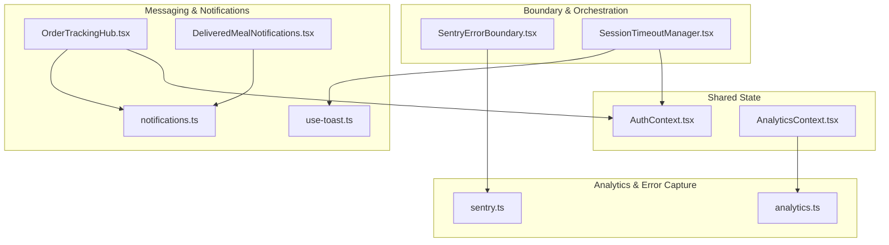
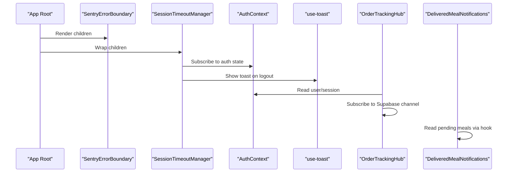
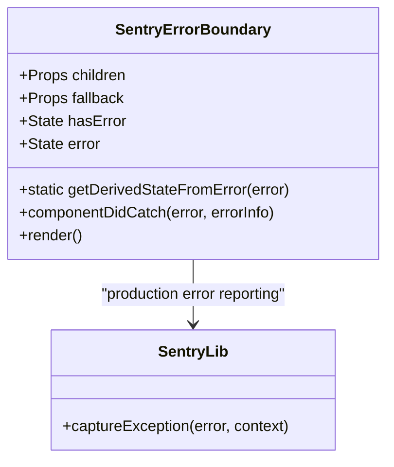
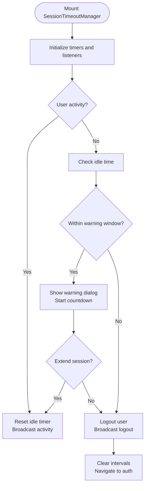
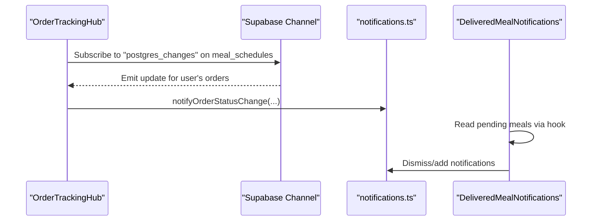
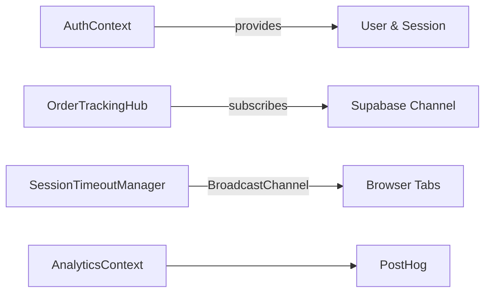
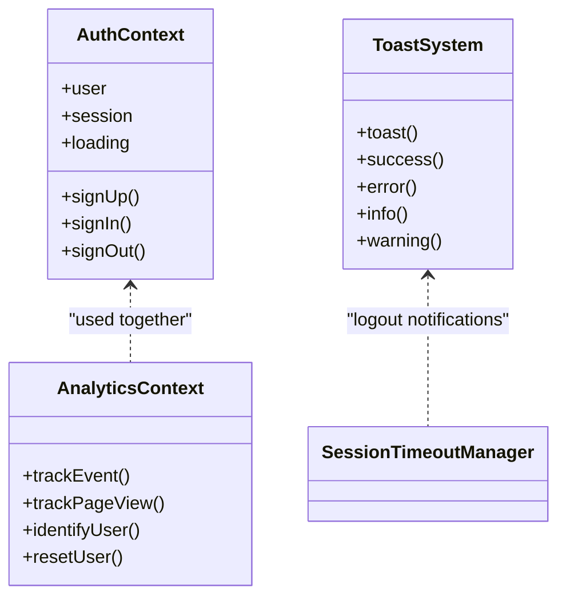
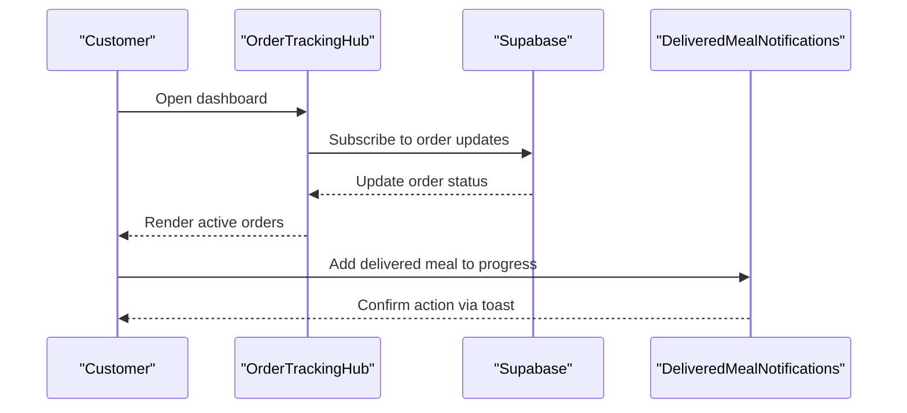
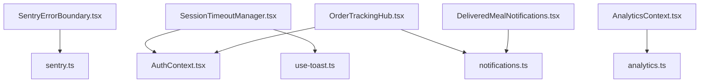

# Cross-Component Communication

<cite>
**Referenced Files in This Document**
- [SentryErrorBoundary.tsx](file://src/components/SentryErrorBoundary.tsx)
- [SessionTimeoutManager.tsx](file://src/components/SessionTimeoutManager.tsx)
- [use-toast.ts](file://src/hooks/use-toast.ts)
- [AuthContext.tsx](file://src/contexts/AuthContext.tsx)
- [AnalyticsContext.tsx](file://src/contexts/AnalyticsContext.tsx)
- [sentry.ts](file://src/lib/sentry.ts)
- [notifications.ts](file://src/lib/notifications.ts)
- [analytics.ts](file://src/lib/analytics.ts)
- [OrderTrackingHub.tsx](file://src/components/OrderTrackingHub.tsx)
- [DeliveredMealNotifications.tsx](file://src/components/DeliveredMealNotifications.tsx)
</cite>

## Table of Contents
1. [Introduction](#introduction)
2. [Project Structure](#project-structure)
3. [Core Components](#core-components)
4. [Architecture Overview](#architecture-overview)
5. [Detailed Component Analysis](#detailed-component-analysis)
6. [Dependency Analysis](#dependency-analysis)
7. [Performance Considerations](#performance-considerations)
8. [Troubleshooting Guide](#troubleshooting-guide)
9. [Conclusion](#conclusion)

## Introduction
This document explains cross-component communication patterns in Nutrio, focusing on centralized error handling via SentryErrorBoundary, session timeout management with automatic logout, notification systems, and event-driven state synchronization. It also covers shared state management through contexts, inter-component messaging, and practical examples of component coordination across user roles.

## Project Structure
Nutrio organizes cross-component concerns across three primary layers:
- Boundary and orchestration: SentryErrorBoundary, SessionTimeoutManager
- Shared state: AuthContext, AnalyticsContext
- Messaging and notifications: use-toast, notifications library, OrderTrackingHub, DeliveredMealNotifications
- Analytics and error capture: sentry.ts, analytics.ts

**Diagram sources**
- [SentryErrorBoundary.tsx:1-77](file://src/components/SentryErrorBoundary.tsx#L1-L77)
- [SessionTimeoutManager.tsx:1-344](file://src/components/SessionTimeoutManager.tsx#L1-L344)
- [AuthContext.tsx:1-131](file://src/contexts/AuthContext.tsx#L1-L131)
- [AnalyticsContext.tsx:1-61](file://src/contexts/AnalyticsContext.tsx#L1-L61)
- [use-toast.ts:1-83](file://src/hooks/use-toast.ts#L1-L83)
- [notifications.ts:1-114](file://src/lib/notifications.ts#L1-L114)
- [OrderTrackingHub.tsx:1-235](file://src/components/OrderTrackingHub.tsx#L1-L235)
- [DeliveredMealNotifications.tsx:1-95](file://src/components/DeliveredMealNotifications.tsx#L1-L95)
- [sentry.ts:1-73](file://src/lib/sentry.ts#L1-L73)
- [analytics.ts:1-170](file://src/lib/analytics.ts#L1-L170)

**Section sources**
- [SentryErrorBoundary.tsx:1-77](file://src/components/SentryErrorBoundary.tsx#L1-L77)
- [SessionTimeoutManager.tsx:1-344](file://src/components/SessionTimeoutManager.tsx#L1-L344)
- [AuthContext.tsx:1-131](file://src/contexts/AuthContext.tsx#L1-L131)
- [AnalyticsContext.tsx:1-61](file://src/contexts/AnalyticsContext.tsx#L1-L61)
- [use-toast.ts:1-83](file://src/hooks/use-toast.ts#L1-L83)
- [notifications.ts:1-114](file://src/lib/notifications.ts#L1-L114)
- [OrderTrackingHub.tsx:1-235](file://src/components/OrderTrackingHub.tsx#L1-L235)
- [DeliveredMealNotifications.tsx:1-95](file://src/components/DeliveredMealNotifications.tsx#L1-L95)
- [sentry.ts:1-73](file://src/lib/sentry.ts#L1-L73)
- [analytics.ts:1-170](file://src/lib/analytics.ts#L1-L170)

## Core Components
- Centralized error boundary with Sentry reporting and optional fallback UI
- Session timeout manager with cross-tab synchronization and user extension controls
- Toast notification system built on Sonner with standardized API
- Authentication context for role-aware state and lifecycle events
- Analytics context for PostHog initialization and event tracking
- Notification creation helpers for order and delivery updates
- Real-time order tracking hub with Supabase postgres_changes
- Delivered meal notifications with user-driven actions

**Section sources**
- [SentryErrorBoundary.tsx:1-77](file://src/components/SentryErrorBoundary.tsx#L1-L77)
- [SessionTimeoutManager.tsx:1-344](file://src/components/SessionTimeoutManager.tsx#L1-L344)
- [use-toast.ts:1-83](file://src/hooks/use-toast.ts#L1-L83)
- [AuthContext.tsx:1-131](file://src/contexts/AuthContext.tsx#L1-L131)
- [AnalyticsContext.tsx:1-61](file://src/contexts/AnalyticsContext.tsx#L1-L61)
- [notifications.ts:1-114](file://src/lib/notifications.ts#L1-L114)
- [OrderTrackingHub.tsx:1-235](file://src/components/OrderTrackingHub.tsx#L1-L235)
- [DeliveredMealNotifications.tsx:1-95](file://src/components/DeliveredMealNotifications.tsx#L1-L95)

## Architecture Overview
The system uses React contexts for shared state, component-level boundaries for error handling, and libraries for analytics and notifications. Real-time updates leverage Supabase channels, while cross-tab session state synchronization uses BroadcastChannel.

**Diagram sources**
- [SentryErrorBoundary.tsx:1-77](file://src/components/SentryErrorBoundary.tsx#L1-L77)
- [SessionTimeoutManager.tsx:1-344](file://src/components/SessionTimeoutManager.tsx#L1-L344)
- [AuthContext.tsx:1-131](file://src/contexts/AuthContext.tsx#L1-L131)
- [use-toast.ts:1-83](file://src/hooks/use-toast.ts#L1-L83)
- [OrderTrackingHub.tsx:1-235](file://src/components/OrderTrackingHub.tsx#L1-L235)
- [DeliveredMealNotifications.tsx:1-95](file://src/components/DeliveredMealNotifications.tsx#L1-L95)

## Detailed Component Analysis

### Error Boundary Implementation with SentryErrorBoundary
SentryErrorBoundary provides centralized error handling:
- Captures unhandled errors and forwards them to Sentry in production
- Supports a custom fallback UI or renders children normally
- Includes a functional useErrorHandler hook for imperative error capture

**Diagram sources**
- [SentryErrorBoundary.tsx:1-77](file://src/components/SentryErrorBoundary.tsx#L1-L77)
- [sentry.ts:1-73](file://src/lib/sentry.ts#L1-L73)

**Section sources**
- [SentryErrorBoundary.tsx:1-77](file://src/components/SentryErrorBoundary.tsx#L1-L77)
- [sentry.ts:1-73](file://src/lib/sentry.ts#L1-L73)

### Session Timeout Management and Automatic Logout
SessionTimeoutManager enforces idle timeouts and supports:
- Activity detection across multiple DOM events
- Warning dialog with countdown and "Stay Logged In" extension
- Cross-tab synchronization via BroadcastChannel
- Controlled extension during long operations via useSessionTimeoutControl

**Diagram sources**
- [SessionTimeoutManager.tsx:1-344](file://src/components/SessionTimeoutManager.tsx#L1-L344)
- [AuthContext.tsx:1-131](file://src/contexts/AuthContext.tsx#L1-L131)
- [use-toast.ts:1-83](file://src/hooks/use-toast.ts#L1-L83)

**Section sources**
- [SessionTimeoutManager.tsx:1-344](file://src/components/SessionTimeoutManager.tsx#L1-L344)
- [AuthContext.tsx:1-131](file://src/contexts/AuthContext.tsx#L1-L131)
- [use-toast.ts:1-83](file://src/hooks/use-toast.ts#L1-L83)

### Notification Systems and Inter-Component Messaging
Notifications are persisted and surfaced through:
- Notification creation helpers for order and delivery updates
- Real-time order tracking via Supabase postgres_changes
- Delivered meal notifications with user-driven actions (add to progress, dismiss)
- Toast notifications via a unified use-toast hook built on Sonner

**Diagram sources**
- [OrderTrackingHub.tsx:1-235](file://src/components/OrderTrackingHub.tsx#L1-L235)
- [notifications.ts:1-114](file://src/lib/notifications.ts#L1-L114)
- [DeliveredMealNotifications.tsx:1-95](file://src/components/DeliveredMealNotifications.tsx#L1-L95)

**Section sources**
- [notifications.ts:1-114](file://src/lib/notifications.ts#L1-L114)
- [OrderTrackingHub.tsx:1-235](file://src/components/OrderTrackingHub.tsx#L1-L235)
- [DeliveredMealNotifications.tsx:1-95](file://src/components/DeliveredMealNotifications.tsx#L1-L95)
- [use-toast.ts:1-83](file://src/hooks/use-toast.ts#L1-L83)

### Event-Driven Communication and State Synchronization
Event-driven patterns include:
- Supabase postgres_changes for real-time order updates
- BroadcastChannel for cross-tab session synchronization
- AuthContext for reactive user/session state across portals
- AnalyticsContext for page and event tracking

**Diagram sources**
- [AuthContext.tsx:1-131](file://src/contexts/AuthContext.tsx#L1-L131)
- [OrderTrackingHub.tsx:1-235](file://src/components/OrderTrackingHub.tsx#L1-L235)
- [SessionTimeoutManager.tsx:1-344](file://src/components/SessionTimeoutManager.tsx#L1-L344)
- [AnalyticsContext.tsx:1-61](file://src/contexts/AnalyticsContext.tsx#L1-L61)

**Section sources**
- [AuthContext.tsx:1-131](file://src/contexts/AuthContext.tsx#L1-L131)
- [OrderTrackingHub.tsx:1-235](file://src/components/OrderTrackingHub.tsx#L1-L235)
- [SessionTimeoutManager.tsx:1-344](file://src/components/SessionTimeoutManager.tsx#L1-L344)
- [AnalyticsContext.tsx:1-61](file://src/contexts/AnalyticsContext.tsx#L1-L61)

### Shared State Management Across Portals
Shared state is managed through dedicated contexts:
- AuthContext: centralizes authentication state and lifecycle
- AnalyticsContext: initializes analytics and exposes tracking APIs
- Toast system: unified notification UX via Sonner

**Diagram sources**
- [AuthContext.tsx:1-131](file://src/contexts/AuthContext.tsx#L1-L131)
- [AnalyticsContext.tsx:1-61](file://src/contexts/AnalyticsContext.tsx#L1-L61)
- [use-toast.ts:1-83](file://src/hooks/use-toast.ts#L1-L83)
- [SessionTimeoutManager.tsx:1-344](file://src/components/SessionTimeoutManager.tsx#L1-L344)

**Section sources**
- [AuthContext.tsx:1-131](file://src/contexts/AuthContext.tsx#L1-L131)
- [AnalyticsContext.tsx:1-61](file://src/contexts/AnalyticsContext.tsx#L1-L61)
- [use-toast.ts:1-83](file://src/hooks/use-toast.ts#L1-L83)

### Examples of Component Coordination and Data Flow by Role
- Customer portal:
  - OrderTrackingHub subscribes to order updates and navigates to tracking details
  - DeliveredMealNotifications surfaces post-delivery actions and integrates with nutrition logging
- Driver portal:
  - Delivery notifications trigger new delivery claims and route updates
- Admin/partner portals:
  - AnalyticsContext tracks user journeys and conversion funnels
  - AuthContext ensures role-aware navigation and permissions

**Diagram sources**
- [OrderTrackingHub.tsx:1-235](file://src/components/OrderTrackingHub.tsx#L1-L235)
- [DeliveredMealNotifications.tsx:1-95](file://src/components/DeliveredMealNotifications.tsx#L1-L95)
- [use-toast.ts:1-83](file://src/hooks/use-toast.ts#L1-L83)

**Section sources**
- [OrderTrackingHub.tsx:1-235](file://src/components/OrderTrackingHub.tsx#L1-L235)
- [DeliveredMealNotifications.tsx:1-95](file://src/components/DeliveredMealNotifications.tsx#L1-L95)
- [use-toast.ts:1-83](file://src/hooks/use-toast.ts#L1-L83)

## Dependency Analysis
Key dependencies and their roles:
- SentryErrorBoundary depends on Sentry SDK for error capture
- SessionTimeoutManager depends on AuthContext for user state and use-toast for notifications
- OrderTrackingHub depends on Supabase for real-time updates and AuthContext for user identity
- DeliveredMealNotifications depends on notification helpers and localization context
- AnalyticsContext depends on PostHog for analytics
- Error capture utilities depend on sentry.ts for initialization and filtering

**Diagram sources**
- [SentryErrorBoundary.tsx:1-77](file://src/components/SentryErrorBoundary.tsx#L1-L77)
- [SessionTimeoutManager.tsx:1-344](file://src/components/SessionTimeoutManager.tsx#L1-L344)
- [AuthContext.tsx:1-131](file://src/contexts/AuthContext.tsx#L1-L131)
- [use-toast.ts:1-83](file://src/hooks/use-toast.ts#L1-L83)
- [OrderTrackingHub.tsx:1-235](file://src/components/OrderTrackingHub.tsx#L1-L235)
- [DeliveredMealNotifications.tsx:1-95](file://src/components/DeliveredMealNotifications.tsx#L1-L95)
- [notifications.ts:1-114](file://src/lib/notifications.ts#L1-L114)
- [AnalyticsContext.tsx:1-61](file://src/contexts/AnalyticsContext.tsx#L1-L61)
- [analytics.ts:1-170](file://src/lib/analytics.ts#L1-L170)
- [sentry.ts:1-73](file://src/lib/sentry.ts#L1-L73)

**Section sources**
- [SentryErrorBoundary.tsx:1-77](file://src/components/SentryErrorBoundary.tsx#L1-L77)
- [SessionTimeoutManager.tsx:1-344](file://src/components/SessionTimeoutManager.tsx#L1-L344)
- [AuthContext.tsx:1-131](file://src/contexts/AuthContext.tsx#L1-L131)
- [use-toast.ts:1-83](file://src/hooks/use-toast.ts#L1-L83)
- [OrderTrackingHub.tsx:1-235](file://src/components/OrderTrackingHub.tsx#L1-L235)
- [DeliveredMealNotifications.tsx:1-95](file://src/components/DeliveredMealNotifications.tsx#L1-L95)
- [notifications.ts:1-114](file://src/lib/notifications.ts#L1-L114)
- [AnalyticsContext.tsx:1-61](file://src/contexts/AnalyticsContext.tsx#L1-L61)
- [analytics.ts:1-170](file://src/lib/analytics.ts#L1-L170)
- [sentry.ts:1-73](file://src/lib/sentry.ts#L1-L73)

## Performance Considerations
- Minimize unnecessary re-renders by scoping state to components that need it (e.g., SessionTimeoutManager only when user exists)
- Debounce or throttle activity listeners to reduce overhead
- Use controlled intervals and clear them on unmount to prevent memory leaks
- Leverage BroadcastChannel for lightweight cross-tab signaling
- Avoid heavy analytics calls in development; rely on local logs

## Troubleshooting Guide
- Error boundary not catching errors:
  - Verify Sentry initialization and DSN configuration
  - Ensure SentryErrorBoundary wraps the root of the app
- Session timeout not extending:
  - Confirm useSessionTimeoutControl is called around long operations
  - Check BroadcastChannel availability in the current environment
- Notifications not appearing:
  - Validate Supabase channel subscription and user context
  - Confirm toast configuration and Sonner setup
- Analytics not recording:
  - Check PostHog API key and host configuration
  - Ensure analytics provider is mounted at the root

**Section sources**
- [SentryErrorBoundary.tsx:1-77](file://src/components/SentryErrorBoundary.tsx#L1-L77)
- [SessionTimeoutManager.tsx:1-344](file://src/components/SessionTimeoutManager.tsx#L1-L344)
- [use-toast.ts:1-83](file://src/hooks/use-toast.ts#L1-L83)
- [notifications.ts:1-114](file://src/lib/notifications.ts#L1-L114)
- [analytics.ts:1-170](file://src/lib/analytics.ts#L1-L170)

## Conclusion
Nutrio’s cross-component communication relies on robust boundaries (error handling), shared contexts (authentication and analytics), and event-driven mechanisms (real-time updates and notifications). The session timeout manager coordinates user safety across tabs, while the toast and notification systems provide consistent feedback. These patterns enable scalable, maintainable communication across customer, driver, admin, and partner portals.