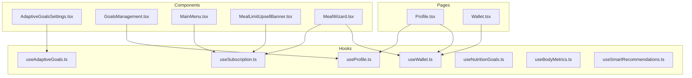
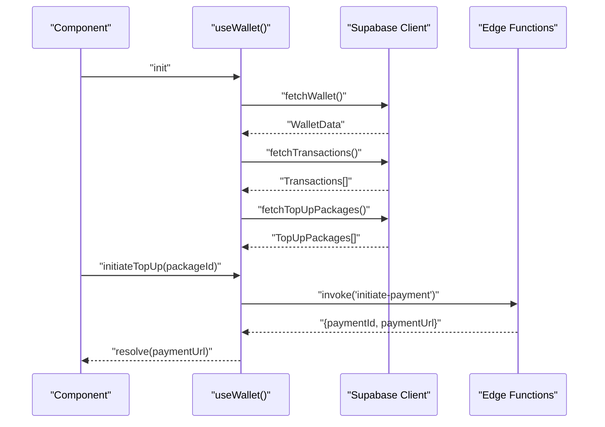
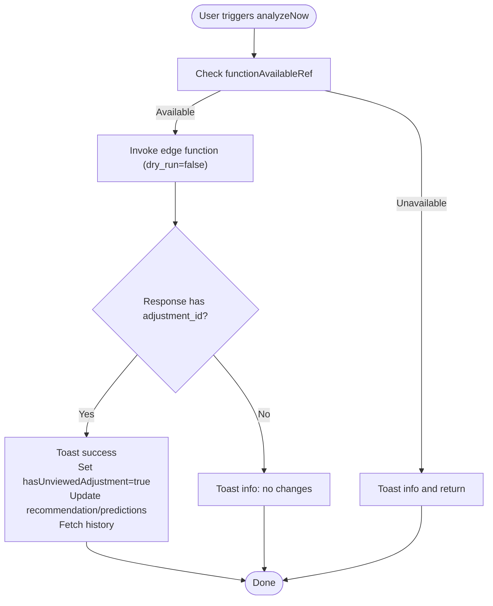
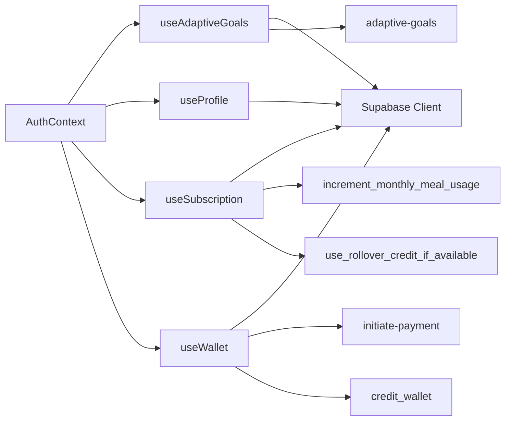

# Custom Hooks

<cite>
**Referenced Files in This Document**
- [useAdaptiveGoals.ts](file://src/hooks/useAdaptiveGoals.ts)
- [useProfile.ts](file://src/hooks/useProfile.ts)
- [useSubscription.ts](file://src/hooks/useSubscription.ts)
- [useWallet.ts](file://src/hooks/useWallet.ts)
- [useNutritionGoals.ts](file://src/hooks/useNutritionGoals.ts)
- [useBodyMetrics.ts](file://src/hooks/useBodyMetrics.ts)
- [useSmartRecommendations.ts](file://src/hooks/useSmartRecommendations.ts)
- [Profile.tsx](file://src/pages/Profile.tsx)
- [Wallet.tsx](file://src/pages/Wallet.tsx)
- [AdaptiveGoalsSettings.tsx](file://src/components/AdaptiveGoalsSettings.tsx)
- [GoalsManagement.tsx](file://src/components/GoalsManagement.tsx)
- [MainMenu.tsx](file://src/components/MainMenu.tsx)
- [MealLimitUpsellBanner.tsx](file://src/components/MealLimitUpsellBanner.tsx)
- [MealWizard.tsx](file://src/components/MealWizard.tsx)
</cite>

## Table of Contents
1. [Introduction](#introduction)
2. [Project Structure](#project-structure)
3. [Core Components](#core-components)
4. [Architecture Overview](#architecture-overview)
5. [Detailed Component Analysis](#detailed-component-analysis)
6. [Dependency Analysis](#dependency-analysis)
7. [Performance Considerations](#performance-considerations)
8. [Troubleshooting Guide](#troubleshooting-guide)
9. [Conclusion](#conclusion)

## Introduction
This document explains the custom hooks pattern used in Nutrio, focusing on specialized hooks that power AI-driven nutrition recommendations, user data management, subscription state, and wallet/payment flows. It covers hook composition patterns, data fetching strategies, state update mechanisms, error handling, loading state management, dependencies, memoization, and performance optimizations. Practical usage examples are included from real components and pages.

## Project Structure
The hooks live under src/hooks and are consumed by pages and components across the application. They integrate with Supabase for data persistence and real-time updates, and with external edge functions for AI-powered analysis.

**Diagram sources**
- [useAdaptiveGoals.ts:62-406](file://src/hooks/useAdaptiveGoals.ts#L62-L406)
- [useProfile.ts:33-87](file://src/hooks/useProfile.ts#L33-L87)
- [useSubscription.ts:42-263](file://src/hooks/useSubscription.ts#L42-L263)
- [useWallet.ts:56-275](file://src/hooks/useWallet.ts#L56-L275)
- [useNutritionGoals.ts:27-133](file://src/hooks/useNutritionGoals.ts#L27-L133)
- [useBodyMetrics.ts:28-265](file://src/hooks/useBodyMetrics.ts#L28-L265)
- [useSmartRecommendations.ts:18-296](file://src/hooks/useSmartRecommendations.ts#L18-L296)
- [Profile.tsx:245-277](file://src/pages/Profile.tsx#L245-L277)
- [Wallet.tsx:31-45](file://src/pages/Wallet.tsx#L31-L45)
- [AdaptiveGoalsSettings.tsx:13-22](file://src/components/AdaptiveGoalsSettings.tsx#L13-L22)
- [GoalsManagement.tsx:26-255](file://src/components/GoalsManagement.tsx#L26-L255)
- [MainMenu.tsx:7-28](file://src/components/MainMenu.tsx#L7-L28)
- [MealLimitUpsellBanner.tsx:6-24](file://src/components/MealLimitUpsellBanner.tsx#L6-L24)
- [MealWizard.tsx:36-147](file://src/components/MealWizard.tsx#L36-L147)

**Section sources**
- [useAdaptiveGoals.ts:62-406](file://src/hooks/useAdaptiveGoals.ts#L62-L406)
- [useProfile.ts:33-87](file://src/hooks/useProfile.ts#L33-L87)
- [useSubscription.ts:42-263](file://src/hooks/useSubscription.ts#L42-L263)
- [useWallet.ts:56-275](file://src/hooks/useWallet.ts#L56-L275)
- [Profile.tsx:245-277](file://src/pages/Profile.tsx#L245-L277)
- [Wallet.tsx:31-45](file://src/pages/Wallet.tsx#L31-L45)

## Core Components
This section summarizes the four specialized hooks requested and related patterns.

- useAdaptiveGoals
  - Purpose: AI-powered nutrition goal recommendations, predictions, settings, and adjustment history.
  - Key exports: recommendation, predictions, settings, adjustmentHistory, loading flags, fetchers, apply/dismiss, updateSettings, analyzeNow.
  - Notable behaviors: graceful degradation when edge function is unavailable; maintains a ref to avoid repeated failed calls; integrates with profiles and goal adjustment history tables.

- useProfile
  - Purpose: User profile CRUD and refetch.
  - Key exports: profile, loading, error, refetch, updateProfile.
  - Notable behaviors: guarded updates when user is absent; returns structured error for consumers.

- useSubscription
  - Purpose: Subscription state, quotas, and lifecycle controls.
  - Key exports: subscription, loading, booleans (hasActiveSubscription, isPaused, isUnlimited, isVip, canOrderMeal), computed values, incrementMealUsage, pause/resume, refetch.
  - Notable behaviors: real-time updates via Supabase channels; visibility change refetch; uses RPCs for atomic increments and rollover credits.

- useWallet
  - Purpose: Wallet balance, transaction history, top-up packages, and payment initiation.
  - Key exports: wallet, transactions, topUpPackages, loading flags, error, fetchers, initiateTopUp, creditWallet, refresh.
  - Notable behaviors: auto-creates wallet on first access; real-time channels for balance and transactions; invokes edge functions for payment initiation.

**Section sources**
- [useAdaptiveGoals.ts:44-60](file://src/hooks/useAdaptiveGoals.ts#L44-L60)
- [useAdaptiveGoals.ts:76-134](file://src/hooks/useAdaptiveGoals.ts#L76-L134)
- [useAdaptiveGoals.ts:136-178](file://src/hooks/useAdaptiveGoals.ts#L136-L178)
- [useAdaptiveGoals.ts:180-200](file://src/hooks/useAdaptiveGoals.ts#L180-L200)
- [useAdaptiveGoals.ts:202-244](file://src/hooks/useAdaptiveGoals.ts#L202-L244)
- [useAdaptiveGoals.ts:246-303](file://src/hooks/useAdaptiveGoals.ts#L246-L303)
- [useAdaptiveGoals.ts:305-325](file://src/hooks/useAdaptiveGoals.ts#L305-L325)
- [useAdaptiveGoals.ts:327-377](file://src/hooks/useAdaptiveGoals.ts#L327-L377)
- [useAdaptiveGoals.ts:379-387](file://src/hooks/useAdaptiveGoals.ts#L379-L387)
- [useProfile.ts:5-31](file://src/hooks/useProfile.ts#L5-L31)
- [useProfile.ts:33-61](file://src/hooks/useProfile.ts#L33-L61)
- [useProfile.ts:63-80](file://src/hooks/useProfile.ts#L63-L80)
- [useProfile.ts:82-84](file://src/hooks/useProfile.ts#L82-L84)
- [useSubscription.ts:5-19](file://src/hooks/useSubscription.ts#L5-L19)
- [useSubscription.ts:21-40](file://src/hooks/useSubscription.ts#L21-L40)
- [useSubscription.ts:47-93](file://src/hooks/useSubscription.ts#L47-L93)
- [useSubscription.ts:95-134](file://src/hooks/useSubscription.ts#L95-L134)
- [useSubscription.ts:136-161](file://src/hooks/useSubscription.ts#L136-L161)
- [useSubscription.ts:163-203](file://src/hooks/useSubscription.ts#L163-L203)
- [useSubscription.ts:205-241](file://src/hooks/useSubscription.ts#L205-L241)
- [useWallet.ts:5-14](file://src/hooks/useWallet.ts#L5-L14)
- [useWallet.ts:56-98](file://src/hooks/useWallet.ts#L56-L98)
- [useWallet.ts:100-120](file://src/hooks/useWallet.ts#L100-L120)
- [useWallet.ts:122-135](file://src/hooks/useWallet.ts#L122-L135)
- [useWallet.ts:137-167](file://src/hooks/useWallet.ts#L137-L167)
- [useWallet.ts:169-200](file://src/hooks/useWallet.ts#L169-L200)
- [useWallet.ts:202-221](file://src/hooks/useWallet.ts#L202-L221)
- [useWallet.ts:223-257](file://src/hooks/useWallet.ts#L223-L257)

## Architecture Overview
The hooks follow a consistent pattern:
- Centralized data fetching with Supabase client.
- Controlled loading/error states per resource.
- Memoized callbacks to prevent unnecessary re-renders.
- Real-time synchronization via Supabase channels and visibility events.
- Edge function invocation for AI and payment orchestration.
- Composition with AuthContext for user gating.

**Diagram sources**
- [useWallet.ts:65-98](file://src/hooks/useWallet.ts#L65-L98)
- [useWallet.ts:100-120](file://src/hooks/useWallet.ts#L100-L120)
- [useWallet.ts:122-135](file://src/hooks/useWallet.ts#L122-L135)
- [useWallet.ts:137-167](file://src/hooks/useWallet.ts#L137-L167)

**Section sources**
- [useWallet.ts:65-98](file://src/hooks/useWallet.ts#L65-L98)
- [useWallet.ts:100-120](file://src/hooks/useWallet.ts#L100-L120)
- [useWallet.ts:122-135](file://src/hooks/useWallet.ts#L122-L135)
- [useWallet.ts:137-167](file://src/hooks/useWallet.ts#L137-L167)

## Detailed Component Analysis

### useAdaptiveGoals
- Responsibilities
  - Fetch adaptive goal settings with defaults and upsert.
  - Invoke AI edge function for recommendations and predictions.
  - Manage adjustment history and unviewed adjustments.
  - Apply or dismiss suggested adjustments; update settings.
  - Analyze now to trigger non-dry-run analysis.

- Data fetching strategies
  - Settings: select with maybeSingle; insert default if missing; handle duplicate key gracefully.
  - Recommendations: invoke edge function with dry_run flag; fallback if function unavailable.
  - History: paginated selection ordered by date.
  - Unviewed adjustments: check profile flag and surface latest pending suggestion.

- State update mechanisms
  - Atomic profile updates when applying adjustments.
  - History marking via update.
  - Local state updates followed by refetch for consistency.

- Error handling and loading
  - Dedicated loading flags per operation.
  - Graceful degradation when edge function CORS/net errors occur; remember availability in ref.
  - Toast notifications for success/failure.

- Dependencies and memoization
  - useCallback for fetchers and actions to stabilize references.
  - useRef to track function availability.
  - useEffect to initialize all data on user presence.

- Usage examples
  - AdaptiveGoalsSettings consumes settings, recommendations, and actions.
  - Components can display suggestions and call applyAdjustment or dismissAdjustment.

**Diagram sources**
- [useAdaptiveGoals.ts:327-377](file://src/hooks/useAdaptiveGoals.ts#L327-L377)
- [useAdaptiveGoals.ts:332-350](file://src/hooks/useAdaptiveGoals.ts#L332-L350)

**Section sources**
- [useAdaptiveGoals.ts:76-134](file://src/hooks/useAdaptiveGoals.ts#L76-L134)
- [useAdaptiveGoals.ts:136-178](file://src/hooks/useAdaptiveGoals.ts#L136-L178)
- [useAdaptiveGoals.ts:180-200](file://src/hooks/useAdaptiveGoals.ts#L180-L200)
- [useAdaptiveGoals.ts:202-244](file://src/hooks/useAdaptiveGoals.ts#L202-L244)
- [useAdaptiveGoals.ts:246-303](file://src/hooks/useAdaptiveGoals.ts#L246-L303)
- [useAdaptiveGoals.ts:305-325](file://src/hooks/useAdaptiveGoals.ts#L305-L325)
- [useAdaptiveGoals.ts:327-377](file://src/hooks/useAdaptiveGoals.ts#L327-L377)
- [useAdaptiveGoals.ts:379-387](file://src/hooks/useAdaptiveGoals.ts#L379-L387)
- [AdaptiveGoalsSettings.tsx:13-22](file://src/components/AdaptiveGoalsSettings.tsx#L13-L22)

### useProfile
- Responsibilities
  - Fetch and update user profile.
  - Guard operations against unauthenticated users.

- Data fetching strategies
  - Single-row fetch with maybeSingle.
  - Update via upsert/select for optimistic UI.

- State update mechanisms
  - On successful update, set local state with returned row.

- Error handling and loading
  - Dedicated loading and error states.
  - Returns structured error for consumers to handle.

- Dependencies and memoization
  - useCallback for fetch/update to avoid re-renders.
  - useEffect to refetch on user change.

- Usage examples
  - Profile page uses updateProfile to persist personal info.
  - GoalsManagement reads profile for initial goals.

**Section sources**
- [useProfile.ts:33-61](file://src/hooks/useProfile.ts#L33-L61)
- [useProfile.ts:63-80](file://src/hooks/useProfile.ts#L63-L80)
- [useProfile.ts:82-84](file://src/hooks/useProfile.ts#L82-L84)
- [Profile.tsx:245-248](file://src/pages/Profile.tsx#L245-L248)
- [GoalsManagement.tsx:26-255](file://src/components/GoalsManagement.tsx#L26-L255)

### useSubscription
- Responsibilities
  - Resolve active/pending/cancelled-not-expired subscriptions.
  - Compute remaining meals (monthly and weekly), VIP unlimited, and eligibility to order.
  - Increment usage atomically and fall back to rollover credits.
  - Pause/resume subscription lifecycle.

- Data fetching strategies
  - Complex query with or conditions and ordering to pick latest relevant subscription.
  - Uses RPCs for atomic operations.

- State update mechanisms
  - Real-time channels subscribe to subscription changes.
  - Visibility change listener ensures freshness across sessions.

- Error handling and loading
  - Sets null on error and logs; keeps loading until resolved.

- Dependencies and memoization
  - useCallback for fetchSubscription to stabilize refs.
  - useEffect for channels and visibility.

- Usage examples
  - MainMenu displays VIP badge and active status.
  - MealLimitUpsellBanner shows remaining meals and loading state.
  - MealWizard checks remainingMeals and uses incrementMealUsage.

**Section sources**
- [useSubscription.ts:47-93](file://src/hooks/useSubscription.ts#L47-L93)
- [useSubscription.ts:95-134](file://src/hooks/useSubscription.ts#L95-L134)
- [useSubscription.ts:136-161](file://src/hooks/useSubscription.ts#L136-L161)
- [useSubscription.ts:163-203](file://src/hooks/useSubscription.ts#L163-L203)
- [useSubscription.ts:205-241](file://src/hooks/useSubscription.ts#L205-L241)
- [MainMenu.tsx:7-28](file://src/components/MainMenu.tsx#L7-L28)
- [MealLimitUpsellBanner.tsx:6-24](file://src/components/MealLimitUpsellBanner.tsx#L6-L24)
- [MealLimitUpsellBanner.tsx:185-185](file://src/components/MealLimitUpsellBanner.tsx#L185-L185)
- [MealWizard.tsx:36-90](file://src/components/MealWizard.tsx#L36-L90)
- [MealWizard.tsx:147-147](file://src/components/MealWizard.tsx#L147-L147)

### useWallet
- Responsibilities
  - Wallet creation and retrieval.
  - Transaction history pagination.
  - Top-up packages retrieval.
  - Payment initiation via edge function.
  - Credit wallet via RPC.

- Data fetching strategies
  - Auto-create wallet if missing.
  - Range-based pagination for transactions.
  - Real-time channels for balance and transaction inserts.

- State update mechanisms
  - After credit or top-up, refetch both wallet and transactions.

- Error handling and loading
  - Dedicated loading flags; error stored as message string.
  - Visibility change refetch for freshness.

- Dependencies and memoization
  - useCallback for fetchers and actions.
  - useEffect for initialization and channels.

- Usage examples
  - Wallet page composes balance, packages, and transaction history.
  - Profile page integrates wallet for rewards and top-ups.

**Section sources**
- [useWallet.ts:65-98](file://src/hooks/useWallet.ts#L65-L98)
- [useWallet.ts:100-120](file://src/hooks/useWallet.ts#L100-L120)
- [useWallet.ts:122-135](file://src/hooks/useWallet.ts#L122-L135)
- [useWallet.ts:137-167](file://src/hooks/useWallet.ts#L137-L167)
- [useWallet.ts:169-200](file://src/hooks/useWallet.ts#L169-L200)
- [useWallet.ts:202-221](file://src/hooks/useWallet.ts#L202-L221)
- [useWallet.ts:223-257](file://src/hooks/useWallet.ts#L223-L257)
- [Wallet.tsx:31-45](file://src/pages/Wallet.tsx#L31-L45)
- [Profile.tsx:269-277](file://src/pages/Profile.tsx#L269-L277)

### Related Patterns and Examples
- useNutritionGoals
  - Fetches goals and milestones for a given user ID.
  - Provides setGoal and updateGoalTargets with optimistic refresh.

- useBodyMetrics (React Query)
  - Query-based hooks for metrics, history, and latest measurement.
  - Mutation hooks for logging/updating/deleting with automatic cache invalidation.

- useSmartRecommendations
  - Computes contextual recommendations from recent logs, water intake, goals, and streaks.
  - Uses language context for translations and sorts by priority.

**Section sources**
- [useNutritionGoals.ts:27-67](file://src/hooks/useNutritionGoals.ts#L27-L67)
- [useNutritionGoals.ts:69-100](file://src/hooks/useNutritionGoals.ts#L69-L100)
- [useNutritionGoals.ts:102-104](file://src/hooks/useNutritionGoals.ts#L102-L104)
- [useNutritionGoals.ts:106-122](file://src/hooks/useNutritionGoals.ts#L106-L122)
- [useBodyMetrics.ts:28-48](file://src/hooks/useBodyMetrics.ts#L28-L48)
- [useBodyMetrics.ts:52-73](file://src/hooks/useBodyMetrics.ts#L52-L73)
- [useBodyMetrics.ts:77-103](file://src/hooks/useBodyMetrics.ts#L77-L103)
- [useBodyMetrics.ts:107-154](file://src/hooks/useBodyMetrics.ts#L107-L154)
- [useBodyMetrics.ts:158-187](file://src/hooks/useBodyMetrics.ts#L158-L187)
- [useBodyMetrics.ts:191-214](file://src/hooks/useBodyMetrics.ts#L191-L214)
- [useBodyMetrics.ts:218-265](file://src/hooks/useBodyMetrics.ts#L218-L265)
- [useSmartRecommendations.ts:18-285](file://src/hooks/useSmartRecommendations.ts#L18-L285)
- [useSmartRecommendations.ts:287-289](file://src/hooks/useSmartRecommendations.ts#L287-L289)
- [useSmartRecommendations.ts:291-295](file://src/hooks/useSmartRecommendations.ts#L291-L295)

## Dependency Analysis
- Internal dependencies
  - All hooks depend on Supabase client and AuthContext.
  - useSubscription and useWallet rely on Supabase real-time channels.
  - useAdaptiveGoals and useWallet invoke Supabase edge functions.

- External dependencies
  - Edge functions: adaptive-goals, initiate-payment.
  - RPCs: increment_monthly_meal_usage, use_rollover_credit_if_available, credit_wallet.

**Diagram sources**
- [useAdaptiveGoals.ts:1-4](file://src/hooks/useAdaptiveGoals.ts#L1-L4)
- [useProfile.ts:1-4](file://src/hooks/useProfile.ts#L1-L4)
- [useSubscription.ts:1-4](file://src/hooks/useSubscription.ts#L1-L4)
- [useWallet.ts:1-4](file://src/hooks/useWallet.ts#L1-L4)

**Section sources**
- [useAdaptiveGoals.ts:1-4](file://src/hooks/useAdaptiveGoals.ts#L1-L4)
- [useProfile.ts:1-4](file://src/hooks/useProfile.ts#L1-L4)
- [useSubscription.ts:1-4](file://src/hooks/useSubscription.ts#L1-L4)
- [useWallet.ts:1-4](file://src/hooks/useWallet.ts#L1-L4)

## Performance Considerations
- Memoization
  - useCallback for all async operations to prevent unnecessary re-renders and re-subscriptions.
  - Stable references reduce prop drift in downstream components.

- Loading states
  - Separate loading flags per resource to avoid blocking unrelated UI areas.
  - Avoid blocking UI during initialization by deferring to useEffect.

- Real-time updates
  - Channels subscribed only when user is present.
  - Visibility change listener avoids stale data after long idle periods.

- Edge function resilience
  - useRef to remember deployment status and skip failed invocations.
  - Graceful fallback messaging to users.

- Pagination and batching
  - useWallet uses range-based pagination for transactions.
  - useAdaptiveGoals limits history fetch to recent items.

[No sources needed since this section provides general guidance]

## Troubleshooting Guide
- Edge function not deployed
  - Symptom: CORS or network errors when invoking adaptive-goals or initiate-payment.
  - Behavior: functionAvailableRef is set to false; subsequent calls return early with info toast.
  - Resolution: Deploy edge functions; hook will auto-enable on retry.

- Supabase errors
  - Symptom: Errors thrown during fetch/update.
  - Behavior: Dedicated loading flags and error storage; consumers should display user-friendly messages.
  - Resolution: Inspect error codes/messages; ensure tables and policies are configured.

- Real-time not updating
  - Symptom: Wallet or subscription state not reflecting server changes.
  - Behavior: Channels are unsubscribed on unmount; ensure components remain mounted.
  - Resolution: Verify channel filters and user presence; check visibility change handler.

- Authentication gating
  - Symptom: Null profile/wallet/subscription despite logged-in user.
  - Behavior: Hooks return null/empty when user is absent.
  - Resolution: Ensure AuthContext provides user; re-fetch after sign-in.

**Section sources**
- [useAdaptiveGoals.ts:140-164](file://src/hooks/useAdaptiveGoals.ts#L140-L164)
- [useAdaptiveGoals.ts:331-356](file://src/hooks/useAdaptiveGoals.ts#L331-L356)
- [useWallet.ts:223-257](file://src/hooks/useWallet.ts#L223-L257)
- [useSubscription.ts:100-123](file://src/hooks/useSubscription.ts#L100-L123)
- [useSubscription.ts:125-134](file://src/hooks/useSubscription.ts#L125-L134)

## Conclusion
Nutrio’s custom hooks encapsulate complex data flows, real-time synchronization, and AI-driven features behind a consistent, composable API. By leveraging memoization, controlled loading states, and resilient error handling, these hooks deliver a robust foundation for pages and components. The documented patterns and examples should guide future development and maintenance of similar hooks.