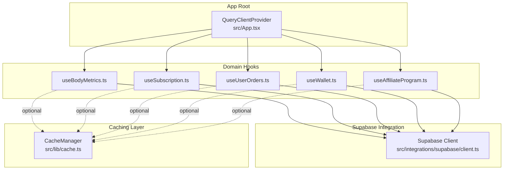
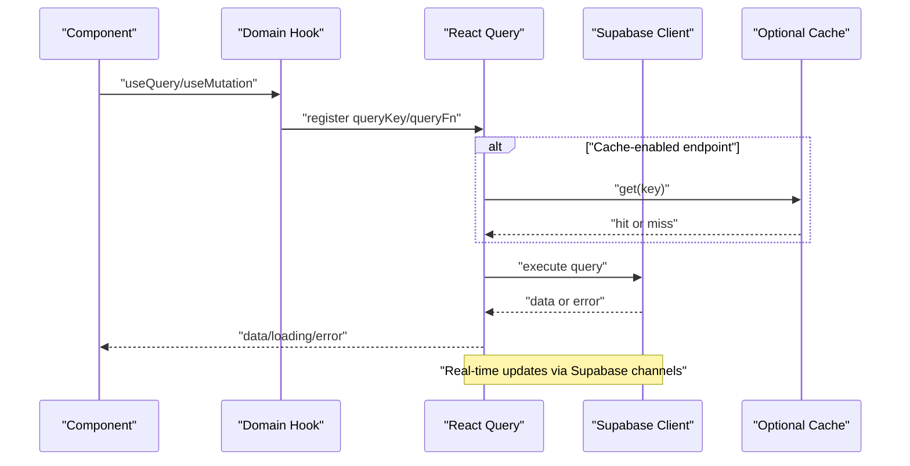
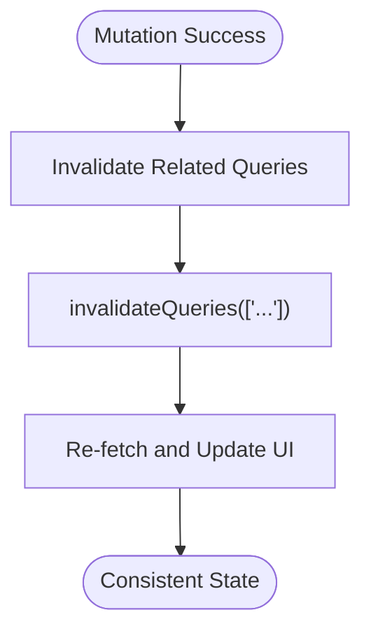
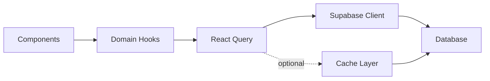

# React Query Integration

<cite>
**Referenced Files in This Document**
- [App.tsx](file://src/App.tsx)
- [client.ts](file://src/integrations/supabase/client.ts)
- [cache.ts](file://src/lib/cache.ts)
- [useBodyMetrics.ts](file://src/hooks/useBodyMetrics.ts)
- [useSubscription.ts](file://src/hooks/useSubscription.ts)
- [useUserOrders.ts](file://src/hooks/useUserOrders.ts)
- [useWallet.ts](file://src/hooks/useWallet.ts)
- [useAffiliateProgram.ts](file://src/hooks/useAffiliateProgram.ts)
- [Onboarding.test.tsx](file://src/pages/Onboarding.test.tsx)
</cite>

## Table of Contents
1. [Introduction](#introduction)
2. [Project Structure](#project-structure)
3. [Core Components](#core-components)
4. [Architecture Overview](#architecture-overview)
5. [Detailed Component Analysis](#detailed-component-analysis)
6. [Dependency Analysis](#dependency-analysis)
7. [Performance Considerations](#performance-considerations)
8. [Troubleshooting Guide](#troubleshooting-guide)
9. [Conclusion](#conclusion)

## Introduction
This document explains how Nutrio integrates React Query (TanStack Query) for server state management. It covers caching strategies, query invalidation patterns, optimistic updates, Supabase client integration, query configuration, error handling, retry mechanisms, background updates, and cache optimization. It also includes performance considerations and memory management guidance for large datasets.

## Project Structure
React Query is initialized at the application root and used pervasively across domain-specific hooks. Supabase is the primary data source, with optional Redis-backed caching layered on top for frequently accessed data.

**Diagram sources**
- [App.tsx:137](file://src/App.tsx#L137)
- [client.ts:1-57](file://src/integrations/supabase/client.ts#L1-L57)
- [cache.ts:1-199](file://src/lib/cache.ts#L1-L199)
- [useBodyMetrics.ts:1-266](file://src/hooks/useBodyMetrics.ts#L1-L266)
- [useSubscription.ts:1-264](file://src/hooks/useSubscription.ts#L1-L264)
- [useUserOrders.ts:1-164](file://src/hooks/useUserOrders.ts#L1-L164)
- [useWallet.ts:1-276](file://src/hooks/useWallet.ts#L1-L276)
- [useAffiliateProgram.ts:1-263](file://src/hooks/useAffiliateProgram.ts#L1-L263)

**Section sources**
- [App.tsx:137](file://src/App.tsx#L137)
- [client.ts:1-57](file://src/integrations/supabase/client.ts#L1-L57)
- [cache.ts:1-199](file://src/lib/cache.ts#L1-L199)

## Core Components
- QueryClientProvider: Initializes the global React Query client at the app root.
- Supabase client: Provides authenticated database access and real-time channels.
- Domain hooks: Encapsulate server state logic per domain (body metrics, subscription, orders, wallet, affiliate program).
- Optional cache layer: Adds TTL-based caching for selected endpoints.

Key responsibilities:
- Centralized query lifecycle management via React Query.
- Real-time synchronization through Supabase channels.
- Controlled cache invalidation and background refetching.
- Error handling and user feedback via toasts.

**Section sources**
- [App.tsx:137](file://src/App.tsx#L137)
- [client.ts:1-57](file://src/integrations/supabase/client.ts#L1-L57)
- [useBodyMetrics.ts:1-266](file://src/hooks/useBodyMetrics.ts#L1-L266)
- [useSubscription.ts:1-264](file://src/hooks/useSubscription.ts#L1-L264)
- [useUserOrders.ts:1-164](file://src/hooks/useUserOrders.ts#L1-L164)
- [useWallet.ts:1-276](file://src/hooks/useWallet.ts#L1-L276)
- [useAffiliateProgram.ts:1-263](file://src/hooks/useAffiliateProgram.ts#L1-L263)

## Architecture Overview
The system uses React Query to manage server state with Supabase as the data source. Optional caching is applied selectively to reduce database load. Real-time updates are handled via Supabase channels inside domain hooks.

**Diagram sources**
- [App.tsx:137](file://src/App.tsx#L137)
- [client.ts:1-57](file://src/integrations/supabase/client.ts#L1-L57)
- [cache.ts:1-199](file://src/lib/cache.ts#L1-L199)
- [useBodyMetrics.ts:1-266](file://src/hooks/useBodyMetrics.ts#L1-L266)
- [useSubscription.ts:1-264](file://src/hooks/useSubscription.ts#L1-L264)

## Detailed Component Analysis

### QueryClient Initialization
- A single QueryClient is created at the app root and provided to the component tree.
- This enables global caching, background refetching, and automatic garbage collection.

**Section sources**
- [App.tsx:137](file://src/App.tsx#L137)

### Supabase Client Integration
- The Supabase client is configured with persistent auth sessions and auto-refresh.
- Capacitor storage is used for native environments to persist auth state.

**Section sources**
- [client.ts:1-57](file://src/integrations/supabase/client.ts#L1-L57)

### Caching Strategies
- Optional cache layer supports TTL-based caching with in-memory fallback.
- Select endpoints are wrapped with cache retrieval and persistence to reduce DB load.
- Cache keys are scoped per domain entity.

Implementation highlights:
- TTL selection aligns with data volatility (e.g., challenges: 5 minutes, restaurants/meals: 10 minutes).
- Pattern-based invalidation supports bulk cache removal when data changes.

**Section sources**
- [cache.ts:1-199](file://src/lib/cache.ts#L1-L199)

### Query Invalidation Patterns
- Domain hooks invalidate related query keys after mutations to keep UI in sync.
- Examples:
  - Logging body metrics invalidates multiple body metrics queries.
  - Updating or deleting metrics invalidates the main list query.
  - Subscription changes trigger refetch via Supabase real-time channels.

**Diagram sources**
- [useBodyMetrics.ts:138-154](file://src/hooks/useBodyMetrics.ts#L138-L154)
- [useBodyMetrics.ts:179-187](file://src/hooks/useBodyMetrics.ts#L179-L187)

**Section sources**
- [useBodyMetrics.ts:138-154](file://src/hooks/useBodyMetrics.ts#L138-L154)
- [useBodyMetrics.ts:179-187](file://src/hooks/useBodyMetrics.ts#L179-L187)

### Optimistic Updates
- While explicit optimistic updates are not implemented in the analyzed hooks, the combination of immediate invalidation and background refetch ensures consistent state after mutations.
- For scenarios requiring immediate UI responsiveness, optimistic updates can be added by modifying the mutation’s onSuccess to locally update query data before invalidation.

[No sources needed since this section provides general guidance]

### Background Updates and Real-Time Sync
- Supabase channels subscribe to relevant tables and trigger refetches when data changes.
- Visibility change listeners ensure data freshness when the app becomes active.

Examples:
- Subscription hook listens to subscription table changes.
- Wallet hook listens to wallet and transaction insert events.

**Section sources**
- [useSubscription.ts:100-123](file://src/hooks/useSubscription.ts#L100-L123)
- [useWallet.ts:223-257](file://src/hooks/useWallet.ts#L223-L257)

### Query Configuration, Error Handling, and Retry
- Queries define queryKey and queryFn; many include enabled guards to avoid unnecessary requests.
- Error handling logs errors and surfaces user-friendly messages via toasts.
- Tests demonstrate disabling retries and adjusting garbage collection for deterministic testing.

**Section sources**
- [useBodyMetrics.ts:28-49](file://src/hooks/useBodyMetrics.ts#L28-L49)
- [useBodyMetrics.ts:107-155](file://src/hooks/useBodyMetrics.ts#L107-L155)
- [Onboarding.test.tsx:77-85](file://src/pages/Onboarding.test.tsx#L77-L85)

### Example Patterns: Server-State Management
- Body metrics: Fetch lists/history/latest, upsert with conflict resolution, and invalidate dependent queries.
- Subscription: Aggregate quotas and statuses, increment usage via RPC, and listen for changes.
- Orders: Filtered view with computed stats, refetched on visibility change.
- Wallet: Wallet creation, transactions pagination, and real-time updates.
- Affiliate program: Settings, stats, commissions, payouts, and network data.

**Section sources**
- [useBodyMetrics.ts:1-266](file://src/hooks/useBodyMetrics.ts#L1-L266)
- [useSubscription.ts:1-264](file://src/hooks/useSubscription.ts#L1-L264)
- [useUserOrders.ts:1-164](file://src/hooks/useUserOrders.ts#L1-L164)
- [useWallet.ts:1-276](file://src/hooks/useWallet.ts#L1-L276)
- [useAffiliateProgram.ts:1-263](file://src/hooks/useAffiliateProgram.ts#L1-L263)

### Cache Optimization
- Prefer selective caching for expensive or frequently accessed endpoints.
- Use short TTLs for volatile data; longer TTLs for stable data.
- Invalidate by pattern when bulk updates occur (e.g., restaurant or meal updates).

**Section sources**
- [cache.ts:124-177](file://src/lib/cache.ts#L124-L177)
- [cache.ts:179-195](file://src/lib/cache.ts#L179-L195)

## Dependency Analysis
React Query orchestrates data flow between components and Supabase. Domain hooks encapsulate query logic and real-time subscriptions. An optional cache layer sits alongside Supabase to reduce load.

**Diagram sources**
- [App.tsx:137](file://src/App.tsx#L137)
- [client.ts:1-57](file://src/integrations/supabase/client.ts#L1-L57)
- [cache.ts:1-199](file://src/lib/cache.ts#L1-L199)
- [useBodyMetrics.ts:1-266](file://src/hooks/useBodyMetrics.ts#L1-L266)

**Section sources**
- [App.tsx:137](file://src/App.tsx#L137)
- [client.ts:1-57](file://src/integrations/supabase/client.ts#L1-L57)
- [cache.ts:1-199](file://src/lib/cache.ts#L1-L199)

## Performance Considerations
- Prefer smaller queryKey scopes to minimize cache pressure.
- Use enabled guards to avoid fetching until required.
- Limit concurrent heavy queries; batch operations when possible.
- For large datasets:
  - Paginate with range-based queries.
  - Use targeted invalidation instead of global refetch.
  - Consider virtualization for rendering long lists.
- Monitor memory usage and adjust garbage collection settings during development as shown in tests.

[No sources needed since this section provides general guidance]

## Troubleshooting Guide
Common issues and resolutions:
- Queries not fetching:
  - Verify queryKey uniqueness and enabled conditions.
  - Confirm user context availability for authenticated queries.
- Stale data:
  - Ensure real-time channels are subscribed and refetch triggers on changes.
  - Use invalidation after mutations to force fresh data.
- Cache inconsistencies:
  - Use pattern-based invalidation for bulk updates.
  - Adjust TTLs based on data volatility.
- Error surfacing:
  - Add error boundaries and user-facing notifications.
  - Log errors centrally for debugging.

**Section sources**
- [useBodyMetrics.ts:138-154](file://src/hooks/useBodyMetrics.ts#L138-L154)
- [useSubscription.ts:100-123](file://src/hooks/useSubscription.ts#L100-L123)
- [cache.ts:179-195](file://src/lib/cache.ts#L179-L195)
- [Onboarding.test.tsx:77-85](file://src/pages/Onboarding.test.tsx#L77-L85)

## Conclusion
Nutrio’s React Query integration provides robust server state management with Supabase as the data backbone. The approach combines automatic caching, controlled invalidation, real-time synchronization, and structured error handling. Optional caching further optimizes performance for hot paths. By following the patterns documented here, teams can maintain scalable, responsive, and predictable data flows across the application.