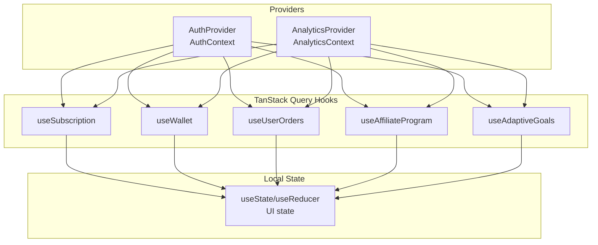
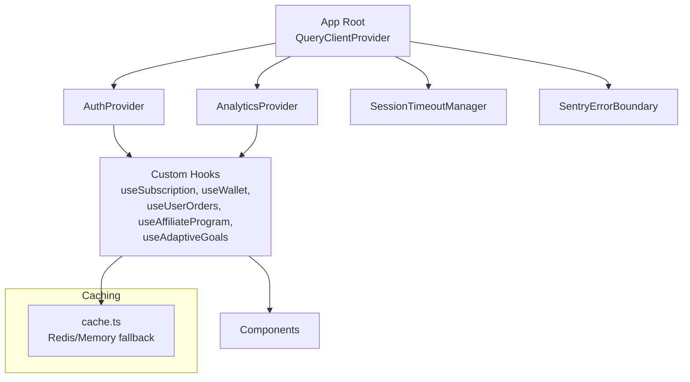
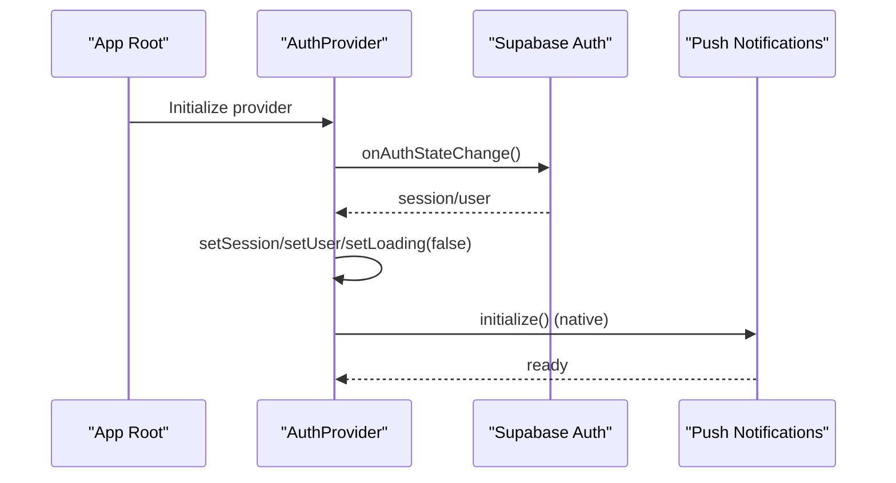
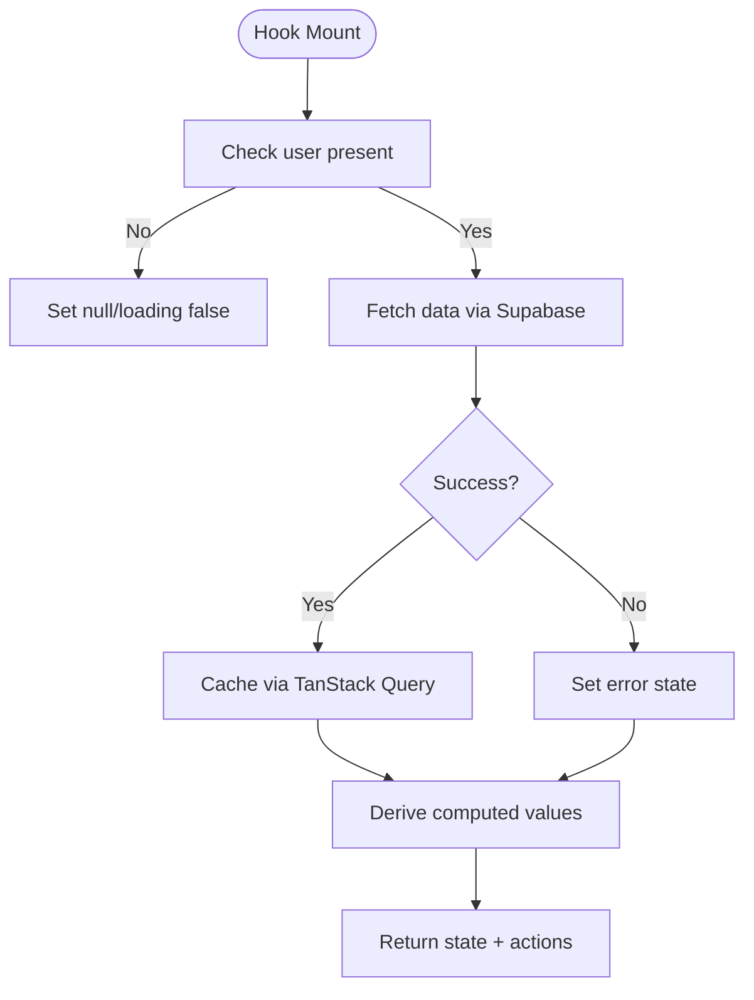
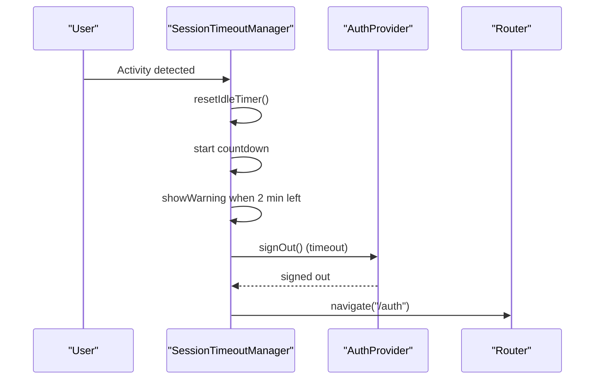
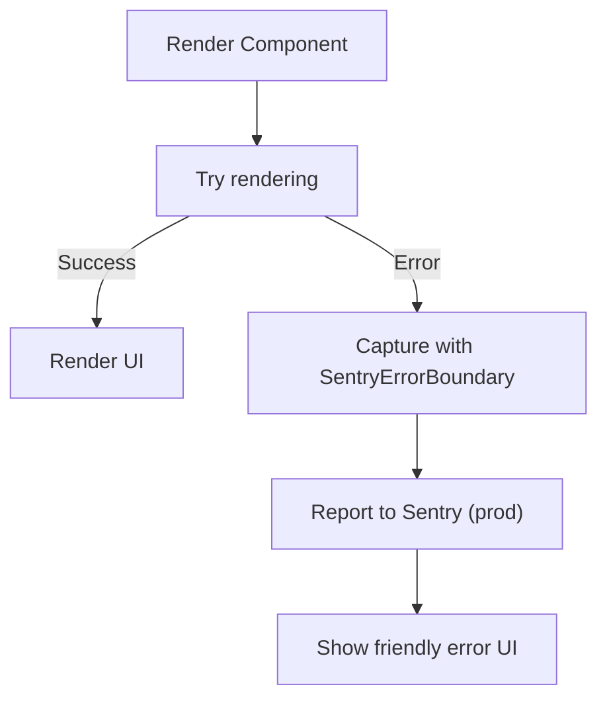
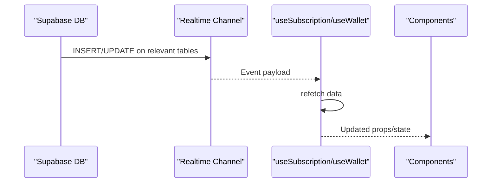
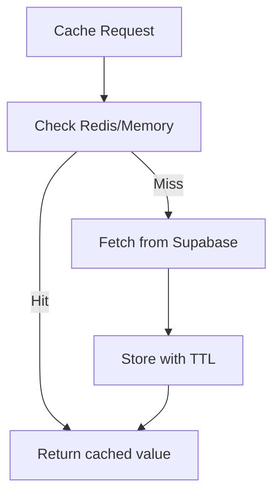
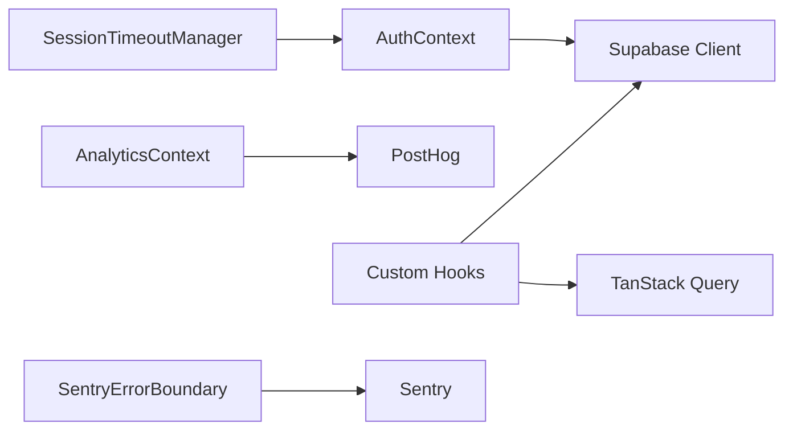

# State Management

<cite>
**Referenced Files in This Document**
- [AuthContext.tsx](file://src/contexts/AuthContext.tsx)
- [AnalyticsContext.tsx](file://src/contexts/AnalyticsContext.tsx)
- [App.tsx](file://src/App.tsx)
- [SessionTimeoutManager.tsx](file://src/components/SessionTimeoutManager.tsx)
- [SentryErrorBoundary.tsx](file://src/components/SentryErrorBoundary.tsx)
- [useAdaptiveGoals.ts](file://src/hooks/useAdaptiveGoals.ts)
- [useProfile.ts](file://src/hooks/useProfile.ts)
- [useSubscription.ts](file://src/hooks/useSubscription.ts)
- [useWallet.ts](file://src/hooks/useWallet.ts)
- [useUserOrders.ts](file://src/hooks/useUserOrders.ts)
- [useAffiliateProgram.ts](file://src/hooks/useAffiliateProgram.ts)
- [cache.ts](file://src/lib/cache.ts)
- [analytics.ts](file://src/lib/analytics.ts)
- [system-architecture.html](file://docs/plans/system-architecture.html)
- [nutrio-system-documentation.html](file://docs/plans/nutrio-system-documentation.html)
- [ARCHITECTURE.md](file://.planning/codebase/ARCHITECTURE.md)
</cite>

## Table of Contents
1. [Introduction](#introduction)
2. [Project Structure](#project-structure)
3. [Core Components](#core-components)
4. [Architecture Overview](#architecture-overview)
5. [Detailed Component Analysis](#detailed-component-analysis)
6. [Dependency Analysis](#dependency-analysis)
7. [Performance Considerations](#performance-considerations)
8. [Troubleshooting Guide](#troubleshooting-guide)
9. [Conclusion](#conclusion)

## Introduction
This document explains Nutrio’s multi-layered state management architecture. It covers centralized providers (Auth, Analytics), custom hooks for data fetching and updates, integration with TanStack Query for server state, caching strategies, session timeout management, error boundaries, loading states, and cross-component communication patterns across portals.

## Project Structure
Nutrio organizes state across three layers:
- Global providers: AuthContext and AnalyticsContext
- Server state: TanStack Query-powered hooks (e.g., useSubscription, useWallet, useUserOrders, useAffiliateProgram)
- Local component state: useState/useReducer for UI concerns

**Diagram sources**
- [App.tsx:137-140](file://src/App.tsx#L137-L140)
- [AuthContext.tsx:31-130](file://src/contexts/AuthContext.tsx#L31-L130)
- [AnalyticsContext.tsx:22-61](file://src/contexts/AnalyticsContext.tsx#L22-L61)
- [useSubscription.ts:42-264](file://src/hooks/useSubscription.ts#L42-L264)
- [useWallet.ts:56-276](file://src/hooks/useWallet.ts#L56-L276)
- [useUserOrders.ts:43-164](file://src/hooks/useUserOrders.ts#L43-L164)
- [useAffiliateProgram.ts:69-263](file://src/hooks/useAffiliateProgram.ts#L69-L263)
- [useAdaptiveGoals.ts:62-407](file://src/hooks/useAdaptiveGoals.ts#L62-L407)

**Section sources**
- [App.tsx:137-140](file://src/App.tsx#L137-L140)
- [system-architecture.html:985-1028](file://docs/plans/system-architecture.html#L985-L1028)
- [nutrio-system-documentation.html:1372-1412](file://docs/plans/nutrio-system-documentation.html#L1372-L1412)
- [ARCHITECTURE.md:36-66](file://.planning/codebase/ARCHITECTURE.md#L36-L66)

## Core Components
- AuthProvider: Centralizes authentication state, session lifecycle, and native push notification initialization.
- AnalyticsProvider: Initializes analytics and exposes tracking utilities.
- TanStack Query: Provides caching, refetching, and optimistic updates for server state via domain-specific hooks.
- Local state: useState/useReducer for UI-level concerns.

Key responsibilities:
- AuthContext: user/session state, sign-in/sign-out, IP-based restrictions, and provider initialization.
- AnalyticsContext: PostHog initialization, page tracking, and user identification.
- Providers are wired at the root level to ensure global availability.

**Section sources**
- [AuthContext.tsx:8-131](file://src/contexts/AuthContext.tsx#L8-L131)
- [AnalyticsContext.tsx:13-61](file://src/contexts/AnalyticsContext.tsx#L13-L61)
- [App.tsx:7-11](file://src/App.tsx#L7-L11)

## Architecture Overview
The state architecture follows a layered approach:
- Providers supply global state (authentication and analytics).
- TanStack Query manages server state with automatic caching and background refetch.
- Local state handles UI concerns.
- Session timeout manager and error boundaries ensure robust UX.

**Diagram sources**
- [App.tsx:137-140](file://src/App.tsx#L137-L140)
- [App.tsx:145-147](file://src/App.tsx#L145-L147)
- [SessionTimeoutManager.tsx:47-317](file://src/components/SessionTimeoutManager.tsx#L47-L317)
- [SentryErrorBoundary.tsx:14-77](file://src/components/SentryErrorBoundary.tsx#L14-L77)
- [cache.ts:16-198](file://src/lib/cache.ts#L16-L198)

**Section sources**
- [system-architecture.html:985-1028](file://docs/plans/system-architecture.html#L985-L1028)
- [nutrio-system-documentation.html:1372-1412](file://docs/plans/nutrio-system-documentation.html#L1372-L1412)

## Detailed Component Analysis

### AuthProvider and AnalyticsProvider
- AuthProvider
  - Listens to Supabase auth state changes and initializes push notifications on native platforms.
  - Provides sign-up, sign-in, and sign-out functions with IP-based restrictions.
  - Manages loading state and exposes user/session to child components.
- AnalyticsProvider
  - Initializes PostHog and exposes tracking functions for events, page views, and user identification.
  - Includes a page tracking hook for automatic page view recording.

**Diagram sources**
- [AuthContext.tsx:36-61](file://src/contexts/AuthContext.tsx#L36-L61)
- [AuthContext.tsx:44-49](file://src/contexts/AuthContext.tsx#L44-L49)

**Section sources**
- [AuthContext.tsx:31-131](file://src/contexts/AuthContext.tsx#L31-L131)
- [AnalyticsContext.tsx:22-61](file://src/contexts/AnalyticsContext.tsx#L22-L61)
- [analytics.ts:3-35](file://src/lib/analytics.ts#L3-L35)

### Custom Hooks Pattern and TanStack Query Integration
- useSubscription
  - Fetches active/pending/cancelled-but-not-expired subscriptions.
  - Real-time updates via Supabase postgres_changes.
  - Visibility change refetch for foreground scenarios.
  - Calculates derived values (remaining meals, can order, VIP status).
  - RPC-based operations for incrementing usage and managing pause/resume.
- useWallet
  - Wallet creation on demand, transaction pagination, and top-up package retrieval.
  - Real-time updates for wallet and transactions via Supabase channels.
  - RPC-based credit operations and payment initiation via edge functions.
- useUserOrders
  - Fetches orders with filtering, calculates stats, and supports refetch on visibility change.
- useAffiliateProgram
  - Loads platform settings, aggregates stats, and manages payouts and network data.
- useAdaptiveGoals
  - Edge function invocation for AI-driven recommendations with graceful fallbacks.
  - Settings, history, and application/dismissal of adjustments.

**Diagram sources**
- [useSubscription.ts:47-98](file://src/hooks/useSubscription.ts#L47-L98)
- [useWallet.ts:65-108](file://src/hooks/useWallet.ts#L65-L108)
- [useUserOrders.ts:50-141](file://src/hooks/useUserOrders.ts#L50-L141)
- [useAffiliateProgram.ts:115-197](file://src/hooks/useAffiliateProgram.ts#L115-L197)
- [useAdaptiveGoals.ts:137-178](file://src/hooks/useAdaptiveGoals.ts#L137-L178)

**Section sources**
- [useSubscription.ts:42-264](file://src/hooks/useSubscription.ts#L42-L264)
- [useWallet.ts:56-276](file://src/hooks/useWallet.ts#L56-L276)
- [useUserOrders.ts:43-164](file://src/hooks/useUserOrders.ts#L43-L164)
- [useAffiliateProgram.ts:69-263](file://src/hooks/useAffiliateProgram.ts#L69-L263)
- [useAdaptiveGoals.ts:62-407](file://src/hooks/useAdaptiveGoals.ts#L62-L407)

### Session Timeout Management
- Tracks user inactivity across the app.
- Warns 2 minutes prior to logout and logs out after 30 minutes.
- Uses BroadcastChannel to synchronize timeouts across browser tabs.
- Exposes a control hook to pause/resume during long operations (e.g., uploads).

**Diagram sources**
- [SessionTimeoutManager.tsx:115-217](file://src/components/SessionTimeoutManager.tsx#L115-L217)
- [SessionTimeoutManager.tsx:88-113](file://src/components/SessionTimeoutManager.tsx#L88-L113)

**Section sources**
- [SessionTimeoutManager.tsx:47-344](file://src/components/SessionTimeoutManager.tsx#L47-L344)

### Error Boundaries and Loading States
- SentryErrorBoundary
  - Captures unhandled errors, sends to Sentry (except dev), and renders a friendly fallback.
  - Includes a functional hook for targeted error reporting.
- Loading states
  - Hooks expose loading booleans and error fields for granular UI feedback.
  - Providers set initial loading states and manage transitions.

**Diagram sources**
- [SentryErrorBoundary.tsx:14-62](file://src/components/SentryErrorBoundary.tsx#L14-L62)

**Section sources**
- [SentryErrorBoundary.tsx:14-77](file://src/components/SentryErrorBoundary.tsx#L14-L77)

### Cross-Component Communication and Portal State Synchronization
- Real-time channels
  - useSubscription listens to postgres_changes on the subscriptions table.
  - useWallet listens to customer_wallets and wallet_transactions.
  - These channels keep local state synchronized with backend changes across portals.
- Visibility-based refetch
  - Hooks refetch when the document becomes visible, ensuring fresh data after background usage.
- Provider-based coordination
  - AuthProvider ensures all hooks operate under a consistent session context.

**Diagram sources**
- [useSubscription.ts:100-123](file://src/hooks/useSubscription.ts#L100-L123)
- [useWallet.ts:223-257](file://src/hooks/useWallet.ts#L223-L257)

**Section sources**
- [useSubscription.ts:100-123](file://src/hooks/useSubscription.ts#L100-L123)
- [useWallet.ts:223-257](file://src/hooks/useWallet.ts#L223-L257)

### Caching Strategies
- In-memory cache fallback with TTL and pattern-based invalidation.
- Dedicated cache keys for restaurants, meals, challenges, and user/subscription data.
- Cached fetchers reduce redundant network requests and improve responsiveness.

**Diagram sources**
- [cache.ts:37-106](file://src/lib/cache.ts#L37-L106)

**Section sources**
- [cache.ts:16-198](file://src/lib/cache.ts#L16-L198)

## Dependency Analysis
- Providers depend on Supabase for auth and realtime.
- Hooks depend on Supabase client and TanStack Query for caching/refetch.
- Analytics depends on PostHog client.
- Session timeout manager coordinates with AuthProvider and router.
- Error boundary integrates with Sentry.

**Diagram sources**
- [AuthContext.tsx:1-7](file://src/contexts/AuthContext.tsx#L1-L7)
- [AnalyticsContext.tsx:1-11](file://src/contexts/AnalyticsContext.tsx#L1-L11)
- [App.tsx:5-6](file://src/App.tsx#L5-L6)
- [SessionTimeoutManager.tsx:12](file://src/components/SessionTimeoutManager.tsx#L12)
- [SentryErrorBoundary.tsx:1](file://src/components/SentryErrorBoundary.tsx#L1)

**Section sources**
- [App.tsx:5-6](file://src/App.tsx#L5-L6)
- [system-architecture.html:985-1028](file://docs/plans/system-architecture.html#L985-L1028)

## Performance Considerations
- Prefer TanStack Query for server state caching and background refetch to minimize network calls.
- Use real-time channels for critical updates (subscriptions, wallet) to avoid polling.
- Implement visibility-based refetch to balance freshness and performance.
- Use caching utilities for expensive reads (restaurants/meals/challenges).
- Keep UI-level state minimal; rely on providers and hooks for shared state.

## Troubleshooting Guide
- Authentication issues
  - Verify Supabase auth state listener is active and sessions are persisted.
  - Check IP-based restrictions and error messages returned by sign-in.
- Analytics not tracking
  - Confirm PostHog is initialized and API key/host are configured.
- Real-time updates not firing
  - Ensure Supabase channels are subscribed and filters match user context.
- Session timeout unexpected behavior
  - Confirm BroadcastChannel compatibility and that activity events are attached.
- Error reporting
  - Use the error boundary hook to capture contextual exceptions in functional components.

**Section sources**
- [AuthContext.tsx:36-61](file://src/contexts/AuthContext.tsx#L36-L61)
- [analytics.ts:3-35](file://src/lib/analytics.ts#L3-L35)
- [useSubscription.ts:100-123](file://src/hooks/useSubscription.ts#L100-L123)
- [SessionTimeoutManager.tsx:63-81](file://src/components/SessionTimeoutManager.tsx#L63-L81)
- [SentryErrorBoundary.tsx:66-77](file://src/components/SentryErrorBoundary.tsx#L66-L77)

## Conclusion
Nutrio’s state management combines global providers, TanStack Query, and local state to deliver a responsive, resilient, and scalable frontend. Providers centralize identity and analytics, hooks encapsulate server state with caching and real-time updates, and supporting components (timeout manager, error boundaries) ensure a robust user experience across portals.