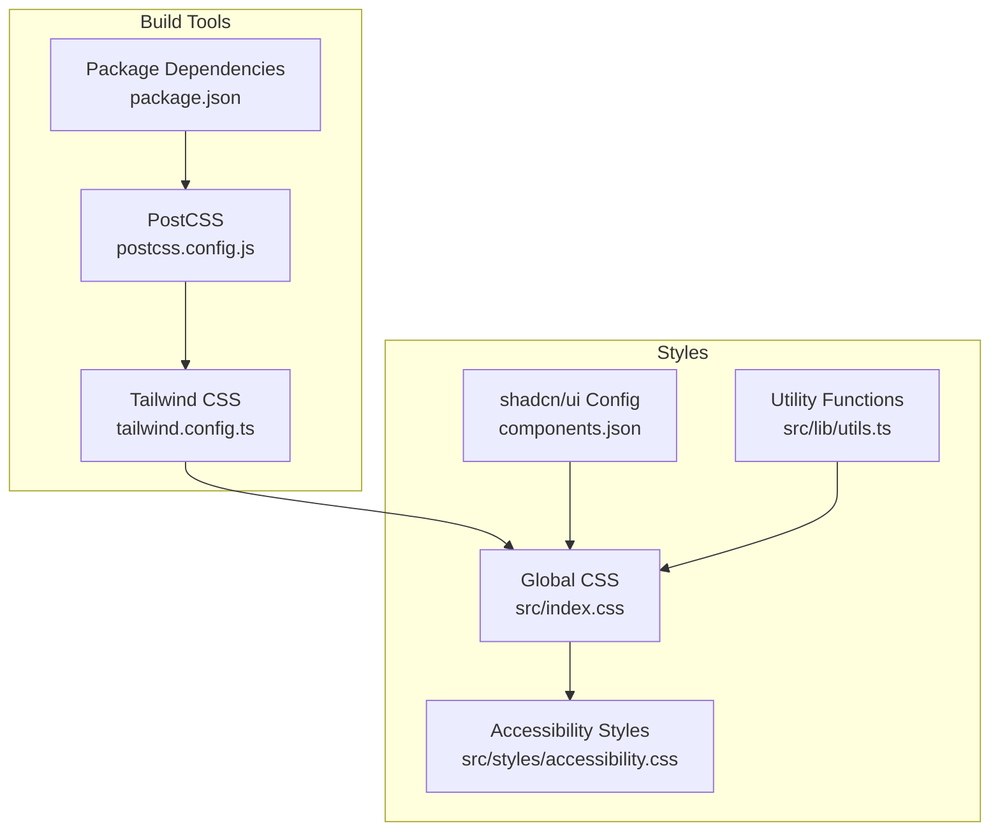
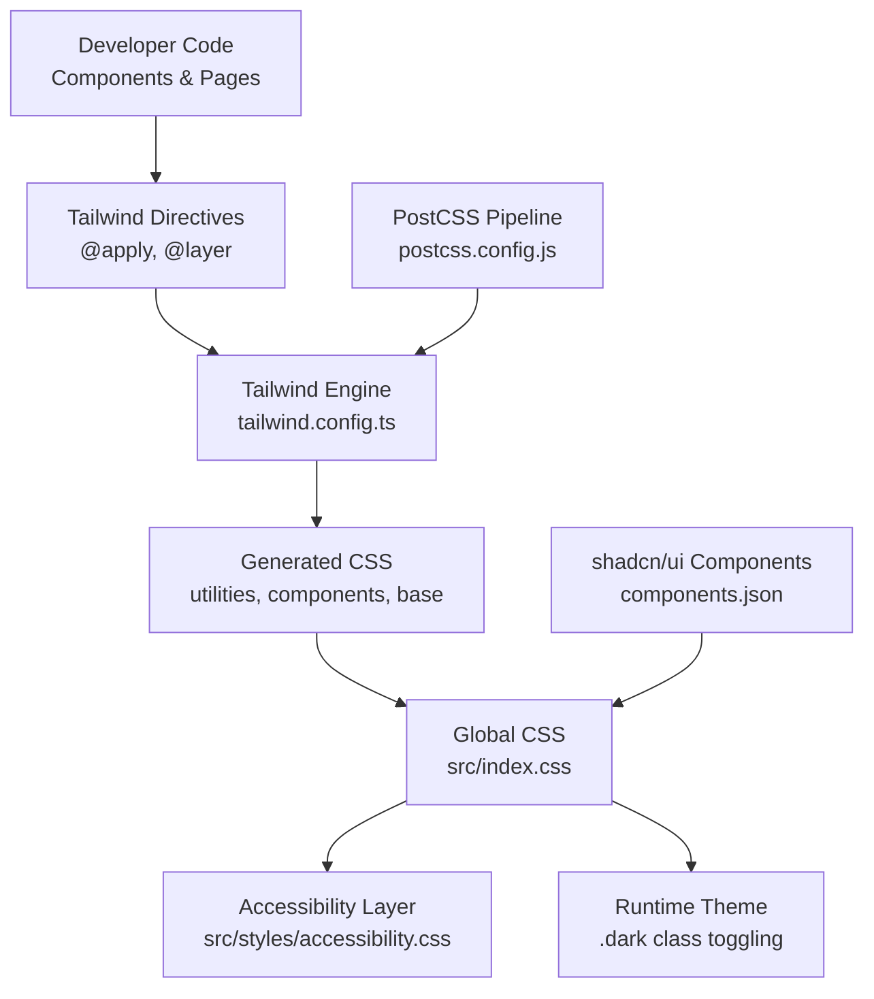
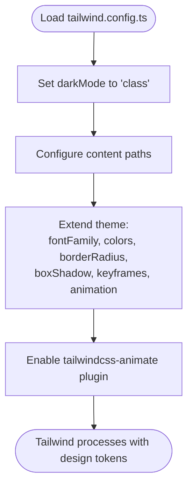
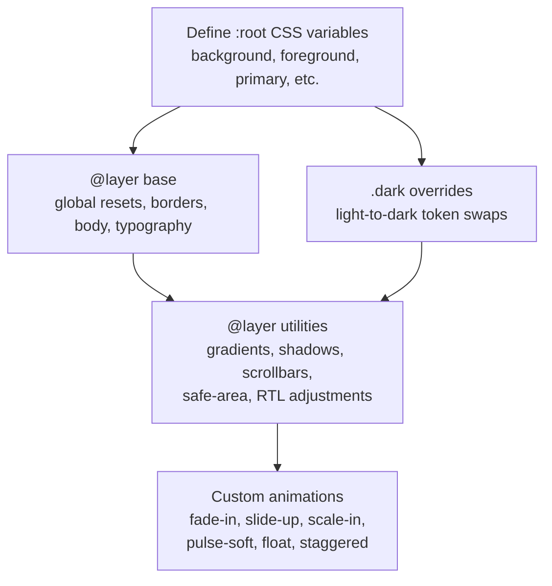
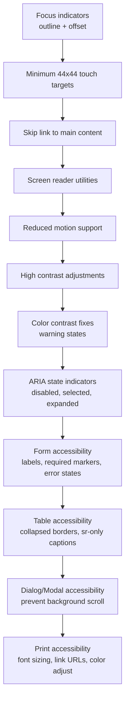
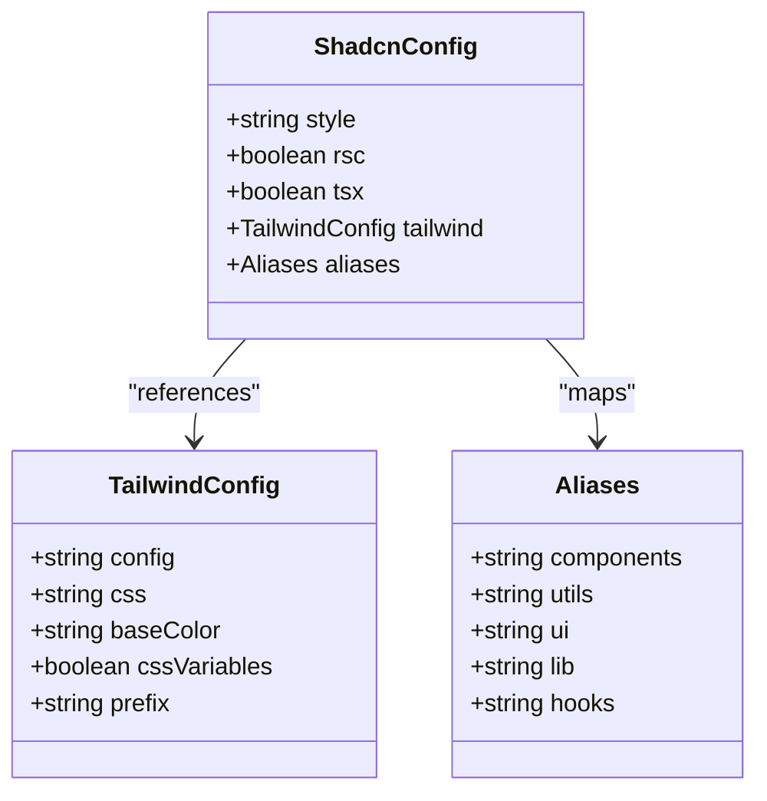
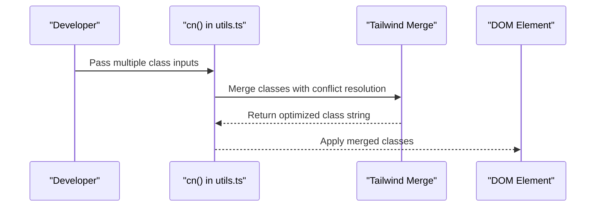
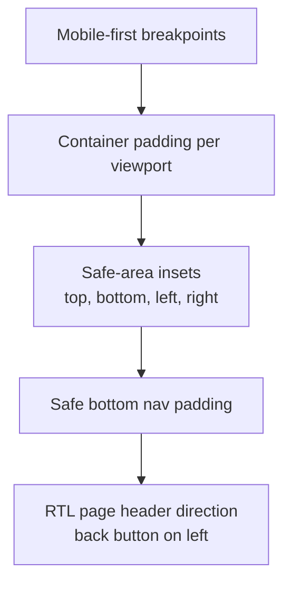
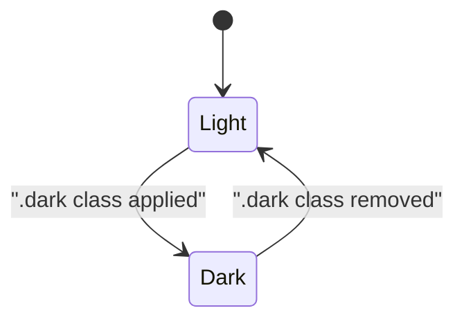
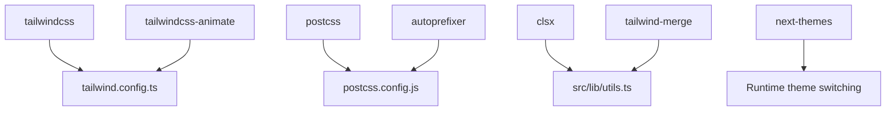

# Styling & Theming

<cite>
**Referenced Files in This Document**
- [tailwind.config.ts](file://tailwind.config.ts)
- [postcss.config.js](file://postcss.config.js)
- [components.json](file://components.json)
- [src/index.css](file://src/index.css)
- [src/styles/accessibility.css](file://src/styles/accessibility.css)
- [src/lib/utils.ts](file://src/lib/utils.ts)
- [package.json](file://package.json)
</cite>

## Table of Contents
1. [Introduction](#introduction)
2. [Project Structure](#project-structure)
3. [Core Components](#core-components)
4. [Architecture Overview](#architecture-overview)
5. [Detailed Component Analysis](#detailed-component-analysis)
6. [Dependency Analysis](#dependency-analysis)
7. [Performance Considerations](#performance-considerations)
8. [Troubleshooting Guide](#troubleshooting-guide)
9. [Conclusion](#conclusion)

## Introduction
This document provides comprehensive styling and theming documentation for the Nutrio frontend. It explains the Tailwind CSS configuration, design system implementation, and component styling patterns. It also covers theme customization, color schemes, typography, spacing conventions, responsive design, cross-platform considerations, integration with shadcn/ui components, custom utility classes, accessibility compliance, dark mode implementation, brand consistency guidelines, and performance optimization strategies.

## Project Structure
The styling system is built around Tailwind CSS with PostCSS processing, shadcn/ui component integration, and a cohesive design token system. Key files include:
- Tailwind configuration defining design tokens, color palettes, animations, and content paths
- Global CSS with CSS variables for light and dark themes, gradients, shadows, and utilities
- Accessibility-focused CSS overrides and WCAG-compliant patterns
- shadcn/ui configuration for consistent component styling
- Utility functions for merging Tailwind classes

**Diagram sources**
- [postcss.config.js:1-7](file://postcss.config.js#L1-L7)
- [tailwind.config.ts:1-128](file://tailwind.config.ts#L1-L128)
- [package.json:1-159](file://package.json#L1-L159)
- [src/index.css:1-297](file://src/index.css#L1-L297)
- [src/styles/accessibility.css:1-253](file://src/styles/accessibility.css#L1-L253)
- [components.json:1-21](file://components.json#L1-L21)
- [src/lib/utils.ts:1-7](file://src/lib/utils.ts#L1-L7)

**Section sources**
- [tailwind.config.ts:1-128](file://tailwind.config.ts#L1-L128)
- [postcss.config.js:1-7](file://postcss.config.js#L1-L7)
- [components.json:1-21](file://components.json#L1-L21)
- [src/index.css:1-297](file://src/index.css#L1-L297)
- [src/styles/accessibility.css:1-253](file://src/styles/accessibility.css#L1-L253)
- [src/lib/utils.ts:1-7](file://src/lib/utils.ts#L1-L7)
- [package.json:1-159](file://package.json#L1-L159)

## Core Components
This section outlines the foundational styling elements that define the Nutrio design system.

- Design Tokens and CSS Variables
  - Light and dark themes are defined via CSS variables scoped to :root and .dark selectors
  - Tokens include background, foreground, primary, secondary, muted, accent, destructive, warning, success, borders, inputs, rings, radius, gradients, and shadows
  - Sidebar-specific tokens are included for consistent navigation theming

- Color System
  - Semantic color roles: background, foreground, primary, secondary, destructive, warning, success, muted, accent, popover, card, and sidebar
  - CSS variable-based color system enables easy theme switching and consistent usage across components

- Typography
  - Plus Jakarta Sans is set as the primary font family
  - Headings apply bold weights and controlled tracking
  - Body text inherits background and foreground colors with antialiasing

- Spacing and Radius
  - Consistent border radius values (lg, md, sm, xl, 2xl) derived from a single --radius token
  - Container padding and responsive screen thresholds for content layout

- Gradients and Shadows
  - Predefined gradient tokens for primary, hero, and card backgrounds
  - Shadow tokens for card, hover, and glow effects

- Animations and Transitions
  - Tailwind keyframes and animation utilities for accordion, shimmer, success pop/glow, and check draw
  - Additional custom animations (fade-in, slide-up, scale-in, pulse-soft, float) and staggered variants

- Utilities
  - Gradient utilities, shadow utilities, text gradient effect, custom scrollbar styling, safe-area insets, and RTL page header adjustments

**Section sources**
- [src/index.css:8-144](file://src/index.css#L8-L144)
- [src/index.css:146-238](file://src/index.css#L146-L238)
- [tailwind.config.ts:19-124](file://tailwind.config.ts#L19-L124)

## Architecture Overview
The styling architecture integrates Tailwind CSS with PostCSS, shadcn/ui, and a centralized design token system. The build pipeline processes Tailwind directives, merges CSS variables, and applies accessibility enhancements.

**Diagram sources**
- [tailwind.config.ts:1-128](file://tailwind.config.ts#L1-L128)
- [postcss.config.js:1-7](file://postcss.config.js#L1-L7)
- [src/index.css:1-297](file://src/index.css#L1-L297)
- [src/styles/accessibility.css:1-253](file://src/styles/accessibility.css#L1-L253)
- [components.json:1-21](file://components.json#L1-L21)

## Detailed Component Analysis

### Tailwind Configuration
The Tailwind configuration defines:
- Dark mode strategy using the "class" mode
- Content paths scanning pages, components, app, and src directories
- Extended theme with:
  - Font family: Plus Jakarta Sans
  - Semantic color palette mapped to CSS variables
  - Border radius tokens derived from --radius
  - Shadow tokens for card, hover, and glow
  - Keyframes and animations for interactive feedback
- Plugin integration for animations

**Diagram sources**
- [tailwind.config.ts:3-127](file://tailwind.config.ts#L3-L127)

**Section sources**
- [tailwind.config.ts:1-128](file://tailwind.config.ts#L1-L128)

### Global CSS and Design Tokens
The global CSS establishes:
- CSS variables for light and dark themes
- Base layer styling for borders, body, and typography
- Utility layer for gradients, shadows, scrollbars, safe areas, and RTL adjustments
- Custom animations and staggered animation utilities

**Diagram sources**
- [src/index.css:8-144](file://src/index.css#L8-L144)
- [src/index.css:146-238](file://src/index.css#L146-L238)
- [src/index.css:240-297](file://src/index.css#L240-L297)

**Section sources**
- [src/index.css:1-297](file://src/index.css#L1-L297)

### Accessibility System
The accessibility stylesheet enforces:
- Focus visibility with :focus-visible and :focus:not(:focus-visible)
- Minimum 44x44 touch target sizes for interactive elements
- Skip link for keyboard navigation
- Screen reader utilities (.sr-only)
- Reduced motion support respecting user preferences
- High contrast mode adjustments
- Color contrast fixes for warning states
- ARIA state indicators and role support
- Form accessibility patterns
- Table and dialog/modal accessibility
- Print accessibility considerations

**Diagram sources**
- [src/styles/accessibility.css:6-252](file://src/styles/accessibility.css#L6-L252)

**Section sources**
- [src/styles/accessibility.css:1-253](file://src/styles/accessibility.css#L1-L253)

### shadcn/ui Integration
shadcn/ui is configured to:
- Use TypeScript with TSX
- Reference the local Tailwind config and CSS file
- Apply slate as the base color with CSS variables enabled
- Map aliases for components, utils, ui, lib, and hooks

**Diagram sources**
- [components.json:1-21](file://components.json#L1-L21)

**Section sources**
- [components.json:1-21](file://components.json#L1-L21)

### Utility Classes and Class Merging
The utility function combines clsx and tailwind-merge to safely merge Tailwind classes, preventing conflicts and ensuring predictable output.

**Diagram sources**
- [src/lib/utils.ts:4-6](file://src/lib/utils.ts#L4-L6)

**Section sources**
- [src/lib/utils.ts:1-7](file://src/lib/utils.ts#L1-L7)

### Responsive Design and Cross-Platform Considerations
Responsive design follows a mobile-first strategy:
- Container padding and screen thresholds for sm, md, lg, xl, 2xl
- Safe-area insets applied to body for mobile devices
- Fixed bottom navigation safe padding
- RTL support for page headers

**Diagram sources**
- [tailwind.config.ts:8-18](file://tailwind.config.ts#L8-L18)
- [src/index.css:134-198](file://src/index.css#L134-L198)

**Section sources**
- [tailwind.config.ts:8-18](file://tailwind.config.ts#L8-L18)
- [src/index.css:134-198](file://src/index.css#L134-L198)

### Dark Mode Implementation
Dark mode is implemented via the "class" strategy:
- .dark class toggles CSS variable values for all tokens
- Automatic dark mode awareness through CSS variable swapping
- Consistent color transitions and shadow adjustments

**Diagram sources**
- [tailwind.config.ts:4](file://tailwind.config.ts#L4)
- [src/index.css:75-123](file://src/index.css#L75-L123)

**Section sources**
- [tailwind.config.ts:4](file://tailwind.config.ts#L4)
- [src/index.css:75-123](file://src/index.css#L75-L123)

### Brand Consistency Guidelines
Brand consistency is maintained through:
- Centralized color tokens for primary, secondary, accent, warning, success, and destructive
- Consistent typography using Plus Jakarta Sans
- Unified border radius and shadow tokens
- Predefined gradient and shadow utilities
- Accessible color contrast and high contrast mode support

**Section sources**
- [src/index.css:8-73](file://src/index.css#L8-L73)
- [src/index.css:141-143](file://src/index.css#L141-L143)
- [tailwind.config.ts:77-88](file://tailwind.config.ts#L77-L88)

## Dependency Analysis
The styling system relies on the following dependencies and their roles:
- Tailwind CSS: Core utility and design system engine
- Tailwind CSS Animate: Animation utilities and keyframes
- PostCSS and Autoprefixer: Build-time CSS processing
- clsx and tailwind-merge: Safe class merging
- next-themes: Theme switching utilities (runtime)

**Diagram sources**
- [package.json:104-126](file://package.json#L104-L126)
- [tailwind.config.ts:126](file://tailwind.config.ts#L126)
- [postcss.config.js:1-7](file://postcss.config.js#L1-L7)
- [src/lib/utils.ts:1-7](file://src/lib/utils.ts#L1-L7)

**Section sources**
- [package.json:104-126](file://package.json#L104-L126)
- [tailwind.config.ts:126](file://tailwind.config.ts#L126)
- [postcss.config.js:1-7](file://postcss.config.js#L1-L7)
- [src/lib/utils.ts:1-7](file://src/lib/utils.ts#L1-L7)

## Performance Considerations
To optimize styling and component rendering performance:
- Minimize unused CSS by scoping Tailwind content paths and purging unreachable utilities
- Prefer CSS variables for theming to avoid runtime reflows
- Use animation utilities sparingly and leverage reduced motion preferences
- Keep component styles modular and avoid deeply nested selectors
- Utilize the cn utility to prevent class conflicts and reduce render churn
- Apply safe-area insets and RTL adjustments conditionally to avoid unnecessary recalculations

[No sources needed since this section provides general guidance]

## Troubleshooting Guide
Common styling and theming issues and resolutions:
- Theme not switching: Ensure the .dark class is toggled on the root element and CSS variables are correctly overridden
- Accessibility violations: Verify focus indicators, touch target sizes, and ARIA attributes are implemented
- Animation performance: Respect prefers-reduced-motion and limit heavy animations
- shadcn/ui inconsistencies: Confirm components.json matches Tailwind config and aliases are correct
- Build errors: Validate Tailwind and PostCSS configurations and ensure dependencies are installed

**Section sources**
- [src/styles/accessibility.css:6-252](file://src/styles/accessibility.css#L6-L252)
- [components.json:1-21](file://components.json#L1-L21)
- [tailwind.config.ts:1-128](file://tailwind.config.ts#L1-L128)
- [postcss.config.js:1-7](file://postcss.config.js#L1-L7)

## Conclusion
Nutrio’s styling and theming system leverages a robust Tailwind CSS configuration, a centralized design token system, and accessibility-first patterns. The integration with shadcn/ui ensures consistent component styling, while CSS variables enable seamless dark mode and brand consistency. By following the outlined patterns and performance recommendations, developers can maintain a scalable, accessible, and visually coherent frontend across platforms.