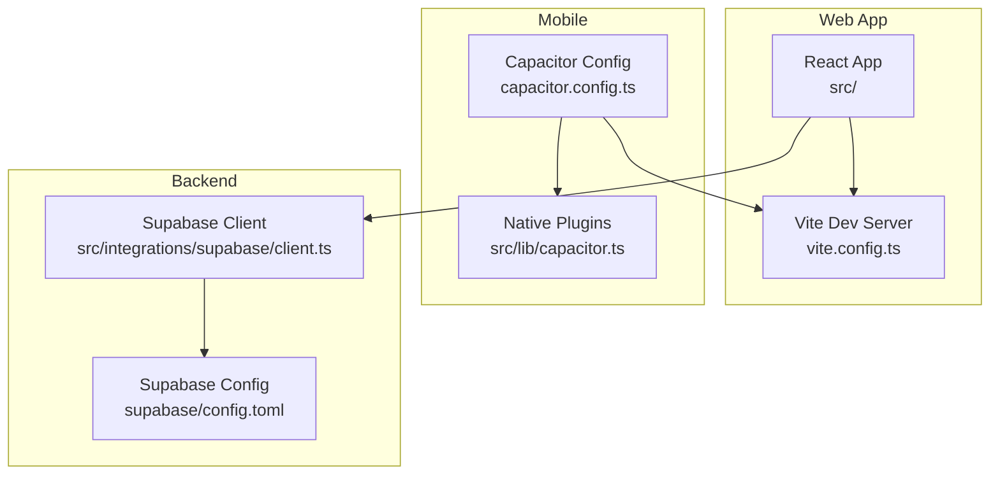

# Getting Started

<cite>
**Referenced Files in This Document**
- [package.json](file://package.json)
- [vite.config.ts](file://vite.config.ts)
- [capacitor.config.ts](file://capacitor.config.ts)
- [src/integrations/supabase/client.ts](file://src/integrations/supabase/client.ts)
- [src/lib/capacitor.ts](file://src/lib/capacitor.ts)
- [playwright.config.ts](file://playwright.config.ts)
- [supabase/config.toml](file://supabase/config.toml)
- [DEPLOYMENT.md](file://DEPLOYMENT.md)
- [IMPLEMENTATION_SUMMARY.md](file://IMPLEMENTATION_SUMMARY.md)
</cite>

## Table of Contents
1. [Introduction](#introduction)
2. [Project Structure](#project-structure)
3. [Prerequisites](#prerequisites)
4. [Development Environment Setup](#development-environment-setup)
5. [Database Initialization](#database-initialization)
6. [Environment Variable Configuration](#environment-variable-configuration)
7. [Local Development Server](#local-development-server)
8. [Frontend Development](#frontend-development)
9. [Backend Service Setup](#backend-service-setup)
10. [Mobile App Building](#mobile-app-building)
11. [Verification Steps](#verification-steps)
12. [Troubleshooting Guide](#troubleshooting-guide)
13. [Conclusion](#conclusion)

## Introduction
This guide helps you set up the Nutrio platform for development across web-only, full-stack, and mobile environments. It covers installing prerequisites, configuring Supabase, initializing the database, setting environment variables, starting the local development server, and building the mobile app with Capacitor. It also includes troubleshooting tips and verification steps to ensure everything is working correctly.

## Project Structure
The project is a React-based web application with integrated Capacitor for mobile builds. Supabase powers authentication, real-time features, and edge functions. The repository includes:
- Web application under src/
- Capacitor configuration for Android and iOS
- Supabase configuration and edge functions
- Playwright end-to-end tests
- Build and development scripts in package.json

**Diagram sources**
- [vite.config.ts:1-72](file://vite.config.ts#L1-L72)
- [capacitor.config.ts:1-45](file://capacitor.config.ts#L1-L45)
- [src/lib/capacitor.ts:1-640](file://src/lib/capacitor.ts#L1-L640)
- [src/integrations/supabase/client.ts:1-57](file://src/integrations/supabase/client.ts#L1-L57)
- [supabase/config.toml:1-59](file://supabase/config.toml#L1-L59)

**Section sources**
- [package.json:1-159](file://package.json#L1-L159)
- [vite.config.ts:1-72](file://vite.config.ts#L1-L72)
- [capacitor.config.ts:1-45](file://capacitor.config.ts#L1-L45)
- [src/lib/capacitor.ts:1-640](file://src/lib/capacitor.ts#L1-L640)
- [src/integrations/supabase/client.ts:1-57](file://src/integrations/supabase/client.ts#L1-L57)
- [supabase/config.toml:1-59](file://supabase/config.toml#L1-L59)

## Prerequisites
- Node.js and npm: Required for the web app and Supabase CLI. Use LTS versions.
- Supabase CLI: Install globally for managing local and remote Supabase projects.
- Capacitor: Mobile build tooling is preconfigured for Android and iOS.
- Git: For cloning and version control.
- Optional: Docker (for local Supabase sandbox) and platform-specific mobile SDKs (Android Studio/Xcode) for device builds.

**Section sources**
- [DEPLOYMENT.md:7-11](file://DEPLOYMENT.md#L7-L11)
- [package.json:1-159](file://package.json#L1-L159)

## Development Environment Setup
Follow these steps to prepare your environment:

1. Install Node.js and npm (LTS recommended).
2. Install the Supabase CLI globally:
   - Using npm: npm install -g supabase
   - Or use npx for one-off commands without global installation.
3. Clone the repository and install dependencies:
   - npm install
4. Verify installations:
   - node --version
   - npm --version
   - supabase --version

**Section sources**
- [DEPLOYMENT.md:14-18](file://DEPLOYMENT.md#L14-L18)
- [package.json:1-159](file://package.json#L1-L159)

## Database Initialization
Initialize and configure your Supabase project:

1. Create a new Supabase project or use an existing one.
2. Link your local project to the Supabase project:
   - supabase link --project-ref=YOUR_PROJECT_ID
3. Deploy edge functions:
   - supabase functions deploy check-ip-location
   - supabase functions deploy log-user-ip
4. Push database migrations:
   - supabase db push
5. Confirm configuration:
   - supabase status
   - supabase functions status
   - supabase db status

Notes:
- The Supabase configuration file defines function JWT verification settings for local development.
- Edge functions referenced here are part of the broader Supabase ecosystem used by the platform.

**Section sources**
- [DEPLOYMENT.md:20-52](file://DEPLOYMENT.md#L20-L52)
- [supabase/config.toml:1-59](file://supabase/config.toml#L1-L59)

## Environment Variable Configuration
Configure environment variables for local development:

- Web app variables (Vite):
  - VITE_SUPABASE_URL: Supabase project URL
  - VITE_SUPABASE_PUBLISHABLE_KEY: Supabase publishable key
  - Optional: VITE_POSTHOG_KEY, VITE_SENTRY_DSN, RESEND_API_KEY
- Mobile app variables:
  - Capacitor reads the same Supabase variables via Vite’s import.meta.env
  - Capacitor stores auth sessions using native preferences on devices

Validation:
- The Supabase client checks for presence of URL and publishable key and logs an error if missing.
- Capacitor wrapper detects native vs web and switches storage accordingly.

**Section sources**
- [src/integrations/supabase/client.ts:7-16](file://src/integrations/supabase/client.ts#L7-L16)
- [src/integrations/supabase/client.ts:44-56](file://src/integrations/supabase/client.ts#L44-L56)
- [capacitor.config.ts:3-17](file://capacitor.config.ts#L3-L17)

## Local Development Server
Start the Vite development server:

- Command: npm run dev
- Server listens on http://localhost:5173 (adjustable in vite.config.ts)
- HMR improvements and strict port settings are enabled for reliable hot reloading
- For mobile testing, the server is accessible on the local network

Optional: Configure Playwright to use the local dev server during E2E tests by uncommenting the webServer section in playwright.config.ts.

**Section sources**
- [package.json:7-8](file://package.json#L7-L8)
- [vite.config.ts:12-27](file://vite.config.ts#L12-L27)
- [playwright.config.ts:84-91](file://playwright.config.ts#L84-L91)

## Frontend Development
Frontend development workflow:

- Start the dev server: npm run dev
- Open http://localhost:5173 in your browser
- Use React components under src/ and run tests:
  - Unit tests: npm run test or npm run test:run
  - Coverage: npm run test:coverage
  - UI mode: npm run test:ui
- Linting and type checking:
  - npm run lint
  - npm run typecheck
- Build for production:
  - npm run build

Capacitor integration:
- Capacitor config sets webDir to dist and proxies to Vite dev server in development
- Native features are wrapped in src/lib/capacitor.ts with graceful web fallbacks

**Section sources**
- [package.json:11-18](file://package.json#L11-L18)
- [vite.config.ts:1-72](file://vite.config.ts#L1-L72)
- [capacitor.config.ts:6-17](file://capacitor.config.ts#L6-L17)
- [src/lib/capacitor.ts:1-640](file://src/lib/capacitor.ts#L1-L640)

## Backend Service Setup
Backend services powered by Supabase:

- Supabase client initialization:
  - Uses Vite environment variables for Supabase URL and publishable key
  - Integrates native preferences for session persistence on mobile
- Edge functions:
  - Managed via Supabase CLI
  - JWT verification toggled in supabase/config.toml for local development
- Additional backend services:
  - WebSocket server exists under websocket-server/ (Dockerized)
  - Not required for basic web/mobile development unless real-time features are extended

**Section sources**
- [src/integrations/supabase/client.ts:1-57](file://src/integrations/supabase/client.ts#L1-L57)
- [supabase/config.toml:1-59](file://supabase/config.toml#L1-L59)
- [DEPLOYMENT.md:26-34](file://DEPLOYMENT.md#L26-L34)

## Mobile App Building
Build and run the mobile app:

- Build the web app:
  - npm run build
- Sync with Capacitor:
  - npm run cap:sync
- Open platform IDEs:
  - Android: npm run cap:android
  - iOS: npm run cap:ios
- Development builds:
  - npm run cap:dev:android
  - npm run cap:dev:ios
- Capacitor configuration:
  - App ID and name are set
  - Server settings allow navigation to supabase.co domains
  - Plugins configured for splash screen, push/local notifications, and biometric auth

Notes:
- Ensure google-services.json is present for Android builds.
- For iOS, open ios/App/App.xcodeproj in Xcode and configure signing.

**Section sources**
- [package.json:20-26](file://package.json#L20-L26)
- [capacitor.config.ts:1-45](file://capacitor.config.ts#L1-L45)

## Verification Steps
Confirm your setup is working:

- Web app
  - Visit http://localhost:5173 and verify the home page loads
  - Check browser console for Supabase configuration warnings
- Supabase
  - Run supabase status and confirm project connectivity
  - Verify deployed functions appear in the Supabase dashboard
- Mobile
  - Run npm run cap:dev:android or npm run cap:dev:ios
  - Confirm the app launches and connects to Supabase
- Tests
  - Run npm run test:run to execute unit tests
  - Run npm run test:e2e for Playwright E2E tests

**Section sources**
- [DEPLOYMENT.md:104-115](file://DEPLOYMENT.md#L104-L115)
- [package.json:13-17](file://package.json#L13-L17)
- [playwright.config.ts:7-11](file://playwright.config.ts#L7-L11)

## Troubleshooting Guide
Common setup issues and resolutions:

- Supabase CLI not found
  - Install globally: npm install -g supabase
  - Or use npx for commands
- Database migration conflicts
  - Reset database locally with supabase db reset (WARNING: deletes data)
- Function deployment errors
  - Check Supabase dashboard for detailed error messages
- Missing Supabase configuration
  - Ensure VITE_SUPABASE_URL and VITE_SUPABASE_PUBLISHABLE_KEY are set
  - The Supabase client logs an error if these are missing
- Mobile build failures
  - Ensure google-services.json exists for Android
  - Verify Capacitor sync ran after building the web app
- Network access for mobile
  - The Vite dev server binds to :: and allows local network access for device testing

**Section sources**
- [DEPLOYMENT.md:96-102](file://DEPLOYMENT.md#L96-L102)
- [src/integrations/supabase/client.ts:10-16](file://src/integrations/supabase/client.ts#L10-L16)
- [vite.config.ts:13-18](file://vite.config.ts#L13-L18)

## Conclusion
You now have a complete setup for developing the Nutrio platform across web, backend, and mobile. Use the scripts in package.json to streamline development, rely on Supabase for authentication and edge functions, and leverage Capacitor for native capabilities. Refer to the troubleshooting section if you encounter issues, and use the verification steps to confirm your environment is ready.