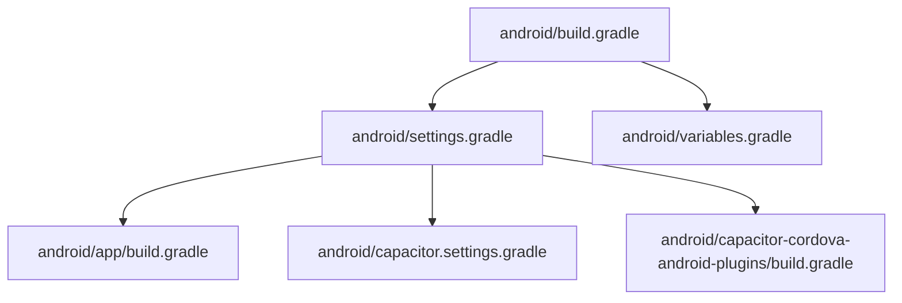
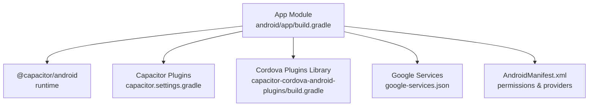
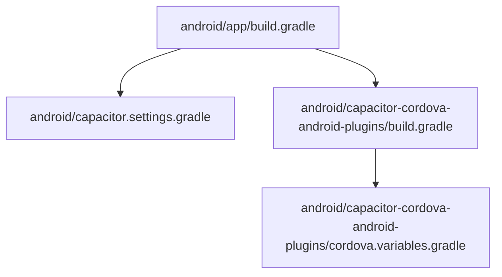
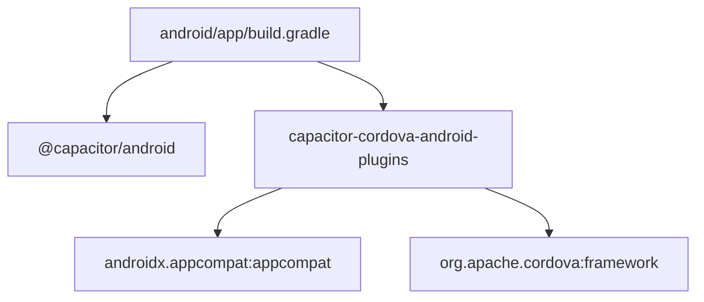

# Android Development

<cite>
**Referenced Files in This Document**
- [android/app/build.gradle](file://android/app/build.gradle)
- [android/build.gradle](file://android/build.gradle)
- [android/settings.gradle](file://android/settings.gradle)
- [android/variables.gradle](file://android/variables.gradle)
- [android/gradle.properties](file://android/gradle.properties)
- [android/app/google-services.json](file://android/app/google-services.json)
- [android/app/proguard-rules.pro](file://android/app/proguard-rules.pro)
- [android/app/src/main/AndroidManifest.xml](file://android/app/src/main/AndroidManifest.xml)
- [android/app/src/main/res/values/styles.xml](file://android/app/src/main/res/values/styles.xml)
- [android/app/src/main/res/values/strings.xml](file://android/app/src/main/res/values/strings.xml)
- [android/app/src/main/res/xml/file_paths.xml](file://android/app/src/main/res/xml/file_paths.xml)
- [android/capacitor.settings.gradle](file://android/capacitor.settings.gradle)
- [android/capacitor-cordova-android-plugins/build.gradle](file://android/capacitor-cordova-android-plugins/build.gradle)
- [android/capacitor-cordova-android-plugins/cordova.variables.gradle](file://android/capacitor-cordova-android-plugins/cordova.variables.gradle)
- [capacitor.config.ts](file://capacitor.config.ts)
</cite>

## Table of Contents
1. [Introduction](#introduction)
2. [Project Structure](#project-structure)
3. [Core Components](#core-components)
4. [Architecture Overview](#architecture-overview)
5. [Detailed Component Analysis](#detailed-component-analysis)
6. [Dependency Analysis](#dependency-analysis)
7. [Performance Considerations](#performance-considerations)
8. [Troubleshooting Guide](#troubleshooting-guide)
9. [Conclusion](#conclusion)

## Introduction
This document provides comprehensive Android development documentation for the Nutrio mobile application. It covers the Android project structure, app module configuration, resource management, Google Services integration, manifest permissions, Cordova and Capacitor plugin integration, Gradle build configuration, signing and release setup, and Android-specific UI patterns aligned with Material Design.

## Project Structure
The Android project is organized as a multi-module Gradle build under the android directory. The primary app module integrates Capacitor for web-to-native bridging, Cordova plugins via a dedicated library module, and standard Android resources and manifests.

Key structural elements:
- Root Gradle build and settings define the app module and include Capacitor-managed submodules.
- The app module defines Android SDK versions, dependencies, signing, and build types.
- Resources include layouts, drawables, values, and XML configurations for providers and permissions.
- Capacitor settings dynamically include Capacitor and plugin modules.
- Cordova plugins are integrated through a separate library module.

**Diagram sources**
- [android/build.gradle:1-30](file://android/build.gradle#L1-L30)
- [android/settings.gradle:1-5](file://android/settings.gradle#L1-L5)
- [android/variables.gradle:1-16](file://android/variables.gradle#L1-L16)
- [android/app/build.gradle:1-75](file://android/app/build.gradle#L1-L75)
- [android/capacitor.settings.gradle:1-43](file://android/capacitor.settings.gradle#L1-L43)
- [android/capacitor-cordova-android-plugins/build.gradle:1-59](file://android/capacitor-cordova-android-plugins/build.gradle#L1-L59)

**Section sources**
- [android/build.gradle:1-30](file://android/build.gradle#L1-L30)
- [android/settings.gradle:1-5](file://android/settings.gradle#L1-L5)
- [android/variables.gradle:1-16](file://android/variables.gradle#L1-L16)

## Core Components
- App Module Build Configuration
  - Defines compile/target/min SDK versions, application ID, versioning, and packaging options.
  - Configures signing for release builds and debug suffixing.
  - Enables code shrinking and ProGuard rules for release.
  - Applies Capacitor build script and conditionally applies Google Services plugin if google-services.json exists.
  - Declares dependencies on Capacitor Android runtime, Cordova plugins library, and AndroidX libraries.

- Root Build and Settings
  - Root buildscript includes Android Gradle Plugin and Google Services classpath.
  - Applies shared variables and global repositories.
  - Settings includes the app module and the Cordova plugins library, and applies Capacitor settings.

- Capacitor Configuration
  - Capacitor config defines app identifiers, webDir, server behavior, and plugin configurations for splash screen, push notifications, local notifications, and native biometric prompts.

**Section sources**
- [android/app/build.gradle:1-75](file://android/app/build.gradle#L1-L75)
- [android/build.gradle:1-30](file://android/build.gradle#L1-L30)
- [android/settings.gradle:1-5](file://android/settings.gradle#L1-L5)
- [capacitor.config.ts:1-45](file://capacitor.config.ts#L1-L45)

## Architecture Overview
The Android app architecture leverages Capacitor to host a web-based UI while enabling native capabilities through plugins. The build system coordinates:
- App module with Capacitor runtime and Cordova plugin library.
- Dynamic inclusion of Capacitor and plugin modules via generated settings.
- Conditional Google Services application for Firebase-based features.

**Diagram sources**
- [android/app/build.gradle:53-75](file://android/app/build.gradle#L53-L75)
- [android/capacitor.settings.gradle:1-43](file://android/capacitor.settings.gradle#L1-L43)
- [android/capacitor-cordova-android-plugins/build.gradle:1-59](file://android/capacitor-cordova-android-plugins/build.gradle#L1-L59)
- [android/app/google-services.json:1-29](file://android/app/google-services.json#L1-L29)
- [android/app/src/main/AndroidManifest.xml:1-53](file://android/app/src/main/AndroidManifest.xml#L1-L53)

## Detailed Component Analysis

### Android App Module Configuration
- SDK and Versioning
  - SDK versions and min/target SDK are centralized in variables.gradle and consumed by the app module.
- Signing Configuration
  - Release signing is controlled by keystore.properties if present; otherwise, release builds proceed unsigned.
- Build Types
  - Debug adds a versionNameSuffix for differentiation.
  - Release enables code shrinking and applies ProGuard rules, and signs with the release configuration if available.
- Dependencies
  - Includes Capacitor Android runtime and Cordova plugins library.
  - Adds AndroidX libraries for appcompat, coordinator layout, and core splash screen.
- Google Services Integration
  - Attempts to apply the Google Services Gradle plugin if google-services.json is present; logs informational message if absent.

**Section sources**
- [android/app/build.gradle:3-44](file://android/app/build.gradle#L3-L44)
- [android/app/build.gradle:19-32](file://android/app/build.gradle#L19-L32)
- [android/app/build.gradle:34-44](file://android/app/build.gradle#L34-L44)
- [android/app/build.gradle:53-63](file://android/app/build.gradle#L53-L63)
- [android/app/build.gradle:67-75](file://android/app/build.gradle#L67-L75)
- [android/variables.gradle:1-16](file://android/variables.gradle#L1-L16)

### Gradle Build and Variables
- Root buildscript classpaths define the Android Gradle Plugin and Google Services plugin versions.
- Global repositories enable resolution of Capacitor, Cordova, and AndroidX artifacts.
- variables.gradle centralizes SDK versions and library versions for reuse across modules.

**Section sources**
- [android/build.gradle:3-16](file://android/build.gradle#L3-L16)
- [android/build.gradle:20-25](file://android/build.gradle#L20-L25)
- [android/variables.gradle:1-16](file://android/variables.gradle#L1-L16)

### Capacitor and Plugin Modules
- Capacitor Settings
  - Dynamically includes Capacitor core and official plugins as separate modules.
- Cordova Plugins Library
  - Provides Cordova framework and a library of Cordova plugins, compiled as a module for the app to consume.

**Diagram sources**
- [android/app/build.gradle:65-65](file://android/app/build.gradle#L65-L65)
- [android/capacitor.settings.gradle:1-43](file://android/capacitor.settings.gradle#L1-L43)
- [android/capacitor-cordova-android-plugins/build.gradle:1-59](file://android/capacitor-cordova-android-plugins/build.gradle#L1-L59)
- [android/capacitor-cordova-android-plugins/cordova.variables.gradle:1-7](file://android/capacitor-cordova-android-plugins/cordova.variables.gradle#L1-L7)

**Section sources**
- [android/capacitor.settings.gradle:1-43](file://android/capacitor.settings.gradle#L1-L43)
- [android/capacitor-cordova-android-plugins/build.gradle:1-59](file://android/capacitor-cordova-android-plugins/build.gradle#L1-L59)
- [android/capacitor-cordova-android-plugins/cordova.variables.gradle:1-7](file://android/capacitor-cordova-android-plugins/cordova.variables.gradle#L1-L7)

### Google Services Configuration
- google-services.json defines Firebase project metadata and client configuration for the app package name.
- The app module attempts to apply the Google Services plugin during build if the JSON file is present.

**Section sources**
- [android/app/google-services.json:1-29](file://android/app/google-services.json#L1-L29)
- [android/app/build.gradle:67-75](file://android/app/build.gradle#L67-L75)

### Manifest Permissions and Providers
- Activity Declaration
  - MainActivity is exported and configured with singleTask launch mode and standard launcher intent filter.
- File Provider
  - A FileProvider is declared with authorities derived from the applicationId and a file_paths XML resource.
- Permissions
  - Internet permission is declared for network access.
  - Storage permissions for read/write are declared, with WRITE permission scoped to maxSdkVersion 29.
- Features
  - Camera hardware features are declared as not required.

**Section sources**
- [android/app/src/main/AndroidManifest.xml:12-25](file://android/app/src/main/AndroidManifest.xml#L12-L25)
- [android/app/src/main/AndroidManifest.xml:27-35](file://android/app/src/main/AndroidManifest.xml#L27-L35)
- [android/app/src/main/AndroidManifest.xml:40-52](file://android/app/src/main/AndroidManifest.xml#L40-L52)

### Asset Management and Resources
- Layouts and Drawables
  - activity_main.xml and ic_launcher assets are present under res/layout and res/drawable-*.
- Values and Styles
  - strings.xml and styles.xml provide localized strings and theme definitions.
- File Paths
  - file_paths.xml configures paths exposed via the FileProvider.

**Section sources**
- [android/app/src/main/res/layout/activity_main.xml](file://android/app/src/main/res/layout/activity_main.xml)
- [android/app/src/main/res/drawable/ic_launcher_background.xml](file://android/app/src/main/res/drawable/ic_launcher_background.xml)
- [android/app/src/main/res/drawable-v24/ic_launcher_foreground.xml](file://android/app/src/main/res/drawable-v24/ic_launcher_foreground.xml)
- [android/app/src/main/res/values/strings.xml](file://android/app/src/main/res/values/strings.xml)
- [android/app/src/main/res/values/styles.xml](file://android/app/src/main/res/values/styles.xml)
- [android/app/src/main/res/xml/file_paths.xml](file://android/app/src/main/res/xml/file_paths.xml)

### Capacitor Configuration and Plugins
- Server and Navigation
  - androidScheme set to https; cleartext enabled; allowNavigation includes Supabase domains.
- Plugins
  - SplashScreen: launch duration, auto-hide, background color, Android resource name, scale type, spinner visibility, full screen, and immersive options.
  - PushNotifications: badge, sound, alert presentation options.
  - LocalNotifications: default sound configuration.
  - NativeBiometric: localized prompts for biometric authentication.

**Section sources**
- [capacitor.config.ts:7-17](file://capacitor.config.ts#L7-L17)
- [capacitor.config.ts:20-41](file://capacitor.config.ts#L20-L41)

### Build Types and ProGuard
- Debug Build Type
  - Adds a versionNameSuffix for debug builds.
- Release Build Type
  - Enables code shrinking and applies ProGuard rules from the project’s proguard-rules.pro file.
- ProGuard Rules
  - Placeholder comments indicate potential WebView and debugging configurations.

**Section sources**
- [android/app/build.gradle:34-44](file://android/app/build.gradle#L34-L44)
- [android/app/proguard-rules.pro:1-22](file://android/app/proguard-rules.pro#L1-L22)

## Dependency Analysis
The app module depends on Capacitor runtime and the Cordova plugins library. Capacitor settings dynamically include official Capacitor plugins. The Cordova library depends on AndroidX AppCompat and the Cordova framework.

**Diagram sources**
- [android/app/build.gradle:58-62](file://android/app/build.gradle#L58-L62)
- [android/capacitor-cordova-android-plugins/build.gradle:44-47](file://android/capacitor-cordova-android-plugins/build.gradle#L44-L47)

**Section sources**
- [android/app/build.gradle:58-62](file://android/app/build.gradle#L58-L62)
- [android/capacitor-cordova-android-plugins/build.gradle:44-47](file://android/capacitor-cordova-android-plugins/build.gradle#L44-L47)

## Performance Considerations
- Enable code shrinking and ProGuard for release builds to reduce APK size and improve runtime performance.
- Keep SDK versions aligned with variables.gradle to benefit from optimized AndroidX libraries.
- Minimize unnecessary Cordova plugin usage to reduce overhead; evaluate Capacitor-native alternatives where available.
- Use appropriate image assets and vector drawables to optimize rendering on various screen densities.

## Troubleshooting Guide
- Google Services Plugin Not Applied
  - If google-services.json is missing, the Google Services plugin will not be applied, and push notifications may not function. Ensure the file is present and matches the applicationId.
- Signing Configuration Issues
  - Release builds require keystore.properties with storeFile, storePassword, keyAlias, and keyPassword. Without it, release builds will be unsigned.
- Manifest Permission Errors
  - Verify permissions for INTERNET, storage, camera, and biometric features match the app’s intended functionality.
- File Provider Path Errors
  - Confirm file_paths.xml exists and aligns with the FileProvider authorities derived from the applicationId.

**Section sources**
- [android/app/build.gradle:67-75](file://android/app/build.gradle#L67-L75)
- [android/app/build.gradle:19-32](file://android/app/build.gradle#L19-L32)
- [android/app/src/main/AndroidManifest.xml:40-52](file://android/app/src/main/AndroidManifest.xml#L40-L52)
- [android/app/src/main/res/xml/file_paths.xml](file://android/app/src/main/res/xml/file_paths.xml)

## Conclusion
The Nutrio Android project is structured around a modular Gradle build with Capacitor for web-native integration and Cordova plugins for extended native capabilities. The configuration establishes clear SDK boundaries, robust release signing, and resource management. By leveraging Capacitor plugins and adhering to the documented setup, developers can maintain a scalable and performant Android application aligned with modern Android development practices.