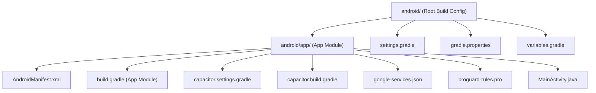
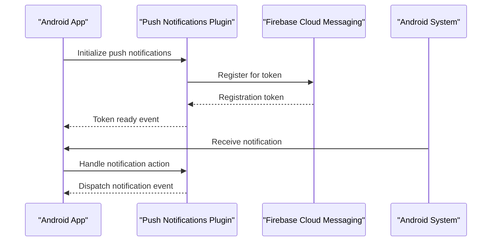

# Android Platform Implementation

<cite>
**Referenced Files in This Document**
- [AndroidManifest.xml](file://android/app/src/main/AndroidManifest.xml)
- [build.gradle](file://android/app/build.gradle)
- [android/build.gradle](file://android/build.gradle)
- [settings.gradle](file://android/settings.gradle)
- [gradle.properties](file://android/gradle.properties)
- [capacitor.config.ts](file://capacitor.config.ts)
- [capacitor.settings.gradle](file://android/capacitor.settings.gradle)
- [capacitor.build.gradle](file://android/app/capacitor.build.gradle)
- [variables.gradle](file://android/variables.gradle)
- [google-services.json](file://android/app/google-services.json)
- [proguard-rules.pro](file://android/app/proguard-rules.pro)
- [MainActivity.java](file://android/app/src/main/java/com/nutriofuel/app/MainActivity.java)
</cite>

## Table of Contents
1. [Introduction](#introduction)
2. [Project Structure](#project-structure)
3. [Core Components](#core-components)
4. [Architecture Overview](#architecture-overview)
5. [Detailed Component Analysis](#detailed-component-analysis)
6. [Dependency Analysis](#dependency-analysis)
7. [Performance Considerations](#performance-considerations)
8. [Troubleshooting Guide](#troubleshooting-guide)
9. [Conclusion](#conclusion)

## Introduction
This document provides comprehensive documentation for the Android platform implementation of the Nutrio mobile application. It covers the Android project structure, build configuration, resource management, Capacitor plugin integration, permission handling, native Java/Kotlin integration patterns, push notification setup with Firebase Cloud Messaging, Google Play Store deployment requirements, and platform-specific optimizations. The goal is to enable developers to understand, maintain, and extend the Android implementation effectively.

## Project Structure
The Android project follows a modular structure typical of Capacitor-based hybrid applications. The main application module resides under android/app, while shared build configuration is centralized in the root android directory. Capacitor manages plugin inclusion via generated Gradle settings, and Firebase integration is configured through google-services.json.

**Diagram sources**
- [android/build.gradle:1-30](file://android/build.gradle#L1-L30)
- [android/settings.gradle:1-5](file://android/settings.gradle#L1-L5)
- [android/gradle.properties:1-23](file://android/gradle.properties#L1-L23)
- [android/variables.gradle:1-16](file://android/variables.gradle#L1-L16)
- [android/app/build.gradle:1-75](file://android/app/build.gradle#L1-L75)
- [android/app/capacitor.settings.gradle:1-43](file://android/app/capacitor.settings.gradle#L1-L43)
- [android/app/capacitor.build.gradle:1-32](file://android/app/capacitor.build.gradle#L1-L32)
- [android/app/google-services.json:1-29](file://android/app/google-services.json#L1-L29)
- [android/app/proguard-rules.pro:1-22](file://android/app/proguard-rules.pro#L1-L22)
- [android/app/src/main/AndroidManifest.xml:1-53](file://android/app/src/main/AndroidManifest.xml#L1-L53)
- [android/app/src/main/java/com/nutriofuel/app/MainActivity.java](file://android/app/src/main/java/com/nutriofuel/app/MainActivity.java)

**Section sources**
- [android/build.gradle:1-30](file://android/build.gradle#L1-L30)
- [android/settings.gradle:1-5](file://android/settings.gradle#L1-L5)
- [android/gradle.properties:1-23](file://android/gradle.properties#L1-L23)
- [android/variables.gradle:1-16](file://android/variables.gradle#L1-L16)
- [android/app/build.gradle:1-75](file://android/app/build.gradle#L1-L75)
- [android/app/capacitor.settings.gradle:1-43](file://android/app/capacitor.settings.gradle#L1-L43)
- [android/app/capacitor.build.gradle:1-32](file://android/app/capacitor.build.gradle#L1-L32)
- [android/app/google-services.json:1-29](file://android/app/google-services.json#L1-L29)
- [android/app/proguard-rules.pro:1-22](file://android/app/proguard-rules.pro#L1-L22)
- [android/app/src/main/AndroidManifest.xml:1-53](file://android/app/src/main/AndroidManifest.xml#L1-L53)
- [android/app/src/main/java/com/nutriofuel/app/MainActivity.java](file://android/app/src/main/java/com/nutriofuel/app/MainActivity.java)

## Core Components
This section outlines the primary Android components and their roles in the Nutrio application.

- Application Manifest and Permissions
  - Defines application metadata, activity declarations, and essential permissions including internet access, storage permissions, camera access, and biometric authentication capabilities.
  - Declares FileProvider for secure file sharing and sets up intent filters for the main launcher activity.

- Build Configuration
  - Centralized SDK versions and dependency management via variables.gradle.
  - App-level build.gradle configures compile/target/min SDK versions, signing for release builds, ProGuard rules, and Capacitor plugin integration.
  - Root build.gradle defines Android Gradle Plugin and Google Services plugin versions, and applies shared variables.

- Capacitor Integration
  - Capacitor configuration controls server behavior, navigation allowances, and plugin settings for splash screen, push notifications, local notifications, and native biometric authentication.
  - Generated settings and build files manage plugin inclusion and Java 21 compatibility.

- Firebase Cloud Messaging
  - google-services.json configures Firebase project settings for push notifications.
  - Conditional application of the Google Services Gradle plugin ensures push notifications function when the configuration file is present.

- Resource Management
  - ProGuard rules provide optional obfuscation and debugging support.
  - AndroidX is enabled for modern Android library compatibility.

**Section sources**
- [android/app/src/main/AndroidManifest.xml:1-53](file://android/app/src/main/AndroidManifest.xml#L1-L53)
- [android/app/build.gradle:1-75](file://android/app/build.gradle#L1-L75)
- [android/build.gradle:1-30](file://android/build.gradle#L1-L30)
- [android/variables.gradle:1-16](file://android/variables.gradle#L1-L16)
- [capacitor.config.ts:1-45](file://capacitor.config.ts#L1-L45)
- [android/app/capacitor.settings.gradle:1-43](file://android/app/capacitor.settings.gradle#L1-L43)
- [android/app/capacitor.build.gradle:1-32](file://android/app/capacitor.build.gradle#L1-L32)
- [android/app/google-services.json:1-29](file://android/app/google-services.json#L1-L29)
- [android/app/proguard-rules.pro:1-22](file://android/app/proguard-rules.pro#L1-L22)
- [android/gradle.properties:1-23](file://android/gradle.properties#L1-L23)

## Architecture Overview
The Android architecture integrates Capacitor as the bridge between the web-based frontend and native Android capabilities. Capacitor plugins provide native features such as push notifications, local notifications, camera, device information, filesystem access, haptics, keyboard handling, preferences, sharing, splash screen, status bar control, and native biometric authentication.

```mermaid
graph TB
WebApp["Web App (Capacitor WebView)"]
CapacitorCore["@capacitor/core"]
AppPlugin["@capacitor/app"]
CameraPlugin["@capacitor/camera"]
DevicePlugin["@capacitor/device"]
FileSystemPlugin["@capacitor/filesystem"]
HapticsPlugin["@capacitor/haptics"]
KeyboardPlugin["@capacitor/keyboard"]
LocalNotificationsPlugin["@capacitor/local-notifications"]
PreferencesPlugin["@capacitor/preferences"]
SharePlugin["@capacitor/share"]
SplashScreenPlugin["@capacitor/splash-screen"]
StatusBarPlugin["@capacitor/status-bar"]
PushNotificationsPlugin["@capacitor/push-notifications"]
NativeBiometricPlugin["@capgo/capacitor-native-biometric"]
WebApp --> CapacitorCore
CapacitorCore --> AppPlugin
CapacitorCore --> CameraPlugin
CapacitorCore --> DevicePlugin
CapacitorCore --> FileSystemPlugin
CapacitorCore --> HapticsPlugin
CapacitorCore --> KeyboardPlugin
CapacitorCore --> LocalNotificationsPlugin
CapacitorCore --> PreferencesPlugin
CapacitorCore --> SharePlugin
CapacitorCore --> SplashScreenPlugin
CapacitorCore --> StatusBarPlugin
CapacitorCore --> PushNotificationsPlugin
CapacitorCore --> NativeBiometricPlugin
```

**Diagram sources**
- [capacitor.config.ts:18-42](file://capacitor.config.ts#L18-L42)
- [android/app/capacitor.settings.gradle:1-43](file://android/app/capacitor.settings.gradle#L1-L43)
- [android/app/capacitor.build.gradle:11-26](file://android/app/capacitor.build.gradle#L11-L26)

**Section sources**
- [capacitor.config.ts:1-45](file://capacitor.config.ts#L1-L45)
- [android/app/capacitor.settings.gradle:1-43](file://android/app/capacitor.settings.gradle#L1-L43)
- [android/app/capacitor.build.gradle:1-32](file://android/app/capacitor.build.gradle#L1-L32)

## Detailed Component Analysis

### AndroidManifest.xml Configuration
The manifest defines application identity, theme, and permissions. It declares the main activity with comprehensive configuration changes support, FileProvider for secure file sharing, and permissions for internet access, storage, camera, and biometric authentication.

Key aspects:
- Activity configuration supports singleTask launch mode and extensive configChanges handling for orientation, keyboard, locale, and density.
- FileProvider authorities use the application ID suffix for secure URI sharing.
- Permissions include INTERNET, READ/WRITE_EXTERNAL_STORAGE, CAMERA, and biometric usage permissions.
- Uses-feature entries for camera hardware indicate optional camera capabilities.

**Section sources**
- [android/app/src/main/AndroidManifest.xml:12-35](file://android/app/src/main/AndroidManifest.xml#L12-L35)
- [android/app/src/main/AndroidManifest.xml:40-51](file://android/app/src/main/AndroidManifest.xml#L40-L51)

### Build Configuration and Dependencies
The build configuration centralizes SDK versions and manages dependencies for Capacitor and AndroidX libraries. The app-level build.gradle handles signing, minification, and plugin integration, while the root build.gradle manages plugin versions and repository configuration.

Key aspects:
- SDK versions managed via variables.gradle (minSdkVersion 24, compileSdkVersion 36, targetSdkVersion 36).
- Release signing configured with keystore.properties file support for CI/CD environments.
- Capacitor Android and Cordova plugins included via project dependencies.
- Google Services plugin conditionally applied based on google-services.json presence.
- Java 21 compatibility enforced in generated capacitor.build.gradle.

**Section sources**
- [android/variables.gradle:1-16](file://android/variables.gradle#L1-L16)
- [android/app/build.gradle:3-44](file://android/app/build.gradle#L3-L44)
- [android/app/build.gradle:53-65](file://android/app/build.gradle#L53-L65)
- [android/build.gradle:9-16](file://android/build.gradle#L9-L16)
- [android/app/capacitor.build.gradle:3-8](file://android/app/capacitor.build.gradle#L3-L8)

### Capacitor Plugin Configuration
Capacitor plugins are configured in capacitor.config.ts with specific settings for splash screen, push notifications, local notifications, and native biometric authentication. The generated settings and build files manage plugin inclusion and compatibility.

Key aspects:
- Splash Screen plugin configured with launch duration, auto-hide, background color, and Android-specific scaling.
- Push Notifications plugin configured with badge, sound, and alert presentation options.
- Local Notifications plugin configured with default sound.
- Native Biometric plugin configured with localized UI strings for biometric authentication prompts.
- Generated settings include @capacitor/* and @capgo/capacitor-native-biometric plugins.

**Section sources**
- [capacitor.config.ts:18-42](file://capacitor.config.ts#L18-L42)
- [android/app/capacitor.settings.gradle:1-43](file://android/app/capacitor.settings.gradle#L1-L43)
- [android/app/capacitor.build.gradle:11-26](file://android/app/capacitor.build.gradle#L11-L26)

### Permission Handling
The application declares essential permissions for network access, storage, camera, and biometric authentication. Storage permissions include a maxSdkVersion constraint for legacy devices. Camera permissions declare optional hardware features.

Best practices:
- Request runtime permissions for camera and biometric features when targeting Android 6.0+.
- Handle permission denials gracefully and guide users to app settings if necessary.
- Respect maxSdkVersion constraints for storage permissions on older Android versions.

**Section sources**
- [android/app/src/main/AndroidManifest.xml:40-51](file://android/app/src/main/AndroidManifest.xml#L40-L51)

### Native Java/Kotlin Integration Patterns
The MainActivity.java serves as the entry point for the Android application, bridging the Capacitor WebView with native Android functionality. While the current implementation is minimal, it provides the foundation for extending native capabilities.

Integration patterns:
- MainActivity extends the Capacitor activity pattern.
- Can be extended to implement custom native features, deep linking, or platform-specific integrations.
- Follows Capacitor conventions for activity lifecycle and plugin integration.

**Section sources**
- [android/app/src/main/java/com/nutriofuel/app/MainActivity.java](file://android/app/src/main/java/com/nutriofuel/app/MainActivity.java)

### Push Notification Setup with Firebase Cloud Messaging
Firebase Cloud Messaging is integrated through google-services.json configuration and conditional application of the Google Services Gradle plugin. The Push Notifications Capacitor plugin is configured for badge, sound, and alert presentation options.

Setup steps:
- Ensure google-services.json is present in the app module.
- Verify applicationId matches the Firebase project configuration.
- Configure push notification channels in the application code.
- Handle notification permissions and registration tokens.

**Diagram sources**
- [capacitor.config.ts:30-32](file://capacitor.config.ts#L30-L32)
- [android/app/google-services.json:1-29](file://android/app/google-services.json#L1-L29)
- [android/app/build.gradle:67-75](file://android/app/build.gradle#L67-L75)

**Section sources**
- [capacitor.config.ts:30-32](file://capacitor.config.ts#L30-L32)
- [android/app/google-services.json:1-29](file://android/app/google-services.json#L1-L29)
- [android/app/build.gradle:67-75](file://android/app/build.gradle#L67-L75)

### Google Play Store Deployment Requirements
For Google Play Store deployment, ensure the following requirements are met:

Build and Signing:
- Generate a signed release APK or AAB using the release signing configuration.
- Store keystore.properties securely and use it in CI/CD environments.
- Verify versionCode and versionName are incremented for releases.

App Store Listing:
- Prepare store listing assets, screenshots, and descriptions.
- Ensure compliance with Google Play policies and content guidelines.
- Test on various device configurations and Android versions.

Release Process:
- Use AAB format for Play Store distribution to benefit from Google's optimization.
- Enable Play Integrity and SafetyNet checks if required.
- Monitor crash reports and user feedback post-launch.

**Section sources**
- [android/app/build.gradle:19-44](file://android/app/build.gradle#L19-L44)

### APK/AAB Build Processes
The build configuration supports both debug and release build types with minification enabled for release builds. The project uses Gradle with AndroidX and includes Capacitor plugin dependencies.

Build commands:
- Debug build: gradlew assembleDebug
- Release build: gradlew assembleRelease
- Generate AAB (for Play Store): gradlew bundleRelease

Optimization:
- ProGuard rules can be customized for additional obfuscation.
- Ensure all Capacitor plugins are properly included in the build.

**Section sources**
- [android/app/build.gradle:34-44](file://android/app/build.gradle#L34-L44)
- [android/app/proguard-rules.pro:1-22](file://android/app/proguard-rules.pro#L1-L22)

### Android Version Compatibility
The project targets Android 6.0 (API level 24) as the minimum SDK version with compile and target SDK versions set to 36. This ensures compatibility with modern Android features while supporting a wide range of devices.

Considerations:
- Use AndroidX libraries for improved compatibility.
- Handle runtime permissions for Android 6.0+ features.
- Test on devices across the supported API range.
- Monitor for deprecated APIs and update accordingly.

**Section sources**
- [android/variables.gradle:2-4](file://android/variables.gradle#L2-L4)
- [android/app/build.gradle:6-12](file://android/app/build.gradle#L6-L12)

## Dependency Analysis
The Android module depends on Capacitor core and multiple Capacitor plugins, along with AndroidX libraries. The dependency graph shows the relationships between the app module, Capacitor plugins, and external libraries.

```mermaid
graph TB
AppModule["android/app"]
CapacitorAndroid["@capacitor/android"]
CapacitorApp["@capacitor/app"]
CapacitorCamera["@capacitor/camera"]
CapacitorDevice["@capacitor/device"]
CapacitorFS["@capacitor/filesystem"]
CapacitorHaptics["@capacitor/haptics"]
CapacitorKeyboard["@capacitor/keyboard"]
CapacitorLocalNotif["@capacitor/local-notifications"]
CapacitorPrefs["@capacitor/preferences"]
CapacitorShare["@capacitor/share"]
CapacitorSplash["@capacitor/splash-screen"]
CapacitorStatusBar["@capacitor/status-bar"]
CapacitorPush["@capacitor/push-notifications"]
CapacitoNativeBio["@capgo/capacitor-native-biometric"]
CordovaPlugins["capacitor-cordova-android-plugins"]
AppModule --> CapacitorAndroid
AppModule --> CapacitorApp
AppModule --> CapacitorCamera
AppModule --> CapacitorDevice
AppModule --> CapacitorFS
AppModule --> CapacitorHaptics
AppModule --> CapacitorKeyboard
AppModule --> CapacitorLocalNotif
AppModule --> CapacitorPrefs
AppModule --> CapacitorShare
AppModule --> CapacitorSplash
AppModule --> CapacitorStatusBar
AppModule --> CapacitorPush
AppModule --> CapacitoNativeBio
AppModule --> CordovaPlugins
```

**Diagram sources**
- [android/app/build.gradle:53-65](file://android/app/build.gradle#L53-L65)
- [android/app/capacitor.build.gradle:11-26](file://android/app/capacitor.build.gradle#L11-L26)

**Section sources**
- [android/app/build.gradle:53-65](file://android/app/build.gradle#L53-L65)
- [android/app/capacitor.build.gradle:11-26](file://android/app/capacitor.build.gradle#L11-L26)

## Performance Considerations
- Enable ProGuard/R8 optimization for release builds to reduce APK size and improve runtime performance.
- Minimize WebView initialization overhead by configuring the splash screen appropriately.
- Use lazy loading for heavy features and optimize asset sizes.
- Monitor memory usage and avoid memory leaks in native extensions.
- Keep Capacitor plugins updated to benefit from performance improvements.

## Troubleshooting Guide
Common Android development challenges and solutions:

Build Issues:
- If google-services.json is missing, push notifications will not work. Ensure the file is present and properly configured.
- Verify keystore.properties exists for release signing in CI/CD environments.
- Check Gradle wrapper compatibility and Android Gradle Plugin version.

Runtime Issues:
- For permission-related failures, ensure runtime permission requests are handled for camera and biometric features.
- Verify FileProvider configuration matches the applicationId for secure file sharing.
- Check Capacitor plugin compatibility with the target Android SDK versions.

Push Notification Problems:
- Confirm Firebase project settings match the applicationId.
- Ensure push notification permissions are granted by the user.
- Verify notification channels are properly configured for Android O+ devices.

**Section sources**
- [android/app/build.gradle:67-75](file://android/app/build.gradle#L67-L75)
- [android/app/src/main/AndroidManifest.xml:27-35](file://android/app/src/main/AndroidManifest.xml#L27-L35)
- [capacitor.config.ts:30-32](file://capacitor.config.ts#L30-L32)

## Conclusion
The Android implementation for Nutrio leverages Capacitor to provide a unified web-based development experience while accessing native Android capabilities. The configuration demonstrates modern Android development practices with proper SDK versioning, plugin integration, and Firebase push notification setup. By following the documented structure, configuration, and best practices, developers can maintain, extend, and deploy the Android application effectively while ensuring compatibility across supported Android versions.