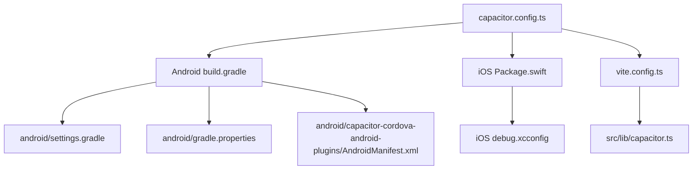
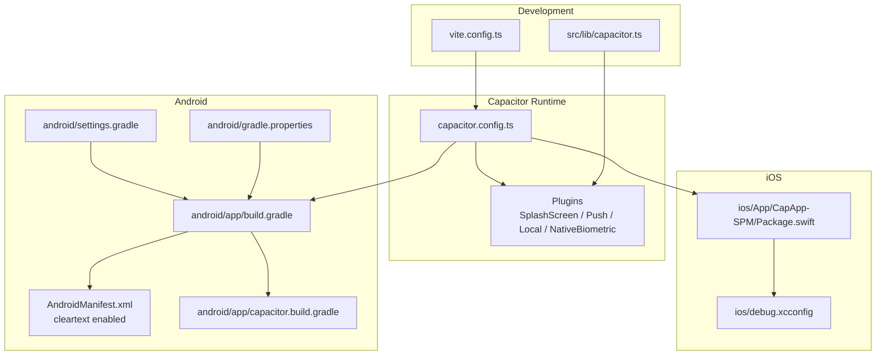
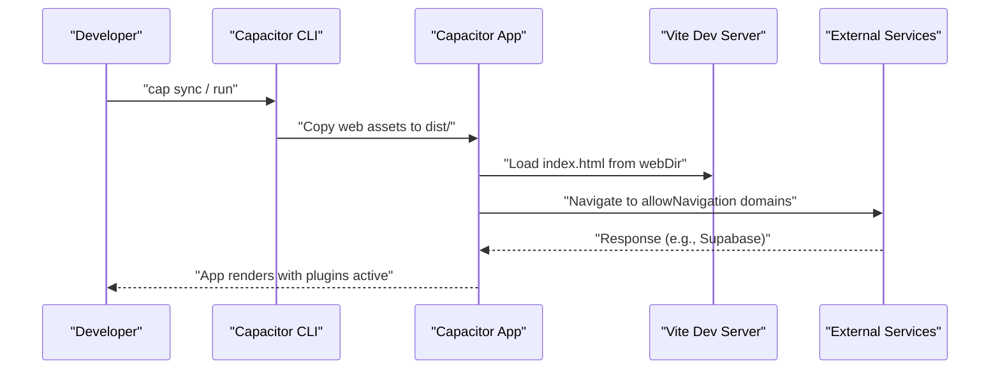
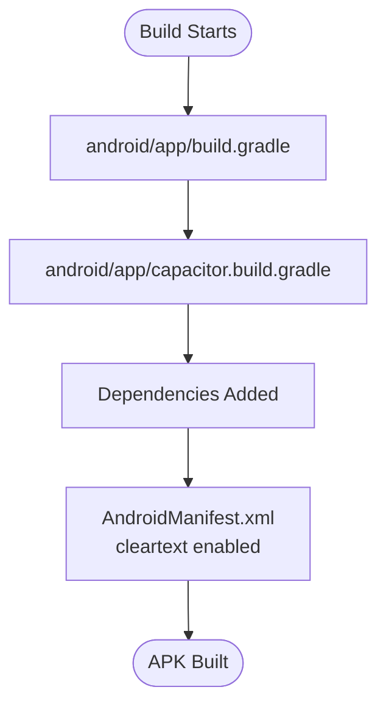
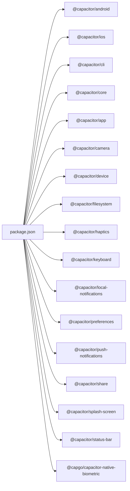

# Capacitor Configuration

<cite>
**Referenced Files in This Document**
- [capacitor.config.ts](file://capacitor.config.ts)
- [package.json](file://package.json)
- [vite.config.ts](file://vite.config.ts)
- [android/app/build.gradle](file://android/app/build.gradle)
- [android/app/capacitor.build.gradle](file://android/app/capacitor.build.gradle)
- [android/settings.gradle](file://android/settings.gradle)
- [android/gradle.properties](file://android/gradle.properties)
- [android/capacitor-cordova-android-plugins/src/main/AndroidManifest.xml](file://android/capacitor-cordova-android-plugins/src/main/AndroidManifest.xml)
- [ios/App/CapApp-SPM/Package.swift](file://ios/App/CapApp-SPM/Package.swift)
- [ios/debug.xcconfig](file://ios/debug.xcconfig)
- [src/lib/capacitor.ts](file://src/lib/capacitor.ts)
</cite>

## Table of Contents
1. [Introduction](#introduction)
2. [Project Structure](#project-structure)
3. [Core Components](#core-components)
4. [Architecture Overview](#architecture-overview)
5. [Detailed Component Analysis](#detailed-component-analysis)
6. [Dependency Analysis](#dependency-analysis)
7. [Performance Considerations](#performance-considerations)
8. [Troubleshooting Guide](#troubleshooting-guide)
9. [Conclusion](#conclusion)

## Introduction
This document provides comprehensive guidance for Capacitor configuration in the Nutrio mobile application. It covers the Capacitor configuration file, plugin setup, Android and iOS build configurations, and development/production environment setup including Vite proxy behavior and external service access rules. The goal is to enable developers to understand, modify, and troubleshoot Capacitor-related settings effectively.

## Project Structure
The Capacitor configuration spans several key areas:
- Capacitor configuration file defines app identity, web build output, server behavior, and plugin settings.
- Android Gradle build files manage SDK versions, signing, dependencies, and plugin wiring.
- iOS Swift Package Manager manifest lists Capacitor plugins used on iOS.
- Vite configuration controls development server behavior and asset paths for Capacitor builds.
- Utility module wraps Capacitor plugin usage with platform checks and safe fallbacks.

**Diagram sources**
- [capacitor.config.ts:1-45](file://capacitor.config.ts#L1-L45)
- [android/app/build.gradle:1-75](file://android/app/build.gradle#L1-L75)
- [android/settings.gradle:1-5](file://android/settings.gradle#L1-L5)
- [android/gradle.properties:1-23](file://android/gradle.properties#L1-L23)
- [android/capacitor-cordova-android-plugins/src/main/AndroidManifest.xml:1-8](file://android/capacitor-cordova-android-plugins/src/main/AndroidManifest.xml#L1-L8)
- [ios/App/CapApp-SPM/Package.swift:43-51](file://ios/App/CapApp-SPM/Package.swift#L43-L51)
- [ios/debug.xcconfig:1-1](file://ios/debug.xcconfig#L1-L1)
- [vite.config.ts:1-77](file://vite.config.ts#L1-L77)
- [src/lib/capacitor.ts:1-640](file://src/lib/capacitor.ts#L1-L640)

**Section sources**
- [capacitor.config.ts:1-45](file://capacitor.config.ts#L1-L45)
- [android/app/build.gradle:1-75](file://android/app/build.gradle#L1-L75)
- [android/settings.gradle:1-5](file://android/settings.gradle#L1-L5)
- [android/gradle.properties:1-23](file://android/gradle.properties#L1-L23)
- [android/capacitor-cordova-android-plugins/src/main/AndroidManifest.xml:1-8](file://android/capacitor-cordova-android-plugins/src/main/AndroidManifest.xml#L1-L8)
- [ios/App/CapApp-SPM/Package.swift:43-51](file://ios/App/CapApp-SPM/Package.swift#L43-L51)
- [ios/debug.xcconfig:1-1](file://ios/debug.xcconfig#L1-L1)
- [vite.config.ts:1-77](file://vite.config.ts#L1-L77)
- [src/lib/capacitor.ts:1-640](file://src/lib/capacitor.ts#L1-L640)

## Core Components
This section documents the primary configuration elements and their roles.

- Capacitor configuration (capacitor.config.ts)
  - App identity: appId, appName
  - Web build output: webDir
  - Server behavior: androidScheme, cleartext, allowNavigation rules
  - Plugin configuration: SplashScreen, PushNotifications, LocalNotifications, NativeBiometric

- Android build configuration (Gradle)
  - Application identity and SDK versions via rootProject.ext properties
  - Signing configuration with optional keystore.properties
  - Build types: debug and release with minification and ProGuard rules
  - Dependencies: Capacitor modules and Cordova plugins wired via capacitor.build.gradle
  - Cleartext traffic enabled via AndroidManifest.xml in capacitor-cordova-android-plugins

- iOS configuration (Swift Package Manager)
  - Capacitor plugins declared in Package.swift for iOS build

- Vite configuration (development server)
  - Host binding, port, HMR tuning, and asset base path behavior for Capacitor vs web

- Utility wrapper (src/lib/capacitor.ts)
  - Platform detection and safe invocation of native features
  - Initialization routine for native app behavior

**Section sources**
- [capacitor.config.ts:3-42](file://capacitor.config.ts#L3-L42)
- [android/app/build.gradle:3-44](file://android/app/build.gradle#L3-L44)
- [android/app/build.gradle:53-65](file://android/app/build.gradle#L53-L65)
- [android/app/capacitor.build.gradle:10-26](file://android/app/capacitor.build.gradle#L10-L26)
- [android/capacitor-cordova-android-plugins/src/main/AndroidManifest.xml:4-4](file://android/capacitor-cordova-android-plugins/src/main/AndroidManifest.xml#L4-L4)
- [ios/App/CapApp-SPM/Package.swift:43-51](file://ios/App/CapApp-SPM/Package.swift#L43-L51)
- [vite.config.ts:8-27](file://vite.config.ts#L8-L27)
- [src/lib/capacitor.ts:27-43](file://src/lib/capacitor.ts#L27-L43)

## Architecture Overview
The Capacitor runtime integrates the web app bundle into native hosts. The configuration establishes how the app loads assets, handles navigation, and initializes plugins. The Android/iOS build systems wire Capacitor plugins and manage signing and packaging.

**Diagram sources**
- [capacitor.config.ts:1-45](file://capacitor.config.ts#L1-L45)
- [android/app/build.gradle:1-75](file://android/app/build.gradle#L1-L75)
- [android/settings.gradle:1-5](file://android/settings.gradle#L1-L5)
- [android/gradle.properties:1-23](file://android/gradle.properties#L1-L23)
- [android/capacitor-cordova-android-plugins/src/main/AndroidManifest.xml:1-8](file://android/capacitor-cordova-android-plugins/src/main/AndroidManifest.xml#L1-L8)
- [android/app/capacitor.build.gradle:1-32](file://android/app/capacitor.build.gradle#L1-L32)
- [ios/App/CapApp-SPM/Package.swift:43-51](file://ios/App/CapApp-SPM/Package.swift#L43-L51)
- [ios/debug.xcconfig:1-1](file://ios/debug.xcconfig#L1-L1)
- [vite.config.ts:1-77](file://vite.config.ts#L1-L77)
- [src/lib/capacitor.ts:1-640](file://src/lib/capacitor.ts#L1-L640)

## Detailed Component Analysis

### Capacitor Config (capacitor.config.ts)
- App identity
  - appId: com.nutriofuel.app
  - appName: Nutrio
  - webDir: dist
- Server configuration
  - androidScheme: https
  - cleartext: true
  - allowNavigation: supabase.co and *.supabase.co
- Plugins
  - SplashScreen: launch timing, background, scale type, spinner, fullscreen/imersive modes
  - PushNotifications: badge, sound, alert presentation options
  - LocalNotifications: default sound
  - NativeBiometric: localized prompts for authentication

These settings govern how the app behaves in development and production, including network access and plugin behavior.

**Section sources**
- [capacitor.config.ts:3-42](file://capacitor.config.ts#L3-L42)

### Android Build Configuration
- Application identity and SDK versions
  - namespace and applicationId match Capacitor appId
  - minSdkVersion, targetSdkVersion, versionCode, versionName sourced from rootProject.ext
- Build types
  - debug: suffix "-debug"
  - release: minifyEnabled true, ProGuard rules, signingConfig release if keystore.properties exists
- Dependencies
  - Capacitor modules wired via capacitor.build.gradle
  - Cordova plugins via :capacitor-cordova-android-plugins
  - Core splash screen library
- Cleartext traffic
  - Enabled via AndroidManifest.xml in capacitor-cordova-android-plugins

Signing is optional and controlled by keystore.properties when present.

**Section sources**
- [android/app/build.gradle:3-44](file://android/app/build.gradle#L3-L44)
- [android/app/build.gradle:53-65](file://android/app/build.gradle#L53-L65)
- [android/app/capacitor.build.gradle:10-26](file://android/app/capacitor.build.gradle#L10-L26)
- [android/capacitor-cordova-android-plugins/src/main/AndroidManifest.xml:4-4](file://android/capacitor-cordova-android-plugins/src/main/AndroidManifest.xml#L4-L4)

### iOS Configuration
- Plugins
  - Capacitor modules declared in Package.swift for iOS build
- Debug configuration
  - CAPACITOR_DEBUG flag set in debug.xcconfig

This ensures iOS builds include the necessary Capacitor plugins and debug flags.

**Section sources**
- [ios/App/CapApp-SPM/Package.swift:43-51](file://ios/App/CapApp-SPM/Package.swift#L43-L51)
- [ios/debug.xcconfig:1-1](file://ios/debug.xcconfig#L1-L1)

### Vite Development Server and Asset Paths
- base path
  - Uses absolute "/" for Vercel deployments
  - Uses relative "./" for Capacitor production builds
  - Uses "/" for Capacitor development builds
- Development server
  - host "::", port 5173, strictPort true
  - HMR tuned with overlay disabled and extended timeout
  - Watch configuration optimized for local development
- Mobile optimizations
  - build.target esnext
  - sourcemaps enabled for error tracking
  - Terser compression with console removal in production
  - Rollup chunk splitting for caching

These settings ensure reliable development experience and proper asset resolution for Capacitor builds.

**Section sources**
- [vite.config.ts:8-27](file://vite.config.ts#L8-L27)
- [vite.config.ts:52-76](file://vite.config.ts#L52-L76)

### Capacitor Plugin Usage Wrapper
The utility module provides:
- Platform detection helpers (isNative, isIOS, isAndroid, isWeb)
- Safe wrappers around native APIs with isNative guards
- Initialization routine to configure status bar, splash screen, and notification permissions
- Haptics, status bar, splash screen, keyboard, app state, push notifications, local notifications, and biometric authentication APIs

This abstraction enables consistent behavior across web and native platforms.

**Section sources**
- [src/lib/capacitor.ts:27-43](file://src/lib/capacitor.ts#L27-L43)
- [src/lib/capacitor.ts:590-608](file://src/lib/capacitor.ts#L590-L608)

## Architecture Overview

### Capacitor Server and Navigation Flow
This sequence illustrates how Capacitor loads the app and handles navigation to external services.

**Diagram sources**
- [capacitor.config.ts:6-17](file://capacitor.config.ts#L6-L17)
- [vite.config.ts:12-27](file://vite.config.ts#L12-L27)

### Android Plugin Wiring Flow
This flow shows how Capacitor plugins are included and initialized on Android.

**Diagram sources**
- [android/app/build.gradle:53-65](file://android/app/build.gradle#L53-L65)
- [android/app/capacitor.build.gradle:10-26](file://android/app/capacitor.build.gradle#L10-L26)
- [android/capacitor-cordova-android-plugins/src/main/AndroidManifest.xml:4-4](file://android/capacitor-cordova-android-plugins/src/main/AndroidManifest.xml#L4-L4)

## Dependency Analysis
- Capacitor modules
  - Core, App, Camera, Device, Filesystem, Haptics, Keyboard, Local Notifications, Preferences, Push Notifications, Share, Splash Screen, Status Bar
- iOS plugins
  - Capacitor modules declared in Package.swift
- Android dependencies
  - Capacitor modules wired via capacitor.build.gradle
  - Cordova plugins via :capacitor-cordova-android-plugins
  - Core splash screen library
- Scripts
  - npm scripts for Capacitor development and device runs

**Diagram sources**
- [package.json:44-127](file://package.json#L44-L127)

**Section sources**
- [package.json:44-127](file://package.json#L44-L127)
- [ios/App/CapApp-SPM/Package.swift:43-51](file://ios/App/CapApp-SPM/Package.swift#L43-L51)
- [android/app/capacitor.build.gradle:10-26](file://android/app/capacitor.build.gradle#L10-L26)

## Performance Considerations
- Android
  - Release builds enable minification and ProGuard rules to reduce APK size and improve runtime performance.
  - Signing configuration supports automated release signing when keystore.properties is present.
- iOS
  - Plugin declarations in Package.swift ensure only necessary Capacitor modules are linked.
- Web/Mobile
  - Vite targets modern browsers (esnext) and enables sourcemaps for error tracking while removing console logs in production.
  - Chunk splitting improves caching and reduces initial load time.

[No sources needed since this section provides general guidance]

## Troubleshooting Guide
- Network access issues
  - Verify allowNavigation entries include all external domains used by the app (e.g., Supabase).
  - Confirm cleartext is enabled if accessing HTTP endpoints during development.
- Android signing
  - If release signing fails, ensure keystore.properties exists and contains the expected keys.
- iOS debug builds
  - Confirm CAPACITOR_DEBUG is set appropriately for debug.xcconfig.
- Plugin initialization
  - Use the utility wrapper to guard native calls and initialize native app settings after startup.
- Development server connectivity
  - Ensure Vite server host/port matches expectations and HMR timeout is sufficient for slow machines.

**Section sources**
- [capacitor.config.ts:10-17](file://capacitor.config.ts#L10-L17)
- [android/app/build.gradle:19-44](file://android/app/build.gradle#L19-L44)
- [ios/debug.xcconfig:1-1](file://ios/debug.xcconfig#L1-L1)
- [src/lib/capacitor.ts:590-608](file://src/lib/capacitor.ts#L590-L608)
- [vite.config.ts:12-27](file://vite.config.ts#L12-L27)

## Conclusion
The Capacitor configuration in Nutrio integrates a clear app identity, robust plugin setup, and platform-specific build configurations. By aligning Capacitor settings with Android/iOS build files and Vite’s development behavior, teams can maintain consistent development and production experiences. The provided wrapper simplifies native feature usage across platforms, and the troubleshooting tips help diagnose common issues quickly.