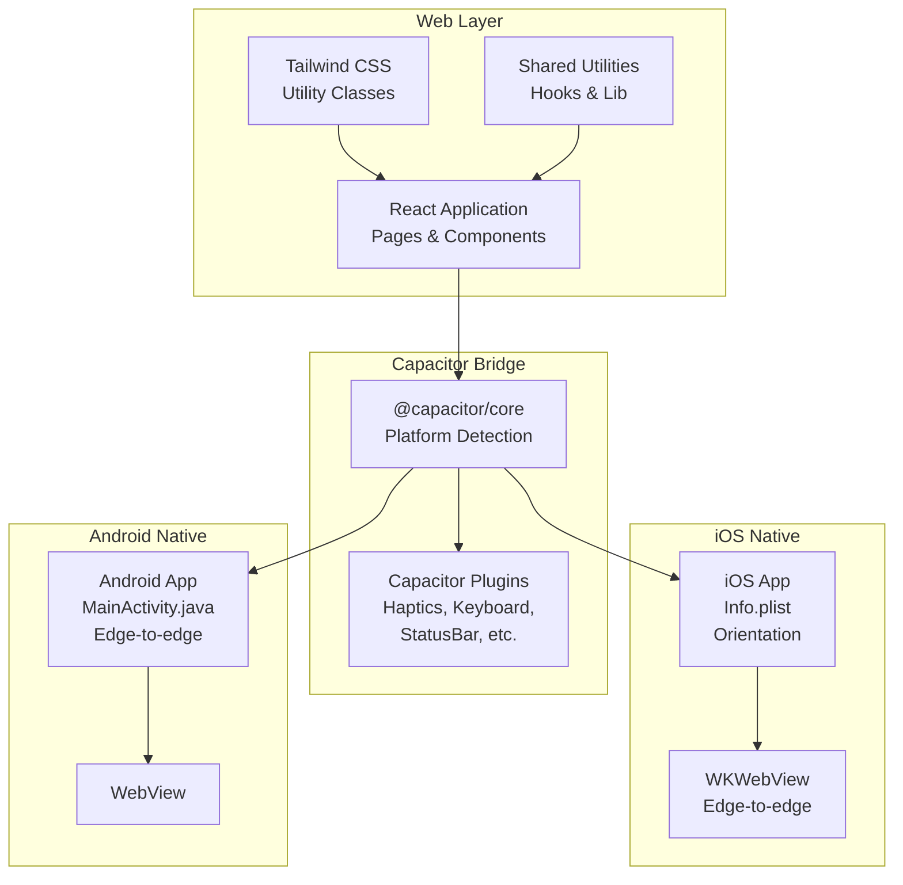
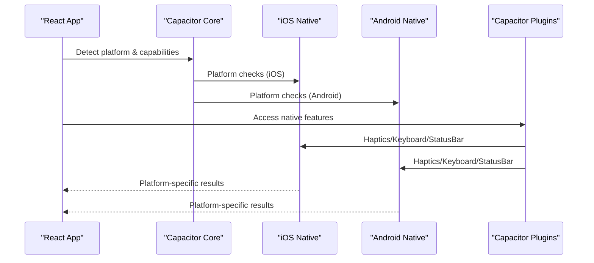
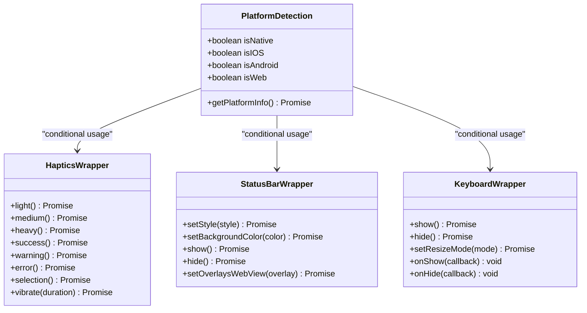
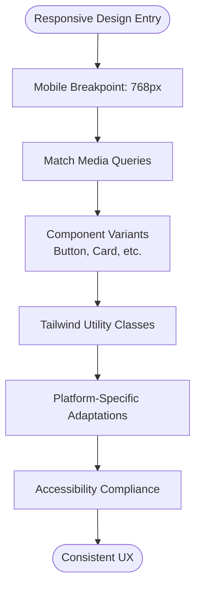
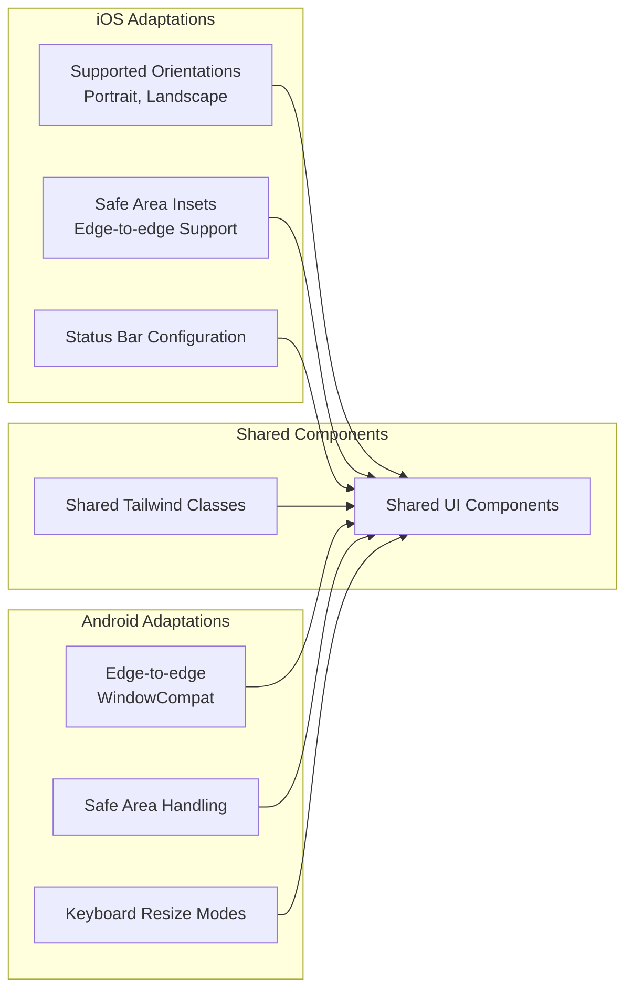
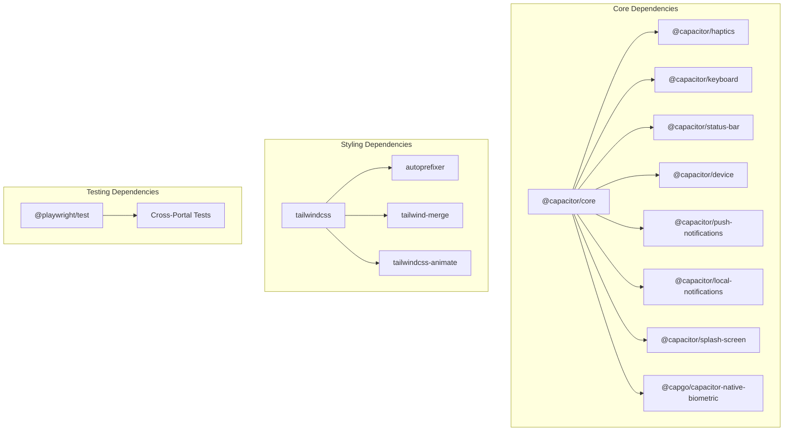
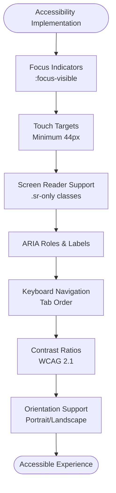
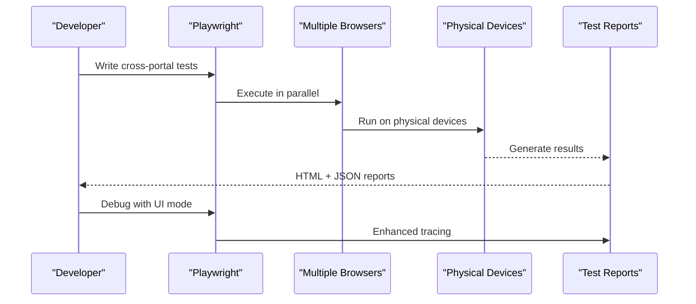

# Cross-Platform Consistency

<cite>
**Referenced Files in This Document**
- [capacitor.config.ts](file://capacitor.config.ts)
- [capacitor.ts](file://src/lib/capacitor.ts)
- [use-mobile.tsx](file://src/hooks/use-mobile.tsx)
- [tailwind.config.ts](file://tailwind.config.ts)
- [postcss.config.js](file://postcss.config.js)
- [accessibility.css](file://src/styles/accessibility.css)
- [Button.tsx](file://src/components/ui/Button.tsx)
- [Card.tsx](file://src/components/ui/Card.tsx)
- [MainActivity.java](file://android/app/src/main/java/com/nutriofuel/app/MainActivity.java)
- [Info.plist](file://ios/App/App/Info.plist)
- [playwright.config.ts](file://playwright.config.ts)
- [UI-MODE-GUIDE.md](file://e2e/cross-portal/UI-MODE-GUIDE.md)
- [UI-MODE-LOCAL-GUIDE.md](file://e2e/cross-portal/UI-MODE-LOCAL-GUIDE.md)
- [STRUCTURE.md](file://.planning/codebase/STRUCTURE.md)
- [NATIVE_MOBILE_ANALYSIS_REPORT.md](file://NATIVE_MOBILE_ANALYSIS_REPORT.md)
</cite>

## Table of Contents
1. [Introduction](#introduction)
2. [Project Structure](#project-structure)
3. [Core Components](#core-components)
4. [Architecture Overview](#architecture-overview)
5. [Detailed Component Analysis](#detailed-component-analysis)
6. [Dependency Analysis](#dependency-analysis)
7. [Performance Considerations](#performance-considerations)
8. [Accessibility Compliance](#accessibility-compliance)
9. [Testing Approach](#testing-approach)
10. [Troubleshooting Guide](#troubleshooting-guide)
11. [Conclusion](#conclusion)

## Introduction
This document provides a comprehensive guide to maintaining cross-platform consistency across iOS and Android in the Nutrio mobile application. It details the shared component architecture, responsive design patterns, platform-specific adaptations, styling strategy using Tailwind CSS, accessibility compliance, testing approaches, and performance optimization techniques. The goal is to ensure a consistent user experience across different screen sizes, orientations, and platform capabilities while leveraging Capacitor for native feature access.

## Project Structure
The Nutrio application follows a hybrid architecture using Capacitor to bridge web technologies (React + Tailwind CSS) to native platform capabilities. The structure supports shared UI components with platform-specific adaptations for iOS and Android.

**Diagram sources**
- [capacitor.ts:27-43](file://src/lib/capacitor.ts#L27-L43)
- [MainActivity.java:7-13](file://android/app/src/main/java/com/nutriofuel/app/MainActivity.java#L7-L13)
- [Info.plist:35-41](file://ios/App/App/Info.plist#L35-L41)
- [tailwind.config.ts:1-128](file://tailwind.config.ts#L1-L128)

**Section sources**
- [STRUCTURE.md:1-336](file://.planning/codebase/STRUCTURE.md#L1-L336)
- [capacitor.config.ts:1-45](file://capacitor.config.ts#L1-L45)

## Core Components
The cross-platform foundation is built around several core components:

- Platform detection and native feature wrappers
- Responsive design system using Tailwind CSS
- Shared UI primitives with platform-specific adaptations
- Accessibility-first styling and interaction patterns
- Device testing and quality assurance workflows

**Section sources**
- [capacitor.ts:27-43](file://src/lib/capacitor.ts#L27-L43)
- [use-mobile.tsx:1-20](file://src/hooks/use-mobile.tsx#L1-L20)
- [tailwind.config.ts:1-128](file://tailwind.config.ts#L1-L128)
- [accessibility.css:1-252](file://src/styles/accessibility.css#L1-L252)

## Architecture Overview
The application architecture leverages Capacitor to provide native capabilities while maintaining a unified React codebase. Platform-specific configurations ensure proper behavior on iOS and Android devices.

**Diagram sources**
- [capacitor.ts:27-43](file://src/lib/capacitor.ts#L27-L43)
- [capacitor.config.ts:19-41](file://capacitor.config.ts#L19-L41)

**Section sources**
- [capacitor.ts:587-608](file://src/lib/capacitor.ts#L587-L608)
- [capacitor.config.ts:3-42](file://capacitor.config.ts#L3-L42)

## Detailed Component Analysis

### Platform Detection and Native Feature Wrappers
The native feature wrapper centralizes platform-specific functionality with graceful fallbacks for web environments.

**Diagram sources**
- [capacitor.ts:27-43](file://src/lib/capacitor.ts#L27-L43)
- [capacitor.ts:49-122](file://src/lib/capacitor.ts#L49-L122)
- [capacitor.ts:128-173](file://src/lib/capacitor.ts#L128-L173)
- [capacitor.ts:216-262](file://src/lib/capacitor.ts#L216-L262)

**Section sources**
- [capacitor.ts:1-640](file://src/lib/capacitor.ts#L1-L640)

### Responsive Design System
The responsive design system uses Tailwind CSS with custom configuration for consistent spacing, typography, and component variants.

**Diagram sources**
- [use-mobile.tsx:3-19](file://src/hooks/use-mobile.tsx#L3-L19)
- [tailwind.config.ts:7-18](file://tailwind.config.ts#L7-L18)
- [Button.tsx:7-46](file://src/components/ui/Button.tsx#L7-L46)
- [Card.tsx:6-21](file://src/components/ui/Card.tsx#L6-L21)

**Section sources**
- [use-mobile.tsx:1-20](file://src/hooks/use-mobile.tsx#L1-L20)
- [tailwind.config.ts:1-128](file://tailwind.config.ts#L1-L128)
- [Button.tsx:1-63](file://src/components/ui/Button.tsx#L1-L63)
- [Card.tsx:1-95](file://src/components/ui/Card.tsx#L1-L95)

### Platform-Specific Adaptations
Platform-specific adaptations ensure optimal user experience on iOS and Android devices.

**Diagram sources**
- [Info.plist:35-41](file://ios/App/App/Info.plist#L35-L41)
- [MainActivity.java:11-12](file://android/app/src/main/java/com/nutriofuel/app/MainActivity.java#L11-L12)
- [capacitor.ts:238-243](file://src/lib/capacitor.ts#L238-L243)

**Section sources**
- [Info.plist:1-42](file://ios/App/App/Info.plist#L1-L42)
- [MainActivity.java:1-14](file://android/app/src/main/java/com/nutriofuel/app/MainActivity.java#L1-L14)
- [capacitor.ts:216-262](file://src/lib/capacitor.ts#L216-L262)

## Dependency Analysis
The cross-platform architecture relies on several key dependencies and their interactions.

**Diagram sources**
- [capacitor.ts:8-21](file://src/lib/capacitor.ts#L8-L21)
- [tailwind.config.ts:1-128](file://tailwind.config.ts#L1-L128)
- [postcss.config.js:1-6](file://postcss.config.js#L1-L6)
- [playwright.config.ts:1-92](file://playwright.config.ts#L1-L92)

**Section sources**
- [capacitor.ts:1-640](file://src/lib/capacitor.ts#L1-L640)
- [tailwind.config.ts:1-128](file://tailwind.config.ts#L1-L128)
- [postcss.config.js:1-6](file://postcss.config.js#L1-L6)
- [playwright.config.ts:1-92](file://playwright.config.ts#L1-L92)

## Performance Considerations
Performance optimization is crucial for maintaining smooth user experiences across platforms. The following strategies should be implemented:

- Code splitting for faster initial loads
- Image optimization and lazy loading
- Efficient state management with React.memo
- Optimized animations using hardware acceleration
- Minimized bundle size through tree shaking
- Proper caching strategies for offline functionality

**Section sources**
- [NATIVE_MOBILE_ANALYSIS_REPORT.md:865-887](file://NATIVE_MOBILE_ANALYSIS_REPORT.md#L865-L887)

## Accessibility Compliance
The application implements comprehensive accessibility features to ensure compliance with WCAG 2.1 AA standards and platform-specific assistive technologies.

**Diagram sources**
- [accessibility.css:6-16](file://src/styles/accessibility.css#L6-L16)
- [accessibility.css:18-38](file://src/styles/accessibility.css#L18-L38)
- [accessibility.css:57-59](file://src/styles/accessibility.css#L57-L59)
- [accessibility.css:176-189](file://src/styles/accessibility.css#L176-L189)

**Section sources**
- [accessibility.css:1-252](file://src/styles/accessibility.css#L1-L252)
- [NATIVE_MOBILE_ANALYSIS_REPORT.md:847-852](file://NATIVE_MOBILE_ANALYSIS_REPORT.md#L847-L852)

## Testing Approach
The testing strategy encompasses both automated and manual testing approaches to ensure cross-platform consistency.

**Diagram sources**
- [playwright.config.ts:13-92](file://playwright.config.ts#L13-L92)
- [UI-MODE-GUIDE.md:1-331](file://e2e/cross-portal/UI-MODE-GUIDE.md#L1-L331)
- [UI-MODE-LOCAL-GUIDE.md:359-443](file://e2e/cross-portal/UI-MODE-LOCAL-GUIDE.md#L359-L443)

**Section sources**
- [playwright.config.ts:1-92](file://playwright.config.ts#L1-L92)
- [UI-MODE-GUIDE.md:1-331](file://e2e/cross-portal/UI-MODE-GUIDE.md#L1-L331)
- [UI-MODE-LOCAL-GUIDE.md:359-443](file://e2e/cross-portal/UI-MODE-LOCAL-GUIDE.md#L359-L443)

## Troubleshooting Guide
Common issues and their solutions for maintaining cross-platform consistency:

### Platform Detection Issues
- Verify Capacitor platform detection is working correctly
- Check for proper fallbacks when running in web browsers
- Ensure platform-specific code paths are properly guarded

### Native Feature Compatibility
- Validate plugin configurations in capacitor.config.ts
- Test haptic feedback on both iOS and Android devices
- Verify keyboard behavior across different input methods

### Styling and Responsiveness
- Test responsive breakpoints on various screen sizes
- Validate Tailwind CSS custom configurations
- Check safe area handling on notch-enabled devices

### Accessibility Testing
- Use screen readers to validate content navigation
- Test keyboard-only navigation workflows
- Verify color contrast ratios across themes

**Section sources**
- [capacitor.ts:27-43](file://src/lib/capacitor.ts#L27-L43)
- [capacitor.config.ts:19-41](file://capacitor.config.ts#L19-L41)
- [use-mobile.tsx:1-20](file://src/hooks/use-mobile.tsx#L1-L20)
- [accessibility.css:1-252](file://src/styles/accessibility.css#L1-L252)

## Conclusion
Maintaining cross-platform consistency in the Nutrio mobile application requires a strategic approach combining shared component architecture, responsive design patterns, and platform-specific adaptations. The Capacitor-based architecture provides a solid foundation for accessing native features while maintaining a unified React codebase. By implementing the recommended styling strategies, accessibility compliance measures, and comprehensive testing approaches, the application can deliver a consistent and high-quality user experience across iOS and Android devices.

The key to long-term success lies in continuous monitoring of platform capabilities, regular accessibility audits, and iterative improvements based on user feedback and testing results. The documented patterns and guidelines provide a framework for maintaining consistency while allowing for platform-specific optimizations when appropriate.