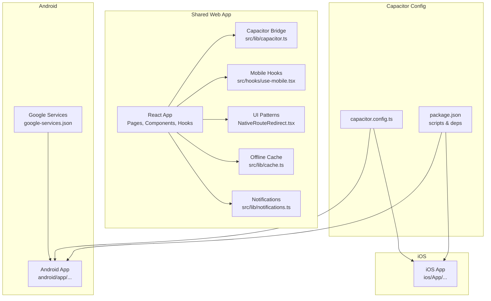
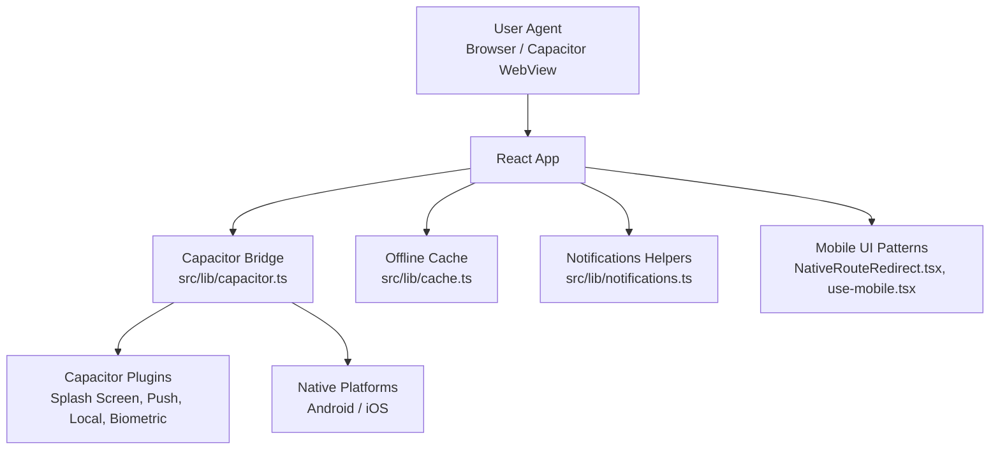
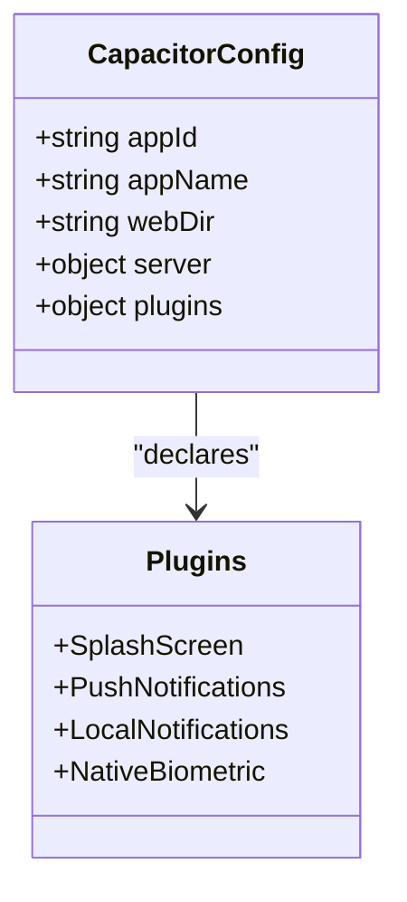
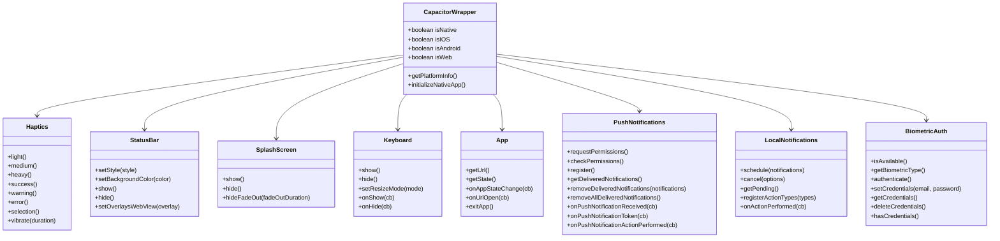
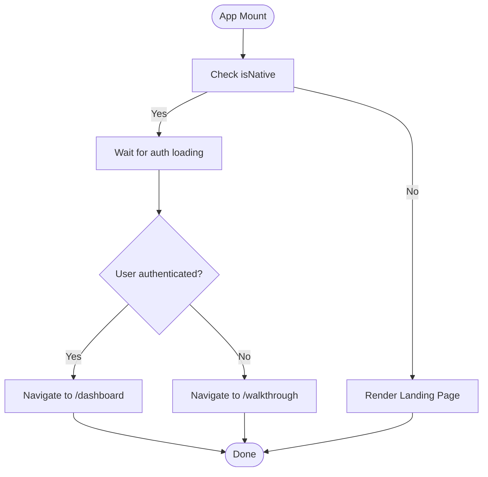
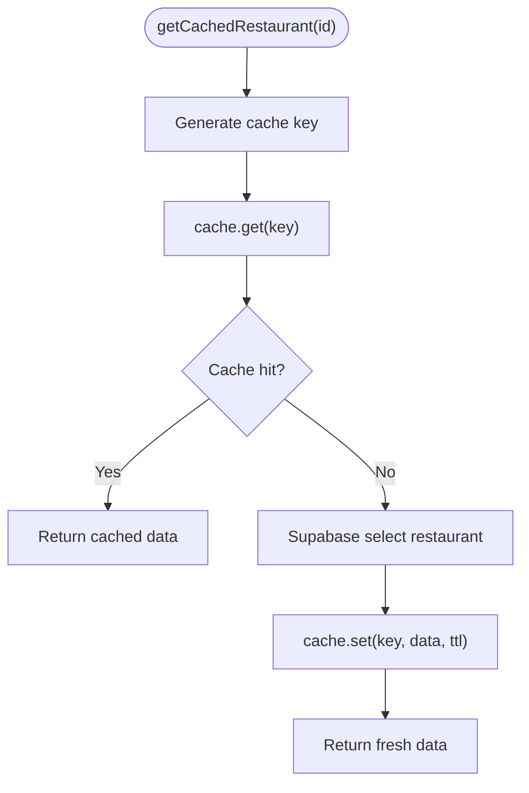
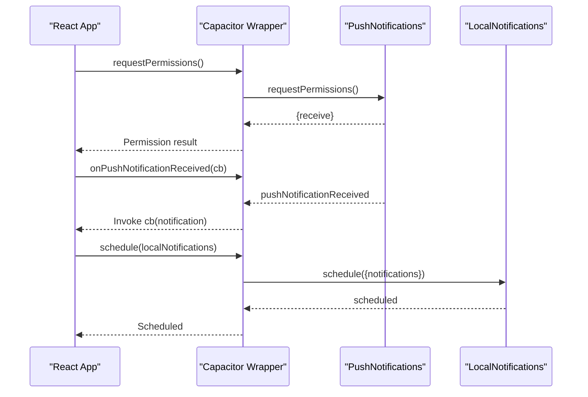
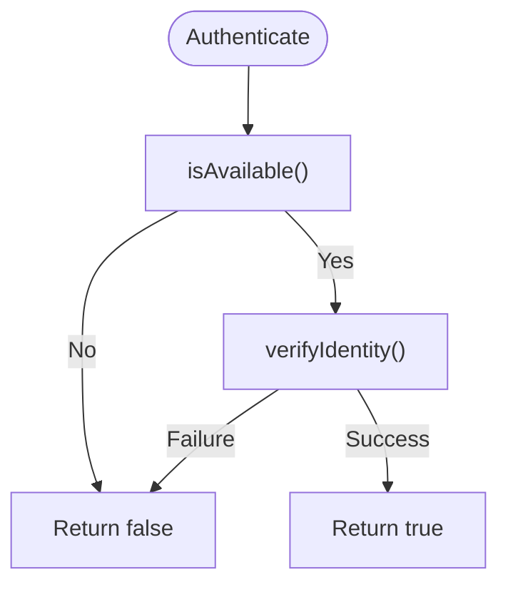
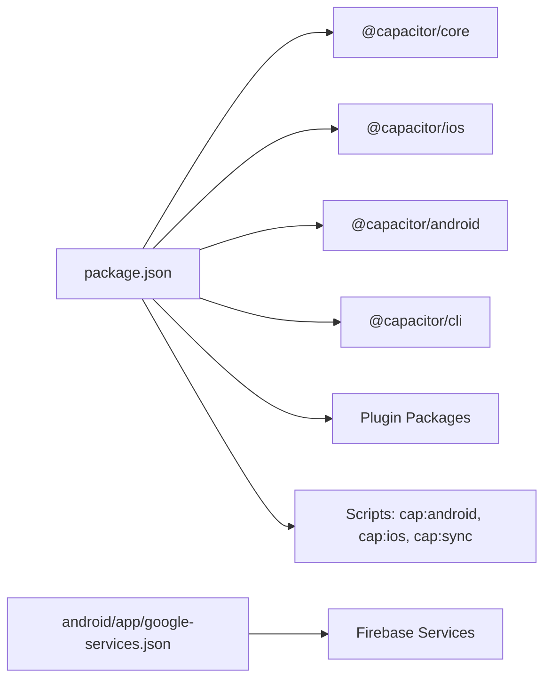

# Mobile Application

<cite>
**Referenced Files in This Document**
- [capacitor.config.ts](file://capacitor.config.ts)
- [package.json](file://package.json)
- [src/lib/capacitor.ts](file://src/lib/capacitor.ts)
- [src/hooks/use-mobile.tsx](file://src/hooks/use-mobile.tsx)
- [src/components/NativeRouteRedirect.tsx](file://src/components/NativeRouteRedirect.tsx)
- [src/lib/notifications.ts](file://src/lib/notifications.ts)
- [src/lib/cache.ts](file://src/lib/cache.ts)
- [src/lib/haptics.ts](file://src/lib/haptics.ts)
- [android/app/google-services.json](file://android/app/google-services.json)
- [.github/workflows/build-android-apk.yml](file://.github/workflows/build-android-apk.yml)
- [.github/workflows/build-android-release.yml](file://.github/workflows/build-android-release.yml)
- [.github/workflows/ci-cd.yml](file://.github/workflows/ci-cd.yml)
- [README.md](file://README.md)
</cite>

## Table of Contents
1. [Introduction](#introduction)
2. [Project Structure](#project-structure)
3. [Core Components](#core-components)
4. [Architecture Overview](#architecture-overview)
5. [Detailed Component Analysis](#detailed-component-analysis)
6. [Dependency Analysis](#dependency-analysis)
7. [Performance Considerations](#performance-considerations)
8. [Troubleshooting Guide](#troubleshooting-guide)
9. [Conclusion](#conclusion)
10. [Appendices](#appendices)

## Introduction
This document describes the cross-platform mobile application for iOS and Android built with Capacitor. It explains the Capacitor configuration, plugin architecture, and native bridge implementation, and documents mobile-specific UI patterns, push notifications, offline-friendly caching, device integration, and platform-specific considerations. It also provides setup instructions for iOS and Android development, build processes, and deployment procedures.

## Project Structure
The mobile application is structured around a shared React codebase with Capacitor acting as the native bridge. Platform-specific artifacts are generated under android/ and ios/, while Capacitor configuration and scripts live at the repository root. The key areas are:
- Capacitor configuration and plugin settings
- Cross-platform React components and hooks
- Native feature wrappers and initialization
- Mobile-specific UI patterns and routing
- Offline caching and notification helpers
- CI/CD workflows for Android builds

**Diagram sources**
- [capacitor.config.ts](file://capacitor.config.ts)
- [package.json](file://package.json)
- [src/lib/capacitor.ts](file://src/lib/capacitor.ts)
- [src/hooks/use-mobile.tsx](file://src/hooks/use-mobile.tsx)
- [src/components/NativeRouteRedirect.tsx](file://src/components/NativeRouteRedirect.tsx)
- [src/lib/cache.ts](file://src/lib/cache.ts)
- [src/lib/notifications.ts](file://src/lib/notifications.ts)
- [android/app/google-services.json](file://android/app/google-services.json)

**Section sources**
- [capacitor.config.ts](file://capacitor.config.ts)
- [package.json](file://package.json)

## Core Components
- Capacitor configuration defines app identifiers, server behavior, and plugin settings for splash screen, push notifications, local notifications, and biometric authentication.
- The Capacitor wrapper centralizes native feature access with graceful fallbacks for web environments.
- Mobile hooks detect viewport-based mobile behavior.
- NativeRouteRedirect adapts routing for native APKs versus web.
- Offline caching reduces network dependency and improves perceived performance.
- Notification helpers encapsulate Supabase-backed notification creation and common event patterns.

**Section sources**
- [capacitor.config.ts](file://capacitor.config.ts)
- [src/lib/capacitor.ts](file://src/lib/capacitor.ts)
- [src/hooks/use-mobile.tsx](file://src/hooks/use-mobile.tsx)
- [src/components/NativeRouteRedirect.tsx](file://src/components/NativeRouteRedirect.tsx)
- [src/lib/cache.ts](file://src/lib/cache.ts)
- [src/lib/notifications.ts](file://src/lib/notifications.ts)

## Architecture Overview
The application uses Capacitor to wrap a React web app into native containers. The bridge exposes native APIs for haptics, status bar, splash screen, keyboard, app lifecycle, push/local notifications, and biometric authentication. The React app consumes these capabilities via a unified wrapper and adjusts UI behavior for mobile screens and native routing.

**Diagram sources**
- [src/lib/capacitor.ts](file://src/lib/capacitor.ts)
- [src/lib/cache.ts](file://src/lib/cache.ts)
- [src/lib/notifications.ts](file://src/lib/notifications.ts)
- [src/components/NativeRouteRedirect.tsx](file://src/components/NativeRouteRedirect.tsx)
- [src/hooks/use-mobile.tsx](file://src/hooks/use-mobile.tsx)

## Detailed Component Analysis

### Capacitor Configuration and Plugin Architecture
- App identity and webDir are configured for Capacitor.
- Server settings enable HTTPS scheme for Android, allow navigation to Supabase domains, and permit cleartext traffic during development.
- Plugins:
  - SplashScreen: launch timing, background, spinner, fullscreen/immersive modes.
  - PushNotifications: badge/sound/alert presentation options.
  - LocalNotifications: default sound configuration.
  - NativeBiometric: localized titles/subtitles/description for biometric prompts.

**Diagram sources**
- [capacitor.config.ts](file://capacitor.config.ts)

**Section sources**
- [capacitor.config.ts](file://capacitor.config.ts)

### Capacitor Native Feature Wrapper
The wrapper provides:
- Platform detection helpers (native/iOS/Android/web).
- Haptics: light/medium/heavy impacts, success/warning/error notifications, selection changes, and Android vibration.
- Status bar: style, background color, show/hide, overlay mode.
- Splash screen: show, hide, fade-out.
- Keyboard: show/hide, resize mode, listeners for show/hide events.
- App: get launch URL/state, app state change listener, URL open listener, exit app.
- Push notifications: permissions, registration, delivered notifications, listeners for received/actionPerformed/token.
- Local notifications: schedule, cancel, pending list, action types, action-performed listener.
- Biometric authentication: availability, type, authenticate, set/get/delete credentials, credential presence.

Initialization routine sets status bar style, hides native splash quickly, requests notification permissions, and logs success.

**Diagram sources**
- [src/lib/capacitor.ts](file://src/lib/capacitor.ts)

**Section sources**
- [src/lib/capacitor.ts](file://src/lib/capacitor.ts)

### Mobile UI Patterns and Routing
- useIsMobile detects mobile viewport and toggles UI behavior accordingly.
- NativeRouteRedirect adapts initial routing on native platforms:
  - If user is authenticated, redirect to dashboard.
  - If not authenticated, show walkthrough.
  - On web, render landing page content.

**Diagram sources**
- [src/components/NativeRouteRedirect.tsx](file://src/components/NativeRouteRedirect.tsx)
- [src/hooks/use-mobile.tsx](file://src/hooks/use-mobile.tsx)

**Section sources**
- [src/components/NativeRouteRedirect.tsx](file://src/components/NativeRouteRedirect.tsx)
- [src/hooks/use-mobile.tsx](file://src/hooks/use-mobile.tsx)

### Offline Functionality and Caching
- Cache manager supports Redis-backed caching with in-memory fallback.
- Provides cache keys for restaurants, meals, profiles, subscriptions, challenges, and leaderboards.
- Cached fetchers retrieve data from Supabase and cache with TTLs; invalidation helpers support single keys and pattern-based invalidation.
- This reduces network dependency and improves performance on mobile networks.

**Diagram sources**
- [src/lib/cache.ts](file://src/lib/cache.ts)

**Section sources**
- [src/lib/cache.ts](file://src/lib/cache.ts)

### Push Notifications and Local Notifications
- Push notifications:
  - Permission checks and registration.
  - Listeners for received, token, and action-performed events.
  - Management of delivered notifications.
- Local notifications:
  - Scheduling, cancellation, retrieving pending notifications.
  - Action type registration and action-performed callbacks.

**Diagram sources**
- [src/lib/capacitor.ts](file://src/lib/capacitor.ts)

**Section sources**
- [src/lib/capacitor.ts](file://src/lib/capacitor.ts)

### Biometric Authentication
- Detects availability and type (Face ID, Touch ID, Fingerprint).
- Provides secure verification and credential storage/retrieval/deletion.
- Integrates with native biometric dialogs.

**Diagram sources**
- [src/lib/capacitor.ts](file://src/lib/capacitor.ts)

**Section sources**
- [src/lib/capacitor.ts](file://src/lib/capacitor.ts)

### Haptic Feedback Utilities
- Provides impact styles and notification-type haptics with safe error handling for non-native environments.

**Section sources**
- [src/lib/haptics.ts](file://src/lib/haptics.ts)

### Notification Helpers
- Supabase-backed notification creation and helper functions for order updates, driver assignment, and new delivery notifications.

**Section sources**
- [src/lib/notifications.ts](file://src/lib/notifications.ts)

## Dependency Analysis
- Capacitor core and platform packages are declared in dependencies.
- Scripts automate Capacitor synchronization and opening of native projects for development.
- Android app includes Firebase configuration via google-services.json.

**Diagram sources**
- [package.json](file://package.json)
- [android/app/google-services.json](file://android/app/google-services.json)

**Section sources**
- [package.json](file://package.json)
- [android/app/google-services.json](file://android/app/google-services.json)

## Performance Considerations
- Use the Capacitor wrapper’s haptic feedback sparingly to avoid interrupting UX.
- Leverage the caching layer to minimize repeated network requests for frequently accessed data.
- Keep splash screen animations short and fade out quickly to reduce perceived load time.
- Avoid heavy computations on the UI thread; defer to background workers or service layers when possible.
- Use local notifications judiciously to prevent battery drain.
- Test keyboard resize modes to prevent layout thrashing on different devices.

## Troubleshooting Guide
- Native features not working on web:
  - The Capacitor wrapper includes guards to prevent calls when not on a native platform. Verify platform detection and ensure Capacitor is initialized.
- Push notifications:
  - Confirm permissions are requested and handled; listen for token and action-performed events.
  - Ensure server configuration allows navigation to external domains if needed.
- Biometric authentication:
  - Availability checks can fail gracefully; verify device support and OS-level biometric enrollment.
- Build and deployment:
  - Use the provided scripts to synchronize and open native projects.
  - Android CI/CD workflows exist for APK and release builds.

**Section sources**
- [src/lib/capacitor.ts](file://src/lib/capacitor.ts)
- [capacitor.config.ts](file://capacitor.config.ts)
- [.github/workflows/build-android-apk.yml](file://.github/workflows/build-android-apk.yml)
- [.github/workflows/build-android-release.yml](file://.github/workflows/build-android-release.yml)
- [.github/workflows/ci-cd.yml](file://.github/workflows/ci-cd.yml)

## Conclusion
The mobile application leverages Capacitor to deliver a unified React experience across iOS and Android with robust native integrations for push/local notifications, biometrics, haptics, and device controls. The architecture emphasizes graceful fallbacks, offline-friendly caching, and mobile-aware routing to provide a responsive and efficient user experience.

## Appendices

### Setup Instructions

- Prerequisites
  - Node.js and npm/yarn installed.
  - Android Studio with Android SDK and Gradle.
  - Xcode for iOS development.
  - Capacitor CLI installed globally.

- Initial Setup
  - Install dependencies: [package.json](file://package.json)
  - Sync Capacitor: [package.json](file://package.json)
  - Open native projects:
    - Android: [package.json](file://package.json)
    - iOS: [package.json](file://package.json)

- Development
  - Run Vite dev server: [package.json](file://package.json)
  - Build for production: [package.json](file://package.json)

- Android
  - Configure Firebase: [android/app/google-services.json](file://android/app/google-services.json)
  - Build APK: [package.json](file://package.json)
  - CI/CD workflows: 
    - [build-android-apk.yml](file://.github/workflows/build-android-apk.yml)
    - [build-android-release.yml](file://.github/workflows/build-android-release.yml)
    - [ci-cd.yml](file://.github/workflows/ci-cd.yml)

- iOS
  - Open Xcode workspace and configure signing:
    - [README.md](file://README.md)

- Deployment
  - Use Capacitor build and distribution steps appropriate for each platform.
  - CI/CD workflows orchestrate automated builds and releases.

**Section sources**
- [package.json](file://package.json)
- [android/app/google-services.json](file://android/app/google-services.json)
- [.github/workflows/build-android-apk.yml](file://.github/workflows/build-android-apk.yml)
- [.github/workflows/build-android-release.yml](file://.github/workflows/build-android-release.yml)
- [.github/workflows/ci-cd.yml](file://.github/workflows/ci-cd.yml)
- [README.md](file://README.md)