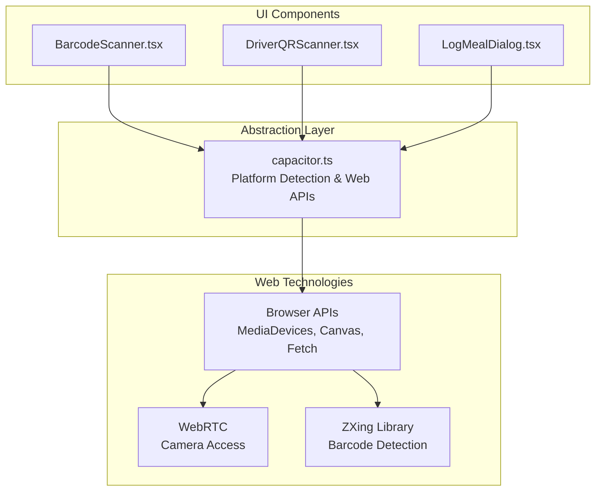
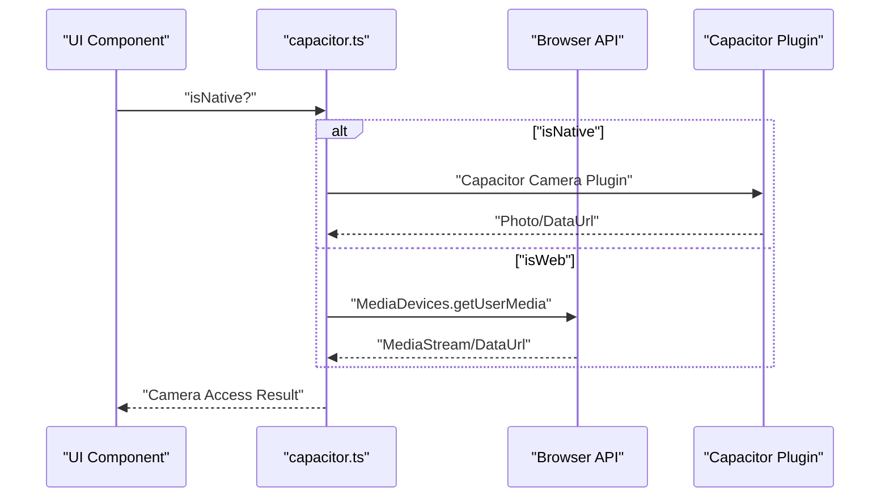
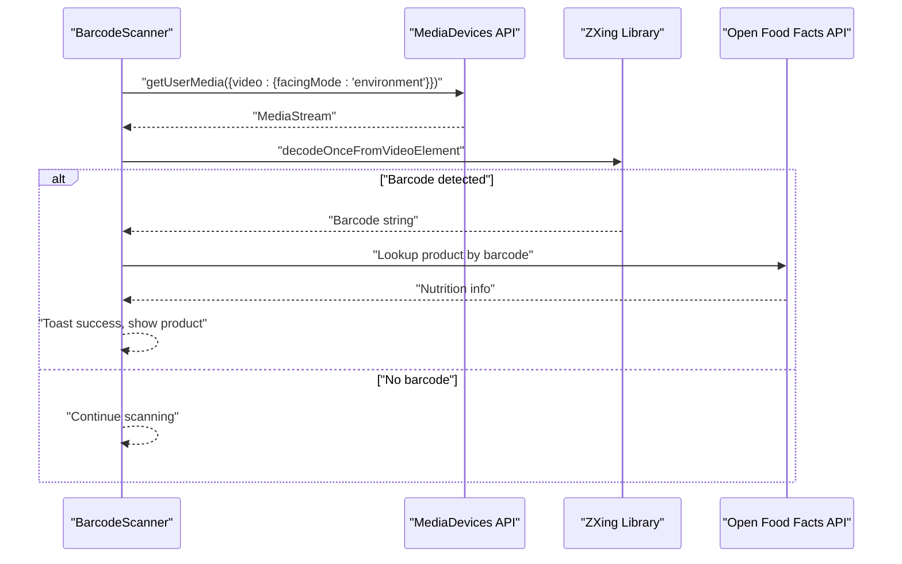
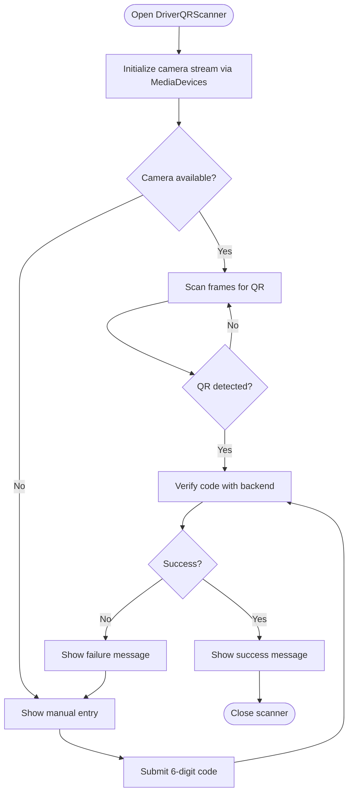
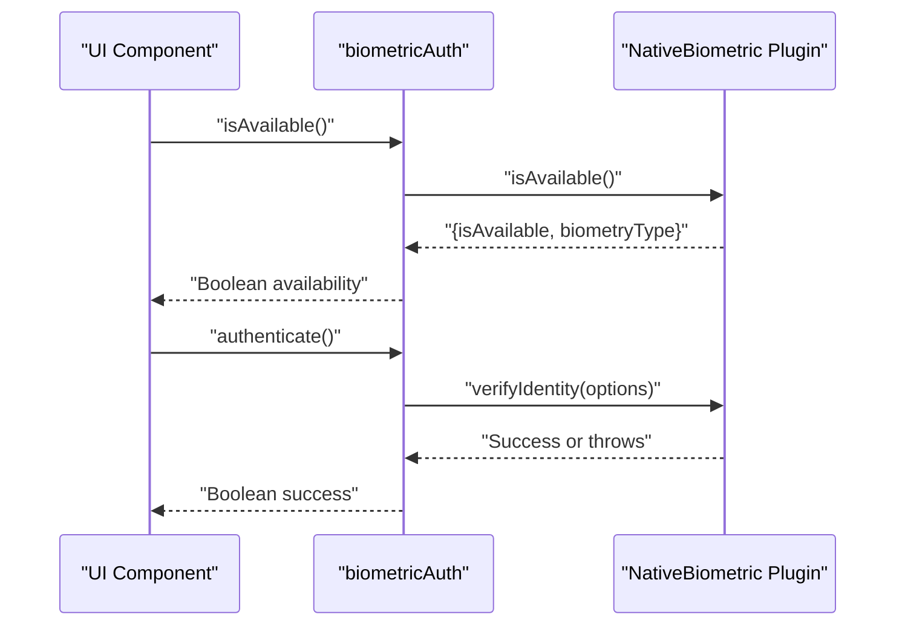
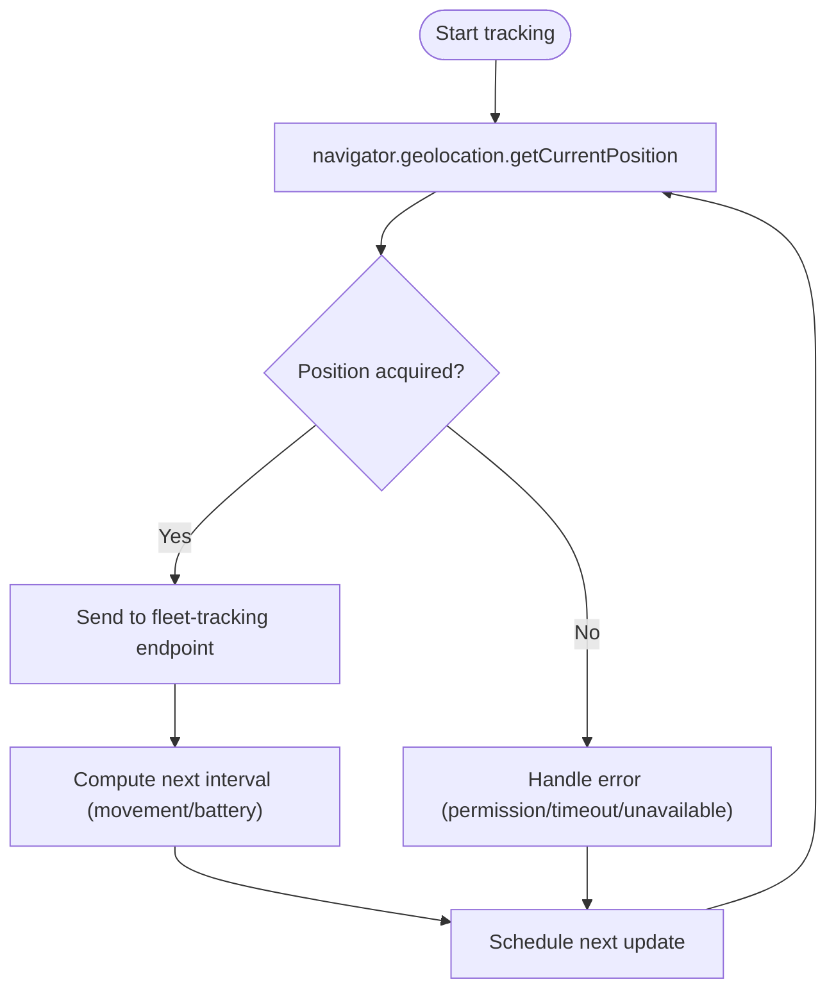
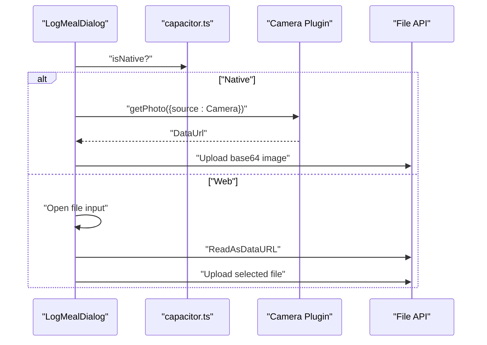
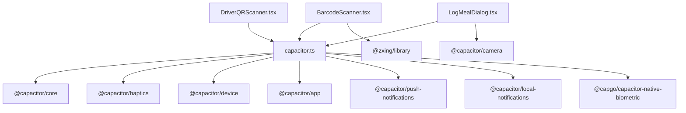

# Native Device Features

<cite>
**Referenced Files in This Document**
- [main.tsx](file://src/main.tsx)
- [capacitor.ts](file://src/lib/capacitor.ts)
- [BarcodeScanner.tsx](file://src/components/BarcodeScanner.tsx)
- [DriverQRScanner.tsx](file://src/components/driver/DriverQRScanner.tsx)
- [LogMealDialog.tsx](file://src/components/LogMealDialog.tsx)
</cite>

## Update Summary
**Changes Made**
- Updated introduction to reflect simplified Capacitor integration approach
- Revised architecture overview to show pure web technology implementation
- Updated component analysis to emphasize browser-based implementations
- Removed references to native Capacitor plugin dependencies
- Updated troubleshooting guide to focus on web-based solutions

## Table of Contents
1. [Introduction](#introduction)
2. [Project Structure](#project-structure)
3. [Core Components](#core-components)
4. [Architecture Overview](#architecture-overview)
5. [Detailed Component Analysis](#detailed-component-analysis)
6. [Dependency Analysis](#dependency-analysis)
7. [Performance Considerations](#performance-considerations)
8. [Troubleshooting Guide](#troubleshooting-guide)
9. [Conclusion](#conclusion)

## Introduction
This document explains how the Nutrio mobile application integrates native device features through a unified abstraction layer built on pure web technologies with enhanced React patterns. The application now relies on browser APIs and web-based implementations rather than Capacitor plugins, providing consistent native-like experiences across iOS, Android, and web platforms while maintaining graceful fallbacks for unsupported features.

## Project Structure
The native device feature integration centers around a simplified abstraction module that provides platform-aware APIs using browser APIs and React patterns. UI components consume these abstractions to deliver native-like experiences while gracefully degrading on different platforms.

**Diagram sources**
- [capacitor.ts](file://src/lib/capacitor.ts)
- [BarcodeScanner.tsx](file://src/components/BarcodeScanner.tsx)
- [DriverQRScanner.tsx](file://src/components/driver/DriverQRScanner.tsx)
- [LogMealDialog.tsx](file://src/components/LogMealDialog.tsx)

**Section sources**
- [capacitor.ts](file://src/lib/capacitor.ts)
- [main.tsx](file://src/main.tsx)

## Core Components
- Platform detection: Provides isNative, isIOS, isAndroid, isWeb detection using Capacitor's platform detection
- Camera access: Implements camera permission requests and photo capture via browser MediaDevices API on web, with Capacitor Camera plugin fallback on native
- Barcode and QR scanning: UI components that manage camera streams using browser APIs and ZXing library for barcode detection
- Biometric authentication: Available through Capacitor NativeBiometric plugin when running natively
- GPS tracking: Browser geolocation API with adaptive intervals and error handling
- File system access: Web-based base64 uploads using browser File API; native picker integration via Capacitor Camera plugin

Key capabilities exposed by the wrapper:
- Platform detection and device info retrieval
- Haptics, status bar, splash screen, keyboard, app lifecycle (native only)
- Biometric authentication and secure credential management (native only)
- Permission-aware camera operations using browser APIs

**Section sources**
- [capacitor.ts](file://src/lib/capacitor.ts)
- [BarcodeScanner.tsx](file://src/components/BarcodeScanner.tsx)
- [DriverQRScanner.tsx](file://src/components/driver/DriverQRScanner.tsx)
- [LogMealDialog.tsx](file://src/components/LogMealDialog.tsx)

## Architecture Overview
The abstraction layer provides a simplified interface that uses browser APIs for web implementations and maintains Capacitor plugin access for native features. Components call into the wrapper, which conditionally executes web APIs or returns safe defaults on unsupported platforms.

**Diagram sources**
- [capacitor.ts](file://src/lib/capacitor.ts)
- [BarcodeScanner.tsx](file://src/components/BarcodeScanner.tsx)

## Detailed Component Analysis

### Native Device Feature Abstraction Layer
The wrapper maintains platform detection capabilities while focusing on web-based implementations. It provides conditional access to native features when available:
- Platform detection and device info using Capacitor's platform detection
- Haptics, status bar, splash screen, keyboard, app lifecycle (native only)
- Biometric authentication with Capacitor NativeBiometric plugin (native only)
- Permission-aware camera operations using browser APIs

Implementation highlights:
- Conditional execution based on isNative detection
- Graceful fallbacks using browser APIs for web environments
- Maintains compatibility with native Capacitor plugin ecosystem

**Section sources**
- [capacitor.ts](file://src/lib/capacitor.ts)

### Camera Access for Barcode Scanning (BarcodeScanner)
The BarcodeScanner component manages camera permissions and provides a scanning UI with manual fallback. It uses browser APIs for camera access and ZXing library for barcode detection:
- Requests camera permission via browser MediaDevices API
- Streams video from the environment-facing camera using browser APIs
- Renders a scanning overlay and scanning indicator
- Supports manual barcode entry as a fallback
- Uses ZXing library for barcode detection in both camera streams and captured images

**Diagram sources**
- [BarcodeScanner.tsx](file://src/components/BarcodeScanner.tsx)

**Section sources**
- [BarcodeScanner.tsx](file://src/components/BarcodeScanner.tsx)

### Driver QR Scanner (DriverQRScanner)
The DriverQRScanner component focuses on QR code verification for drivers using browser APIs:
- Initializes camera stream with environment-facing camera using MediaDevices API
- Provides manual 6-digit code entry as a fallback
- Handles camera errors and permission denials using browser API error handling
- Displays verification results with success/error indicators

**Diagram sources**
- [DriverQRScanner.tsx](file://src/components/driver/DriverQRScanner.tsx)

**Section sources**
- [DriverQRScanner.tsx](file://src/components/driver/DriverQRScanner.tsx)

### Biometric Authentication (NativeBiometric)
The wrapper exposes biometric availability checks, authentication prompts, and secure credential storage for native environments:
- Availability detection and biometric type identification using Capacitor NativeBiometric
- Authentication prompt with localized messaging
- Credential storage, retrieval, deletion, and existence checks
- Robust error handling and fallbacks for non-native environments

**Diagram sources**
- [capacitor.ts](file://src/lib/capacitor.ts)

**Section sources**
- [capacitor.ts](file://src/lib/capacitor.ts)

### GPS Tracking and Location Services
The driver location tracking demonstrates robust geolocation handling using browser APIs:
- Periodic updates with 10-second intervals using browser geolocation API
- Adaptive intervals based on movement and battery level
- Comprehensive error handling for permission, position unavailable, and timeouts
- Backend service determines next update interval dynamically

**Diagram sources**
- [LogMealDialog.tsx](file://src/components/LogMealDialog.tsx)

**Section sources**
- [LogMealDialog.tsx](file://src/components/LogMealDialog.tsx)

### File System Access Patterns (Camera and Image Upload)
The application supports taking photos and uploading images using browser APIs:
- On native platforms: explicit camera permission request via Capacitor Camera plugin, then capture via Camera plugin
- On web: file input dialog for selecting images using browser File API
- Base64 encoding and upload to backend services using fetch API
- Picker integration for choosing between camera and photo library on native

**Diagram sources**
- [LogMealDialog.tsx](file://src/components/LogMealDialog.tsx)
- [capacitor.ts](file://src/lib/capacitor.ts)

**Section sources**
- [LogMealDialog.tsx](file://src/components/LogMealDialog.tsx)
- [capacitor.ts](file://src/lib/capacitor.ts)

### Cross-Platform Compatibility and Fallback Strategies
- Platform detection: isNative, isIOS, isAndroid, isWeb using Capacitor's platform detection
- Conditional plugin execution: native-capable features use Capacitor plugins; web features use browser APIs
- Web fallbacks: browser APIs (MediaDevices, localStorage, fetch), with clear user messaging
- Enhanced React patterns: useEffect hooks for proper timing of native initialization

```mermaid
graph LR
PD["Platform Detection"] --> |isNative| NAT["Native Path<br/>(Capacitor Plugins)"]
PD --> |!isNative| WEB["Web Path<br/>(Browser APIs)"]
NAT --> HAP["Haptics"]
NAT --> PN["Push Notifications"]
NAT --> BIOT["Biometric Auth"]
WEB --> HAPW["Web Haptics Fallback"]
WEB --> PNW["Browser Notification Fallback"]
WEB --> BIOTW["Web Auth Fallback"]
WEB --> CAM["MediaDevices API"]
WEB --> ZXING["ZXing Library"]
```

**Diagram sources**
- [capacitor.ts](file://src/lib/capacitor.ts)
- [BarcodeScanner.tsx](file://src/components/BarcodeScanner.tsx)

**Section sources**
- [capacitor.ts](file://src/lib/capacitor.ts)
- [main.tsx](file://src/main.tsx)

## Dependency Analysis
The native feature wrapper maintains minimal dependencies focused on platform detection and optional native features. UI components depend on the wrapper for platform-aware behavior and use browser APIs for core functionality.

**Diagram sources**
- [capacitor.ts](file://src/lib/capacitor.ts)
- [BarcodeScanner.tsx](file://src/components/BarcodeScanner.tsx)
- [DriverQRScanner.tsx](file://src/components/driver/DriverQRScanner.tsx)
- [LogMealDialog.tsx](file://src/components/LogMealDialog.tsx)

**Section sources**
- [capacitor.ts](file://src/lib/capacitor.ts)

## Performance Considerations
- Camera scanning: Use environment-facing camera and appropriate resolution to balance performance and accuracy
- Barcode detection: Optimize ZXing library usage and implement proper cleanup of media streams
- GPS updates: Adapt update intervals based on movement and battery level to reduce power consumption
- Network: Implement retry and backoff strategies for network-dependent operations
- Memory management: Properly clean up media streams and canvas elements to prevent memory leaks

## Troubleshooting Guide
Common issues and resolutions:
- Camera permission denied: Prompt users to enable camera access in device settings; provide manual entry fallback using browser API error handling
- No camera found: Detect lack of camera API and offer manual entry; gracefully degrade UI
- Barcode detection failures: Handle ZXing library exceptions and provide manual entry fallback
- Geolocation errors: Handle permission denied, position unavailable, and timeout with user-friendly messages and reduced accuracy requests
- Biometric authentication failures: Catch exceptions and inform users; optionally fall back to passcode or re-prompt

**Section sources**
- [BarcodeScanner.tsx](file://src/components/BarcodeScanner.tsx)
- [DriverQRScanner.tsx](file://src/components/driver/DriverQRScanner.tsx)
- [LogMealDialog.tsx](file://src/components/LogMealDialog.tsx)
- [capacitor.ts](file://src/lib/capacitor.ts)

## Conclusion
The native device feature integration in Nutrio leverages a robust abstraction layer that combines pure web technologies with enhanced React patterns to deliver consistent, native-like experiences across iOS, Android, and web platforms. By utilizing browser APIs for core functionality and maintaining Capacitor plugin access for native features, the application ensures reliable behavior, graceful fallbacks, and maintainable code. The camera, barcode scanning, biometric authentication, GPS tracking, and file system access patterns demonstrate best practices for cross-platform compatibility and user experience using modern web technologies.