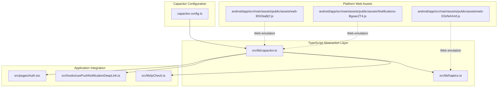
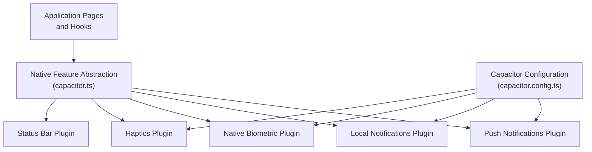
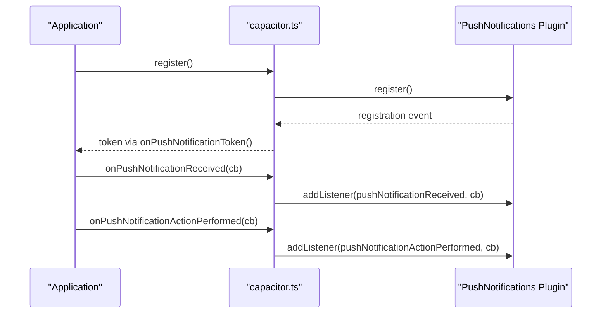
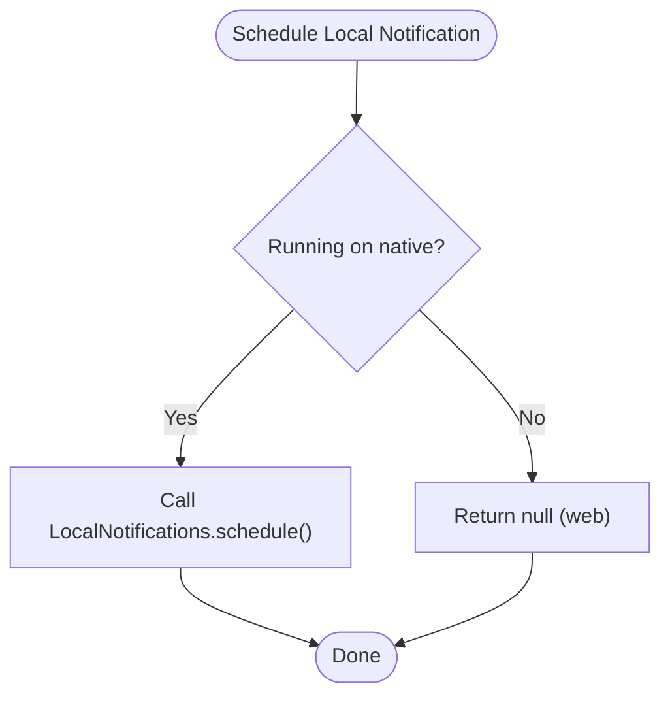
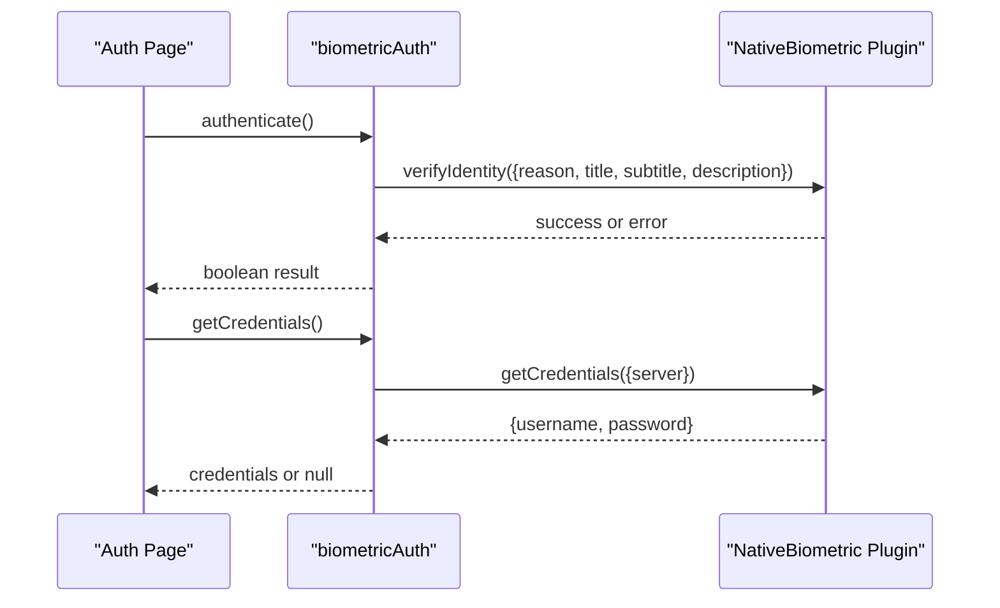
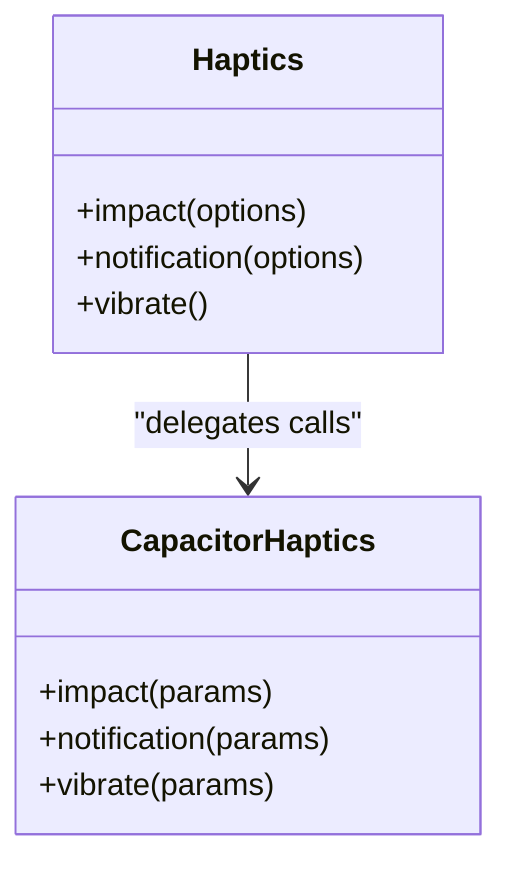
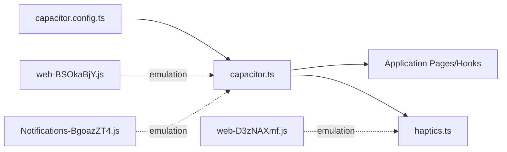

# Native Features Integration

<cite>
**Referenced Files in This Document**
- [capacitor.config.ts](file://capacitor.config.ts)
- [capacitor.ts](file://src/lib/capacitor.ts)
- [haptics.ts](file://src/lib/haptics.ts)
- [Auth.tsx](file://src/pages/Auth.tsx)
- [usePushNotificationDeepLink.ts](file://src/hooks/usePushNotificationDeepLink.ts)
- [ipCheck.ts](file://src/lib/ipCheck.ts)
- [Notifications-BgoazZT4.js](file://android/app/src/main/assets/public/assets/Notifications-BgoazZT4.js)
- [web-BSOkaBjY.js](file://android/app/src/main/assets/public/assets/web-BSOkaBjY.js)
- [web-D3zNAXmf.js](file://android/app/src/main/assets/public/assets/web-D3zNAXmf.js)
</cite>

## Table of Contents
1. [Introduction](#introduction)
2. [Project Structure](#project-structure)
3. [Core Components](#core-components)
4. [Architecture Overview](#architecture-overview)
5. [Detailed Component Analysis](#detailed-component-analysis)
6. [Dependency Analysis](#dependency-analysis)
7. [Performance Considerations](#performance-considerations)
8. [Troubleshooting Guide](#troubleshooting-guide)
9. [Conclusion](#conclusion)

## Introduction
This document provides comprehensive guidance for integrating native features in the Nutrio mobile application using the Capacitor framework. It covers the Capacitor plugin architecture, native bridge implementation, push notifications, local notifications, biometric authentication, haptic feedback, device-specific features, IP address checking, location services, network connectivity monitoring, deep linking, universal links, cross-platform navigation, offline functionality, background synchronization, and device storage management. The content is derived from the repository's Capacitor configuration, TypeScript libraries, and platform-specific assets.

## Project Structure
The native features integration relies on:
- Capacitor configuration defining plugin settings and server behavior
- A centralized TypeScript library that abstracts Capacitor plugin APIs behind platform checks
- Platform-specific web assets that emulate native plugin behavior on the web
- Application pages and hooks that utilize the native feature abstractions

**Diagram sources**
- [capacitor.config.ts](file://capacitor.config.ts)
- [capacitor.ts](file://src/lib/capacitor.ts)
- [haptics.ts](file://src/lib/haptics.ts)
- [Auth.tsx](file://src/pages/Auth.tsx)
- [usePushNotificationDeepLink.ts](file://src/hooks/usePushNotificationDeepLink.ts)
- [ipCheck.ts](file://src/lib/ipCheck.ts)
- [web-BSOkaBjY.js](file://android/app/src/main/assets/public/assets/web-BSOkaBjY.js)
- [web-D3zNAXmf.js](file://android/app/src/main/assets/public/assets/web-D3zNAXmf.js)
- [Notifications-BgoazZT4.js](file://android/app/src/main/assets/public/assets/Notifications-BgoazZT4.js)

**Section sources**
- [capacitor.config.ts](file://capacitor.config.ts)
- [capacitor.ts](file://src/lib/capacitor.ts)

## Core Components
This section outlines the primary native feature modules and their responsibilities:
- Capacitor configuration: Defines app identity, web directory, server behavior, and plugin configurations for splash screen, push notifications, local notifications, and native biometric authentication.
- Native feature abstraction library: Provides unified APIs for push notifications, local notifications, biometric authentication, haptics, status bar, and platform detection.
- Haptics utility: Encapsulates haptic feedback with style and notification types, including fallbacks for unsupported platforms.
- Application integration points: Pages and hooks that leverage native features for authentication, deep linking, and IP checking.

Key capabilities:
- Push notifications registration, delivery management, and action handling
- Local notifications scheduling, cancellation, and action types
- Biometric authentication availability checks, credential storage, and verification
- Haptic feedback for impacts, notifications, and selection changes
- Status bar customization and visibility controls
- Platform detection and conditional execution

**Section sources**
- [capacitor.config.ts](file://capacitor.config.ts)
- [capacitor.ts](file://src/lib/capacitor.ts)
- [haptics.ts](file://src/lib/haptics.ts)

## Architecture Overview
The native feature architecture follows a layered approach:
- Application layer: UI pages and hooks that call into the abstraction layer
- Abstraction layer: A single TypeScript module that wraps Capacitor plugin APIs and performs platform checks
- Plugin configuration: Capacitor configuration defines plugin defaults and server policies
- Platform emulation: Web assets provide mock implementations for native plugins when running in a browser

**Diagram sources**
- [capacitor.ts](file://src/lib/capacitor.ts)
- [capacitor.config.ts](file://capacitor.config.ts)

## Detailed Component Analysis

### Capacitor Configuration
The Capacitor configuration establishes:
- App identity and web directory serving
- Server behavior including Android scheme, cleartext support, and allow-navigation rules
- Plugin defaults:
  - Splash screen: duration, auto-hide, background color, scale type, spinner, fullscreen, and immersive modes
  - Push notifications: presentation options for badge, sound, and alert
  - Local notifications: default sound
  - Native biometric: localized titles and descriptions for authentication prompts

These settings ensure consistent behavior across platforms and enable proper routing to external services during development and production.

**Section sources**
- [capacitor.config.ts](file://capacitor.config.ts)

### Push Notifications Integration
The abstraction layer provides:
- Registration for push notifications
- Retrieval and removal of delivered notifications
- Event listeners for received notifications, token registration, and action performed callbacks

**Diagram sources**
- [capacitor.ts](file://src/lib/capacitor.ts)

Implementation highlights:
- Conditional execution ensures native-only behavior
- Event listeners are attached only when running on native platforms
- Token registration listener enables downstream token handling

**Section sources**
- [capacitor.ts](file://src/lib/capacitor.ts)

### Local Notifications Integration
The abstraction layer supports:
- Scheduling local notifications
- Canceling pending notifications
- Retrieving pending notifications
- Registering action types and listening for action-performed events

**Diagram sources**
- [capacitor.ts](file://src/lib/capacitor.ts)

Implementation highlights:
- Undefined options are normalized to prevent runtime errors
- Action types registration enables interactive notifications
- Pending notifications retrieval supports UI updates and debugging

**Section sources**
- [capacitor.ts](file://src/lib/capacitor.ts)

### Biometric Authentication Integration
The abstraction layer exposes:
- Availability checks for biometric authentication
- Type detection (Face ID, Touch ID, Fingerprint)
- Credential storage and retrieval for secure login
- Verification of biometric identity with localized prompts

**Diagram sources**
- [capacitor.ts](file://src/lib/capacitor.ts)
- [Auth.tsx](file://src/pages/Auth.tsx)

Implementation highlights:
- Error handling ensures graceful degradation on web or unsupported devices
- Credential server targeting aligns with Capacitor plugin expectations
- Integration with authentication flow streamlines user experience

**Section sources**
- [capacitor.ts](file://src/lib/capacitor.ts)
- [Auth.tsx](file://src/pages/Auth.tsx)

### Haptic Feedback Implementation
The haptics utility provides:
- Impact feedback with light, medium, and heavy styles
- Notification feedback for success, warning, and error
- Selection change feedback for pickers and sliders
- Vibration with platform-specific fallbacks

**Diagram sources**
- [haptics.ts](file://src/lib/haptics.ts)

Platform emulation:
- Web assets provide mock implementations for haptics and biometric plugins when running in a browser
- These assets ensure the app remains functional during development and testing

**Section sources**
- [haptics.ts](file://src/lib/haptics.ts)
- [web-D3zNAXmf.js](file://android/app/src/main/assets/public/assets/web-D3zNAXmf.js)
- [web-BSOkaBjY.js](file://android/app/src/main/assets/public/assets/web-BSOkaBjY.js)

### Device-Specific Features and Status Bar
The abstraction layer includes:
- Status bar style and background color customization
- Visibility controls (show/hide)
- Overlay mode configuration

These features enable consistent UI appearance across platforms while respecting native platform guidelines.

**Section sources**
- [capacitor.ts](file://src/lib/capacitor.ts)

### IP Address Checking
The IP checking utility integrates with backend services to:
- Verify user location and IP geolocation
- Enforce regional restrictions or compliance policies
- Log IP addresses for auditing and security

Implementation considerations:
- Backend functions handle IP lookup and location validation
- Frontend utility coordinates with authentication and onboarding flows

**Section sources**
- [ipCheck.ts](file://src/lib/ipCheck.ts)

### Location Services and Network Connectivity Monitoring
While explicit location and connectivity modules are not present in the referenced files, the Capacitor configuration allows navigation to external domains, enabling integration with:
- Location services through third-party SDKs or APIs
- Network connectivity monitoring via platform-specific APIs

Guidance:
- Configure allow-navigation entries for required domains
- Implement platform-specific checks for location permissions and connectivity status
- Use Capacitor community plugins for extended device capabilities

**Section sources**
- [capacitor.config.ts](file://capacitor.config.ts)

### Deep Linking and Universal Links
Deep linking and universal links are configured through:
- Capacitor server settings for allow-navigation and Android scheme
- Application hooks for handling incoming links and routing to appropriate screens

Implementation steps:
- Define universal link domains and entitlements for iOS
- Configure Android intent filters for deep links
- Implement link parsing and route resolution in application hooks

**Section sources**
- [capacitor.config.ts](file://capacitor.config.ts)
- [usePushNotificationDeepLink.ts](file://src/hooks/usePushNotificationDeepLink.ts)

### Cross-Platform Navigation
Cross-platform navigation is supported by:
- Unified navigation APIs abstracted in the application layer
- Platform detection ensuring native features are only invoked on supported platforms
- Consistent routing regardless of underlying platform

**Section sources**
- [capacitor.ts](file://src/lib/capacitor.ts)

### Offline Functionality, Background Sync, and Storage Management
Offline and background capabilities are facilitated by:
- Local notifications for reminders and updates
- Biometric authentication for secure offline access
- Platform-specific storage APIs for caching and persistence

Recommendations:
- Implement service workers or background tasks for periodic sync
- Use secure storage for sensitive data and biometric credentials
- Design optimistic UI updates with conflict resolution strategies

**Section sources**
- [capacitor.ts](file://src/lib/capacitor.ts)

## Dependency Analysis
The native feature integration exhibits:
- Low coupling between application code and Capacitor plugins through the abstraction layer
- Clear separation of concerns: configuration, abstraction, and platform emulation
- Minimal circular dependencies, with the abstraction layer acting as the central dependency hub

**Diagram sources**
- [capacitor.config.ts](file://capacitor.config.ts)
- [capacitor.ts](file://src/lib/capacitor.ts)
- [haptics.ts](file://src/lib/haptics.ts)
- [web-BSOkaBjY.js](file://android/app/src/main/assets/public/assets/web-BSOkaBjY.js)
- [web-D3zNAXmf.js](file://android/app/src/main/assets/public/assets/web-D3zNAXmf.js)
- [Notifications-BgoazZT4.js](file://android/app/src/main/assets/public/assets/Notifications-BgoazZT4.js)

**Section sources**
- [capacitor.ts](file://src/lib/capacitor.ts)

## Performance Considerations
- Minimize unnecessary plugin calls by checking platform availability before invoking native features
- Batch scheduling operations for notifications to reduce overhead
- Cache frequently accessed biometric credentials to avoid repeated prompts
- Use platform-specific optimizations for haptic feedback and status bar updates
- Leverage Capacitor's allow-navigation configuration to avoid excessive network requests

## Troubleshooting Guide
Common issues and resolutions:
- Push notification token not received: Verify plugin registration and event listener attachment in the abstraction layer
- Local notifications not appearing: Confirm scheduling options and action type registration
- Biometric authentication failures: Check availability, credential storage, and plugin configuration
- Haptics not working: Ensure platform support and handle fallbacks gracefully
- Status bar customization not applied: Validate platform-specific APIs and permission requirements

Diagnostic steps:
- Enable logging around plugin invocations to identify failure points
- Test web emulation assets to isolate platform-specific issues
- Review Capacitor configuration for misaligned settings

**Section sources**
- [capacitor.ts](file://src/lib/capacitor.ts)
- [haptics.ts](file://src/lib/haptics.ts)

## Conclusion
The Nutrio mobile application leverages Capacitor to deliver a robust native feature integration layer. Through a centralized abstraction module, the application achieves consistent behavior across platforms while utilizing native capabilities for push notifications, local notifications, biometric authentication, haptics, and status bar customization. The configuration-driven approach and platform emulation assets ensure reliability during development and production, providing a solid foundation for advanced features such as location services, network monitoring, deep linking, and offline functionality.