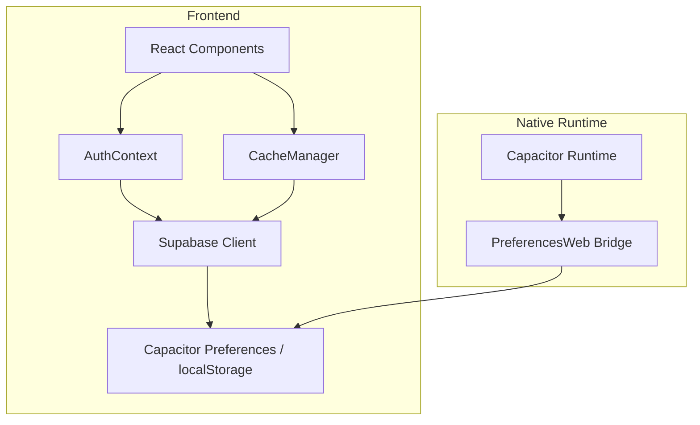
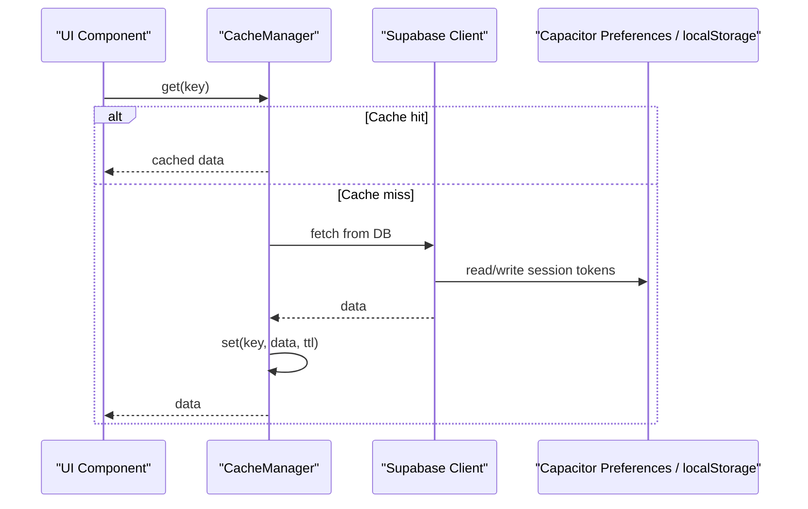
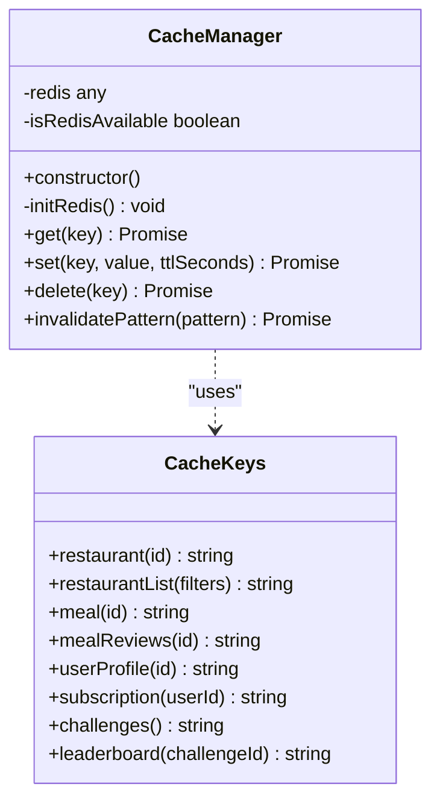
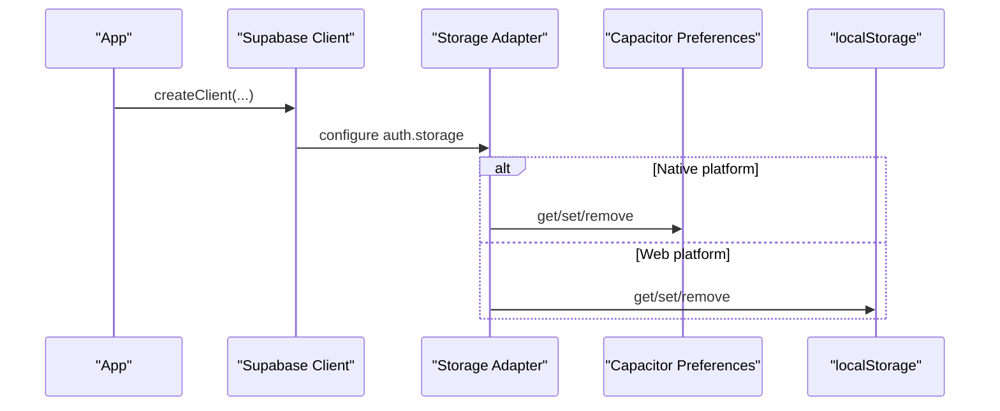
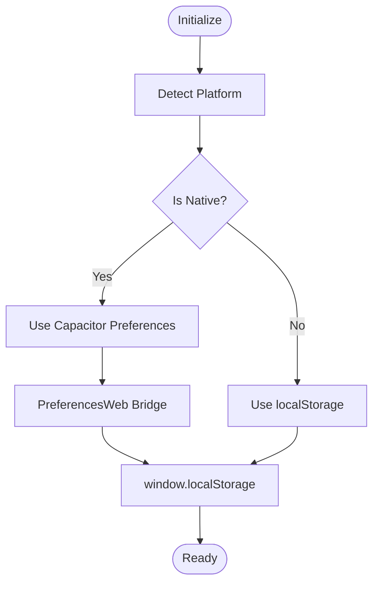
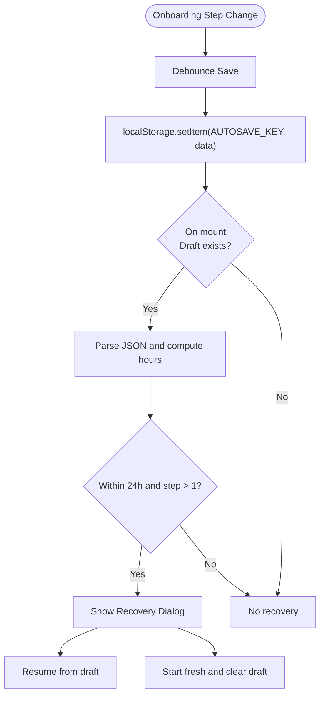
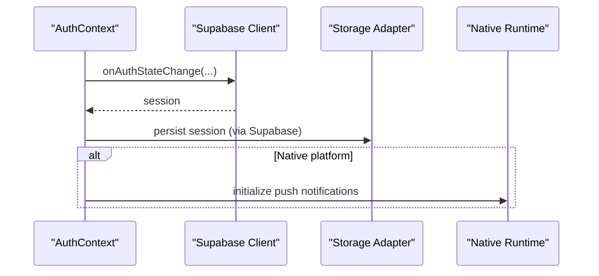
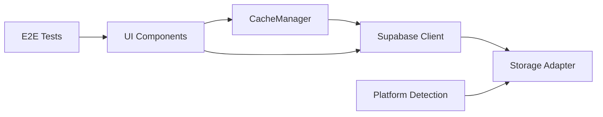

# Offline Capabilities

<cite>
**Referenced Files in This Document**
- [cache.ts](file://src/lib/cache.ts)
- [client.ts](file://src/integrations/supabase/client.ts)
- [AuthContext.tsx](file://src/contexts/AuthContext.tsx)
- [capacitor.ts](file://src/lib/capacitor.ts)
- [Onboarding.tsx](file://src/pages/Onboarding.tsx)
- [web-CqwUYSjD.js](file://android/app/src/main/assets/public/assets/web-CqwUYSjD.js)
- [web-CqwUYSjD.js](file://ios/App/App/public/assets/web-CqwUYSjD.js)
- [errors.spec.ts](file://e2e/system/errors.spec.ts)
- [mobile.spec.ts](file://e2e/customer/mobile.spec.ts)
</cite>

## Table of Contents
1. [Introduction](#introduction)
2. [Project Structure](#project-structure)
3. [Core Components](#core-components)
4. [Architecture Overview](#architecture-overview)
5. [Detailed Component Analysis](#detailed-component-analysis)
6. [Dependency Analysis](#dependency-analysis)
7. [Performance Considerations](#performance-considerations)
8. [Troubleshooting Guide](#troubleshooting-guide)
9. [Conclusion](#conclusion)

## Introduction
This document explains the offline capabilities implemented in the Nutrio mobile application. It focuses on the caching strategy, local storage management, data synchronization mechanisms, conflict resolution, handling of network connectivity changes, cache invalidation, persistence patterns, and background synchronization. It also provides guidance on implementing offline-first features, optimistic updates, and maintaining data integrity across platforms.

## Project Structure
The offline-related logic spans several layers:
- Supabase client abstraction with platform-aware storage
- A caching manager with Redis fallback and in-memory cache
- Platform detection and native feature wrappers
- Local persistence for onboarding drafts
- End-to-end tests covering offline scenarios

**Diagram sources**
- [client.ts:18-57](file://src/integrations/supabase/client.ts#L18-L57)
- [cache.ts:16-107](file://src/lib/cache.ts#L16-L107)
- [capacitor.ts:27-43](file://src/lib/capacitor.ts#L27-L43)
- [web-CqwUYSjD.js:1-1](file://android/app/src/main/assets/public/assets/web-CqwUYSjD.js#L1-L1)
- [web-CqwUYSjD.js:1-1](file://ios/App/App/public/assets/web-CqwUYSjD.js#L1-L1)

**Section sources**
- [client.ts:18-57](file://src/integrations/supabase/client.ts#L18-L57)
- [cache.ts:16-107](file://src/lib/cache.ts#L16-L107)
- [capacitor.ts:27-43](file://src/lib/capacitor.ts#L27-L43)

## Core Components
- Supabase client with platform-aware storage:
  - Uses Capacitor Preferences on native platforms and localStorage on the web.
  - Ensures sessions persist across app restarts without crashing on storage failures.
- Cache manager:
  - Provides get/set/delete/invalidatePattern with Redis availability detection and in-memory fallback.
  - Supplies typed cache keys and cached fetchers for restaurants, meals, and challenges.
- Platform detection and native wrappers:
  - Detects native vs web and exposes safe wrappers for native features.
- Local persistence for onboarding:
  - Auto-save and recovery of onboarding drafts using localStorage with debounced writes.

**Section sources**
- [client.ts:18-57](file://src/integrations/supabase/client.ts#L18-L57)
- [cache.ts:16-107](file://src/lib/cache.ts#L16-L107)
- [capacitor.ts:27-43](file://src/lib/capacitor.ts#L27-L43)
- [Onboarding.tsx:246-297](file://src/pages/Onboarding.tsx#L246-L297)

## Architecture Overview
The offline architecture centers on:
- Persistent session storage via Capacitor Preferences on native and localStorage on web.
- A layered cache that reduces network requests and improves perceived performance.
- Graceful degradation when Redis is unavailable, falling back to in-memory cache.
- Platform-specific storage bridge ensuring compatibility across Android and iOS.

**Diagram sources**
- [cache.ts:37-75](file://src/lib/cache.ts#L37-L75)
- [client.ts:18-57](file://src/integrations/supabase/client.ts#L18-L57)

## Detailed Component Analysis

### Cache Manager
The CacheManager encapsulates:
- Initialization with Redis availability detection and in-memory fallback.
- get: tries Redis first, then in-memory cache with TTL checks.
- set: writes to Redis if available, otherwise to in-memory cache.
- delete and invalidatePattern: supports targeted and wildcard invalidation.
- Typed cache keys for domain entities (restaurants, meals, profiles, subscriptions, challenges, leaderboards).

**Diagram sources**
- [cache.ts:16-121](file://src/lib/cache.ts#L16-L121)

**Section sources**
- [cache.ts:16-107](file://src/lib/cache.ts#L16-L107)
- [cache.ts:112-121](file://src/lib/cache.ts#L112-L121)

### Supabase Client and Storage Abstraction
The Supabase client uses a custom storage adapter:
- On native platforms, Capacitor Preferences is used for storing auth tokens and sessions.
- On web, localStorage is used.
- All storage operations are wrapped with try/catch to avoid crashes if storage is unavailable.

**Diagram sources**
- [client.ts:18-57](file://src/integrations/supabase/client.ts#L18-L57)

**Section sources**
- [client.ts:18-57](file://src/integrations/supabase/client.ts#L18-L57)

### Platform Detection and Native Storage Bridge
- Platform detection flags (native, iOS, Android, web) enable conditional behavior.
- Capacitor Preferences bridge is exposed to the web via a compiled asset that uses window.localStorage as the underlying implementation.
- This ensures consistent behavior across platforms while preserving native storage semantics on devices.

**Diagram sources**
- [capacitor.ts:27-43](file://src/lib/capacitor.ts#L27-L43)
- [web-CqwUYSjD.js:1-1](file://android/app/src/main/assets/public/assets/web-CqwUYSjD.js#L1-L1)
- [web-CqwUYSjD.js:1-1](file://ios/App/App/public/assets/web-CqwUYSjD.js#L1-L1)

**Section sources**
- [capacitor.ts:27-43](file://src/lib/capacitor.ts#L27-L43)
- [web-CqwUYSjD.js:1-1](file://android/app/src/main/assets/public/assets/web-CqwUYSjD.js#L1-L1)
- [web-CqwUYSjD.js:1-1](file://ios/App/App/public/assets/web-CqwUYSjD.js#L1-L1)

### Onboarding Draft Persistence
The onboarding flow persists a draft to localStorage with:
- Debounced autosave to avoid excessive writes.
- Recovery dialog logic to resume onboarding after a short time window.
- Safe parsing and error handling around draft data.

**Diagram sources**
- [Onboarding.tsx:246-297](file://src/pages/Onboarding.tsx#L246-L297)

**Section sources**
- [Onboarding.tsx:246-297](file://src/pages/Onboarding.tsx#L246-L297)

### Auth Context and Session Persistence
- AuthContext subscribes to Supabase auth state changes and initializes push notifications on native platforms upon sign-in.
- Session persistence relies on the platform-aware storage adapter, ensuring sessions survive app restarts.

**Diagram sources**
- [AuthContext.tsx:36-51](file://src/contexts/AuthContext.tsx#L36-L51)
- [client.ts:18-57](file://src/integrations/supabase/client.ts#L18-L57)

**Section sources**
- [AuthContext.tsx:36-51](file://src/contexts/AuthContext.tsx#L36-L51)
- [client.ts:18-57](file://src/integrations/supabase/client.ts#L18-L57)

## Dependency Analysis
- Supabase client depends on the platform-aware storage adapter.
- Cache manager depends on Supabase for data fetches and on Redis availability for persistence.
- Platform detection influences which storage adapter is used.
- End-to-end tests define expected offline behaviors for network disconnection and PWA install scenarios.

**Diagram sources**
- [client.ts:18-57](file://src/integrations/supabase/client.ts#L18-L57)
- [cache.ts:16-107](file://src/lib/cache.ts#L16-L107)
- [capacitor.ts:27-43](file://src/lib/capacitor.ts#L27-L43)
- [errors.spec.ts:38-96](file://e2e/system/errors.spec.ts#L38-L96)
- [mobile.spec.ts:23-36](file://e2e/customer/mobile.spec.ts#L23-L36)

**Section sources**
- [client.ts:18-57](file://src/integrations/supabase/client.ts#L18-L57)
- [cache.ts:16-107](file://src/lib/cache.ts#L16-L107)
- [capacitor.ts:27-43](file://src/lib/capacitor.ts#L27-L43)
- [errors.spec.ts:38-96](file://e2e/system/errors.spec.ts#L38-L96)
- [mobile.spec.ts:23-36](file://e2e/customer/mobile.spec.ts#L23-L36)

## Performance Considerations
- Cache TTL tuning:
  - Restaurant and meal caches use moderate TTLs suitable for frequently accessed but relatively stable data.
  - Challenges cache uses shorter TTL to reflect dynamic state changes.
- In-memory fallback:
  - Reduces latency when Redis is unavailable and avoids blocking the UI.
- Debounced writes:
  - Onboarding autosave uses debouncing to minimize write frequency and improve responsiveness.
- Platform-aware storage:
  - Ensures consistent performance characteristics across native and web environments.

[No sources needed since this section provides general guidance]

## Troubleshooting Guide
- Symptoms: Network disconnection or offline mode detected
  - Expected behaviors are captured in E2E tests for network disconnection and offline mode handling.
  - Actions:
    - Verify UI indicates offline state gracefully.
    - Confirm that cached data remains usable while offline.
    - Ensure reconnection triggers data refresh without data loss.
- Symptoms: Session not restored after app restart
  - Check that the platform-aware storage adapter is being used.
  - Confirm Capacitor Preferences on native and localStorage on web.
- Symptoms: Cache not invalidated after data changes
  - Use targeted invalidation for specific keys or wildcard invalidation for broad patterns.
  - Validate that invalidatePattern matches intended cache keys.

**Section sources**
- [errors.spec.ts:38-96](file://e2e/system/errors.spec.ts#L38-L96)
- [mobile.spec.ts:23-36](file://e2e/customer/mobile.spec.ts#L23-L36)
- [client.ts:18-57](file://src/integrations/supabase/client.ts#L18-L57)
- [cache.ts:77-106](file://src/lib/cache.ts#L77-L106)

## Conclusion
Nutrio’s offline capabilities combine a platform-aware storage layer, a flexible caching strategy with Redis availability detection and in-memory fallback, and robust persistence for user sessions and onboarding drafts. Together, these components provide resilient offline experiences, maintain data consistency, and enable graceful handling of network connectivity changes. Extending these patterns with optimistic updates and background sync will further strengthen offline-first workflows across platforms.