# Push Notification System

<cite>
**Referenced Files in This Document**
- [push.ts](file://src/lib/notifications/push.ts)
- [push.test.ts](file://src/lib/notifications/push.test.ts)
- [notifications.ts](file://src/lib/notifications.ts)
- [NotificationPreferences.tsx](file://src/components/NotificationPreferences.tsx)
- [usePushNotificationDeepLink.ts](file://src/hooks/usePushNotificationDeepLink.ts)
- [send-push-notification/index.ts](file://supabase/functions/send-push-notification/index.ts)
- [send-meal-reminders/index.ts](file://supabase/functions/send-meal-reminders/index.ts)
- [add_notification_preferences.sql](file://supabase/migrations/20240101000000_add_notification_preferences.sql)
- [fix_homepage_errors.sql](file://supabase/migrations/20260223000005_fix_homepage_errors.sql)
- [fix_notifications_user_fk_to_auth.sql](file://supabase/migrations/20260303144000_fix_notifications_user_fk_to_auth.sql)
</cite>

## Table of Contents
1. [Introduction](#introduction)
2. [System Architecture](#system-architecture)
3. [Core Components](#core-components)
4. [Firebase Cloud Messaging Integration](#firebase-cloud-messaging-integration)
5. [Notification Payload Structure](#notification-payload-structure)
6. [Notification Types and Handling](#notification-types-and-handling)
7. [Notification Preferences System](#notification-preferences-system)
8. [Deep Linking Implementation](#deep-linking-implementation)
9. [Local vs Push Notifications](#local-vs-push-notifications)
10. [Notification Scheduling](#notification-scheduling)
11. [Platform-Specific Features](#platform-specific-features)
12. [Analytics and Tracking](#analytics-and-tracking)
13. [Common Issues and Troubleshooting](#common-issues-and-troubleshooting)
14. [Best Practices](#best-practices)
15. [Conclusion](#conclusion)

## Introduction

The Nutrio mobile application implements a comprehensive push notification system built on Firebase Cloud Messaging (FCM) for both iOS and Android platforms. This system provides real-time communication capabilities, personalized user experiences, and seamless integration with the application's core features including order management, meal scheduling, and user engagement.

The notification system consists of three main layers: client-side integration for mobile platforms, server-side functions for message delivery, and database infrastructure for user preferences and token management. The system supports both immediate push notifications and scheduled local notifications, with sophisticated preference management and deep linking capabilities.

## System Architecture

The push notification system follows a distributed architecture with clear separation of concerns across client, server, and database layers:

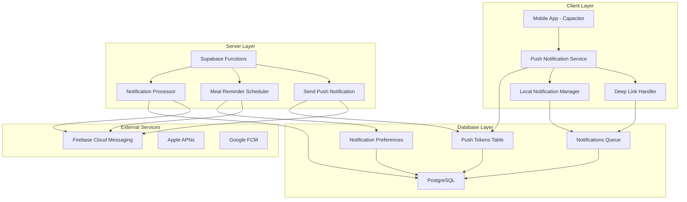

**Diagram sources**
- [push.ts:13-75](file://src/lib/notifications/push.ts#L13-L75)
- [send-push-notification/index.ts:178-299](file://supabase/functions/send-push-notification/index.ts#L178-L299)
- [add_notification_preferences.sql:45-56](file://supabase/migrations/20240101000000_add_notification_preferences.sql#L45-L56)

## Core Components

### Push Notification Service

The core push notification service is implemented as a singleton class that manages FCM token registration, permission handling, and notification lifecycle on native platforms.

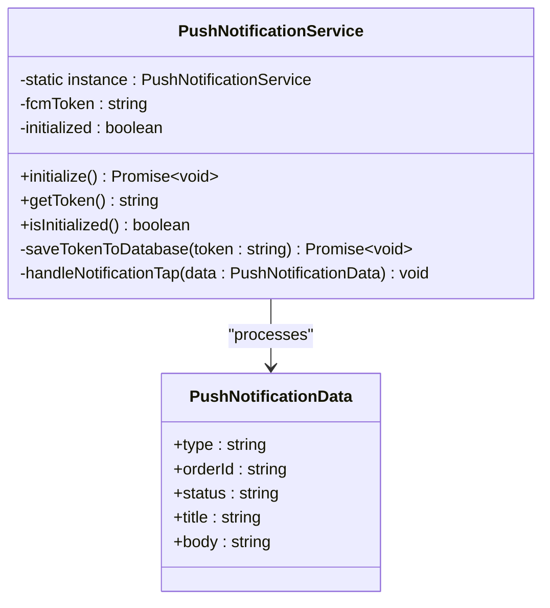

**Diagram sources**
- [push.ts:13-134](file://src/lib/notifications/push.ts#L13-L134)

The service handles platform detection, permission requests, token registration, and event listeners for notification actions. It maintains a singleton pattern to ensure consistent state management across the application lifecycle.

**Section sources**
- [push.ts:13-134](file://src/lib/notifications/push.ts#L13-L134)
- [push.test.ts:50-232](file://src/lib/notifications/push.test.ts#L50-L232)

### Notification Preferences System

The notification preferences system allows users to control which types of notifications they receive across different channels (push, email, SMS, WhatsApp).

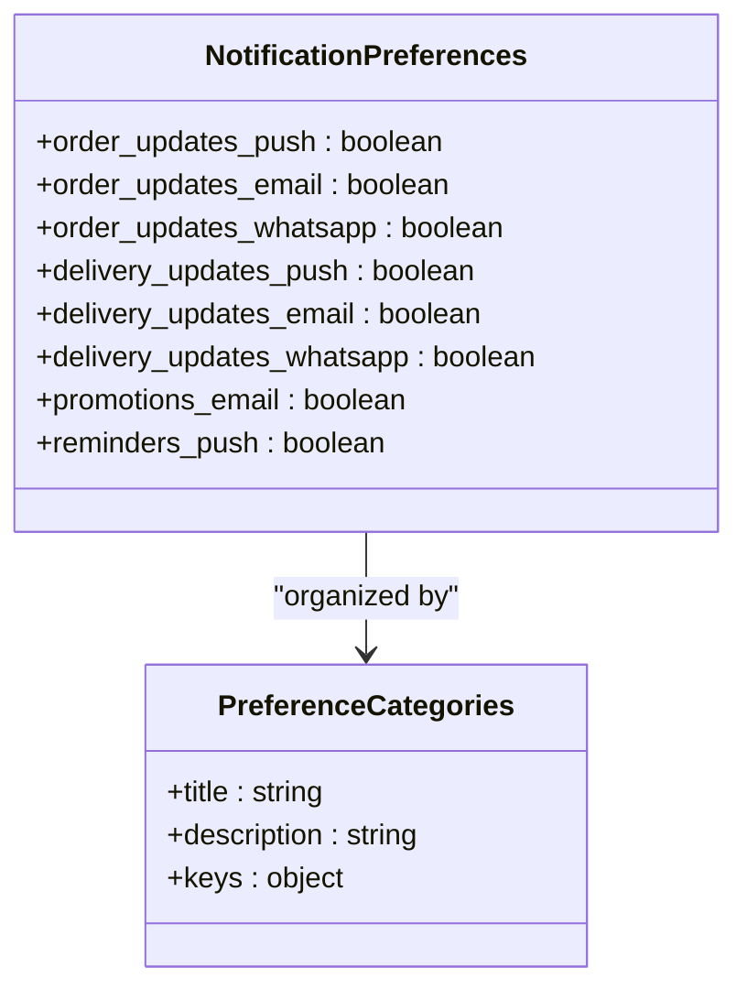

**Diagram sources**
- [NotificationPreferences.tsx:17-37](file://src/components/NotificationPreferences.tsx#L17-L37)

**Section sources**
- [NotificationPreferences.tsx:39-197](file://src/components/NotificationPreferences.tsx#L39-L197)
- [add_notification_preferences.sql:9-35](file://supabase/migrations/20240101000000_add_notification_preferences.sql#L9-L35)

## Firebase Cloud Messaging Integration

### Platform Setup and Configuration

The system integrates with Firebase Cloud Messaging through Capacitor plugins, supporting both iOS and Android platforms with platform-specific configurations.

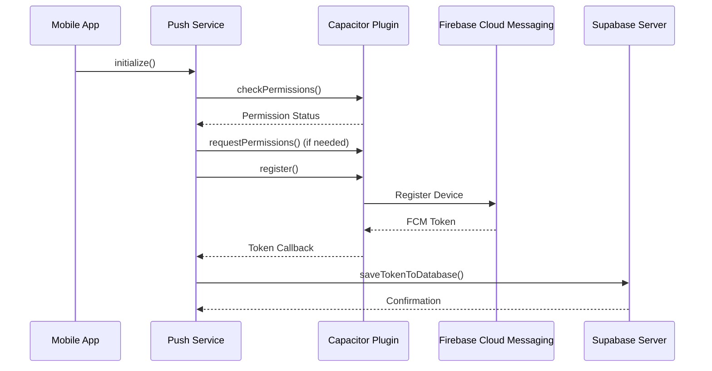

**Diagram sources**
- [push.ts:25-75](file://src/lib/notifications/push.ts#L25-L75)

### Token Management and Storage

The system maintains FCM tokens in a dedicated database table with platform-specific metadata and automatic deactivation of invalid tokens.

**Section sources**
- [push.ts:77-108](file://src/lib/notifications/push.ts#L77-L108)
- [add_notification_preferences.sql:45-56](file://supabase/migrations/20240101000000_add_notification_preferences.sql#L45-L56)

## Notification Payload Structure

### Standard Notification Payload

The notification system supports structured payloads with flexible data fields for deep linking and contextual information.

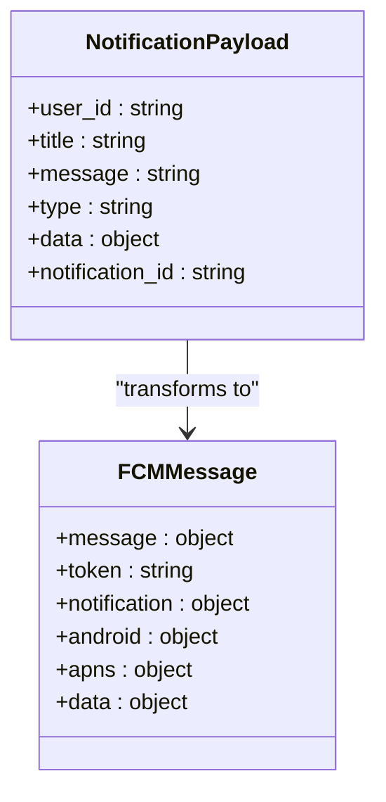

**Diagram sources**
- [send-push-notification/index.ts:7-42](file://supabase/functions/send-push-notification/index.ts#L7-L42)

### Platform-Specific Configurations

The system implements platform-specific configurations for optimal delivery across iOS and Android devices.

**Section sources**
- [send-push-notification/index.ts:129-154](file://supabase/functions/send-push-notification/index.ts#L129-L154)

## Notification Types and Handling

### Supported Notification Types

The system supports multiple notification types tailored to different user journeys and business scenarios:

| Type | Description | Platform Support |
|------|-------------|------------------|
| `order_update` | Order status changes and updates | iOS, Android |
| `delivery_update` | Driver assignment and delivery progress | iOS, Android |
| `promotion` | Marketing offers and promotional content | iOS, Android |
| `reminder` | Meal scheduling and reminder notifications | iOS, Android |
| `meal_reminder` | Scheduled meal notifications | iOS, Android |

### Notification Processing Flow

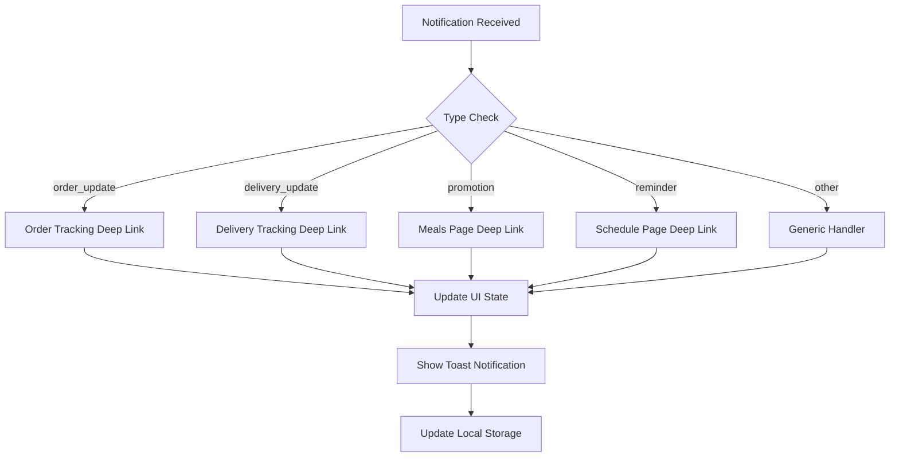

**Diagram sources**
- [push.ts:110-125](file://src/lib/notifications/push.ts#L110-L125)

**Section sources**
- [push.ts:5-11](file://src/lib/notifications/push.ts#L5-L11)
- [push.ts:110-125](file://src/lib/notifications/push.ts#L110-L125)

## Notification Preferences System

### Preference Categories and Defaults

The notification preferences system organizes user preferences into logical categories with sensible defaults:

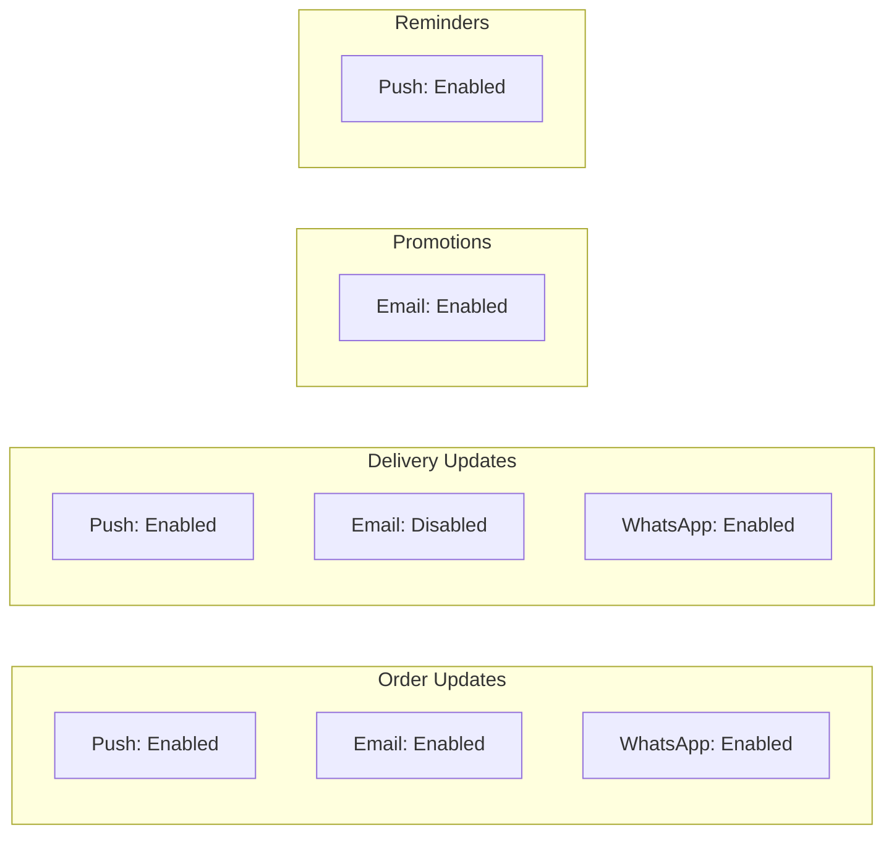

**Diagram sources**
- [NotificationPreferences.tsx:28-37](file://src/components/NotificationPreferences.tsx#L28-L37)

### Preference Persistence and Validation

The system ensures preference persistence through database transactions with automatic validation and error handling.

**Section sources**
- [NotificationPreferences.tsx:51-83](file://src/components/NotificationPreferences.tsx#L51-L83)
- [add_notification_preferences.sql:9-35](file://supabase/migrations/20240101000000_add_notification_preferences.sql#L9-L35)

## Deep Linking Implementation

### Deep Link Routes and Navigation

The deep linking system provides seamless navigation from notifications to relevant application screens:

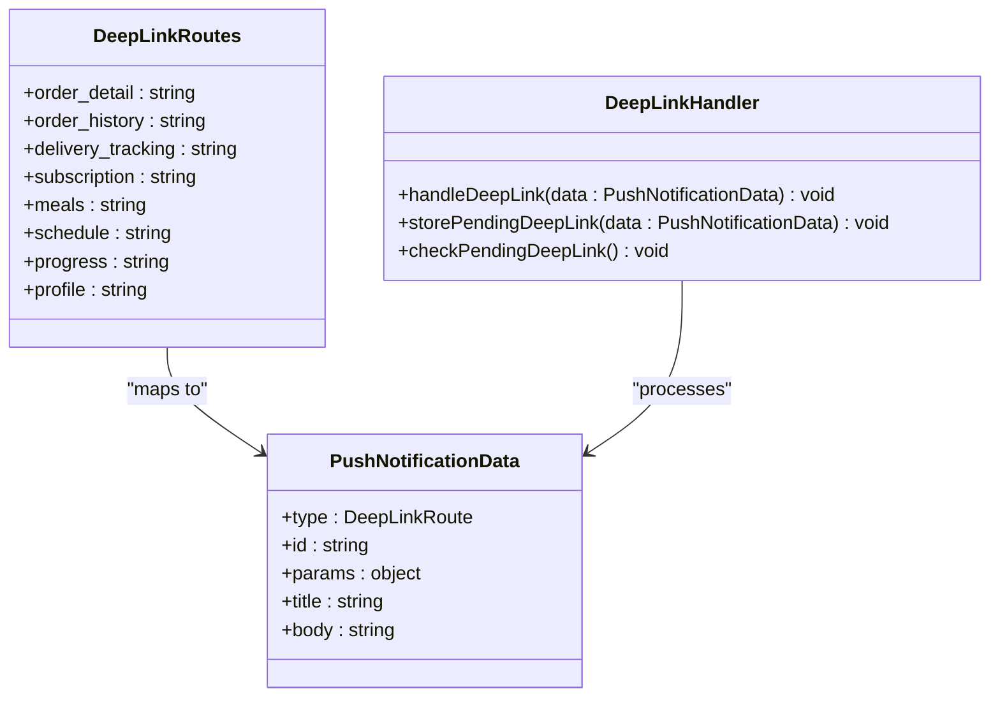

**Diagram sources**
- [usePushNotificationDeepLink.ts:5-49](file://src/hooks/usePushNotificationDeepLink.ts#L5-L49)
- [usePushNotificationDeepLink.ts:51-127](file://src/hooks/usePushNotificationDeepLink.ts#L51-L127)

### Template-Based Notifications

The system provides template functions for common notification patterns:

**Section sources**
- [usePushNotificationDeepLink.ts:149-194](file://src/hooks/usePushNotificationDeepLink.ts#L149-L194)

## Local vs Push Notifications

### Local Notification Management

The system distinguishes between push notifications (server-delivered) and local notifications (device-stored):

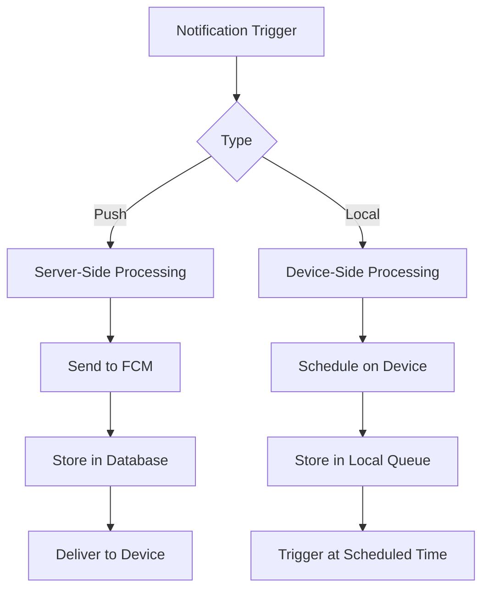

**Diagram sources**
- [notifications.ts:18-35](file://src/lib/notifications.ts#L18-L35)

### Notification Creation Helpers

The system provides helper functions for creating notifications with appropriate metadata and status tracking.

**Section sources**
- [notifications.ts:18-114](file://src/lib/notifications.ts#L18-L114)

## Notification Scheduling

### Scheduled Notification System

The system implements a robust scheduling mechanism for recurring and time-based notifications:

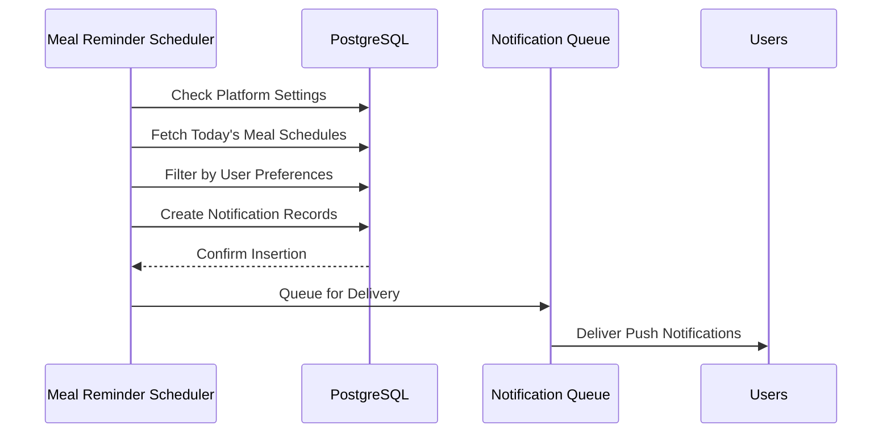

**Diagram sources**
- [send-meal-reminders/index.ts:29-228](file://supabase/functions/send-meal-reminders/index.ts#L29-L228)

### Platform Settings Integration

The scheduler respects global platform settings for notification delivery, allowing administrators to enable or disable push notifications system-wide.

**Section sources**
- [send-meal-reminders/index.ts:44-68](file://supabase/functions/send-meal-reminders/index.ts#L44-L68)

## Platform-Specific Features

### iOS Integration

iOS-specific configurations include APNs payload optimization and platform-specific notification channels.

### Android Integration

Android-specific features include notification channel management and FCM-specific configurations.

### Cross-Platform Considerations

The system maintains consistent behavior across platforms while leveraging platform-specific capabilities for optimal user experience.

## Analytics and Tracking

### Notification Analytics Infrastructure

The system tracks notification delivery, engagement, and user interaction through integrated analytics:

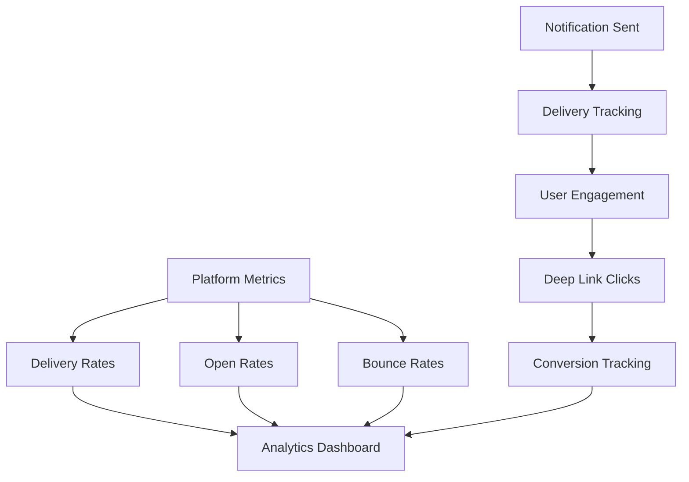

## Common Issues and Troubleshooting

### Token Registration Problems

Common issues include permission denials, invalid tokens, and platform-specific registration failures. The system implements comprehensive error handling and fallback mechanisms.

### Delivery Failures

The system automatically deactivates invalid tokens and provides detailed error reporting for troubleshooting delivery issues.

### Performance Optimization

The system includes token cleanup functions and optimized query patterns to maintain performance at scale.

## Best Practices

### User Experience Guidelines

- Respect user preferences and provide clear opt-out mechanisms
- Use meaningful notification content with clear call-to-action
- Implement proper deep linking for seamless navigation
- Test across multiple platforms and devices
- Monitor delivery rates and user engagement metrics

### Technical Implementation Guidelines

- Maintain token validity through regular cleanup and deactivation
- Implement proper error handling and retry mechanisms
- Use structured logging for debugging and monitoring
- Follow platform-specific notification guidelines and restrictions
- Ensure data privacy and compliance with applicable regulations

### Monitoring and Maintenance

Regular monitoring of notification delivery rates, user engagement metrics, and system performance helps maintain optimal notification service quality.

## Conclusion

The Nutrio push notification system provides a comprehensive, scalable solution for real-time communication across iOS and Android platforms. Through careful architecture design, platform-specific optimizations, and robust preference management, the system delivers reliable, engaging user experiences while maintaining technical excellence and operational efficiency.

The integration of Firebase Cloud Messaging, Supabase backend services, and React-based frontend components creates a cohesive ecosystem that supports both immediate notifications and sophisticated scheduling capabilities. With comprehensive analytics, error handling, and platform-specific optimizations, the system is well-positioned to support Nutrio's growth and evolving user needs.