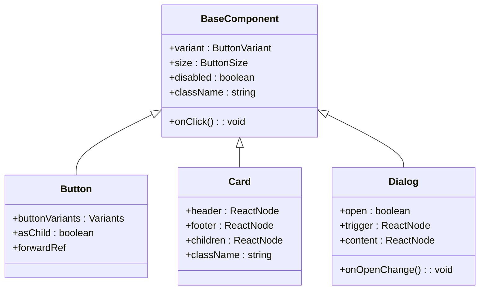
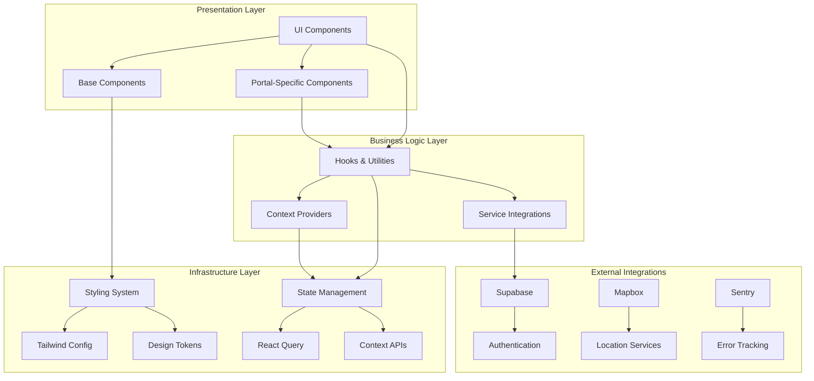
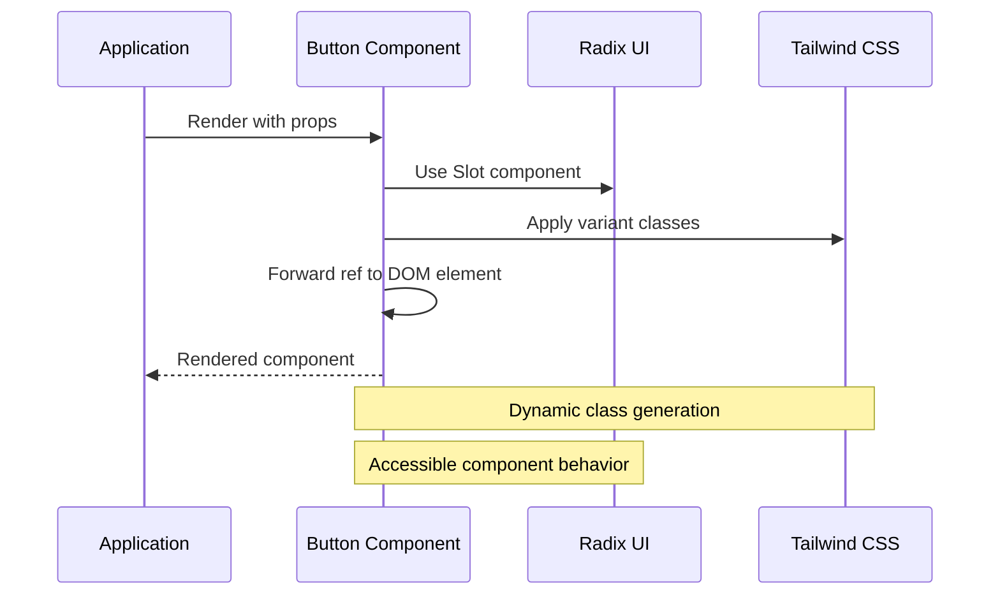
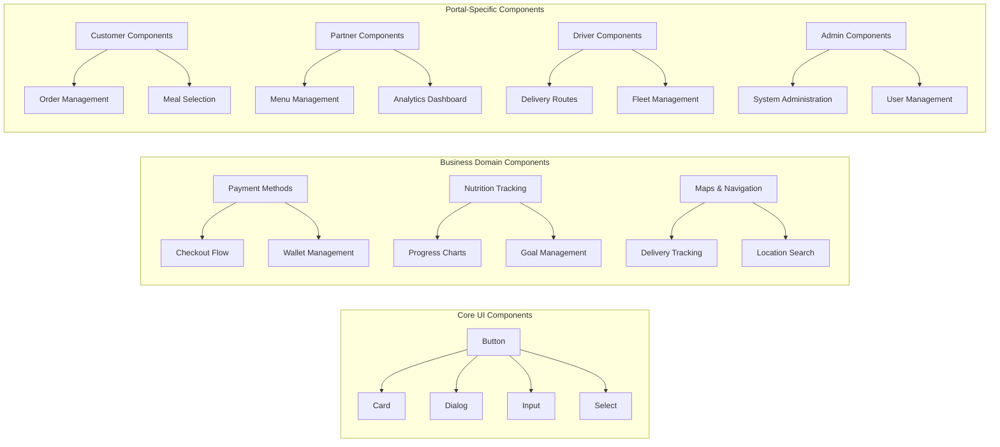
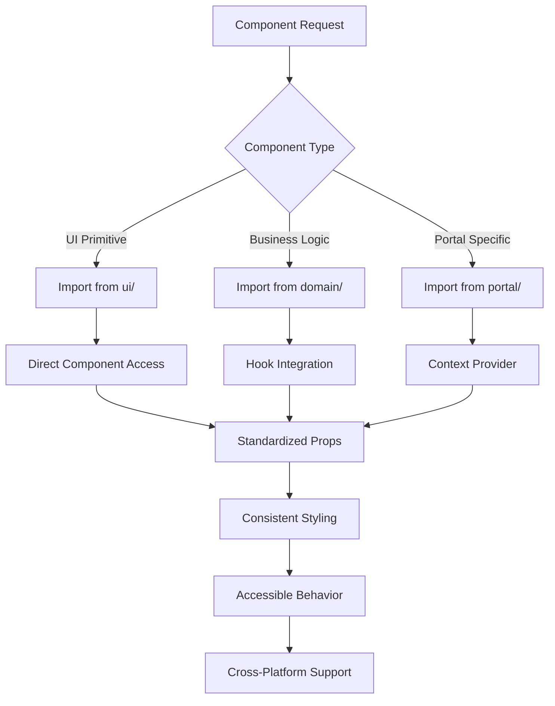
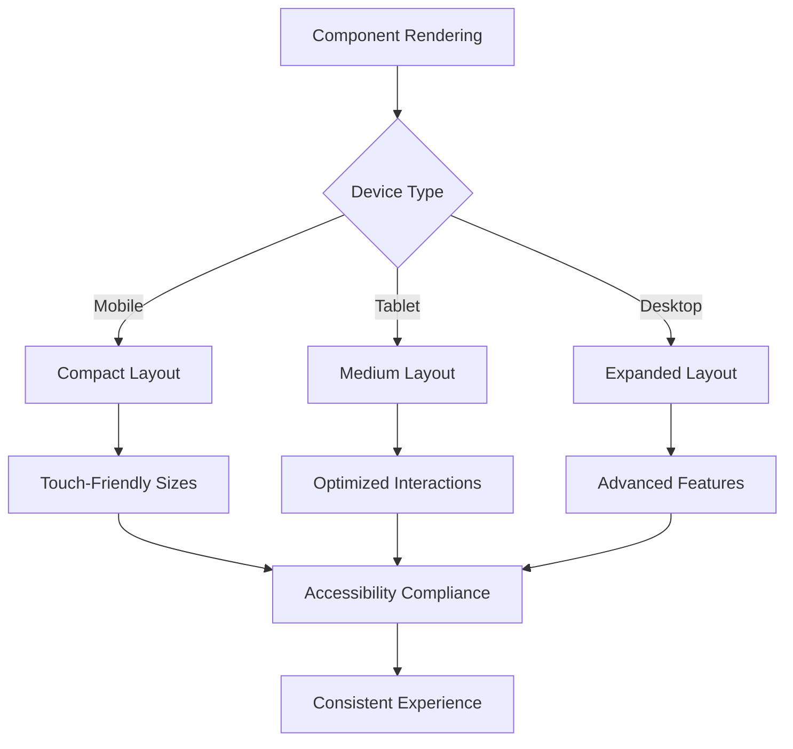
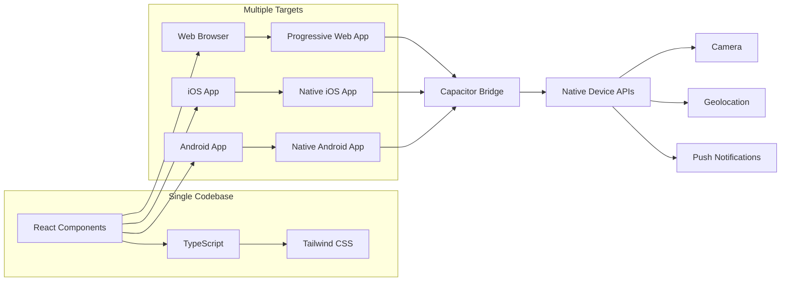
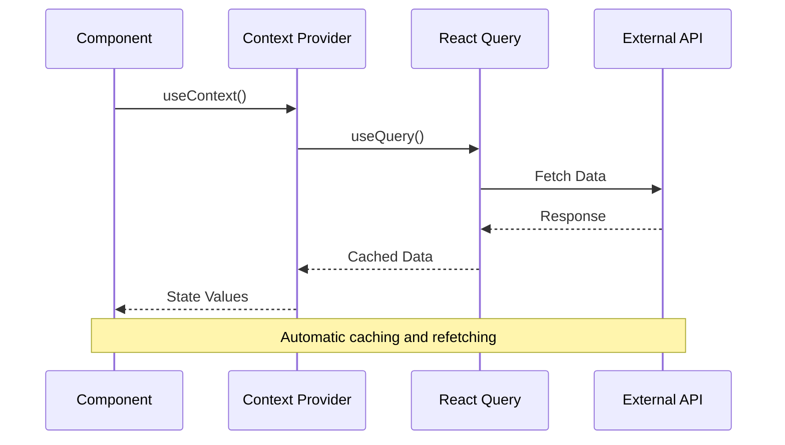
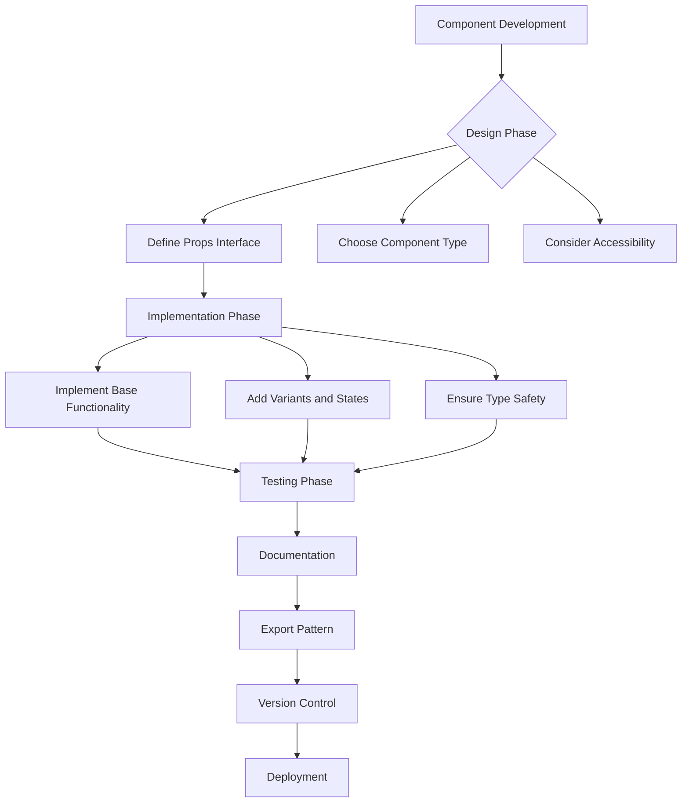

# Shared Components Library

<cite>
**Referenced Files in This Document**
- [package.json](file://package.json)
- [src/components/ui/Button.tsx](file://src/components/ui/Button.tsx)
- [src/App.tsx](file://src/App.tsx)
- [src/main.tsx](file://src/main.tsx)
- [src/components/ui/index.ts](file://src/components/ui/index.ts)
- [src/components/index.ts](file://src/components/index.ts)
- [src/lib/utils.ts](file://src/lib/utils.ts)
- [tailwind.config.ts](file://tailwind.config.ts)
- [src/components/maps/index.ts](file://src/components/maps/index.ts)
- [src/components/payment/index.ts](file://src/components/payment/index.ts)
- [src/components/progress/index.ts](file://src/components/progress/index.ts)
- [src/components/admin/index.ts](file://src/components/admin/index.ts)
- [src/components/customer/index.ts](file://src/components/customer/index.ts)
- [src/components/driver/index.ts](file://src/components/driver/index.ts)
- [src/components/partner/index.ts](file://src/components/partner/index.ts)
- [src/components/wallet/index.ts](file://src/components/wallet/index.ts)
- [src/components/body-metrics/index.ts](file://src/components/body-metrics/index.ts)
- [src/components/body-progress/index.ts](file://src/components/body-progress/index.ts)
- [src/components/health-score/index.ts](file://src/components/health-score/index.ts)
- [src/components/subscription/index.ts](file://src/components/subscription/index.ts)
- [src/components/CancellationFlow/index.ts](file://src/components/CancellationFlow/index.ts)
</cite>

## Table of Contents
1. [Introduction](#introduction)
2. [Project Structure](#project-structure)
3. [Core Components](#core-components)
4. [Architecture Overview](#architecture-overview)
5. [Detailed Component Analysis](#detailed-component-analysis)
6. [Component Library Organization](#component-library-organization)
7. [Design System Implementation](#design-system-implementation)
8. [Integration Patterns](#integration-patterns)
9. [Performance Considerations](#performance-considerations)
10. [Best Practices](#best-practices)
11. [Conclusion](#conclusion)

## Introduction

The Shared Components Library is a comprehensive React component framework designed for the Nutrio healthy meal delivery platform. This library serves as the foundation for consistent UI development across multiple portals including customer, partner, driver, and admin interfaces. Built with TypeScript, Radix UI primitives, and Tailwind CSS, the library emphasizes reusability, maintainability, and scalability while supporting cross-platform deployment through Capacitor.

The library encompasses over 80 reusable components organized into specialized categories, each serving specific functional domains within the nutrition and meal delivery ecosystem. These components range from basic UI primitives to complex business-specific interfaces that handle meal ordering, nutrition tracking, subscription management, and delivery coordination.

## Project Structure

The shared components library follows a modular architecture with clear separation of concerns and standardized organization patterns:

```mermaid
graph TB
subgraph "Root Structure"
A[src/] --> B[components/]
A --> C[lib/]
A --> D[contexts/]
A --> E[hooks/]
A --> F[pages/]
A --> G[services/]
end
subgraph "Components Organization"
B --> H[ui/ - Base Components]
B --> I[payment/ - Payment System]
B --> J[progress/ - Nutrition Tracking]
B --> K[maps/ - Location Services]
B --> L[admin/ - Administrative Tools]
B --> M[customer/ - Customer Portal]
B --> N[driver/ - Driver Portal]
B --> O[partner/ - Partner Portal]
B --> P[wallet/ - Financial Management]
B --> Q[body-metrics/ - Health Metrics]
B --> R[health-score/ - Health Analytics]
B --> S[subscription/ - Subscription Management]
B --> T[CancellationFlow/ - Business Logic]
end
subgraph "Supporting Infrastructure"
C --> U[utils.ts - Utility Functions]
D --> V[Context Providers]
E --> W[Custom Hooks]
X[tailwind.config.ts] --> Y[Styling System]
end
```



**Diagram sources**
- [src/components/ui/Button.tsx:1-63](file://src/components/ui/Button.tsx#L1-L63)
- [src/components/index.ts](file://src/components/index.ts)
- [src/lib/utils.ts](file://src/lib/utils.ts)

**Section sources**
- [package.json:1-163](file://package.json#L1-L163)
- [src/components/index.ts](file://src/components/index.ts)

## Core Components

The foundation of the shared components library rests on a robust set of base components that provide consistent styling, behavior, and accessibility across all portal applications. The library leverages Radix UI primitives for enhanced accessibility and follows modern React patterns for optimal performance.

### Primary Dependencies and Technologies

The component library is built on several key technologies that ensure consistency and reliability:

- **React 18.3.1**: Latest React version with concurrent features and improved performance
- **Radix UI Primitives**: Accessible UI component foundations for dialogs, menus, and interactive elements
- **Tailwind CSS**: Utility-first styling system with custom design tokens
- **TypeScript**: Strong typing for enhanced developer experience and code reliability
- **Capacitor**: Cross-platform mobile deployment capabilities

### Component Architecture Principles

Components follow strict architectural patterns ensuring consistency and maintainability:



**Diagram sources**
- [src/components/ui/Button.tsx:48-62](file://src/components/ui/Button.tsx#L48-L62)

**Section sources**
- [package.json:44-131](file://package.json#L44-L131)
- [src/components/ui/Button.tsx:1-63](file://src/components/ui/Button.tsx#L1-L63)

## Architecture Overview

The shared components library implements a layered architecture that promotes separation of concerns and component reusability:



**Diagram sources**
- [src/App.tsx](file://src/App.tsx)
- [src/main.tsx](file://src/main.tsx)
- [src/lib/utils.ts](file://src/lib/utils.ts)

The architecture ensures that components remain decoupled from business logic while maintaining strong typing and consistent styling across all portal applications.

## Detailed Component Analysis

### Button Component System

The Button component exemplifies the library's design philosophy with its comprehensive variant system and consistent behavior patterns:

```mermaid
classDiagram
class ButtonProps {
+variant : ButtonVariant
+size : ButtonSize
+asChild : boolean
+className : string
}
class ButtonVariant {
<<enumeration>>
default
destructive
outline
secondary
ghost
link
gradient
hero
"hero-outline"
soft
icon
}
class ButtonSize {
<<enumeration>>
default
sm
lg
xl
icon
}
ButtonProps --> ButtonVariant
ButtonProps --> ButtonSize
```

**Diagram sources**
- [src/components/ui/Button.tsx:48-46](file://src/components/ui/Button.tsx#L48-L46)

The Button component supports 10 distinct variants and 5 sizing options, providing extensive customization while maintaining visual consistency. Each variant follows established design patterns for primary actions, destructive operations, secondary choices, and specialized use cases like hero buttons and icon-only interactions.

### Component Composition Patterns

Components utilize composition patterns that enhance flexibility and reusability:



**Diagram sources**
- [src/components/ui/Button.tsx:54-58](file://src/components/ui/Button.tsx#L54-L58)

**Section sources**
- [src/components/ui/Button.tsx:1-63](file://src/components/ui/Button.tsx#L1-L63)

## Component Library Organization

The shared components library employs a hierarchical organization strategy that groups related components by functional domain while maintaining clear import patterns and standardized interfaces.

### Component Categories and Responsibilities



**Diagram sources**
- [src/components/index.ts](file://src/components/index.ts)
- [src/components/ui/index.ts](file://src/components/ui/index.ts)

### Import Organization and Export Patterns

The library implements standardized import and export patterns that facilitate easy consumption across different portal applications:



**Diagram sources**
- [src/components/index.ts](file://src/components/index.ts)
- [src/components/ui/index.ts](file://src/components/ui/index.ts)

**Section sources**
- [src/components/index.ts](file://src/components/index.ts)
- [src/components/ui/index.ts](file://src/components/ui/index.ts)

## Design System Implementation

The shared components library implements a comprehensive design system that ensures visual consistency and brand coherence across all portal applications.

### Design Token System

The library utilizes a structured token system for consistent design implementation:

| Category | Tokens | Purpose |
|----------|--------|---------|
| **Colors** | primary, secondary, destructive, muted | Brand identity and semantic meaning |
| **Typography** | fontSizes, fontWeights, lineHeights | Text hierarchy and readability |
| **Spacing** | spaceScale, padding, margin | Layout consistency and rhythm |
| **Radii** | radii, cornerRadius | Visual appeal and modern aesthetics |
| **Shadows** | shadows, elevation, depth | Visual hierarchy and dimensionality |

### Responsive Design Patterns

Components incorporate responsive design principles that adapt to various screen sizes and device orientations:



**Diagram sources**
- [tailwind.config.ts](file://tailwind.config.ts)

### Accessibility Standards

The design system prioritizes accessibility compliance through:

- **Semantic HTML**: Proper use of HTML elements for meaning and structure
- **Keyboard Navigation**: Full keyboard accessibility for all interactive components
- **Screen Reader Support**: ARIA labels and roles for assistive technologies
- **Color Contrast**: Minimum contrast ratios meeting WCAG guidelines
- **Focus Management**: Clear focus indicators and logical tab order

**Section sources**
- [tailwind.config.ts](file://tailwind.config.ts)

## Integration Patterns

The shared components library supports multiple integration patterns that enable seamless incorporation into different application architectures and deployment targets.

### Cross-Platform Deployment

The library leverages Capacitor for cross-platform compatibility, enabling deployment to web, iOS, and Android platforms from a single codebase:



**Diagram sources**
- [package.json:45-61](file://package.json#L45-L61)

### External Service Integration

Components integrate with external services through standardized patterns:

- **Authentication**: Supabase integration for user authentication and session management
- **Location Services**: Mapbox integration for mapping and navigation functionality
- **Analytics**: PostHog integration for user behavior tracking and analytics
- **Error Monitoring**: Sentry integration for error tracking and performance monitoring
- **Payment Processing**: Stripe integration for secure payment transactions

### State Management Integration

The library integrates with modern state management solutions:



**Diagram sources**
- [src/contexts/AuthContext.tsx](file://src/contexts/AuthContext.tsx)

**Section sources**
- [package.json:95-129](file://package.json#L95-L129)

## Performance Considerations

The shared components library implements several performance optimization strategies to ensure efficient rendering and smooth user experiences across all supported platforms.

### Bundle Size Optimization

- **Tree Shaking**: Components are exported individually to enable dead code elimination
- **Lazy Loading**: Heavy components can be loaded on demand to reduce initial bundle size
- **Code Splitting**: Large components are split into separate chunks for better loading performance
- **Asset Optimization**: Images and media are optimized and lazy-loaded when appropriate

### Rendering Performance

- **React.memo**: Components are memoized to prevent unnecessary re-renders
- **useMemo/useCallback**: Complex calculations and callback functions are memoized
- **Virtualization**: Large lists and data grids use virtualization for efficient rendering
- **Suspense**: Async components leverage React Suspense for better loading states

### Memory Management

- **Cleanup Functions**: Effects and event listeners are properly cleaned up
- **Resource Pooling**: Expensive resources are pooled and reused
- **Weak References**: Appropriate use of weak references to prevent memory leaks
- **Idle Callbacks**: Non-critical operations are scheduled during idle periods

## Best Practices

The shared components library establishes comprehensive best practices for component development, consumption, and maintenance.

### Component Development Guidelines



### Code Quality Standards

- **TypeScript Strict Mode**: All components use strict TypeScript configuration
- **Consistent Naming**: Components follow consistent naming conventions
- **Documentation**: Every component includes comprehensive documentation
- **Testing**: Components include unit tests and integration tests
- **Accessibility**: All components meet accessibility standards

### Performance Guidelines

- **Avoid Prop Drilling**: Use context providers for deep prop passing
- **Optimize Event Handlers**: Memoize event handlers to prevent re-renders
- **Lazy Load Heavy Components**: Defer loading of resource-intensive components
- **Use React Profiler**: Regularly profile components for performance issues
- **Monitor Bundle Size**: Track bundle size growth and optimize accordingly

### Maintenance Practices

- **Regular Updates**: Dependencies are regularly updated with security patches
- **Breaking Change Management**: Major version updates follow semantic versioning
- **Migration Guides**: Comprehensive migration guides for breaking changes
- **Backward Compatibility**: Effort is made to maintain backward compatibility
- **Deprecation Strategy**: Clear deprecation timelines and alternatives

## Conclusion

The Shared Components Library represents a mature, production-ready component framework that successfully balances flexibility, maintainability, and performance. Through its comprehensive organization, robust design system, and thoughtful integration patterns, the library provides a solid foundation for the Nutrio platform's multi-portal architecture.

Key achievements of the library include:

- **Comprehensive Coverage**: Over 80 components spanning multiple functional domains
- **Cross-Platform Support**: Seamless deployment to web, iOS, and Android platforms
- **Accessibility Compliance**: Built-in accessibility features and WCAG compliance
- **Performance Optimization**: Carefully crafted performance characteristics and optimization strategies
- **Developer Experience**: Excellent TypeScript support, comprehensive documentation, and testing infrastructure

The library's modular architecture ensures that components remain reusable and maintainable while supporting the specific needs of different portal applications. Its integration with modern React patterns, TypeScript, and contemporary development tools positions it well for future enhancements and scaling requirements.

As the Nutrio platform continues to evolve, the Shared Components Library will serve as a cornerstone for consistent, high-quality user experiences across all touchpoints of the nutrition and meal delivery ecosystem.