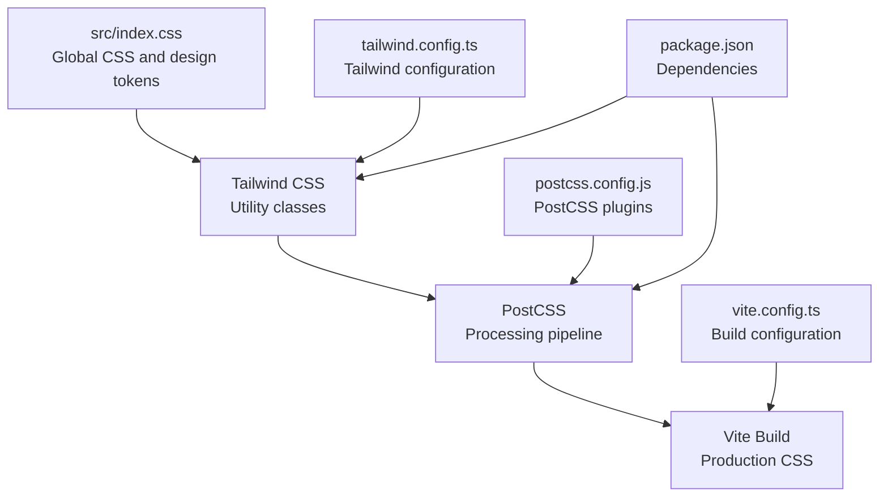
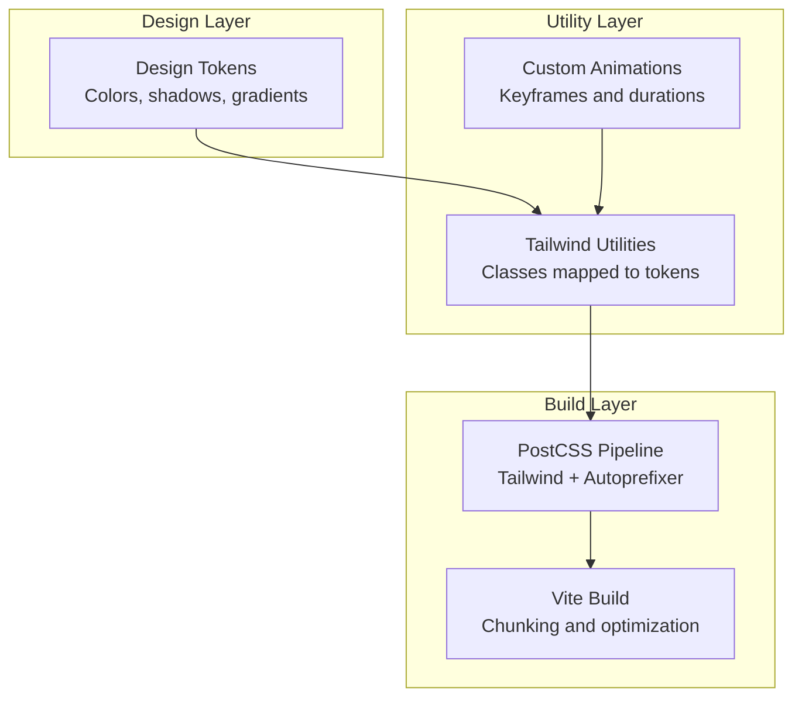
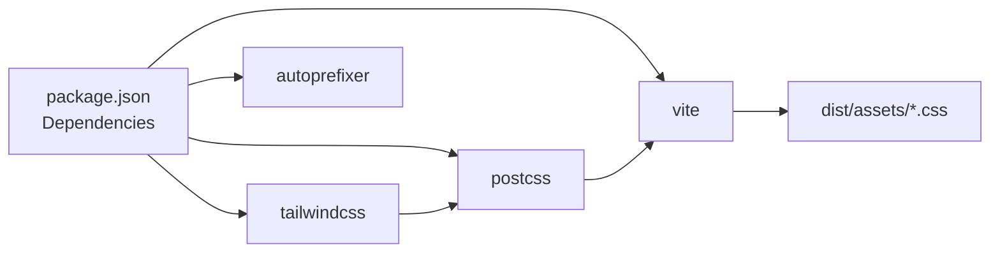

# Styling Infrastructure

<cite>
**Referenced Files in This Document**
- [tailwind.config.ts](file://tailwind.config.ts)
- [postcss.config.js](file://postcss.config.js)
- [package.json](file://package.json)
- [vite.config.ts](file://vite.config.ts)
- [src/index.css](file://src/index.css)
- [src/App.css](file://src/App.css)
- [src/components/ionic-variables.css](file://src/components/ionic-variables.css)
</cite>

## Update Summary
**Changes Made**
- Removed comprehensive Ionic React integration section as Ionic-specific styling has been eliminated
- Updated architecture overview to reflect pure Tailwind CSS approach
- Removed Ionic-specific CSS variables and overrides documentation
- Simplified component analysis to focus on native Tailwind utilities
- Updated troubleshooting guide to remove Ionic-related issues

## Table of Contents
1. [Introduction](#introduction)
2. [Project Structure](#project-structure)
3. [Core Components](#core-components)
4. [Architecture Overview](#architecture-overview)
5. [Detailed Component Analysis](#detailed-component-analysis)
6. [Dependency Analysis](#dependency-analysis)
7. [Performance Considerations](#performance-considerations)
8. [Troubleshooting Guide](#troubleshooting-guide)
9. [Conclusion](#conclusion)

## Introduction
This document describes the styling infrastructure of the Nutrio application, focusing on how Tailwind CSS and PostCSS work together to provide a cohesive design system across web and mobile platforms. The styling pipeline transforms design tokens into responsive, theme-aware CSS that supports light and dark modes, custom animations, and platform-specific UI components.

**Updated** The styling infrastructure has been simplified to use pure Tailwind CSS utilities and custom React components, eliminating over 300 lines of Ionic-specific styling code and removing the dependency on Ionic React components.

## Project Structure
The styling system is organized around two pillars:
- Design tokens and theme variables defined in CSS custom properties
- Tailwind CSS configuration extending design tokens into utility classes
- PostCSS processing to compile and optimize styles

**Diagram sources**
- [src/index.css:1-314](file://src/index.css#L1-L314)
- [tailwind.config.ts:1-128](file://tailwind.config.ts#L1-L128)
- [postcss.config.js:1-7](file://postcss.config.js#L1-L7)
- [package.json:1-160](file://package.json#L1-L160)
- [vite.config.ts:1-80](file://vite.config.ts#L1-L80)

**Section sources**
- [src/index.css:1-314](file://src/index.css#L1-L314)
- [tailwind.config.ts:1-128](file://tailwind.config.ts#L1-L128)
- [postcss.config.js:1-7](file://postcss.config.js#L1-L7)
- [package.json:1-160](file://package.json#L1-L160)
- [vite.config.ts:1-80](file://vite.config.ts#L1-L80)

## Core Components
- Design tokens and theme variables: Centralized color palettes, typography, spacing, shadows, and gradients defined as CSS custom properties in the global stylesheet.
- Tailwind configuration: Extends design tokens into Tailwind utilities, custom animations, and semantic color groups.
- PostCSS pipeline: Processes Tailwind utilities and autoprefixes vendor-specific properties.
- Vite build: Produces optimized CSS bundles for production and development.

Key implementation references:
- Global design tokens and utilities: [src/index.css:11-255](file://src/index.css#L11-L255)
- Tailwind configuration: [tailwind.config.ts:3-127](file://tailwind.config.ts#L3-L127)
- PostCSS configuration: [postcss.config.js:1-7](file://postcss.config.js#L1-L7)
- Build and chunking: [vite.config.ts:55-78](file://vite.config.ts#L55-L78)

**Section sources**
- [src/index.css:11-255](file://src/index.css#L11-L255)
- [tailwind.config.ts:3-127](file://tailwind.config.ts#L3-L127)
- [postcss.config.js:1-7](file://postcss.config.js#L1-L7)
- [vite.config.ts:55-78](file://vite.config.ts#L55-L78)

## Architecture Overview
The styling architecture integrates design tokens and Tailwind utilities through CSS custom properties and Tailwind's theme extension.

**Diagram sources**
- [src/index.css:11-255](file://src/index.css#L11-L255)
- [tailwind.config.ts:19-124](file://tailwind.config.ts#L19-L124)
- [postcss.config.js:1-7](file://postcss.config.js#L1-L7)
- [vite.config.ts:55-78](file://vite.config.ts#L55-L78)

## Detailed Component Analysis

### Design Tokens and CSS Custom Properties
The global stylesheet defines:
- Light and dark mode color palettes using HSL variables
- Semantic color groups (background, foreground, primary, secondary, destructive, warning, success, muted, accent, card, popover, sidebar)
- Typography and spacing tokens
- Shadow and gradient definitions
- Safe area utilities for mobile devices
- Utility classes for backgrounds, gradients, and custom scrollbars

Implementation references:
- Root and dark mode variables: [src/index.css:12-126](file://src/index.css#L12-L126)
- Layered utilities: [src/index.css:129-255](file://src/index.css#L129-L255)
- Animation utilities: [src/index.css:257-314](file://src/index.css#L257-L314)

**Section sources**
- [src/index.css:12-126](file://src/index.css#L12-L126)
- [src/index.css:129-255](file://src/index.css#L129-L255)
- [src/index.css:257-314](file://src/index.css#L257-L314)

### Tailwind CSS Configuration
Tailwind is configured to:
- Use class-based dark mode
- Scan source files for utility usage
- Extend theme with custom colors, radii, shadows, and keyframes
- Register animations and custom utilities
- Apply the tailwindcss-animate plugin

Implementation references:
- Configuration and dark mode: [tailwind.config.ts:4-5](file://tailwind.config.ts#L4-L5)
- Content scanning paths: [tailwind.config.ts:5](file://tailwind.config.ts#L5)
- Extended theme (colors, radii, shadows): [tailwind.config.ts:19-88](file://tailwind.config.ts#L19-L88)
- Keyframes and animations: [tailwind.config.ts:89-123](file://tailwind.config.ts#L89-L123)
- Plugin registration: [tailwind.config.ts:126](file://tailwind.config.ts#L126)

**Section sources**
- [tailwind.config.ts:4-5](file://tailwind.config.ts#L4-L5)
- [tailwind.config.ts:5](file://tailwind.config.ts#L5)
- [tailwind.config.ts:19-88](file://tailwind.config.ts#L19-L88)
- [tailwind.config.ts:89-123](file://tailwind.config.ts#L89-L123)
- [tailwind.config.ts:126](file://tailwind.config.ts#L126)

### PostCSS Processing Pipeline
PostCSS applies:
- Tailwind directives (@tailwind base, components, utilities)
- Autoprefixer for vendor prefixes
- Tailwind JIT compilation and purging

Implementation references:
- PostCSS plugins: [postcss.config.js:1-7](file://postcss.config.js#L1-L7)
- Tailwind directives in global CSS: [src/index.css:7-9](file://src/index.css#L7-L9)

**Section sources**
- [postcss.config.js:1-7](file://postcss.config.js#L1-L7)
- [src/index.css:7-9](file://src/index.css#L7-L9)

### Vite Build and Optimization
Vite optimizes styling during build:
- Sourcemaps enabled for error tracking
- Terser minification with console removal in production
- Manual chunk splitting for vendor libraries and UI components
- Base path configuration for deployment environments

Implementation references:
- Build configuration and chunking: [vite.config.ts:55-78](file://vite.config.ts#L55-L78)
- Sourcemaps and minification: [vite.config.ts:60-67](file://vite.config.ts#L60-L67)

**Section sources**
- [vite.config.ts:55-78](file://vite.config.ts#L55-L78)
- [vite.config.ts:60-67](file://vite.config.ts#L60-L67)

### Application Styles and Animations
The application-level styles include:
- Base styles for root element and logos
- Animation utilities for fade-in, slide-up, scale-in, pulse, and floating effects
- Staggered animation delays for grouped elements
- RTL layout adjustments for page headers

Implementation references:
- Base styles: [src/App.css:1-43](file://src/App.css#L1-L43)
- Animation utilities: [src/index.css:257-314](file://src/index.css#L257-L314)

**Section sources**
- [src/App.css:1-43](file://src/App.css#L1-L43)
- [src/index.css:257-314](file://src/index.css#L257-L314)

## Dependency Analysis
The styling infrastructure depends on:
- Tailwind CSS for utility-first styling
- PostCSS for processing and autoprefixing
- Vite for bundling and optimization

**Diagram sources**
- [package.json:44-161](file://package.json#L44-L161)

**Section sources**
- [package.json:44-161](file://package.json#L44-L161)

## Performance Considerations
- Tailwind purging: Tailwind scans configured paths to remove unused utilities, reducing CSS size.
- CSS custom properties: Using HSL variables enables efficient light/dark mode switching without duplicating styles.
- Vite chunking: Vendor and UI libraries are split into separate chunks for improved caching.
- Minification and sourcemaps: Production builds enable minification and sourcemaps for debugging.

## Troubleshooting Guide
Common styling issues and resolutions:
- Missing Tailwind utilities: Verify content paths in the Tailwind configuration scan the correct directories.
- Dark mode not applying: Ensure the dark mode class strategy matches the configured method and that the class is toggled appropriately.
- PostCSS processing errors: Check PostCSS plugin configuration and ensure Tailwind directives are present in the global stylesheet.

**Section sources**
- [tailwind.config.ts:5](file://tailwind.config.ts#L5)
- [tailwind.config.ts:4](file://tailwind.config.ts#L4)
- [postcss.config.js:1-7](file://postcss.config.js#L1-L7)

## Conclusion
The styling infrastructure combines design tokens and Tailwind utilities into a unified, theme-aware system. CSS custom properties provide consistent theming across platforms, while Tailwind extends these tokens into practical utilities. PostCSS and Vite optimize the final CSS for performance and maintainability. This architecture supports scalable styling across web and mobile environments without the complexity of Ionic React integration.