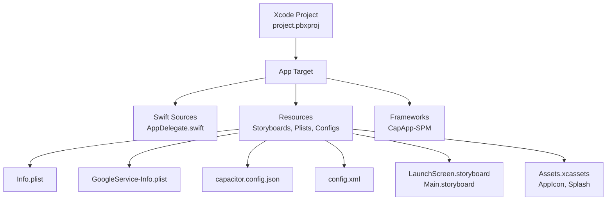
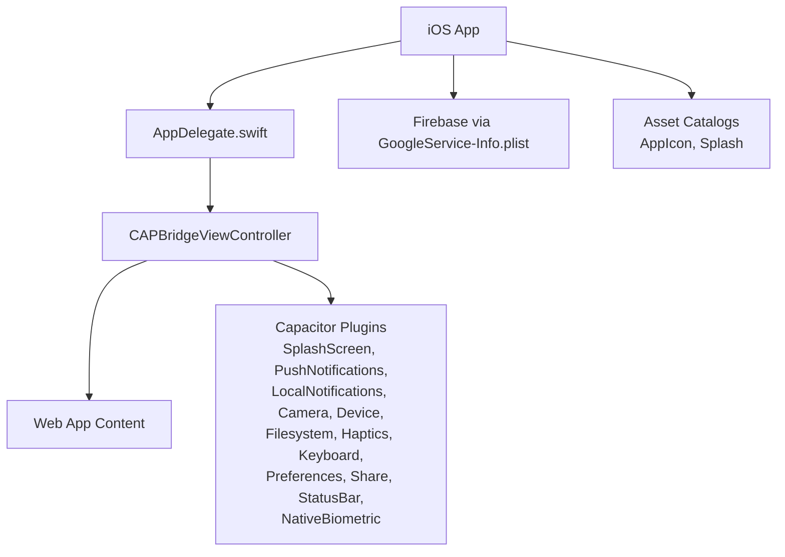
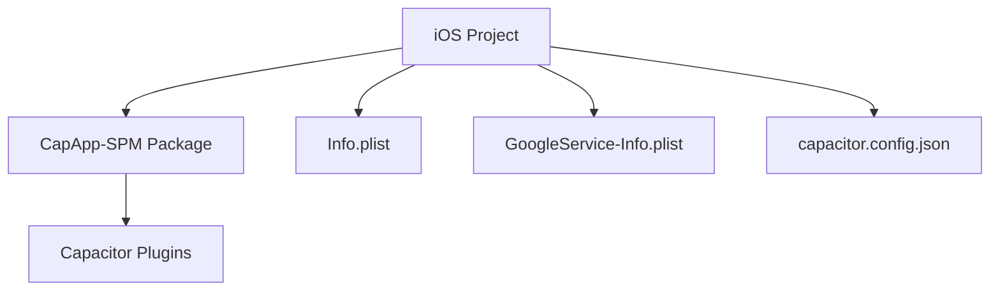

# iOS Development

<cite>
**Referenced Files in This Document**
- [project.pbxproj](file://ios/App/App.xcodeproj/project.pbxproj)
- [AppDelegate.swift](file://ios/App/App/AppDelegate.swift)
- [LaunchScreen.storyboard](file://ios/App/App/Base.lproj/LaunchScreen.storyboard)
- [Main.storyboard](file://ios/App/App/Base.lproj/Main.storyboard)
- [Info.plist](file://ios/App/App/Info.plist)
- [GoogleService-Info.plist](file://ios/App/App/GoogleService-Info.plist)
- [capacitor.config.json](file://ios/App/App/capacitor.config.json)
- [config.xml](file://ios/App/App/config.xml)
- [debug.xcconfig](file://ios/debug.xcconfig)
- [CapApp-SPM Package.swift](file://ios/App/CapApp-SPM/Package.swift)
</cite>

## Table of Contents
1. [Introduction](#introduction)
2. [Project Structure](#project-structure)
3. [Core Components](#core-components)
4. [Architecture Overview](#architecture-overview)
5. [Detailed Component Analysis](#detailed-component-analysis)
6. [Dependency Analysis](#dependency-analysis)
7. [Performance Considerations](#performance-considerations)
8. [Troubleshooting Guide](#troubleshooting-guide)
9. [Conclusion](#conclusion)

## Introduction
This document provides comprehensive iOS development guidance for the Nutrio mobile application. It covers the Xcode project structure, Capacitor-based iOS integration, Firebase/GCM configuration for push notifications, asset catalog management, and iOS-specific plugin configurations. It also outlines build configuration, code signing, and App Store deployment considerations grounded in the repository's iOS setup.

## Project Structure
The iOS project is organized under the ios/App directory and integrates Capacitor for web-to-native bridging. Key elements include:
- Xcode project definition and targets
- Swift application delegate
- Storyboards for launch and main views
- Asset catalogs for icons and splash images
- Capacitor configuration for plugins and navigation
- Firebase configuration via GoogleService-Info.plist
- Cordova compatibility layer via config.xml
- Build configuration via debug.xcconfig

**Diagram sources**
- [project.pbxproj](file://ios/App/App.xcodeproj/project.pbxproj)
- [AppDelegate.swift](file://ios/App/App/AppDelegate.swift)
- [LaunchScreen.storyboard](file://ios/App/App/Base.lproj/LaunchScreen.storyboard)
- [Main.storyboard](file://ios/App/App/Base.lproj/Main.storyboard)
- [Info.plist](file://ios/App/App/Info.plist)
- [GoogleService-Info.plist](file://ios/App/App/GoogleService-Info.plist)
- [capacitor.config.json](file://ios/App/App/capacitor.config.json)
- [config.xml](file://ios/App/App/config.xml)

**Section sources**
- [project.pbxproj](file://ios/App/App.xcodeproj/project.pbxproj)
- [AppDelegate.swift](file://ios/App/App/AppDelegate.swift)
- [LaunchScreen.storyboard](file://ios/App/App/Base.lproj/LaunchScreen.storyboard)
- [Main.storyboard](file://ios/App/App/Base.lproj/Main.storyboard)
- [Info.plist](file://ios/App/App/Info.plist)
- [GoogleService-Info.plist](file://ios/App/App/GoogleService-Info.plist)
- [capacitor.config.json](file://ios/App/App/capacitor.config.json)
- [config.xml](file://ios/App/App/config.xml)
- [debug.xcconfig](file://ios/debug.xcconfig)

## Core Components
- Application Delegate: Implements standard iOS lifecycle callbacks and delegates URL/activity handling to Capacitor's proxy.
- Capacitor Bridge: The main storyboard embeds the CAPBridgeViewController, enabling Capacitor to manage the web content.
- Asset Catalogs: AppIcon and Splash image sets configured for app icon generation and launch screen visuals.
- Plugin Configuration: Capacitor plugins for splash screen, push/local notifications, camera, device, filesystem, haptics, keyboard, preferences, share, status bar, and native biometric authentication.
- Firebase Integration: GoogleService-Info.plist enables Firebase services including messaging and authentication.
- Build Configuration: debug.xcconfig toggles Capacitor debug mode; project.pbxproj defines build settings, code signing style, and deployment targets.

**Section sources**
- [AppDelegate.swift](file://ios/App/App/AppDelegate.swift)
- [Main.storyboard](file://ios/App/App/Base.lproj/Main.storyboard)
- [capacitor.config.json](file://ios/App/App/capacitor.config.json)
- [GoogleService-Info.plist](file://ios/App/App/GoogleService-Info.plist)
- [debug.xcconfig](file://ios/debug.xcconfig)
- [project.pbxproj](file://ios/App/App.xcodeproj/project.pbxproj)

## Architecture Overview
The iOS app uses Capacitor to host a web-based UI within a native container. The application delegate coordinates with Capacitor for deep linking and universal links. Plugins are declared in the Capacitor configuration and loaded at runtime. Firebase is integrated via GoogleService-Info.plist for push notification capabilities.

**Diagram sources**
- [AppDelegate.swift](file://ios/App/App/AppDelegate.swift)
- [Main.storyboard](file://ios/App/App/Base.lproj/Main.storyboard)
- [capacitor.config.json](file://ios/App/App/capacitor.config.json)
- [GoogleService-Info.plist](file://ios/App/App/GoogleService-Info.plist)

## Detailed Component Analysis

### App Icon Configuration and Asset Catalog Management
- Asset Catalog: App icons and splash images are managed via Assets.xcassets. The project references this catalog in the Xcode build phase.
- AppIcon Set: The asset catalog includes an AppIcon set used by Xcode to generate the app icon for different device resolutions.
- Splash Image Set: A Splash imageset is present and referenced by the launch storyboard to display the app splash during startup.

Implementation highlights:
- The project.pbxproj lists Assets.xcassets among the resources built for the target.
- The launch storyboard references an image named "Splash" from the asset catalog.

Best practices:
- Ensure all required icon sizes are provided in the AppIcon set.
- Keep splash imagery aligned with brand guidelines and avoid text that may not scale.

**Section sources**
- [project.pbxproj](file://ios/App/App.xcodeproj/project.pbxproj)
- [LaunchScreen.storyboard](file://ios/App/App/Base.lproj/LaunchScreen.storyboard)

### Launch Screen Setup
- LaunchScreen.storyboard defines a simple view controller that displays the Splash image from the asset catalog.
- The Info.plist specifies UILaunchStoryboardName as "LaunchScreen", ensuring the OS loads this storyboard at launch.

Implementation highlights:
- The launch view controller uses a full-screen aspect-fill image for the splash.
- Background color defaults to system background color.

**Section sources**
- [LaunchScreen.storyboard](file://ios/App/App/Base.lproj/LaunchScreen.storyboard)
- [Info.plist](file://ios/App/App/Info.plist)

### GoogleService-Info.plist and Firebase Integration
- Purpose: Provides Firebase configuration including API keys, project identifiers, and service flags.
- Services Enabled: Messaging (GCM), App Invites, Sign-In, and storage bucket details are defined.
- Remote Notifications: The Info.plist declares remote-notification background mode, enabling push notifications.

Implementation highlights:
- Keys include API key, GCM sender ID, bundle ID, project ID, storage bucket, and Google App ID.
- Background mode "remote-notification" is enabled in Info.plist.

**Section sources**
- [GoogleService-Info.plist](file://ios/App/App/GoogleService-Info.plist)
- [Info.plist](file://ios/App/App/Info.plist)

### Capacitor iOS Plugins Integration
- Plugin Configuration: The Capacitor configuration defines plugin settings for SplashScreen, PushNotifications, LocalNotifications, and NativeBiometric.
- Package Classes: The configuration lists package classes for camera, device, filesystem, haptics, keyboard, local notifications, preferences, push notifications, share, splash screen, status bar, and native biometric authentication.

Implementation highlights:
- Presentation options for push notifications include badge, sound, and alert.
- Local notifications specify a default sound.
- Native biometric plugin includes localized titles and descriptions.

**Section sources**
- [capacitor.config.json](file://ios/App/App/capacitor.config.json)

### Cordova iOS Compatibility Layer
- config.xml: Minimal Cordova widget configuration included for compatibility with Cordova plugins. It allows universal access and declares no platform-specific restrictions.

**Section sources**
- [config.xml](file://ios/App/App/config.xml)

### Native Swift Code Implementation
- AppDelegate: Implements standard iOS lifecycle methods and forwards URL and universal link handling to Capacitor's ApplicationDelegateProxy.
- Bridge Integration: The main storyboard embeds CAPBridgeViewController, which Capacitor uses to host the web content.

**Section sources**
- [AppDelegate.swift](file://ios/App/App/AppDelegate.swift)
- [Main.storyboard](file://ios/App/App/Base.lproj/Main.storyboard)

### iOS-Specific Capacitor Plugins
- Camera, Device, Filesystem, Haptics, Keyboard, Preferences, Share, Status Bar: Declared in the package class list for Capacitor.
- PushNotifications and LocalNotifications: Configured with presentation options and default sound respectively.
- NativeBiometric: Configured with localized UI strings for biometric prompts.

**Section sources**
- [capacitor.config.json](file://ios/App/App/capacitor.config.json)

### Build Configuration and Code Signing
- Build Settings: The project.pbxproj defines separate Debug and Release configurations with Swift compiler flags, optimization levels, and SDK roots.
- Code Signing: Provisioning style is Automatic; CODE_SIGN_IDENTITY is set to iPhone Developer for both Debug and Release.
- Deployment Target: IPHONEOS_DEPLOYMENT_TARGET is set to 15.0.
- Bundle Identifiers: PRODUCT_BUNDLE_IDENTIFIER is com.nutriofuel.app; INFOPLIST_FILE points to App/Info.plist.
- Debug Mode: debug.xcconfig sets CAPACITOR_DEBUG to true, enabling Capacitor's debug behavior.

**Section sources**
- [project.pbxproj](file://ios/App/App.xcodeproj/project.pbxproj)
- [debug.xcconfig](file://ios/debug.xcconfig)

### App Store Deployment Procedures
- Pre-Release Checklist:
  - Verify bundle identifier matches Apple Developer records.
  - Confirm provisioning profiles and certificates are valid for distribution.
  - Ensure Info.plist background modes align with intended functionality (e.g., remote notifications).
  - Validate asset catalog entries for all required icon sizes and splash imagery.
- Build Variants:
  - Archive using Release configuration with VALIDATE_PRODUCT enabled.
  - Upload via Xcode Organizer or Transporter.
- Post-Submission:
  - Monitor TestFlight builds if applicable.
  - Review App Store Connect for rejection reasons and resubmit as needed.

Note: The repository configuration indicates Automatic provisioning and iPhone Developer signing identity; adjust these settings according to your Apple Developer account and distribution certificate.

**Section sources**
- [project.pbxproj](file://ios/App/App.xcodeproj/project.pbxproj)
- [Info.plist](file://ios/App/App/Info.plist)

## Dependency Analysis
The iOS project depends on Capacitor packages and plugins defined in the configuration. The Xcode project integrates Capacitor as a Swift Package Manager product and includes Capacitor resources and frameworks.

**Diagram sources**
- [project.pbxproj](file://ios/App/App.xcodeproj/project.pbxproj)
- [CapApp-SPM Package.swift](file://ios/App/CapApp-SPM/Package.swift)
- [capacitor.config.json](file://ios/App/App/capacitor.config.json)

**Section sources**
- [project.pbxproj](file://ios/App/App.xcodeproj/project.pbxproj)
- [CapApp-SPM Package.swift](file://ios/App/CapApp-SPM/Package.swift)

## Performance Considerations
- Optimize splash screen duration and immersiveness per Capacitor configuration to reduce perceived loading time.
- Minimize heavy initialization in AppDelegate to keep app launch responsive.
- Use Capacitor plugin settings judiciously to avoid unnecessary background processing.

## Troubleshooting Guide
- Push Notifications Not Received:
  - Verify GoogleService-Info.plist keys and project identifiers.
  - Confirm remote-notification background mode is enabled in Info.plist.
  - Ensure push notification entitlements and APNs configuration are set up in Apple Developer portal.
- App Crashes on Launch:
  - Check Info.plist bundle identifiers and CFBundleVersion/MARKETING_VERSION.
  - Validate asset catalog entries for AppIcon and Splash.
- Capacitor Debug Mode:
  - Ensure CAPACITOR_DEBUG is set appropriately in debug.xcconfig for development vs production.

**Section sources**
- [GoogleService-Info.plist](file://ios/App/App/GoogleService-Info.plist)
- [Info.plist](file://ios/App/App/Info.plist)
- [debug.xcconfig](file://ios/debug.xcconfig)

## Conclusion
The Nutrio iOS project leverages Capacitor to bridge a web-based UI with native iOS capabilities. The configuration includes essential elements for app identity, asset management, plugin integration, and Firebase-powered push notifications. By aligning Xcode build settings, asset catalogs, and plugin configurations with Apple's platform guidelines, teams can reliably develop, test, and deploy the iOS application.