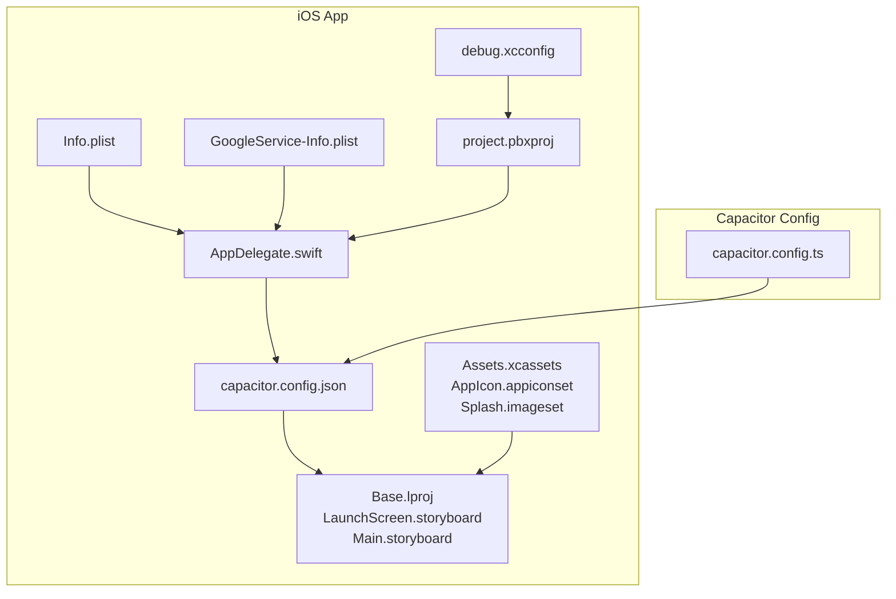
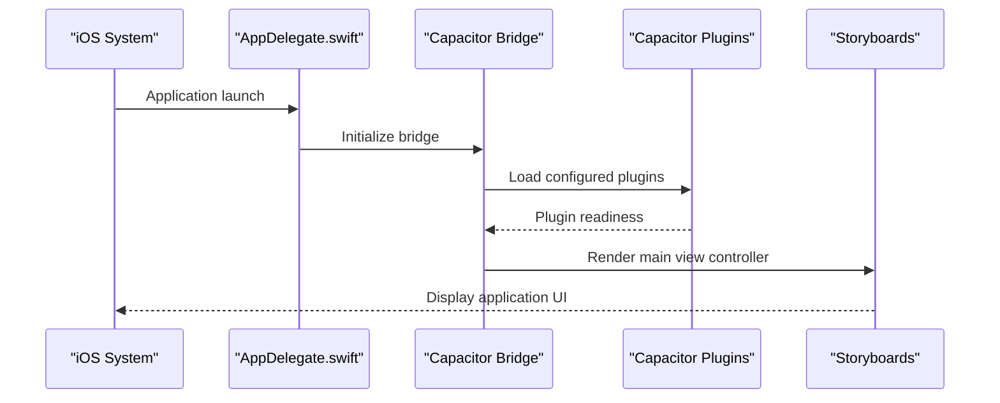
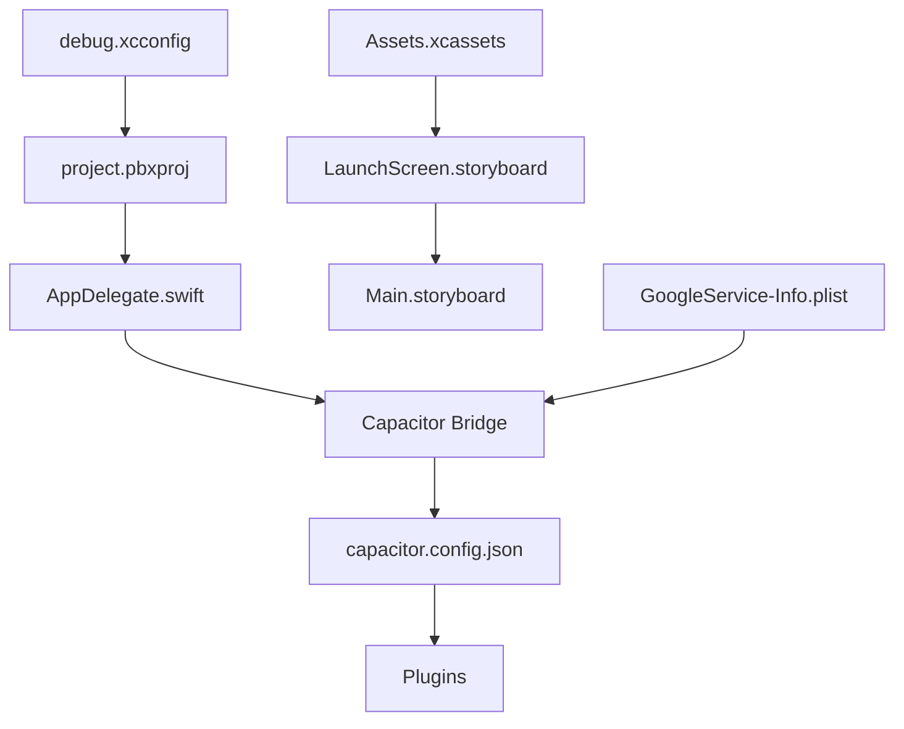

# iOS Platform Implementation

<cite>
**Referenced Files in This Document**
- [Info.plist](file://ios/App/App/Info.plist)
- [AppDelegate.swift](file://ios/App/App/AppDelegate.swift)
- [capacitor.config.json](file://ios/App/App/capacitor.config.json)
- [project.pbxproj](file://ios/App/App.xcodeproj/project.pbxproj)
- [debug.xcconfig](file://ios/debug.xcconfig)
- [LaunchScreen.storyboard](file://ios/App/App/Base.lproj/LaunchScreen.storyboard)
- [Main.storyboard](file://ios/App/App/Base.lproj/Main.storyboard)
- [GoogleService-Info.plist](file://ios/App/App/GoogleService-Info.plist)
- [Contents.json (AppIcon)](file://ios/App/App/Assets.xcassets/AppIcon.appiconset/Contents.json)
- [Contents.json (Splash)](file://ios/App/App/Assets.xcassets/Splash.imageset/Contents.json)
- [capacitor.config.ts](file://capacitor.config.ts)
</cite>

## Table of Contents
1. [Introduction](#introduction)
2. [Project Structure](#project-structure)
3. [Core Components](#core-components)
4. [Architecture Overview](#architecture-overview)
5. [Detailed Component Analysis](#detailed-component-analysis)
6. [Dependency Analysis](#dependency-analysis)
7. [Performance Considerations](#performance-considerations)
8. [Troubleshooting Guide](#troubleshooting-guide)
9. [Conclusion](#conclusion)

## Introduction
This document provides comprehensive iOS platform implementation details for the Nutrio mobile application. It covers iOS-specific configuration (Info.plist settings, entitlements, provisioning profiles), Xcode project structure, asset catalog management, launch screen customization, Capacitor plugin configurations, native Swift integration patterns, push notification setup, App Store submission requirements, code signing processes, platform-specific optimizations, and troubleshooting guidance.

## Project Structure
The iOS implementation resides under the ios/App/App directory and integrates with Capacitor for cross-platform capabilities. Key elements include:
- Application entry point via AppDelegate.swift
- iOS configuration via Info.plist and Capacitor configuration files
- Asset catalogs for icons and splash screens
- Storyboards for launch and main UI
- Firebase configuration via GoogleService-Info.plist
- Xcode project configuration managed through project.pbxproj

**Diagram sources**
- [AppDelegate.swift:1-50](file://ios/App/App/AppDelegate.swift#L1-L50)
- [Info.plist:1-56](file://ios/App/App/Info.plist#L1-L56)
- [capacitor.config.json:1-56](file://ios/App/App/capacitor.config.json#L1-L56)
- [GoogleService-Info.plist:1-30](file://ios/App/App/GoogleService-Info.plist#L1-L30)
- [Contents.json (AppIcon):1-15](file://ios/App/App/Assets.xcassets/AppIcon.appiconset/Contents.json#L1-L15)
- [Contents.json (Splash):1-23](file://ios/App/App/Assets.xcassets/Splash.imageset/Contents.json#L1-L23)
- [LaunchScreen.storyboard:1-33](file://ios/App/App/Base.lproj/LaunchScreen.storyboard#L1-L33)
- [Main.storyboard:1-20](file://ios/App/App/Base.lproj/Main.storyboard#L1-L20)
- [project.pbxproj:1-200](file://ios/App/App.xcodeproj/project.pbxproj#L1-L200)
- [debug.xcconfig:1-2](file://ios/debug.xcconfig#L1-L2)
- [capacitor.config.ts:1-45](file://capacitor.config.ts#L1-L45)

**Section sources**
- [AppDelegate.swift:1-50](file://ios/App/App/AppDelegate.swift#L1-L50)
- [Info.plist:1-56](file://ios/App/App/Info.plist#L1-L56)
- [capacitor.config.json:1-56](file://ios/App/App/capacitor.config.json#L1-L56)
- [GoogleService-Info.plist:1-30](file://ios/App/App/GoogleService-Info.plist#L1-L30)
- [LaunchScreen.storyboard:1-33](file://ios/App/App/Base.lproj/LaunchScreen.storyboard#L1-L33)
- [Main.storyboard:1-20](file://ios/App/App/Base.lproj/Main.storyboard#L1-L20)
- [project.pbxproj:1-200](file://ios/App/App.xcodeproj/project.pbxproj#L1-L200)
- [debug.xcconfig:1-2](file://ios/debug.xcconfig#L1-L2)
- [capacitor.config.ts:1-45](file://capacitor.config.ts#L1-L45)

## Core Components
This section outlines the primary iOS components and their roles in the Nutrio application.

- Application Delegate: Manages application lifecycle events and integrates with Capacitor's ApplicationDelegateProxy for URL handling and universal links.
- Configuration Files: Info.plist defines bundle identifiers, supported orientations, background modes, and display settings. Capacitor configuration controls plugin behavior and server settings.
- Asset Catalogs: AppIcon.appiconset provides universal icon assets; Splash.imageset manages the launch screen visuals.
- Storyboards: LaunchScreen.storyboard renders the initial splash during app startup; Main.storyboard hosts the Capacitor bridge controller.
- Firebase Integration: GoogleService-Info.plist configures Firebase services for iOS.
- Build Configuration: debug.xcconfig sets development-time flags for Capacitor debugging.

**Section sources**
- [AppDelegate.swift:1-50](file://ios/App/App/AppDelegate.swift#L1-L50)
- [Info.plist:1-56](file://ios/App/App/Info.plist#L1-L56)
- [capacitor.config.json:1-56](file://ios/App/App/capacitor.config.json#L1-L56)
- [Contents.json (AppIcon):1-15](file://ios/App/App/Assets.xcassets/AppIcon.appiconset/Contents.json#L1-L15)
- [Contents.json (Splash):1-23](file://ios/App/App/Assets.xcassets/Splash.imageset/Contents.json#L1-L23)
- [LaunchScreen.storyboard:1-33](file://ios/App/App/Base.lproj/LaunchScreen.storyboard#L1-L33)
- [Main.storyboard:1-20](file://ios/App/App/Base.lproj/Main.storyboard#L1-L20)
- [GoogleService-Info.plist:1-30](file://ios/App/App/GoogleService-Info.plist#L1-L30)
- [debug.xcconfig:1-2](file://ios/debug.xcconfig#L1-L2)

## Architecture Overview
The iOS application leverages Capacitor to bridge native iOS capabilities with the web-based frontend. The architecture integrates:
- AppDelegate.swift as the iOS entry point, delegating URL and activity handling to Capacitor.
- Capacitor configuration controlling plugin behavior, server settings, and navigation allowances.
- Asset catalogs and storyboards for UI presentation and branding.
- Firebase configuration for backend services.

**Diagram sources**
- [AppDelegate.swift:1-50](file://ios/App/App/AppDelegate.swift#L1-L50)
- [capacitor.config.json:1-56](file://ios/App/App/capacitor.config.json#L1-L56)
- [Main.storyboard:1-20](file://ios/App/App/Base.lproj/Main.storyboard#L1-L20)

## Detailed Component Analysis

### iOS Configuration and Info.plist Settings
The Info.plist file defines essential application metadata and iOS-specific behaviors:
- Bundle identity and display name
- Supported device orientations for iPhone and iPad
- Background mode enabling remote notifications
- Launch and main storyboard references
- Versioning and development region settings

These settings ensure proper app distribution, orientation handling, and background notification processing.

**Section sources**
- [Info.plist:1-56](file://ios/App/App/Info.plist#L1-L56)

### AppDelegate.swift Integration Patterns
AppDelegate.swift implements the standard iOS application lifecycle and integrates with Capacitor:
- URL opening and universal link handling via ApplicationDelegateProxy
- Lifecycle callbacks for transitioning between active and inactive states
- Integration with Capacitor's bridge for unified plugin management

This pattern enables deep linking, universal links, and seamless Capacitor plugin operation.

**Section sources**
- [AppDelegate.swift:1-50](file://ios/App/App/AppDelegate.swift#L1-L50)

### Capacitor Plugin Configuration
Capacitor plugins are configured in both capacitor.config.json and capacitor.config.ts:
- SplashScreen: Controls duration, auto-hide behavior, background color, spinner visibility, and immersive/full-screen options
- PushNotifications: Defines presentation options for badge, sound, and alert
- LocalNotifications: Sets default notification sound
- NativeBiometric: Configures biometric authentication prompts and messages
- Package class list: Explicitly lists enabled Capacitor plugins

These configurations centralize plugin behavior and ensure consistent behavior across environments.

**Section sources**
- [capacitor.config.json:1-56](file://ios/App/App/capacitor.config.json#L1-L56)
- [capacitor.config.ts:1-45](file://capacitor.config.ts#L1-L45)

### Asset Catalog Management
Asset catalogs manage branding and launch visuals:
- AppIcon.appiconset: Provides universal icon assets for various device sizes
- Splash.imageset: Supplies splash screen images for different scale factors
- Contents.json files define asset metadata and scales

Proper asset catalog configuration ensures consistent branding across devices and densities.

**Section sources**
- [Contents.json (AppIcon):1-15](file://ios/App/App/Assets.xcassets/AppIcon.appiconset/Contents.json#L1-L15)
- [Contents.json (Splash):1-23](file://ios/App/App/Assets.xcassets/Splash.imageset/Contents.json#L1-L23)

### Launch Screen Customization
The launch screen is defined in LaunchScreen.storyboard:
- Uses a full-screen image view with aspect-fill scaling
- References the Splash asset from the asset catalog
- Establishes initial visual presentation during app startup

This setup ensures a smooth and branded launch experience.

**Section sources**
- [LaunchScreen.storyboard:1-33](file://ios/App/App/Base.lproj/LaunchScreen.storyboard#L1-L33)

### Firebase Integration (GoogleService-Info.plist)
Firebase configuration is defined in GoogleService-Info.plist:
- API key and GCM sender ID
- Project identifiers and storage bucket
- Flags for ads, analytics, app invites, GCM, and sign-in enablement
- Bundle identifier and Google app ID

This configuration enables Firebase services integration for iOS builds.

**Section sources**
- [GoogleService-Info.plist:1-30](file://ios/App/App/GoogleService-Info.plist#L1-L30)

### Xcode Project Structure and Build Configuration
The Xcode project structure is defined in project.pbxproj:
- Build phases for Sources, Frameworks, and Resources
- File references for AppDelegate.swift, Info.plist, storyboards, and asset catalogs
- Target configuration with automatic provisioning style
- Build settings referencing debug.xcconfig for development flags

Build configuration is controlled via debug.xcconfig, which sets CAPACITOR_DEBUG to true for development environments.

**Section sources**
- [project.pbxproj:1-200](file://ios/App/App.xcodeproj/project.pbxproj#L1-L200)
- [debug.xcconfig:1-2](file://ios/debug.xcconfig#L1-L2)

### Push Notification Setup
Push notifications are configured in the Capacitor configuration:
- PushNotifications plugin with presentation options for badge, sound, and alert
- Background mode for remote notifications in Info.plist

For APNs certificate configuration and notification payload handling, follow Apple's official documentation to set up certificates and configure backend endpoints. Ensure the app requests permission for notifications and handles foreground/background notification payloads appropriately.

**Section sources**
- [capacitor.config.json:24-30](file://ios/App/App/capacitor.config.json#L24-L30)
- [Info.plist:48-51](file://ios/App/App/Info.plist#L48-L51)

### iOS App Store Submission Requirements
To prepare for App Store submission:
- Verify bundle identifiers match Apple Developer account settings
- Ensure all required permissions and privacy descriptions are present
- Confirm asset catalog completeness for all icon sizes
- Validate provisioning profiles and signing certificates
- Test deep links, universal links, and push notifications
- Review Info.plist settings for supported orientations and background modes

[No sources needed since this section provides general guidance]

### Code Signing Processes
Code signing involves:
- Using Automatic provisioning style for development
- Ensuring correct team selection and provisioning profile configuration
- Verifying signing certificates for distribution builds
- Managing entitlements and capabilities as needed

[No sources needed since this section provides general guidance]

### Platform-Specific Optimizations
Optimization recommendations include:
- Minimizing splash screen duration for faster perceived startup
- Leveraging native biometric authentication for secure user experiences
- Configuring notification preferences to reduce battery drain
- Optimizing asset sizes for faster loading and reduced memory usage

[No sources needed since this section provides general guidance]

## Dependency Analysis
The iOS implementation exhibits clear separation of concerns:
- AppDelegate.swift depends on Capacitor for bridging
- Capacitor configuration influences plugin behavior and UI rendering
- Asset catalogs and storyboards provide UI assets and layouts
- Firebase configuration enables backend service integration
- Xcode project configuration ties all elements together

**Diagram sources**
- [AppDelegate.swift:1-50](file://ios/App/App/AppDelegate.swift#L1-L50)
- [capacitor.config.json:1-56](file://ios/App/App/capacitor.config.json#L1-L56)
- [LaunchScreen.storyboard:1-33](file://ios/App/App/Base.lproj/LaunchScreen.storyboard#L1-L33)
- [Main.storyboard:1-20](file://ios/App/App/Base.lproj/Main.storyboard#L1-L20)
- [GoogleService-Info.plist:1-30](file://ios/App/App/GoogleService-Info.plist#L1-L30)
- [project.pbxproj:1-200](file://ios/App/App.xcodeproj/project.pbxproj#L1-L200)
- [debug.xcconfig:1-2](file://ios/debug.xcconfig#L1-L2)

**Section sources**
- [AppDelegate.swift:1-50](file://ios/App/App/AppDelegate.swift#L1-L50)
- [capacitor.config.json:1-56](file://ios/App/App/capacitor.config.json#L1-L56)
- [LaunchScreen.storyboard:1-33](file://ios/App/App/Base.lproj/LaunchScreen.storyboard#L1-L33)
- [Main.storyboard:1-20](file://ios/App/App/Base.lproj/Main.storyboard#L1-L20)
- [GoogleService-Info.plist:1-30](file://ios/App/App/GoogleService-Info.plist#L1-L30)
- [project.pbxproj:1-200](file://ios/App/App.xcodeproj/project.pbxproj#L1-L200)
- [debug.xcconfig:1-2](file://ios/debug.xcconfig#L1-L2)

## Performance Considerations
- Optimize splash screen assets to minimize startup time
- Configure plugin settings to avoid unnecessary resource consumption
- Use efficient asset catalogs and avoid redundant image duplicates
- Leverage native biometric authentication to reduce authentication overhead
- Monitor notification frequency to prevent battery drain

[No sources needed since this section provides general guidance]

## Troubleshooting Guide
Common iOS development issues and resolutions:
- App fails to launch with missing entitlements or provisioning profile: Verify provisioning profile and entitlements in Xcode project settings
- Push notifications not received: Confirm APNs certificate configuration and notification payload handling
- Splash screen not displaying: Ensure asset catalog entries and LaunchScreen.storyboard references are correct
- Biometric authentication failures: Verify NativeBiometric plugin configuration and device capability checks
- URL handling or universal links not working: Confirm AppDelegate.swift URL and activity handling implementation

[No sources needed since this section provides general guidance]

## Conclusion
The Nutrio iOS implementation integrates Capacitor for cross-platform capabilities while maintaining native iOS features such as push notifications, biometric authentication, and branded UI elements. Proper configuration of Info.plist, Capacitor plugins, asset catalogs, and build settings ensures a robust and performant application. Following the outlined guidelines for App Store submission, code signing, and troubleshooting will facilitate successful deployment and maintenance.