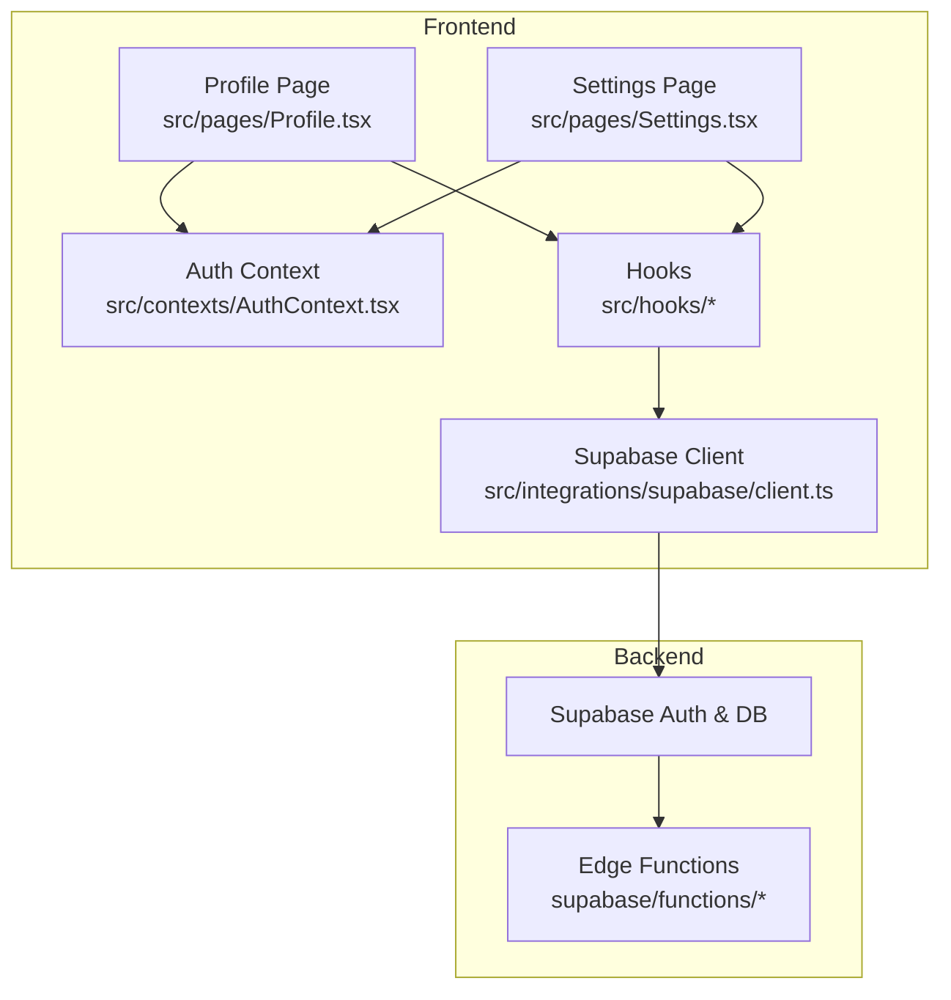
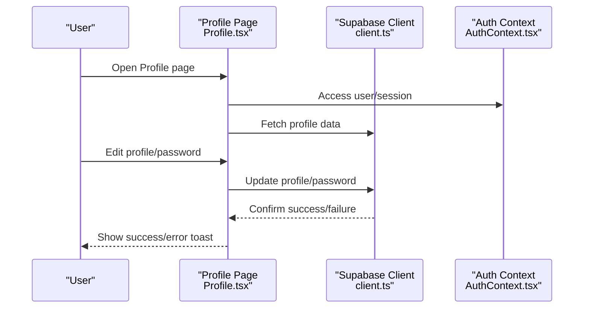
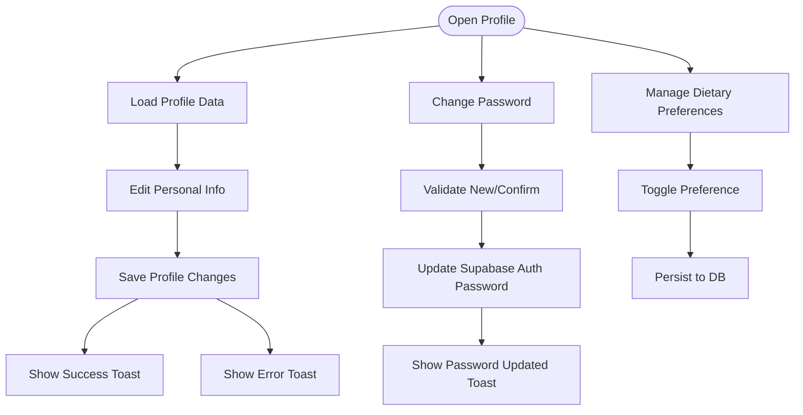
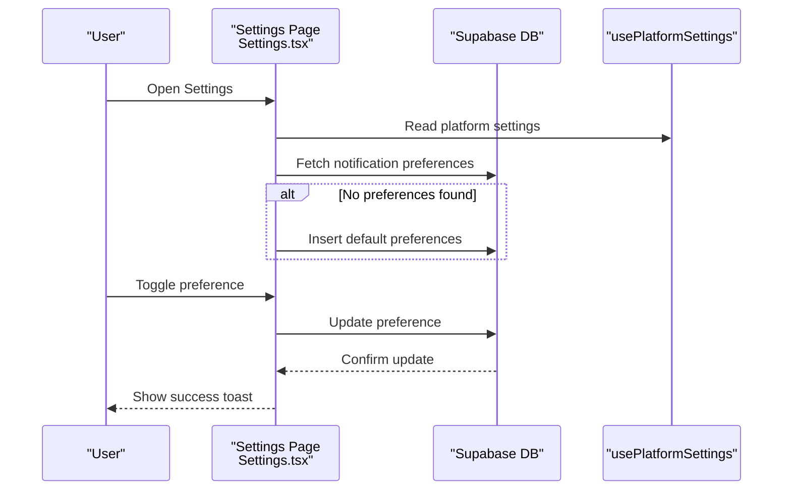
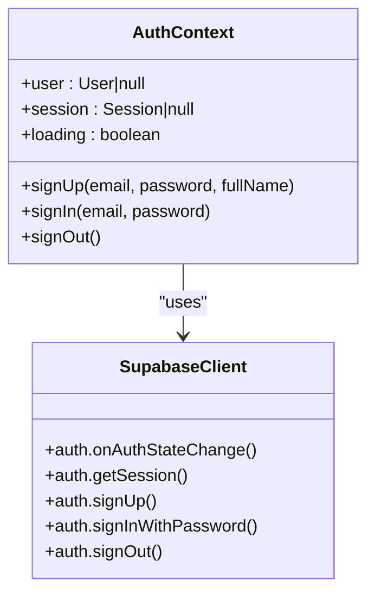
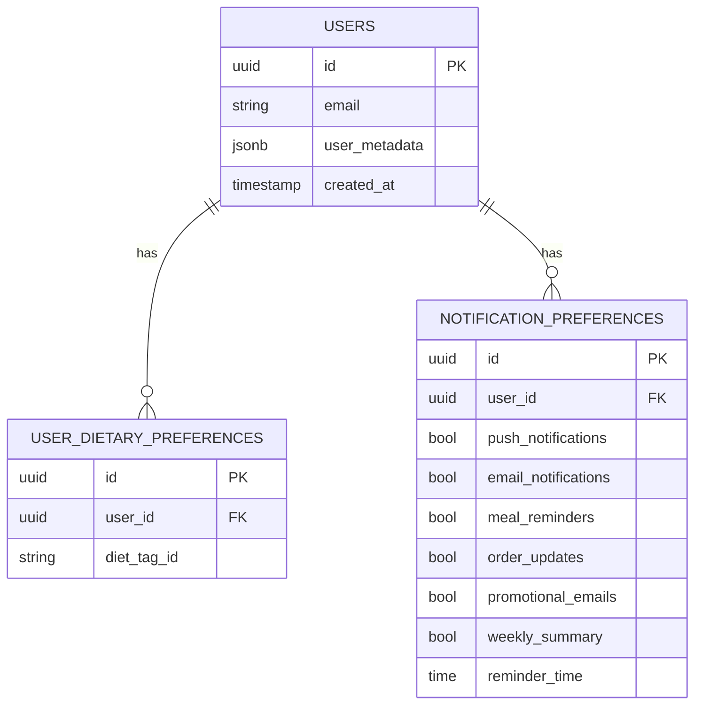
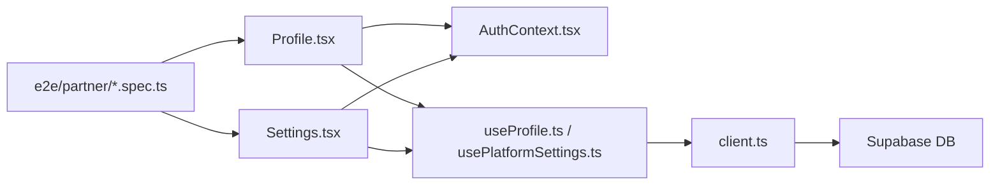

# Account & Profile Management

<cite>
**Referenced Files in This Document**
- [Profile.tsx](file://src/pages/Profile.tsx)
- [Settings.tsx](file://src/pages/Settings.tsx)
- [AuthContext.tsx](file://src/contexts/AuthContext.tsx)
- [useProfile.ts](file://src/hooks/useProfile.ts)
- [useSubscription.ts](file://src/hooks/useSubscription.ts)
- [usePlatformSettings.ts](file://src/hooks/usePlatformSettings.ts)
- [client.ts](file://src/integrations/supabase/client.ts)
- [types.ts](file://supabase/types.ts)
- [settings.spec.ts](file://e2e/partner/settings.spec.ts)
- [profile.spec.ts](file://e2e/partner/profile.spec.ts)
</cite>

## Table of Contents
1. [Introduction](#introduction)
2. [Project Structure](#project-structure)
3. [Core Components](#core-components)
4. [Architecture Overview](#architecture-overview)
5. [Detailed Component Analysis](#detailed-component-analysis)
6. [Dependency Analysis](#dependency-analysis)
7. [Performance Considerations](#performance-considerations)
8. [Troubleshooting Guide](#troubleshooting-guide)
9. [Conclusion](#conclusion)

## Introduction
This document explains how account and profile management works in the partner portal, covering profile updates, password changes, two-factor authentication setup, and notification preferences. It also documents the settings management system for business hours, contact information, and operational preferences, along with integration points to the authentication system, security features, audit logging, and compliance considerations. Practical examples and troubleshooting guidance are included to help maintain secure and compliant partner accounts.

## Project Structure
The partner portal account and profile management functionality is implemented primarily in:
- Profile page: user profile editing, password changes, and account actions
- Settings page: notification preferences, subscription management, and support links
- Authentication context: user session lifecycle and security integration
- Supabase integration: backend data access and authentication
- Hooks: reusable logic for profile, subscriptions, and platform settings
- End-to-end tests: automated verification of profile and settings features

**Diagram sources**
- [Profile.tsx:245-800](file://src/pages/Profile.tsx#L245-L800)
- [Settings.tsx:42-535](file://src/pages/Settings.tsx#L42-L535)
- [AuthContext.tsx:31-131](file://src/contexts/AuthContext.tsx#L31-L131)
- [client.ts](file://src/integrations/supabase/client.ts)

**Section sources**
- [Profile.tsx:245-800](file://src/pages/Profile.tsx#L245-L800)
- [Settings.tsx:42-535](file://src/pages/Settings.tsx#L42-L535)
- [AuthContext.tsx:31-131](file://src/contexts/AuthContext.tsx#L31-L131)

## Core Components
- Profile page: allows users to edit personal information, manage dietary preferences, upload avatars, change passwords, and perform account actions. It integrates with Supabase for authentication updates and local hooks for profile data.
- Settings page: manages notification preferences, subscription status, and provides quick links to support and FAQs. It initializes default notification preferences if none exist and persists updates to the database.
- Authentication context: manages user sessions, handles sign-in/sign-out, and integrates IP checks and push notification initialization on native platforms.
- Supabase integration: centralizes database queries and authentication operations for profile and settings data.
- Hooks: encapsulate profile retrieval/update, subscription state, and platform feature flags.

**Section sources**
- [Profile.tsx:245-800](file://src/pages/Profile.tsx#L245-L800)
- [Settings.tsx:42-535](file://src/pages/Settings.tsx#L42-L535)
- [AuthContext.tsx:31-131](file://src/contexts/AuthContext.tsx#L31-L131)
- [useProfile.ts](file://src/hooks/useProfile.ts)
- [useSubscription.ts](file://src/hooks/useSubscription.ts)
- [usePlatformSettings.ts](file://src/hooks/usePlatformSettings.ts)
- [client.ts](file://src/integrations/supabase/client.ts)

## Architecture Overview
The partner portal follows a React-based frontend with Supabase for authentication and data persistence. The authentication context listens for session changes and exposes sign-in/out capabilities. Profile and settings pages consume Supabase client methods and local hooks to manage user data and preferences.

**Diagram sources**
- [Profile.tsx:406-475](file://src/pages/Profile.tsx#L406-L475)
- [AuthContext.tsx:19-25](file://src/contexts/AuthContext.tsx#L19-L25)
- [client.ts](file://src/integrations/supabase/client.ts)

**Section sources**
- [Profile.tsx:406-475](file://src/pages/Profile.tsx#L406-L475)
- [AuthContext.tsx:31-131](file://src/contexts/AuthContext.tsx#L31-L131)

## Detailed Component Analysis

### Profile Management
The Profile page provides:
- Personal information editing (full name, gender, age)
- Avatar upload
- Dietary preferences management
- Password change workflow
- Account actions (sign out, delete account)

**Diagram sources**
- [Profile.tsx:406-475](file://src/pages/Profile.tsx#L406-L475)
- [Profile.tsx:323-362](file://src/pages/Profile.tsx#L323-L362)

**Section sources**
- [Profile.tsx:406-475](file://src/pages/Profile.tsx#L406-L475)
- [Profile.tsx:323-362](file://src/pages/Profile.tsx#L323-L362)

### Settings and Notification Preferences
The Settings page manages:
- Notification preferences (push/email, reminders, order updates, promotional emails, weekly summary)
- Subscription pause/resume when enabled by platform settings
- Platform feature flags and localized content

**Diagram sources**
- [Settings.tsx:61-109](file://src/pages/Settings.tsx#L61-L109)
- [Settings.tsx:111-140](file://src/pages/Settings.tsx#L111-L140)
- [usePlatformSettings.ts](file://src/hooks/usePlatformSettings.ts)

**Section sources**
- [Settings.tsx:61-140](file://src/pages/Settings.tsx#L61-L140)
- [Settings.tsx:313-470](file://src/pages/Settings.tsx#L313-L470)

### Authentication and Security Integration
The authentication context:
- Listens for auth state changes
- Provides sign-up, sign-in, and sign-out
- Integrates IP location checks before sign-in
- Initializes push notifications on native platforms

**Diagram sources**
- [AuthContext.tsx:8-25](file://src/contexts/AuthContext.tsx#L8-L25)
- [AuthContext.tsx:36-61](file://src/contexts/AuthContext.tsx#L36-L61)
- [AuthContext.tsx:63-118](file://src/contexts/AuthContext.tsx#L63-L118)

**Section sources**
- [AuthContext.tsx:36-118](file://src/contexts/AuthContext.tsx#L36-L118)

### Data Model and Persistence
Profile and settings data are persisted in Supabase tables:
- User profile and preferences
- Notification preferences
- Dietary preferences
- Subscription state and platform settings

**Diagram sources**
- [types.ts](file://supabase/types.ts)
- [Profile.tsx:327-356](file://src/pages/Profile.tsx#L327-L356)
- [Settings.tsx:68-96](file://src/pages/Settings.tsx#L68-L96)

**Section sources**
- [Profile.tsx:327-356](file://src/pages/Profile.tsx#L327-L356)
- [Settings.tsx:68-96](file://src/pages/Settings.tsx#L68-L96)
- [types.ts](file://supabase/types.ts)

## Dependency Analysis
- Profile and Settings pages depend on the Auth context for user/session state.
- Both pages rely on Supabase client for database operations and authentication updates.
- Hooks encapsulate domain-specific logic (profile, subscription, platform settings) to keep components lean.
- End-to-end tests validate key flows for profile and settings pages.

**Diagram sources**
- [Profile.tsx:245-800](file://src/pages/Profile.tsx#L245-L800)
- [Settings.tsx:42-535](file://src/pages/Settings.tsx#L42-L535)
- [AuthContext.tsx:31-131](file://src/contexts/AuthContext.tsx#L31-L131)
- [client.ts](file://src/integrations/supabase/client.ts)
- [settings.spec.ts:1-37](file://e2e/partner/settings.spec.ts#L1-L37)
- [profile.spec.ts:123-274](file://e2e/partner/profile.spec.ts#L123-L274)

**Section sources**
- [Profile.tsx:245-800](file://src/pages/Profile.tsx#L245-L800)
- [Settings.tsx:42-535](file://src/pages/Settings.tsx#L42-L535)
- [AuthContext.tsx:31-131](file://src/contexts/AuthContext.tsx#L31-L131)
- [client.ts](file://src/integrations/supabase/client.ts)
- [settings.spec.ts:1-37](file://e2e/partner/settings.spec.ts#L1-L37)
- [profile.spec.ts:123-274](file://e2e/partner/profile.spec.ts#L123-L274)

## Performance Considerations
- Minimize re-renders by consolidating form state and using controlled components.
- Debounce network requests for preference toggles to avoid excessive writes.
- Cache frequently accessed platform settings to reduce repeated queries.
- Lazy-load heavy components (e.g., wallet/payment) to improve initial page load.

## Troubleshooting Guide
Common issues and resolutions:
- Profile save fails: verify network connectivity and Supabase permissions; check toast messages for specific errors.
- Password change rejected: ensure new and confirm passwords match and meet minimum length requirements.
- Notification preferences not persisting: confirm the user ID is present and the preferences table exists; check for database errors.
- Authentication state not updating: verify auth state listener is active and Supabase session retrieval completes.
- IP-blocked sign-in attempts: review IP location check logic and ensure fallback behavior is acceptable.

**Section sources**
- [Profile.tsx:432-475](file://src/pages/Profile.tsx#L432-L475)
- [Settings.tsx:111-140](file://src/pages/Settings.tsx#L111-L140)
- [AuthContext.tsx:36-61](file://src/contexts/AuthContext.tsx#L36-L61)

## Conclusion
The partner portal’s account and profile management system integrates Supabase authentication and data persistence with React components and hooks to deliver a secure, responsive experience. The Profile and Settings pages provide essential controls for personal data, preferences, and account actions, while the Auth context ensures robust session handling and security integrations. End-to-end tests cover critical flows, and the modular architecture supports maintainability and scalability.