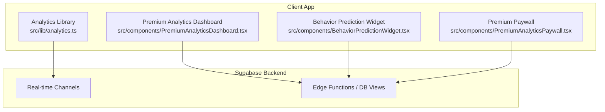
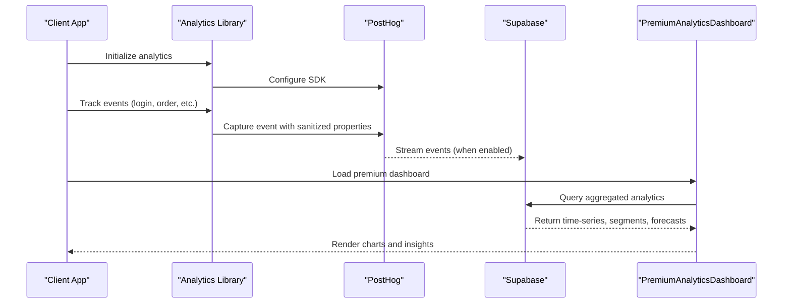
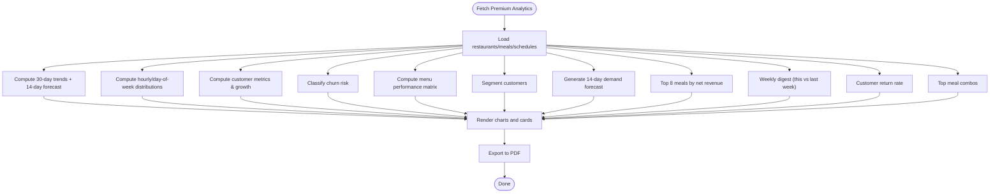
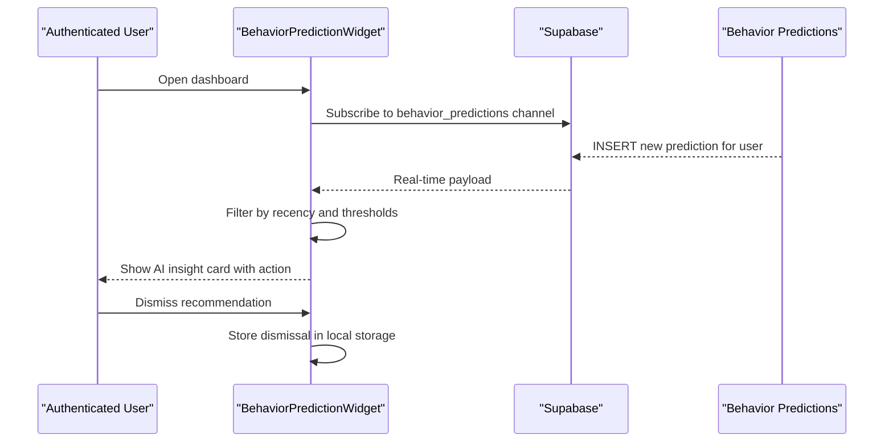
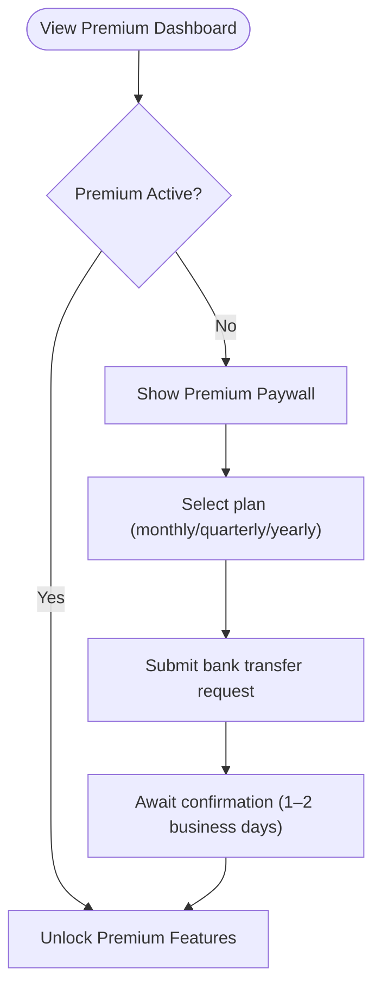
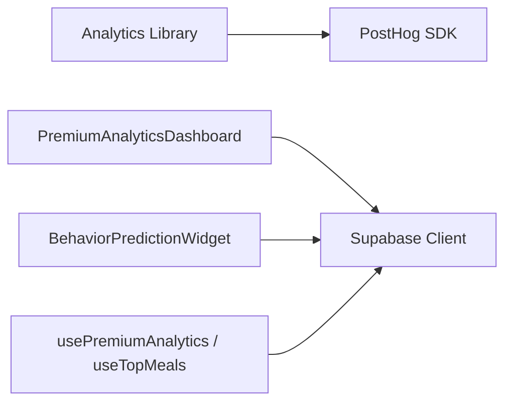

# Analytics & Business Insights

<cite>
**Referenced Files in This Document**
- [analytics.ts](file://src/lib/analytics.ts)
- [analytics.spec.ts](file://e2e/admin/analytics.spec.ts)
- [analytics.spec.ts](file://e2e/partner/analytics.spec.ts)
- [PremiumAnalyticsDashboard.tsx](file://src/components/PremiumAnalyticsDashboard.tsx)
- [PremiumAnalyticsPaywall.tsx](file://src/components/PremiumAnalyticsPaywall.tsx)
- [BehaviorPredictionWidget.tsx](file://src/components/BehaviorPredictionWidget.tsx)
- [usePremiumAnalytics.ts](file://src/hooks/usePremiumAnalytics.ts)
- [useTopMeals.ts](file://src/hooks/useTopMeals.ts)
</cite>

## Table of Contents
1. [Introduction](#introduction)
2. [Project Structure](#project-structure)
3. [Core Components](#core-components)
4. [Architecture Overview](#architecture-overview)
5. [Detailed Component Analysis](#detailed-component-analysis)
6. [Dependency Analysis](#dependency-analysis)
7. [Performance Considerations](#performance-considerations)
8. [Troubleshooting Guide](#troubleshooting-guide)
9. [Conclusion](#conclusion)

## Introduction
This document describes the analytics and business intelligence capabilities of the platform, focusing on:
- Sales reporting and revenue tracking
- Performance metrics dashboard
- Customer behavior analytics and churn detection
- Popular item tracking and seasonal trend analysis
- Premium analytics features, data visualization, and export capabilities
- Competitive benchmarking, market insights, and growth recommendations
- Integration with external analytics platforms and data privacy considerations

The system combines client-side analytics instrumentation, Supabase-backed dashboards, and real-time behavior predictions to deliver actionable insights for administrators, partners, and customers.

## Project Structure
The analytics features are implemented across three primary areas:
- Client-side analytics instrumentation for product usage tracking
- Premium analytics dashboard for partners with advanced KPIs, forecasting, and export
- Behavior prediction widget for personalized customer insights

**Diagram sources**
- [analytics.ts:1-170](file://src/lib/analytics.ts#L1-L170)
- [PremiumAnalyticsDashboard.tsx:1-1443](file://src/components/PremiumAnalyticsDashboard.tsx#L1-L1443)
- [BehaviorPredictionWidget.tsx:1-201](file://src/components/BehaviorPredictionWidget.tsx#L1-L201)
- [PremiumAnalyticsPaywall.tsx:1-441](file://src/components/PremiumAnalyticsPaywall.tsx#L1-L441)

**Section sources**
- [analytics.ts:1-170](file://src/lib/analytics.ts#L1-L170)
- [PremiumAnalyticsDashboard.tsx:1-1443](file://src/components/PremiumAnalyticsDashboard.tsx#L1-L1443)
- [BehaviorPredictionWidget.tsx:1-201](file://src/components/BehaviorPredictionWidget.tsx#L1-L201)
- [PremiumAnalyticsPaywall.tsx:1-441](file://src/components/PremiumAnalyticsPaywall.tsx#L1-L441)

## Core Components
- Analytics instrumentation library: Initializes and manages analytics events, user identification, and privacy controls.
- Premium analytics dashboard: Aggregates and visualizes advanced KPIs, forecasts, and exportable insights for partners.
- Behavior prediction widget: Delivers personalized AI-driven recommendations and churn/boredom risk signals to customers.
- Premium paywall: Manages subscription flow and feature gating for premium analytics.

**Section sources**
- [analytics.ts:1-170](file://src/lib/analytics.ts#L1-L170)
- [PremiumAnalyticsDashboard.tsx:1-1443](file://src/components/PremiumAnalyticsDashboard.tsx#L1-L1443)
- [BehaviorPredictionWidget.tsx:1-201](file://src/components/BehaviorPredictionWidget.tsx#L1-L201)
- [PremiumAnalyticsPaywall.tsx:1-441](file://src/components/PremiumAnalyticsPaywall.tsx#L1-L441)

## Architecture Overview
The analytics architecture integrates client-side event tracking with backend data aggregation and real-time updates.

**Diagram sources**
- [analytics.ts:1-170](file://src/lib/analytics.ts#L1-L170)
- [PremiumAnalyticsDashboard.tsx:180-526](file://src/components/PremiumAnalyticsDashboard.tsx#L180-L526)

## Detailed Component Analysis

### Analytics Instrumentation Library
The library initializes the analytics SDK, identifies users, sanitizes event properties, and exposes typed event helpers for common actions.

Key capabilities:
- Initialization with environment-specific configuration and opt-out in development
- User identification with traits and PII redaction
- Event capture with automatic property sanitization
- Predefined event helpers for sign-ups, logins, orders, subscriptions, and wallet top-ups
- Error tracking with context
- Feature flags for future A/B testing

Privacy and security:
- PII fields are automatically redacted from event properties
- Session recording masks inputs and sensitive fields
- Person profiles captured only for identified users
- Opt-out in development environments

**Section sources**
- [analytics.ts:1-170](file://src/lib/analytics.ts#L1-L170)

### Premium Analytics Dashboard
The dashboard aggregates 90 days of order history to compute:
- 30-day revenue trends and 14-day projections
- Hourly and day-of-week order distributions
- Customer metrics (repeat rate, average orders per customer)
- Growth metrics (revenue, orders, customers)
- Churn alert classification (at-risk, likely lost, lost)
- Menu performance matrix (Top Seller, High Value, Growing, Needs Attention)
- Customer segmentation (Champions, Loyal, At Risk, Inactive)
- 14-day demand forecast calendar
- Profitability report (top meals by net revenue)
- Weekly performance digest (this week vs last week)
- Customer return rate
- Meal combo patterns (cross-sell opportunities)

Data visualization:
- Line, bar, and area charts powered by reusable chart components
- Responsive containers for desktop and mobile
- Export to PDF with a comprehensive executive summary and report sections

Operational logic:
- Fetches restaurant, meals, and schedules from Supabase
- Computes medians for classification and projections
- Uses date range comparisons to derive growth and weekly deltas
- Generates actionable insights and recommendations

**Diagram sources**
- [PremiumAnalyticsDashboard.tsx:180-526](file://src/components/PremiumAnalyticsDashboard.tsx#L180-L526)

**Section sources**
- [PremiumAnalyticsDashboard.tsx:1-1443](file://src/components/PremiumAnalyticsDashboard.tsx#L1-L1443)

### Behavior Prediction Widget
The widget surfaces AI-driven insights for individual users:
- Displays churn risk, boredom risk, and engagement score
- Recommends personalized actions (e.g., personal outreach, bonus credit, cuisine exploration)
- Subscribes to real-time updates via Supabase channels
- Respects dismissal and shows predictions only for recent records

**Diagram sources**
- [BehaviorPredictionWidget.tsx:27-94](file://src/components/BehaviorPredictionWidget.tsx#L27-L94)

**Section sources**
- [BehaviorPredictionWidget.tsx:1-201](file://src/components/BehaviorPredictionWidget.tsx#L1-L201)

### Premium Analytics Paywall
The paywall enables partners to subscribe to premium analytics:
- Compares basic vs premium feature sets
- Presents monthly, quarterly, and yearly pricing
- Handles bank transfer submission and payment reference
- Provides blurred previews of premium insights

**Diagram sources**
- [PremiumAnalyticsPaywall.tsx:147-237](file://src/components/PremiumAnalyticsPaywall.tsx#L147-L237)
- [PremiumAnalyticsPaywall.tsx:354-436](file://src/components/PremiumAnalyticsPaywall.tsx#L354-L436)

**Section sources**
- [PremiumAnalyticsPaywall.tsx:1-441](file://src/components/PremiumAnalyticsPaywall.tsx#L1-L441)

### Test Coverage and Reporting
End-to-end tests validate analytics pages and export capabilities for admin and partner portals, ensuring:
- Revenue trends, retention metrics, peak hours, and export features are present
- Dedicated retention analytics page displays expected content

**Section sources**
- [analytics.spec.ts:1-158](file://e2e/admin/analytics.spec.ts#L1-L158)
- [analytics.spec.ts:1-158](file://e2e/partner/analytics.spec.ts#L1-L158)

## Dependency Analysis
- Analytics library depends on the PostHog SDK and environment variables for configuration.
- Premium dashboard queries Supabase for restaurant, meals, and schedules, then computes derived metrics and renders charts.
- Behavior prediction widget subscribes to Supabase real-time channels for personalized insights.
- Hooks support premium analytics pricing and top meals retrieval.

**Diagram sources**
- [analytics.ts:1-170](file://src/lib/analytics.ts#L1-L170)
- [PremiumAnalyticsDashboard.tsx:28-526](file://src/components/PremiumAnalyticsDashboard.tsx#L28-L526)
- [BehaviorPredictionWidget.tsx:14-60](file://src/components/BehaviorPredictionWidget.tsx#L14-L60)
- [usePremiumAnalytics.ts](file://src/hooks/usePremiumAnalytics.ts)
- [useTopMeals.ts](file://src/hooks/useTopMeals.ts)

**Section sources**
- [analytics.ts:1-170](file://src/lib/analytics.ts#L1-L170)
- [PremiumAnalyticsDashboard.tsx:1-1443](file://src/components/PremiumAnalyticsDashboard.tsx#L1-L1443)
- [BehaviorPredictionWidget.tsx:1-201](file://src/components/BehaviorPredictionWidget.tsx#L1-L201)
- [usePremiumAnalytics.ts](file://src/hooks/usePremiumAnalytics.ts)
- [useTopMeals.ts](file://src/hooks/useTopMeals.ts)

## Performance Considerations
- Dashboard computations operate on a 90-day window; ensure efficient date filtering and aggregation to minimize query cost.
- Use pagination and date-range boundaries to limit dataset size for charts.
- Debounce user interactions (e.g., date range selection) to reduce re-computation churn.
- Cache derived metrics where appropriate to avoid repeated calculations across tabs.

## Troubleshooting Guide
Common issues and resolutions:
- Analytics not capturing events:
  - Verify PostHog API key and host environment variables are set.
  - Confirm the SDK initialization runs only in production-like environments.
- Missing premium features:
  - Ensure the subscription record exists and is within the validity period.
  - Confirm the paywall dialog completes bank transfer submission and confirmation.
- Real-time behavior predictions not appearing:
  - Check Supabase channel subscription and user authentication state.
  - Ensure predictions are newer than the seven-day threshold and meet risk thresholds.
- Export failures:
  - Validate that the dashboard has loaded sufficient data before exporting.
  - Confirm browser supports printing and PDF generation.

**Section sources**
- [analytics.ts:3-35](file://src/lib/analytics.ts#L3-L35)
- [PremiumAnalyticsDashboard.tsx:528-536](file://src/components/PremiumAnalyticsDashboard.tsx#L528-L536)
- [BehaviorPredictionWidget.tsx:34-60](file://src/components/BehaviorPredictionWidget.tsx#L34-L60)
- [PremiumAnalyticsPaywall.tsx:179-213](file://src/components/PremiumAnalyticsPaywall.tsx#L179-L213)

## Conclusion
The analytics and business intelligence stack delivers a robust foundation for understanding sales performance, customer behavior, and operational trends. The combination of client-side instrumentation, backend aggregation, and real-time insights enables data-driven decision-making for administrators and partners, while the premium tier unlocks advanced forecasting, segmentation, and export capabilities. Privacy is embedded through automatic property sanitization and opt-out mechanisms, ensuring compliance and trust.