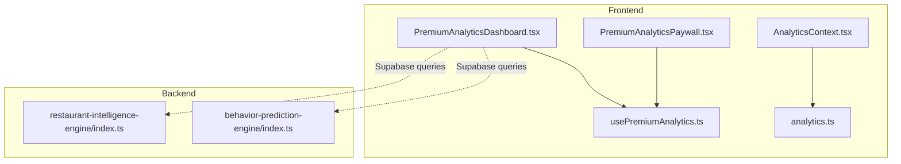
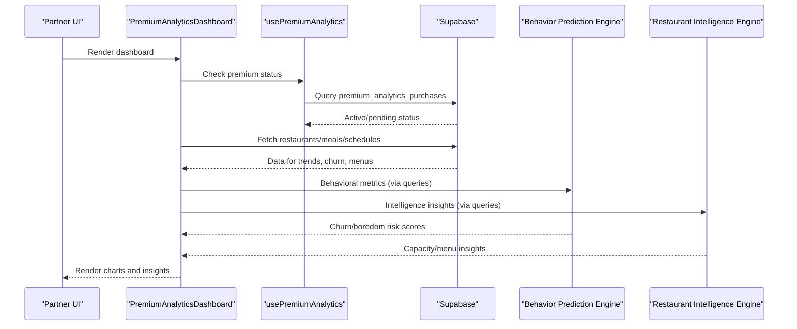
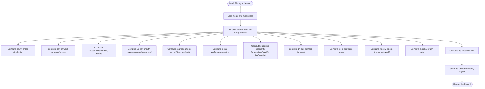
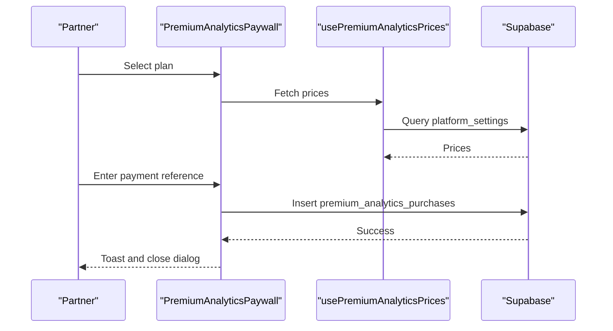
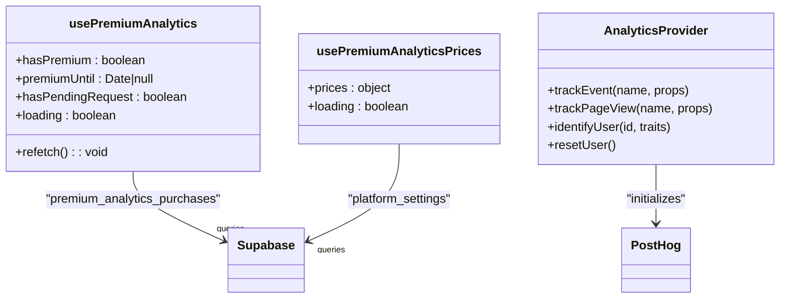
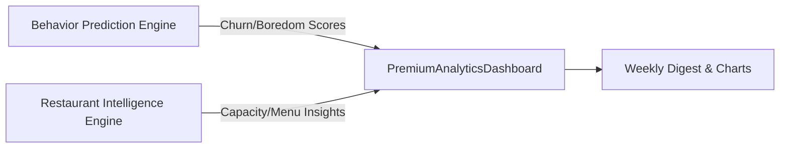
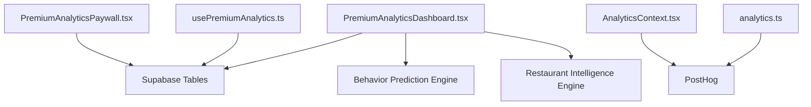

# Analytics & Reporting

<cite>
**Referenced Files in This Document**
- [PremiumAnalyticsDashboard.tsx](file://src/components/PremiumAnalyticsDashboard.tsx)
- [PremiumAnalyticsPaywall.tsx](file://src/components/PremiumAnalyticsPaywall.tsx)
- [usePremiumAnalytics.ts](file://src/hooks/usePremiumAnalytics.ts)
- [AnalyticsContext.tsx](file://src/contexts/AnalyticsContext.tsx)
- [analytics.ts](file://src/lib/analytics.ts)
- [analytics.spec.ts (partner)](file://e2e/partner/analytics.spec.ts)
- [analytics.spec.ts (admin)](file://e2e/admin/analytics.spec.ts)
- [behavior-prediction-engine/index.ts](file://supabase/functions/behavior-prediction-engine/index.ts)
- [restaurant-intelligence-engine/index.ts](file://supabase/functions/restaurant-intelligence-engine/index.ts)
</cite>

## Table of Contents
1. [Introduction](#introduction)
2. [Project Structure](#project-structure)
3. [Core Components](#core-components)
4. [Architecture Overview](#architecture-overview)
5. [Detailed Component Analysis](#detailed-component-analysis)
6. [Dependency Analysis](#dependency-analysis)
7. [Performance Considerations](#performance-considerations)
8. [Troubleshooting Guide](#troubleshooting-guide)
9. [Conclusion](#conclusion)
10. [Appendices](#appendices)

## Introduction
This document explains the analytics and reporting system in the partner portal, focusing on sales performance metrics, revenue tracking, customer behavior insights, and menu popularity analysis. It documents premium analytics features, including advanced reporting capabilities, data visualization tools, and the paywall system for unlocking premium insights. It also covers integration touchpoints with Supabase-backed functions that power behavioral predictions and restaurant intelligence, and outlines practical examples for generating reports, interpreting analytics data, and making data-driven decisions.

## Project Structure
The analytics system spans frontend components, hooks, and analytics libraries, plus backend Supabase functions that produce predictive insights and intelligence reports. The key areas are:
- Premium analytics dashboard and paywall UI
- Analytics hooks and provider for event tracking
- Supabase functions for behavior and restaurant intelligence
- End-to-end tests validating analytics pages

**Diagram sources**
- [PremiumAnalyticsDashboard.tsx:147-183](file://src/components/PremiumAnalyticsDashboard.tsx#L147-L183)
- [PremiumAnalyticsPaywall.tsx:147-177](file://src/components/PremiumAnalyticsPaywall.tsx#L147-L177)
- [usePremiumAnalytics.ts:16-81](file://src/hooks/usePremiumAnalytics.ts#L16-L81)
- [AnalyticsContext.tsx:22-38](file://src/contexts/AnalyticsContext.tsx#L22-L38)
- [analytics.ts:3-35](file://src/lib/analytics.ts#L3-L35)
- [behavior-prediction-engine/index.ts:43-75](file://supabase/functions/behavior-prediction-engine/index.ts#L43-L75)
- [restaurant-intelligence-engine/index.ts:86-125](file://supabase/functions/restaurant-intelligence-engine/index.ts#L86-L125)

**Section sources**
- [PremiumAnalyticsDashboard.tsx:147-183](file://src/components/PremiumAnalyticsDashboard.tsx#L147-L183)
- [PremiumAnalyticsPaywall.tsx:147-177](file://src/components/PremiumAnalyticsPaywall.tsx#L147-L177)
- [usePremiumAnalytics.ts:16-81](file://src/hooks/usePremiumAnalytics.ts#L16-L81)
- [AnalyticsContext.tsx:22-38](file://src/contexts/AnalyticsContext.tsx#L22-L38)
- [analytics.ts:3-35](file://src/lib/analytics.ts#L3-L35)
- [behavior-prediction-engine/index.ts:43-75](file://supabase/functions/behavior-prediction-engine/index.ts#L43-L75)
- [restaurant-intelligence-engine/index.ts:86-125](file://supabase/functions/restaurant-intelligence-engine/index.ts#L86-L125)

## Core Components
- Premium Analytics Dashboard: Aggregates and visualizes sales trends, customer behavior, menu performance, churn risk, profitability, demand forecasting, and combo patterns. It computes growth metrics, churn segments, customer segmentation, and generates a printable weekly digest.
- Premium Analytics Paywall: Manages subscription requests, displays pricing tiers, and handles bank transfer submission with payment references.
- Premium Analytics Hooks: Provide subscription status checks, pricing retrieval, and loading states for premium features.
- Analytics Provider and Library: Initializes PostHog, tracks events and page views, and sanitizes sensitive properties.

**Section sources**
- [PremiumAnalyticsDashboard.tsx:147-526](file://src/components/PremiumAnalyticsDashboard.tsx#L147-L526)
- [PremiumAnalyticsPaywall.tsx:147-213](file://src/components/PremiumAnalyticsPaywall.tsx#L147-L213)
- [usePremiumAnalytics.ts:16-117](file://src/hooks/usePremiumAnalytics.ts#L16-L117)
- [AnalyticsContext.tsx:22-60](file://src/contexts/AnalyticsContext.tsx#L22-L60)
- [analytics.ts:3-170](file://src/lib/analytics.ts#L3-L170)

## Architecture Overview
The system integrates frontend analytics dashboards with Supabase-backed functions to enrich insights. The dashboard pulls data from Supabase tables (restaurants, meals, meal_schedules) and computes derived metrics. Premium features are gated by a paywall that records purchase requests and defers activation until payment confirmation. Analytics events are captured via PostHog for product usage insights.

**Diagram sources**
- [PremiumAnalyticsDashboard.tsx:185-526](file://src/components/PremiumAnalyticsDashboard.tsx#L185-L526)
- [usePremiumAnalytics.ts:30-78](file://src/hooks/usePremiumAnalytics.ts#L30-L78)
- [behavior-prediction-engine/index.ts:43-75](file://supabase/functions/behavior-prediction-engine/index.ts#L43-L75)
- [restaurant-intelligence-engine/index.ts:86-125](file://supabase/functions/restaurant-intelligence-engine/index.ts#L86-L125)

## Detailed Component Analysis

### Premium Analytics Dashboard
The dashboard compiles:
- Sales trends: 30-day revenue and order counts, extended with 14-day projections.
- Customer behavior: repeat rates, weekly performance delta, return rate, and churn segments.
- Menu performance: classification matrix (Top Seller, High Value, Growing, Needs Attention) and top profitability.
- Demand forecasting: 14-day calendar with predicted order volumes by day-of-week.
- Business insights: combo patterns for cross-sell opportunities and a printable weekly digest.

**Diagram sources**
- [PremiumAnalyticsDashboard.tsx:185-526](file://src/components/PremiumAnalyticsDashboard.tsx#L185-L526)

**Section sources**
- [PremiumAnalyticsDashboard.tsx:185-526](file://src/components/PremiumAnalyticsDashboard.tsx#L185-L526)

### Premium Analytics Paywall
The paywall:
- Displays feature comparison between Basic and Premium.
- Presents monthly, quarterly, and yearly pricing tiers with calculated savings.
- Collects payment reference and submits a purchase request to Supabase.
- Handles pending state and provides bank transfer instructions.

**Diagram sources**
- [PremiumAnalyticsPaywall.tsx:179-213](file://src/components/PremiumAnalyticsPaywall.tsx#L179-L213)
- [usePremiumAnalytics.ts:83-117](file://src/hooks/usePremiumAnalytics.ts#L83-L117)

**Section sources**
- [PremiumAnalyticsPaywall.tsx:147-213](file://src/components/PremiumAnalyticsPaywall.tsx#L147-L213)
- [usePremiumAnalytics.ts:83-117](file://src/hooks/usePremiumAnalytics.ts#L83-L117)

### Analytics Hooks and Provider
- usePremiumAnalytics: Checks active/pending premium status and fallback legacy column, exposes loading and refetch.
- usePremiumAnalyticsPrices: Loads pricing tiers from platform_settings.
- AnalyticsContext + analytics.ts: Initialize PostHog, identify users, track events and page views, sanitize properties, and expose helper functions.

**Diagram sources**
- [usePremiumAnalytics.ts:16-117](file://src/hooks/usePremiumAnalytics.ts#L16-L117)
- [AnalyticsContext.tsx:22-60](file://src/contexts/AnalyticsContext.tsx#L22-L60)
- [analytics.ts:3-170](file://src/lib/analytics.ts#L3-L170)

**Section sources**
- [usePremiumAnalytics.ts:16-117](file://src/hooks/usePremiumAnalytics.ts#L16-L117)
- [AnalyticsContext.tsx:22-60](file://src/contexts/AnalyticsContext.tsx#L22-L60)
- [analytics.ts:3-170](file://src/lib/analytics.ts#L3-L170)

### Supabase Functions for Insights
- Behavior Prediction Engine: Computes churn and boredom risk scores from user behavior metrics (ordering frequency, skip rate, diversity, app opens).
- Restaurant Intelligence Engine: Generates insights around capacity utilization, menu diversification, and peak hours.

**Diagram sources**
- [behavior-prediction-engine/index.ts:43-75](file://supabase/functions/behavior-prediction-engine/index.ts#L43-L75)
- [restaurant-intelligence-engine/index.ts:86-125](file://supabase/functions/restaurant-intelligence-engine/index.ts#L86-L125)
- [PremiumAnalyticsDashboard.tsx:185-526](file://src/components/PremiumAnalyticsDashboard.tsx#L185-L526)

**Section sources**
- [behavior-prediction-engine/index.ts:43-75](file://supabase/functions/behavior-prediction-engine/index.ts#L43-L75)
- [restaurant-intelligence-engine/index.ts:86-125](file://supabase/functions/restaurant-intelligence-engine/index.ts#L86-L125)

## Dependency Analysis
- Frontend depends on Supabase for data and on PostHog for analytics.
- Premium features depend on platform_settings for pricing and premium_analytics_purchases for status.
- Backend functions provide complementary insights consumed by the dashboard.

**Diagram sources**
- [PremiumAnalyticsDashboard.tsx:185-526](file://src/components/PremiumAnalyticsDashboard.tsx#L185-L526)
- [PremiumAnalyticsPaywall.tsx:179-213](file://src/components/PremiumAnalyticsPaywall.tsx#L179-L213)
- [usePremiumAnalytics.ts:30-78](file://src/hooks/usePremiumAnalytics.ts#L30-L78)
- [AnalyticsContext.tsx:22-38](file://src/contexts/AnalyticsContext.tsx#L22-L38)
- [analytics.ts:3-35](file://src/lib/analytics.ts#L3-L35)
- [behavior-prediction-engine/index.ts:43-75](file://supabase/functions/behavior-prediction-engine/index.ts#L43-L75)
- [restaurant-intelligence-engine/index.ts:86-125](file://supabase/functions/restaurant-intelligence-engine/index.ts#L86-L125)

**Section sources**
- [PremiumAnalyticsDashboard.tsx:185-526](file://src/components/PremiumAnalyticsDashboard.tsx#L185-L526)
- [PremiumAnalyticsPaywall.tsx:179-213](file://src/components/PremiumAnalyticsPaywall.tsx#L179-L213)
- [usePremiumAnalytics.ts:30-78](file://src/hooks/usePremiumAnalytics.ts#L30-L78)
- [AnalyticsContext.tsx:22-38](file://src/contexts/AnalyticsContext.tsx#L22-L38)
- [analytics.ts:3-35](file://src/lib/analytics.ts#L3-L35)

## Performance Considerations
- Dashboard computations operate over a 90-day window; ensure efficient filtering and aggregation to minimize payload size.
- Forecasting uses simple averaging; consider seasonality adjustments for improved accuracy.
- Rendering many charts can be expensive; defer non-critical visualizations until after initial data loads.
- PostHog initialization is disabled in development to reduce overhead.

[No sources needed since this section provides general guidance]

## Troubleshooting Guide
- Premium status not activating:
  - Confirm purchase request exists with active status and future ends_at.
  - Check fallback legacy column if present.
- Pricing not loading:
  - Verify platform_settings record for premium analytics prices.
- Purchase submission fails:
  - Ensure payment reference is recorded and Supabase insert succeeds.
- Analytics events not appearing:
  - Confirm PostHog API key and host are configured; verify environment is production.

**Section sources**
- [usePremiumAnalytics.ts:30-78](file://src/hooks/usePremiumAnalytics.ts#L30-L78)
- [PremiumAnalyticsPaywall.tsx:179-213](file://src/components/PremiumAnalyticsPaywall.tsx#L179-L213)
- [analytics.ts:3-35](file://src/lib/analytics.ts#L3-L35)

## Conclusion
The partner portal’s analytics and reporting system combines robust frontend dashboards with Supabase-backed insights to deliver actionable intelligence. Premium features unlock advanced visualizations, forecasts, and behavioral signals, while the paywall streamlines subscription management. Together, these components enable data-driven decisions around sales, customer retention, menu optimization, and operational planning.

[No sources needed since this section summarizes without analyzing specific files]

## Appendices

### Practical Examples

- Generating a Premium Report
  - Navigate to the Premium Analytics dashboard, review the weekly digest, and export the printable report for sharing with stakeholders.
  - Reference: [PremiumAnalyticsDashboard.tsx:528-526](file://src/components/PremiumAnalyticsDashboard.tsx#L528-L526)

- Interpreting Churn Alerts
  - Use churn segments to prioritize re-engagement campaigns. “At Risk” customers can be targeted with small incentives; “Lost” require direct outreach.
  - Reference: [PremiumAnalyticsDashboard.tsx:328-345](file://src/components/PremiumAnalyticsDashboard.tsx#L328-L345)

- Making Menu Decisions
  - Promote “Top Seller” items, maintain “High Value” items, feature “Growing” items, and consider removing “Needs Attention” items.
  - Reference: [PremiumAnalyticsDashboard.tsx:347-369](file://src/components/PremiumAnalyticsDashboard.tsx#L347-L369)

- Optimizing Demand
  - Align staffing and inventory with the 14-day demand forecast calendar to manage high-volume days.
  - Reference: [PremiumAnalyticsDashboard.tsx:396-435](file://src/components/PremiumAnalyticsDashboard.tsx#L396-L435)

- Unlocking Premium Features
  - Choose a plan, submit a bank transfer with the provided reference, and wait for confirmation to activate premium analytics.
  - Reference: [PremiumAnalyticsPaywall.tsx:179-213](file://src/components/PremiumAnalyticsPaywall.tsx#L179-L213), [usePremiumAnalytics.ts:83-117](file://src/hooks/usePremiumAnalytics.ts#L83-L117)

### Testing Coverage
- End-to-end tests validate analytics and reviews pages for both partner and admin portals.
- Reference: [analytics.spec.ts (partner):8-157](file://e2e/partner/analytics.spec.ts#L8-L157), [analytics.spec.ts (admin):8-157](file://e2e/admin/analytics.spec.ts#L8-L157)