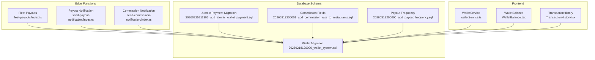
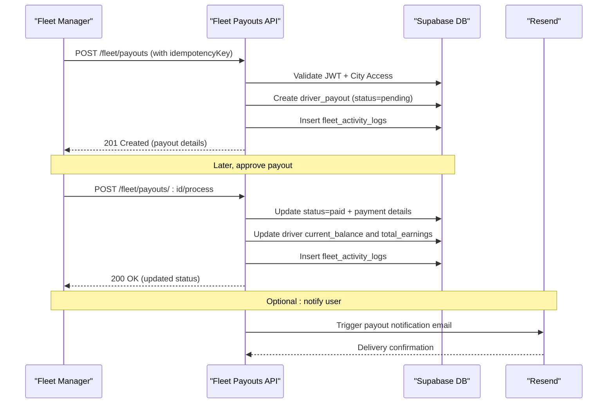
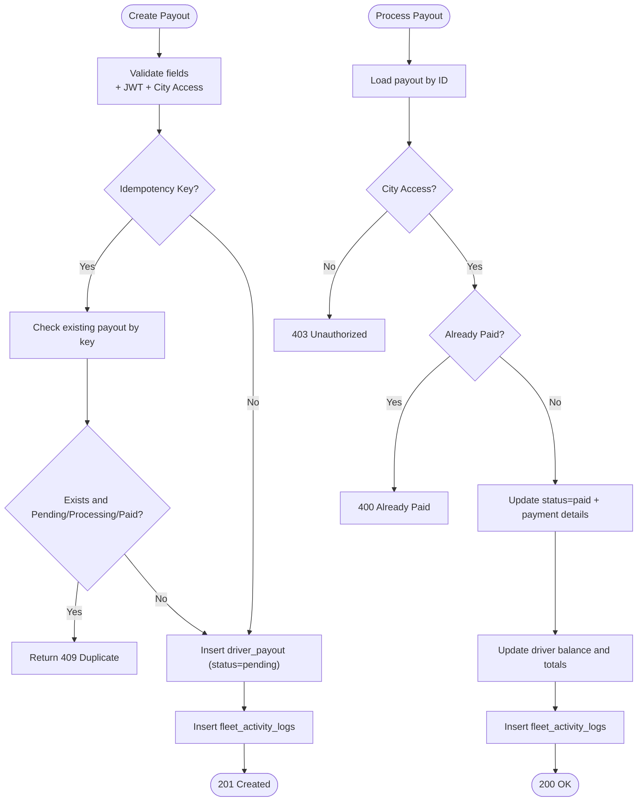
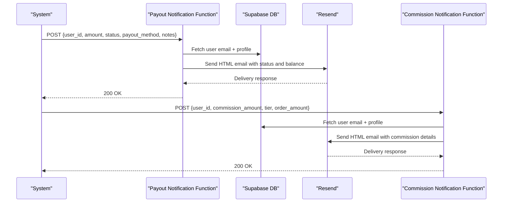
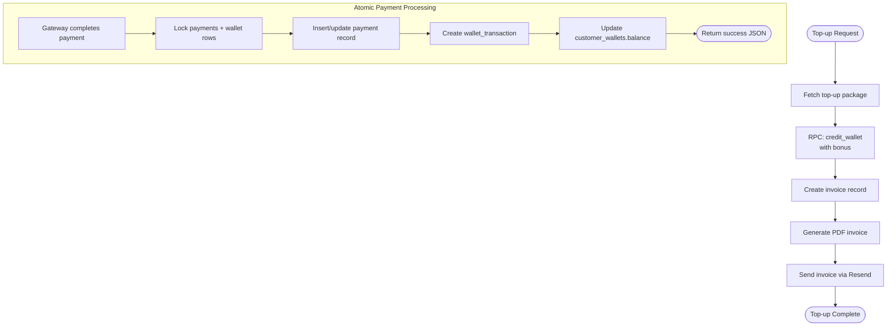
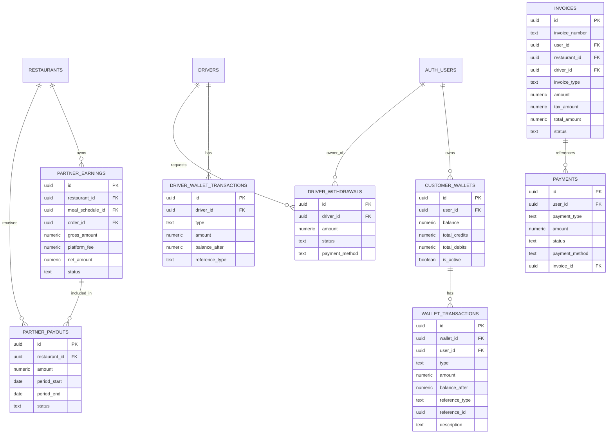
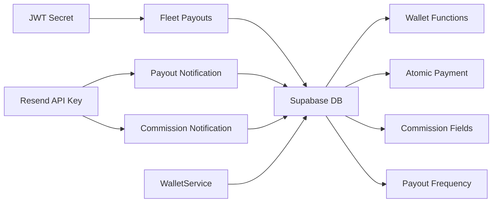

# Commission & Payout Management

<cite>
**Referenced Files in This Document**
- [fleet-payouts/index.ts](file://supabase/functions/fleet-payouts/index.ts)
- [send-payout-notification/index.ts](file://supabase/functions/send-payout-notification/index.ts)
- [send-commission-notification/index.ts](file://supabase/functions/send-commission-notification/index.ts)
- [20260313200000_add_payout_frequency.sql](file://supabase/migrations/20260313200000_add_payout_frequency.sql)
- [20260313200001_add_commission_rate_to_restaurants.sql](file://supabase/migrations/20260313200001_add_commission_rate_to_restaurants.sql)
- [walletService.ts](file://src/services/walletService.ts)
- [WalletBalance.tsx](file://src/components/wallet/WalletBalance.tsx)
- [TransactionHistory.tsx](file://src/components/wallet/TransactionHistory.tsx)
- [20260218120000_wallet_system.sql](file://supabase/migrations/20260218120000_wallet_system.sql)
- [20260225211305_add_atomic_wallet_payment.sql](file://supabase/migrations/20260225211305_add_atomic_wallet_payment.sql)
</cite>

## Table of Contents
1. [Introduction](#introduction)
2. [Project Structure](#project-structure)
3. [Core Components](#core-components)
4. [Architecture Overview](#architecture-overview)
5. [Detailed Component Analysis](#detailed-component-analysis)
6. [Dependency Analysis](#dependency-analysis)
7. [Performance Considerations](#performance-considerations)
8. [Troubleshooting Guide](#troubleshooting-guide)
9. [Conclusion](#conclusion)

## Introduction
This document describes the commission calculation and payout management system across three primary domains:
- Driver fleet payouts (including batch processing and city-scoped access control)
- Affiliate/partner commission notifications and payout requests
- Customer wallet system with top-ups, transactions, and atomic payment processing

It explains the commission structure, rate calculations, earnings tracking, payout scheduling, transfer processing, balance management, integration with payment processors, tax reporting, financial documentation, payout history, statement generation, dispute resolution, wallet system integration, and transaction tracking.

## Project Structure
The system spans Supabase edge functions, database migrations, and frontend components:
- Edge functions handle fleet payout operations, affiliate/partner notifications, and payment processing
- Migrations define wallet, driver withdrawal, partner earnings/payouts, and invoice schemas
- Frontend components visualize wallet balance and transaction history

**Diagram sources**
- [fleet-payouts/index.ts:1-610](file://supabase/functions/fleet-payouts/index.ts#L1-L610)
- [send-payout-notification/index.ts:1-176](file://supabase/functions/send-payout-notification/index.ts#L1-L176)
- [send-commission-notification/index.ts:1-163](file://supabase/functions/send-commission-notification/index.ts#L1-L163)
- [20260218120000_wallet_system.sql:1-710](file://supabase/migrations/20260218120000_wallet_system.sql#L1-L710)
- [20260225211305_add_atomic_wallet_payment.sql:1-399](file://supabase/migrations/20260225211305_add_atomic_wallet_payment.sql#L1-L399)
- [20260313200001_add_commission_rate_to_restaurants.sql:1-11](file://supabase/migrations/20260313200001_add_commission_rate_to_restaurants.sql#L1-L11)
- [20260313200000_add_payout_frequency.sql:1-4](file://supabase/migrations/20260313200000_add_payout_frequency.sql#L1-L4)
- [walletService.ts:1-180](file://src/services/walletService.ts#L1-L180)
- [WalletBalance.tsx:1-70](file://src/components/wallet/WalletBalance.tsx#L1-L70)
- [TransactionHistory.tsx:1-162](file://src/components/wallet/TransactionHistory.tsx#L1-L162)

**Section sources**
- [fleet-payouts/index.ts:1-610](file://supabase/functions/fleet-payouts/index.ts#L1-L610)
- [send-payout-notification/index.ts:1-176](file://supabase/functions/send-payout-notification/index.ts#L1-L176)
- [send-commission-notification/index.ts:1-163](file://supabase/functions/send-commission-notification/index.ts#L1-L163)
- [20260218120000_wallet_system.sql:1-710](file://supabase/migrations/20260218120000_wallet_system.sql#L1-L710)
- [20260225211305_add_atomic_wallet_payment.sql:1-399](file://supabase/migrations/20260225211305_add_atomic_wallet_payment.sql#L1-L399)
- [20260313200001_add_commission_rate_to_restaurants.sql:1-11](file://supabase/migrations/20260313200001_add_commission_rate_to_restaurants.sql#L1-L11)
- [20260313200000_add_payout_frequency.sql:1-4](file://supabase/migrations/20260313200000_add_payout_frequency.sql#L1-L4)
- [walletService.ts:1-180](file://src/services/walletService.ts#L1-L180)
- [WalletBalance.tsx:1-70](file://src/components/wallet/WalletBalance.tsx#L1-L70)
- [TransactionHistory.tsx:1-162](file://src/components/wallet/TransactionHistory.tsx#L1-L162)

## Core Components
- Fleet Payouts API: Manages driver payouts with JWT authentication, city-scoped access control, idempotent creation, and batch processing
- Notification Functions: Send email notifications for affiliate/partner payouts and commission earnings
- Wallet System: Provides customer wallet top-ups, atomic payment processing, transaction history, and invoice generation
- Data Model: Defines driver withdrawals, partner earnings/payouts, invoices, and payment records

Key capabilities:
- Commission structure: Platform commission rates per restaurant and tiered affiliate commissions
- Payout scheduling: Configurable frequency for restaurant payouts
- Transfer processing: Atomic wallet crediting and payment reconciliation
- Balance management: Real-time balance updates and transaction logs
- Financial documentation: Invoices and statements for all transaction types
- Dispute resolution: Audit trails and error logging for failed payments

**Section sources**
- [fleet-payouts/index.ts:19-610](file://supabase/functions/fleet-payouts/index.ts#L19-L610)
- [send-payout-notification/index.ts:12-176](file://supabase/functions/send-payout-notification/index.ts#L12-L176)
- [send-commission-notification/index.ts:12-163](file://supabase/functions/send-commission-notification/index.ts#L12-L163)
- [20260218120000_wallet_system.sql:8-710](file://supabase/migrations/20260218120000_wallet_system.sql#L8-L710)
- [20260225211305_add_atomic_wallet_payment.sql:17-399](file://supabase/migrations/20260225211305_add_atomic_wallet_payment.sql#L17-L399)

## Architecture Overview
The system integrates edge functions, Supabase RLS, and frontend components to provide secure, auditable financial operations.

**Diagram sources**
- [fleet-payouts/index.ts:186-428](file://supabase/functions/fleet-payouts/index.ts#L186-L428)
- [send-payout-notification/index.ts:20-176](file://supabase/functions/send-payout-notification/index.ts#L20-L176)

## Detailed Component Analysis

### Fleet Payout Management
The fleet payout system supports:
- Listing payouts with filters (driver, status, date range) and pagination
- Creating payouts with idempotency keys to prevent duplicates
- Processing payouts (mark as paid) with city access checks
- Bulk payout creation for eligible drivers in a city

**Diagram sources**
- [fleet-payouts/index.ts:186-428](file://supabase/functions/fleet-payouts/index.ts#L186-L428)

**Section sources**
- [fleet-payouts/index.ts:56-184](file://supabase/functions/fleet-payouts/index.ts#L56-L184)
- [fleet-payouts/index.ts:186-315](file://supabase/functions/fleet-payouts/index.ts#L186-L315)
- [fleet-payouts/index.ts:317-428](file://supabase/functions/fleet-payouts/index.ts#L317-L428)
- [fleet-payouts/index.ts:430-558](file://supabase/functions/fleet-payouts/index.ts#L430-L558)

### Commission Calculation and Notifications
Two edge functions handle notifications:
- Affiliate/partner payout notifications
- Commission earnings notifications

**Diagram sources**
- [send-payout-notification/index.ts:20-176](file://supabase/functions/send-payout-notification/index.ts#L20-L176)
- [send-commission-notification/index.ts:19-163](file://supabase/functions/send-commission-notification/index.ts#L19-L163)

**Section sources**
- [send-payout-notification/index.ts:12-176](file://supabase/functions/send-payout-notification/index.ts#L12-L176)
- [send-commission-notification/index.ts:12-163](file://supabase/functions/send-commission-notification/index.ts#L12-L163)

### Wallet System and Atomic Payments
The wallet system provides:
- Customer wallet creation and balance tracking
- Top-up packages with bonus amounts
- Atomic payment processing to avoid race conditions
- Transaction history with multiple types (credit, debit, refund, bonus, cashback)
- Invoice generation for wallet top-ups

**Diagram sources**
- [walletService.ts:13-137](file://src/services/walletService.ts#L13-L137)
- [20260218120000_wallet_system.sql:116-217](file://supabase/migrations/20260218120000_wallet_system.sql#L116-L217)
- [20260225211305_add_atomic_wallet_payment.sql:17-190](file://supabase/migrations/20260225211305_add_atomic_wallet_payment.sql#L17-L190)

**Section sources**
- [walletService.ts:13-137](file://src/services/walletService.ts#L13-L137)
- [WalletBalance.tsx:13-70](file://src/components/wallet/WalletBalance.tsx#L13-L70)
- [TransactionHistory.tsx:57-162](file://src/components/wallet/TransactionHistory.tsx#L57-L162)
- [20260218120000_wallet_system.sql:8-710](file://supabase/migrations/20260218120000_wallet_system.sql#L8-L710)
- [20260225211305_add_atomic_wallet_payment.sql:17-399](file://supabase/migrations/20260225211305_add_atomic_wallet_payment.sql#L17-L399)

### Data Model Overview
Core tables and relationships:
- customer_wallets and wallet_transactions for customer wallet
- driver_withdrawals and driver_wallet_transactions for driver payouts
- partner_earnings and partner_payouts for restaurant/partner payouts
- invoices and payments for financial documentation and payment records

**Diagram sources**
- [20260218120000_wallet_system.sql:8-710](file://supabase/migrations/20260218120000_wallet_system.sql#L8-L710)

**Section sources**
- [20260218120000_wallet_system.sql:8-710](file://supabase/migrations/20260218120000_wallet_system.sql#L8-L710)

## Dependency Analysis
- Edge functions depend on Supabase client libraries and environment variables for JWT secrets and Resend API keys
- Wallet operations rely on Postgres functions for atomicity and RLS policies for security
- Frontend components depend on Supabase client and currency formatting utilities

**Diagram sources**
- [fleet-payouts/index.ts:8-36](file://supabase/functions/fleet-payouts/index.ts#L8-L36)
- [send-payout-notification/index.ts:5-10](file://supabase/functions/send-payout-notification/index.ts#L5-L10)
- [send-commission-notification/index.ts:5-10](file://supabase/functions/send-commission-notification/index.ts#L5-L10)
- [walletService.ts:1-5](file://src/services/walletService.ts#L1-L5)

**Section sources**
- [fleet-payouts/index.ts:8-36](file://supabase/functions/fleet-payouts/index.ts#L8-L36)
- [send-payout-notification/index.ts:5-10](file://supabase/functions/send-payout-notification/index.ts#L5-L10)
- [send-commission-notification/index.ts:5-10](file://supabase/functions/send-commission-notification/index.ts#L5-L10)
- [walletService.ts:1-5](file://src/services/walletService.ts#L1-L5)

## Performance Considerations
- Idempotency keys prevent duplicate payouts and reduce retries
- Row-level locks in atomic payment processing minimize race conditions
- Indexes on frequently queried columns (status, created_at, references) improve query performance
- Pagination limits protect against large result sets
- Background auto-retry for failed payments reduces manual intervention

[No sources needed since this section provides general guidance]

## Troubleshooting Guide
Common issues and resolutions:
- Duplicate payout creation: Use idempotencyKey; function returns conflict if existing pending/processing/paid
- Unauthorized city access: Ensure manager role and assigned city match driver’s city
- Insufficient driver balance: Verify current_balance before bulk payout creation
- Payment processing failures: Check payment_processing_errors table; use retry_failed_payment or reconcile_wallet_credits
- Email delivery failures: Confirm Resend API key and user email availability

**Section sources**
- [fleet-payouts/index.ts:231-247](file://supabase/functions/fleet-payouts/index.ts#L231-L247)
- [20260225211305_add_atomic_wallet_payment.sql:201-231](file://supabase/migrations/20260225211305_add_atomic_wallet_payment.sql#L201-L231)
- [20260225211305_add_atomic_wallet_payment.sql:232-286](file://supabase/migrations/20260225211305_add_atomic_wallet_payment.sql#L232-L286)
- [20260225211305_add_atomic_wallet_payment.sql:287-354](file://supabase/migrations/20260225211305_add_atomic_wallet_payment.sql#L287-L354)

## Conclusion
The commission and payout management system provides robust, auditable financial operations across drivers, affiliates/partners, and customers. It leverages Supabase edge functions, RLS, and Postgres functions to ensure data integrity, security, and scalability. The wallet system offers atomic payment processing, comprehensive transaction tracking, and automated financial documentation, while payout scheduling and notification functions streamline operations and improve transparency.