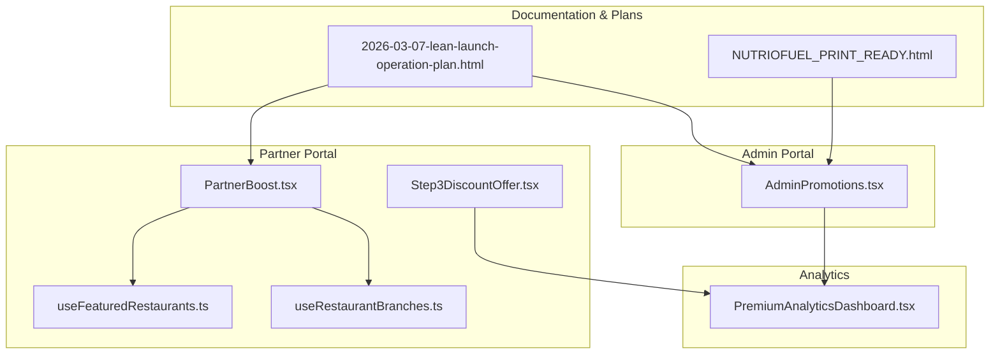
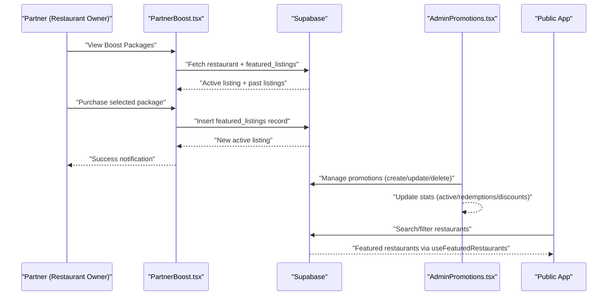
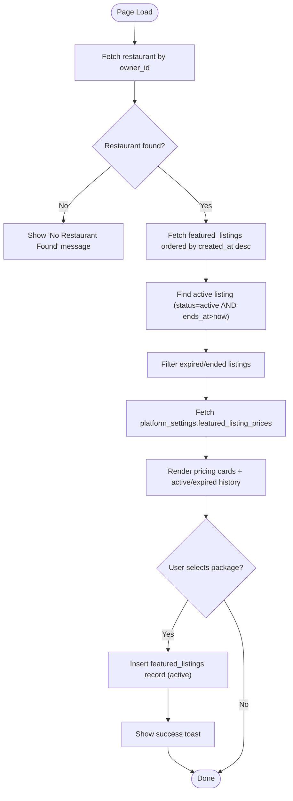
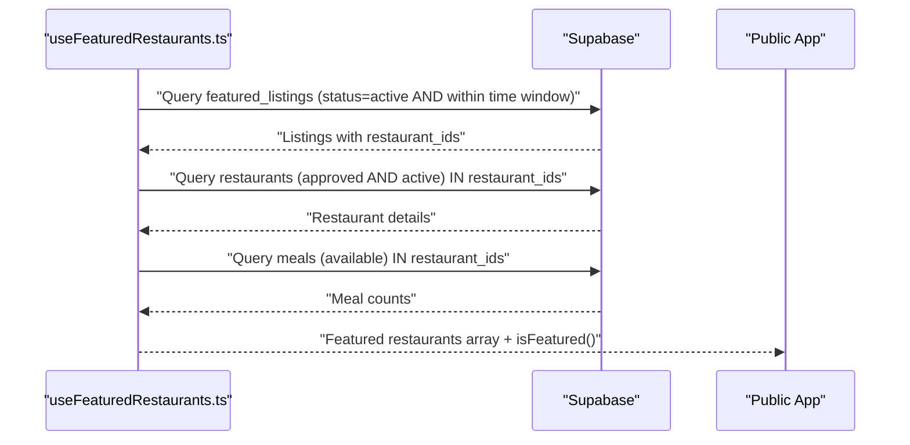
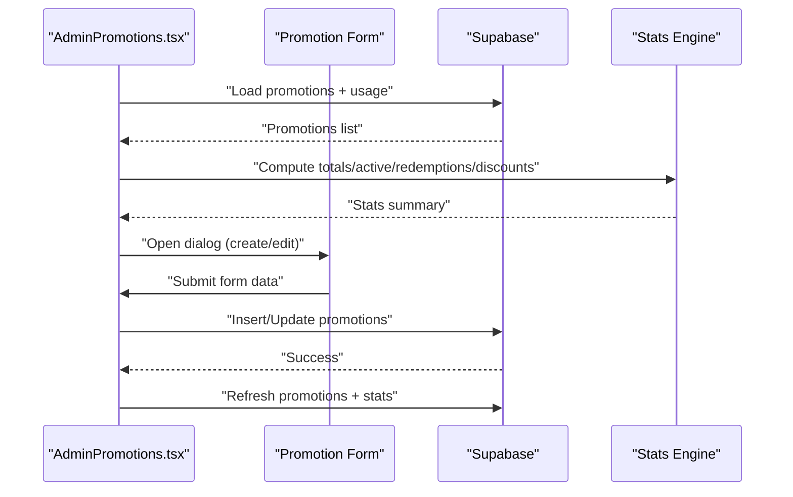
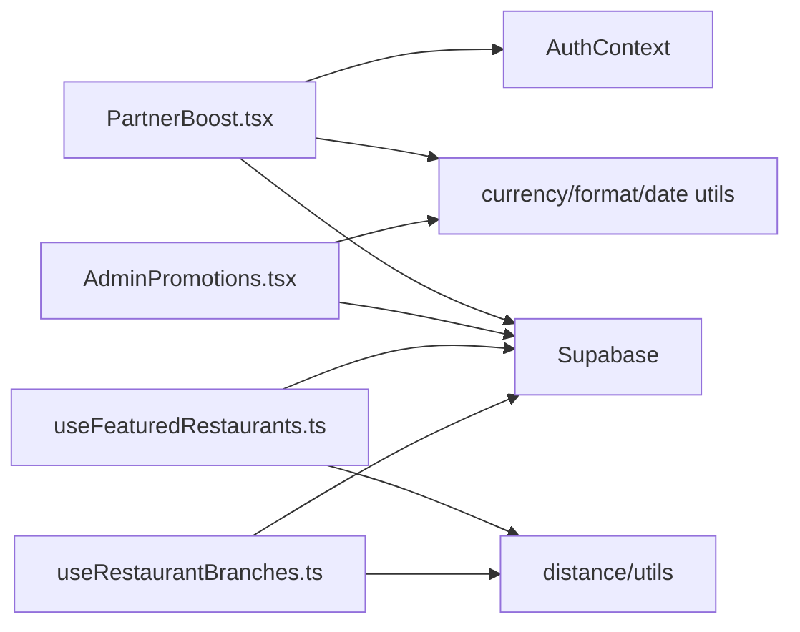

# Marketing & Promotion Tools

<cite>
**Referenced Files in This Document**
- [PartnerBoost.tsx](file://src/pages/partner/PartnerBoost.tsx)
- [AdminPromotions.tsx](file://src/pages/admin/AdminPromotions.tsx)
- [useFeaturedRestaurants.ts](file://src/hooks/useFeaturedRestaurants.ts)
- [useRestaurantBranches.ts](file://src/hooks/useRestaurantBranches.ts)
- [Step3DiscountOffer.tsx](file://src/components/CancellationFlow/Step3DiscountOffer.tsx)
- [PremiumAnalyticsDashboard.tsx](file://src/components/PremiumAnalyticsDashboard.tsx)
- [2026-03-07-lean-launch-operation-plan.html](file://docs/plans/2026-03-07-lean-launch-operation-plan.html)
- [NUTRIOFUEL_PRINT_READY.html](file://NUTRIOFUEL_PRINT_READY.html)
</cite>

## Table of Contents
1. [Introduction](#introduction)
2. [Project Structure](#project-structure)
3. [Core Components](#core-components)
4. [Architecture Overview](#architecture-overview)
5. [Detailed Component Analysis](#detailed-component-analysis)
6. [Dependency Analysis](#dependency-analysis)
7. [Performance Considerations](#performance-considerations)
8. [Troubleshooting Guide](#troubleshooting-guide)
9. [Conclusion](#conclusion)
10. [Appendices](#appendices)

## Introduction
This document details the marketing and promotion tools available in the partner portal and the broader marketing ecosystem. It covers the restaurant boosting system, featured listing management, promotional campaign creation, discount and coupon management, customer acquisition tools, engagement features, and integration points with social media and retention programs. It also provides practical examples for running successful promotions, measuring marketing effectiveness, optimizing customer acquisition strategies, and identifying upsell opportunities and premium feature activation.

## Project Structure
The marketing and promotion capabilities are implemented primarily in:
- Partner-facing pages and components for restaurant boosting and visibility
- Admin-facing pages for managing promotions and coupons
- Hooks that power featured restaurant discovery and branch logistics
- Cancellation and retention flows that include discount offers
- Analytics dashboards that surface customer retention insights

**Diagram sources**
- [PartnerBoost.tsx:1-384](file://src/pages/partner/PartnerBoost.tsx#L1-L384)
- [AdminPromotions.tsx:1-714](file://src/pages/admin/AdminPromotions.tsx#L1-L714)
- [useFeaturedRestaurants.ts:1-129](file://src/hooks/useFeaturedRestaurants.ts#L1-L129)
- [useRestaurantBranches.ts:1-229](file://src/hooks/useRestaurantBranches.ts#L1-L229)
- [Step3DiscountOffer.tsx:1-110](file://src/components/CancellationFlow/Step3DiscountOffer.tsx#L1-L110)
- [PremiumAnalyticsDashboard.tsx:741-747](file://src/components/PremiumAnalyticsDashboard.tsx#L741-L747)
- [2026-03-07-lean-launch-operation-plan.html:444-475](file://docs/plans/2026-03-07-lean-launch-operation-plan.html#L444-L475)
- [NUTRIOFUEL_PRINT_READY.html:4551-4565](file://NUTRIOFUEL_PRINT_READY.html#L4551-L4565)

**Section sources**
- [PartnerBoost.tsx:1-384](file://src/pages/partner/PartnerBoost.tsx#L1-L384)
- [AdminPromotions.tsx:1-714](file://src/pages/admin/AdminPromotions.tsx#L1-L714)
- [useFeaturedRestaurants.ts:1-129](file://src/hooks/useFeaturedRestaurants.ts#L1-L129)
- [useRestaurantBranches.ts:1-229](file://src/hooks/useRestaurantBranches.ts#L1-L229)
- [Step3DiscountOffer.tsx:1-110](file://src/components/CancellationFlow/Step3DiscountOffer.tsx#L1-L110)
- [PremiumAnalyticsDashboard.tsx:741-747](file://src/components/PremiumAnalyticsDashboard.tsx#L741-L747)
- [2026-03-07-lean-launch-operation-plan.html:444-475](file://docs/plans/2026-03-07-lean-launch-operation-plan.html#L444-L475)
- [NUTRIOFUEL_PRINT_READY.html:4551-4565](file://NUTRIOFUEL_PRINT_READY.html#L4551-L4565)

## Core Components
- Restaurant Boosting and Featured Listings (Partner Portal)
  - Purchase packages (weekly, biweekly, monthly) to increase visibility
  - View active boosts, expiration countdown, and boost history
  - Dynamic pricing sourced from platform settings
- Promotions and Coupon Management (Admin Portal)
  - Create, edit, activate/deactivate, and delete discount codes
  - Configure discount types (percentage/fixed), limits, validity windows, and redemption caps
  - Real-time statistics on total promotions, active now, redemptions, and total discounts given
- Featured Restaurant Discovery (Public Experience)
  - Backend hook aggregates currently active featured listings and restaurant metadata
  - Provides a curated list of restaurants with featured badges and listing details
- Discount Offers in Retention Flows
  - Win-back discount offers presented during subscription cancellation flow
  - Encourages re-engagement with limited-time offers and clear savings calculation
- Analytics and Retention Insights
  - Dashboard metrics include repeat customers, repeat rate, and average orders per customer
  - Supports retention-based marketing decisions

**Section sources**
- [PartnerBoost.tsx:32-104](file://src/pages/partner/PartnerBoost.tsx#L32-L104)
- [AdminPromotions.tsx:59-90](file://src/pages/admin/AdminPromotions.tsx#L59-L90)
- [useFeaturedRestaurants.ts:17-128](file://src/hooks/useFeaturedRestaurants.ts#L17-L128)
- [Step3DiscountOffer.tsx:16-88](file://src/components/CancellationFlow/Step3DiscountOffer.tsx#L16-L88)
- [PremiumAnalyticsDashboard.tsx:741-747](file://src/components/PremiumAnalyticsDashboard.tsx#L741-L747)

## Architecture Overview
The marketing ecosystem integrates partner actions, admin configurations, and backend data to deliver targeted promotions and visibility enhancements.

**Diagram sources**
- [PartnerBoost.tsx:47-153](file://src/pages/partner/PartnerBoost.tsx#L47-L153)
- [AdminPromotions.tsx:123-242](file://src/pages/admin/AdminPromotions.tsx#L123-L242)
- [useFeaturedRestaurants.ts:22-123](file://src/hooks/useFeaturedRestaurants.ts#L22-L123)

## Detailed Component Analysis

### Restaurant Boosting System (Partner Portal)
The Partner Boost page enables restaurant owners to purchase visibility packages and track their impact.

Key behaviors:
- Restaurant lookup by owner ID
- Fetch active and expired featured listings
- Dynamic pricing from platform settings
- Insert new featured listing records with calculated start/end dates
- Toast notifications for success/error states
- Expiration countdown and formatted display

**Diagram sources**
- [PartnerBoost.tsx:47-114](file://src/pages/partner/PartnerBoost.tsx#L47-L114)
- [PartnerBoost.tsx:116-153](file://src/pages/partner/PartnerBoost.tsx#L116-L153)

**Section sources**
- [PartnerBoost.tsx:38-153](file://src/pages/partner/PartnerBoost.tsx#L38-L153)

### Featured Listing Management (Public Experience)
The featured restaurants hook aggregates active listings and restaurant metadata to power the public experience.

Key behaviors:
- Query active featured listings with time-window filters
- Join with restaurants table for approved and active restaurants
- Count available meals per restaurant
- Expose loading state, featured IDs, and a featured list

**Diagram sources**
- [useFeaturedRestaurants.ts:22-123](file://src/hooks/useFeaturedRestaurants.ts#L22-L123)

**Section sources**
- [useFeaturedRestaurants.ts:17-128](file://src/hooks/useFeaturedRestaurants.ts#L17-L128)

### Promotional Campaign Creation (Admin Portal)
The Admin Promotions page allows administrators to create and manage discount codes and campaigns.

Key behaviors:
- Define promotion form fields (code, name, discount type/value, min order, limits, validity)
- Generate promo codes automatically
- Compute status badges based on active/scheduled/expired/exhausted criteria
- Maintain statistics: total promotions, active now, total redemptions, total discounts given
- Copy codes to clipboard and delete with confirmation

**Diagram sources**
- [AdminPromotions.tsx:123-242](file://src/pages/admin/AdminPromotions.tsx#L123-L242)
- [AdminPromotions.tsx:293-311](file://src/pages/admin/AdminPromotions.tsx#L293-L311)

**Section sources**
- [AdminPromotions.tsx:59-90](file://src/pages/admin/AdminPromotions.tsx#L59-L90)
- [AdminPromotions.tsx:175-242](file://src/pages/admin/AdminPromotions.tsx#L175-L242)
- [AdminPromotions.tsx:293-311](file://src/pages/admin/AdminPromotions.tsx#L293-L311)
- [AdminPromotions.tsx:525-563](file://src/pages/admin/AdminPromotions.tsx#L525-L563)

### Discount and Coupon Management
- Admin controls:
  - Percentage or fixed discount values
  - Minimum order thresholds
  - Maximum discount amounts
  - Global and per-user usage limits
  - Validity windows (from/until)
  - Activation toggle
- Public usage:
  - Copy-to-clipboard for easy sharing
  - Real-time status badges indicating active/scheduled/expired/exhausted

**Section sources**
- [AdminPromotions.tsx:386-501](file://src/pages/admin/AdminPromotions.tsx#L386-L501)
- [AdminPromotions.tsx:288-311](file://src/pages/admin/AdminPromotions.tsx#L288-L311)

### Customer Acquisition Tools
- Internal marketing tools:
  - Restaurant boosting packages to improve visibility
  - Promotions and coupons to drive trial and repeat purchases
- External acquisition channels (as documented):
  - Restaurant referrals with revenue share
  - Community participation in local groups and events
  - Referral program with tiered rewards and in-app tracking
  - Paid channels including Google Ads, social media ads, and influencer partnerships
  - Self-service platform, automated reminders, in-app chat, email support, community, and personalized recommendations

**Section sources**
- [2026-03-07-lean-launch-operation-plan.html:444-475](file://docs/plans/2026-03-07-lean-launch-operation-plan.html#L444-L475)
- [NUTRIOFUEL_PRINT_READY.html:4551-4565](file://NUTRIOFUEL_PRINT_READY.html#L4551-L4565)

### Engagement Features
- Win-back discount offers during cancellation:
  - Presents limited-time offers with clear savings
  - Encourages acceptance to retain customers
- Featured restaurants:
  - Curated list highlights boosted restaurants with badges and listing details
- Branch logistics:
  - Nearest branch finder and delivery feasibility help improve convenience and engagement

**Section sources**
- [Step3DiscountOffer.tsx:16-88](file://src/components/CancellationFlow/Step3DiscountOffer.tsx#L16-L88)
- [useFeaturedRestaurants.ts:17-128](file://src/hooks/useFeaturedRestaurants.ts#L17-L128)
- [useRestaurantBranches.ts:82-93](file://src/hooks/useRestaurantBranches.ts#L82-L93)

### Integration with Broader Marketing Ecosystem
- Social media integration:
  - Community presence and social channels for relationship building
  - Social media as part of customer relationship touchpoints
- Retention programs:
  - Analytics dashboard surfaces repeat customers and repeat rate
  - Win-back offers leverage retention metrics to reduce churn
- Cross-channel alignment:
  - Internal promotions (boosts, coupons) complement external acquisition efforts

**Section sources**
- [NUTRIOFUEL_PRINT_READY.html:4551-4565](file://NUTRIOFUEL_PRINT_READY.html#L4551-L4565)
- [PremiumAnalyticsDashboard.tsx:741-747](file://src/components/PremiumAnalyticsDashboard.tsx#L741-L747)
- [Step3DiscountOffer.tsx:91-95](file://src/components/CancellationFlow/Step3DiscountOffer.tsx#L91-L95)

## Dependency Analysis
- PartnerBoost depends on:
  - Supabase for restaurant and featured listing queries/inserts
  - Auth context for owner identification
  - Currency formatting and date utilities
- AdminPromotions depends on:
  - Supabase for promotions CRUD and usage aggregation
  - Form validation and status computation
  - Currency formatting and date utilities
- useFeaturedRestaurants depends on:
  - Supabase for featured listings and restaurant joins
  - Meal counts aggregation
- useRestaurantBranches depends on:
  - Supabase for branch queries
  - Distance utilities for nearest branch and delivery feasibility

**Diagram sources**
- [PartnerBoost.tsx:1-12](file://src/pages/partner/PartnerBoost.tsx#L1-L12)
- [AdminPromotions.tsx:1-58](file://src/pages/admin/AdminPromotions.tsx#L1-L58)
- [useFeaturedRestaurants.ts:1-11](file://src/hooks/useFeaturedRestaurants.ts#L1-L11)
- [useRestaurantBranches.ts:1-11](file://src/hooks/useRestaurantBranches.ts#L1-L11)

**Section sources**
- [PartnerBoost.tsx:1-12](file://src/pages/partner/PartnerBoost.tsx#L1-L12)
- [AdminPromotions.tsx:1-58](file://src/pages/admin/AdminPromotions.tsx#L1-L58)
- [useFeaturedRestaurants.ts:1-11](file://src/hooks/useFeaturedRestaurants.ts#L1-L11)
- [useRestaurantBranches.ts:1-11](file://src/hooks/useRestaurantBranches.ts#L1-L11)

## Performance Considerations
- Minimize redundant queries:
  - Batch restaurant and meal data retrieval after listing fetch
- Optimize frontend rendering:
  - Memoize derived data (e.g., nearest branch, distance sorting)
- Efficient status computations:
  - Compute promotion statuses client-side after fetching base data
- Pagination and filtering:
  - Use server-side filters for large datasets (already present for promotions and featured listings)

## Troubleshooting Guide
Common issues and resolutions:
- Boost purchase fails:
  - Verify restaurant ownership and existence
  - Confirm Supabase insert permissions and network connectivity
  - Check toast messages for specific error details
- Featured listing not appearing:
  - Ensure listing status is active and within valid time window
  - Confirm restaurant approval and activity flags
- Promotion not visible:
  - Check validity dates and activation flag
  - Confirm usage limits and per-user caps
- Win-back offer not applied:
  - Validate offer code and eligibility
  - Confirm subscription state and offer type

**Section sources**
- [PartnerBoost.tsx:105-153](file://src/pages/partner/PartnerBoost.tsx#L105-L153)
- [useFeaturedRestaurants.ts:38-72](file://src/hooks/useFeaturedRestaurants.ts#L38-L72)
- [AdminPromotions.tsx:293-311](file://src/pages/admin/AdminPromotions.tsx#L293-L311)
- [Step3DiscountOffer.tsx:16-88](file://src/components/CancellationFlow/Step3DiscountOffer.tsx#L16-L88)

## Conclusion
The marketing and promotion tools provide a cohesive suite for boosting restaurant visibility, managing promotional campaigns, and retaining customers. The partner portal enables restaurant owners to enhance discoverability through featured listings, while the admin portal centralizes promotion management with robust analytics. Together with retention-focused discount offers and documented acquisition strategies, these tools support data-driven marketing and sustainable growth.

## Appendices

### Practical Examples: Running Successful Promotions
- Launch a seasonal percentage discount with a minimum order threshold and a global cap
- Pair a boost package with a limited-time coupon to maximize trial conversions
- Use the win-back offer during cancellations to reduce churn and recover revenue
- Track redemption rates and adjust discount values to optimize conversion cost

**Section sources**
- [AdminPromotions.tsx:386-501](file://src/pages/admin/AdminPromotions.tsx#L386-L501)
- [PartnerBoost.tsx:116-153](file://src/pages/partner/PartnerBoost.tsx#L116-L153)
- [Step3DiscountOffer.tsx:16-88](file://src/components/CancellationFlow/Step3DiscountOffer.tsx#L16-L88)

### Measuring Marketing Effectiveness
- Monitor active promotions and total redemptions
- Track total discounts given and revenue impact
- Observe repeat customers and repeat rate via analytics dashboard
- Evaluate boost performance by comparing orders pre/post-featured period

**Section sources**
- [AdminPromotions.tsx:525-563](file://src/pages/admin/AdminPromotions.tsx#L525-L563)
- [PremiumAnalyticsDashboard.tsx:741-747](file://src/components/PremiumAnalyticsDashboard.tsx#L741-L747)

### Optimizing Customer Acquisition Strategies
- Align internal promotions (boosts, coupons) with external acquisition channels
- Leverage referral programs and community engagement for organic reach
- Use paid channels strategically with clear targeting and budget caps
- Integrate social media presence to amplify acquisition efforts

**Section sources**
- [2026-03-07-lean-launch-operation-plan.html:444-475](file://docs/plans/2026-03-07-lean-launch-operation-plan.html#L444-L475)
- [NUTRIOFUEL_PRINT_READY.html:4551-4565](file://NUTRIOFUEL_PRINT_READY.html#L4551-L4565)

### Upsell Opportunities and Premium Feature Activation
- Offer premium boost packages with higher visibility and promotional benefits
- Introduce advanced analytics and reporting features behind a paywall
- Provide white-glove onboarding and dedicated account management for top-tier restaurants
- Bundle promotional credits with premium listing tiers

[No sources needed since this section provides general guidance]