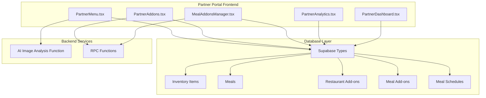
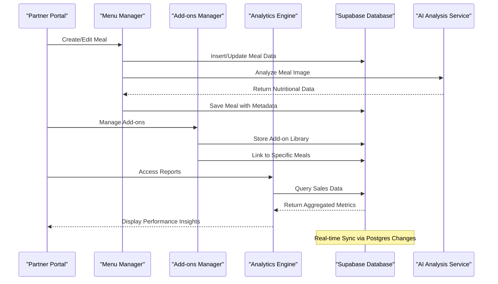
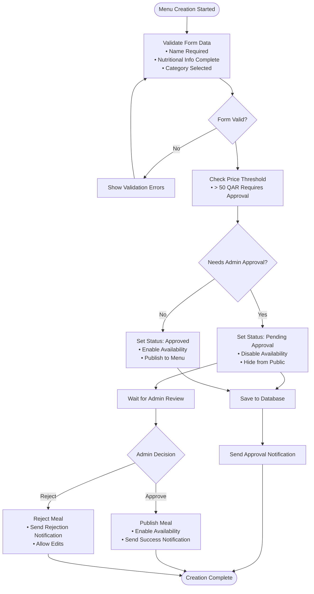
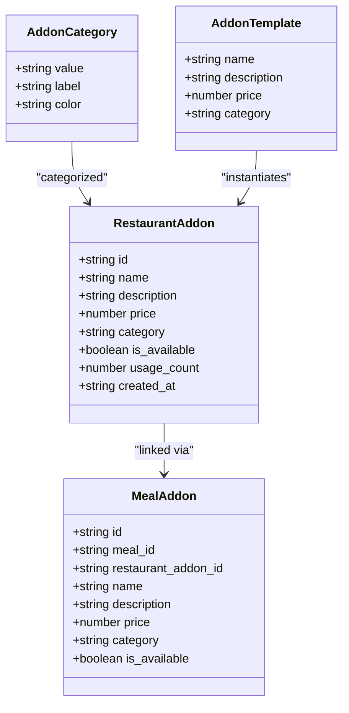
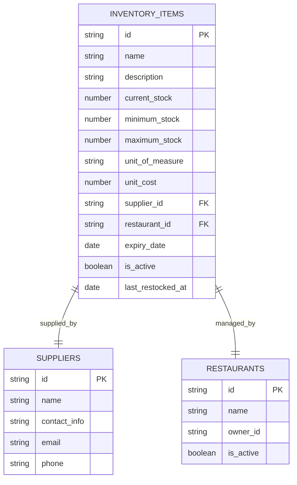
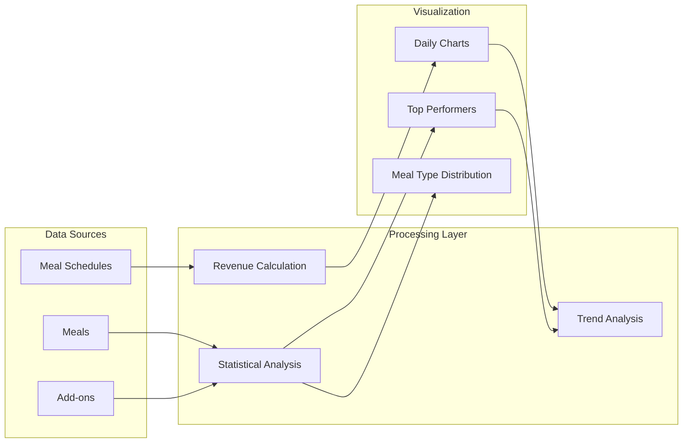
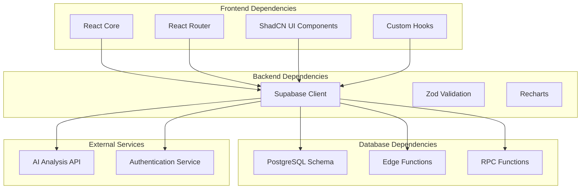

# Menu & Inventory Management

<cite>
**Referenced Files in This Document**
- [PartnerMenu.tsx](file://src/pages/partner/PartnerMenu.tsx)
- [PartnerAddons.tsx](file://src/pages/partner/PartnerAddons.tsx)
- [MealAddonsManager.tsx](file://src/components/MealAddonsManager.tsx)
- [PartnerAnalytics.tsx](file://src/pages/partner/PartnerAnalytics.tsx)
- [PartnerDashboard.tsx](file://src/pages/partner/PartnerDashboard.tsx)
- [types.ts](file://supabase/types.ts)
- [partner-portal-audit-report.md](file://partner-portal-audit-report.md)
- [BUSINESS_MODEL_FIX_SUMMARY.md](file://BUSINESS_MODEL_FIX_SUMMARY.md)
</cite>

## Table of Contents
1. [Introduction](#introduction)
2. [Project Structure](#project-structure)
3. [Core Components](#core-components)
4. [Architecture Overview](#architecture-overview)
5. [Detailed Component Analysis](#detailed-component-analysis)
6. [Dependency Analysis](#dependency-analysis)
7. [Performance Considerations](#performance-considerations)
8. [Troubleshooting Guide](#troubleshooting-guide)
9. [Conclusion](#conclusion)

## Introduction
This document provides comprehensive documentation for the menu and inventory management system within the Nutrio platform. It covers menu creation and maintenance workflows, dish categorization, pricing management, availability controls, ingredient tracking, stock level monitoring, automated low-stock alerts, addon management, customization options, meal modification capabilities, menu scheduling, seasonal availability, promotional pricing features, and integration with restaurant analytics and sales reporting. The system is designed around a subscription-based model where meals are included in the subscription, while add-ons are managed separately and tracked for usage analytics.

## Project Structure
The menu and inventory management functionality is primarily implemented in the partner portal frontend and supported by Supabase database schemas and edge functions. Key components include:
- Menu management page for creating, editing, and organizing meals
- Add-on management system for extras and customization options
- Analytics dashboard for sales reporting and performance insights
- Dashboard for operational visibility and quick actions
- Database schema supporting inventory items and relationships

**Diagram sources**
- [PartnerMenu.tsx:166-1031](file://src/pages/partner/PartnerMenu.tsx#L166-L1031)
- [PartnerAddons.tsx:86-750](file://src/pages/partner/PartnerAddons.tsx#L86-L750)
- [MealAddonsManager.tsx:92-539](file://src/components/MealAddonsManager.tsx#L92-L539)
- [PartnerAnalytics.tsx:51-436](file://src/pages/partner/PartnerAnalytics.tsx#L51-L436)
- [PartnerDashboard.tsx:70-687](file://src/pages/partner/PartnerDashboard.tsx#L70-L687)
- [types.ts:925-967](file://supabase/types.ts#L925-L967)

**Section sources**
- [PartnerMenu.tsx:166-1031](file://src/pages/partner/PartnerMenu.tsx#L166-L1031)
- [PartnerAddons.tsx:86-750](file://src/pages/partner/PartnerAddons.tsx#L86-L750)
- [PartnerAnalytics.tsx:51-436](file://src/pages/partner/PartnerAnalytics.tsx#L51-L436)
- [PartnerDashboard.tsx:70-687](file://src/pages/partner/PartnerDashboard.tsx#L70-L687)
- [types.ts:925-967](file://supabase/types.ts#L925-L967)

## Core Components
The system comprises several interconnected components that work together to provide comprehensive menu and inventory management capabilities:

### Menu Management System
The primary interface for managing restaurant menus, including meal creation, editing, categorization, and availability controls. Features include:
- Meal creation with nutritional information and preparation details
- Category-based organization (Main Course, Appetizer, Soup, Drink, Dessert)
- Approval workflow for price changes exceeding thresholds
- Real-time synchronization with admin approvals
- AI-powered meal image analysis for automatic data population

### Add-on Management System
Comprehensive system for managing extras and customization options:
- Library-based add-on storage with categorization
- Template system for quick add-on creation
- Usage tracking and analytics
- Availability controls for customer visibility
- Integration with individual meals for customization

### Analytics and Reporting
Advanced analytics dashboard providing:
- Revenue tracking based on subscription model
- Performance metrics and trend analysis
- Top-performing meal identification
- Customer engagement metrics
- Premium analytics capabilities

### Inventory Tracking
Structured inventory management system supporting:
- Ingredient database with stock level tracking
- Supplier relationship management
- Automated low-stock alert mechanisms
- Expiry date monitoring
- Waste tracking and reporting

**Section sources**
- [PartnerMenu.tsx:60-165](file://src/pages/partner/PartnerMenu.tsx#L60-L165)
- [PartnerAddons.tsx:51-85](file://src/pages/partner/PartnerAddons.tsx#L51-L85)
- [PartnerAnalytics.tsx:37-49](file://src/pages/partner/PartnerAnalytics.tsx#L37-L49)
- [types.ts:925-967](file://supabase/types.ts#L925-L967)

## Architecture Overview
The system follows a modern React-based architecture with Supabase backend services, implementing real-time data synchronization and cloud functions for advanced features.

**Diagram sources**
- [PartnerMenu.tsx:203-242](file://src/pages/partner/PartnerMenu.tsx#L203-L242)
- [PartnerAddons.tsx:151-165](file://src/pages/partner/PartnerAddons.tsx#L151-L165)
- [PartnerAnalytics.tsx:117-126](file://src/pages/partner/PartnerAnalytics.tsx#L117-L126)

The architecture emphasizes:
- Real-time data synchronization using Supabase's postgres_changes
- Cloud function integration for AI-powered features
- Modular component design for maintainability
- Scalable database schema supporting growth

**Section sources**
- [PartnerMenu.tsx:203-242](file://src/pages/partner/PartnerMenu.tsx#L203-L242)
- [PartnerAnalytics.tsx:76-191](file://src/pages/partner/PartnerAnalytics.tsx#L76-L191)

## Detailed Component Analysis

### Menu Creation and Management Workflow
The menu management system provides a comprehensive workflow for creating and maintaining restaurant offerings:

**Diagram sources**
- [PartnerMenu.tsx:465-527](file://src/pages/partner/PartnerMenu.tsx#L465-L527)
- [PartnerMenu.tsx:223-235](file://src/pages/partner/PartnerMenu.tsx#L223-L235)

Key features include:
- **Multi-category organization** with predefined categories (Main Course, Appetizer, Soup, Drink, Dessert)
- **Approval workflow** for price-sensitive items (>50 QAR)
- **Real-time approval status updates** via Supabase real-time subscriptions
- **AI-powered image analysis** for automatic nutritional data extraction
- **Dietary tag integration** for specialized meal categorization

**Section sources**
- [PartnerMenu.tsx:60-165](file://src/pages/partner/PartnerMenu.tsx#L60-L165)
- [PartnerMenu.tsx:465-527](file://src/pages/partner/PartnerMenu.tsx#L465-L527)
- [PartnerMenu.tsx:398-452](file://src/pages/partner/PartnerMenu.tsx#L398-L452)

### Add-on Management System
The add-on system provides flexible customization options with comprehensive management capabilities:

**Diagram sources**
- [PartnerAddons.tsx:51-67](file://src/pages/partner/PartnerAddons.tsx#L51-L67)
- [PartnerAddons.tsx:70-84](file://src/pages/partner/PartnerAddons.tsx#L70-L84)
- [MealAddonsManager.tsx:101-115](file://src/components/MealAddonsManager.tsx#L101-L115)

The system supports:
- **Template-based add-on creation** for common extras
- **Category-based organization** (Premium Ingredients, Sides, Extras, Drinks)
- **Usage tracking** with automatic increment/decrement
- **Availability controls** for customer visibility
- **Batch operations** for meal-specific add-on assignment

**Section sources**
- [PartnerAddons.tsx:51-85](file://src/pages/partner/PartnerAddons.tsx#L51-L85)
- [PartnerAddons.tsx:182-292](file://src/pages/partner/PartnerAddons.tsx#L182-L292)
- [MealAddonsManager.tsx:101-199](file://src/components/MealAddonsManager.tsx#L101-L199)

### Inventory Tracking and Stock Management
The inventory system provides comprehensive ingredient tracking with automated monitoring:

**Diagram sources**
- [types.ts:925-967](file://supabase/types.ts#L925-L967)

Key inventory features include:
- **Stock level monitoring** with configurable minimum/maximum thresholds
- **Supplier relationship management** with contact tracking
- **Expiry date tracking** for perishable ingredients
- **Automated low-stock alerts** based on threshold comparisons
- **Waste tracking** for expired or unused ingredients

**Section sources**
- [types.ts:925-967](file://supabase/types.ts#L925-L967)

### Analytics and Sales Reporting
The analytics system provides comprehensive insights into menu performance and business metrics:

**Diagram sources**
- [PartnerAnalytics.tsx:117-191](file://src/pages/partner/PartnerAnalytics.tsx#L117-L191)

The analytics dashboard provides:
- **Revenue tracking** based on subscription model (meals_prepared × payout_rate)
- **Performance metrics** including total orders, unique customers, and average order value
- **Trend analysis** with 7-day rolling windows
- **Top-performing meal identification** with revenue attribution
- **Meal type distribution** for portfolio analysis

**Section sources**
- [PartnerAnalytics.tsx:76-191](file://src/pages/partner/PartnerAnalytics.tsx#L76-L191)
- [PartnerDashboard.tsx:206-255](file://src/pages/partner/PartnerDashboard.tsx#L206-L255)

## Dependency Analysis
The system exhibits well-structured dependencies with clear separation of concerns:

**Diagram sources**
- [PartnerMenu.tsx:54-58](file://src/pages/partner/PartnerMenu.tsx#L54-L58)
- [PartnerAnalytics.tsx:16-35](file://src/pages/partner/PartnerAnalytics.tsx#L16-L35)

Key dependency characteristics:
- **Low coupling** between components through shared Supabase client
- **High cohesion** within each component module
- **Clear data flow** from UI to database with validation layers
- **Real-time synchronization** through Supabase channels

**Section sources**
- [PartnerMenu.tsx:54-58](file://src/pages/partner/PartnerMenu.tsx#L54-L58)
- [PartnerAnalytics.tsx:16-35](file://src/pages/partner/PartnerAnalytics.tsx#L16-L35)

## Performance Considerations
The system implements several performance optimization strategies:

### Data Loading Optimizations
- **Batch queries** for meal add-ons to minimize database round trips
- **Memoized computations** for filtered and sorted meal lists
- **Skeleton loading states** for improved perceived performance
- **Real-time caching** through Supabase subscriptions

### Database Performance
- **Indexed lookups** on frequently queried fields (restaurant_id, meal_id)
- **Efficient joins** for meal and add-on data aggregation
- **Pagination support** for large datasets
- **Selective field retrieval** to reduce payload sizes

### Frontend Performance
- **Component lazy loading** for route-based code splitting
- **Optimized re-renders** through proper state management
- **Debounced search** for inventory and add-on filtering
- **Virtualized lists** for large dataset rendering

## Troubleshooting Guide

### Common Menu Management Issues
**Problem**: Meals not appearing after creation
- **Cause**: Approval status pending or availability disabled
- **Solution**: Check admin approval status and enable availability
- **Prevention**: Monitor approval notifications and review thresholds

**Problem**: AI image analysis failures
- **Cause**: Authentication session expiration or rate limiting
- **Solution**: Re-authenticate user session or wait for rate limit reset
- **Prevention**: Implement session refresh mechanisms

### Add-on Management Problems
**Problem**: Add-on usage counts not updating
- **Cause**: RPC function execution failures
- **Solution**: Verify RPC function permissions and retry operation
- **Prevention**: Implement error handling and retry logic

**Problem**: Template add-on creation conflicts
- **Cause**: Duplicate add-on names in library
- **Solution**: Modify template name or check existing library entries
- **Prevention**: Validate add-on names before template application

### Analytics and Reporting Issues
**Problem**: Missing revenue data in analytics
- **Cause**: No scheduled meals or restaurant not properly configured
- **Solution**: Verify restaurant setup and ensure meal scheduling
- **Prevention**: Monitor dashboard initialization and data loading states

**Section sources**
- [PartnerMenu.tsx:403-451](file://src/pages/partner/PartnerMenu.tsx#L403-L451)
- [PartnerAddons.tsx:265-276](file://src/pages/partner/PartnerAddons.tsx#L265-L276)
- [PartnerAnalytics.tsx:181-188](file://src/pages/partner/PartnerAnalytics.tsx#L181-L188)

## Conclusion
The Nutrio menu and inventory management system provides a comprehensive solution for restaurant operators, combining intuitive menu management with robust analytics capabilities. The system's strength lies in its real-time synchronization, approval workflows, and subscription-based pricing model that eliminates customer-facing complexity while maintaining operational flexibility.

Key achievements include:
- **Streamlined menu management** with AI-assisted data entry
- **Flexible add-on system** supporting extensive customization options
- **Advanced analytics** providing actionable business insights
- **Real-time operational visibility** through dashboard integration
- **Scalable architecture** supporting business growth

Future enhancements could include expanded inventory automation, advanced promotional pricing features, and enhanced seasonal availability management to further optimize the restaurant operator experience.