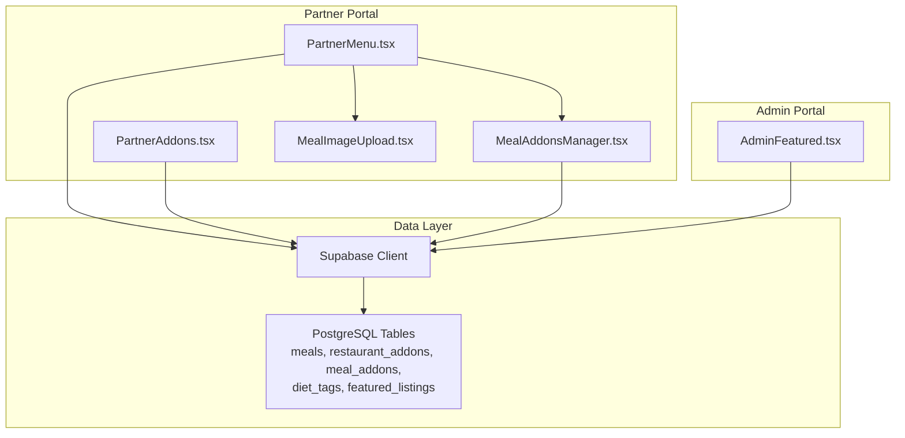
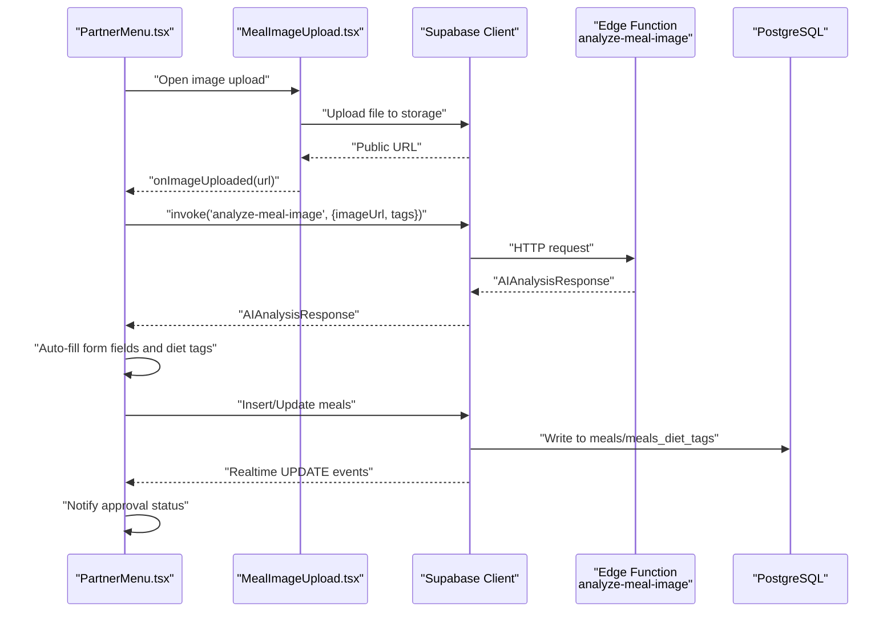
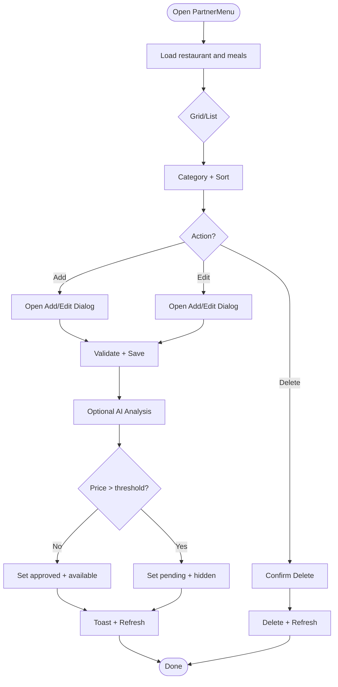
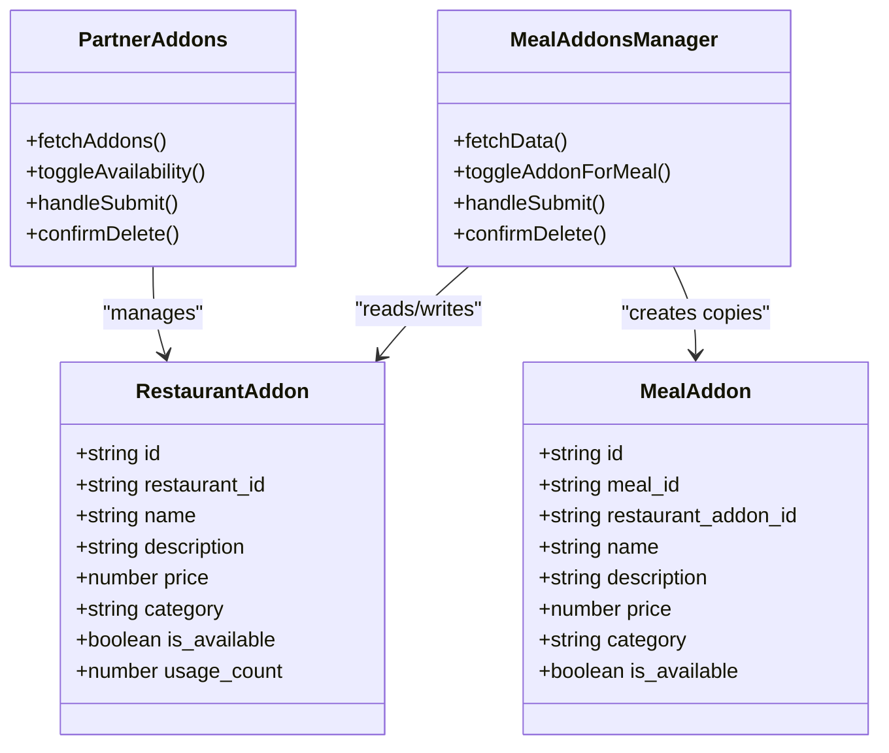
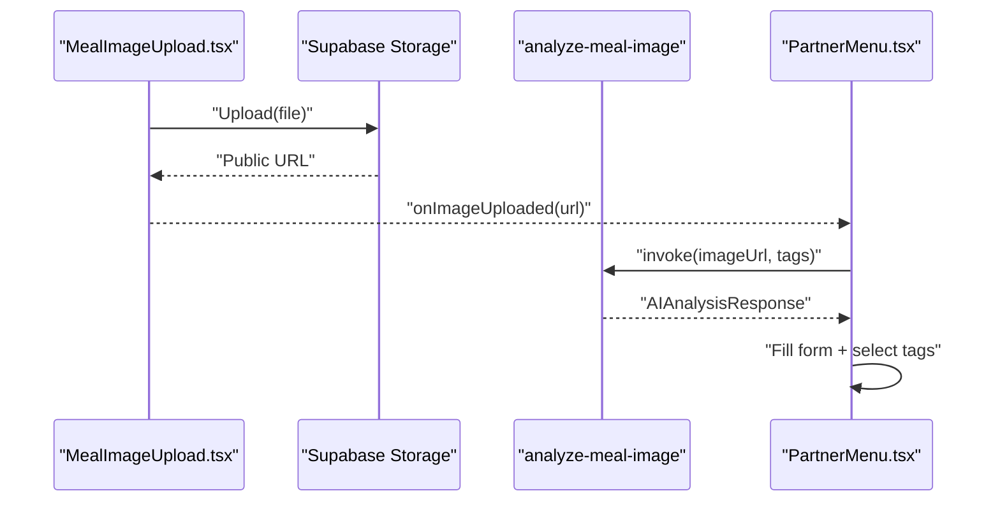
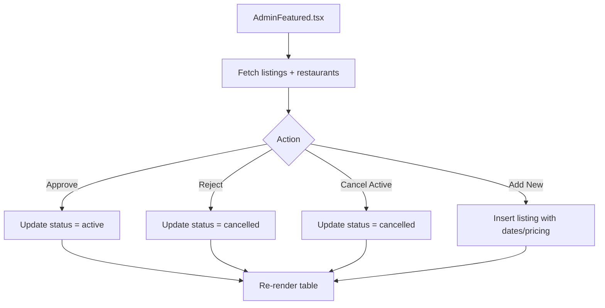
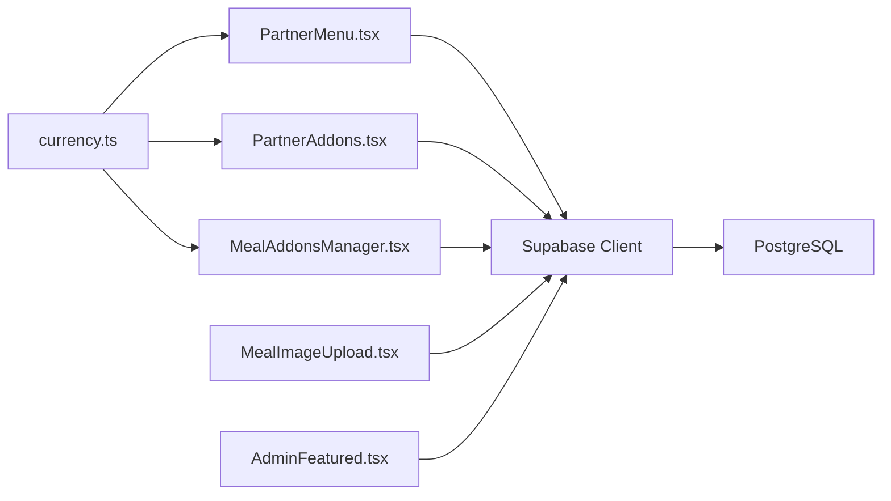

# Menu Management

<cite>
**Referenced Files in This Document**
- [PartnerMenu.tsx](file://src/pages/partner/PartnerMenu.tsx)
- [PartnerAddons.tsx](file://src/pages/partner/PartnerAddons.tsx)
- [MealAddonsManager.tsx](file://src/components/MealAddonsManager.tsx)
- [MealImageUpload.tsx](file://src/components/MealImageUpload.tsx)
- [AdminFeatured.tsx](file://src/pages/admin/AdminFeatured.tsx)
- [supabase client](file://src/integrations/supabase/client.ts)
- [currency formatter](file://src/lib/currency.ts)
</cite>

## Table of Contents
1. [Introduction](#introduction)
2. [Project Structure](#project-structure)
3. [Core Components](#core-components)
4. [Architecture Overview](#architecture-overview)
5. [Detailed Component Analysis](#detailed-component-analysis)
6. [Dependency Analysis](#dependency-analysis)
7. [Performance Considerations](#performance-considerations)
8. [Troubleshooting Guide](#troubleshooting-guide)
9. [Conclusion](#conclusion)

## Introduction
This document explains the menu management system in the partner portal, focusing on how partners create and maintain meals, configure pricing and availability, manage addons, and integrate with image uploads and AI-powered analysis. It also covers the featured restaurant management and promotional capabilities visible to administrators.

## Project Structure
The menu management functionality spans three primary areas:
- Partner-facing menu management page for creating, editing, and controlling meals
- Add-ons management for building a reusable library and attaching extras to individual meals
- Administrative features for restaurant promotions and visibility

**Diagram sources**
- [PartnerMenu.tsx:166-527](file://src/pages/partner/PartnerMenu.tsx#L166-L527)
- [PartnerAddons.tsx:86-329](file://src/pages/partner/PartnerAddons.tsx#L86-L329)
- [MealAddonsManager.tsx:101-219](file://src/components/MealAddonsManager.tsx#L101-L219)
- [MealImageUpload.tsx:16-96](file://src/components/MealImageUpload.tsx#L16-L96)
- [AdminFeatured.tsx:64-250](file://src/pages/admin/AdminFeatured.tsx#L64-L250)
- [supabase client](file://src/integrations/supabase/client.ts)

**Section sources**
- [PartnerMenu.tsx:166-527](file://src/pages/partner/PartnerMenu.tsx#L166-L527)
- [PartnerAddons.tsx:86-329](file://src/pages/partner/PartnerAddons.tsx#L86-L329)
- [MealAddonsManager.tsx:101-219](file://src/components/MealAddonsManager.tsx#L101-L219)
- [MealImageUpload.tsx:16-96](file://src/components/MealImageUpload.tsx#L16-L96)
- [AdminFeatured.tsx:64-250](file://src/pages/admin/AdminFeatured.tsx#L64-L250)

## Core Components
- PartnerMenu: Full lifecycle for meals (create, edit, delete, approve, availability), image upload, AI analysis, diet tags, addons linkage, and real-time approval updates.
- PartnerAddons: Restaurant-level add-on library with categories, templates, availability toggles, and usage statistics.
- MealAddonsManager: Per-meal addon assignment manager that mirrors library changes and tracks usage.
- MealImageUpload: Controlled image upload with validation, preview, removal, and optional AI analysis trigger.
- AdminFeatured: Promotional listing management for restaurants (packages, pricing, status).

**Section sources**
- [PartnerMenu.tsx:166-527](file://src/pages/partner/PartnerMenu.tsx#L166-L527)
- [PartnerAddons.tsx:86-329](file://src/pages/partner/PartnerAddons.tsx#L86-L329)
- [MealAddonsManager.tsx:101-219](file://src/components/MealAddonsManager.tsx#L101-L219)
- [MealImageUpload.tsx:16-96](file://src/components/MealImageUpload.tsx#L16-L96)
- [AdminFeatured.tsx:64-250](file://src/pages/admin/AdminFeatured.tsx#L64-L250)

## Architecture Overview
The system integrates React UI components with Supabase for data persistence and real-time updates. AI analysis is invoked via Supabase Edge Functions to enrich meal metadata from images. Administrative controls for promotions are handled in the admin module.

**Diagram sources**
- [PartnerMenu.tsx:389-452](file://src/pages/partner/PartnerMenu.tsx#L389-L452)
- [MealImageUpload.tsx:16-96](file://src/components/MealImageUpload.tsx#L16-L96)
- [supabase client](file://src/integrations/supabase/client.ts)

**Section sources**
- [PartnerMenu.tsx:389-452](file://src/pages/partner/PartnerMenu.tsx#L389-L452)
- [MealImageUpload.tsx:16-96](file://src/components/MealImageUpload.tsx#L16-L96)

## Detailed Component Analysis

### Partner Menu: Meal Creation and Management
Key responsibilities:
- Load restaurant context and meals
- Filter, sort, and view mode selection
- Create/edit/delete meals with validation
- Attach diet tags and manage availability
- Integrate image upload and AI analysis
- Link addons to meals
- Real-time approval status updates

Practical workflows:
- Adding a new meal: Open Add dialog, optionally upload image, AI auto-fill, set tags, save. If price exceeds threshold, meal goes to pending; otherwise it becomes live immediately.
- Editing an existing meal: Open Edit dialog, adjust fields, save; diet tags and addons are updated accordingly.
- Managing inventory: Toggle availability per meal; unavailable meals are visually muted and excluded from live ordering.
- Handling special requests: Add-ons are managed separately; they can be toggled per meal and reflect in pricing totals.

**Diagram sources**
- [PartnerMenu.tsx:329-527](file://src/pages/partner/PartnerMenu.tsx#L329-L527)

**Section sources**
- [PartnerMenu.tsx:166-527](file://src/pages/partner/PartnerMenu.tsx#L166-L527)

### Meal Addons System
Two layers:
- Restaurant-level library (PartnerAddons): Create, categorize, and manage reusable add-ons; supports templates and availability toggles.
- Per-meal assignment (MealAddonsManager): Assign/unassign add-ons to a specific meal; mirrors library changes and tracks usage.

**Diagram sources**
- [PartnerAddons.tsx:51-165](file://src/pages/partner/PartnerAddons.tsx#L51-L165)
- [MealAddonsManager.tsx:50-219](file://src/components/MealAddonsManager.tsx#L50-L219)

**Section sources**
- [PartnerAddons.tsx:86-329](file://src/pages/partner/PartnerAddons.tsx#L86-L329)
- [MealAddonsManager.tsx:101-219](file://src/components/MealAddonsManager.tsx#L101-L219)

### Image Upload and AI Analysis
- Validates file type and size, uploads to Supabase Storage, and returns a public URL.
- Triggers AI analysis via Supabase Edge Functions with available diet tags.
- Auto-fills meal form fields and selects matching diet tags when meaningful data is returned.

**Diagram sources**
- [MealImageUpload.tsx:16-96](file://src/components/MealImageUpload.tsx#L16-L96)
- [PartnerMenu.tsx:389-452](file://src/pages/partner/PartnerMenu.tsx#L389-L452)

**Section sources**
- [MealImageUpload.tsx:16-96](file://src/components/MealImageUpload.tsx#L16-L96)
- [PartnerMenu.tsx:389-452](file://src/pages/partner/PartnerMenu.tsx#L389-L452)

### Featured Restaurant Management and Promotions
Administrators can:
- View all featured listings with status, duration, and revenue
- Approve or cancel pending listings
- Activate or cancel active listings
- Create new listings with predefined packages or custom pricing

**Diagram sources**
- [AdminFeatured.tsx:180-250](file://src/pages/admin/AdminFeatured.tsx#L180-L250)

**Section sources**
- [AdminFeatured.tsx:64-250](file://src/pages/admin/AdminFeatured.tsx#L64-L250)

## Dependency Analysis
- UI components depend on Supabase client for queries and real-time channels.
- Currency formatting is centralized for consistent display.
- Real-time updates keep partner dashboards synchronized with admin decisions.

**Diagram sources**
- [PartnerMenu.tsx:166-527](file://src/pages/partner/PartnerMenu.tsx#L166-L527)
- [PartnerAddons.tsx:86-329](file://src/pages/partner/PartnerAddons.tsx#L86-L329)
- [MealAddonsManager.tsx:101-219](file://src/components/MealAddonsManager.tsx#L101-L219)
- [MealImageUpload.tsx:16-96](file://src/components/MealImageUpload.tsx#L16-L96)
- [AdminFeatured.tsx:64-250](file://src/pages/admin/AdminFeatured.tsx#L64-L250)
- [currency formatter](file://src/lib/currency.ts)

**Section sources**
- [PartnerMenu.tsx:166-527](file://src/pages/partner/PartnerMenu.tsx#L166-L527)
- [PartnerAddons.tsx:86-329](file://src/pages/partner/PartnerAddons.tsx#L86-L329)
- [MealAddonsManager.tsx:101-219](file://src/components/MealAddonsManager.tsx#L101-L219)
- [MealImageUpload.tsx:16-96](file://src/components/MealImageUpload.tsx#L16-L96)
- [AdminFeatured.tsx:64-250](file://src/pages/admin/AdminFeatured.tsx#L64-L250)
- [currency formatter](file://src/lib/currency.ts)

## Performance Considerations
- Batch fetch addons per meal to minimize round-trips.
- Use real-time channels to avoid polling for approval status.
- Defer AI analysis until after upload completes to prevent redundant calls.
- Keep image sizes reasonable to reduce upload and render times.

## Troubleshooting Guide
Common issues and resolutions:
- Upload fails or invalid file type: Verify image MIME type and size limits.
- AI analysis rate limit reached: Inform user and suggest retry later.
- Session expired during analysis: Redirect to auth page and re-authenticate.
- Approval status not updating: Ensure real-time channel is subscribed and restaurant ID is resolved.
- Duplicate add-on name: Use templates or choose a unique name; backend prevents duplicates.

**Section sources**
- [MealImageUpload.tsx:26-96](file://src/components/MealImageUpload.tsx#L26-L96)
- [PartnerMenu.tsx:403-452](file://src/pages/partner/PartnerMenu.tsx#L403-L452)
- [PartnerAddons.tsx:265-276](file://src/pages/partner/PartnerAddons.tsx#L265-L276)

## Conclusion
The partner portal’s menu management system provides a robust, real-time workflow for creating meals, configuring pricing and availability, tagging diets, and attaching customizable addons. Administrators can promote restaurants through featured listings, while AI-assisted image analysis accelerates data entry. Together, these components deliver a scalable solution for dynamic menu curation and promotion.