# Notifications & Settings

<cite>
**Referenced Files in This Document**
- [NotificationPreferences.tsx](file://src/components/NotificationPreferences.tsx)
- [Settings.tsx](file://src/pages/Settings.tsx)
- [notifications.ts](file://src/lib/notifications.ts)
- [useDeliveryNotifications.ts](file://src/hooks/useDeliveryNotifications.ts)
- [useScheduledMealNotifications.tsx](file://src/hooks/useScheduledMealNotifications.tsx)
- [Notifications.tsx](file://src/pages/Notifications.tsx)
- [Profile.tsx](file://src/pages/Profile.tsx)
- [types.ts](file://src/integrations/supabase/types.ts)
- [send-push-notification/index.ts](file://supabase/functions/send-push-notification/index.ts)
- [reset-password.html](file://supabase/email-templates/reset-password.html)
</cite>

## Table of Contents
1. [Introduction](#introduction)
2. [Project Structure](#project-structure)
3. [Core Components](#core-components)
4. [Architecture Overview](#architecture-overview)
5. [Detailed Component Analysis](#detailed-component-analysis)
6. [Dependency Analysis](#dependency-analysis)
7. [Performance Considerations](#performance-considerations)
8. [Troubleshooting Guide](#troubleshooting-guide)
9. [Conclusion](#conclusion)

## Introduction
This document explains the notification preferences and account settings management system. It covers how users configure notification channels, manage order and delivery updates, receive performance reminders, and control promotional communications. It also documents account security settings, password management, and two-factor authentication readiness. Finally, it describes integration with notification delivery systems and compliance considerations.

## Project Structure
The notification and settings features span UI components, page-level settings, hooks for real-time updates, backend Supabase integration, and serverless functions for push notifications.

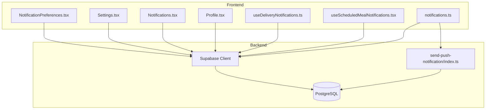

**Diagram sources**
- [NotificationPreferences.tsx:1-198](file://src/components/NotificationPreferences.tsx#L1-L198)
- [Settings.tsx:1-535](file://src/pages/Settings.tsx#L1-L535)
- [Notifications.tsx:1-254](file://src/pages/Notifications.tsx#L1-L254)
- [Profile.tsx:1-800](file://src/pages/Profile.tsx#L1-L800)
- [useDeliveryNotifications.ts:1-139](file://src/hooks/useDeliveryNotifications.ts#L1-L139)
- [useScheduledMealNotifications.tsx:1-177](file://src/hooks/useScheduledMealNotifications.tsx#L1-L177)
- [notifications.ts:1-114](file://src/lib/notifications.ts#L1-L114)
- [send-push-notification/index.ts:1-300](file://supabase/functions/send-push-notification/index.ts#L1-L300)
- [types.ts:1-800](file://src/integrations/supabase/types.ts#L1-L800)

**Section sources**
- [NotificationPreferences.tsx:1-198](file://src/components/NotificationPreferences.tsx#L1-L198)
- [Settings.tsx:1-535](file://src/pages/Settings.tsx#L1-L535)
- [Notifications.tsx:1-254](file://src/pages/Notifications.tsx#L1-L254)
- [Profile.tsx:1-800](file://src/pages/Profile.tsx#L1-L800)
- [useDeliveryNotifications.ts:1-139](file://src/hooks/useDeliveryNotifications.ts#L1-L139)
- [useScheduledMealNotifications.tsx:1-177](file://src/hooks/useScheduledMealNotifications.tsx#L1-L177)
- [notifications.ts:1-114](file://src/lib/notifications.ts#L1-L114)
- [send-push-notification/index.ts:1-300](file://supabase/functions/send-push-notification/index.ts#L1-L300)
- [types.ts:1-800](file://src/integrations/supabase/types.ts#L1-L800)

## Core Components
- NotificationPreferences component: Per-user channel preferences for order updates, delivery updates, promotions, and reminders.
- Settings page: Unified account settings including notification toggles, subscription management, and personal information.
- Notifications page: Central inbox with filtering, read/unread status, and deletion.
- Real-time hooks: Delivery status notifications and scheduled meal reminders.
- Backend integration: Supabase tables for preferences, notifications, and push tokens; serverless function for push delivery.

**Section sources**
- [NotificationPreferences.tsx:17-37](file://src/components/NotificationPreferences.tsx#L17-L37)
- [Settings.tsx:30-40](file://src/pages/Settings.tsx#L30-L40)
- [Notifications.tsx:21-30](file://src/pages/Notifications.tsx#L21-L30)
- [useDeliveryNotifications.ts:5-8](file://src/hooks/useDeliveryNotifications.ts#L5-L8)
- [useScheduledMealNotifications.tsx:10-25](file://src/hooks/useScheduledMealNotifications.tsx#L10-L25)

## Architecture Overview
The system integrates frontend preference management with Supabase for persistence and a serverless function for push notifications. Real-time updates are handled via Supabase channels and browser APIs.

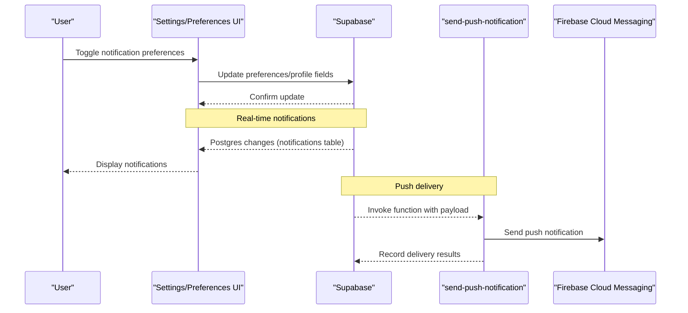

**Diagram sources**
- [Settings.tsx:111-140](file://src/pages/Settings.tsx#L111-L140)
- [NotificationPreferences.tsx:68-83](file://src/components/NotificationPreferences.tsx#L68-L83)
- [Notifications.tsx:67-97](file://src/pages/Notifications.tsx#L67-L97)
- [send-push-notification/index.ts:178-299](file://supabase/functions/send-push-notification/index.ts#L178-L299)

## Detailed Component Analysis

### Notification Preferences Component
Manages per-user channel preferences for:
- Order updates (push, email, WhatsApp)
- Delivery updates (push, email, WhatsApp)
- Promotions (email)
- Meal reminders (push)

It loads defaults, merges existing preferences, and persists changes to the profiles table.

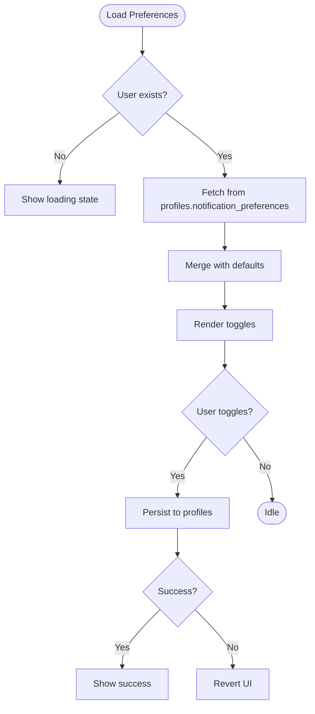

**Diagram sources**
- [NotificationPreferences.tsx:45-83](file://src/components/NotificationPreferences.tsx#L45-L83)

**Section sources**
- [NotificationPreferences.tsx:17-37](file://src/components/NotificationPreferences.tsx#L17-L37)
- [NotificationPreferences.tsx:85-122](file://src/components/NotificationPreferences.tsx#L85-L122)
- [NotificationPreferences.tsx:51-66](file://src/components/NotificationPreferences.tsx#L51-L66)
- [NotificationPreferences.tsx:68-83](file://src/components/NotificationPreferences.tsx#L68-L83)

### Settings Page
Central hub for:
- Notification preferences (push, email, reminders, order updates, weekly summary, promotional emails)
- Subscription management (pause/resume)
- Personal information and privacy settings
- Security actions (password change, account deletion guidance)

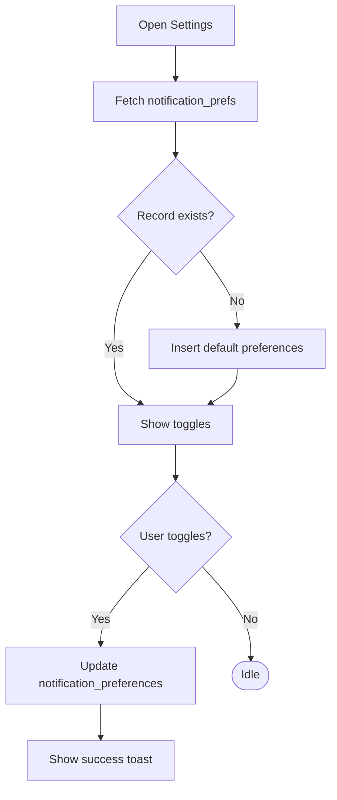

**Diagram sources**
- [Settings.tsx:61-109](file://src/pages/Settings.tsx#L61-L109)
- [Settings.tsx:111-140](file://src/pages/Settings.tsx#L111-L140)

**Section sources**
- [Settings.tsx:30-40](file://src/pages/Settings.tsx#L30-L40)
- [Settings.tsx:61-109](file://src/pages/Settings.tsx#L61-L109)
- [Settings.tsx:111-140](file://src/pages/Settings.tsx#L111-L140)

### Notifications Inbox
Real-time inbox with:
- Filtering by type (orders, meals, offers)
- Mark as read/unread
- Delete notifications
- Live updates via Supabase channels

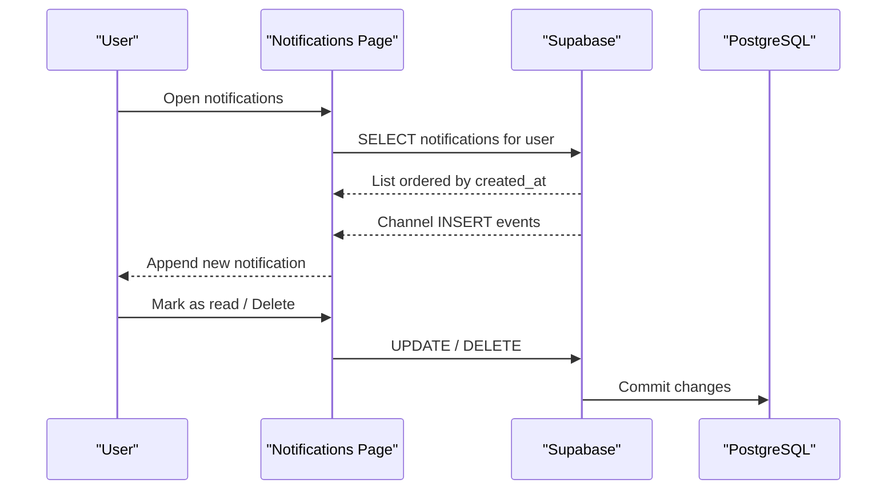

**Diagram sources**
- [Notifications.tsx:67-97](file://src/pages/Notifications.tsx#L67-L97)
- [Notifications.tsx:99-135](file://src/pages/Notifications.tsx#L99-L135)

**Section sources**
- [Notifications.tsx:21-30](file://src/pages/Notifications.tsx#L21-L30)
- [Notifications.tsx:67-97](file://src/pages/Notifications.tsx#L67-L97)
- [Notifications.tsx:99-135](file://src/pages/Notifications.tsx#L99-L135)

### Delivery Notifications Hook
Handles browser-level delivery updates and real-time status changes for delivery jobs.

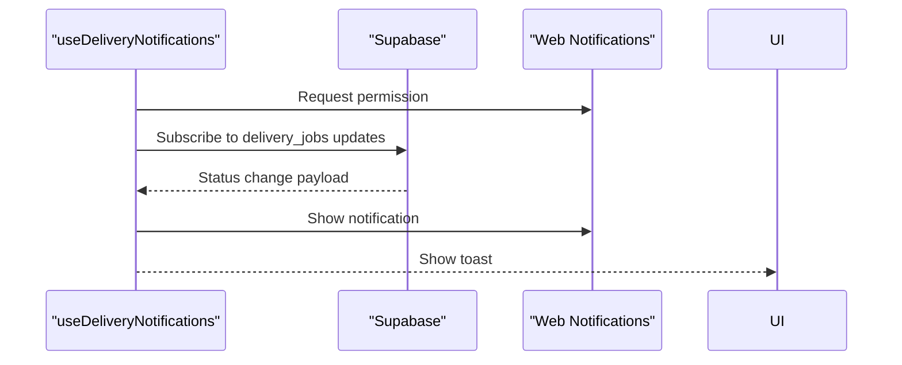

**Diagram sources**
- [useDeliveryNotifications.ts:13-29](file://src/hooks/useDeliveryNotifications.ts#L13-L29)
- [useDeliveryNotifications.ts:31-135](file://src/hooks/useDeliveryNotifications.ts#L31-L135)

**Section sources**
- [useDeliveryNotifications.ts:10-139](file://src/hooks/useDeliveryNotifications.ts#L10-L139)

### Scheduled Meal Notifications Hook
Retrieves and displays upcoming scheduled meal notifications with dismissal and navigation actions.

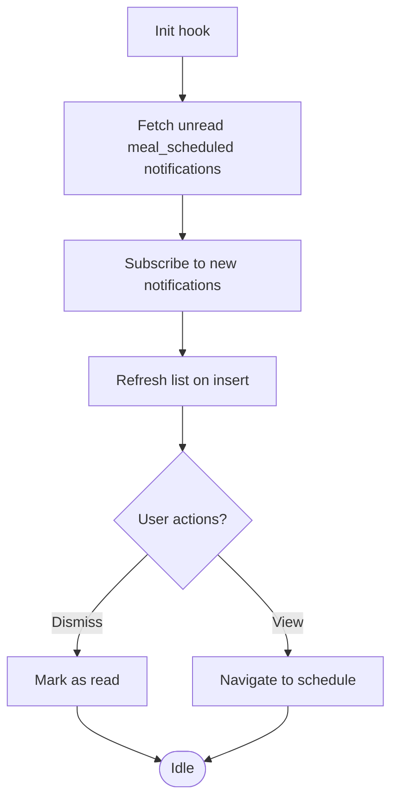

**Diagram sources**
- [useScheduledMealNotifications.tsx:39-71](file://src/hooks/useScheduledMealNotifications.tsx#L39-L71)
- [useScheduledMealNotifications.tsx:95-118](file://src/hooks/useScheduledMealNotifications.tsx#L95-L118)

**Section sources**
- [useScheduledMealNotifications.tsx:33-127](file://src/hooks/useScheduledMealNotifications.tsx#L33-L127)

### Notification Helpers
Provides helper functions to create notifications and dispatch common order/delivery events.

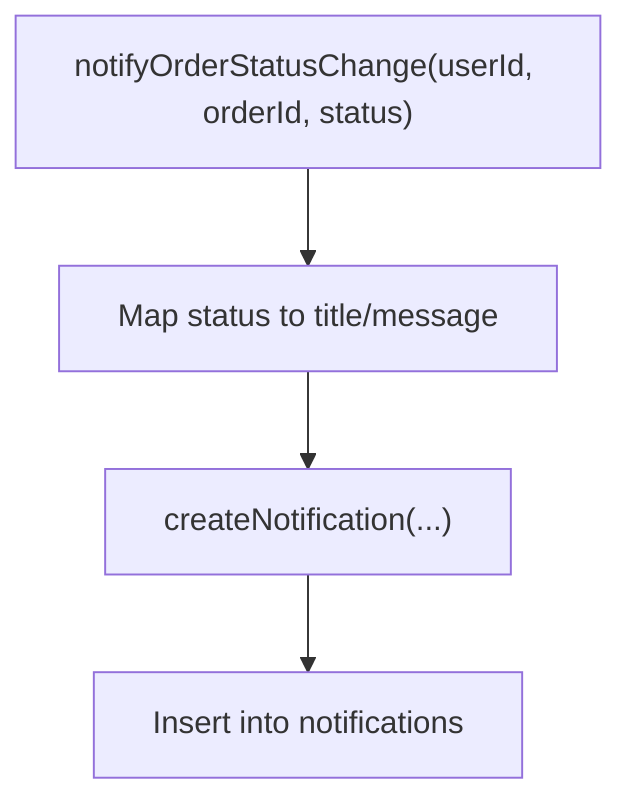

**Diagram sources**
- [notifications.ts:38-81](file://src/lib/notifications.ts#L38-L81)
- [notifications.ts:18-35](file://src/lib/notifications.ts#L18-L35)

**Section sources**
- [notifications.ts:3-8](file://src/lib/notifications.ts#L3-L8)
- [notifications.ts:10-16](file://src/lib/notifications.ts#L10-L16)
- [notifications.ts:18-81](file://src/lib/notifications.ts#L18-L81)

### Push Notification Delivery Function
Serverless function that sends push notifications via Firebase Cloud Messaging and records results.

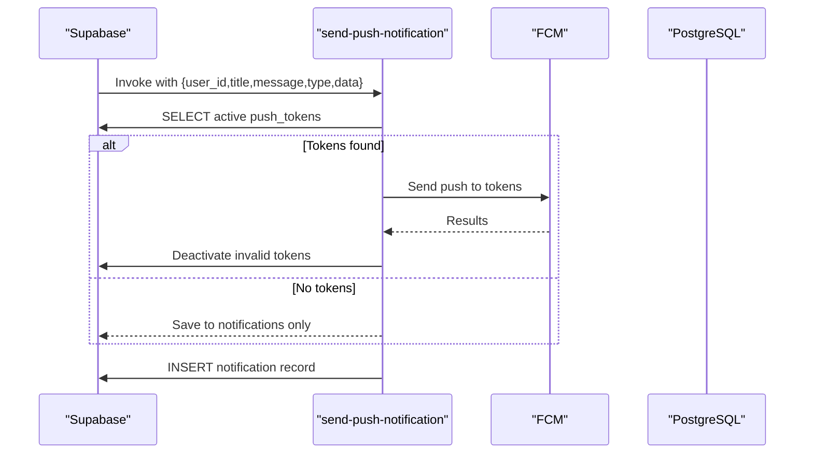

**Diagram sources**
- [send-push-notification/index.ts:178-299](file://supabase/functions/send-push-notification/index.ts#L178-L299)
- [send-push-notification/index.ts:213-239](file://supabase/functions/send-push-notification/index.ts#L213-L239)
- [send-push-notification/index.ts:244-271](file://supabase/functions/send-push-notification/index.ts#L244-L271)
- [send-push-notification/index.ts:273-281](file://supabase/functions/send-push-notification/index.ts#L273-L281)

**Section sources**
- [send-push-notification/index.ts:7-14](file://supabase/functions/send-push-notification/index.ts#L7-L14)
- [send-push-notification/index.ts:213-239](file://supabase/functions/send-push-notification/index.ts#L213-L239)
- [send-push-notification/index.ts:244-271](file://supabase/functions/send-push-notification/index.ts#L244-L271)
- [send-push-notification/index.ts:273-281](file://supabase/functions/send-push-notification/index.ts#L273-L281)

### Account Security and Settings
- Password management: Change password flow with validation and error handling.
- Two-factor authentication: Biometric login support for native platforms.
- Account deletion: Guidance routed to support.

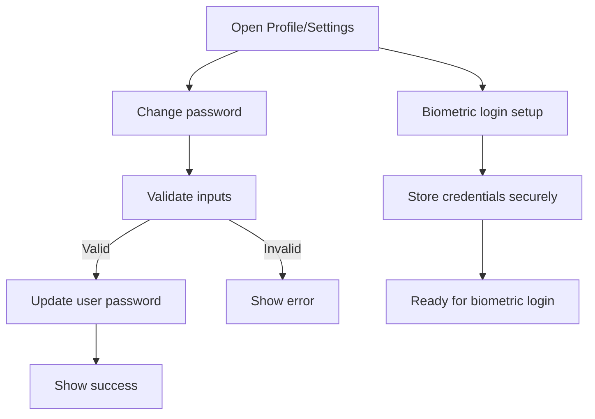

**Diagram sources**
- [Profile.tsx:432-475](file://src/pages/Profile.tsx#L432-L475)
- [Profile.tsx:482-487](file://src/pages/Profile.tsx#L482-L487)
- [Profile.tsx:288-294](file://src/pages/Profile.tsx#L288-L294)

**Section sources**
- [Profile.tsx:288-294](file://src/pages/Profile.tsx#L288-L294)
- [Profile.tsx:432-475](file://src/pages/Profile.tsx#L432-L475)
- [Profile.tsx:482-487](file://src/pages/Profile.tsx#L482-L487)

## Dependency Analysis
- Frontend components depend on Supabase client for reads/writes.
- Real-time updates rely on Supabase Postgres changes and browser Web Notifications.
- Push notifications depend on a serverless function and Firebase Cloud Messaging.
- Data models include profiles, notification_preferences, notifications, and push_tokens.

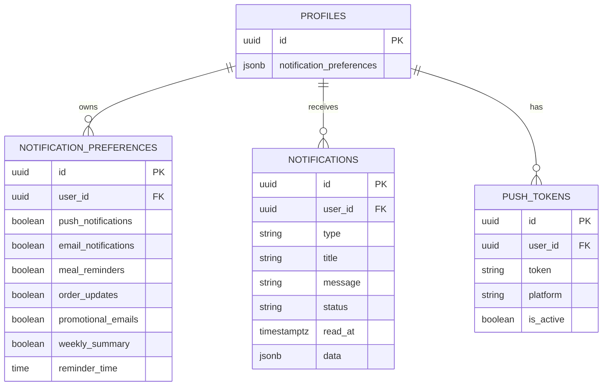

**Diagram sources**
- [types.ts:1-800](file://src/integrations/supabase/types.ts#L1-L800)
- [Settings.tsx:68-96](file://src/pages/Settings.tsx#L68-L96)
- [NotificationPreferences.tsx:52-56](file://src/components/NotificationPreferences.tsx#L52-L56)

**Section sources**
- [types.ts:1-800](file://src/integrations/supabase/types.ts#L1-L800)
- [Settings.tsx:68-96](file://src/pages/Settings.tsx#L68-L96)
- [NotificationPreferences.tsx:52-56](file://src/components/NotificationPreferences.tsx#L52-L56)

## Performance Considerations
- Minimize redundant writes by batching preference updates and using optimistic UI with revert on error.
- Use efficient filters and pagination in the notifications inbox.
- Debounce frequent toggles to avoid excessive network requests.
- Cache defaults locally to reduce latency on first load.
- For push notifications, batch sends and handle token deactivation asynchronously.

## Troubleshooting Guide
- Preferences not saving:
  - Verify user session and network connectivity.
  - Check toast feedback and revert behavior on error.
- No push notifications received:
  - Confirm active push tokens and platform registration.
  - Review serverless function logs for token invalidation and delivery results.
- Browser notifications not appearing:
  - Ensure Notification permission is granted.
  - Check browser notification settings and site permissions.
- Password change failures:
  - Validate minimum length and matching confirmation.
  - Confirm error messages and retry with corrected inputs.

**Section sources**
- [NotificationPreferences.tsx:77-82](file://src/components/NotificationPreferences.tsx#L77-L82)
- [Settings.tsx:130-139](file://src/pages/Settings.tsx#L130-L139)
- [useDeliveryNotifications.ts:13-29](file://src/hooks/useDeliveryNotifications.ts#L13-L29)
- [Profile.tsx:432-475](file://src/pages/Profile.tsx#L432-L475)

## Compliance and Security Notes
- Password reset emails include expiration notices and safe handling guidance.
- Biometric credential storage is platform-specific and secure.
- Push token deactivation occurs automatically for invalid/unregistered tokens.

**Section sources**
- [reset-password.html:63-85](file://supabase/email-templates/reset-password.html#L63-L85)
- [Profile.tsx:432-475](file://src/pages/Profile.tsx#L432-L475)
- [send-push-notification/index.ts:259-271](file://supabase/functions/send-push-notification/index.ts#L259-L271)

## Conclusion
The notification and settings system provides flexible, real-time communication controls with robust backend integration. Users can tailor their experience across channels, manage subscriptions, and maintain strong account security. The modular architecture supports scalability and future enhancements such as advanced scheduling and compliance reporting.